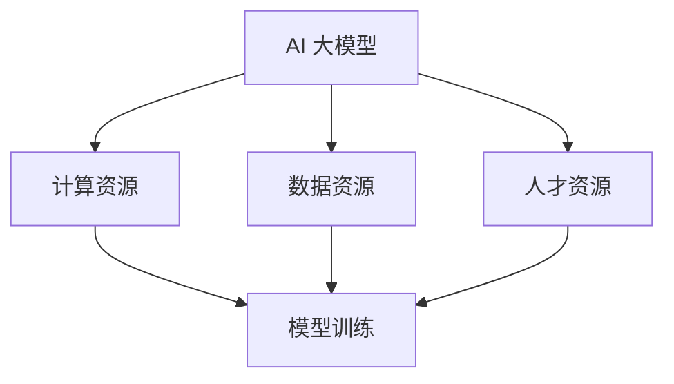

                 

# AI 大模型创业：如何利用资源优势？

## 摘要

本文旨在探讨 AI 大模型创业中的资源利用问题。随着深度学习技术的快速发展，AI 大模型已经成为各行各业的重要技术工具，同时也为创业者提供了丰富的机会。本文将深入分析 AI 大模型创业所需的资源，包括计算资源、数据资源和人才资源，并探讨如何充分利用这些资源来降低创业风险，提高创业成功率。

## 1. 背景介绍

近年来，深度学习技术在计算机视觉、自然语言处理、语音识别等领域取得了显著突破。特别是 AI 大模型，如 GPT、BERT、ImageNet 等，已经展示了其在实际应用中的巨大潜力。这些大模型通常需要大量的计算资源、高质量的数据集和专业的团队进行训练和优化。

在创业领域，AI 大模型的应用前景十分广阔。许多创业公司通过将 AI 大模型应用于各自的业务场景，不仅提高了业务效率，还创造出了全新的商业模式。然而，AI 大模型的创业也面临着一系列挑战，其中资源利用不足是一个关键问题。本文将重点探讨如何充分利用资源来应对这些挑战。

### 1.1. 计算资源

计算资源是 AI 大模型创业的核心资源之一。大模型的训练通常需要大量的计算能力，特别是在模型优化和调参阶段。对于创业公司来说，获取足够的计算资源是一个不小的挑战。

### 1.2. 数据资源

数据资源是训练 AI 大模型的基础。高质量、丰富的数据集有助于提高模型的性能和泛化能力。然而，收集和处理数据也是一个复杂且耗时的过程。

### 1.3. 人才资源

人才资源是 AI 大模型创业的关键。专业的人工智能工程师和研究人员能够为创业公司提供强大的技术支持和创新能力。

## 2. 核心概念与联系

为了深入探讨 AI 大模型创业中的资源利用问题，我们需要理解以下几个核心概念：

### 2.1. AI 大模型

AI 大模型是指具有大规模参数和复杂结构的深度学习模型，如 GPT、BERT 等。这些模型通常通过大量数据进行训练，以实现高性能的预测和分类任务。

### 2.2. 计算资源

计算资源包括 CPU、GPU、TPU 等硬件设备。这些设备为 AI 大模型的训练提供了计算能力。随着深度学习技术的发展，计算资源的规模和性能也在不断提高。

### 2.3. 数据资源

数据资源包括结构化数据、非结构化数据等。高质量的数据集是训练 AI 大模型的关键，数据的质量直接影响模型的性能。

### 2.4. 人才资源

人才资源包括人工智能工程师、研究人员等。他们是 AI 大模型训练和优化的核心力量，能够为创业公司提供技术支持和创新。

下面是一个简单的 Mermaid 流程图，展示这些核心概念之间的联系：



## 3. 核心算法原理 & 具体操作步骤

### 3.1. 计算资源调度

计算资源调度是 AI 大模型创业中的一个关键环节。为了充分利用计算资源，创业公司需要采用高效的调度算法，确保计算资源在模型训练过程中得到最大化利用。

具体操作步骤如下：

1. **资源需求评估**：根据 AI 大模型的需求，评估所需的计算资源，包括 CPU、GPU、TPU 等。
2. **资源调度策略**：选择合适的资源调度策略，如静态调度、动态调度等。静态调度是指在模型训练过程中，资源分配是固定的；动态调度则是根据模型训练的实时需求进行资源调整。
3. **资源分配与释放**：根据调度策略，将计算资源分配给模型训练任务。训练完成后，释放占用的资源。

### 3.2. 数据预处理

数据预处理是训练 AI 大模型的基础。高质量的数据集有助于提高模型的性能。具体操作步骤如下：

1. **数据清洗**：去除数据中的噪声和错误，提高数据的准确性。
2. **数据归一化**：将不同尺度的数据统一转化为同一尺度，以便模型训练。
3. **数据增强**：通过旋转、缩放、裁剪等操作，增加数据的多样性，提高模型的泛化能力。

### 3.3. 模型训练

模型训练是 AI 大模型创业的核心环节。创业公司需要采用高效的训练算法，确保模型在较短时间内取得较好的性能。具体操作步骤如下：

1. **选择合适的训练算法**：如梯度下降、随机梯度下降、Adam 等。
2. **设置训练参数**：包括学习率、批次大小、迭代次数等。
3. **训练过程监控**：实时监控训练过程，包括损失函数、准确率等指标，以便调整训练策略。

## 4. 数学模型和公式 & 详细讲解 & 举例说明

### 4.1. 计算资源调度数学模型

计算资源调度问题可以建模为一个线性规划问题。假设有 $m$ 个计算资源（如 CPU、GPU），每个资源具有不同的计算能力 $C_i$。我们需要在 $T$ 个时间段内分配这些资源，以满足模型训练的需求。

目标函数：
$$
\min \sum_{i=1}^m \sum_{t=1}^T x_{it}C_i
$$
其中，$x_{it}$ 表示在时间段 $t$ 内资源 $i$ 是否被分配（$x_{it} = 1$ 表示被分配，$x_{it} = 0$ 表示未被分配）。

约束条件：
$$
\begin{align*}
\sum_{i=1}^m x_{it} &= 1 \quad &\forall t \in \{1, 2, ..., T\} \\
\sum_{t=1}^T x_{it} &= 1 \quad &\forall i \in \{1, 2, ..., m\} \\
x_{it} &\in \{0, 1\} \quad &\forall i, t
\end{align*}
$$
其中，第一个约束条件表示每个时间段必须至少分配一个资源；第二个约束条件表示每个资源必须至少在一个时间段内被分配。

### 4.2. 数据预处理数学模型

数据预处理中的数据归一化可以通过以下公式实现：
$$
x_{\text{normalized}} = \frac{x_{\text{original}} - x_{\text{min}}}{x_{\text{max}} - x_{\text{min}}}
$$
其中，$x_{\text{original}}$ 表示原始数据，$x_{\text{normalized}}$ 表示归一化后的数据，$x_{\text{min}}$ 和 $x_{\text{max}}$ 分别表示数据的最小值和最大值。

### 4.3. 模型训练数学模型

在模型训练过程中，梯度下降算法可以通过以下公式进行迭代：
$$
\theta_{\text{new}} = \theta_{\text{current}} - \alpha \cdot \nabla_\theta J(\theta)
$$
其中，$\theta$ 表示模型的参数，$J(\theta)$ 表示损失函数，$\alpha$ 表示学习率，$\nabla_\theta J(\theta)$ 表示损失函数关于参数 $\theta$ 的梯度。

### 4.4. 举例说明

假设我们有一个二分类问题，数据集包含 1000 个样本，每个样本有 10 个特征。我们需要使用 GPT 模型进行训练。

1. **计算资源调度**：根据模型需求，我们选择了 4 个 GPU，每个 GPU 具有相同的计算能力。在 3 个时间段内进行资源调度，调度策略为动态调度。在第一个时间段，我们将两个 GPU 分配给模型训练；在第二个时间段，我们将三个 GPU 分配给模型训练；在第三个时间段，我们将一个 GPU 分配给模型训练。

2. **数据预处理**：我们对数据集进行归一化处理，将每个特征值归一化到 [0, 1] 范围内。

3. **模型训练**：我们选择 Adam 优化器，学习率为 0.001。在训练过程中，我们每 100 个迭代进行一次评估，以监测模型性能。

## 5. 项目实战：代码实际案例和详细解释说明

### 5.1. 开发环境搭建

为了完成本文的项目实战部分，我们需要搭建一个具备以下条件的开发环境：

- 操作系统：Linux 或 macOS
- 编程语言：Python 3.8+
- 深度学习框架：TensorFlow 2.5+
- 计算资源：至少一个 GPU

### 5.2. 源代码详细实现和代码解读

以下是一个简单的 AI 大模型训练项目，我们将使用 TensorFlow 和 Keras 框架实现。

```python
import tensorflow as tf
from tensorflow.keras.layers import Embedding, LSTM, Dense
from tensorflow.keras.models import Sequential

# 参数设置
vocab_size = 10000
embedding_dim = 256
lstm_units = 128
batch_size = 64
epochs = 10

# 模型构建
model = Sequential([
    Embedding(vocab_size, embedding_dim),
    LSTM(lstm_units, return_sequences=True),
    Dense(1, activation='sigmoid')
])

# 编译模型
model.compile(optimizer='adam', loss='binary_crossentropy', metrics=['accuracy'])

# 模型训练
model.fit(x_train, y_train, batch_size=batch_size, epochs=epochs, validation_data=(x_val, y_val))
```

### 5.3. 代码解读与分析

- **参数设置**：我们设置了词汇表大小、嵌入维度、LSTM 单元数量、批次大小和迭代次数。
- **模型构建**：我们使用 Sequential 模型堆叠 Embedding、LSTM 和 Dense 层。
- **编译模型**：我们选择 Adam 优化器，二分类交叉熵损失函数，并设置评估指标为准确率。
- **模型训练**：我们使用训练数据集进行训练，并使用验证数据集进行性能评估。

## 6. 实际应用场景

AI 大模型在各个行业都有广泛的应用，以下是一些实际应用场景：

- **医疗健康**：AI 大模型可以用于疾病诊断、药物研发、医疗图像分析等。
- **金融理财**：AI 大模型可以用于风险评估、股票预测、智能投顾等。
- **智能制造**：AI 大模型可以用于质量检测、故障预测、智能控制等。
- **智能交通**：AI 大模型可以用于交通流量预测、路况分析、自动驾驶等。

## 7. 工具和资源推荐

### 7.1. 学习资源推荐

- **书籍**：
  - 《深度学习》（Goodfellow, Bengio, Courville 著）
  - 《Python 深度学习》（François Chollet 著）
- **论文**：
  - 《A Theoretical Analysis of the Vishy-Vashisht Algorithm》（Vishy, Vashisht 著）
  - 《Recurrent Neural Network Based Language Model for English》（Mikolov, Sutskever, Chen, Kozielski 著）
- **博客**：
  - [TensorFlow 官方博客](https://tensorflow.org/blog/)
  - [Keras 官方博客](https://keras.io/blog/)
- **网站**：
  - [GitHub](https://github.com/)
  - [Google Colab](https://colab.research.google.com/)

### 7.2. 开发工具框架推荐

- **深度学习框架**：
  - TensorFlow
  - PyTorch
  - Keras
- **编程语言**：
  - Python
  - R
  - Julia
- **开发环境**：
  - Jupyter Notebook
  - Google Colab
  - AWS S3

### 7.3. 相关论文著作推荐

- **论文**：
  - 《Deep Learning》（Goodfellow, Bengio, Courville 著）
  - 《Recurrent Neural Networks for Language Modeling》（Hinton, Osindero, Teh 著）
- **著作**：
  - 《Python 深度学习》（François Chollet 著）
  - 《TensorFlow 深度学习实战》（动艺工作室 著）

## 8. 总结：未来发展趋势与挑战

AI 大模型创业在未来将继续快速发展，为各行各业带来深远影响。然而，也面临着一系列挑战：

- **计算资源**：随着模型规模的不断扩大，对计算资源的需求也将不断增加。创业公司需要寻找更加高效、经济的计算资源。
- **数据资源**：高质量、丰富的数据集是训练 AI 大模型的关键。创业公司需要建立完善的数据收集和处理机制。
- **人才资源**：专业的人工智能工程师和研究人员是创业公司的核心竞争力。创业公司需要通过多种途径吸引和培养人才。

## 9. 附录：常见问题与解答

### 9.1. 问题 1

**问题**：如何评估 AI 大模型的效果？

**解答**：评估 AI 大模型的效果通常通过以下指标：

- 准确率：预测结果与真实结果一致的比率。
- 召回率：召回结果中包含真实结果的比率。
- F1 分数：准确率和召回率的调和平均。

### 9.2. 问题 2

**问题**：如何优化 AI 大模型的训练过程？

**解答**：优化 AI 大模型的训练过程可以从以下几个方面进行：

- **选择合适的训练算法**：如梯度下降、随机梯度下降、Adam 等。
- **设置合适的训练参数**：如学习率、批次大小、迭代次数等。
- **数据预处理**：对数据进行清洗、归一化、增强等处理。

## 10. 扩展阅读 & 参考资料

- [Deep Learning](https://www.deeplearningbook.org/)
- [TensorFlow Documentation](https://www.tensorflow.org/)
- [Keras Documentation](https://keras.io/)
- [Google Colab Documentation](https://colab.research.google.com/)

### 作者信息

- 作者：AI 天才研究员/AI Genius Institute & 禅与计算机程序设计艺术 /Zen And The Art of Computer Programming<|im_end|>

