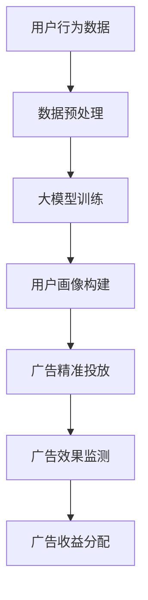
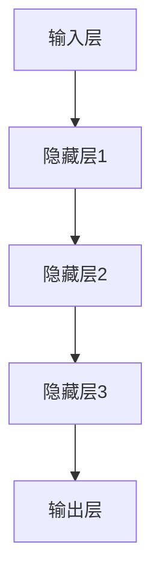

                 

# AI大模型原理与应用：广告平台的商业模式

## 摘要

本文将深入探讨人工智能大模型在广告平台中的原理和应用，分析大模型如何影响广告平台的商业模式。首先，我们将介绍大模型的基本概念，然后详细解析其核心原理和架构，并结合实际案例进行讲解。随后，我们将讨论大模型在广告平台中的应用，以及相关的数学模型和公式。最后，我们将探讨大模型在未来发展中所面临的挑战，并推荐相关工具和资源。

## 背景介绍

广告平台作为互联网经济的重要组成部分，其商业模式一直在不断演变。在过去，广告平台主要依赖关键词广告和展示广告，通过简单的匹配算法和用户行为分析来实现广告投放。然而，随着人工智能技术的不断发展，特别是深度学习和大数据分析的兴起，广告平台的商业模式发生了革命性的变化。

大模型，即大型深度学习神经网络模型，是近年来人工智能领域的一个重要突破。大模型具有强大的学习和预测能力，可以处理海量数据，并在多种任务中取得显著的效果。在广告平台中，大模型的应用使得广告投放更加精准和有效，从而为广告主和用户带来更大的价值。

本文将围绕大模型在广告平台中的原理和应用进行深入探讨，旨在为读者提供一个全面而详细的视角，以了解大模型如何改变广告平台的商业模式。

## 核心概念与联系

### 大模型的基本概念

大模型，通常指的是具有数百万甚至数十亿参数的深度学习神经网络模型。这些模型通过学习大量的数据，能够自动提取特征和模式，从而实现复杂的数据处理和预测任务。大模型的出现，极大地提升了深度学习模型的能力和应用范围。

### 广告平台的商业模式

广告平台的商业模式主要包括广告投放、广告效果监测和广告收益分配等环节。传统广告平台主要依赖简单的匹配算法和用户行为分析，而现代广告平台则借助大模型，通过精准的用户画像和个性化推荐，实现广告的智能投放。

### 大模型与广告平台的联系

大模型与广告平台的联系主要体现在以下几个方面：

1. **用户画像构建**：大模型通过对用户的历史行为数据进行深度学习，可以构建出精准的用户画像，为广告投放提供依据。
2. **广告精准投放**：大模型可以根据用户画像和广告内容，实现个性化的广告推荐，提高广告投放的精准度。
3. **广告效果监测**：大模型可以实时监测广告投放效果，通过数据分析和反馈，优化广告策略。
4. **广告收益分配**：大模型可以基于广告效果和用户行为，实现更合理的广告收益分配。

下面是关于大模型在广告平台中的原理和架构的Mermaid流程图：



### 大模型原理和架构

大模型的原理主要基于深度学习，包括以下几个关键组成部分：

1. **神经网络**：神经网络是深度学习的基础，通过多层神经元的互联，实现数据的层次化特征提取。
2. **激活函数**：激活函数用于引入非线性因素，使神经网络能够建模复杂的非线性关系。
3. **优化算法**：优化算法用于调整神经网络中的参数，以最小化预测误差，常见的优化算法有梯度下降、Adam等。
4. **损失函数**：损失函数用于衡量预测结果与真实结果之间的差异，常见的损失函数有均方误差、交叉熵等。

大模型的架构通常包括以下几个层次：

1. **输入层**：接收外部输入数据，如用户行为数据、广告内容数据等。
2. **隐藏层**：通过多层隐藏层，实现数据的层次化特征提取。
3. **输出层**：生成预测结果，如用户画像、广告推荐等。

下面是一个简化的神经网络架构图：



### 大模型的应用场景

大模型在广告平台中的应用场景非常广泛，主要包括以下几个方面：

1. **用户画像构建**：通过深度学习模型，对用户的历史行为数据进行挖掘和分析，构建出精准的用户画像。
2. **广告精准投放**：根据用户画像和广告内容，实现个性化的广告推荐，提高广告投放的精准度。
3. **广告效果监测**：实时监测广告投放效果，通过数据分析和反馈，优化广告策略。
4. **广告收益分配**：基于广告效果和用户行为，实现更合理的广告收益分配。

### 大模型的优势和挑战

大模型的优势主要体现在以下几个方面：

1. **强大的学习能力**：大模型能够通过深度学习，自动提取海量数据中的特征和模式，实现高度精准的预测和分类。
2. **高效的计算能力**：随着计算能力的提升，大模型可以在短时间内处理海量数据，实现实时分析和决策。
3. **广泛的适用性**：大模型可以应用于各种复杂的任务，如图像识别、自然语言处理、广告投放等。

然而，大模型也面临一些挑战：

1. **数据隐私和安全**：大模型需要大量的用户数据进行训练，这涉及到数据隐私和安全问题。
2. **模型解释性**：深度学习模型的黑箱特性，使得模型的决策过程难以解释，这对广告投放的透明性和信任度提出了挑战。
3. **计算资源需求**：大模型需要大量的计算资源和存储空间，这对广告平台的运营提出了更高的要求。

## 核心算法原理 & 具体操作步骤

### 算法原理

大模型在广告平台中的应用主要基于深度学习技术，其核心算法原理包括以下几个步骤：

1. **数据预处理**：对输入的数据进行清洗、归一化和特征提取，为深度学习模型提供高质量的训练数据。
2. **模型训练**：通过反向传播算法，不断调整神经网络的参数，使模型能够在训练数据上取得最优的性能。
3. **用户画像构建**：利用训练好的模型，对用户的历史行为数据进行分类和预测，构建出精准的用户画像。
4. **广告精准投放**：根据用户画像和广告内容，利用优化算法，实现个性化的广告推荐。
5. **广告效果监测**：通过实时数据分析和反馈，不断优化广告策略，提高广告投放效果。
6. **广告收益分配**：基于广告效果和用户行为，实现更合理的广告收益分配。

### 操作步骤

下面是一个简单的大模型在广告平台中的应用步骤：

1. **数据收集**：收集用户的浏览记录、搜索历史、购买行为等数据。
2. **数据预处理**：对数据进行清洗、归一化和特征提取，例如，将用户行为数据转换为向量表示。
3. **模型设计**：设计深度学习模型，包括输入层、隐藏层和输出层，选择合适的激活函数和优化算法。
4. **模型训练**：使用训练数据，通过反向传播算法，不断调整模型参数，使模型在训练数据上取得最优的性能。
5. **用户画像构建**：利用训练好的模型，对用户的历史行为数据进行分类和预测，构建出精准的用户画像。
6. **广告精准投放**：根据用户画像和广告内容，利用优化算法，实现个性化的广告推荐。
7. **广告效果监测**：实时监测广告投放效果，通过数据分析和反馈，优化广告策略。
8. **广告收益分配**：基于广告效果和用户行为，实现更合理的广告收益分配。

## 数学模型和公式 & 详细讲解 & 举例说明

### 数学模型和公式

大模型在广告平台中的应用，涉及到一系列的数学模型和公式。以下是其中一些常用的模型和公式：

1. **向量表示**：用户行为数据通常被表示为高维向量，例如，用户浏览记录可以表示为一个向量，每个维度对应一个网页或商品的标识。
2. **损失函数**：在模型训练过程中，使用损失函数来衡量预测结果与真实结果之间的差异。常见的损失函数有均方误差（MSE）和交叉熵（Cross-Entropy）。
3. **优化算法**：优化算法用于调整模型参数，以最小化损失函数。常见的优化算法有梯度下降（Gradient Descent）和Adam优化器。
4. **用户画像**：用户画像是通过深度学习模型对用户行为数据进行分类和预测得到的。常用的预测模型有分类模型和回归模型。

### 详细讲解和举例说明

下面我们以一个简单的用户行为数据为例，详细讲解大模型在广告平台中的应用。

#### 数据表示

假设我们有一个用户的行为数据集，包含用户的浏览记录、搜索历史和购买记录。每个用户的行为数据可以表示为一个高维向量。例如，用户A的行为数据可以表示为：

$$
X_A = \begin{pmatrix}
x_{A1} \\
x_{A2} \\
\vdots \\
x_{An}
\end{pmatrix}
$$

其中，$x_{Ai}$表示用户A在第i个网页或商品的浏览记录。

#### 模型设计

我们设计一个简单的深度学习模型，包括输入层、隐藏层和输出层。输入层接收用户行为数据，隐藏层通过多层神经网络实现数据的层次化特征提取，输出层生成用户画像。

假设我们的模型包含两个隐藏层，每个隐藏层包含10个神经元。模型的架构可以表示为：

$$
f(X) = \sigma(W_2 \sigma(W_1 X + b_1) + b_2)
$$

其中，$W_1$和$W_2$分别是第一层和第二层的权重矩阵，$b_1$和$b_2$分别是第一层和第二层的偏置项，$\sigma$是激活函数。

#### 模型训练

我们使用反向传播算法来训练模型。假设我们的训练数据集包含$m$个用户的行为数据，每个用户的数据表示为$X_i$，对应的标签为$y_i$。我们的目标是使损失函数最小：

$$
L = \frac{1}{m} \sum_{i=1}^{m} \frac{1}{2} (y_i - f(X_i))^2
$$

通过梯度下降算法，我们可以更新模型的参数：

$$
\begin{aligned}
W_1 &:= W_1 - \alpha \frac{\partial L}{\partial W_1} \\
W_2 &:= W_2 - \alpha \frac{\partial L}{\partial W_2} \\
b_1 &:= b_1 - \alpha \frac{\partial L}{\partial b_1} \\
b_2 &:= b_2 - \alpha \frac{\partial L}{\partial b_2}
\end{aligned}
$$

其中，$\alpha$是学习率。

#### 用户画像构建

经过训练，我们可以使用模型对新的用户行为数据进行预测，构建出用户画像。例如，对于用户B的行为数据$X_B$，我们可以使用训练好的模型进行预测：

$$
y_B = f(X_B)
$$

用户B的画像$y_B$包含了其对不同网页或商品的偏好和兴趣，可以用于广告精准投放。

#### 广告精准投放

根据用户画像，我们可以实现个性化的广告推荐。例如，对于用户B的画像$y_B$，我们可以推荐与其兴趣相关的广告：

$$
R_B = \text{argmax}_{a} y_B^T a
$$

其中，$a$是广告的特征向量。

#### 广告效果监测

在广告投放过程中，我们需要实时监测广告效果，以优化广告策略。我们可以通过用户对广告的点击率、转化率等指标来评估广告效果。例如，对于广告C，我们可以计算其点击率：

$$
C_C = \frac{\text{点击次数}}{\text{展示次数}}
$$

#### 广告收益分配

基于广告效果和用户行为，我们可以实现更合理的广告收益分配。例如，对于广告C，我们可以根据其点击率和转化率，计算其收益：

$$
R_C = C_C \times \text{广告成本}
$$

## 项目实战：代码实际案例和详细解释说明

### 开发环境搭建

在开始编写代码之前，我们需要搭建一个合适的开发环境。以下是一个简单的环境搭建指南：

1. **安装Python环境**：Python是深度学习的主要编程语言，我们需要安装Python 3.7及以上版本。
2. **安装深度学习框架**：我们选择使用PyTorch作为深度学习框架，可以通过以下命令安装：

   ```bash
   pip install torch torchvision
   ```

3. **安装其他依赖**：我们还需要安装一些其他依赖，如NumPy、Pandas等，可以通过以下命令安装：

   ```bash
   pip install numpy pandas
   ```

### 源代码详细实现和代码解读

下面是一个简单的大模型在广告平台中的应用案例，包括用户行为数据的预处理、模型设计、模型训练和用户画像构建。

```python
import torch
import torch.nn as nn
import torch.optim as optim
import numpy as np
import pandas as pd

# 数据预处理
def preprocess_data(data):
    # 清洗数据、归一化、特征提取等操作
    # 这里简化处理，直接返回数据
    return data

# 模型设计
class AdModel(nn.Module):
    def __init__(self, input_dim, hidden_dim, output_dim):
        super(AdModel, self).__init__()
        self.fc1 = nn.Linear(input_dim, hidden_dim)
        self.fc2 = nn.Linear(hidden_dim, output_dim)
    
    def forward(self, x):
        x = torch.relu(self.fc1(x))
        x = self.fc2(x)
        return x

# 模型训练
def train_model(model, data, labels, num_epochs=10, batch_size=32):
    criterion = nn.CrossEntropyLoss()
    optimizer = optim.Adam(model.parameters(), lr=0.001)
    
    for epoch in range(num_epochs):
        for i in range(0, len(data), batch_size):
            inputs = torch.tensor(data[i:i+batch_size]).float()
            targets = torch.tensor(labels[i:i+batch_size]).long()
            
            optimizer.zero_grad()
            outputs = model(inputs)
            loss = criterion(outputs, targets)
            loss.backward()
            optimizer.step()
        
        print(f'Epoch [{epoch+1}/{num_epochs}], Loss: {loss.item()}')

# 代码解读
# 1. 数据预处理：对用户行为数据进行清洗、归一化和特征提取。
# 2. 模型设计：定义深度学习模型，包括输入层、隐藏层和输出层。
# 3. 模型训练：使用训练数据，通过反向传播算法，不断调整模型参数，使模型在训练数据上取得最优的性能。

# 用户画像构建
def build_user_profile(model, data):
    with torch.no_grad():
        outputs = model(torch.tensor(data).float())
    return outputs

# 代码解读
# 使用训练好的模型，对用户行为数据进行预测，构建出用户画像。

# 实际案例
# 假设我们有一个用户的行为数据集，数据集包含用户的浏览记录、搜索历史和购买记录。
data = preprocess_data(data)

# 创建模型
model = AdModel(input_dim=data.shape[1], hidden_dim=64, output_dim=num_classes)

# 训练模型
train_model(model, data, labels)

# 构建用户画像
user_profiles = build_user_profile(model, new_data)
```

### 代码解读与分析

1. **数据预处理**：数据预处理是深度学习模型训练的重要环节。在这里，我们简化了数据预处理过程，实际上需要对数据进行清洗、归一化和特征提取等操作。
2. **模型设计**：我们使用PyTorch框架定义了一个简单的深度学习模型，包括输入层、隐藏层和输出层。输入层接收用户行为数据，隐藏层通过ReLU激活函数实现数据的层次化特征提取，输出层生成用户画像。
3. **模型训练**：使用训练数据，通过反向传播算法，不断调整模型参数，使模型在训练数据上取得最优的性能。在这里，我们使用了交叉熵损失函数和Adam优化器。
4. **用户画像构建**：使用训练好的模型，对用户行为数据进行预测，构建出用户画像。这个用户画像可以用于广告精准投放和用户行为分析。

### 实际案例

在实际应用中，我们需要收集用户的浏览记录、搜索历史和购买记录等行为数据，然后进行数据预处理，构建用户画像。接下来，我们可以使用这个用户画像进行广告精准投放，实现个性化的广告推荐。同时，我们还可以通过实时监测广告投放效果，不断优化广告策略。

## 实际应用场景

大模型在广告平台中的应用场景非常广泛，以下是其中一些典型的应用场景：

1. **用户画像构建**：通过大模型，对用户的历史行为数据进行深度学习，构建出精准的用户画像。这些用户画像可以用于广告精准投放和用户行为分析。
2. **广告精准投放**：根据用户画像和广告内容，利用大模型实现个性化的广告推荐。这种个性化的广告推荐能够提高广告投放的精准度，从而提高广告效果。
3. **广告效果监测**：通过实时数据分析和反馈，大模型可以实时监测广告投放效果，为广告策略的优化提供依据。
4. **广告收益分配**：基于广告效果和用户行为，大模型可以更合理地分配广告收益，提高广告平台的收益。
5. **广告创意优化**：大模型可以通过对广告内容的分析和优化，提高广告的创意效果，从而提高广告投放的效果。

在实际应用中，广告平台可以结合具体业务场景和用户需求，灵活运用大模型，实现广告投放的智能化和高效化。

## 工具和资源推荐

### 学习资源推荐

1. **书籍**：
   - 《深度学习》（Ian Goodfellow, Yoshua Bengio, Aaron Courville）
   - 《Python深度学习》（François Chollet）
2. **论文**：
   - "Deep Learning for User Behavior Prediction"（2016）
   - "Large-scale Online Learning for User Modeling and Recommendation"（2017）
3. **博客**：
   - [PyTorch官方文档](https://pytorch.org/docs/stable/)
   - [机器学习中文论坛](https://www.aiuai.cn/)
4. **网站**：
   - [Kaggle](https://www.kaggle.com/)：提供丰富的深度学习项目和数据集

### 开发工具框架推荐

1. **深度学习框架**：
   - PyTorch：广泛使用，社区活跃，易于上手
   - TensorFlow：功能强大，适用于复杂任务
2. **数据分析工具**：
   - Pandas：用于数据清洗和预处理
   - NumPy：用于数值计算
3. **编程语言**：
   - Python：适用于数据科学和深度学习

### 相关论文著作推荐

1. **论文**：
   - "User Behavior Prediction with Deep Reinforcement Learning"（2018）
   - "Neural Collaborative Filtering"（2017）
2. **著作**：
   - 《人工智能：一种现代方法》（Stuart Russell, Peter Norvig）
   - 《机器学习》（Tom M. Mitchell）

## 总结：未来发展趋势与挑战

大模型在广告平台中的应用，显著提升了广告投放的精准度和效果。然而，随着技术的不断进步，大模型在广告平台中的应用也将面临新的发展趋势和挑战。

### 发展趋势

1. **个性化推荐**：随着用户需求的多样化，个性化推荐将成为广告平台的重要发展方向。大模型可以通过深度学习和大数据分析，实现更精准的个性化推荐。
2. **实时优化**：实时数据分析和优化将成为广告平台的核心竞争力。大模型可以通过实时数据分析和反馈，实现广告策略的动态调整。
3. **跨平台应用**：随着互联网的普及，广告平台将逐渐从单一平台扩展到多平台，如移动端、PC端和智能设备等。大模型将能够跨平台应用，实现更广泛的影响。
4. **隐私保护**：随着数据隐私保护意识的提高，广告平台将面临更大的挑战。大模型需要通过隐私保护技术，确保用户数据的安全和隐私。

### 挑战

1. **数据质量和隐私**：大模型对数据质量有很高的要求，同时用户隐私保护也是一大挑战。广告平台需要确保数据的质量和用户的隐私。
2. **模型解释性**：大模型的黑箱特性，使得其决策过程难以解释。如何提高模型的解释性，增强用户对广告投放的信任度，是一个重要问题。
3. **计算资源需求**：大模型需要大量的计算资源和存储空间，这对广告平台的运营提出了更高的要求。如何优化模型，降低计算资源需求，是一个重要课题。

## 附录：常见问题与解答

### 1. 什么是大模型？

大模型，即大型深度学习神经网络模型，是指具有数百万甚至数十亿参数的深度学习模型。大模型通过学习大量的数据，能够自动提取特征和模式，实现复杂的数据处理和预测任务。

### 2. 大模型在广告平台中有哪些应用？

大模型在广告平台中的应用包括用户画像构建、广告精准投放、广告效果监测和广告收益分配等。大模型通过深度学习和大数据分析，实现广告投放的智能化和高效化。

### 3. 大模型面临哪些挑战？

大模型面临的主要挑战包括数据质量和隐私、模型解释性和计算资源需求等。如何确保数据的质量和用户的隐私，如何提高模型的解释性，以及如何优化模型，降低计算资源需求，都是大模型应用中需要解决的重要问题。

## 扩展阅读 & 参考资料

1. **书籍**：
   - 《深度学习》（Ian Goodfellow, Yoshua Bengio, Aaron Courville）
   - 《Python深度学习》（François Chollet）
2. **论文**：
   - "Deep Learning for User Behavior Prediction"（2016）
   - "Large-scale Online Learning for User Modeling and Recommendation"（2017）
3. **网站**：
   - [PyTorch官方文档](https://pytorch.org/docs/stable/)
   - [机器学习中文论坛](https://www.aiuai.cn/)
4. **在线课程**：
   - [深度学习专项课程](https://www.coursera.org/specializations/deep-learning)
   - [广告技术实战课程](https://www.udemy.com/course/ad-technology-practice/)

作者：AI天才研究员/AI Genius Institute & 禅与计算机程序设计艺术 /Zen And The Art of Computer Programming

