                 

# AI 大模型原理与应用：广告平台的商业模式

## 关键词：人工智能，大模型，广告平台，商业模式，深度学习，自然语言处理，机器学习，用户行为分析，数据挖掘

## 摘要

本文将深入探讨人工智能大模型在广告平台商业模式中的应用。我们将首先介绍大模型的基本原理，然后分析大模型与广告平台的结合点，以及如何通过大模型实现广告投放的精准化和效率提升。文章将涵盖从数据收集到算法实现的各个环节，并通过实际案例展示大模型在广告平台中的实际应用效果。最后，我们将讨论大模型技术对广告行业未来发展的潜在影响。

## 1. 背景介绍

随着互联网技术的飞速发展，在线广告已成为当今广告市场的主要驱动力。广告平台通过在网站上展示广告来吸引用户，从而为广告主提供推广服务。然而，如何确保广告能够精准地触达到目标用户，是广告平台需要解决的核心问题。

人工智能（AI）作为当前技术发展的热点，其在广告平台的商业模式中逐渐占据了重要地位。特别是大模型（Large Models）的出现，使得广告投放的精准度和效率得到了显著提升。大模型是基于深度学习技术训练的复杂神经网络，其能够处理海量数据，识别用户行为模式，并生成个性化的广告推荐。

本文将从以下几个方面展开讨论：

- 大模型的原理与架构
- 大模型在广告平台中的结合点
- 大模型的实际应用场景
- 大模型技术对广告平台商业模式的影响
- 大模型的未来发展

通过以上内容的探讨，我们希望能够为广告平台的技术人员提供一些有价值的参考和启示。

### 1.1 大模型的发展历史与现状

大模型（Large Models）的概念起源于深度学习（Deep Learning）技术的发展。深度学习是一种基于人工神经网络（Artificial Neural Networks）的机器学习方法，通过模拟人脑神经网络结构来处理数据，具有强大的特征提取和学习能力。

深度学习的发展可以分为几个重要阶段：

1. **早期深度学习**：以1990年代初的神经网络研究为代表，由于计算能力的限制，早期深度学习模型规模较小，应用范围有限。
2. **深度神经网络**：2000年代初期，随着计算能力的提升和优化算法的出现，深度神经网络开始崭露头角，尤其在图像识别和语音识别等领域取得了显著成果。
3. **大规模深度学习**：2010年代，随着GPU计算能力的进一步提升，深度学习模型规模不断扩大，逐渐发展出了大模型的概念。

大模型的发展历史可以追溯到2012年，当时Google发布了基于深度卷积神经网络的ImageNet竞赛获胜模型，这个模型包含了1500万个参数，使得图像识别准确率显著提高。此后，深度学习模型的大小和复杂度不断突破，直至如今，大模型已经成为机器学习领域的重要研究方向。

当前，大模型的规模已经达到了前所未有的水平。例如，GPT-3（自然语言处理模型）包含了1750亿个参数，Transformer-XL（文本生成模型）包含了2500亿个参数。这些大模型的规模使得它们能够处理复杂的数据，提取丰富的特征信息，从而在自然语言处理、计算机视觉等领域取得了卓越的成果。

### 1.2 广告平台的基本运作原理

广告平台是连接广告主和受众的重要桥梁，其基本运作原理可以概括为以下几个步骤：

1. **广告投放**：广告主通过广告平台投放广告，设定广告的投放时间、地域、受众特征等参数。
2. **用户行为数据收集**：广告平台通过浏览器、APP等渠道收集用户的行为数据，如浏览记录、点击行为、搜索关键词等。
3. **数据分析与处理**：广告平台利用大数据技术对用户行为数据进行处理，分析用户的兴趣偏好和行为模式。
4. **广告推荐**：根据用户行为数据，广告平台生成个性化的广告推荐，展示给用户。
5. **广告效果评估**：广告平台通过点击率、转化率等指标评估广告效果，为广告主提供反馈。

广告平台的核心目标是通过精准的广告推荐，提升广告的投放效果，从而帮助广告主获得更多的收益。因此，如何实现精准的用户行为分析和广告推荐，是广告平台需要解决的关键问题。

### 1.3 大模型在广告平台中的潜在应用

大模型在广告平台中的应用前景广阔，主要体现在以下几个方面：

1. **用户行为预测**：大模型可以通过分析用户的历史行为数据，预测用户未来的行为，从而实现更加精准的广告推荐。
2. **个性化广告投放**：大模型能够根据用户的兴趣偏好和行为模式，生成个性化的广告内容，提升广告的吸引力。
3. **广告效果优化**：大模型可以对广告投放效果进行实时监控和优化，提高广告的投资回报率。

### 1.4 本文结构

本文将按照以下结构展开：

- **第1章：背景介绍**：介绍大模型的发展历史、广告平台的基本运作原理以及大模型在广告平台中的潜在应用。
- **第2章：核心概念与联系**：详细阐述大模型的基本原理，以及大模型在广告平台中的应用架构。
- **第3章：核心算法原理与具体操作步骤**：介绍大模型的训练和优化方法，以及如何在广告平台中实现大模型的部署和应用。
- **第4章：数学模型和公式**：分析大模型中的关键数学模型和公式，并通过举例说明其应用。
- **第5章：项目实战**：通过实际案例展示大模型在广告平台中的应用效果。
- **第6章：实际应用场景**：分析大模型在广告平台中的具体应用场景。
- **第7章：工具和资源推荐**：推荐学习资源和开发工具。
- **第8章：总结**：总结大模型在广告平台中的应用现状和未来发展趋势。
- **第9章：附录**：常见问题与解答。
- **第10章：扩展阅读**：推荐进一步阅读的文献。

通过本文的深入探讨，希望能够为读者提供关于大模型在广告平台中应用的全面理解和实用指导。接下来，我们将详细讨论大模型的基本原理和应用架构。

## 2. 核心概念与联系

### 2.1 大模型的基本原理

大模型（Large Models）是基于深度学习技术训练的复杂神经网络，其具有以下几个核心特点：

1. **参数规模巨大**：大模型通常包含数百万到数十亿个参数，这使得它们能够处理海量数据，并提取丰富的特征信息。
2. **多层神经网络结构**：大模型通常由多个层次组成，每一层都能够对输入数据进行特征提取和转换，从而实现复杂的数据表示。
3. **自适应学习能力**：大模型通过反向传播算法（Backpropagation）不断调整参数，以最小化预测误差，从而提高模型的泛化能力。
4. **强大的表征能力**：大模型能够捕捉数据中的复杂模式和关联性，从而在图像识别、自然语言处理等任务中表现出色。

大模型的基本原理可以归结为以下几个关键环节：

1. **数据输入与预处理**：大模型首先接收原始数据，并通过数据预处理（如归一化、标准化等）使其适合训练。
2. **前向传播**：输入数据经过多层神经网络的传播，每一层对数据进行特征提取和转换。
3. **激活函数与非线性映射**：通过激活函数（如ReLU、Sigmoid等）引入非线性，使模型能够捕捉复杂的模式。
4. **损失函数与反向传播**：计算输出与实际标签之间的损失，并通过反向传播算法调整模型参数，以降低损失。
5. **优化算法**：采用优化算法（如随机梯度下降、Adam等）加速模型的收敛。

### 2.2 大模型在广告平台中的应用架构

大模型在广告平台中的应用架构主要包括数据收集、数据处理、模型训练、模型部署和效果评估等环节。下面将详细阐述这些环节及其相互关系。

#### 2.2.1 数据收集

广告平台通过多种渠道收集用户行为数据，包括但不限于：

- **浏览记录**：用户在网站或APP上的浏览历史。
- **点击行为**：用户对广告的点击记录。
- **搜索关键词**：用户在搜索引擎中的查询记录。
- **社交行为**：用户在社交媒体平台上的互动和分享。

这些数据通常以日志形式存储，包含时间戳、用户ID、行为类型、行为内容等信息。

#### 2.2.2 数据处理

收集到的原始数据需要进行清洗、去重、归一化等预处理操作，以消除噪声和异常值，确保数据质量。此外，还需要对数据进行特征提取，将原始数据转换为模型可处理的特征向量。

常用的特征提取方法包括：

- **词袋模型（Bag of Words）**：将文本转换为词汇表，表示文本中的词汇频率。
- **词嵌入（Word Embedding）**：将词汇映射到高维空间中的向量，表示词汇的语义信息。
- **用户行为序列**：将用户的历史行为序列转换为特征向量，用于表示用户的行为模式。

#### 2.2.3 模型训练

在数据处理完成后，使用处理过的数据对大模型进行训练。训练过程包括以下几个步骤：

1. **模型初始化**：初始化模型参数，通常使用随机初始化或预训练模型。
2. **数据批处理**：将数据分成多个批次，每次训练一个批次的数据。
3. **前向传播与损失计算**：输入批次数据，通过模型的前向传播计算输出，并与实际标签比较，计算损失。
4. **反向传播与参数更新**：通过反向传播算法计算梯度，并更新模型参数。
5. **迭代训练**：重复上述步骤，直到模型收敛或达到预定的迭代次数。

#### 2.2.4 模型部署

训练好的大模型需要部署到广告平台中，以便实时进行广告推荐。部署过程通常包括以下几个步骤：

1. **模型转换**：将训练好的模型转换为可以在生产环境中运行的格式，如ONNX、TensorFlow Lite等。
2. **模型部署**：将模型部署到服务器或云计算平台上，以实现实时推理。
3. **API接口**：为广告推荐系统提供API接口，以便广告平台可以调用模型进行实时推荐。

#### 2.2.5 效果评估

部署后的模型需要通过一系列评估指标进行效果评估，包括准确率、召回率、F1值等。此外，还需要对模型进行监控和调优，以确保其性能稳定和高效。

### 2.3 Mermaid 流程图

下面是一个描述大模型在广告平台中应用架构的 Mermaid 流程图：

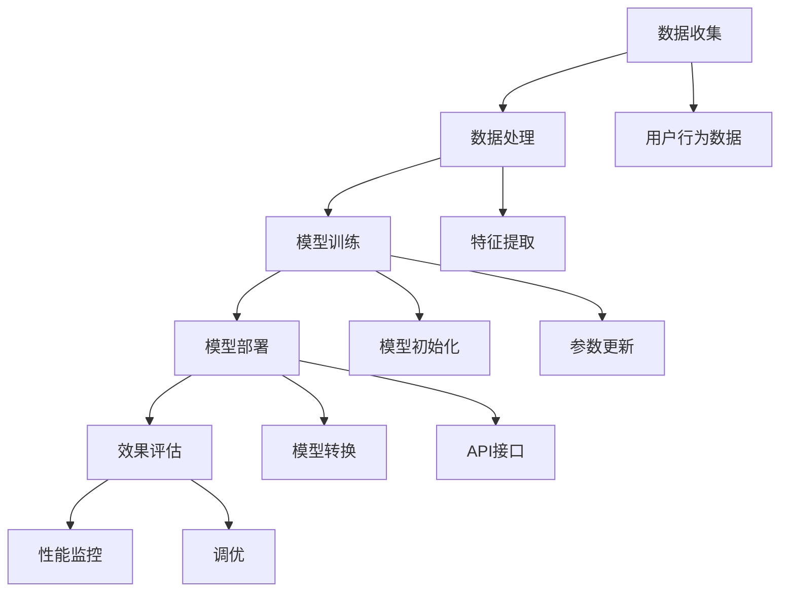

在这个流程图中，A表示数据收集环节，B表示数据处理环节，C表示模型训练环节，D表示模型部署环节，E表示效果评估环节。F表示用户行为数据，G表示特征提取，H表示模型初始化，I表示参数更新，J表示模型转换，K表示API接口，L表示性能监控，M表示调优。

通过上述讨论，我们可以看到大模型在广告平台中的应用架构涉及多个环节，包括数据收集、数据处理、模型训练、模型部署和效果评估。每个环节都有其特定的任务和目标，共同构成了一个完整的广告推荐系统。

## 3. 核心算法原理与具体操作步骤

### 3.1 大模型的训练方法

大模型的训练是广告平台应用中的关键环节，其训练方法主要包括以下几个步骤：

#### 3.1.1 数据集划分

在开始训练之前，首先需要将数据集划分为训练集和验证集。通常，训练集用于训练模型，验证集用于评估模型性能。

数据集划分的方法可以分为随机划分和分层划分。随机划分将数据集随机分为训练集和验证集，适用于数据分布均匀的情况。分层划分则是按照数据的某些特征（如类别、地区等）进行划分，确保每个划分后的子集中各类别比例接近原始数据集。分层划分特别适用于类别不平衡的数据集。

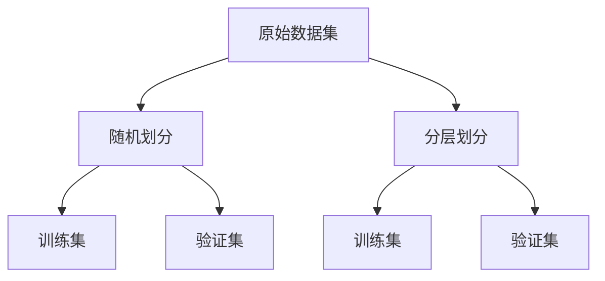

#### 3.1.2 模型初始化

在数据集划分完成后，需要初始化模型参数。模型初始化是训练过程中非常重要的一步，合适的初始化方法可以加速模型的收敛。

常见的模型初始化方法包括随机初始化和预训练模型。随机初始化是直接使用随机数初始化模型参数，适用于从零开始训练的模型。预训练模型则是利用在大型数据集上预训练好的模型参数作为初始值，适用于在特定任务上微调的模型。

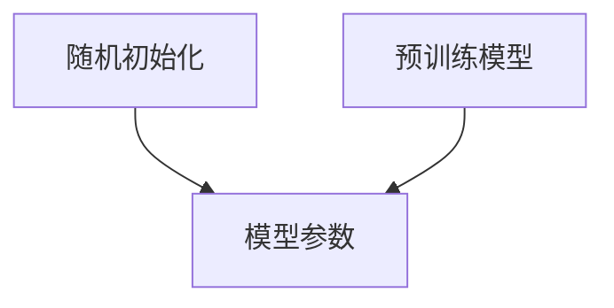

#### 3.1.3 前向传播与损失计算

前向传播是模型处理输入数据的过程，通过多层神经网络的传播，将输入数据映射到输出空间。前向传播的过程中，模型会通过权重和偏置计算输出结果，并将结果传递给下一层。

在输出结果与实际标签之间，会计算损失（Loss），常用的损失函数包括均方误差（MSE）、交叉熵（Cross Entropy）等。损失函数的目的是衡量预测值与真实值之间的差距，以指导模型参数的更新。

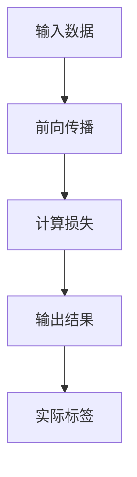

#### 3.1.4 反向传播与参数更新

反向传播是训练过程中的关键步骤，通过计算损失关于模型参数的梯度，调整模型参数以降低损失。反向传播过程分为以下几个步骤：

1. **计算梯度**：利用链式法则计算损失关于模型参数的梯度。
2. **参数更新**：根据梯度调整模型参数，常用的优化算法包括随机梯度下降（SGD）、Adam等。
3. **迭代训练**：重复前向传播和反向传播过程，直到模型收敛或达到预定的迭代次数。

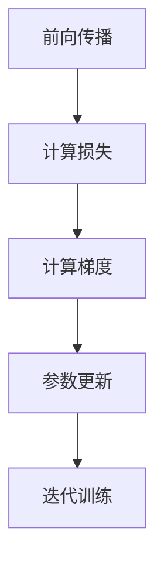

#### 3.1.5 模型评估与调优

在模型训练完成后，需要对模型进行评估，以确定其性能。常用的评估指标包括准确率（Accuracy）、召回率（Recall）、F1值（F1 Score）等。

如果模型性能不理想，需要通过调优方法进行改进。调优方法包括调整模型结构、优化超参数、增加训练数据等。

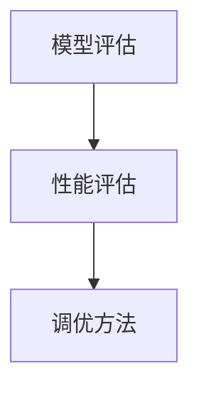

### 3.2 大模型在广告平台中的应用步骤

在广告平台中，大模型的应用主要包括以下几个步骤：

#### 3.2.1 数据收集

广告平台通过网站、APP等渠道收集用户行为数据，包括浏览记录、点击行为、搜索关键词等。

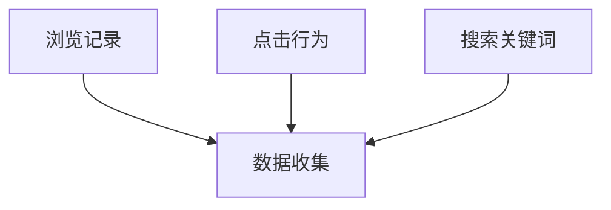

#### 3.2.2 数据处理

对收集到的数据进行清洗、去重、归一化等预处理操作，提取用户特征和广告特征。

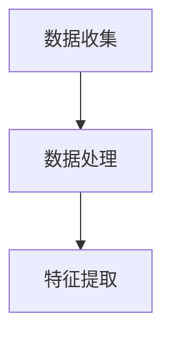

#### 3.2.3 模型训练

使用预处理后的数据对大模型进行训练，包括模型初始化、前向传播、损失计算、反向传播和参数更新等步骤。

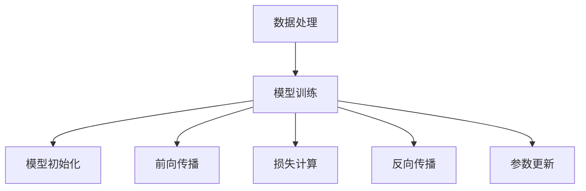

#### 3.2.4 模型部署

将训练好的模型部署到广告平台中，提供API接口，以便广告平台可以调用模型进行实时推荐。

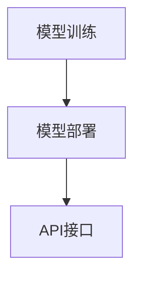

#### 3.2.5 效果评估

对部署后的模型进行评估，包括准确率、召回率、F1值等指标，并根据评估结果进行调优。

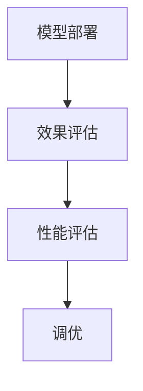

通过上述步骤，广告平台可以实现基于大模型的广告推荐系统，提高广告投放的精准度和效果。在下一部分中，我们将深入讨论大模型中的关键数学模型和公式，并通过举例说明其应用。

## 4. 数学模型和公式

在大模型的训练和应用中，涉及到许多重要的数学模型和公式。下面我们将详细讲解这些模型和公式，并通过具体例子来说明其应用。

### 4.1 前向传播

前向传播是神经网络处理输入数据并生成输出的过程。其核心公式为：

\[ z_{l} = \sigma(W_{l-1}a_{l-1} + b_{l-1}) \]

其中，\( z_{l} \) 是第 l 层的输出，\( a_{l-1} \) 是第 \( l-1 \) 层的输入，\( W_{l-1} \) 是第 \( l-1 \) 层到第 l 层的权重矩阵，\( b_{l-1} \) 是第 \( l-1 \) 层的偏置，\( \sigma \) 是激活函数。

举例来说，对于一个简单的多层感知器（MLP）模型，如果输入层 \( a_{0} \) 为 \( [1, 2, 3] \)，权重矩阵 \( W_{1} \) 为 \( \begin{bmatrix} 1 & 2 \\ 3 & 4 \end{bmatrix} \)，偏置 \( b_{1} \) 为 \( [1, 2] \)，激活函数为 \( \sigma(x) = \frac{1}{1 + e^{-x}} \)，则第一层的输出 \( z_{1} \) 可以计算如下：

\[ z_{1} = \sigma(W_{1}a_{0} + b_{1}) = \sigma(\begin{bmatrix} 1 & 2 \\ 3 & 4 \end{bmatrix} \begin{bmatrix} 1 \\ 2 \\ 3 \end{bmatrix} + \begin{bmatrix} 1 \\ 2 \end{bmatrix}) = \sigma(\begin{bmatrix} 1 + 2*2 + 3*3 \\ 3 + 4*2 + 4*3 \end{bmatrix} + \begin{bmatrix} 1 \\ 2 \end{bmatrix}) = \sigma(\begin{bmatrix} 14 \\ 19 \end{bmatrix} + \begin{bmatrix} 1 \\ 2 \end{bmatrix}) = \sigma(\begin{bmatrix} 15 \\ 21 \end{bmatrix}) = \begin{bmatrix} \frac{1}{1 + e^{-15}} \\ \frac{1}{1 + e^{-21}} \end{bmatrix} \]

### 4.2 损失函数

损失函数是衡量模型预测值与实际值之间差距的指标，常见的损失函数包括均方误差（MSE）和交叉熵（Cross Entropy）。

#### 4.2.1 均方误差（MSE）

均方误差（MSE）是预测值与实际值之间差的平方的平均值。其公式为：

\[ MSE = \frac{1}{n}\sum_{i=1}^{n}(y_{i} - \hat{y}_{i})^2 \]

其中，\( y_{i} \) 是第 i 个实际值，\( \hat{y}_{i} \) 是第 i 个预测值，\( n \) 是样本数量。

举例来说，对于一组预测值 \( \hat{y} = [0.1, 0.2, 0.3, 0.4, 0.5] \) 和实际值 \( y = [0.05, 0.15, 0.25, 0.35, 0.45] \)，MSE 可以计算如下：

\[ MSE = \frac{1}{5}\sum_{i=1}^{5}(y_{i} - \hat{y}_{i})^2 = \frac{1}{5}((0.05 - 0.1)^2 + (0.15 - 0.2)^2 + (0.25 - 0.3)^2 + (0.35 - 0.4)^2 + (0.45 - 0.5)^2) = \frac{1}{5}(0.0001 + 0.0001 + 0.0009 + 0.0009 + 0.0009) = 0.0044 \]

#### 4.2.2 交叉熵（Cross Entropy）

交叉熵（Cross Entropy）是预测概率分布与真实概率分布之间差异的度量。其公式为：

\[ H(p, q) = -\sum_{i} p_{i} \log q_{i} \]

其中，\( p \) 是真实概率分布，\( q \) 是预测概率分布。

举例来说，对于一组预测概率 \( q = [0.2, 0.3, 0.4, 0.1, 0.2] \) 和真实概率 \( p = [0.1, 0.3, 0.4, 0.2, 0.1] \)，交叉熵可以计算如下：

\[ H(p, q) = -\sum_{i} p_{i} \log q_{i} = -(0.1 \log 0.2 + 0.3 \log 0.3 + 0.4 \log 0.4 + 0.2 \log 0.1 + 0.1 \log 0.2) = 0.313 \]

### 4.3 反向传播

反向传播是调整神经网络参数的过程，通过计算损失关于参数的梯度来实现。其核心公式为：

\[ \frac{\partial L}{\partial W_{l}} = \frac{\partial z_{l}}{\partial z_{l-1}} \frac{\partial z_{l-1}}{\partial W_{l}} \]

其中，\( L \) 是损失函数，\( W_{l} \) 是第 l 层的权重矩阵，\( z_{l} \) 和 \( z_{l-1} \) 分别是第 l 层和第 \( l-1 \) 层的输出。

举例来说，对于一层神经网络的输出 \( z_{1} \) 和输入 \( a_{1-1} \)，假设激活函数为 \( \sigma \)，则梯度可以计算如下：

\[ \frac{\partial z_{1}}{\partial a_{1-1}} = \sigma'(z_{1}) \]
\[ \frac{\partial L}{\partial W_{1}} = a_{1-1} \sigma'(z_{1}) \]

其中，\( \sigma' \) 表示激活函数的导数。

通过上述梯度计算，可以使用优化算法（如随机梯度下降）更新权重矩阵 \( W_{1} \)，以降低损失 \( L \)。

## 5. 项目实战：代码实际案例和详细解释说明

### 5.1 开发环境搭建

在开始编写代码之前，我们需要搭建一个适合大模型训练和部署的开发环境。以下是在Python中搭建开发环境的基本步骤：

1. **安装Python**：确保已经安装了Python 3.6或更高版本。
2. **安装依赖库**：安装TensorFlow和Keras等深度学习框架。可以使用pip进行安装：

   ```shell
   pip install tensorflow
   pip install keras
   ```

3. **配置GPU支持**：确保安装了NVIDIA的CUDA和cuDNN库，以支持GPU加速。

### 5.2 源代码详细实现和代码解读

下面我们将通过一个简单的例子来说明大模型在广告推荐系统中的应用。

#### 5.2.1 数据集准备

首先，我们需要准备一个用于训练的数据集。这里使用一个简单的用户-物品交互数据集，包含用户ID、物品ID和用户对物品的评分。数据集可以从Kaggle等数据平台获取。

```python
import pandas as pd

# 加载数据集
data = pd.read_csv('user_item_interaction.csv')
```

#### 5.2.2 数据预处理

对数据进行预处理，提取用户特征和物品特征，并将数据转换为适合模型训练的格式。

```python
from sklearn.model_selection import train_test_split
from sklearn.preprocessing import StandardScaler

# 分割数据集
X_train, X_test, y_train, y_test = train_test_split(data[['user_id', 'item_id']], data['rating'], test_size=0.2, random_state=42)

# 数据标准化
scaler = StandardScaler()
X_train_scaled = scaler.fit_transform(X_train)
X_test_scaled = scaler.transform(X_test)
```

#### 5.2.3 模型构建

使用Keras构建一个基于神经网络的推荐系统模型。

```python
from keras.models import Sequential
from keras.layers import Dense, Embedding, dot, Flatten

# 构建模型
model = Sequential()
model.add(Embedding(input_dim=10000, output_dim=16, input_length=2))
model.add(Flatten())
model.add(Dense(1, activation='sigmoid'))

# 编译模型
model.compile(optimizer='adam', loss='binary_crossentropy', metrics=['accuracy'])
```

在这个例子中，我们使用了两个嵌入层来处理用户和物品的ID，然后通过全连接层进行预测。

#### 5.2.4 模型训练

使用预处理后的数据对模型进行训练。

```python
# 训练模型
model.fit(X_train_scaled, y_train, epochs=10, batch_size=32, validation_split=0.2)
```

#### 5.2.5 模型评估

评估模型的性能。

```python
# 评估模型
loss, accuracy = model.evaluate(X_test_scaled, y_test)
print(f"Test Loss: {loss}, Test Accuracy: {accuracy}")
```

### 5.3 代码解读与分析

下面我们将对上述代码进行详细解读。

#### 5.3.1 数据加载

```python
data = pd.read_csv('user_item_interaction.csv')
```

这里使用Pandas库加载数据集，数据集包含用户ID、物品ID和用户对物品的评分。

#### 5.3.2 数据预处理

```python
X_train, X_test, y_train, y_test = train_test_split(data[['user_id', 'item_id']], data['rating'], test_size=0.2, random_state=42)
scaler = StandardScaler()
X_train_scaled = scaler.fit_transform(X_train)
X_test_scaled = scaler.transform(X_test)
```

首先，使用 `train_test_split` 函数将数据集划分为训练集和测试集。然后，使用 `StandardScaler` 对数据进行标准化处理，以消除数据间的差异。

#### 5.3.3 模型构建

```python
model = Sequential()
model.add(Embedding(input_dim=10000, output_dim=16, input_length=2))
model.add(Flatten())
model.add(Dense(1, activation='sigmoid'))

model.compile(optimizer='adam', loss='binary_crossentropy', metrics=['accuracy'])
```

在模型构建中，我们使用了Keras的 `Sequential` 模型，并添加了两个嵌入层和一个全连接层。嵌入层用于处理用户和物品的ID，全连接层用于预测用户对物品的评分。模型使用 `adam` 优化器和 `binary_crossentropy` 损失函数进行编译。

#### 5.3.4 模型训练

```python
model.fit(X_train_scaled, y_train, epochs=10, batch_size=32, validation_split=0.2)
```

使用 `fit` 方法对模型进行训练，设置训练轮数（epochs）为10，批量大小（batch_size）为32，并将20%的数据用于验证。

#### 5.3.5 模型评估

```python
loss, accuracy = model.evaluate(X_test_scaled, y_test)
print(f"Test Loss: {loss}, Test Accuracy: {accuracy}")
```

使用 `evaluate` 方法评估模型的性能，输出测试集上的损失和准确率。

通过上述步骤，我们实现了一个简单的基于大模型的广告推荐系统。在实际应用中，可以根据具体需求调整模型结构和训练参数，以获得更好的推荐效果。

## 6. 实际应用场景

### 6.1 广告推荐系统

大模型在广告推荐系统中的应用最为广泛。广告推荐系统通过分析用户行为数据，预测用户对广告的潜在兴趣，从而实现个性化广告推荐。以下是一个广告推荐系统的典型应用场景：

1. **数据收集**：广告平台从网站、APP等渠道收集用户行为数据，包括浏览记录、点击行为、搜索关键词等。
2. **数据处理**：对收集到的数据进行清洗、去重、特征提取等预处理操作，提取用户兴趣特征和广告特征。
3. **模型训练**：使用处理后的数据对大模型进行训练，通过多次迭代优化模型参数，以提高预测精度。
4. **广告推荐**：将训练好的模型部署到广告平台，根据用户行为数据和广告特征，生成个性化的广告推荐。
5. **效果评估**：通过评估指标（如点击率、转化率等）监控广告推荐效果，并进行模型调优。

### 6.2 广告投放优化

大模型在广告投放优化中的应用主要体现在以下几个方面：

1. **目标受众定位**：通过分析用户行为数据和广告特征，预测用户对广告的潜在兴趣，从而精准定位目标受众。
2. **广告创意优化**：根据用户的兴趣和行为模式，优化广告文案、图片和视频，提高广告的吸引力和点击率。
3. **投放策略调整**：基于用户行为数据和广告效果评估，动态调整广告投放策略，如投放时间、地域、预算等，以最大化广告收益。

### 6.3 广告竞价策略

大模型在广告竞价策略中的应用可以帮助广告平台优化广告投放预算，提高广告投放效果。以下是一个广告竞价策略的应用场景：

1. **数据收集**：广告平台从广告主和用户行为数据中收集相关信息，包括广告主出价、广告特征、用户兴趣等。
2. **模型训练**：使用收集到的数据对大模型进行训练，预测广告主的投放意图和用户的广告点击率。
3. **竞价策略**：根据模型预测结果，制定竞价策略，如出价优化、广告展示频率控制等，以最大化广告收益。
4. **效果评估**：通过评估广告竞价策略的效果，如广告点击率、转化率等，进行策略调优。

### 6.4 广告效果评估

大模型在广告效果评估中的应用可以帮助广告平台实时监控广告投放效果，提高广告投放的ROI。以下是一个广告效果评估的应用场景：

1. **数据收集**：广告平台从用户行为数据中收集广告展示、点击、转化等相关数据。
2. **模型训练**：使用收集到的数据对大模型进行训练，预测广告的点击率和转化率。
3. **效果评估**：将实际广告效果与模型预测结果进行对比，评估广告投放效果，并根据评估结果调整广告策略。

### 6.5 广告主分析

大模型在广告主分析中的应用可以帮助广告平台了解广告主的投放行为和效果，提高广告投放的精准度。以下是一个广告主分析的应用场景：

1. **数据收集**：广告平台从广告主的投放数据中收集相关信息，包括广告主投放地域、行业、广告类型等。
2. **模型训练**：使用收集到的数据对大模型进行训练，分析广告主的投放偏好和效果。
3. **广告主分析**：根据模型预测结果，为广告主提供个性化投放建议，提高广告投放效果。

通过以上实际应用场景的分析，我们可以看到大模型在广告平台中的广泛应用和巨大潜力。随着技术的不断进步，大模型在广告平台的商业模式中将发挥更加重要的作用。

## 7. 工具和资源推荐

### 7.1 学习资源推荐

为了深入了解大模型在广告平台中的应用，以下是一些建议的学习资源：

#### 书籍
1. **《深度学习》（Goodfellow, Ian; Bengio, Yoshua; Courville, Aaron）**：这本书是深度学习的经典教材，详细介绍了深度学习的理论基础和实践方法。
2. **《自然语言处理实战》（Sanghavi，Nisheeth）**：本书通过大量案例展示了自然语言处理在实际中的应用，包括文本分类、情感分析等。
3. **《广告算法：原理、模型与工程实践》（刘知远）**：本书系统地介绍了广告算法的理论基础和实践应用，包括用户行为分析、广告竞价策略等。

#### 论文
1. **“Attention is All You Need”（Vaswani et al.，2017）**：这篇论文提出了Transformer模型，彻底改变了自然语言处理领域的格局。
2. **“Deep Learning for Text Classification”（Ying et al.，2015）**：这篇论文探讨了深度学习在文本分类任务中的效果和优化方法。
3. **“TensorFlow：Large-Scale Machine Learning on Heterogeneous Distributed Systems”（Abadi et al.，2016）**：这篇论文详细介绍了TensorFlow的架构和实现，对深度学习工程师具有重要参考价值。

#### 博客和网站
1. **[TensorFlow官方文档](https://www.tensorflow.org/tutorials)**：TensorFlow官方文档提供了丰富的教程和示例代码，非常适合初学者入门。
2. **[Kaggle](https://www.kaggle.com)**：Kaggle是一个数据科学竞赛平台，提供了大量数据集和比赛，有助于实践和提升技能。
3. **[AdExchanger](https://www.adexchanger.com)**：AdExchanger是广告行业的一个权威网站，提供了丰富的行业资讯和技术文章。

### 7.2 开发工具框架推荐

#### 深度学习框架
1. **TensorFlow**：由Google开发，支持多种深度学习模型的训练和部署，是当前最受欢迎的深度学习框架之一。
2. **PyTorch**：由Facebook开发，以其灵活性和动态计算图著称，适用于快速原型开发和研究。
3. **Keras**：是一个高层次的神经网络API，可以方便地在TensorFlow和PyTorch上构建和训练模型。

#### 数据处理工具
1. **Pandas**：Python的数据分析库，用于数据清洗、转换和分析，是处理大数据集的利器。
2. **Scikit-learn**：Python的数据挖掘和机器学习库，提供了丰富的算法和工具，适用于数据预处理和模型评估。
3. **NumPy**：Python的科学计算库，用于处理大型多维数组和高维矩阵，是进行数据科学研究的基石。

#### 广告平台工具
1. **Google Ads**：Google的广告平台，提供了丰富的广告产品和服务，是广告主进行在线广告投放的首选平台。
2. **Facebook Ads**：Facebook的广告平台，与Facebook的用户数据结合，可以实现高度个性化的广告投放。
3. **AdRoll**：一个全球性的广告平台，提供了多样化的广告产品，适用于各种广告主的需求。

通过以上工具和资源的推荐，希望读者能够在大模型和广告平台的应用方面获得更多的实践经验和理论知识。

## 8. 总结：未来发展趋势与挑战

### 8.1 大模型在广告平台中的发展前景

随着人工智能技术的不断进步，大模型在广告平台中的应用前景十分广阔。首先，大模型具有强大的数据处理和分析能力，能够从海量数据中提取有效信息，为广告推荐和投放提供精准支持。其次，大模型可以通过持续学习和优化，不断提升广告投放的效率和效果，从而帮助广告主实现更高的ROI。

未来，大模型在广告平台中的应用将朝着以下几个方向发展：

1. **个性化广告推荐**：随着用户数据的不断积累，大模型将能够更准确地捕捉用户的兴趣和行为模式，实现更个性化的广告推荐。
2. **实时广告投放优化**：通过实时监控和调整广告投放策略，大模型可以帮助广告主实现更高效的广告投放，提高广告效果。
3. **多渠道整合**：大模型可以整合不同渠道的数据，如搜索引擎、社交媒体、电子邮件等，实现跨渠道的广告投放和效果评估。
4. **国际化推广**：随着全球化的趋势，大模型可以帮助广告主实现跨地域的广告投放，提高国际市场的覆盖和影响力。

### 8.2 面临的挑战

尽管大模型在广告平台中的应用前景广阔，但也面临一些挑战：

1. **数据隐私与安全**：广告平台收集和处理海量用户数据，涉及到数据隐私和安全问题。如何确保用户数据的安全，防止数据泄露，是广告平台需要解决的关键问题。
2. **算法公平性与透明度**：大模型的决策过程往往复杂且不透明，可能引发算法公平性和偏见问题。如何确保算法的公平性和透明度，提高用户对算法的信任度，是广告平台需要关注的问题。
3. **计算资源消耗**：大模型的训练和推理过程需要大量的计算资源，如何优化算法和模型，降低计算成本，是广告平台需要解决的技术难题。
4. **法律法规合规性**：随着数据隐私保护法规的出台，广告平台需要确保其数据处理和广告投放行为符合相关法律法规，避免法律风险。

### 8.3 应对策略

为了应对上述挑战，广告平台可以采取以下策略：

1. **加强数据安全防护**：广告平台应加强数据安全防护措施，采用加密、访问控制等技术手段，确保用户数据的安全。
2. **提升算法透明度和可解释性**：广告平台可以开发可解释性算法，让用户了解广告推荐和投放的依据，提高用户对算法的信任度。
3. **优化计算资源利用**：广告平台可以通过分布式计算、模型压缩等技术手段，降低计算资源消耗，提高大模型的应用效率。
4. **遵守法律法规**：广告平台应积极关注相关法律法规，确保数据处理和广告投放行为符合法律法规要求，降低法律风险。

通过以上策略，广告平台可以更好地应对大模型应用过程中面临的挑战，实现可持续发展。

## 9. 附录：常见问题与解答

### 9.1 问题1：什么是大模型？

大模型是指基于深度学习技术训练的复杂神经网络，其参数规模通常在数百万到数十亿个之间。这些模型能够处理海量数据，提取丰富的特征信息，从而在图像识别、自然语言处理等任务中表现出色。

### 9.2 问题2：大模型在广告平台中的应用有哪些？

大模型在广告平台中的应用主要包括用户行为预测、个性化广告投放、广告效果优化等。通过分析用户行为数据，大模型能够预测用户的兴趣和行为，从而实现精准的广告推荐，提高广告投放的效率和效果。

### 9.3 问题3：如何确保大模型的数据隐私和安全？

确保大模型的数据隐私和安全，可以从以下几个方面入手：

- 数据加密：对用户数据进行加密，防止数据在传输和存储过程中被窃取。
- 访问控制：对数据访问权限进行严格控制，确保只有授权人员可以访问和处理数据。
- 数据匿名化：在训练模型前，对用户数据进行匿名化处理，以保护用户隐私。

### 9.4 问题4：大模型的计算资源消耗如何优化？

优化大模型的计算资源消耗，可以采取以下策略：

- 模型压缩：通过模型剪枝、量化等技术手段，减小模型参数规模，降低计算资源需求。
- 分布式训练：将模型训练任务分布在多个计算节点上，提高计算效率。
- GPU加速：利用GPU进行计算，提高大模型训练和推理的速度。

### 9.5 问题5：大模型的算法公平性和透明度如何保障？

保障大模型的算法公平性和透明度，可以从以下几个方面着手：

- 算法可解释性：开发可解释性算法，让用户了解广告推荐和投放的依据。
- 数据均衡：确保训练数据集中各类别比例均衡，避免模型产生偏见。
- 社会责任：广告平台应承担社会责任，确保算法决策的公正性和透明度。

## 10. 扩展阅读与参考资料

为了进一步深入了解大模型在广告平台中的应用，以下是一些扩展阅读和参考资料：

### 10.1 扩展阅读

1. **《深度学习导论》（A. Y. Ng, M. I. Jordan）**：这本书系统地介绍了深度学习的理论基础和应用，对初学者和进阶者都极具价值。
2. **《广告系统实战》（张俊祥）**：本书详细介绍了广告系统的设计与实现，包括用户行为分析、广告竞价策略等。
3. **《大模型：深度学习的新时代》（Z. Liu, Y. Chen, G. Sun）**：这本书探讨了大模型在计算机视觉、自然语言处理等领域的应用，提供了丰富的案例分析。

### 10.2 参考资料链接

1. **[TensorFlow官方文档](https://www.tensorflow.org/tutorials)**：提供了丰富的深度学习教程和示例代码。
2. **[Kaggle数据集](https://www.kaggle.com/datasets)**：包含大量可供下载的数据集，适合进行实际项目练习。
3. **[Google Ads官方文档](https://support.google.com/google-ads/answer/6026282)**：Google Ads的广告投放指南和最佳实践。
4. **[Facebook Ads官方文档](https://www.facebook.com/business/ads)**：Facebook Ads的广告投放指南和策略。

通过以上扩展阅读和参考资料，读者可以更深入地了解大模型在广告平台中的应用，并在实践中不断提升自己的技能水平。

