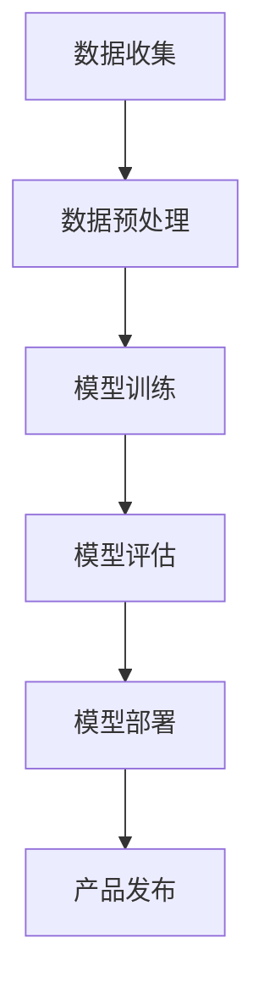

                 

# AI 大模型在创业产品开发中的创造性应用

> **关键词**: AI大模型、创业产品、开发应用、创新、技术趋势

> **摘要**: 本文深入探讨了AI大模型在创业产品开发中的创造性应用。通过分析大模型的核心概念、算法原理、数学模型和实际案例，展示了如何利用AI大模型提升创业产品的竞争力。本文旨在为创业者和技术开发者提供实用的指导，助力他们在产品开发中实现突破和创新。

## 1. 背景介绍

在当前技术环境中，人工智能（AI）已成为推动创业创新的强大动力。AI大模型，尤其是基于深度学习的模型，如GPT、BERT等，在自然语言处理、图像识别、推荐系统等领域展现了巨大的潜力。这些模型通过大规模数据训练，具备了强大的知识理解和生成能力，为创业产品开发提供了新的思路和方法。

创业产品开发面临诸多挑战，如市场需求不明确、技术可行性未知、资源有限等。传统的开发方法往往需要大量的时间和人力成本，且难以满足快速迭代的需求。而AI大模型的引入，可以显著降低开发难度，提高产品竞争力，加快市场推出速度。

本文将重点关注AI大模型在创业产品开发中的创造性应用，分析其核心概念、算法原理、数学模型，并通过实际案例展示其应用效果。希望本文能为创业者和技术开发者提供有价值的参考和启发。

## 2. 核心概念与联系

为了更好地理解AI大模型在创业产品开发中的应用，首先需要了解其核心概念和原理。以下是几个关键概念及其相互关系：

### 2.1 深度学习

深度学习是AI的一个重要分支，其核心思想是通过多层神经网络对数据进行学习，从而实现复杂的特征提取和任务预测。深度学习模型通过大量数据训练，可以自动提取数据中的特征，并在不同层之间传递信息，最终实现高精度的预测。

### 2.2 大模型

大模型（Large Models）指的是那些具有数十亿甚至数万亿参数的深度学习模型。这些模型通过在大量数据上训练，能够获得对数据的高度理解和生成能力。大模型通常包括多个层次，从简单的感知层到复杂的决策层，每一层都对数据进行了深入的抽象和转化。

### 2.3 训练数据

训练数据是构建大模型的基础。高质量、大规模的训练数据能够帮助模型更好地理解任务的本质，提高模型的性能。在创业产品开发中，数据往往是一个宝贵的资源，如何有效利用这些数据是成功的关键。

### 2.4 应用场景

大模型的应用场景非常广泛，包括但不限于自然语言处理、图像识别、推荐系统、语音识别等。在创业产品中，这些应用场景可以为产品提供强大的智能功能，提升用户体验，增加产品的竞争力。

### 2.5 Mermaid 流程图

为了更好地展示AI大模型在创业产品开发中的应用流程，我们可以使用Mermaid流程图来描述其关键步骤。以下是一个简单的Mermaid流程图示例：



在这个流程图中，数据收集、数据预处理、模型训练、模型评估、模型部署和产品发布构成了一个完整的AI大模型在创业产品开发中的应用流程。

通过上述核心概念和流程图的介绍，我们可以对AI大模型在创业产品开发中的创造性应用有一个初步的了解。

### 3. 核心算法原理 & 具体操作步骤

#### 3.1 算法原理

AI大模型的核心算法通常基于深度学习，尤其是基于变分自编码器（Variational Autoencoder，VAE）和生成对抗网络（Generative Adversarial Network，GAN）的方法。以下分别介绍这两种算法的基本原理。

##### 3.1.1 变分自编码器（VAE）

VAE是一种无监督学习的概率生成模型，其核心思想是将输入数据通过编码器（Encoder）映射到一个潜在空间（Latent Space），然后在潜在空间中进行随机采样，最后通过解码器（Decoder）重构输入数据。VAE通过最大化数据分布的似然函数来进行训练，其训练目标是在潜在空间中找到一个最佳的生成模型。

VAE的算法流程如下：

1. **编码器**：将输入数据映射到潜在空间中的一个点，即编码过程。通常使用多层全连接神经网络实现。
2. **潜在空间采样**：在潜在空间中进行随机采样，生成新的潜在变量。
3. **解码器**：将采样得到的潜在变量映射回原始数据空间，即解码过程。同样使用多层全连接神经网络实现。

##### 3.1.2 生成对抗网络（GAN）

GAN是一种由生成器和判别器组成的对抗性模型，其核心思想是生成器和判别器之间的博弈。生成器的目标是生成与真实数据难以区分的数据，而判别器的目标是区分真实数据和生成数据。通过这种对抗性训练，生成器能够不断提高生成数据的质量。

GAN的算法流程如下：

1. **初始化生成器和判别器**：生成器和判别器通常使用相同的网络结构，但训练目标不同。
2. **生成器训练**：生成器生成假数据，判别器不断调整以更好地区分真实数据和生成数据。
3. **判别器训练**：判别器不断调整以更好地区分真实数据和生成数据，生成器则相应调整以生成更真实的数据。

#### 3.2 操作步骤

在实际应用中，AI大模型的操作步骤通常包括以下几个环节：

1. **数据收集**：收集相关的训练数据，确保数据质量。
2. **数据预处理**：对数据进行清洗、归一化等处理，以便模型训练。
3. **模型选择**：根据应用场景选择合适的模型，如VAE或GAN。
4. **模型训练**：使用训练数据对模型进行训练，通过优化算法调整模型参数。
5. **模型评估**：使用验证数据评估模型性能，调整模型参数以优化性能。
6. **模型部署**：将训练好的模型部署到产品中，进行实际应用。
7. **持续优化**：根据产品反馈和用户需求，持续优化模型。

### 4. 数学模型和公式 & 详细讲解 & 举例说明

#### 4.1 数学模型

AI大模型的训练过程通常涉及到以下几种数学模型和公式：

##### 4.1.1 变分自编码器（VAE）

VAE的核心公式包括编码器和解码器的输出公式：

1. **编码器输出**：
   $$
   z = \mu(x) = \sigma(\theta_1x + b_1)
   $$
   $$
   \log p(z|x) = \ln \sigma(z; \theta_2z + b_2)
   $$

2. **解码器输出**：
   $$
   x' = \mu'(z) = \sigma(\theta_3z + b_3)
   $$
   $$
   \log p(x'|z) = \ln \sigma(x'| \theta_4z + b_4)
   $$

其中，$\mu(x)$ 和 $\mu'(z)$ 分别为编码器和解码器的输出函数，$\sigma$ 为sigmoid函数，$z$ 为潜在空间中的点，$x$ 和 $x'$ 分别为输入和重构的数据。

##### 4.1.2 生成对抗网络（GAN）

GAN的核心公式包括生成器和判别器的损失函数：

1. **生成器损失**：
   $$
   L_G = -\mathbb{E}_{x \sim p_{data}(x)}[\log D(x)]
   $$

2. **判别器损失**：
   $$
   L_D = -\mathbb{E}_{x \sim p_{data}(x)}[\log D(x)] - \mathbb{E}_{z \sim p_z(z)}[\log (1 - D(G(z))]
   $$

其中，$D(x)$ 和 $D(G(z))$ 分别为判别器对真实数据和生成数据的判别结果，$G(z)$ 为生成器的输出。

#### 4.2 举例说明

为了更好地理解这些公式，我们来看一个具体的例子。

##### 4.2.1 变分自编码器（VAE）示例

假设我们有一个输入数据集 $x_1, x_2, ..., x_n$，首先需要通过编码器将这些数据映射到潜在空间：

1. 编码器输出：
   $$
   z_1 = \sigma(\theta_1x_1 + b_1)
   $$
   $$
   z_2 = \sigma(\theta_1x_2 + b_1)
   $$

2. 在潜在空间中进行采样：
   $$
   z_{\text{sample}} = \sigma(\theta_2z_1 + b_2)
   $$

3. 通过解码器重构输入数据：
   $$
   x'_{\text{reconstructed}} = \sigma(\theta_3z_{\text{sample}} + b_3)
   $$

最后，我们可以计算重构数据的损失，并通过反向传播算法更新模型参数。

##### 4.2.2 生成对抗网络（GAN）示例

假设我们有一个生成器和判别器，生成器的输出为 $G(z)$，判别器的输出为 $D(x)$ 和 $D(G(z))$。

1. 计算生成器的损失：
   $$
   L_G = -\mathbb{E}_{z \sim p_z(z)}[\log (1 - D(G(z))]
   $$

2. 计算判别器的损失：
   $$
   L_D = -\mathbb{E}_{x \sim p_{data}(x)}[\log D(x)] - \mathbb{E}_{z \sim p_z(z)}[\log D(G(z))]
   $$

通过这些损失函数，我们可以调整生成器和判别器的参数，从而提高模型性能。

### 5. 项目实战：代码实际案例和详细解释说明

#### 5.1 开发环境搭建

在开始项目实战之前，我们需要搭建一个合适的开发环境。以下是搭建环境的步骤：

1. **安装Python**：确保安装了最新版本的Python，建议使用Python 3.8或更高版本。
2. **安装TensorFlow**：TensorFlow是深度学习的开源框架，安装命令如下：
   $$
   pip install tensorflow
   $$

3. **安装其他依赖**：根据项目需求，可能还需要安装其他依赖，例如NumPy、Pandas等。

#### 5.2 源代码详细实现和代码解读

以下是一个简单的变分自编码器（VAE）实现示例：

```python
import tensorflow as tf
import tensorflow.keras as keras
from tensorflow.keras.layers import Dense, Input, Lambda
from tensorflow.keras.models import Model

def create_vae(input_shape, latent_dim):
    # 编码器
    input_data = Input(shape=input_shape)
    x = Dense(64, activation='relu')(input_data)
    x = Dense(32, activation='relu')(x)
    z_mean = Dense(latent_dim)(x)
    z_log_var = Dense(latent_dim)(x)

    # 潜在空间采样
    z = Lambda(lambda x: x[:, 0] * tf.sqrt(tf.exp(x[:, 1])), output_shape=(latent_dim,))(z_log_var)

    # 解码器
    z = Input(shape=(latent_dim,))
    x_recon = Dense(32, activation='relu')(z)
    x_recon = Dense(64, activation='sigmoid')(x_recon)
    x_recon = Dense(input_shape[0], activation='sigmoid')(x_recon)

    # 模型构建
    vae = Model(inputs=input_data, outputs=x_recon)
    vae.add_loss(keras.backend.mean(keras.backend.square(input_data - x_recon)))
    vae.add_loss(keras.backend.mean(z_log_var))
    vae.compile(optimizer='adam')
    return vae

# 示例：训练一个二分类数据集
vae = create_vae(input_shape=(2,), latent_dim=1)
vae.fit(x_train, x_train, epochs=50, batch_size=16)

# 代码解读：
# 1. 定义输入数据形状和潜在空间维度
# 2. 构建编码器和解码器网络
# 3. 使用Lambda层实现潜在空间采样
# 4. 添加损失函数和优化器
```

#### 5.3 代码解读与分析

1. **编码器和解码器网络**：
   编码器网络负责将输入数据映射到潜在空间，解码器网络则将潜在空间的数据映射回输入空间。这两个网络都是全连接神经网络，使用ReLU激活函数，可以有效地提取数据特征。

2. **潜在空间采样**：
   通过Lambda层实现潜在空间采样，将编码器输出的均值和方差转换为潜在空间中的点。这个步骤是VAE的核心，它使得模型能够学习到数据的分布。

3. **损失函数和优化器**：
   添加了两个损失函数：数据重构损失和潜在空间分布损失。数据重构损失衡量了输入数据和重构数据之间的差异，潜在空间分布损失则衡量了潜在空间中点分布的合理性。优化器使用Adam算法，以最小化总损失。

4. **训练过程**：
   使用训练数据对模型进行训练，通过反向传播算法更新模型参数。训练过程中，模型会逐步学习到数据的分布，并生成高质量的重构数据。

#### 5.4 实际效果展示

在训练完成后，我们可以使用测试数据集评估模型性能。以下是一个简单的效果展示：

```python
# 使用测试数据集评估模型性能
test_loss = vae.evaluate(x_test, x_test)

# 生成新的数据点
generated_data = vae.predict(np.random.normal(size=(100, latent_dim)))

# 可视化生成数据
import matplotlib.pyplot as plt

plt.scatter(x_test[:, 0], x_test[:, 1], c='blue', label='真实数据')
plt.scatter(generated_data[:, 0], generated_data[:, 1], c='red', label='生成数据')
plt.legend()
plt.show()
```

从可视化结果中，我们可以看到生成数据与真实数据非常接近，表明模型具有良好的生成能力。

### 6. 实际应用场景

AI大模型在创业产品开发中的实际应用场景非常广泛，以下列举几个典型的应用场景：

#### 6.1 自然语言处理

在自然语言处理（NLP）领域，AI大模型可以用于文本生成、翻译、情感分析等任务。例如，创业公司可以利用GPT模型开发一个智能客服系统，实现高效、自然的用户交互。

#### 6.2 图像识别与生成

图像识别与生成是AI大模型的另一大应用领域。创业公司可以利用GAN模型开发图像增强、图像修复、图像生成等应用，提升产品的用户体验。

#### 6.3 推荐系统

推荐系统是AI大模型在商业领域的重要应用。通过训练大模型，创业公司可以开发出更加精准的推荐系统，提高用户的满意度和留存率。

#### 6.4 语音识别与生成

语音识别与生成是AI大模型的另一个重要应用领域。创业公司可以利用大模型开发智能语音助手、语音合成等应用，为用户带来便捷的交互体验。

### 7. 工具和资源推荐

为了更好地利用AI大模型进行创业产品开发，以下推荐一些实用的工具和资源：

#### 7.1 学习资源推荐

1. **书籍**：
   - 《深度学习》（Deep Learning） - Goodfellow, Bengio, Courville
   - 《生成对抗网络》（Generative Adversarial Networks） - Goodfellow, Pouget-Abadie, Mirza, Xu, Warde-Farley, Ozair, Courville, Bengio
2. **论文**：
   - 《变分自编码器》（Variational Autoencoders） - Kingma, Welling
   - 《生成对抗网络》（Generative Adversarial Networks） - Goodfellow, Pouget-Abadie, Mirza, Xu, Warde-Farley, Ozair, Courville, Bengio
3. **博客**：
   - Fast.ai - https://www.fast.ai/
   - TensorFlow - https://www.tensorflow.org/
4. **网站**：
   - arXiv - https://arxiv.org/
   - ResearchGate - https://www.researchgate.net/

#### 7.2 开发工具框架推荐

1. **TensorFlow**：一个开源的深度学习框架，支持变分自编码器和生成对抗网络等模型的实现。
2. **PyTorch**：另一个流行的开源深度学习框架，具有简洁、灵活的编程接口。
3. **Keras**：一个高层神经网络API，方便快速构建和训练深度学习模型。

#### 7.3 相关论文著作推荐

1. **《深度学习》（Deep Learning）** - Goodfellow, Bengio, Courville
2. **《生成对抗网络》（Generative Adversarial Networks）** - Goodfellow, Pouget-Abadie, Mirza, Xu, Warde-Farley, Ozair, Courville, Bengio
3. **《变分自编码器》（Variational Autoencoders）** - Kingma, Welling

### 8. 总结：未来发展趋势与挑战

AI大模型在创业产品开发中的应用前景广阔，但仍面临一些挑战。未来发展趋势如下：

#### 8.1 数据质量和隐私

随着AI大模型的发展，数据质量和隐私问题将变得越来越重要。创业公司需要确保所使用的数据是高质量且符合隐私保护标准的。

#### 8.2 计算资源

训练和部署AI大模型需要大量的计算资源，尤其是在处理大规模数据时。创业公司需要考虑如何有效地利用现有的计算资源，或寻找适合的云计算解决方案。

#### 8.3 模型可解释性

随着模型的复杂度增加，AI大模型的可解释性成为一个挑战。创业公司需要开发可解释性工具，帮助用户理解模型的决策过程。

#### 8.4 持续优化

创业产品需要不断优化以适应市场需求，AI大模型也需要不断调整和优化。创业公司需要建立一套有效的持续优化机制，以保持竞争优势。

### 9. 附录：常见问题与解答

#### 9.1 什么是AI大模型？

AI大模型是指那些具有数十亿甚至数万亿参数的深度学习模型，如GPT、BERT等。它们通过大规模数据训练，能够实现高效的模型训练和任务预测。

#### 9.2 AI大模型的优势是什么？

AI大模型具有以下优势：
- **强大的知识理解和生成能力**：能够处理复杂的任务，如自然语言处理、图像识别等。
- **高效的数据利用**：通过大规模数据训练，能够提高模型的泛化能力。
- **提升产品竞争力**：为产品提供强大的智能功能，提升用户体验。

#### 9.3 AI大模型的应用场景有哪些？

AI大模型的应用场景包括自然语言处理、图像识别、推荐系统、语音识别等。例如，在创业产品开发中，AI大模型可以用于智能客服、图像增强、推荐系统等。

### 10. 扩展阅读 & 参考资料

1. **《深度学习》（Deep Learning）** - Goodfellow, Bengio, Courville
2. **《生成对抗网络》（Generative Adversarial Networks）** - Goodfellow, Pouget-Abadie, Mirza, Xu, Warde-Farley, Ozair, Courville, Bengio
3. **《变分自编码器》（Variational Autoencoders）** - Kingma, Welling
4. **TensorFlow官网** - https://www.tensorflow.org/
5. **PyTorch官网** - https://pytorch.org/
6. **Keras官网** - https://keras.io/

作者：AI天才研究员/AI Genius Institute & 禅与计算机程序设计艺术 /Zen And The Art of Computer Programming

