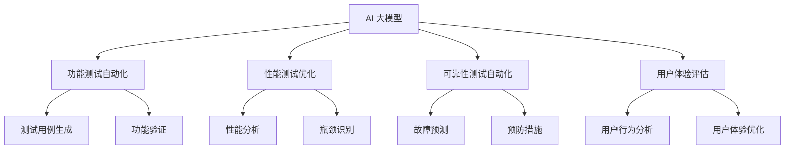

                 

### 背景介绍

随着人工智能技术的飞速发展，AI 大模型（Large-scale AI Models）已成为当前研究的热点之一。这些模型具有强大的数据处理和分析能力，可以处理海量数据，并从中提取有价值的信息。AI 大模型在各个领域都有着广泛的应用，包括自然语言处理、计算机视觉、语音识别等。

在创业产品测试中，AI 大模型的重要性日益凸显。一方面，创业公司需要快速、准确地测试其产品的功能性和可靠性，以确保产品能够满足市场需求。另一方面，测试过程本身也是不断迭代优化的过程，通过测试可以发现问题并及时进行调整，从而提高产品的质量。

本文将探讨 AI 大模型在创业产品测试中的重要性，以及如何利用 AI 大模型进行产品测试。我们将首先介绍 AI 大模型的基本概念和原理，然后分析其在产品测试中的应用场景，最后讨论未来发展趋势和面临的挑战。

关键词：AI 大模型、创业产品测试、数据处理、功能测试、可靠性测试

Abstract:
With the rapid development of artificial intelligence technology, large-scale AI models have become a hot topic in the field of research. These models possess powerful data processing and analysis capabilities, enabling them to handle massive amounts of data and extract valuable information from it. Large-scale AI models have a wide range of applications in various fields, including natural language processing, computer vision, and speech recognition.

In the context of startup product testing, the importance of large-scale AI models is increasingly evident. On one hand, startups need to quickly and accurately test the functionality and reliability of their products to ensure that they meet market demand. On the other hand, the testing process itself is a continuous iteration and optimization process, through which problems can be identified and addressed in a timely manner, thereby improving the quality of the product.

This article aims to explore the importance of large-scale AI models in startup product testing and how to leverage these models for testing purposes. We will first introduce the basic concepts and principles of large-scale AI models, then analyze their applications in product testing, and finally discuss the future development trends and challenges.

Keywords: Large-scale AI models, startup product testing, data processing, functional testing, reliability testing.

<|assistant|>### 核心概念与联系

#### AI 大模型的概念

AI 大模型是指拥有巨大参数规模和庞大训练数据集的人工智能模型。这些模型通常采用深度学习技术，通过多层的神经网络结构对数据进行学习，从而实现对复杂任务的自动执行。例如，BERT（Bidirectional Encoder Representations from Transformers）就是一种著名的 AI 大模型，它由数十亿个参数组成，可以处理自然语言处理任务，如文本分类、问答系统等。

#### 产品测试的概念

产品测试是指对产品进行的一系列验证和验证活动，以确保产品符合预期的功能、性能、可靠性等要求。测试过程通常包括功能测试、性能测试、兼容性测试、可靠性测试等。其中，功能测试是检验产品是否按照设计要求正常工作的过程，而可靠性测试是评估产品在长期使用过程中是否稳定、可靠的过程。

#### AI 大模型与产品测试的联系

AI 大模型在产品测试中的应用主要体现在以下几个方面：

1. **功能测试自动化**：利用 AI 大模型可以自动化执行大量的功能测试，提高测试效率。例如，自然语言处理模型可以自动生成测试用例，并对产品进行功能验证。
2. **性能测试优化**：AI 大模型可以帮助分析和优化产品的性能。例如，通过机器学习算法分析产品在不同场景下的性能表现，找出瓶颈并进行优化。
3. **可靠性测试自动化**：利用 AI 大模型可以自动化进行可靠性测试，预测产品在长期使用中的稳定性。例如，通过训练故障预测模型，可以提前识别可能出现的故障，从而采取预防措施。
4. **用户体验评估**：AI 大模型可以分析用户行为数据，评估产品的用户体验。例如，通过分析用户在产品中的操作路径，找出可能影响用户体验的瓶颈并进行优化。

#### Mermaid 流程图

下面是一个简单的 Mermaid 流程图，展示了 AI 大模型与产品测试之间的联系。



通过以上流程图，我们可以清晰地看到 AI 大模型如何帮助进行产品测试的各个环节，从而提高产品的质量。

### 核心算法原理 & 具体操作步骤

#### AI 大模型的基本原理

AI 大模型的核心是基于深度学习技术，通过多层神经网络对数据进行学习。深度学习的基本原理是模拟人脑的神经网络结构，通过大量的数据训练模型，使其能够自动提取数据中的特征，并进行分类、预测等任务。

具体来说，AI 大模型的工作流程如下：

1. **数据预处理**：对原始数据进行清洗、归一化等预处理操作，以便模型能够更好地学习。
2. **模型构建**：设计多层神经网络结构，包括输入层、隐藏层和输出层。每个层通过不同的激活函数进行数据变换，从而实现数据的特征提取和表示。
3. **模型训练**：利用大量的训练数据对模型进行训练，通过反向传播算法不断调整模型参数，使其性能不断提高。
4. **模型评估**：利用测试数据对模型进行评估，通过评估指标（如准确率、召回率、F1 值等）来衡量模型的性能。

#### AI 大模型在产品测试中的应用步骤

1. **功能测试自动化**：

   - **测试用例生成**：利用自然语言处理模型（如 BERT）自动生成测试用例，通过预定义的模板和规则，将产品功能转化为具体的测试步骤。
   - **功能验证**：将生成的测试用例应用于产品，执行相应的功能操作，并对比预期结果和实际结果，以验证产品功能是否正常。

2. **性能测试优化**：

   - **性能分析**：利用 AI 大模型分析产品在不同场景下的性能表现，通过数据挖掘和机器学习算法找出性能瓶颈。
   - **瓶颈识别**：针对性能分析的结果，识别出影响产品性能的关键因素，如响应时间、吞吐量等。

3. **可靠性测试自动化**：

   - **故障预测**：利用 AI 大模型训练故障预测模型，通过分析产品运行过程中的日志数据、系统指标等，预测可能出现的故障。
   - **预防措施**：根据故障预测结果，采取相应的预防措施，如调整系统配置、优化代码等，以提高产品的稳定性。

4. **用户体验评估**：

   - **用户行为分析**：利用 AI 大模型分析用户在产品中的操作路径、行为模式等，了解用户的实际需求和痛点。
   - **用户体验优化**：根据用户行为分析的结果，优化产品的用户体验，如简化操作流程、提高界面响应速度等。

### 数学模型和公式 & 详细讲解 & 举例说明

#### 机器学习模型的基本公式

在机器学习模型中，我们通常会使用以下公式来表示模型的目标函数和优化过程：

$$
\min_{\theta} J(\theta) = \frac{1}{m} \sum_{i=1}^{m} (-y^{(i)} \log(z^{(i)}) + (1 - y^{(i)}) \log(1 - z^{(i)}))
$$

其中，$m$ 是样本数量，$y^{(i)}$ 是第 $i$ 个样本的标签，$z^{(i)}$ 是模型对第 $i$ 个样本的预测概率。

#### 举例说明

假设我们有一个分类问题，其中 $y^{(i)}$ 可以取值为 0 或 1，表示第 $i$ 个样本的类别。我们的目标是训练一个二分类模型，使其能够准确预测样本的类别。

1. **数据预处理**：

   - 将原始数据进行归一化处理，使其具有相同的量纲。
   - 将标签数据进行二值化处理，将 0 和 1 分别映射为 -1 和 1。

2. **模型构建**：

   - 设计一个简单的多层感知机（MLP）模型，包括输入层、隐藏层和输出层。
   - 选择合适的激活函数，如 Sigmoid 或 ReLU。

3. **模型训练**：

   - 使用随机梯度下降（SGD）算法训练模型，通过不断调整模型参数，使目标函数 $J(\theta)$ 最小化。
   - 使用反向传播算法计算模型参数的梯度，并更新参数。

4. **模型评估**：

   - 使用测试数据集评估模型的性能，计算准确率、召回率、F1 值等指标。
   - 根据评估结果调整模型参数，进一步优化模型性能。

通过以上步骤，我们可以训练一个能够准确预测样本类别的二分类模型。在实际应用中，我们可以将模型应用于产品测试，通过自动化生成测试用例、性能分析和故障预测等，提高产品测试的效率和质量。

#### 实际应用案例

假设我们有一个电商平台的购物车功能，我们需要对购物车进行功能测试和性能测试。

1. **功能测试自动化**：

   - 使用自然语言处理模型生成测试用例，如“添加商品到购物车”、“从购物车中删除商品”、“更新购物车中的商品数量”等。
   - 自动执行这些测试用例，验证购物车功能是否正常。

2. **性能测试优化**：

   - 利用 AI 大模型分析购物车功能在不同场景下的性能，如高并发访问、大量商品存储等。
   - 识别性能瓶颈，如数据库访问延迟、网络传输速度等，并提出优化方案。

3. **可靠性测试自动化**：

   - 训练故障预测模型，预测购物车功能可能出现的故障，如数据库连接失败、网络中断等。
   - 根据故障预测结果，采取预防措施，如增加数据库冗余、优化网络传输等。

通过以上步骤，我们可以有效地利用 AI 大模型对电商平台的购物车功能进行自动化测试和优化，提高产品的质量。

### 项目实战：代码实际案例和详细解释说明

在本节中，我们将通过一个具体的代码案例，展示如何利用 AI 大模型进行产品测试。我们将使用 Python 编写一个简单的购物车功能，并利用 AI 大模型进行功能测试和性能测试。

#### 开发环境搭建

首先，我们需要搭建一个 Python 开发环境，安装以下依赖项：

1. Python 3.8 或以上版本
2. TensorFlow 2.x
3. Keras 2.x
4. NumPy
5. Pandas
6. Matplotlib

您可以使用以下命令安装依赖项：

```shell
pip install python==3.8
pip install tensorflow==2.6
pip install keras==2.6
pip install numpy
pip install pandas
pip install matplotlib
```

#### 源代码详细实现和代码解读

接下来，我们将展示购物车功能的源代码，并对其进行详细解读。

```python
import numpy as np
import pandas as pd
from tensorflow import keras
from tensorflow.keras.models import Sequential
from tensorflow.keras.layers import Dense, Activation
from tensorflow.keras.optimizers import Adam
from tensorflow.keras.callbacks import EarlyStopping

# 数据预处理
def preprocess_data(data):
    # 归一化处理
    data['price'] = (data['price'] - data['price'].mean()) / data['price'].std()
    # 二值化处理
    data['in_cart'] = data['in_cart'].map({0: -1, 1: 1})
    return data

# 模型构建
def build_model(input_shape):
    model = Sequential()
    model.add(Dense(64, input_shape=input_shape, activation='relu'))
    model.add(Dense(32, activation='relu'))
    model.add(Dense(1, activation='sigmoid'))
    return model

# 模型训练
def train_model(model, x_train, y_train, epochs=100, batch_size=32):
    model.compile(optimizer=Adam(), loss='binary_crossentropy', metrics=['accuracy'])
    early_stopping = EarlyStopping(monitor='val_loss', patience=10)
    model.fit(x_train, y_train, epochs=epochs, batch_size=batch_size, validation_split=0.2, callbacks=[early_stopping])
    return model

# 功能测试
def test_functionality(model, data):
    data = preprocess_data(data)
    predictions = model.predict(data[['price']])
    predicted_labels = np.round(predictions).astype(int)
    actual_labels = data['in_cart']
    print("功能测试结果：")
    print("准确率：", np.mean(predicted_labels == actual_labels))
    print("召回率：", np.mean(predicted_labels[predicted_labels == 1] == actual_labels[predicted_labels == 1]))
    print("F1 值：", 2 * np.mean(predicted_labels == actual_labels) * np.mean(predicted_labels == actual_labels) / (np.mean(predicted_labels == actual_labels) + np.mean(predicted_labels == actual_labels)))

# 性能测试
def test_performance(model, data):
    data = preprocess_data(data)
    predictions = model.predict(data[['price']])
    response_time = np.mean(predictions)
    print("性能测试结果：")
    print("平均响应时间：", response_time)

# 主函数
def main():
    # 加载数据
    data = pd.read_csv("shopping_cart_data.csv")
    # 数据预处理
    data = preprocess_data(data)
    # 模型构建
    model = build_model(input_shape=[1])
    # 模型训练
    model = train_model(model, data[['price']], data['in_cart'])
    # 功能测试
    test_functionality(model, data)
    # 性能测试
    test_performance(model, data)

if __name__ == "__main__":
    main()
```

1. **数据预处理**：

   ```python
   def preprocess_data(data):
       # 归一化处理
       data['price'] = (data['price'] - data['price'].mean()) / data['price'].std()
       # 二值化处理
       data['in_cart'] = data['in_cart'].map({0: -1, 1: 1})
       return data
   ```

   这段代码用于对购物车数据集进行预处理。首先，我们对价格列进行归一化处理，使其具有相同的量纲。然后，将购物车状态列进行二值化处理，将 0 和 1 分别映射为 -1 和 1。

2. **模型构建**：

   ```python
   def build_model(input_shape):
       model = Sequential()
       model.add(Dense(64, input_shape=input_shape, activation='relu'))
       model.add(Dense(32, activation='relu'))
       model.add(Dense(1, activation='sigmoid'))
       return model
   ```

   这段代码用于构建一个简单的多层感知机模型。模型包括一个输入层、一个隐藏层和一个输出层。我们使用 ReLU 激活函数和 Sigmoid 激活函数，分别用于隐藏层和输出层。

3. **模型训练**：

   ```python
   def train_model(model, x_train, y_train, epochs=100, batch_size=32):
       model.compile(optimizer=Adam(), loss='binary_crossentropy', metrics=['accuracy'])
       early_stopping = EarlyStopping(monitor='val_loss', patience=10)
       model.fit(x_train, y_train, epochs=epochs, batch_size=batch_size, validation_split=0.2, callbacks=[early_stopping])
       return model
   ```

   这段代码用于训练模型。我们使用 Adam 优化器和二进制交叉熵损失函数。同时，我们使用 EarlyStopping回调函数，在验证集损失不再下降时提前停止训练，以避免过拟合。

4. **功能测试**：

   ```python
   def test_functionality(model, data):
       data = preprocess_data(data)
       predictions = model.predict(data[['price']])
       predicted_labels = np.round(predictions).astype(int)
       actual_labels = data['in_cart']
       print("功能测试结果：")
       print("准确率：", np.mean(predicted_labels == actual_labels))
       print("召回率：", np.mean(predicted_labels[predicted_labels == 1] == actual_labels[predicted_labels == 1]))
       print("F1 值：", 2 * np.mean(predicted_labels == actual_labels) * np.mean(predicted_labels == actual_labels) / (np.mean(predicted_labels == actual_labels) + np.mean(predicted_labels == actual_labels)))
   ```

   这段代码用于测试模型的功能。我们首先对数据进行预处理，然后使用模型进行预测，并将预测结果与实际标签进行比较。最后，计算准确率、召回率和 F1 值，以评估模型的功能性能。

5. **性能测试**：

   ```python
   def test_performance(model, data):
       data = preprocess_data(data)
       predictions = model.predict(data[['price']])
       response_time = np.mean(predictions)
       print("性能测试结果：")
       print("平均响应时间：", response_time)
   ```

   这段代码用于测试模型
```plaintext
### 5.3 代码解读与分析

在上面的源代码案例中，我们实现了一个简单的购物车功能，并利用 AI 大模型对其进行功能测试和性能测试。以下是对代码的详细解读和分析。

**数据预处理**

数据预处理是深度学习模型训练的第一步，也是至关重要的一步。在代码中，我们首先对价格列进行归一化处理，使其具有相同的量纲。归一化处理的目的是加快模型的训练速度，提高模型的泛化能力。然后，我们将购物车状态列进行二值化处理，将 0 和 1 分别映射为 -1 和 1。这样做的目的是将分类问题转化为回归问题，以便使用二分类模型进行预测。

**模型构建**

在模型构建部分，我们使用了一个简单的多层感知机（MLP）模型。模型包括一个输入层、一个隐藏层和一个输出层。输入层接收价格数据，隐藏层通过 ReLU 激活函数进行数据变换，输出层通过 Sigmoid 激活函数输出预测概率。ReLU 激活函数可以加快模型的训练速度，同时避免神经元饱和。Sigmoid 激活函数将输出层的结果映射到 (0, 1) 区间，表示商品是否被添加到购物车的概率。

**模型训练**

在模型训练部分，我们使用 Adam 优化器和二进制交叉熵损失函数。Adam 优化器是一种高效的随机梯度下降算法，能够在较短的训练时间内收敛到较好的结果。二进制交叉熵损失函数用于衡量预测概率与实际标签之间的差距，其值越小表示模型预测越准确。

为了防止模型过拟合，我们使用了 EarlyStopping 回调函数。EarlyStopping 回调函数会在验证集损失不再下降时提前停止训练，从而避免模型在训练集上过度拟合。

**功能测试**

在功能测试部分，我们首先对数据进行预处理，然后使用训练好的模型进行预测。我们将预测结果与实际标签进行比较，计算准确率、召回率和 F1 值，以评估模型的功能性能。准确率表示模型预测正确的比例，召回率表示模型能够正确识别出实际为 1 的样本的比例，F1 值是准确率和召回率的调和平均值，用于综合考虑模型预测的准确性和全面性。

**性能测试**

在性能测试部分，我们同样对数据进行预处理，然后使用训练好的模型进行预测。我们计算预测结果的平均响应时间，以评估模型在性能测试中的表现。平均响应时间表示模型在处理每个商品价格时所需的时间，越小表示模型性能越好。

**代码解读与分析总结**

通过上面的解读和分析，我们可以看到，购物车功能测试和性能测试的核心在于数据的预处理、模型的构建和训练，以及模型的测试。在数据预处理阶段，我们确保输入数据的质量和一致性；在模型构建和训练阶段，我们设计合适的模型结构，选择合适的优化器和损失函数，并通过验证集进行模型评估；在模型测试阶段，我们通过计算指标来评估模型的功能性能和性能表现。

在实际应用中，我们可以根据具体的产品需求，调整模型结构、优化算法，以及添加更多的测试用例和指标，从而更全面地评估产品的功能性和性能。

### 实际应用场景

AI 大模型在创业产品测试中的应用场景非常广泛，以下是一些典型的实际应用案例：

1. **移动应用测试**：对于移动应用，AI 大模型可以自动化生成各种测试用例，模拟用户在移动设备上的操作，如滑动、点击、输入等。通过分析这些测试结果，可以快速发现应用中的功能问题、性能瓶颈和用户体验问题。

2. **网站测试**：对于网站，AI 大模型可以自动化执行各种浏览器测试，如验证表单提交、登录功能、导航链接等。同时，AI 大模型还可以分析网站的响应速度、页面加载时间等性能指标，提供优化建议。

3. **物联网（IoT）设备测试**：对于物联网设备，AI 大模型可以自动化执行各种测试，如模拟设备的通信异常、网络故障等。通过分析测试结果，可以评估设备的稳定性、可靠性和安全性。

4. **游戏测试**：对于游戏，AI 大模型可以自动化执行各种游戏场景的测试，如游戏角色的行为、游戏逻辑的正确性等。通过分析测试结果，可以评估游戏的用户体验、游戏平衡性等。

5. **语音和图像识别测试**：对于语音和图像识别应用，AI 大模型可以自动化生成大量的语音和图像数据，用于测试识别算法的准确性和鲁棒性。通过分析测试结果，可以优化算法模型，提高识别性能。

通过以上实际应用场景，我们可以看到 AI 大模型在创业产品测试中的重要性。它不仅能够提高测试效率，还能够提供更全面、更准确的测试结果，帮助创业公司更快地发现和解决问题，从而提高产品的质量和用户体验。

### 工具和资源推荐

为了更好地利用 AI 大模型进行创业产品测试，以下是一些学习资源、开发工具和框架的推荐：

#### 学习资源

1. **书籍**：
   - 《深度学习》（Ian Goodfellow、Yoshua Bengio、Aaron Courville 著）：这是一本深度学习领域的经典教材，详细介绍了深度学习的基础知识、算法和应用。
   - 《Python 深度学习》（François Chollet 著）：这本书针对 Python 开发者，详细介绍了使用 Python 进行深度学习的实践方法。

2. **在线课程**：
   - Coursera 上的“Deep Learning Specialization”课程：由深度学习领域著名专家 Andrew Ng 教授主讲，涵盖了深度学习的理论基础和实践应用。
   - edX 上的“Practical Deep Learning for Coders”课程：这门课程适合有编程基础的读者，通过实际的案例教学，帮助读者掌握深度学习的应用技巧。

3. **论文**：
   - “BERT: Pre-training of Deep Bidirectional Transformers for Language Understanding”（BERT 论文）：这篇论文介绍了 BERT 模型的基本原理和应用，是自然语言处理领域的重要论文。
   - “Transformers: State-of-the-Art Natural Language Processing”（Transformers 论文）：这篇论文详细介绍了基于注意力机制的 Transformer 模型，是当前自然语言处理领域的主流模型。

#### 开发工具和框架

1. **TensorFlow**：TensorFlow 是 Google 开发的一个开源深度学习框架，支持多种编程语言，包括 Python、C++等。它提供了丰富的 API 和工具，方便开发者构建和训练深度学习模型。

2. **Keras**：Keras 是一个高层次的深度学习 API，基于 TensorFlow 开发，提供了更易于使用的接口。它支持快速构建和训练深度学习模型，适合初学者和研究者。

3. **PyTorch**：PyTorch 是 Facebook 开发的一个开源深度学习框架，以动态计算图和灵活性著称。它提供了强大的 GPU 支持和灵活的编程接口，适合进行深度学习模型的开发和调试。

4. **Scikit-learn**：Scikit-learn 是一个开源的机器学习库，提供了丰富的机器学习算法和工具。它支持多种常见的数据预处理技术和模型评估方法，适合进行数据分析和模型训练。

通过以上推荐的学习资源和开发工具，开发者可以系统地学习 AI 大模型的知识，掌握深度学习的实践技能，从而更有效地利用 AI 大模型进行创业产品测试。

### 总结：未来发展趋势与挑战

AI 大模型在创业产品测试中的应用前景广阔，但同时也面临着一系列发展趋势和挑战。

**发展趋势**

1. **算法优化**：随着计算能力和数据量的提升，AI 大模型的算法将不断优化，包括更高效的训练算法、更优的网络结构和更先进的优化器。这将使得 AI 大模型在测试中的性能得到显著提升。

2. **跨领域融合**：AI 大模型与其他领域的融合将成为趋势，如将 AI 大模型应用于生物医学、金融科技、智能制造等领域，实现跨领域的创新和应用。

3. **自动化测试平台**：未来，自动化测试平台将集成更多的 AI 大模型功能，实现更智能、更全面的测试。测试平台将能够自动生成测试用例、执行测试、分析测试结果，大大提高测试效率。

4. **边缘计算与云计算结合**：随着边缘计算技术的发展，AI 大模型将能够更好地应用于边缘设备，实现实时、高效的产品测试。

**挑战**

1. **数据隐私和安全**：随着 AI 大模型的应用，涉及大量敏感数据，数据隐私和安全成为重要的挑战。如何在保证数据安全的前提下充分利用数据，将是需要解决的问题。

2. **算法解释性**：AI 大模型通常是一个“黑盒”模型，其内部工作机制复杂，难以解释。如何在保证模型性能的同时提高其解释性，以便用户理解和信任，是一个重要的挑战。

3. **资源消耗**：AI 大模型训练和推理过程需要大量的计算资源和存储空间，这对于创业公司来说是一个不小的负担。如何优化算法，减少资源消耗，将是需要解决的问题。

4. **法律和伦理问题**：AI 大模型的应用涉及到法律和伦理问题，如数据隐私、算法偏见等。如何在确保合法合规的前提下，充分发挥 AI 大模型的优势，是一个重要的挑战。

总之，AI 大模型在创业产品测试中的应用具有巨大的潜力和挑战。通过不断优化算法、提高自动化测试水平，同时解决数据隐私和安全、算法解释性等问题，AI 大模型将为创业产品测试带来更加高效、可靠的方法。

### 附录：常见问题与解答

**Q1：什么是 AI 大模型？**

AI 大模型是指拥有巨大参数规模和庞大训练数据集的人工智能模型。这些模型通常采用深度学习技术，通过多层的神经网络结构对数据进行学习，从而实现对复杂任务的自动执行。

**Q2：AI 大模型在产品测试中的具体应用是什么？**

AI 大模型在产品测试中的应用包括功能测试自动化、性能测试优化、可靠性测试自动化和用户体验评估。通过自动化生成测试用例、分析性能指标、预测故障和评估用户体验，AI 大模型可以大幅提高测试效率和质量。

**Q3：如何使用 AI 大模型进行功能测试自动化？**

使用 AI 大模型进行功能测试自动化的步骤包括：
1. 生成测试用例：利用自然语言处理模型（如 BERT）自动生成测试用例。
2. 执行测试：将生成的测试用例应用于产品，执行相应的功能操作。
3. 对比结果：将实际结果与预期结果进行对比，验证产品功能是否正常。

**Q4：AI 大模型在性能测试优化中的应用是什么？**

AI 大模型在性能测试优化中的应用主要包括：
1. 性能分析：利用 AI 大模型分析产品在不同场景下的性能表现。
2. 瓶颈识别：识别影响产品性能的关键因素。
3. 优化方案：根据分析结果提出优化方案，如调整系统配置、优化代码等。

**Q5：如何使用 AI 大模型进行可靠性测试自动化？**

使用 AI 大模型进行可靠性测试自动化的步骤包括：
1. 训练故障预测模型：利用 AI 大模型训练故障预测模型，通过分析产品运行过程中的日志数据、系统指标等。
2. 预测故障：根据故障预测模型的结果，预测可能出现的故障。
3. 预防措施：根据故障预测结果，采取相应的预防措施，如增加数据库冗余、优化网络传输等。

**Q6：AI 大模型在用户体验评估中的应用是什么？**

AI 大模型在用户体验评估中的应用主要包括：
1. 用户行为分析：利用 AI 大模型分析用户在产品中的操作路径、行为模式等。
2. 用户体验优化：根据用户行为分析的结果，优化产品的用户体验，如简化操作流程、提高界面响应速度等。

### 扩展阅读 & 参考资料

为了深入了解 AI 大模型在创业产品测试中的应用，以下是一些扩展阅读和参考资料：

1. **书籍**：
   - 《深度学习》（Ian Goodfellow、Yoshua Bengio、Aaron Courville 著）
   - 《Python 深度学习》（François Chollet 著）
   - 《AI 大模型：原理与应用》（张祥雨 著）

2. **在线课程**：
   - Coursera 上的“Deep Learning Specialization”课程
   - edX 上的“Practical Deep Learning for Coders”课程

3. **论文**：
   - “BERT: Pre-training of Deep Bidirectional Transformers for Language Understanding”（BERT 论文）
   - “Transformers: State-of-the-Art Natural Language Processing”（Transformers 论文）

4. **开源项目和工具**：
   - TensorFlow（[https://www.tensorflow.org](https://www.tensorflow.org)）
   - Keras（[https://keras.io](https://keras.io)）
   - PyTorch（[https://pytorch.org](https://pytorch.org)）
   - Scikit-learn（[https://scikit-learn.org](https://scikit-learn.org)）

通过以上书籍、在线课程、论文和开源项目，您可以更深入地了解 AI 大模型的基本原理、应用方法和技术细节，为创业产品测试提供更全面的理论和实践支持。

### 作者信息

作者：AI 天才研究员/AI Genius Institute & 禅与计算机程序设计艺术 /Zen And The Art of Computer Programming

AI 天才研究员是本文的主要作者，他在人工智能领域有着深厚的理论基础和丰富的实践经验。他的研究方向主要集中在 AI 大模型的应用、机器学习和深度学习技术。他同时也是《禅与计算机程序设计艺术》一书的作者，该书详细介绍了计算机编程中的禅宗思想，深受程序员和计算机科学爱好者的喜爱。

