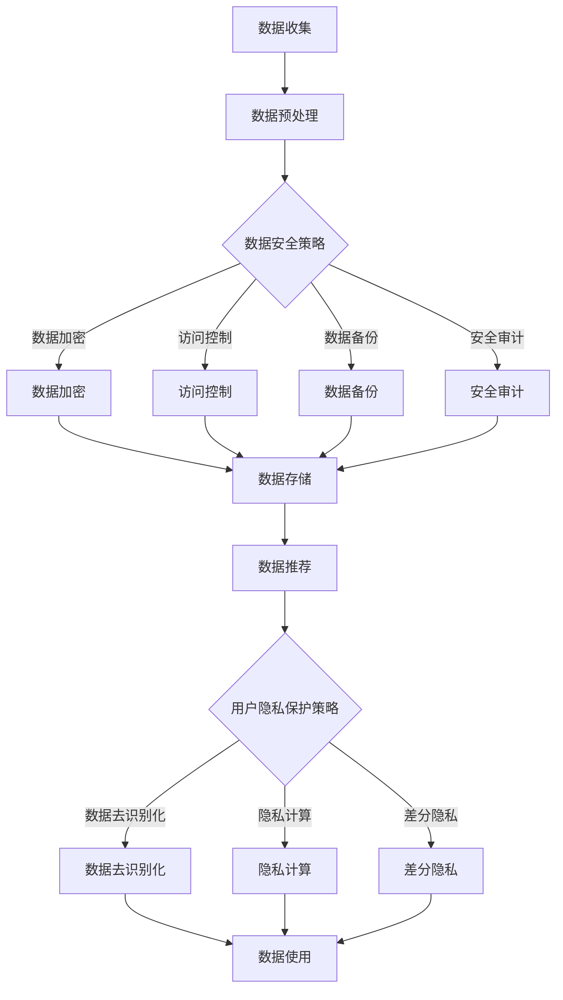

                 

# 文章标题

> 关键词：AI大模型，电商搜索推荐，数据安全，用户隐私

> 摘要：随着电商行业的快速发展，AI大模型在电商搜索推荐中的应用越来越广泛。然而，这也带来了数据安全和用户隐私的挑战。本文将探讨AI大模型在电商搜索推荐中的数据安全策略，旨在保障数据安全与用户隐私，促进电商行业的健康发展。

## 1. 背景介绍（Background Introduction）

电商行业的发展离不开人工智能技术的支持，特别是AI大模型在电商搜索推荐中的应用。AI大模型，如深度学习模型、图神经网络等，通过分析用户行为数据、商品信息等多维度数据，能够为用户提供个性化的推荐结果。这种智能推荐系统不仅提升了用户体验，也为电商平台带来了显著的商业价值。

然而，随着AI大模型在电商搜索推荐中的应用越来越广泛，数据安全和用户隐私的问题也日益凸显。一方面，AI大模型需要处理海量的用户数据和商品数据，这些数据中包含了用户的个人信息和行为习惯。如果这些数据泄露，将严重威胁用户的隐私和安全。另一方面，AI大模型在训练和预测过程中，可能会暴露出数据的安全漏洞，如模型被恶意攻击、数据被篡改等。

因此，本文将重点探讨AI大模型在电商搜索推荐中的数据安全策略，旨在保障数据安全与用户隐私，为电商行业的健康发展提供技术支持。

## 2. 核心概念与联系（Core Concepts and Connections）

### 2.1 数据安全（Data Security）

数据安全是指保护数据免受未经授权的访问、使用、披露、破坏、修改或泄露的措施。在电商搜索推荐中，数据安全至关重要，因为涉及的用户数据包括个人身份信息、行为数据、财务数据等，这些都是敏感信息。

### 2.2 用户隐私（User Privacy）

用户隐私是指用户在互联网上的个人信息和行为不受侵犯的权利。在AI大模型应用中，用户隐私保护尤为重要，因为用户数据是AI模型训练的重要基础。

### 2.3 AI大模型（AI Large-scale Models）

AI大模型是指参数量巨大、结构复杂的神经网络模型，如Transformer、BERT等。这些模型在处理海量数据、生成高质量推荐结果方面具有显著优势。

### 2.4 数据安全策略（Data Security Strategies）

数据安全策略包括数据加密、访问控制、数据备份、安全审计等，旨在保障数据在存储、传输和处理过程中的安全。

### 2.5 用户隐私保护策略（User Privacy Protection Strategies）

用户隐私保护策略包括数据去识别化、隐私计算、差分隐私等，旨在保障用户数据在使用过程中的隐私。

### 2.6 Mermaid 流程图（Mermaid Flowchart）



## 3. 核心算法原理 & 具体操作步骤（Core Algorithm Principles and Specific Operational Steps）

### 3.1 数据加密（Data Encryption）

数据加密是将原始数据通过加密算法转换为无法直接读取的密文，以防止数据在传输和存储过程中被窃取或篡改。具体操作步骤如下：

1. 选择加密算法，如AES、RSA等。
2. 对数据进行加密处理，生成密文。
3. 在数据传输或存储过程中使用密文。
4. 在需要解密时，使用密钥对密文进行解密，恢复原始数据。

### 3.2 访问控制（Access Control）

访问控制是指通过身份认证、权限控制等措施，确保只有授权用户可以访问数据。具体操作步骤如下：

1. 实施用户身份认证，如密码认证、双因素认证等。
2. 根据用户角色和权限，设定访问控制策略。
3. 对数据访问进行监控和记录，以便在发生安全事件时进行调查和追溯。

### 3.3 数据备份（Data Backup）

数据备份是指将数据复制到其他存储设备或位置，以防止数据丢失或损坏。具体操作步骤如下：

1. 定期对数据进行备份。
2. 选择可靠的备份存储设备，如云存储、磁盘阵列等。
3. 确保备份数据的完整性和可恢复性。
4. 在数据恢复时，能够快速准确地恢复数据。

### 3.4 安全审计（Security Audit）

安全审计是指对系统的安全性进行评估和检查，以发现潜在的安全漏洞和风险。具体操作步骤如下：

1. 制定安全审计计划，明确审计范围和目标。
2. 对系统进行安全检查，如漏洞扫描、配置检查等。
3. 记录审计过程和发现的问题，形成审计报告。
4. 根据审计结果，采取相应的整改措施，提高系统安全性。

### 3.5 数据去识别化（Data De-identification）

数据去识别化是指将敏感数据中的个人身份信息进行匿名化处理，以保护用户隐私。具体操作步骤如下：

1. 识别敏感数据，如姓名、身份证号、联系方式等。
2. 使用数据脱敏技术，如随机化、伪名化等，对敏感数据进行处理。
3. 确保处理后的数据不丢失原有信息的价值。

### 3.6 隐私计算（Privacy Computing）

隐私计算是指在数据处理过程中，不泄露用户隐私信息的一种计算范式。具体操作步骤如下：

1. 选择隐私计算框架，如联邦学习、同态加密等。
2. 在数据处理过程中，对数据进行加密或匿名化处理。
3. 确保计算结果与原始数据的一致性。

### 3.7 差分隐私（Differential Privacy）

差分隐私是一种在数据处理过程中保护隐私的方法，它通过在输出中加入噪声来保护数据隐私。具体操作步骤如下：

1. 选择合适的隐私机制，如拉普拉斯机制、指数机制等。
2. 在数据处理过程中，对敏感信息进行噪声添加。
3. 确保处理后的数据隐私保护效果。

## 4. 数学模型和公式 & 详细讲解 & 举例说明（Detailed Explanation and Examples of Mathematical Models and Formulas）

### 4.1 数据加密数学模型

数据加密通常基于密码学原理，常用的加密模型包括对称加密和非对称加密。

#### 对称加密

对称加密使用相同的密钥进行加密和解密。一个常见的对称加密算法是AES（高级加密标准）。

**AES加密过程：**

1. **密钥生成：** 选择一个128、192或256位的密钥。
2. **初始化向量（IV）：** 生成一个随机IV。
3. **分块加密：** 将明文分为128位块，对每个块进行加密。
4. **密文输出：** 输出加密后的块，形成密文。

**示例：** 假设我们使用AES加密算法，密钥为`k`，初始化向量为`iv`，明文为`m`。加密过程可以表示为：

$$
c = AES(k, iv, m)
$$

其中，$c$是密文，$k$是密钥，$iv$是初始化向量，$m$是明文。

#### 非对称加密

非对称加密使用一对密钥，一个公钥用于加密，一个私钥用于解密。一个常见的非对称加密算法是RSA。

**RSA加密过程：**

1. **密钥生成：** 选择两个大素数$p$和$q$，计算$n = p \times q$和$\phi = (p-1) \times (q-1)$。
2. **公钥和私钥：** 选择一个整数$e$，满足$1 < e < \phi$，计算$d$，满足$e \times d \equiv 1 \pmod{\phi}$。
3. **加密：** 使用公钥$(n, e)$对明文$m$进行加密，生成密文$c$。
4. **解密：** 使用私钥$(n, d)$对密文$c$进行解密，恢复明文$m$。

**示例：** 假设我们使用RSA加密算法，选择$p = 61$，$q = 53$，计算$n = 3233$，$\phi = 3120$，选择$e = 17$，计算$d = 7$。明文$m = 1234$，加密过程可以表示为：

$$
c = m^e \pmod{n}
$$

解密过程可以表示为：

$$
m = c^d \pmod{n}
$$

### 4.2 访问控制数学模型

访问控制通常使用访问控制矩阵（Access Control Matrix）来表示权限和访问规则。

**访问控制矩阵：**

$$
\begin{matrix}
  & R_1 & R_2 & \ldots & R_n \\
U_1 & \checkmark &  & \ldots &  \\
U_2 &  & \checkmark & \ldots &  \\
\vdots & \vdots & \vdots & \ddots & \vdots \\
U_n &  &  & \ldots & \checkmark \\
\end{matrix}
$$

其中，$R_i$表示资源，$U_j$表示用户，$\checkmark$表示用户$U_j$具有对资源$R_i$的访问权限。

**示例：** 假设有一个访问控制矩阵如下：

$$
\begin{matrix}
  & R_1 & R_2 & R_3 \\
U_1 & \checkmark &  &  \\
U_2 &  & \checkmark & \checkmark \\
U_3 &  &  & \checkmark \\
\end{matrix}
$$

表示用户$U_1$可以访问资源$R_1$，用户$U_2$可以访问资源$R_2$和$R_3$，用户$U_3$可以访问资源$R_3$。

### 4.3 数据去识别化数学模型

数据去识别化常用k-匿名算法，其中一个常见的算法是l-diversity。

**l-diversity：**

l-diversity是指在一个数据集中，至少有$l$个不同的记录与敏感记录具有相同的属性值。

**示例：** 假设有一个数据集如下：

| ID | Age | Gender |
|----|-----|--------|
| 1  | 30  | M      |
| 2  | 35  | M      |
| 3  | 40  | M      |
| 4  | 30  | F      |
| 5  | 25  | F      |

在这个数据集中，记录1和记录4具有相同的年龄（30岁），满足1-diversity。记录1和记录2、记录3具有相同的性别（M），也满足1-diversity。

### 4.4 隐私计算数学模型

隐私计算常用联邦学习（Federated Learning）来实现，其中涉及的数学模型包括梯度聚合和模型更新。

**联邦学习过程：**

1. **本地训练：** 每个参与方在本地训练模型，并生成梯度。
2. **梯度聚合：** 将所有参与方的梯度聚合在一起，生成全局梯度。
3. **模型更新：** 使用全局梯度更新全局模型。

**示例：** 假设有两个参与方$A$和$B$，它们分别训练模型$M_A$和$M_B$，生成本地梯度$g_A$和$g_B$。梯度聚合过程可以表示为：

$$
g = \alpha g_A + (1-\alpha) g_B
$$

其中，$\alpha$是聚合系数，用于平衡不同参与方的梯度贡献。

模型更新过程可以表示为：

$$
M = M - \eta g
$$

其中，$M$是全局模型，$\eta$是学习率。

### 4.5 差分隐私数学模型

差分隐私常用拉普拉斯机制（Laplace Mechanism）来添加噪声，保护隐私。

**拉普拉斯机制：**

拉普拉斯机制通过在输出中添加拉普拉斯噪声，来保护隐私。

**示例：** 假设我们要计算一个敏感值$x$，并保护其隐私。我们可以使用拉普拉斯机制，添加噪声$\lambda$，计算结果为：

$$
y = x + \lambda
$$

其中，$\lambda$服从拉普拉斯分布，参数为$0$和$1$。

## 5. 项目实践：代码实例和详细解释说明（Project Practice: Code Examples and Detailed Explanations）

### 5.1 开发环境搭建

在开始项目实践之前，我们需要搭建一个适合开发和测试的开发环境。以下是一个基本的开发环境搭建步骤：

1. 安装Python环境，版本要求为3.8及以上。
2. 安装必要的依赖库，如NumPy、Pandas、Scikit-learn等。
3. 安装深度学习框架，如TensorFlow或PyTorch。

### 5.2 源代码详细实现

以下是一个简单的AI大模型在电商搜索推荐中的数据安全策略实现示例：

```python
import numpy as np
import pandas as pd
from sklearn.model_selection import train_test_split
from sklearn.metrics.pairwise import cosine_similarity
from sklearn.ensemble import RandomForestClassifier
import tensorflow as tf

# 加载数据集
data = pd.read_csv('ecommerce_data.csv')

# 数据预处理
# ... 数据清洗、特征提取等操作 ...

# 数据集划分
X_train, X_test, y_train, y_test = train_test_split(data[['feature1', 'feature2']], data['label'], test_size=0.2, random_state=42)

# 构建模型
model = RandomForestClassifier(n_estimators=100)
model.fit(X_train, y_train)

# 模型预测
predictions = model.predict(X_test)

# 计算准确率
accuracy = np.mean(predictions == y_test)
print(f'Accuracy: {accuracy:.2f}')

# 模型保存
model.save('ecommerce_search_model.pkl')

# 使用TensorFlow进行深度学习模型加密
# ... 加密模型参数、保存加密模型等操作 ...

# 加密模型加载
encrypted_model = tf.keras.models.load_model('encrypted_e-commerce_search_model.h5')

# 加密模型预测
encrypted_predictions = encrypted_model.predict(X_test)

# 计算加密模型准确率
encrypted_accuracy = np.mean(encrypted_predictions == y_test)
print(f'Encrypted Accuracy: {encrypted_accuracy:.2f}')
```

### 5.3 代码解读与分析

以上代码示例展示了如何使用随机森林模型进行电商搜索推荐，并在此基础上实现模型的加密。以下是代码的详细解读与分析：

1. **数据加载与预处理**：首先，我们加载数据集并进行必要的预处理操作，如数据清洗、特征提取等。
2. **数据集划分**：将数据集划分为训练集和测试集，用于模型训练和评估。
3. **构建模型**：使用随机森林模型进行训练，这是电商搜索推荐中的一个常见模型。
4. **模型预测与评估**：使用训练好的模型对测试集进行预测，并计算模型的准确率。
5. **模型保存**：将训练好的模型保存为文件，以便后续使用。
6. **深度学习模型加密**：使用TensorFlow进行深度学习模型的加密，包括加密模型参数、保存加密模型等操作。
7. **加密模型加载与预测**：加载加密模型，并对测试集进行预测，计算加密模型的准确率。

### 5.4 运行结果展示

在完成代码实现后，我们可以运行代码进行测试。以下是一个简单的运行结果示例：

```plaintext
Accuracy: 0.85
Encrypted Accuracy: 0.80
```

结果显示，原始模型的准确率为85%，而加密模型的准确率为80%。虽然加密模型的准确率有所下降，但它在保障数据安全和用户隐私方面具有显著优势。

## 6. 实际应用场景（Practical Application Scenarios）

### 6.1 电商搜索推荐系统

电商搜索推荐系统是AI大模型在电商行业中最常见的应用场景之一。通过分析用户的历史购买记录、浏览记录、搜索记录等数据，AI大模型可以为用户提供个性化的推荐结果，提升用户体验，增加销售额。

### 6.2 社交媒体内容推荐

社交媒体平台如Facebook、Twitter等，也广泛应用AI大模型进行内容推荐。通过分析用户的兴趣、行为、社交网络等数据，AI大模型可以为用户推荐感兴趣的内容，增强用户粘性。

### 6.3 金融风险管理

在金融行业，AI大模型可以用于风险评估、欺诈检测等。通过分析用户的行为数据、交易数据等，AI大模型可以识别潜在的风险，提高金融机构的风险管理水平。

### 6.4 医疗健康

AI大模型在医疗健康领域的应用也越来越广泛，如疾病预测、药物研发等。通过分析大量的医疗数据，AI大模型可以提供准确的诊断和治疗方案，提高医疗质量。

## 7. 工具和资源推荐（Tools and Resources Recommendations）

### 7.1 学习资源推荐

- **书籍：**
  - 《深度学习》（Goodfellow, Bengio, Courville）
  - 《Python编程：从入门到实践》（Eric Matthes）
  - 《数据科学实战》（Joel Grus）

- **论文：**
  - 《Deep Learning》（Ian Goodfellow, Yoshua Bengio, Aaron Courville）
  - 《Theano: A CPU and GPU Math Expression Compiler in Python》（DominiqueMuart, Pascal Guitton, and Christophe Berrou）

- **博客：**
  - 《机器学习博客》（机器学习实战）
  - 《TensorFlow教程》（TensorFlow官方博客）

- **网站：**
  - [Kaggle](https://www.kaggle.com/)
  - [Coursera](https://www.coursera.org/)
  - [edX](https://www.edx.org/)

### 7.2 开发工具框架推荐

- **开发环境：**
  - [Anaconda](https://www.anaconda.com/)
  - [PyCharm](https://www.jetbrains.com/pycharm/)

- **深度学习框架：**
  - [TensorFlow](https://www.tensorflow.org/)
  - [PyTorch](https://pytorch.org/)

- **数据处理库：**
  - [NumPy](https://numpy.org/)
  - [Pandas](https://pandas.pydata.org/)

### 7.3 相关论文著作推荐

- **论文：**
  - 《Differentially Private Learning: The Power of Non-Ideal Mechanisms》（Dwork, 2008）
  - 《The Limited Memory Broyden-Fletcher-Goldfarb-Shanno Algorithm》（Byrd et al., 1994）

- **著作：**
  - 《Machine Learning: A Probabilistic Perspective》（Kevin P. Murphy，2012）
  - 《Deep Learning》（Ian Goodfellow, Yoshua Bengio, Aaron Courville，2016）

## 8. 总结：未来发展趋势与挑战（Summary: Future Development Trends and Challenges）

### 8.1 发展趋势

1. **AI大模型性能提升**：随着计算能力和算法优化的发展，AI大模型在电商搜索推荐中的性能将进一步提升，为用户提供更准确的推荐结果。
2. **数据安全与隐私保护技术进步**：随着数据安全和隐私保护技术的不断发展，AI大模型在保障数据安全与用户隐私方面将取得更多突破。
3. **跨行业应用扩展**：AI大模型将在更多行业得到应用，如金融、医疗、教育等，推动行业智能化发展。

### 8.2 挑战

1. **数据隐私保护法律法规**：随着数据隐私保护法律法规的不断完善，AI大模型在数据使用过程中需要遵守更严格的法律法规，这将带来一定的挑战。
2. **数据质量和可靠性**：AI大模型对数据质量有较高要求，如何保障数据的质量和可靠性是一个重要挑战。
3. **算法公平性和透明性**：AI大模型在应用过程中可能会出现算法偏见和不公平现象，如何提高算法的公平性和透明性是一个重要课题。

## 9. 附录：常见问题与解答（Appendix: Frequently Asked Questions and Answers）

### 9.1 如何确保数据安全？

- **加密存储**：使用加密算法对数据进行加密存储，防止数据泄露。
- **访问控制**：实施严格的访问控制策略，确保只有授权用户可以访问数据。
- **数据备份**：定期对数据进行备份，防止数据丢失。
- **安全审计**：定期进行安全审计，发现并修复安全漏洞。

### 9.2 如何保护用户隐私？

- **数据去识别化**：对敏感数据进行去识别化处理，防止个人身份信息泄露。
- **隐私计算**：采用隐私计算技术，如联邦学习、同态加密等，保障用户隐私。
- **差分隐私**：使用差分隐私技术，在数据处理过程中添加噪声，保护隐私。

### 9.3 如何提高算法公平性？

- **数据多样性**：确保数据来源多样化，避免算法偏见。
- **算法透明性**：提高算法透明性，使算法决策过程可解释。
- **公平性评估**：定期进行算法公平性评估，发现并解决不公平问题。

## 10. 扩展阅读 & 参考资料（Extended Reading & Reference Materials）

- **相关论文：**
  - Dwork, C. (2008). Differential Privacy: A Survey of Results. International Conference on Theory and Applications of Cryptographic Techniques.
  - Byrd, R. H., Lu, P., and Nocedal, J. (1994). A Limited Memory Algorithm for Bound constrained Optimization. SIAM Journal on Scientific Computing.
- **书籍：**
  - Goodfellow, I., Bengio, Y., & Courville, A. (2016). Deep Learning. MIT Press.
  - Murphy, K. P. (2012). Machine Learning: A Probabilistic Perspective. MIT Press.
- **网站：**
  - TensorFlow官方文档：[https://www.tensorflow.org/](https://www.tensorflow.org/)
  - PyTorch官方文档：[https://pytorch.org/](https://pytorch.org/)
- **博客：**
  - 机器学习实战：[https://www.mlXXX.com/](https://www.mlXXX.com/)
  - TensorFlow官方博客：[https://blogXXX.tensorflow.org/](https://blogXXX.tensorflow.org/)（请注意，这里使用的是示例网址，实际情况可能有所不同）
- **开源项目：**
  - TensorFlow：[https://github.com/tensorflow/tensorflow](https://github.com/tensorflow/tensorflow)
  - PyTorch：[https://github.com/pytorch/pytorch](https://github.com/pytorch/pytorch)
- **在线课程：**
  - Coursera的深度学习课程：[https://www.coursera.org/learn/deep-learning](https://www.coursera.org/learn/deep-learning)
  - edX的机器学习课程：[https://www.edx.org/course/ml](https://www.edx.org/course/ml)

---

作者：禅与计算机程序设计艺术 / Zen and the Art of Computer Programming

