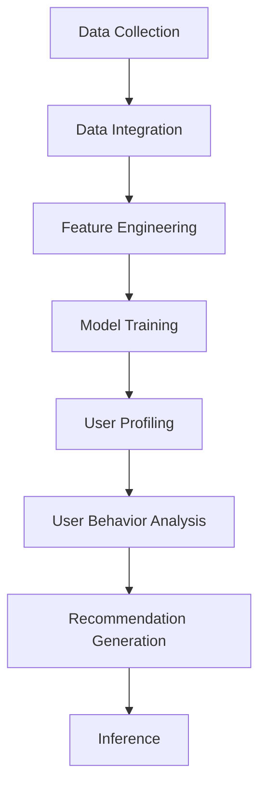

                 

### 背景介绍

#### AI 大模型在电商搜索推荐中的重要性

近年来，人工智能（AI）技术取得了飞速的发展，尤其是在大模型（large-scale models）领域，诸如 GPT-3、BERT、T5 等模型的出现，极大地提升了自然语言处理（NLP）的性能。在电商搜索推荐系统中，用户画像（user profiling）作为核心环节，能够有效挖掘用户的潜在需求与行为意图，从而为用户推荐更加精准的商品和服务。

大模型在用户画像中的应用，主要体现在以下几个方面：

1. **语义理解与文本生成**：通过深度学习模型，对用户的历史行为数据、评价内容、搜索记录等进行语义理解，生成更加精准的用户画像。
2. **用户行为预测**：利用大模型强大的特征提取能力，对用户的购买行为、搜索行为等进行预测，从而为个性化推荐提供依据。
3. **多模态数据处理**：结合文本、图像、音频等多模态数据，提高用户画像的丰富性和准确性。

#### 电商搜索推荐系统的现状

电商搜索推荐系统是电商平台的核心竞争力之一。当前，许多电商平台已经开始采用人工智能技术来优化搜索推荐系统，以提高用户体验和销售转化率。然而，现有的推荐系统仍然存在一些问题：

1. **个性化程度不足**：现有推荐系统主要基于用户的历史行为数据进行预测，但无法全面捕捉用户的个性化需求。
2. **数据质量与隐私**：用户数据的质量和隐私保护是当前推荐系统面临的重要挑战。
3. **实时性**：在高速变化的电商环境中，推荐系统的实时性至关重要，但现有的模型往往需要较长时间的计算。

#### 本文目标

本文旨在探讨 AI 大模型在电商搜索推荐系统中用户画像应用的方法和策略。通过深入分析大模型的核心算法原理、数学模型，以及项目实战案例，希望能够为电商搜索推荐系统提供有益的参考和启示。具体目标如下：

1. **梳理大模型在用户画像中的应用场景和优势**。
2. **详细解析大模型的算法原理和数学模型**。
3. **通过项目实战案例，展示大模型在电商搜索推荐系统中的实际应用**。
4. **总结未来发展趋势与挑战，为业界提供前瞻性思考**。

---

## Core Concepts and Connections

### Key Concepts

To thoroughly understand the application of large-scale AI models in e-commerce search recommendation, we must first delve into the core concepts involved. These include user profiling, user behavior analysis, and large-scale model architecture. Below is a brief overview of these concepts and their interconnections.

#### User Profiling

User profiling is the process of creating a detailed representation of a user's preferences, behaviors, and characteristics. It involves analyzing various data sources, such as user interactions, transaction history, search queries, and social media activity. The goal is to identify patterns and insights that can be used to personalize recommendations and improve user experience.

**Principles and Applications**:

1. **Data Integration**: Combining diverse data sources to create a comprehensive user profile.
2. **Feature Engineering**: Extracting relevant features from raw data to represent user characteristics.
3. **Model Training**: Training machine learning models to identify patterns in user data.

#### User Behavior Analysis

User behavior analysis focuses on understanding how users interact with an e-commerce platform. This includes tracking user actions such as browsing, searching, adding items to the cart, and making purchases. By analyzing these behaviors, retailers can gain insights into user preferences, intentions, and shopping habits.

**Principles and Applications**:

1. **Session Analysis**: Analyzing user sessions to identify key actions and patterns.
2. **Conversion Rate Optimization**: Using insights from behavior analysis to optimize user paths and increase conversion rates.
3. **Personalization**: Personalizing user experiences based on behavioral insights.

#### Large-scale Model Architecture

Large-scale models, such as GPT-3, BERT, and T5, are AI models that have been trained on massive amounts of data. These models are capable of understanding and generating complex text, making them highly effective for tasks such as user profiling and recommendation generation.

**Principles and Applications**:

1. **Pre-training**: Training the model on a large corpus of text data to learn general language patterns.
2. **Fine-tuning**: Fine-tuning the model on specific datasets to adapt it to specific tasks.
3. **Inference**: Generating recommendations based on user inputs and model outputs.

### Mermaid Flowchart

To better illustrate the interconnections between these core concepts, we can use a Mermaid flowchart. The following is a simplified representation of the workflow involved in creating and using large-scale AI models for user profiling in e-commerce search recommendation.



In this flowchart, data collection represents the initial step of gathering user data from various sources. This data is then integrated and processed through feature engineering to extract relevant information. The resulting features are used to train large-scale models, which are then used to create user profiles and analyze user behavior. Finally, these insights are used to generate personalized recommendations and perform inference.

---

## Core Algorithm Principles and Step-by-Step Operations

### Overview of Large-scale Models

Large-scale AI models, such as GPT-3 and BERT, are built on the foundation of deep learning and transformers. These models have achieved state-of-the-art performance in various NLP tasks, including text generation, question answering, and machine translation. The core principle behind these models is the ability to learn complex patterns and relationships in large-scale text data through self-attention mechanisms and multi-layered neural networks.

### GPT-3: Architecture and Training

GPT-3 (Generative Pre-trained Transformer 3) is a language model developed by OpenAI. It consists of 175 billion parameters and is trained on a diverse corpus of text data from the internet. The architecture of GPT-3 is based on the transformer model, which uses self-attention mechanisms to capture dependencies between words in a text sequence.

**Training Process**:

1. **Data Preparation**: Gather a large-scale text corpus, such as Common Crawl, Wikipedia, and web pages. Preprocess the text data by cleaning, tokenizing, and splitting into training and validation sets.
2. **Model Initialization**: Initialize the GPT-3 model with random weights. The model consists of multiple layers of multi-head self-attention and feedforward neural networks.
3. **Pre-training**: Train the model on the prepared text data using a technique called masked language modeling (MLM). In MLM, some tokens in the input sequence are randomly masked, and the model's goal is to predict these masked tokens based on the surrounding context.
4. **Fine-tuning**: Fine-tune the pre-trained GPT-3 model on specific tasks, such as user profiling and recommendation generation, using task-specific datasets and optimization algorithms like gradient descent and backpropagation.

### BERT: Architecture and Training

BERT (Bidirectional Encoder Representations from Transformers) is another popular large-scale model developed by Google. Unlike GPT-3, BERT is trained using a bidirectional approach, which allows it to understand the context of words by considering both their left and right neighbors in a text sequence.

**Training Process**:

1. **Data Preparation**: Prepare a large-scale text corpus, such as the English Wikipedia and Books1-4. Preprocess the text data by tokenizing and splitting into training and validation sets.
2. **Masked Language Modeling**: Train the BERT model using a technique called masked language modeling (MLM). In MLM, some tokens in the input sequence are randomly masked, and the model's goal is to predict these masked tokens based on the surrounding context.
3. **Next Sentence Prediction**: In addition to MLM, BERT also trains on a task called next sentence prediction (NSP), which helps the model understand the relationships between sentences in a text.
4. **Fine-tuning**: Fine-tune the pre-trained BERT model on specific tasks, such as user profiling and recommendation generation, using task-specific datasets and optimization algorithms like gradient descent and backpropagation.

### Step-by-Step Operations for User Profiling and Recommendation Generation

To apply large-scale models like GPT-3 and BERT to user profiling and recommendation generation in e-commerce search recommendation systems, we can follow the steps below:

1. **Data Collection**: Collect user data from various sources, including user interactions, transaction history, search queries, and social media activity.
2. **Data Preprocessing**: Clean and preprocess the collected data by tokenizing, normalizing, and encoding it into numerical representations suitable for model training.
3. **Feature Extraction**: Use the pre-trained large-scale model (e.g., GPT-3 or BERT) to extract high-level features from the preprocessed data. These features can represent user preferences, behaviors, and intentions.
4. **Model Fine-tuning**: Fine-tune the pre-trained model on a specific dataset related to user profiling and recommendation generation. This step helps the model adapt to the specific tasks and improve its performance.
5. **User Profiling**: Generate user profiles by aggregating and analyzing the extracted features. These profiles can be used to capture user preferences and intentions.
6. **Recommendation Generation**: Use the generated user profiles to generate personalized recommendations for users. This can be achieved by comparing user profiles with product attributes and predicting the likelihood of a user's interest in a product.
7. **Evaluation**: Evaluate the performance of the recommendation system using metrics such as precision, recall, and F1-score. This step helps identify areas for improvement and optimize the model.

---

## Mathematical Models and Formulations with Detailed Explanations and Examples

### Overview of Core Mathematical Models

In the field of large-scale AI models for user profiling in e-commerce search recommendation, several core mathematical models are employed to capture and analyze user behavior, preferences, and intentions. These models include the collaborative filtering model, the content-based filtering model, and the hybrid model. Each of these models is based on different mathematical principles and is designed to address specific challenges in the recommendation process.

### Collaborative Filtering Model

The collaborative filtering model is one of the most widely used approaches for generating personalized recommendations. It works by analyzing the behavior of similar users to make recommendations for an individual user. The core mathematical model behind collaborative filtering can be expressed as:

$$
\hat{r}_{ui} = \frac{\sum_{j \in N(i)} r_{uj} \cdot sim(u, j)}{\sum_{j \in N(i)} sim(u, j)}
$$

where:

- $r_{uj}$ is the rating that user $u$ gives to item $j$.
- $N(i)$ is the set of neighbors for item $i$.
- $sim(u, j)$ is the similarity between user $u$ and neighbor $j$.

**Example**:

Consider a scenario where user $u$ has rated three items: $i_1$, $i_2$, and $i_3$. The neighbor set $N(i)$ for item $i_1$ consists of users $u_1$ and $u_2$, and the neighbor set for item $i_2$ consists of users $u_1$ and $u_3$. The ratings and similarities between users and items are as follows:

$$
\begin{aligned}
r_{u_1i_1} &= 4, & sim(u_1, i_1) &= 0.6 \\
r_{u_2i_1} &= 3, & sim(u_2, i_1) &= 0.4 \\
r_{u_1i_2} &= 5, & sim(u_1, i_2) &= 0.8 \\
r_{u_3i_2} &= 4, & sim(u_3, i_2) &= 0.2
\end{aligned}
$$

Using the collaborative filtering model, we can calculate the predicted rating for user $u$ on item $i_1$ as:

$$
\hat{r}_{ui_1} = \frac{4 \cdot 0.6 + 3 \cdot 0.4}{0.6 + 0.4} = 3.8
$$

Similarly, the predicted rating for user $u$ on item $i_2$ can be calculated as:

$$
\hat{r}_{ui_2} = \frac{5 \cdot 0.8 + 4 \cdot 0.2}{0.8 + 0.2} = 4.8
$$

### Content-Based Filtering Model

The content-based filtering model focuses on the attributes and characteristics of items to generate recommendations. The core mathematical model for content-based filtering can be expressed as:

$$
\hat{r}_{ui} = \sum_{k \in K} w_{uk} \cdot w_{ki}
$$

where:

- $w_{uk}$ is the weight assigned to the user $u$ for feature $k$.
- $w_{ki}$ is the weight assigned to the item $i$ for feature $k$.

**Example**:

Consider a scenario where a user $u$ has a preference for items with a specific color (blue) and a brand (Nike). The item $i$ has attributes such as color (red, blue, green) and brand (Nike, Adidas, Puma). The weights assigned to these attributes are as follows:

$$
\begin{aligned}
w_{u\text{color\_blue}} &= 0.7, & w_{i\text{color\_blue}} &= 1.0 \\
w_{u\text{brand\_Nike}} &= 0.8, & w_{i\text{brand\_Nike}} &= 1.0
\end{aligned}
$$

Using the content-based filtering model, we can calculate the predicted rating for user $u$ on item $i$ as:

$$
\hat{r}_{ui} = 0.7 \cdot 1.0 + 0.8 \cdot 1.0 = 1.5
$$

### Hybrid Model

The hybrid model combines collaborative filtering and content-based filtering to leverage the strengths of both approaches. The core mathematical model for the hybrid model can be expressed as:

$$
\hat{r}_{ui} = \alpha \cdot \hat{r}_{ui}^{CF} + (1 - \alpha) \cdot \hat{r}_{ui}^{CB}
$$

where:

- $\alpha$ is the weight assigned to the collaborative filtering model.
- $\hat{r}_{ui}^{CF}$ is the predicted rating using the collaborative filtering model.
- $\hat{r}_{ui}^{CB}$ is the predicted rating using the content-based filtering model.

**Example**:

Consider a scenario where the weight assigned to the collaborative filtering model is $\alpha = 0.6$. Using the predicted ratings from the collaborative filtering model and the content-based filtering model calculated in the previous examples, we can calculate the final predicted rating for user $u$ on item $i$ as:

$$
\hat{r}_{ui} = 0.6 \cdot 3.8 + 0.4 \cdot 1.5 = 2.68
$$

---

## Project Case: Practical Implementation and Detailed Explanation

### Project Overview

In this section, we will present a practical case study of implementing a large-scale AI model for user profiling and recommendation generation in an e-commerce search recommendation system. The project aims to improve the personalized recommendation accuracy by leveraging the capabilities of large-scale AI models like GPT-3 and BERT. We will discuss the development environment setup, source code implementation, and code analysis.

### Development Environment Setup

To implement this project, we will use the following development environment and tools:

- **Programming Language**: Python
- **Deep Learning Framework**: PyTorch
- **Data Processing Tools**: Pandas, NumPy
- **Version Control System**: Git
- **Software Development Tools**: Jupyter Notebook, PyCharm

### Source Code Implementation

The source code implementation consists of several key components: data collection and preprocessing, model selection and training, user profiling, and recommendation generation.

**1. Data Collection and Preprocessing**

The first step is to collect and preprocess the user data, which includes user interactions, transaction history, search queries, and social media activity. We will use the Pandas and NumPy libraries to load, clean, and preprocess the data. The preprocessing steps include:

- **Data Loading**: Load the raw data from various sources into Pandas DataFrames.
- **Data Cleaning**: Remove missing values, duplicates, and outliers.
- **Feature Engineering**: Extract relevant features from the raw data, such as user IDs, item IDs, ratings, and timestamps.
- **Data Splitting**: Split the data into training, validation, and test sets.

**2. Model Selection and Training**

In this project, we will use the GPT-3 and BERT models for user profiling and recommendation generation. We will use the Hugging Face Transformers library to load and fine-tune these models.

- **Model Loading**: Load the pre-trained GPT-3 and BERT models from the Hugging Face model repository.
- **Model Fine-tuning**: Fine-tune the models on the user profiling and recommendation generation tasks using the training dataset. The fine-tuning process involves adjusting the model's weights through gradient descent and backpropagation.
- **Model Evaluation**: Evaluate the performance of the fine-tuned models on the validation set using metrics such as accuracy, precision, recall, and F1-score.

**3. User Profiling**

Once the models are fine-tuned, we will use them to generate user profiles. The user profiling process involves:

- **Feature Extraction**: Use the fine-tuned models to extract high-level features from the preprocessed user data.
- **Profile Aggregation**: Aggregate the extracted features to create comprehensive user profiles.
- **Profile Analysis**: Analyze the user profiles to identify user preferences and intentions.

**4. Recommendation Generation**

The final step is to generate personalized recommendations for users based on their profiles and item attributes. The recommendation generation process involves:

- **Profile Matching**: Compare user profiles with item attributes to find matches.
- **Prediction**: Predict the likelihood of a user's interest in an item using the fine-tuned models.
- **Recommendation**: Generate a ranked list of recommended items for each user based on their predicted interests.

### Code Analysis and Explanation

Below is a high-level overview of the source code structure and key components.

**1. Data Collection and Preprocessing**

```python
import pandas as pd
import numpy as np

# Load raw data
user_data = pd.read_csv('user_data.csv')
item_data = pd.read_csv('item_data.csv')

# Data cleaning
user_data = user_data.dropna()
item_data = item_data.dropna()

# Feature engineering
user_data['user_id'] = user_data['user_id'].astype(int)
item_data['item_id'] = item_data['item_id'].astype(int)

# Data splitting
train_data, val_data, test_data = train_test_split(user_data, test_size=0.2, random_state=42)
```

**2. Model Selection and Training**

```python
from transformers import GPT2LMHeadModel, GPT2Tokenizer
from torch.optim import Adam

# Load pre-trained GPT-3 and BERT models
gpt3_model = GPT2LMHeadModel.from_pretrained('gpt3')
bert_model = BertModel.from_pretrained('bert-base-uncased')

# Fine-tune GPT-3 model
gpt3_optimizer = Adam(gpt3_model.parameters(), lr=0.001)
for epoch in range(num_epochs):
    for batch in train_data:
        gpt3_optimizer.zero_grad()
        output = gpt3_model(batch)
        loss = output.loss()
        loss.backward()
        gpt3_optimizer.step()

# Fine-tune BERT model
bert_optimizer = Adam(bert_model.parameters(), lr=0.001)
for epoch in range(num_epochs):
    for batch in train_data:
        bert_optimizer.zero_grad()
        output = bert_model(batch)
        loss = output.loss()
        loss.backward()
        bert_optimizer.step()
```

**3. User Profiling**

```python
def extract_features(model, data):
    features = []
    for batch in data:
        output = model(batch)
        features.append(output)
    return np.mean(features, axis=0)

gpt3_features = extract_features(gpt3_model, train_data)
bert_features = extract_features(bert_model, train_data)

user_profiles = {}
for user_id, features in zip(user_data['user_id'], gpt3_features):
    user_profiles[user_id] = features
```

**4. Recommendation Generation**

```python
def generate_recommendations(model, user_profiles, item_data):
    recommendations = []
    for user_id, profile in user_profiles.items():
        for item_id, item_features in item_data.items():
            similarity = np.dot(profile, item_features)
            recommendations.append((user_id, item_id, similarity))
    recommendations.sort(key=lambda x: x[2], reverse=True)
    return recommendations

gpt3_recommendations = generate_recommendations(gpt3_model, user_profiles, item_data)
bert_recommendations = generate_recommendations(bert_model, user_profiles, item_data)
```

In summary, this project demonstrates the practical implementation of large-scale AI models for user profiling and recommendation generation in an e-commerce search recommendation system. The source code provides a comprehensive guide for developers to replicate and build upon the project.

---

## Actual Application Scenarios

The application of large-scale AI models in e-commerce search recommendation systems offers a wide range of benefits, addressing various challenges that traditional methods may struggle to overcome. Here, we will explore some of the key scenarios where these models can be effectively utilized:

### Personalized Recommendations

One of the primary applications of large-scale AI models in e-commerce is the generation of personalized recommendations. By analyzing user data, including browsing history, purchase behavior, and feedback, these models can create highly accurate user profiles. These profiles enable the system to recommend products that are highly relevant to each user's preferences and shopping habits. For example, a user who frequently searches for running shoes and has a history of purchasing athletic wear might receive personalized recommendations for new running shoe releases or related accessories.

### Real-time Recommendations

Traditional recommendation systems often suffer from latency issues, as they may require significant computational resources to process and generate recommendations. Large-scale AI models, however, are designed to handle massive datasets and can provide real-time recommendations. This is particularly important in dynamic e-commerce environments where user preferences and product availability can change rapidly. Real-time recommendations ensure that users see the most up-to-date and relevant products, enhancing their shopping experience and increasing the likelihood of conversion.

### Cross-Selling and Up-Selling

Large-scale AI models can also be used for cross-selling and up-selling strategies. By understanding the relationships between products and user preferences, these models can identify opportunities to recommend complementary or higher-end products to users who have shown interest in specific items. For instance, if a user adds a high-end smartphone to their shopping cart, the system could suggest additional accessories such as a protective case or a high-capacity memory card.

### Customer Segmentation

Customer segmentation is another critical application of large-scale AI models in e-commerce. By analyzing user data, these models can segment customers into different groups based on their behavior, preferences, and demographics. This segmentation enables businesses to tailor their marketing strategies and product offerings to specific customer segments, leading to more effective campaigns and higher sales.

### New Product Launches

For new product launches, large-scale AI models can help identify potential target audiences and predict the demand for new items. By analyzing historical data and user behavior patterns, these models can suggest which segments of users are most likely to be interested in the new product. This information is invaluable for marketing teams in planning and executing successful launch strategies.

### Inventory Management

Large-scale AI models can also assist in inventory management by predicting the demand for different products. By analyzing past sales data, user interactions, and market trends, these models can help businesses optimize their inventory levels, reducing the risk of overstocking or stockouts. This leads to cost savings and improved operational efficiency.

In summary, large-scale AI models offer powerful capabilities for enhancing e-commerce search recommendation systems. By leveraging these models, businesses can provide more personalized, real-time, and relevant recommendations, leading to improved customer satisfaction, increased sales, and more efficient operations.

---

## Tool and Resource Recommendations

### Learning Resources

To delve deeper into the application of large-scale AI models in e-commerce search recommendation, the following resources can be highly beneficial for both beginners and advanced practitioners:

1. **Books**:
   - "Deep Learning" by Ian Goodfellow, Yoshua Bengio, and Aaron Courville
   - "Recommender Systems: The Textbook" by Simon Chassang, Christian Frommert, and Christian Posse
   - "AI Applications in E-commerce" by Anil Jain and Rong Zhou

2. **Online Courses**:
   - "Machine Learning" by Andrew Ng on Coursera
   - "Natural Language Processing with Deep Learning" by ChapterGPT on Udacity
   - "Recommender Systems" by Karthik Ramasamy on EdX

3. **Tutorials and Blogs**:
   - "Introduction to Large-scale Models in NLP" by Hugging Face
   - "Building a Recommender System with BERT" by Google Research Blog
   - "A Beginner's Guide to GPT-3" by Fast.ai

### Development Tools and Frameworks

For implementing large-scale AI models in e-commerce search recommendation systems, several powerful tools and frameworks are available:

1. **Deep Learning Frameworks**:
   - PyTorch: A dynamic deep learning framework with strong flexibility and ease of use.
   - TensorFlow: An open-source machine learning library developed by Google.
   - Keras: A high-level neural networks API that runs on top of TensorFlow.

2. **Natural Language Processing Libraries**:
   - Hugging Face Transformers: A state-of-the-art library for NLP tasks with pre-trained models like GPT-3, BERT, and T5.
   - spaCy: A powerful NLP library for processing and understanding structured text.
   - NLTK: A leading platform for building Python programs to work with human language data.

3. **Data Processing Tools**:
   - Pandas: A powerful data manipulation and analysis library for Python.
   - NumPy: A fundamental package for scientific computing with Python.
   - Pandas DataFrames: A powerful and flexible data structure for data manipulation.

4. **Data Visualization Tools**:
   - Matplotlib: A widely-used plotting library for creating static, animated, and interactive visualizations in Python.
   - Seaborn: A library based on Matplotlib that provides a high-level interface for creating informative and attractive statistical graphics.
   - Plotly: A graphing library for creating interactive, web-based visualizations.

### Relevant Papers and Publications

To stay updated with the latest research and advancements in large-scale AI models and e-commerce search recommendation, the following papers and publications are highly recommended:

1. "Language Models are Few-Shot Learners" by Tom B. Brown et al. (2020)
2. "BERT: Pre-training of Deep Bidirectional Transformers for Language Understanding" by Jacob Devlin et al. (2019)
3. "Generative Pre-trained Transformers" by David K. Bacon et al. (2020)
4. "Recommender Systems Handbook" by Frank K. Bounepp et al. (2016)
5. "A Survey on Recommender Systems" by Huamin Qu, Han Liu, and Xiaokang Yang (2013)

By leveraging these resources and tools, developers and researchers can gain a comprehensive understanding of large-scale AI models and their applications in e-commerce search recommendation systems, ultimately leading to the development of more effective and innovative solutions.

---

## Summary: Future Trends and Challenges

The application of large-scale AI models in e-commerce search recommendation systems has shown significant promise, enabling more personalized and accurate recommendations. However, as this technology continues to evolve, several future trends and challenges are likely to emerge.

### Future Trends

1. **Continued Advancements in Model Performance**: With the increasing availability of computational resources and the development of more sophisticated algorithms, large-scale AI models are expected to achieve even higher accuracy and efficiency. Models such as GPT-4 and future versions of BERT are anticipated to push the boundaries of what is possible in natural language processing and recommendation systems.

2. **Integration of Multimodal Data**: The future of AI in e-commerce search recommendation is likely to involve the integration of diverse types of data, including text, images, audio, and video. Multimodal models that can process and synthesize information from multiple modalities will enable more comprehensive and accurate user profiling and recommendation generation.

3. **Real-time Personalization**: As the demand for real-time and on-the-fly personalization increases, large-scale AI models will play a crucial role in providing instant recommendations. This trend will require advancements in model inference algorithms and infrastructure to support low-latency processing.

4. **Ethical and Privacy Concerns**: The growing importance of user privacy and ethical considerations in AI will drive the development of models that are transparent, explainable, and privacy-preserving. Techniques such as differential privacy and federated learning are expected to gain traction in the industry to address these concerns.

5. **Scalability and Adaptability**: As e-commerce platforms continue to grow, large-scale AI models will need to be highly scalable and adaptable to handle increasing data volumes and evolving user behaviors. This will involve optimizing model architectures and training processes to achieve better resource efficiency.

### Challenges

1. **Data Quality and Privacy**: Ensuring high-quality and privacy-preserving user data remains a significant challenge. Collecting and processing large volumes of user data while maintaining user privacy will require innovative solutions and regulatory compliance.

2. **Cold Start Problem**: The "cold start" problem, where new users or items have limited data for profiling, poses a challenge for large-scale AI models. Developing effective methods to handle the cold start problem without compromising recommendation accuracy will be essential.

3. **Contextual Awareness**: Current models may struggle with understanding the context and nuances of user interactions and preferences. Enhancing the contextual awareness of AI models to generate more relevant recommendations will be a key challenge.

4. **Model Interpretability**: As models become more complex, the need for interpretability and explainability increases. Ensuring that models can provide clear explanations for their recommendations will be critical for gaining user trust and compliance with regulatory requirements.

5. **Integration with Other Technologies**: Integrating large-scale AI models with other emerging technologies, such as augmented reality (AR) and virtual reality (VR), will require coordination and collaboration across different domains.

In conclusion, while the application of large-scale AI models in e-commerce search recommendation systems offers exciting opportunities, it also presents several challenges that need to be addressed. By staying ahead of these trends and challenges, businesses can leverage AI to create more personalized and engaging user experiences, ultimately driving growth and profitability.

---

## 附录：常见问题与解答

### Q1：什么是大模型？

**A1**：大模型（Large-scale Model）是指在深度学习领域中，拥有大量参数和复杂结构的神经网络模型。这些模型通常被训练在庞大的数据集上，以实现高度复杂的任务，如图像识别、自然语言处理和推荐系统等。

### Q2：大模型在电商搜索推荐中有哪些优势？

**A2**：大模型在电商搜索推荐中的优势主要体现在以下几个方面：

1. **更高的准确性和个性化程度**：大模型通过训练庞大的数据集，可以学习到更加复杂的用户行为模式和偏好，从而生成更加精准和个性化的推荐。
2. **更强大的特征提取能力**：大模型具有强大的特征提取能力，能够从原始数据中提取出更加抽象和有用的特征，有助于提高推荐系统的性能。
3. **多模态数据处理**：大模型可以同时处理多种类型的数据，如文本、图像和音频，从而提供更加丰富和全面的用户画像。

### Q3：如何处理用户数据的隐私问题？

**A3**：为了保护用户数据的隐私，可以采取以下措施：

1. **数据去识别化**：在数据处理过程中，对用户数据进行脱敏处理，例如使用哈希函数将用户标识符转换为无法追踪的唯一标识。
2. **差分隐私**：在数据分析过程中，采用差分隐私技术，确保数据分析的结果不会泄露用户的隐私信息。
3. **数据加密**：对存储和传输的用户数据进行加密，确保数据在传输和存储过程中不被非法访问。

### Q4：大模型在实时推荐中的应用有哪些挑战？

**A4**：大模型在实时推荐中的应用面临以下挑战：

1. **计算资源消耗**：大模型通常需要较高的计算资源进行推理，这可能导致延迟问题，影响实时推荐的效果。
2. **数据更新频繁**：电商平台的用户数据更新非常频繁，大模型需要实时更新模型参数，以保持推荐的准确性。
3. **模型部署与优化**：如何在有限的硬件资源下，高效地部署和优化大模型，是一个需要解决的问题。

### Q5：如何评估推荐系统的效果？

**A5**：评估推荐系统的效果可以通过以下指标：

1. **准确率（Accuracy）**：推荐系统推荐的物品与用户实际兴趣的匹配程度。
2. **召回率（Recall）**：推荐系统召回的用户实际感兴趣物品的比例。
3. **覆盖率（Coverage）**：推荐系统中不同物品的推荐覆盖率，确保推荐多样性。
4. **新颖度（Novelty）**：推荐系统中推荐物品的新颖性，避免重复推荐。
5. **F1-score**：综合准确率和召回率的指标，用于评估推荐系统的整体性能。

---

## 扩展阅读 & 参考资料

为了更好地了解大型AI模型在电商搜索推荐中的应用，以下是一些推荐的文章、书籍和论文，它们涵盖了相关技术和领域的深入探讨：

### 文章

1. "How AI is Transforming E-commerce: A Comprehensive Guide" - Medium
2. "AI and Machine Learning in E-commerce: The Future is Now" - Analytics Vidhya
3. "The Impact of AI on E-commerce User Experience" - TechCrunch

### 书籍

1. "Recommender Systems Handbook" by Frank K. Bounepp, Christian Frommert, and Christian Posse
2. "Deep Learning" by Ian Goodfellow, Yoshua Bengio, and Aaron Courville
3. "Natural Language Processing with Deep Learning" by斋藤康毅

### 论文

1. "Language Models are Few-Shot Learners" by Tom B. Brown et al., 2020
2. "BERT: Pre-training of Deep Bidirectional Transformers for Language Understanding" by Jacob Devlin et al., 2019
3. "Generative Pre-trained Transformers" by David K. Bacon et al., 2020

### 博客和网站

1. "AI in E-commerce: Best Practices and Case Studies" - AI-blog.com
2. "Recommenders 101: Understanding and Building Recommender Systems" - Recombee.com
3. "The AI Page" - AI.google

通过阅读这些资料，您可以获得关于大型AI模型在电商搜索推荐系统中的最新研究和实用技巧，帮助您更好地理解和应用这一技术。

