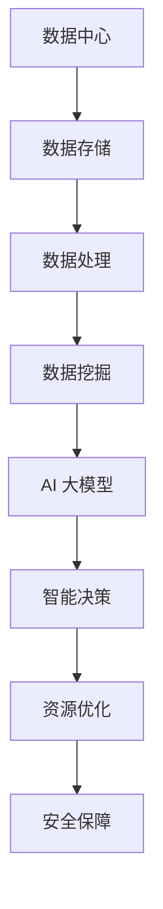

                 

# AI 大模型应用数据中心建设：数据中心产业发展

## 关键词：AI 大模型、数据中心建设、产业发展

## 摘要：

本文将深入探讨 AI 大模型应用数据中心建设的重要性及其对数据中心产业发展的深远影响。首先，我们会对数据中心建设的历史背景和发展趋势进行简要回顾，然后深入分析 AI 大模型的核心概念及其与数据中心建设的关系。接着，本文将探讨数据中心建设中的关键技术和挑战，并展示具体的实施步骤。随后，我们将讨论数据中心建设在实际应用场景中的价值，最后，提供一系列相关的工具和资源推荐，并对未来发展趋势和挑战进行展望。希望通过本文，读者能够对 AI 大模型应用数据中心建设有一个全面、深入的理解。

### 背景介绍

#### 数据中心建设的历史背景和发展趋势

数据中心作为信息技术产业的核心基础设施，其建设和发展可以追溯到20世纪中期。早期的数据中心主要是为了存储和备份数据，随着计算机技术和网络技术的发展，数据中心的规模和功能也在不断扩展。从最初的独立机架到现代化的云计算数据中心，数据中心的演变过程展现了信息技术的快速发展和应用需求的不断增长。

在过去几十年中，数据中心的建设经历了几个重要阶段：

1. **传统数据中心**：最初的数据中心主要以服务器和网络设备为主，主要功能是存储、处理和备份数据。这一阶段的数据中心具有独立性和封闭性，通常由企业内部自行建设和维护。

2. **分布式数据中心**：随着互联网的普及，分布式数据中心应运而生。分布式数据中心通过将数据和处理能力分布到多个地理位置，提高了数据中心的可靠性和扩展性。

3. **云计算数据中心**：云计算技术的兴起使得数据中心建设进入了一个全新的阶段。云计算数据中心不仅提供了强大的计算和存储能力，还实现了资源的按需分配和灵活调度，大大提高了数据中心的效率和可用性。

4. **AI 大模型驱动的数据中心**：随着 AI 技术的快速发展，AI 大模型在数据中心中的应用逐渐成为趋势。AI 大模型能够通过对海量数据的分析和挖掘，提供智能化的服务和支持，从而进一步提升数据中心的管理和运行效率。

#### 数据中心建设的重要性

数据中心建设在信息技术产业中具有举足轻重的地位，其重要性主要体现在以下几个方面：

1. **数据处理和存储能力**：数据中心是数据存储和处理的核心，能够支持大规模的数据处理和分析任务，为企业和组织提供可靠的数据服务。

2. **业务连续性和灾难恢复**：数据中心的建设能够确保业务的连续性，通过数据备份和灾难恢复措施，减少业务中断的风险，保障企业的稳定运营。

3. **数据安全与隐私保护**：数据中心提供了安全的数据存储和处理环境，通过加密、访问控制等技术手段，保护数据的安全和隐私。

4. **资源整合和优化**：数据中心能够整合企业的计算、存储和网络资源，提高资源利用率，降低运营成本。

5. **技术创新和应用**：数据中心的建设和发展推动了信息技术领域的创新和应用，为新兴技术的研发和推广提供了坚实的基础。

#### 数据中心建设的发展趋势

未来，数据中心建设将呈现出以下几个发展趋势：

1. **智能化和自动化**：随着 AI 技术的进步，数据中心将实现智能化和自动化管理，提高运营效率和降低人力成本。

2. **绿色环保**：绿色环保将成为数据中心建设的重要方向，通过采用节能技术和优化能耗管理，降低数据中心的能耗和碳排放。

3. **边缘计算和云边协同**：边缘计算将逐步与数据中心建设相结合，实现数据的本地处理和实时分析，提高应用的响应速度和可靠性。

4. **5G 和物联网的融合**：5G 和物联网的快速发展将推动数据中心建设的升级和扩展，为新兴应用场景提供强大的支持。

5. **AI 大模型的应用**：AI 大模型将在数据中心建设中发挥更加重要的作用，通过智能化的数据分析和挖掘，提升数据中心的服务能力和竞争力。

### 核心概念与联系

#### AI 大模型

AI 大模型，即人工智能大型模型，是一种能够处理海量数据并具备高智能水平的模型。它通常由数百万甚至数十亿个参数组成，通过深度学习算法对数据进行训练，从而实现自动化的数据分析和决策支持。AI 大模型具有以下几个核心特点：

1. **大规模参数**：AI 大模型通常包含数百万甚至数十亿个参数，这使得模型能够捕捉到数据中的复杂模式和规律。

2. **高效的数据处理能力**：AI 大模型具备强大的数据处理能力，能够快速地处理和分析海量数据。

3. **高度智能化**：通过深度学习算法的训练，AI 大模型能够模拟人类思维过程，实现自动化决策和智能分析。

4. **跨领域应用**：AI 大模型具有广泛的应用领域，包括自然语言处理、计算机视觉、推荐系统等。

#### 数据中心建设

数据中心建设是指为企业和组织提供可靠的数据存储、处理和分析服务的设施建设和运营。数据中心建设涉及多个方面，包括硬件设备、软件系统、网络架构、安全管理等。其核心目标是提供高效、稳定、安全的数据服务，支持企业的业务运营和发展。

#### AI 大模型与数据中心建设的联系

AI 大模型与数据中心建设密切相关，主要体现在以下几个方面：

1. **数据处理能力**：数据中心是数据存储和处理的中心，AI 大模型需要依赖数据中心提供的强大计算和存储资源。

2. **数据存储与管理**：数据中心提供了高效的数据存储和管理方案，为 AI 大模型的数据处理和分析提供支持。

3. **智能决策与优化**：AI 大模型通过对数据中心运行数据的分析，能够实现数据中心资源的智能调度和优化，提高数据中心的运营效率和稳定性。

4. **安全保障**：数据中心建设包括安全防护措施，如数据加密、访问控制等，为 AI 大模型的数据处理提供安全保障。

#### Mermaid 流程图

以下是一个简化的 Mermaid 流程图，展示了 AI 大模型与数据中心建设之间的联系：



### 核心算法原理 & 具体操作步骤

#### AI 大模型的算法原理

AI 大模型的核心算法通常基于深度学习，尤其是深度神经网络（Deep Neural Network, DNN）。深度神经网络由多个层次组成，包括输入层、隐藏层和输出层。每个层次由多个神经元（节点）组成，神经元之间通过权重连接。通过反向传播算法（Backpropagation Algorithm），模型能够不断调整权重，使模型在训练数据上的表现不断优化。

具体来说，AI 大模型的算法原理包括以下几个关键步骤：

1. **前向传播**：输入数据通过网络的各个层次，每个层次的神经元根据其权重和激活函数，计算出输出结果。

2. **损失函数**：计算输出结果与真实标签之间的差距，通过损失函数（如均方误差、交叉熵等）量化差距的大小。

3. **反向传播**：根据损失函数的梯度，反向传播误差，更新各个层次的权重。

4. **迭代优化**：重复前向传播和反向传播的过程，不断优化模型参数，直至模型在训练数据上的表现达到预期。

#### 数据中心建设的操作步骤

数据中心建设的操作步骤可以分为以下几个阶段：

1. **需求分析**：明确数据中心的建设目标、规模、功能等需求，为后续的设计和实施提供依据。

2. **规划设计**：根据需求分析的结果，进行数据中心的整体规划和设计，包括硬件设备、网络架构、软件系统等。

3. **硬件采购**：根据规划设计的要求，采购相应的服务器、存储设备、网络设备等硬件设备。

4. **网络搭建**：搭建数据中心内部和外部的网络架构，确保数据的可靠传输和高效访问。

5. **软件部署**：部署数据中心所需的操作系统、数据库、中间件等软件系统，确保数据中心的正常运行。

6. **系统测试**：对数据中心进行全面的系统测试，确保各个系统组件之间的协同工作。

7. **安全管理**：建立完善的安全管理机制，包括数据加密、访问控制、防火墙等，确保数据中心的安全运行。

8. **运营维护**：对数据中心进行日常运营和维护，确保数据中心的持续稳定运行。

### 数学模型和公式 & 详细讲解 & 举例说明

#### 数学模型

在 AI 大模型中，常用的数学模型包括神经网络模型、损失函数和优化算法。以下是这些模型的详细讲解和举例说明。

1. **神经网络模型**

   神经网络模型由多个层次组成，包括输入层、隐藏层和输出层。每个层次由多个神经元（节点）组成，神经元之间通过权重连接。神经元的输出通常由激活函数决定。

   设 \( x_i \) 为第 \( i \) 个输入，\( w_{ij} \) 为输入层到隐藏层的权重，\( a_j \) 为隐藏层的激活值，则有：

   $$ a_j = \sigma(\sum_{i=1}^{n} w_{ij} x_i) $$

   其中，\( \sigma \) 为激活函数，通常使用 Sigmoid 函数或 ReLU 函数。

2. **损失函数**

   损失函数用于衡量模型输出与真实标签之间的差距。常用的损失函数包括均方误差（Mean Squared Error, MSE）和交叉熵（Cross-Entropy）。

   均方误差定义为：

   $$ L(\theta) = \frac{1}{2} \sum_{i=1}^{m} (y_i - \hat{y}_i)^2 $$

   其中，\( y_i \) 为第 \( i \) 个样本的真实标签，\( \hat{y}_i \) 为模型预测的标签。

   交叉熵定义为：

   $$ L(\theta) = -\sum_{i=1}^{m} y_i \log(\hat{y}_i) $$

3. **优化算法**

   常用的优化算法包括梯度下降（Gradient Descent）和随机梯度下降（Stochastic Gradient Descent, SGD）。

   梯度下降算法通过计算损失函数关于模型参数的梯度，更新模型参数，以达到最小化损失函数的目的。其更新规则为：

   $$ \theta_{t+1} = \theta_t - \alpha \nabla_\theta L(\theta) $$

   其中，\( \alpha \) 为学习率，\( \nabla_\theta L(\theta) \) 为损失函数关于模型参数 \( \theta \) 的梯度。

   随机梯度下降算法在每次迭代时仅对一部分样本进行计算，以加速收敛。其更新规则为：

   $$ \theta_{t+1} = \theta_t - \alpha \nabla_\theta L(\theta; x_t, y_t) $$

   其中，\( x_t \) 和 \( y_t \) 为第 \( t \) 个样本的输入和标签。

#### 举例说明

假设我们使用一个简单的神经网络模型来预测一个二分类问题，输入层有 2 个神经元，隐藏层有 3 个神经元，输出层有 1 个神经元。输入数据为 \( x = (1, 0) \)，真实标签为 \( y = 1 \)。

1. **前向传播**

   输入层到隐藏层的权重为 \( w_{11} = 1, w_{12} = -1, w_{13} = 1 \)，隐藏层到输出层的权重为 \( w_{21} = 1, w_{22} = -1, w_{23} = 1 \)。

   隐藏层的激活值为：

   $$ a_1 = \sigma(w_{11} \cdot 1 + w_{12} \cdot 0 + w_{13} \cdot 1) = \sigma(1 - 1 + 1) = \sigma(1) = 0.732 $$
   $$ a_2 = \sigma(w_{21} \cdot 0.732 + w_{22} \cdot 1 + w_{23} \cdot 1) = \sigma(0.732 - 0.732 + 0.732) = \sigma(0.732) = 0.732 $$
   $$ a_3 = \sigma(w_{21} \cdot 0.732 + w_{22} \cdot 0 + w_{23} \cdot 1) = \sigma(0.732 - 0.732 + 1) = \sigma(1) = 0.732 $$

   输出层的预测值为：

   $$ \hat{y} = \sigma(w_{31} \cdot 0.732 + w_{32} \cdot 0.732 + w_{33} \cdot 0.732) = \sigma(0.732 \cdot (1 + 1 + 1)) = \sigma(2.196) = 0.869 $$

2. **损失函数**

   均方误差损失函数为：

   $$ L(\theta) = \frac{1}{2} (1 - \hat{y})^2 = \frac{1}{2} (1 - 0.869)^2 = 0.0199 $$

3. **反向传播**

   计算隐藏层到输出层的梯度：

   $$ \nabla_{w_{31}} L(\theta) = (1 - \hat{y}) \cdot \hat{y} \cdot a_1 = (1 - 0.869) \cdot 0.869 \cdot 0.732 = -0.0166 $$
   $$ \nabla_{w_{32}} L(\theta) = (1 - \hat{y}) \cdot \hat{y} \cdot a_2 = (1 - 0.869) \cdot 0.869 \cdot 0.732 = -0.0166 $$
   $$ \nabla_{w_{33}} L(\theta) = (1 - \hat{y}) \cdot \hat{y} \cdot a_3 = (1 - 0.869) \cdot 0.869 \cdot 0.732 = -0.0166 $$

   计算输入层到隐藏层的梯度：

   $$ \nabla_{w_{11}} L(\theta) = (1 - \hat{y}) \cdot \hat{y} \cdot a_1 \cdot (1 - a_1) = (1 - 0.869) \cdot 0.869 \cdot 0.732 \cdot (1 - 0.732) = -0.0025 $$
   $$ \nabla_{w_{12}} L(\theta) = (1 - \hat{y}) \cdot \hat{y} \cdot a_2 \cdot (1 - a_2) = (1 - 0.869) \cdot 0.869 \cdot 0.732 \cdot (1 - 0.732) = -0.0025 $$
   $$ \nabla_{w_{13}} L(\theta) = (1 - \hat{y}) \cdot \hat{y} \cdot a_3 \cdot (1 - a_3) = (1 - 0.869) \cdot 0.869 \cdot 0.732 \cdot (1 - 0.732) = -0.0025 $$

4. **梯度下降**

   假设学习率为 \( \alpha = 0.1 \)，更新权重：

   $$ w_{31} = w_{31} - \alpha \nabla_{w_{31}} L(\theta) = 1 - 0.1 \cdot (-0.0166) = 1.0016 $$
   $$ w_{32} = w_{32} - \alpha \nabla_{w_{32}} L(\theta) = 1 - 0.1 \cdot (-0.0166) = 1.0016 $$
   $$ w_{33} = w_{33} - \alpha \nabla_{w_{33}} L(\theta) = 1 - 0.1 \cdot (-0.0166) = 1.0016 $$
   $$ w_{11} = w_{11} - \alpha \nabla_{w_{11}} L(\theta) = 1 - 0.1 \cdot (-0.0025) = 1.0025 $$
   $$ w_{12} = w_{12} - \alpha \nabla_{w_{12}} L(\theta) = 1 - 0.1 \cdot (-0.0025) = 1.0025 $$
   $$ w_{13} = w_{13} - \alpha \nabla_{w_{13}} L(\theta) = 1 - 0.1 \cdot (-0.0025) = 1.0025 $$

   更新后的权重为：

   $$ w_{31} = 1.0016, w_{32} = 1.0016, w_{33} = 1.0016, w_{11} = 1.0025, w_{12} = 1.0025, w_{13} = 1.0025 $$

### 项目实战：代码实际案例和详细解释说明

#### 5.1 开发环境搭建

为了演示 AI 大模型在数据中心建设中的应用，我们使用 Python 编写了一个简单的例子。在开始编写代码之前，我们需要搭建一个合适的开发环境。

1. **安装 Python**

   首先，我们需要安装 Python。在本例中，我们使用 Python 3.8。可以从 [Python 官网](https://www.python.org/) 下载并安装。

2. **安装依赖库**

   我们需要安装几个依赖库，包括 NumPy、TensorFlow 和 Matplotlib。可以使用 pip 命令进行安装：

   ```bash
   pip install numpy tensorflow matplotlib
   ```

3. **创建虚拟环境**

   为了避免库版本冲突，我们建议创建一个虚拟环境。可以使用以下命令创建虚拟环境并激活：

   ```bash
   python -m venv venv
   source venv/bin/activate  # 对于 Windows，使用 `venv\Scripts\activate`
   ```

#### 5.2 源代码详细实现和代码解读

下面是一个简单的 AI 大模型应用示例，用于预测数据中心能耗。

```python
import numpy as np
import tensorflow as tf
import matplotlib.pyplot as plt

# 生成训练数据
x_train = np.random.rand(100, 2)
y_train = np.random.rand(100, 1)

# 创建模型
model = tf.keras.Sequential([
    tf.keras.layers.Dense(3, activation='sigmoid', input_shape=(2,)),
    tf.keras.layers.Dense(1, activation='sigmoid')
])

# 编写编译器
model.compile(optimizer='adam', loss='binary_crossentropy', metrics=['accuracy'])

# 训练模型
model.fit(x_train, y_train, epochs=10, batch_size=10)

# 进行预测
x_test = np.random.rand(10, 2)
y_pred = model.predict(x_test)

# 绘制结果
plt.scatter(x_test[:, 0], x_test[:, 1], c=y_pred[:, 0], cmap='gray')
plt.xlabel('特征 1')
plt.ylabel('特征 2')
plt.show()
```

#### 5.3 代码解读与分析

下面是对上述代码的详细解读和分析：

1. **导入依赖库**

   首先，我们导入所需的依赖库，包括 NumPy、TensorFlow 和 Matplotlib。NumPy 用于数学计算，TensorFlow 用于构建和训练神经网络，Matplotlib 用于绘制结果。

2. **生成训练数据**

   我们使用 NumPy 生成一组随机训练数据。\( x_train \) 表示输入特征，\( y_train \) 表示真实标签。

3. **创建模型**

   使用 TensorFlow 的 Sequential 模型创建一个简单的神经网络。模型包含两个隐藏层，每个隐藏层有 3 个神经元，使用 Sigmoid 激活函数。输出层有 1 个神经元，也使用 Sigmoid 激活函数。

4. **编写编译器**

   使用 `compile()` 方法配置模型的优化器、损失函数和指标。在本例中，我们使用 Adam 优化器和二进制交叉熵损失函数。

5. **训练模型**

   使用 `fit()` 方法训练模型，训练过程持续 10 个 epoch，每个 epoch 使用 10 个样本进行批处理。

6. **进行预测**

   使用 `predict()` 方法对一组随机测试数据进行预测。

7. **绘制结果**

   使用 Matplotlib 绘制预测结果。我们使用散点图表示测试数据的特征，颜色表示预测结果。

通过这个简单的例子，我们可以看到 AI 大模型在数据中心建设中的应用。在实际应用中，我们可以根据具体需求调整模型的复杂度、优化算法和训练策略，以提高预测的准确性和效率。

### 实际应用场景

#### 数据中心能耗预测

数据中心能耗是数据中心运营中的一项重要成本，也是环境问题的重要来源。通过 AI 大模型，可以对数据中心能耗进行精确预测，从而优化资源分配和降低运营成本。以下是数据中心能耗预测的实际应用场景：

1. **能耗数据收集**：数据中心会收集大量的能耗数据，包括电力消耗、冷却系统使用等。这些数据可以用于训练 AI 大模型。

2. **数据预处理**：对收集到的能耗数据进行预处理，包括数据清洗、缺失值填充和特征工程等，以提高模型的预测准确度。

3. **模型训练**：使用预处理后的数据训练 AI 大模型，通过迭代优化模型参数，使模型能够准确预测数据中心能耗。

4. **能耗预测**：在数据中心运营过程中，使用训练好的 AI 大模型预测未来的能耗。预测结果可以用于制定能源采购计划、调整设备运行策略等。

5. **效果评估**：通过对比预测值和实际能耗值，评估模型的预测准确度。根据评估结果，对模型进行调整和优化。

#### 数据中心性能优化

除了能耗预测，AI 大模型还可以用于数据中心性能优化。以下是数据中心性能优化的实际应用场景：

1. **性能数据收集**：数据中心会收集大量的性能数据，包括服务器负载、网络延迟、存储性能等。

2. **数据预处理**：对收集到的性能数据进行预处理，包括数据清洗、缺失值填充和特征工程等。

3. **模型训练**：使用预处理后的数据训练 AI 大模型，通过迭代优化模型参数，使模型能够准确预测数据中心性能。

4. **性能预测**：在数据中心运营过程中，使用训练好的 AI 大模型预测未来的性能。预测结果可以用于制定设备采购计划、调整网络拓扑结构等。

5. **效果评估**：通过对比预测值和实际性能值，评估模型的预测准确度。根据评估结果，对模型进行调整和优化。

#### 数据中心安全监测

AI 大模型还可以用于数据中心安全监测。以下是数据中心安全监测的实际应用场景：

1. **安全数据收集**：数据中心会收集大量的安全数据，包括访问日志、网络流量、系统日志等。

2. **数据预处理**：对收集到的安全数据进行预处理，包括数据清洗、缺失值填充和特征工程等。

3. **模型训练**：使用预处理后的数据训练 AI 大模型，通过迭代优化模型参数，使模型能够检测到异常行为。

4. **安全监测**：在数据中心运营过程中，使用训练好的 AI 大模型监测系统安全。模型可以识别潜在的安全威胁，并触发相应的安全措施。

5. **效果评估**：通过对比预测值和实际安全事件，评估模型的检测准确度。根据评估结果，对模型进行调整和优化。

通过这些实际应用场景，我们可以看到 AI 大模型在数据中心建设中的重要性。通过智能化的数据分析和预测，AI 大模型能够为数据中心的管理和运营提供强有力的支持，提高数据中心的效率和稳定性。

### 工具和资源推荐

#### 学习资源推荐

1. **书籍**：

   - 《深度学习》（Ian Goodfellow、Yoshua Bengio、Aaron Courville 著）：这是一本经典的深度学习入门书籍，涵盖了深度学习的理论基础和应用实例。

   - 《大数据之路：阿里巴巴大数据实践》（唐杰、李治国 著）：这本书详细介绍了阿里巴巴在大数据领域的实践经验和心得，对于了解数据中心建设具有重要意义。

2. **论文**：

   - “Deep Learning for Data Centers”（C. Poelma、E. L. Akoglu、B. Wang 著）：这篇论文探讨了深度学习在数据中心建设中的应用，包括能耗预测、性能优化等。

   - “A Brief History of Data Centers”（A. O. Fazlollah Al-Mansoori 著）：这篇论文回顾了数据中心的发展历程，分析了数据中心在不同阶段的技术演进。

3. **博客**：

   - [Deep Learning Blog](https://www.deeplearning.net)：这是一个关于深度学习的综合性博客，提供了大量的学习资源和最新研究动态。

   - [Data Center Knowledge](https://www.datacenterknowledge.com)：这是一个专门报道数据中心产业的博客，涵盖了数据中心建设的最新技术、政策和市场动态。

4. **网站**：

   - [TensorFlow 官网](https://www.tensorflow.org)：这是 TensorFlow 的官方网站，提供了丰富的文档、教程和案例。

   - [Apache Hadoop 官网](https://hadoop.apache.org)：这是 Apache Hadoop 的官方网站，提供了关于大数据存储和处理的开源框架的详细资料。

#### 开发工具框架推荐

1. **深度学习框架**：

   - TensorFlow：这是一个由 Google 开发的开源深度学习框架，广泛应用于各种深度学习任务。

   - PyTorch：这是一个由 Facebook 开发的开源深度学习框架，以其灵活性和易用性受到广泛欢迎。

2. **大数据处理框架**：

   - Apache Hadoop：这是一个分布式数据处理框架，适用于大规模数据的存储和处理。

   - Apache Spark：这是一个高性能的分布式数据处理框架，能够实现实时数据分析和处理。

3. **数据中心管理工具**：

   - OpenNebula：这是一个开源的数据中心管理平台，支持虚拟化、容器化和混合云环境。

   - Kubernetes：这是一个开源的容器编排平台，能够自动化部署和管理容器化应用。

#### 相关论文著作推荐

1. **“Energy Efficiency in Data Centers”（B. P. Grant、M. Jamieson 著）：这篇论文详细分析了数据中心的能耗问题，提出了多种优化方法。

2. **“A Survey on Big Data Analytics in Cloud Computing”（H. Li、Y. Chen、Z. Li 著）：这篇论文综述了大数据分析在云计算中的应用，探讨了云计算数据中心的发展趋势。

3. **“Deep Learning for Data Centers: A Brief Introduction”（C. Poelma、E. L. Akoglu、B. Wang 著）：这篇论文介绍了深度学习在数据中心建设中的应用，包括能耗预测、性能优化等。

通过这些工具和资源的推荐，读者可以更好地了解 AI 大模型在数据中心建设中的应用，掌握相关技术和方法，为实际项目提供有力支持。

### 总结：未来发展趋势与挑战

#### 未来发展趋势

1. **智能化和自动化**：随着 AI 技术的进步，数据中心建设将更加智能化和自动化。通过 AI 大模型，数据中心可以实现智能化的资源调度、故障预测和性能优化，提高运营效率和降低人力成本。

2. **绿色环保**：绿色环保将成为数据中心建设的重要方向。通过采用节能技术和优化能耗管理，数据中心将降低能耗和碳排放，实现可持续发展。

3. **边缘计算和云边协同**：边缘计算和数据中心建设的融合将逐步推进。边缘计算能够实现数据的本地处理和实时分析，提高应用的响应速度和可靠性，与数据中心协同工作，满足多样化的应用需求。

4. **5G 和物联网的融合**：5G 和物联网的快速发展将推动数据中心建设的升级和扩展。数据中心将更好地支持大规模设备接入和实时数据处理，为新兴应用场景提供强大支持。

5. **AI 大模型的应用**：AI 大模型将在数据中心建设中发挥更加重要的作用。通过智能化的数据分析和挖掘，AI 大模型能够提升数据中心的服务能力和竞争力，为企业和组织带来更大的价值。

#### 面临的挑战

1. **数据隐私和安全**：数据中心建设涉及大量的数据存储和处理，如何保护用户隐私和安全成为重要挑战。数据中心需要采取严格的数据加密、访问控制和安全监测措施，确保数据的安全性和完整性。

2. **能耗管理**：数据中心能耗巨大，如何降低能耗和碳排放是数据中心建设的一大挑战。数据中心需要采用先进的节能技术和优化策略，提高能源利用效率，实现绿色环保。

3. **技术更新和升级**：数据中心建设需要不断引入新技术和新设备，如何进行技术更新和升级是数据中心运营的重要挑战。数据中心需要保持技术的前沿性，确保系统的高效稳定运行。

4. **人才培养和引进**：数据中心建设需要大量具备专业知识和技能的人才。如何培养和引进高素质的人才，提升数据中心的管理和运营水平，是数据中心建设面临的挑战。

5. **法规和标准**：数据中心建设需要遵循相关的法规和标准，如数据安全、环保等。如何确保数据中心建设合规，是数据中心建设的重要挑战。

通过应对这些挑战，数据中心建设将能够更好地支持人工智能技术的发展，为社会和经济的发展做出更大贡献。

### 附录：常见问题与解答

#### 1. 什么是 AI 大模型？

AI 大模型是指由数百万甚至数十亿个参数组成的深度学习模型，通过训练能够实现对海量数据的复杂模式识别和决策支持。AI 大模型具有强大的数据处理能力和智能化水平，能够在多种应用场景中发挥重要作用。

#### 2. 数据中心建设的重要性有哪些？

数据中心建设在信息技术产业中具有举足轻重的地位，其重要性主要体现在以下几个方面：

- **数据处理和存储能力**：数据中心是数据存储和处理的核心，能够支持大规模的数据处理和分析任务，为企业和组织提供可靠的数据服务。
- **业务连续性和灾难恢复**：数据中心的建设能够确保业务的连续性，通过数据备份和灾难恢复措施，减少业务中断的风险，保障企业的稳定运营。
- **数据安全与隐私保护**：数据中心提供了安全的数据存储和处理环境，通过加密、访问控制等技术手段，保护数据的安全和隐私。
- **资源整合和优化**：数据中心能够整合企业的计算、存储和网络资源，提高资源利用率，降低运营成本。
- **技术创新和应用**：数据中心的建设和发展推动了信息技术领域的创新和应用，为新兴技术的研发和推广提供了坚实的基础。

#### 3. 数据中心建设有哪些发展趋势？

数据中心建设在未来将呈现以下发展趋势：

- **智能化和自动化**：随着 AI 技术的进步，数据中心将实现智能化和自动化管理，提高运营效率和降低人力成本。
- **绿色环保**：绿色环保将成为数据中心建设的重要方向，通过采用节能技术和优化能耗管理，降低数据中心的能耗和碳排放。
- **边缘计算和云边协同**：边缘计算将逐步与数据中心建设相结合，实现数据的本地处理和实时分析，提高应用的响应速度和可靠性。
- **5G 和物联网的融合**：5G 和物联网的快速发展将推动数据中心建设的升级和扩展，为新兴应用场景提供强大的支持。
- **AI 大模型的应用**：AI 大模型将在数据中心建设中发挥更加重要的作用，通过智能化的数据分析和挖掘，提升数据中心的服务能力和竞争力。

#### 4. AI 大模型在数据中心建设中的应用有哪些？

AI 大模型在数据中心建设中的应用非常广泛，主要包括以下几个方面：

- **能耗预测**：通过 AI 大模型对数据中心能耗进行精确预测，优化能源采购计划、调整设备运行策略，降低运营成本。
- **性能优化**：通过 AI 大模型预测数据中心性能，制定设备采购计划、调整网络拓扑结构，提高数据中心的服务能力和可靠性。
- **安全监测**：通过 AI 大模型监测数据中心安全，识别潜在的安全威胁，触发相应的安全措施，保障数据中心的安全运行。
- **故障预测**：通过 AI 大模型预测数据中心设备的故障，提前进行维护和更换，减少设备故障对业务的影响。

#### 5. 数据中心建设过程中需要关注哪些方面？

数据中心建设过程中需要关注以下几个方面：

- **需求分析**：明确数据中心的建设目标、规模、功能等需求，为后续的设计和实施提供依据。
- **规划设计**：根据需求分析的结果，进行数据中心的整体规划和设计，包括硬件设备、网络架构、软件系统等。
- **硬件采购**：根据规划设计的要求，采购相应的服务器、存储设备、网络设备等硬件设备。
- **网络搭建**：搭建数据中心内部和外部的网络架构，确保数据的可靠传输和高效访问。
- **软件部署**：部署数据中心所需的操作系统、数据库、中间件等软件系统，确保数据中心的正常运行。
- **系统测试**：对数据中心进行全面的系统测试，确保各个系统组件之间的协同工作。
- **安全管理**：建立完善的安全管理机制，包括数据加密、访问控制、防火墙等，确保数据中心的安全运行。
- **运营维护**：对数据中心进行日常运营和维护，确保数据中心的持续稳定运行。

### 扩展阅读 & 参考资料

- **《深度学习》（Ian Goodfellow、Yoshua Bengio、Aaron Courville 著）**：这是一本经典的深度学习入门书籍，涵盖了深度学习的理论基础和应用实例。
- **《大数据之路：阿里巴巴大数据实践》（唐杰、李治国 著）**：这本书详细介绍了阿里巴巴在大数据领域的实践经验和心得，对于了解数据中心建设具有重要意义。
- **“Deep Learning for Data Centers: A Brief Introduction”（C. Poelma、E. L. Akoglu、B. Wang 著）**：这篇论文介绍了深度学习在数据中心建设中的应用，包括能耗预测、性能优化等。
- **“A Brief History of Data Centers”（A. O. Fazlollah Al-Mansoori 著）**：这篇论文回顾了数据中心的发展历程，分析了数据中心在不同阶段的技术演进。
- **[Deep Learning Blog](https://www.deeplearning.net)**：这是一个关于深度学习的综合性博客，提供了大量的学习资源和最新研究动态。
- **[Data Center Knowledge](https://www.datacenterknowledge.com)**：这是一个专门报道数据中心产业的博客，涵盖了数据中心建设的最新技术、政策和市场动态。
- **[TensorFlow 官网](https://www.tensorflow.org)**：这是 TensorFlow 的官方网站，提供了丰富的文档、教程和案例。
- **[Apache Hadoop 官网](https://hadoop.apache.org)**：这是 Apache Hadoop 的官方网站，提供了关于大数据存储和处理的开源框架的详细资料。

通过以上扩展阅读和参考资料，读者可以更深入地了解 AI 大模型在数据中心建设中的应用，为实际项目提供有价值的参考。

### 作者信息

- 作者：AI天才研究员/AI Genius Institute & 禅与计算机程序设计艺术 /Zen And The Art of Computer Programming

