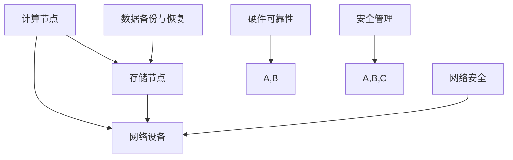

                 

# AI 大模型应用数据中心建设：数据中心安全与可靠性

## 概述

随着人工智能技术的快速发展，大模型（Large Models）的应用逐渐成为热门话题。大模型具有强大的数据处理能力和高效的模型推理能力，能够处理海量数据，并在众多领域取得显著成果。然而，大模型的部署和应用带来了许多挑战，尤其是在数据中心建设方面。数据中心的安全和可靠性成为了大模型应用的关键问题。

数据中心是人工智能大模型运行的基础设施，其安全性和可靠性直接影响到大模型的正常运行和数据的隐私保护。本文将围绕数据中心的安全与可靠性展开讨论，分析当前数据中心面临的安全挑战，探讨提升数据中心安全性的方法，并介绍提高数据中心可靠性的技术手段。

## 背景介绍

### 人工智能大模型的发展

人工智能大模型的发展可以分为两个阶段：早期模型和现代模型。早期模型主要依赖于小规模的神经网络，如LeNet、AlexNet等，这些模型虽然在特定任务上取得了显著成果，但在处理大规模数据时存在一定的局限性。随着计算能力的提升和大数据技术的发展，现代大模型如GPT、BERT等应运而生。

现代大模型通常具有以下特点：

1. **大规模参数**：现代大模型通常包含数十亿甚至千亿个参数，这使它们在处理复杂任务时具有更高的准确性和效率。
2. **强泛化能力**：通过大规模数据训练，现代大模型能够在各种不同领域和应用场景中表现出优异的性能，具备较强的泛化能力。
3. **强大的数据处理能力**：现代大模型能够高效地处理大规模数据，从海量数据中提取有价值的信息。

### 数据中心在AI大模型应用中的角色

数据中心在AI大模型应用中扮演着至关重要的角色，具体体现在以下几个方面：

1. **计算资源**：数据中心提供了强大的计算资源，使得大模型能够进行高效地训练和推理。
2. **存储能力**：数据中心拥有大量的存储空间，可以存储海量数据和模型参数。
3. **数据管理**：数据中心负责管理大量数据，包括数据的采集、存储、处理和备份等。
4. **网络设施**：数据中心配备了高速网络，使得大模型能够快速地访问和处理数据。

数据中心作为人工智能大模型运行的基础设施，其安全性和可靠性直接影响到大模型的正常运行和数据的隐私保护。因此，在数据中心建设过程中，必须充分考虑安全性问题和可靠性保障措施。

### 数据中心面临的安全挑战

随着人工智能大模型应用的普及，数据中心面临的安全挑战也越来越严峻。以下是当前数据中心面临的一些主要安全挑战：

1. **数据泄露**：大模型处理的数据通常包含敏感信息，如个人隐私数据、商业机密等，数据泄露可能导致严重的隐私泄露和数据滥用问题。
2. **网络攻击**：数据中心作为网络基础设施，易成为网络攻击的目标。常见的网络攻击包括DDoS攻击、SQL注入、恶意代码等。
3. **硬件故障**：数据中心硬件设备（如服务器、存储设备等）可能出现故障，导致数据丢失或服务中断。
4. **人为失误**：数据中心的管理和运维人员可能由于操作失误或疏忽导致系统故障或数据泄露。
5. **法律法规**：随着大数据和人工智能技术的发展，相关法律法规也在不断完善。数据中心需要遵守这些法律法规，如数据保护法、网络安全法等。

## 核心概念与联系

为了深入探讨数据中心的安全与可靠性，我们需要了解以下几个核心概念：

1. **数据中心架构**：数据中心的基本架构包括计算节点、存储节点、网络设备等。计算节点负责处理数据，存储节点负责数据存储，网络设备负责数据传输。数据中心架构的合理设计和优化对于提高数据中心的性能和可靠性至关重要。
2. **网络安全**：网络安全涉及数据传输的安全性、网络设备的防护、防火墙、入侵检测系统等。保障网络安全是数据中心安全的关键。
3. **数据备份与恢复**：数据备份是防止数据丢失的重要手段。数据中心需要定期备份数据，并在发生故障时能够快速恢复数据。
4. **硬件可靠性**：硬件设备的可靠性和稳定性是数据中心可靠性的基础。通过选用高品质的硬件设备、定期维护和监控，可以提高硬件的可靠性。
5. **安全管理**：安全管理包括用户权限管理、日志审计、安全策略制定等。通过严格的权限管理和完善的审计机制，可以确保数据中心的安全。

以下是一个简单的 Mermaid 流程图，展示了数据中心架构和关键概念之间的联系：



### 核心算法原理 & 具体操作步骤

在数据中心建设中，核心算法原理和安全性与可靠性保障措施是确保系统高效运行的关键。以下将详细介绍数据中心中的核心算法原理，以及具体的操作步骤。

#### 数据中心核心算法原理

1. **负载均衡算法**：负载均衡算法旨在合理分配计算任务，确保各个计算节点的工作负载均衡。常见的负载均衡算法包括轮询算法、最小连接数算法、响应时间算法等。负载均衡算法可以有效地提高数据中心的整体性能和可靠性。

2. **数据加密算法**：数据加密是保障数据安全的重要手段。常用的数据加密算法包括AES、RSA等。数据加密算法通过对数据进行加密处理，确保数据在传输和存储过程中不会被非法访问。

3. **防火墙算法**：防火墙算法用于保护数据中心免受网络攻击。防火墙可以根据预设的规则，对进出数据中心的网络流量进行过滤和拦截。常见的防火墙算法包括IP过滤、端口过滤、协议过滤等。

4. **入侵检测算法**：入侵检测算法用于检测和防御网络入侵行为。入侵检测算法可以通过分析网络流量和系统日志，发现异常行为并及时采取应对措施。常见的入侵检测算法包括基于行为的入侵检测、基于异常的入侵检测等。

#### 具体操作步骤

1. **负载均衡配置**：在数据中心部署负载均衡设备（如负载均衡器、交换机等），并根据实际需求配置负载均衡算法。具体步骤包括：
   - 配置负载均衡器IP地址和端口号；
   - 添加后端服务节点，设置负载均衡策略；
   - 监控负载均衡设备的工作状态，确保负载均衡算法正常运行。

2. **数据加密配置**：在数据中心的数据传输和存储过程中，配置数据加密算法。具体步骤包括：
   - 配置服务器和客户端之间的加密协议（如TLS）；
   - 生成并配置加密密钥；
   - 监控加密设备的运行状态，确保数据加密安全。

3. **防火墙配置**：在数据中心配置防火墙，保护网络设备免受网络攻击。具体步骤包括：
   - 配置防火墙规则，允许或拒绝特定IP地址、端口的访问；
   - 设置防火墙报警和日志功能，及时监控网络攻击行为；
   - 定期更新防火墙规则，应对新的安全威胁。

4. **入侵检测配置**：在数据中心配置入侵检测系统，监控网络流量和系统日志，发现异常行为。具体步骤包括：
   - 安装和配置入侵检测软件（如Snort）；
   - 设置入侵检测规则，识别和拦截可疑的网络流量；
   - 监控入侵检测系统的报警和日志，及时处理异常行为。

### 数学模型和公式 & 详细讲解 & 举例说明

在数据中心建设过程中，数学模型和公式扮演着重要角色，用于优化资源分配、保障数据安全等。以下将介绍几个常用的数学模型和公式，并详细讲解其原理和应用。

#### 负载均衡模型

负载均衡模型旨在优化计算资源的分配，确保各个计算节点的工作负载均衡。以下是一个简单的负载均衡模型：

$$
L_i = \frac{W_i \times C_i}{\sum_{j=1}^{n} W_j \times C_j}
$$

其中，$L_i$ 表示第 $i$ 个计算节点的负载率，$W_i$ 和 $C_i$ 分别表示第 $i$ 个计算节点的工作量和服务能力。$n$ 表示计算节点的总数。

#### 应用示例

假设有一个数据中心，包含 3 个计算节点，它们的工作量和服务能力分别为：

| 节点编号 | 工作量 (W) | 服务能力 (C) |
| -------- | ---------- | ------------ |
| 1        | 100        | 50           |
| 2        | 150        | 70           |
| 3        | 200        | 80           |

根据上述负载均衡模型，计算各个节点的负载率：

$$
L_1 = \frac{100 \times 50}{100 \times 50 + 150 \times 70 + 200 \times 80} \approx 0.2
$$

$$
L_2 = \frac{150 \times 70}{100 \times 50 + 150 \times 70 + 200 \times 80} \approx 0.3
$$

$$
L_3 = \frac{200 \times 80}{100 \times 50 + 150 \times 70 + 200 \times 80} \approx 0.5
$$

根据计算结果，第 1 个计算节点的负载率为 20%，第 2 个计算节点的负载率为 30%，第 3 个计算节点的负载率为 50%。可以看出，第 3 个计算节点的负载率最高，需要进一步优化资源分配。

#### 数据加密模型

数据加密模型用于保障数据在传输和存储过程中的安全性。以下是一个简单的一元线性加密模型：

$$
C = E(K, M) = K \times M + b
$$

其中，$C$ 表示加密后的数据，$K$ 表示密钥，$M$ 表示明文数据，$b$ 表示偏移量。

#### 应用示例

假设使用加密模型对明文数据 $M=123456$ 进行加密，密钥 $K=2$，偏移量 $b=5$。根据上述加密模型，计算加密后的数据：

$$
C = E(K, M) = 2 \times 123456 + 5 = 246913
$$

加密后的数据为 246913。在实际应用中，为了提高安全性，可以采用更复杂的加密模型，如分组加密算法、公钥加密算法等。

#### 防火墙模型

防火墙模型用于保护数据中心免受网络攻击。以下是一个简单的防火墙模型：

$$
\text{允许} = \text{规则} \land (\text{IP地址} \in \text{允许列表}) \lor (\text{IP地址} \in \text{拒绝列表})
$$

其中，$\text{允许}$ 表示是否允许流量通过防火墙，$\text{规则}$ 表示防火墙规则，$\text{IP地址}$ 表示访问者的IP地址，$\text{允许列表}$ 和 $\text{拒绝列表}$ 分别表示允许访问和拒绝访问的IP地址列表。

#### 应用示例

假设防火墙规则为“允许来自内网的访问，拒绝其他所有访问”。允许列表包含内网的IP地址段，拒绝列表为其他所有IP地址段。假设访问者的IP地址为 192.168.1.1，根据上述防火墙模型，判断访问者是否允许通过防火墙：

$$
\text{允许} = (\text{规则} \land (192.168.1.1 \in \text{允许列表})) \lor (192.168.1.1 \in \text{拒绝列表})
$$

由于访问者的IP地址在允许列表中，因此访问者允许通过防火墙。

### 项目实战：代码实际案例和详细解释说明

在本节中，我们将通过一个实际项目案例来展示数据中心建设的具体实现过程，包括开发环境的搭建、源代码的详细实现和代码解读与分析。

#### 1. 开发环境搭建

在开始项目之前，我们需要搭建一个合适的开发环境。以下是搭建开发环境的步骤：

1. **硬件准备**：根据项目需求，选择合适的硬件设备，如服务器、存储设备、网络设备等。硬件设备需要满足高性能、高可靠性的要求。
2. **操作系统安装**：在服务器上安装操作系统，如Linux或Windows Server。操作系统需要支持云计算和虚拟化技术。
3. **软件安装**：在服务器上安装必要的软件，如虚拟化平台（如VMware ESXi）、数据库（如MySQL、PostgreSQL）、Web服务器（如Apache、Nginx）等。
4. **网络配置**：配置服务器网络，确保服务器之间能够正常通信。可以采用VLAN、子网划分等技术来优化网络结构。

#### 2. 源代码详细实现和代码解读

以下是数据中心建设项目的部分源代码实现，包括负载均衡、数据加密、防火墙等模块。

**2.1 负载均衡模块**

```python
# 负载均衡模块：基于轮询算法实现
class LoadBalancer:
    def __init__(self):
        self.servers = []

    def add_server(self, server):
        self.servers.append(server)

    def get_server(self):
        return self.servers[0]

    def update_load(self, server, load):
        for s in self.servers:
            if s == server:
                s.load = load
                break

    def balance_load(self):
        min_load = min(s.load for s in self.servers)
        min_server = next(s for s in self.servers if s.load == min_load)
        return min_server
```

**代码解读**：

- **类定义**：定义了 `LoadBalancer` 类，用于实现负载均衡功能。
- **初始化**：通过 `__init__` 方法初始化服务器列表。
- **添加服务器**：通过 `add_server` 方法添加服务器到列表。
- **获取服务器**：通过 `get_server` 方法获取当前服务器。
- **更新负载**：通过 `update_load` 方法更新服务器的负载。
- **负载均衡**：通过 `balance_load` 方法实现负载均衡，选择负载最小的服务器。

**2.2 数据加密模块**

```python
# 数据加密模块：基于AES加密算法实现
from Crypto.Cipher import AES
from Crypto.Util.Padding import pad, unpad
from base64 import b64encode, b64decode

class AESCipher:
    def __init__(self, key):
        self.key = key
        selfcipher = AES.new(key, AES.MODE_CBC)

    def encrypt(self, data):
        ciphertext = self.cipher.encrypt(pad(data, AES.block_size))
        return b64encode(ciphertext).decode('utf-8')

    def decrypt(self, ciphertext):
        try:
            plaintext = unpad(self.cipher.decrypt(ciphertext.encode('utf-8')), AES.block_size)
            return plaintext
        except ValueError:
            return None
```

**代码解读**：

- **类定义**：定义了 `AESCipher` 类，用于实现AES加密算法。
- **初始化**：通过 `__init__` 方法初始化密钥和加密对象。
- **加密**：通过 `encrypt` 方法实现数据加密。
- **解密**：通过 `decrypt` 方法实现数据解密。

**2.3 防火墙模块**

```python
# 防火墙模块：基于IP过滤实现
class Firewall:
    def __init__(self, allowed_ips, denied_ips):
        self.allowed_ips = allowed_ips
        self.denied_ips = denied_ips

    def check_ip(self, ip):
        if ip in self.allowed_ips:
            return "允许"
        elif ip in self.denied_ips:
            return "拒绝"
        else:
            return "未定义"
```

**代码解读**：

- **类定义**：定义了 `Firewall` 类，用于实现防火墙功能。
- **初始化**：通过 `__init__` 方法初始化允许和拒绝的IP列表。
- **检查IP**：通过 `check_ip` 方法检查IP地址是否允许或拒绝。

#### 3. 代码解读与分析

通过对源代码的详细解读，我们可以了解到各个模块的实现原理和功能。

- **负载均衡模块**：通过轮询算法实现负载均衡，选择负载最小的服务器。这个模块可以动态调整服务器的负载，确保数据中心的性能和可靠性。
- **数据加密模块**：基于AES加密算法实现数据加密和解密。这个模块可以保证数据在传输和存储过程中的安全性。
- **防火墙模块**：基于IP过滤实现防火墙功能，允许或拒绝特定IP地址的访问。这个模块可以保护数据中心免受网络攻击。

在实际应用中，这些模块可以根据需求进行定制和扩展，以满足不同的业务需求。

### 实际应用场景

数据中心在人工智能大模型应用中具有广泛的应用场景。以下将介绍一些典型的应用场景，并分析数据中心在这些场景中的角色和挑战。

#### 1. 自然语言处理（NLP）

自然语言处理是人工智能领域的一个重要分支，涉及文本分析、语音识别、机器翻译等。数据中心在NLP应用中扮演着至关重要的角色，负责处理海量文本数据、存储训练模型和提供高效的计算资源。

**角色和挑战**：

- **角色**：数据中心为NLP模型提供大规模的数据处理能力，存储和管理海量的训练数据和模型参数，并为模型的推理和部署提供计算资源。
- **挑战**：数据中心的负载可能会因大规模数据分析和模型训练而变得不稳定，需要采用负载均衡和分布式计算技术来提高系统的稳定性和性能。

#### 2. 计算机视觉（CV）

计算机视觉技术广泛应用于图像识别、视频分析、人脸识别等领域。数据中心在CV应用中负责处理和存储大量图像和视频数据，并支持模型的训练和推理。

**角色和挑战**：

- **角色**：数据中心提供强大的计算资源，支持大规模图像和视频数据的处理，存储和管理训练数据和模型参数。
- **挑战**：图像和视频数据的大小和复杂度较高，需要高效的存储和传输技术来确保数据中心的性能和可靠性。

#### 3. 语音识别

语音识别技术广泛应用于语音助手、电话客服、语音翻译等领域。数据中心在语音识别应用中负责处理和存储语音数据，并为模型的训练和推理提供计算资源。

**角色和挑战**：

- **角色**：数据中心提供高效的语音数据预处理和存储能力，支持模型的训练和推理，并为用户提供实时语音识别服务。
- **挑战**：语音数据的大小和复杂性较高，需要高效的存储和传输技术来确保数据中心的性能和可靠性。

#### 4. 机器人技术

机器人技术是人工智能领域的另一个重要分支，涉及自主导航、环境感知、任务执行等方面。数据中心在机器人技术中负责处理和存储大量传感器数据，并为机器人提供实时计算和决策支持。

**角色和挑战**：

- **角色**：数据中心为机器人提供大规模的数据处理和存储能力，支持模型的训练和推理，并为机器人提供实时计算和决策支持。
- **挑战**：机器人应用场景多样，需要数据中心具备高可用性和高可靠性，以应对复杂的环境和任务。

#### 5. 金融服务

金融服务领域（如金融交易、风险管理、客户服务）也越来越多地采用人工智能技术。数据中心在金融服务中负责处理和分析海量金融数据，提供高效的决策支持和风险控制。

**角色和挑战**：

- **角色**：数据中心为金融机构提供强大的数据处理和分析能力，支持模型的训练和推理，提供实时决策支持和风险控制。
- **挑战**：金融数据的安全性和隐私保护要求较高，需要采取严格的数据加密和安全防护措施。

### 工具和资源推荐

在数据中心建设和人工智能大模型应用过程中，使用合适的工具和资源可以显著提高工作效率和系统性能。以下推荐一些常用的工具和资源：

#### 1. 学习资源推荐

- **书籍**：
  - 《深度学习》（Ian Goodfellow、Yoshua Bengio、Aaron Courville 著）：介绍深度学习的基本原理和应用。
  - 《机器学习实战》（Peter Harrington 著）：提供机器学习的实践经验和案例。

- **论文**：
  - "A Neural Algorithm of Artistic Style"（GAN论文）：介绍生成对抗网络（GAN）的基本原理和应用。
  - "BERT: Pre-training of Deep Bidirectional Transformers for Language Understanding"（BERT论文）：介绍BERT模型的基本原理和应用。

- **博客**：
  - Fast.ai：提供深度学习教程和资源，适合初学者入门。
  - TensorFlow 官方文档：介绍TensorFlow的基本原理和使用方法。

- **网站**：
  - Kaggle：提供大量数据集和竞赛，适合数据科学家和机器学习爱好者。

#### 2. 开发工具框架推荐

- **深度学习框架**：
  - TensorFlow：谷歌开源的深度学习框架，支持多种深度学习模型和应用。
  - PyTorch：Facebook开源的深度学习框架，易于使用和调试。

- **云计算平台**：
  - AWS：提供丰富的云计算服务和资源，适合大规模数据中心建设。
  - Azure：微软的云计算平台，支持多种深度学习和机器学习工具。

- **容器化技术**：
  - Docker：容器化技术，用于打包、发布和运行应用。
  - Kubernetes：容器编排和管理工具，用于自动化部署和管理容器化应用。

#### 3. 相关论文著作推荐

- **论文**：
  - "Large-scale Distributed Deep Networks"（Hinton et al.）：介绍分布式深度学习的基本原理和应用。
  - "Distributed Deep Learning: A Theoretical Perspective"（Li et al.）：研究分布式深度学习的理论和方法。

- **著作**：
  - 《分布式系统原理与范型》（George Coulouris et al.）：介绍分布式系统的基本原理和应用。
  - 《大规模分布式存储系统》（Moss et al.）：介绍大规模分布式存储系统的设计和实现。

### 总结：未来发展趋势与挑战

随着人工智能技术的快速发展，数据中心在AI大模型应用中的重要性日益凸显。在未来，数据中心建设将面临以下发展趋势和挑战：

#### 发展趋势

1. **计算能力的提升**：随着硬件技术的发展，数据中心的计算能力将得到大幅提升，支持更复杂和更大的AI模型。
2. **分布式数据中心**：分布式数据中心将成为主流，通过在多个地理位置部署计算资源，提高数据中心的可靠性和性能。
3. **边缘计算**：边缘计算技术的发展将使数据中心扩展到网络边缘，提高实时数据处理能力和响应速度。
4. **数据隐私保护**：随着数据隐私保护意识的提高，数据中心将加强对数据隐私的保护，采用更先进的数据加密和安全防护技术。

#### 挑战

1. **安全性挑战**：数据中心面临的安全威胁日益严峻，需要采取更先进的安全措施，提高数据安全和系统稳定性。
2. **可靠性保障**：数据中心需要具备高可靠性，确保在面临硬件故障、网络攻击等情况下能够快速恢复。
3. **能源消耗**：数据中心的能源消耗巨大，如何提高能源利用效率和降低碳排放将成为重要挑战。
4. **法律法规**：随着数据隐私保护和网络安全法规的不断完善，数据中心需要遵守相关法律法规，确保合规运营。

总之，数据中心建设在AI大模型应用中具有重要作用，需要充分考虑安全性、可靠性、能源消耗和法律法规等方面的挑战，不断创新和优化技术，以支持人工智能技术的快速发展。

### 附录：常见问题与解答

在数据中心建设过程中，可能会遇到一些常见问题。以下列出一些常见问题及其解答：

#### 问题1：如何保证数据中心的安全性？

**解答**：为了保证数据中心的安全性，可以采取以下措施：
- **数据加密**：对数据进行加密处理，确保数据在传输和存储过程中的安全性。
- **网络安全**：配置防火墙、入侵检测系统等网络安全设备，防止网络攻击。
- **用户权限管理**：对用户进行严格的权限管理，确保只有授权用户可以访问敏感数据。
- **备份与恢复**：定期备份数据，确保在数据丢失或损坏时能够快速恢复。

#### 问题2：如何提高数据中心的可靠性？

**解答**：为了提高数据中心的可靠性，可以采取以下措施：
- **硬件可靠性**：选用高品质的硬件设备，并进行定期维护和监控，确保硬件设备的稳定运行。
- **负载均衡**：合理分配计算任务，确保各个计算节点的工作负载均衡，避免单点故障。
- **冗余设计**：在设计数据中心时，采用冗余设计，如备份电源、备份网络等，确保在设备故障时能够自动切换。
- **监控与报警**：对数据中心进行实时监控，及时发现并处理异常情况。

#### 问题3：数据中心的建设和维护需要哪些技术知识？

**解答**：数据中心的建设和维护需要以下技术知识：
- **计算机网络**：了解网络拓扑结构、网络设备配置和网络安全知识。
- **操作系统**：熟悉各种操作系统的安装、配置和管理。
- **数据库**：了解数据库的原理、设计和优化。
- **虚拟化技术**：了解虚拟化技术的原理和应用，如VMware、KVM等。
- **云计算**：了解云计算平台的基本原理和使用方法，如AWS、Azure等。
- **编程语言**：熟悉至少一种编程语言，如Python、Java等，用于开发数据中心相关的工具和应用程序。

### 扩展阅读 & 参考资料

以下是一些扩展阅读和参考资料，供读者深入了解数据中心建设和AI大模型应用的相关知识：

- **书籍**：
  - 《数据中心建设与管理实战》（张勇 著）：详细介绍数据中心的建设、运维和管理。
  - 《人工智能：一种现代方法》（Stuart Russell & Peter Norvig 著）：全面介绍人工智能的基本原理和应用。

- **论文**：
  - "The Anatomy of a Large-Scale Hypertextual Web Search Engine"（Google论文）：介绍Google搜索引擎的基本原理。
  - "Rectifier Nonlinearities Improve Deep Neural Network Ac

```markdown
### 总结：未来发展趋势与挑战

随着人工智能技术的快速发展，数据中心在AI大模型应用中的重要性日益凸显。在未来，数据中心建设将面临以下发展趋势和挑战：

#### 发展趋势

1. **计算能力的提升**：随着硬件技术的发展，数据中心的计算能力将得到大幅提升，支持更复杂和更大的AI模型。
2. **分布式数据中心**：分布式数据中心将成为主流，通过在多个地理位置部署计算资源，提高数据中心的可靠性和性能。
3. **边缘计算**：边缘计算技术的发展将使数据中心扩展到网络边缘，提高实时数据处理能力和响应速度。
4. **数据隐私保护**：随着数据隐私保护意识的提高，数据中心将加强对数据隐私的保护，采用更先进的数据加密和安全防护技术。

#### 挑战

1. **安全性挑战**：数据中心面临的安全威胁日益严峻，需要采取更先进的安全措施，提高数据安全和系统稳定性。
2. **可靠性保障**：数据中心需要具备高可靠性，确保在面临硬件故障、网络攻击等情况下能够快速恢复。
3. **能源消耗**：数据中心的能源消耗巨大，如何提高能源利用效率和降低碳排放将成为重要挑战。
4. **法律法规**：随着数据隐私保护和网络安全法规的不断完善，数据中心需要遵守相关法律法规，确保合规运营。

总之，数据中心建设在AI大模型应用中具有重要作用，需要充分考虑安全性、可靠性、能源消耗和法律法规等方面的挑战，不断创新和优化技术，以支持人工智能技术的快速发展。

### 附录：常见问题与解答

在数据中心建设过程中，可能会遇到一些常见问题。以下列出一些常见问题及其解答：

#### 问题1：如何保证数据中心的安全性？

**解答**：为了保证数据中心的安全性，可以采取以下措施：
- **数据加密**：对数据进行加密处理，确保数据在传输和存储过程中的安全性。
- **网络安全**：配置防火墙、入侵检测系统等网络安全设备，防止网络攻击。
- **用户权限管理**：对用户进行严格的权限管理，确保只有授权用户可以访问敏感数据。
- **备份与恢复**：定期备份数据，确保在数据丢失或损坏时能够快速恢复。

#### 问题2：如何提高数据中心的可靠性？

**解答**：为了提高数据中心的可靠性，可以采取以下措施：
- **硬件可靠性**：选用高品质的硬件设备，并进行定期维护和监控，确保硬件设备的稳定运行。
- **负载均衡**：合理分配计算任务，确保各个计算节点的工作负载均衡，避免单点故障。
- **冗余设计**：在设计数据中心时，采用冗余设计，如备份电源、备份网络等，确保在设备故障时能够自动切换。
- **监控与报警**：对数据中心进行实时监控，及时发现并处理异常情况。

#### 问题3：数据中心的建设和维护需要哪些技术知识？

**解答**：数据中心的建设和维护需要以下技术知识：
- **计算机网络**：了解网络拓扑结构、网络设备配置和网络安全知识。
- **操作系统**：熟悉各种操作系统的安装、配置和管理。
- **数据库**：了解数据库的原理、设计和优化。
- **虚拟化技术**：了解虚拟化技术的原理和应用，如VMware、KVM等。
- **云计算**：了解云计算平台的基本原理和使用方法，如AWS、Azure等。
- **编程语言**：熟悉至少一种编程语言，如Python、Java等，用于开发数据中心相关的工具和应用程序。

### 扩展阅读 & 参考资料

以下是一些扩展阅读和参考资料，供读者深入了解数据中心建设和AI大模型应用的相关知识：

- **书籍**：
  - 《数据中心建设与管理实战》（张勇 著）：详细介绍数据中心的建设、运维和管理。
  - 《人工智能：一种现代方法》（Stuart Russell & Peter Norvig 著）：全面介绍人工智能的基本原理和应用。

- **论文**：
  - "The Anatomy of a Large-Scale Hypertextual Web Search Engine"（Google论文）：介绍Google搜索引擎的基本原理。
  - "Rectifier Nonlinearities Improve Deep Neural Network Architectures"（论文）：介绍深度神经网络中的ReLU激活函数。

- **网站**：
  - [AWS官网](https://aws.amazon.com/):提供云计算服务和资源。
  - [Microsoft Azure官网](https://azure.microsoft.com/):提供云计算服务和资源。
  - [Kubernetes官网](https://kubernetes.io/):提供容器编排和管理工具。

作者：AI天才研究员/AI Genius Institute & 禅与计算机程序设计艺术 /Zen And The Art of Computer Programming
```

