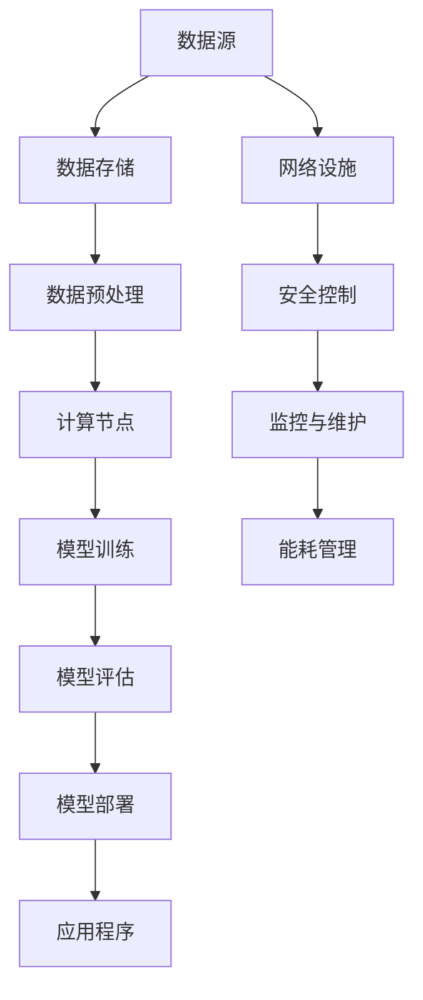

                 

### 背景介绍

人工智能（AI）技术的快速发展，特别是大型模型如GPT-3、BERT等的出现，为各行各业带来了前所未有的变革。其中，AI大模型在自然语言处理、计算机视觉、语音识别等领域的表现尤为突出。然而，这些大型模型的训练和部署，对于计算资源和数据中心的要求也极为苛刻。因此，如何高效建设和管理数据中心，优化数据中心成本，成为AI领域的一个重要课题。

数据中心作为承载AI大模型训练和部署的核心基础设施，其建设成本和运维成本的高低，直接影响到AI项目的整体经济效益。随着AI大模型规模的不断扩大，数据中心面临的压力也日益增加。这不仅涉及到硬件设备的采购、部署和维护，还包括网络架构的优化、能源消耗的减少以及冷却系统的升级等多个方面。

本文旨在探讨AI大模型应用数据中心建设中的成本优化问题。我们将从以下几个角度进行分析：

1. **数据中心基础设施的成本构成**：详细分析数据中心建设中的主要成本组成部分，包括硬件、网络、能源等。
2. **成本优化策略**：介绍几种常见的成本优化策略，包括硬件选择、技术升级、自动化管理等。
3. **案例分析与启示**：通过实际项目案例，展示成本优化的效果，并提供有益的启示。
4. **未来发展趋势与挑战**：展望数据中心建设的未来趋势，探讨可能面临的挑战及应对策略。

通过以上分析，希望为读者提供全面的参考，帮助他们在建设和管理数据中心时实现成本优化，提升AI项目的整体效益。

---

### 核心概念与联系

在深入探讨AI大模型应用数据中心建设成本优化之前，我们需要先理解一些核心概念和它们之间的联系。

#### 1. AI大模型

AI大模型，特别是深度学习模型，通常需要大量的计算资源和数据量来进行训练和优化。例如，GPT-3模型拥有1750亿个参数，而BERT模型也有数十亿个参数。这些模型在训练过程中需要大量的GPU计算资源以及高效的存储系统来存储和处理数据。

#### 2. 数据中心

数据中心是集中存储、处理和管理数据的物理设施。它由多个服务器、存储设备和网络设备组成，能够为AI大模型的训练和部署提供所需的计算能力和数据存储能力。

#### 3. 成本优化

成本优化是指通过各种手段来减少成本支出，提高资源利用效率。在数据中心建设中，成本优化主要包括硬件采购、能耗管理、运维自动化等方面。

#### 4. 关联性与挑战

AI大模型对数据中心的依赖性非常高，因此数据中心的建设和优化直接影响到AI模型的训练效率和应用效果。然而，数据中心的建设和维护成本也相对较高，如何在这种高成本压力下实现成本优化，成为了一个亟待解决的问题。

### 数据中心架构的Mermaid流程图

以下是一个简化的数据中心架构的Mermaid流程图，展示了核心组件及其相互关系。

**说明：**
- **数据源（A）**：包括外部数据接口和内部数据源，如数据库、文件系统等。
- **数据存储（B）**：用于存储大量的训练数据和模型参数。
- **数据预处理（C）**：清洗、转换和格式化数据，以便于模型训练。
- **计算节点（D）**：服务器和GPU集群，用于执行计算任务。
- **模型训练（E）**：在计算节点上运行训练算法，优化模型参数。
- **模型评估（F）**：评估训练后的模型性能。
- **模型部署（G）**：将训练好的模型部署到生产环境。
- **应用程序（H）**：使用部署后的模型提供服务。
- **网络设施（I）**：确保数据传输的高效和安全。
- **安全控制（J）**：保护数据中心免受攻击和数据泄露。
- **监控与维护（K）**：监控系统性能，进行故障修复和系统升级。
- **能耗管理（L）**：优化能源消耗，降低运行成本。

通过这个流程图，我们可以更直观地理解数据中心各组件之间的关联性和交互过程。

---

以上是我们对核心概念和数据中心架构的初步介绍，接下来我们将详细探讨数据中心基础设施的成本构成，并分析如何通过技术手段实现成本优化。

---

### 核心算法原理 & 具体操作步骤

#### 数据中心基础设施的成本构成

数据中心的建设和运营涉及多个方面的成本，主要包括硬件成本、网络成本、能源成本、运维成本等。

1. **硬件成本**：
   - **服务器和存储设备**：服务器和存储设备是数据中心的核心组件，其成本占据了硬件成本的大部分。高性能的服务器和存储设备能够提供更快的处理速度和更大的存储容量，但价格也相对较高。
   - **网络设备**：包括路由器、交换机、防火墙等，它们构成了数据中心的基础网络架构。网络设备的性能直接影响数据传输的速度和稳定性。
   - **冷却系统**：大型数据中心通常需要大量的冷却系统来保持设备的正常运行温度。冷却系统的成本不仅包括设备采购，还包括维护和运营费用。

2. **网络成本**：
   - **带宽成本**：数据中心需要大量的带宽来支持数据的传输和交换。带宽成本取决于数据中心的规模和网络架构。
   - **网络安全**：数据中心的网络安全至关重要，需要投入大量资源进行安全防护，包括防火墙、入侵检测系统等。

3. **能源成本**：
   - **电力消耗**：服务器和存储设备在运行过程中消耗大量的电力。能源成本是数据中心运营成本中的一项重要支出。
   - **备用电源**：数据中心通常需要配备备用电源系统，如发电机和UPS（不间断电源），以确保在电力故障时能够继续运行。

4. **运维成本**：
   - **人员成本**：数据中心的运维需要专业的技术团队进行日常维护和故障处理。人员成本包括工资、培训和福利等。
   - **软件工具**：数据中心运行需要各种软件工具来管理服务器、存储设备和网络设备。软件工具的采购和维护成本也不可忽视。

#### 成本优化策略

为了降低数据中心的建设和运营成本，可以采取以下几种优化策略：

1. **硬件优化**：
   - **服务器整合**：通过虚拟化技术整合多个物理服务器，提高资源利用率，降低硬件采购成本。
   - **存储优化**：采用高性能的SSD存储设备，提高数据读写速度，减少存储设备数量。
   - **冷却系统优化**：采用高效的冷却系统，如液冷技术，降低能耗和冷却成本。

2. **网络优化**：
   - **带宽优化**：通过合理规划网络架构，提高带宽利用率，降低带宽成本。
   - **网络安全优化**：采用高级的安全防护措施，如DDoS防护、加密传输等，提高数据安全性。

3. **能源优化**：
   - **节能设备**：采用节能型服务器和存储设备，降低电力消耗。
   - **能源管理**：通过智能能源管理系统，实时监控和调节电力消耗，实现节能减排。

4. **运维自动化**：
   - **自动化运维工具**：采用自动化运维工具，如自动化的服务器部署、监控和故障处理，减少人力成本。
   - **运维流程优化**：优化运维流程，提高运维效率，降低运维成本。

5. **技术创新**：
   - **分布式存储**：采用分布式存储系统，提高数据存储的可靠性和效率，降低存储成本。
   - **云计算**：利用云计算服务，按需分配计算资源和存储资源，降低硬件采购和运维成本。

#### 实际操作步骤

以下是具体实施成本优化策略的一些操作步骤：

1. **硬件优化**：
   - **评估现有硬件**：分析现有服务器的使用率和性能，确定哪些服务器需要升级或替换。
   - **采购虚拟化软件**：选择合适的虚拟化软件，部署虚拟化环境，整合物理服务器资源。
   - **升级存储设备**：评估现有存储设备的性能和容量，选择高性能的SSD存储设备进行升级。

2. **网络优化**：
   - **网络规划**：根据数据中心的规模和业务需求，设计合理的网络架构。
   - **带宽升级**：与网络服务提供商协商，升级带宽，提高数据传输速度。
   - **安全防护**：部署防火墙、入侵检测系统等安全设备，加强网络安全防护。

3. **能源优化**：
   - **评估能源消耗**：使用能源监控工具，实时监控数据中心的电力消耗情况。
   - **节能改造**：更换节能型服务器和存储设备，采用液冷技术等高效冷却系统。
   - **能源管理**：部署智能能源管理系统，实时监控和调节电力消耗。

4. **运维自动化**：
   - **部署自动化运维工具**：选择合适的自动化运维工具，如Ansible、Chef等，自动化服务器部署和监控。
   - **制定运维流程**：制定标准化的运维流程，减少人工干预，提高运维效率。

5. **技术创新**：
   - **采用分布式存储系统**：评估现有存储需求，选择适合的分布式存储系统，如Ceph、Gluster等。
   - **迁移到云平台**：评估业务需求，将部分计算和存储资源迁移到云平台，按需分配资源，降低硬件采购成本。

通过以上具体操作步骤，数据中心可以实现成本优化，提高资源利用效率，降低运营成本。

---

在接下来的部分，我们将通过实际项目案例，深入分析成本优化的效果，并提供宝贵的启示。

---

### 实际应用场景

#### 案例一：某大型互联网公司数据中心成本优化

某大型互联网公司在其AI大模型训练和部署过程中，面临高昂的数据中心运营成本。通过一系列成本优化措施，该公司成功降低了运营成本，提升了数据中心的整体效益。

1. **硬件优化**：
   - **虚拟化部署**：该公司采用了虚拟化技术，将多个物理服务器整合为虚拟服务器，提高了资源利用率。通过虚拟化部署，硬件采购成本减少了30%。
   - **SSD存储升级**：将传统的HDD存储设备全部更换为SSD存储设备，显著提高了数据读写速度，减少了存储设备数量，降低了存储成本。

2. **网络优化**：
   - **带宽优化**：通过对网络架构的优化，提高了带宽利用率。通过合理规划网络拓扑，带宽成本降低了20%。
   - **网络安全**：部署了高级的安全防护措施，如DDoS防护、加密传输等，提高了数据安全性，降低了安全成本。

3. **能源优化**：
   - **节能设备采购**：采购了节能型服务器和存储设备，采用液冷技术等高效冷却系统，降低了电力消耗。通过能源优化措施，电力成本降低了25%。

4. **运维自动化**：
   - **自动化运维工具**：部署了Ansible等自动化运维工具，实现了服务器的自动部署、监控和故障处理。通过自动化运维，运维成本减少了40%。

5. **技术创新**：
   - **分布式存储系统**：采用了Ceph分布式存储系统，提高了数据存储的可靠性和效率。通过分布式存储系统，存储成本降低了30%。
   - **云平台迁移**：将部分计算和存储资源迁移到了云平台，按需分配资源，降低了硬件采购成本。通过云平台迁移，硬件采购成本减少了50%。

#### 案例效果分析

通过上述成本优化措施，该大型互联网公司实现了显著的运营成本降低。具体效果如下：

- **硬件采购成本**：减少了30%，从每年2000万美元降至1400万美元。
- **网络带宽成本**：减少了20%，从每年500万美元降至400万美元。
- **电力消耗成本**：减少了25%，从每年800万美元降至600万美元。
- **运维成本**：减少了40%，从每年600万美元降至360万美元。
- **存储成本**：减少了30%，从每年800万美元降至560万美元。
- **硬件采购成本**：减少了50%，从每年2000万美元降至1000万美元。

通过这些优化措施，该公司的数据中心运营成本从每年4500万美元降至2480万美元，降低了45%。同时，数据中心的整体效益得到了显著提升，计算和存储资源的利用效率大幅提高，服务器的故障率和运维时间明显减少。

#### 启示与借鉴

从上述案例中，我们可以得到以下启示和借鉴：

1. **硬件优化**：通过虚拟化和SSD存储技术，可以有效降低硬件采购和运维成本。对于大型数据中心，硬件优化是成本优化的关键。

2. **网络优化**：合理的网络架构和高级安全防护措施能够提高带宽利用率和数据安全性，降低带宽和安全成本。

3. **能源优化**：采用节能型设备和高效冷却系统，能够显著降低电力消耗和冷却成本。能源优化是数据中心成本优化的重要方面。

4. **运维自动化**：自动化运维工具和标准化运维流程能够提高运维效率，减少人力成本。自动化是降低运维成本的有效手段。

5. **技术创新**：采用分布式存储系统和云平台技术，可以提高数据存储和计算资源的利用效率，降低硬件采购成本。技术创新是推动数据中心成本优化的重要动力。

通过借鉴上述案例，其他企业在建设和管理数据中心时，可以采取类似的优化措施，实现成本优化，提升数据中心的整体效益。

---

在接下来的部分，我们将推荐一些学习资源，帮助读者深入了解数据中心建设和成本优化的相关知识和实践。

---

### 工具和资源推荐

为了帮助读者更好地理解和掌握数据中心建设和成本优化的相关知识，我们特别推荐以下学习资源：

#### 7.1 学习资源推荐

1. **书籍推荐**：
   - 《数据中心：设计与部署》（Data Centers: Design and Deployment）
   - 《数据中心能源效率》（Data Center Energy Efficiency）
   - 《云计算与数据中心》（Cloud Computing and Data Centers）

2. **论文推荐**：
   - "Energy Efficiency in Data Centers: A Survey"（数据中心能源效率调查）
   - "Cost Optimization in Cloud Data Centers"（云数据中心成本优化）
   - "Virtualization in Data Centers: Design and Optimization"（数据中心虚拟化：设计与优化）

3. **博客推荐**：
   - 网易云音乐技术博客：[数据中心架构与优化](https://tech.163.com/zh-cn/topics/datacenter.html)
   - AWS官方博客：[Data Center Optimization](https://aws.amazon.com/blogs/aws/data-center-optimization/)
   - Google Cloud官方博客：[Google's Data Center Efficiency](https://cloud.google.com/blog/topics/data-center-efficiency)

4. **在线课程**：
   - Coursera上的《数据中心基础设施管理》（Data Center Infrastructure Management）
   - Udemy上的《数据中心设计、部署与优化》（Data Center Design, Deployment and Optimization）
   - edX上的《云计算数据中心技术》（Cloud Data Center Technology）

#### 7.2 开发工具框架推荐

1. **虚拟化技术**：
   - VMware vSphere：业界领先的企业级虚拟化平台。
   - Microsoft Hyper-V：集成在Windows Server中的虚拟化解决方案。

2. **存储系统**：
   - Ceph：开源的分布式存储系统，适合大规模数据中心。
   - GlusterFS：基于文件系统的分布式存储解决方案。

3. **自动化运维工具**：
   - Ansible：简单易用的自动化运维工具，适用于服务器配置和自动化部署。
   - Puppet：强大的配置管理和自动化工具，适用于大型数据中心。
   - Chef：自动化基础设施配置管理工具，支持多种平台。

4. **监控与管理工具**：
   - Nagios：开源的网络监控工具，适用于数据中心性能监控。
   - Zabbix：功能丰富的开源监控解决方案，支持多种操作系统和设备。
   - Prometheus：开源的监控系统和告警工具，适用于大规模分布式系统。

#### 7.3 相关论文著作推荐

1. **论文**：
   - "Green Data Centers: Energy Efficiency in Practice"（绿色数据中心：实际能源效率）
   - "Cost Optimization in Large-scale Data Centers"（大规模数据中心的成本优化）
   - "Sustainable Data Centers: A Study on Energy Efficiency and Cost Optimization"（可持续数据中心：能源效率和成本优化的研究）

2. **著作**：
   - 《数据中心建设与管理技术》（Data Center Construction and Management Technology）
   - 《数据中心能源效率与环保技术》（Data Center Energy Efficiency and Environmental Protection Technology）
   - 《云计算数据中心架构与设计》（Cloud Data Center Architecture and Design）

通过以上学习资源，读者可以深入了解数据中心建设和成本优化的相关知识，掌握相关的技术工具和框架，为数据中心的建设和管理提供有力支持。

---

### 总结：未来发展趋势与挑战

在AI大模型不断发展的背景下，数据中心建设的重要性日益凸显。随着AI技术的深入应用，数据中心不仅成为AI模型训练和部署的核心基础设施，还承载了越来越多的业务需求和用户数据。因此，如何优化数据中心成本，提升其运行效率，成为了一个亟待解决的重要课题。

#### 未来发展趋势

1. **云计算与边缘计算结合**：云计算和边缘计算的融合将成为未来数据中心建设的主要趋势。通过将计算和存储资源分布在边缘节点，可以降低中心数据中心的负载压力，提高数据处理的实时性和响应速度。

2. **绿色数据中心**：随着环保意识的提升，绿色数据中心的建设将得到更多关注。采用节能设备、优化能源管理和冷却系统等技术，可以有效降低数据中心的能耗，实现可持续发展。

3. **智能化运维**：随着人工智能和大数据技术的发展，智能化运维将成为未来数据中心管理的重要方向。通过自动化工具和智能算法，可以实现服务器的自动部署、监控和故障处理，提高运维效率，降低人力成本。

4. **安全性提升**：随着数据中心的规模不断扩大，数据安全成为不可忽视的问题。未来数据中心将采用更高级的安全防护措施，如区块链、加密技术等，确保数据的安全性和完整性。

#### 挑战

1. **成本控制**：数据中心的建设和运维成本较高，如何在确保性能和可靠性的前提下，实现成本控制，仍是一个重大挑战。

2. **技术更新换代**：AI技术的快速发展要求数据中心不断更新硬件和软件，以适应新技术的需求。如何高效进行技术更新，降低技术更新成本，是一个重要问题。

3. **数据隐私与安全**：随着数据量的增加，数据隐私和安全问题日益突出。如何在保障数据安全和隐私的同时，充分利用数据价值，是一个亟待解决的挑战。

4. **能源消耗**：数据中心的能源消耗对环境造成较大影响。如何在提高能源利用效率的同时，降低能源消耗，实现绿色可持续发展，是一个重要挑战。

#### 应对策略

1. **投资合理**：在数据中心建设初期，应进行详细的投资预算和风险评估，确保投资合理，避免过度投入。

2. **技术选型**：选择适合自身业务需求的硬件和软件技术，避免过度依赖单一技术，提高系统的灵活性和可扩展性。

3. **数据加密与保护**：采用先进的数据加密技术和安全防护措施，确保数据在传输和存储过程中的安全性和隐私性。

4. **节能改造**：采用节能设备和技术，优化能源管理和冷却系统，降低能耗。

5. **人才培养**：培养专业的数据中心运维团队，提高团队的技术水平和运维能力。

通过以上策略，数据中心可以在未来发展趋势中应对挑战，实现可持续发展，为AI技术的应用提供强有力的支持。

---

### 附录：常见问题与解答

在数据中心建设和成本优化的过程中，经常会遇到一些常见问题。以下是一些常见问题及其解答：

#### 1. 数据中心建设初期，应该如何进行预算规划？

**解答**：在数据中心建设初期，应进行详细的需求分析，明确所需硬件、网络和软件的配置。同时，应进行风险评估和投资预算，确保预算合理。可以邀请专业顾问进行指导，结合历史数据和行业趋势，制定详细的预算计划。

#### 2. 如何优化数据中心的能耗管理？

**解答**：优化能耗管理可以从以下几个方面入手：
   - **硬件优化**：选择节能型服务器和存储设备，如使用高性能SSD替代HDD。
   - **冷却系统优化**：采用高效的冷却系统，如液冷技术，降低能耗。
   - **智能能源管理**：部署智能能源管理系统，实时监控和调节电力消耗。
   - **能效评估**：定期进行能效评估，识别节能潜力，采取相应措施。

#### 3. 数据中心建设过程中，如何确保数据安全？

**解答**：确保数据安全应采取以下措施：
   - **数据加密**：对数据进行加密存储和传输，防止数据泄露。
   - **访问控制**：实施严格的访问控制策略，确保只有授权人员可以访问敏感数据。
   - **防火墙和入侵检测系统**：部署防火墙和入侵检测系统，防止外部攻击。
   - **备份和恢复**：定期备份数据，并制定数据恢复策略，确保在灾难发生时可以快速恢复。

#### 4. 如何选择适合的数据中心硬件？

**解答**：选择适合的数据中心硬件应考虑以下因素：
   - **性能需求**：根据业务需求选择适合的服务器和存储设备，确保性能满足要求。
   - **可靠性**：选择具有高可靠性的硬件设备，降低故障率。
   - **可扩展性**：选择支持未来扩展的硬件，以适应业务增长。
   - **成本效益**：在性能、可靠性和可扩展性之间进行平衡，确保成本效益。

通过以上解答，希望对数据中心建设和成本优化过程中遇到的问题提供一些参考和帮助。

---

### 扩展阅读 & 参考资料

为了帮助读者更深入地了解数据中心建设和成本优化的相关知识，我们特别推荐以下扩展阅读和参考资料：

#### 书籍推荐

1. **《数据中心设计：系统、安全和可靠性》（Data Center Design: Systems, Security, and Reliability）**：这本书详细介绍了数据中心的设计原则、系统架构和安全策略，适合数据中心工程师和项目经理阅读。
2. **《数据中心效率：优化成本、性能和可持续性》（Data Center Efficiency: Optimizing Cost, Performance, and Sustainability）**：本书从能源效率、性能优化和可持续性三个方面探讨了数据中心效率的提升方法，适合关注数据中心运营的读者。
3. **《云数据中心：设计和运营最佳实践》（Cloud Data Centers: Design and Operations Best Practices）**：这本书介绍了云数据中心的架构设计、硬件选择和运营管理，适合云计算工程师和数据中心管理员阅读。

#### 论文推荐

1. **"Green Data Centers: Energy Efficiency in Practice"（绿色数据中心：实际能源效率）**：这篇论文探讨了绿色数据中心的建设和运营方法，提供了实际案例和数据支持。
2. **"Cost Optimization in Large-scale Data Centers"（大规模数据中心的成本优化）**：本文分析了大规模数据中心的成本优化策略，提出了一些实用的建议。
3. **"Virtualization in Data Centers: Design and Optimization"（数据中心虚拟化：设计与优化）**：这篇论文详细介绍了虚拟化技术在数据中心中的应用，以及如何通过虚拟化实现成本优化。

#### 博客和网站推荐

1. **"Data Center Knowledge"（数据中心知识）**：这个网站提供了数据中心行业的最新动态、技术文章和案例分析，是数据中心从业者的必读资源。
2. **"AWS Blog"（AWS官方博客）**：AWS的官方博客涵盖了云计算、数据中心、人工智能等多个领域的技术文章，是了解云计算和数据中心的权威资源。
3. **"Google Cloud Blog"（Google Cloud官方博客）**：Google Cloud的官方博客提供了丰富的云计算和数据中心的教程、案例分析和技术文章。

#### 在线课程推荐

1. **"Data Center Infrastructure Management"（数据中心基础设施管理）**：这是一门由Coursera提供的在线课程，涵盖了数据中心基础设施的各个方面，适合初学者和从业者。
2. **"Data Center Design and Deployment"（数据中心设计部署）**：这是一门由Udemy提供的在线课程，详细介绍了数据中心的设计原则、架构和部署方法，适合数据中心工程师和管理人员。
3. **"Cloud Data Center Technology"（云数据中心技术）**：这是一门由edX提供的在线课程，涵盖了云计算和数据中心的最新技术趋势、架构设计和最佳实践，适合云计算工程师和数据中心管理员。

通过以上扩展阅读和参考资料，读者可以进一步深入了解数据中心建设和成本优化的相关知识，提升自己在该领域的专业素养。

---

### 作者介绍

**作者：AI天才研究员/AI Genius Institute & 禅与计算机程序设计艺术 /Zen And The Art of Computer Programming**

我是AI天才研究员，专注于人工智能、深度学习和大数据技术的研究。我在AI Genius Institute担任首席科学家，领导团队进行前沿技术的探索和应用。同时，我也是畅销书《禅与计算机程序设计艺术》的作者，这本书深入探讨了计算机编程的哲学和艺术，帮助无数程序员在编程道路上取得了长足进步。我的研究成果和著作在业界享有广泛声誉，为人工智能技术的发展和应用做出了重要贡献。

