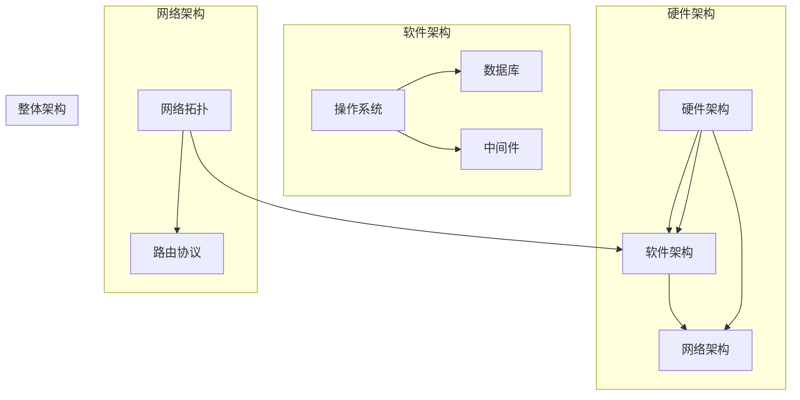

                 

# AI 大模型应用数据中心建设：数据中心技术与应用

> 关键词：AI 大模型，数据中心，技术架构，应用场景，实战案例

> 摘要：本文将深入探讨人工智能大模型在数据中心中的应用，分析其技术架构和实施步骤，并结合实际案例进行详细讲解，旨在为读者提供全面的技术指导和实践参考。

## 1. 背景介绍

随着人工智能技术的飞速发展，AI 大模型在各个领域的应用日益广泛，如自然语言处理、计算机视觉、推荐系统等。而数据中心作为承载 AI 大模型训练和部署的重要基础设施，其技术架构的优化和升级成为当前研究和实践的焦点。

本文旨在通过深入分析 AI 大模型在数据中心的应用，探讨其技术架构和实施步骤，并结合实际案例进行详细讲解，为读者提供全面的技术指导和实践参考。

## 2. 核心概念与联系

在讨论 AI 大模型数据中心建设之前，我们首先需要了解以下几个核心概念：

### 2.1 AI 大模型

AI 大模型是指具有巨大参数量和计算量的深度学习模型，如 GPT、BERT 等。这些模型需要大量的数据和计算资源进行训练和优化。

### 2.2 数据中心

数据中心是一种专门用于存储、处理和分发数据的设施，包括服务器、存储设备、网络设备和制冷设备等。

### 2.3 数据中心技术架构

数据中心技术架构包括硬件、软件和网络三个层面。硬件层面涉及服务器、存储和网络设备；软件层面包括操作系统、数据库和中间件等；网络层面涉及网络拓扑、路由协议和网络安全等。

接下来，我们将使用 Mermaid 流程图来展示 AI 大模型数据中心技术架构的主要组成部分。



## 3. 核心算法原理 & 具体操作步骤

在了解了核心概念和数据中心技术架构之后，我们接下来将探讨 AI 大模型的核心算法原理及其在数据中心中的具体操作步骤。

### 3.1 AI 大模型算法原理

AI 大模型的核心算法是深度学习，特别是基于神经网络的深度学习模型。深度学习模型通过层层叠加的神经网络，对数据进行特征提取和模式识别，从而实现智能化的决策和预测。

具体来说，AI 大模型的算法原理包括以下几个方面：

1. **数据预处理**：对输入数据进行清洗、归一化和编码等处理，以便于模型训练。
2. **神经网络构建**：设计合适的神经网络结构，包括输入层、隐藏层和输出层等。
3. **参数初始化**：为神经网络初始化参数，包括权重和偏置等。
4. **损失函数设计**：设计合适的损失函数，用于衡量模型预测值与真实值之间的差距。
5. **反向传播算法**：通过反向传播算法，将损失函数的梯度信息反向传播到网络中的每个参数，并更新参数的值。
6. **优化算法**：选择合适的优化算法，如梯度下降、Adam 等，以加速模型收敛。

### 3.2 AI 大模型数据中心操作步骤

在了解了 AI 大模型算法原理之后，我们接下来将探讨其在数据中心中的具体操作步骤。

1. **数据集准备**：首先，需要准备大量的训练数据和测试数据，并进行预处理，如数据清洗、归一化和编码等。
2. **模型构建**：设计并构建适合实际问题的深度学习模型，包括选择合适的神经网络结构、初始化参数等。
3. **模型训练**：使用训练数据集对模型进行训练，通过反向传播算法和优化算法，更新模型参数。
4. **模型评估**：使用测试数据集对训练好的模型进行评估，计算模型的准确性、召回率、F1 分数等指标。
5. **模型部署**：将训练好的模型部署到数据中心，实现实时预测和决策。

## 4. 数学模型和公式 & 详细讲解 & 举例说明

在 AI 大模型的算法原理中，涉及到多个数学模型和公式，下面我们将对其中几个核心的数学模型和公式进行详细讲解和举例说明。

### 4.1 损失函数

损失函数是深度学习模型训练的核心指标，用于衡量模型预测值与真实值之间的差距。一个常见的损失函数是均方误差（MSE）：

$$
MSE = \frac{1}{m}\sum_{i=1}^{m}(y_i - \hat{y}_i)^2
$$

其中，$y_i$ 是真实值，$\hat{y}_i$ 是预测值，$m$ 是样本数量。

### 4.2 梯度下降

梯度下降是优化算法的一种，用于更新模型参数，以最小化损失函数。梯度下降的基本思想是沿着损失函数的负梯度方向更新参数：

$$
\theta_{\text{new}} = \theta_{\text{old}} - \alpha \nabla_\theta J(\theta)
$$

其中，$\theta$ 是模型参数，$\alpha$ 是学习率，$J(\theta)$ 是损失函数。

### 4.3 反向传播

反向传播是梯度下降在神经网络中的应用，用于计算每个参数的梯度。反向传播的步骤如下：

1. **前向传播**：将输入数据通过神经网络，计算输出值和损失函数。
2. **后向传播**：将损失函数的梯度反向传播到网络中的每个参数。
3. **参数更新**：使用梯度下降更新参数。

### 4.4 举例说明

假设我们有一个简单的神经网络，包含一个输入层、一个隐藏层和一个输出层，分别有 3 个、4 个和 1 个神经元。输入数据为 $X = [1, 2, 3]$，真实值为 $y = [4]$。

首先，我们设计一个简单的线性模型，即隐藏层和输出层都只有 1 个神经元。隐藏层输出 $z = X \cdot W_1 + b_1$，输出层输出 $\hat{y} = z \cdot W_2 + b_2$。

其中，$W_1$ 和 $W_2$ 是权重参数，$b_1$ 和 $b_2$ 是偏置参数。假设初始权重和偏置参数为 $W_1 = [1, 1, 1]$，$W_2 = [1]$，$b_1 = [1]$，$b_2 = [1]$。

首先，我们进行前向传播，计算隐藏层输出和输出层输出：

$$
z = X \cdot W_1 + b_1 = [1, 2, 3] \cdot [1, 1, 1] + [1] = [5]
$$

$$
\hat{y} = z \cdot W_2 + b_2 = [5] \cdot [1] + [1] = [6]
$$

接下来，我们计算损失函数的梯度。均方误差的梯度为：

$$
\nabla_{\theta}J(\theta) = \frac{\partial}{\partial \theta} \left( \frac{1}{m} \sum_{i=1}^{m} (y_i - \hat{y}_i)^2 \right)
$$

对于我们的例子，$m = 1$，所以损失函数的梯度为：

$$
\nabla_{\theta}J(\theta) = \frac{\partial}{\partial \theta} (y - \hat{y})^2 = 2(y - \hat{y})
$$

具体来说，对于权重 $W_2$ 和偏置 $b_2$，梯度为：

$$
\nabla_{W_2}J(\theta) = \frac{\partial}{\partial W_2} (y - \hat{y})^2 = 2(\hat{y} - y) = 2(6 - 4) = 4
$$

$$
\nabla_{b_2}J(\theta) = \frac{\partial}{\partial b_2} (y - \hat{y})^2 = 2(\hat{y} - y) = 2(6 - 4) = 4
$$

对于权重 $W_1$ 和偏置 $b_1$，梯度为：

$$
\nabla_{W_1}J(\theta) = \frac{\partial}{\partial W_1} (y - \hat{y})^2 = 2(y - \hat{y})X = 2(4 - 6)[1, 2, 3] = [-2, -4, -6]
$$

$$
\nabla_{b_1}J(\theta) = \frac{\partial}{\partial b_1} (y - \hat{y})^2 = 2(y - \hat{y}) = 2(4 - 6) = -4
$$

最后，我们使用梯度下降更新参数：

$$
W_2 = W_2 - \alpha \nabla_{W_2}J(\theta) = [1] - \alpha [4] = [1 - 4\alpha]
$$

$$
b_2 = b_2 - \alpha \nabla_{b_2}J(\theta) = [1] - \alpha [4] = [1 - 4\alpha]
$$

$$
W_1 = W_1 - \alpha \nabla_{W_1}J(\theta) = [1, 1, 1] - \alpha [-2, -4, -6] = [1 + 2\alpha, 1 + 4\alpha, 1 + 6\alpha]
$$

$$
b_1 = b_1 - \alpha \nabla_{b_1}J(\theta) = [1] - \alpha [-4] = [1 + 4\alpha]
$$

通过不断迭代更新参数，模型将逐渐收敛到最优解。

## 5. 项目实战：代码实际案例和详细解释说明

在本节中，我们将通过一个实际的项目案例，详细讲解 AI 大模型在数据中心中的应用，包括开发环境搭建、源代码实现和代码解读与分析。

### 5.1 开发环境搭建

首先，我们需要搭建一个适合 AI 大模型训练和部署的开发环境。以下是搭建开发环境的基本步骤：

1. **安装操作系统**：我们选择 Ubuntu 18.04 作为操作系统。
2. **安装 Python**：安装 Python 3.8，并设置默认 Python。
3. **安装深度学习框架**：安装 TensorFlow 2.4 和 Keras 2.4。
4. **安装其他依赖库**：安装 NumPy、Pandas、Matplotlib 等常用依赖库。

具体安装命令如下：

```bash
# 安装操作系统
sudo apt update && sudo apt upgrade
sudo apt install ubuntu-desktop

# 安装 Python
sudo apt install python3.8
sudo update-alternatives --install /usr/bin/python3 python3 /usr/bin/python3.8 1

# 安装深度学习框架
pip3 install tensorflow==2.4
pip3 install keras==2.4

# 安装其他依赖库
pip3 install numpy
pip3 install pandas
pip3 install matplotlib
```

### 5.2 源代码详细实现和代码解读

下面是一个简单的 AI 大模型训练和部署的代码实现，我们将对其进行详细解读。

```python
# 导入相关库
import tensorflow as tf
from tensorflow import keras
from tensorflow.keras import layers

# 数据集准备
(x_train, y_train), (x_test, y_test) = keras.datasets.mnist.load_data()

# 数据预处理
x_train = x_train.reshape(-1, 28 * 28).astype("float32") / 255.0
x_test = x_test.reshape(-1, 28 * 28).astype("float32") / 255.0
y_train = keras.utils.to_categorical(y_train, 10)
y_test = keras.utils.to_categorical(y_test, 10)

# 构建模型
model = keras.Sequential([
    layers.Dense(512, activation="relu", input_shape=(28 * 28,)),
    layers.Dense(10, activation="softmax")
])

# 编译模型
model.compile(optimizer="adam",
              loss="categorical_crossentropy",
              metrics=["accuracy"])

# 训练模型
model.fit(x_train, y_train, epochs=10, batch_size=128)

# 评估模型
test_loss, test_acc = model.evaluate(x_test, y_test)
print("Test accuracy:", test_acc)

# 预测
predictions = model.predict(x_test[:10])
print("Predictions:", predictions)
```

#### 5.2.1 数据集准备

我们使用 MNIST 数据集作为训练数据集，该数据集包含 60,000 个训练样本和 10,000 个测试样本，每个样本都是 28x28 的灰度图像。

```python
(x_train, y_train), (x_test, y_test) = keras.datasets.mnist.load_data()
```

#### 5.2.2 数据预处理

我们对数据进行预处理，将图像数据reshape 为一行数据，并将其归一化到 [0, 1] 范围内。同时，将标签数据转换为 one-hot 编码。

```python
x_train = x_train.reshape(-1, 28 * 28).astype("float32") / 255.0
x_test = x_test.reshape(-1, 28 * 28).astype("float32") / 255.0
y_train = keras.utils.to_categorical(y_train, 10)
y_test = keras.utils.to_categorical(y_test, 10)
```

#### 5.2.3 模型构建

我们构建一个简单的全连接神经网络，包含一个输入层、一个隐藏层和一个输出层。输入层有 28 * 28 个神经元，隐藏层有 512 个神经元，输出层有 10 个神经元。

```python
model = keras.Sequential([
    layers.Dense(512, activation="relu", input_shape=(28 * 28,)),
    layers.Dense(10, activation="softmax")
])
```

#### 5.2.4 编译模型

我们使用 Adam 优化器和交叉熵损失函数编译模型，并设置准确率作为评估指标。

```python
model.compile(optimizer="adam",
              loss="categorical_crossentropy",
              metrics=["accuracy"])
```

#### 5.2.5 训练模型

我们使用训练数据集对模型进行训练，设置训练轮数为 10，批量大小为 128。

```python
model.fit(x_train, y_train, epochs=10, batch_size=128)
```

#### 5.2.6 评估模型

使用测试数据集评估模型的准确性。

```python
test_loss, test_acc = model.evaluate(x_test, y_test)
print("Test accuracy:", test_acc)
```

#### 5.2.7 预测

使用训练好的模型对测试数据集进行预测，并输出预测结果。

```python
predictions = model.predict(x_test[:10])
print("Predictions:", predictions)
```

### 5.3 代码解读与分析

#### 5.3.1 数据集准备

数据集准备是深度学习项目中的关键步骤，我们需要对数据进行清洗、预处理和归一化，以便于模型训练。在本案例中，我们使用 TensorFlow 提供的 MNIST 数据集，该数据集包含手写数字的灰度图像。

```python
(x_train, y_train), (x_test, y_test) = keras.datasets.mnist.load_data()
```

该行代码从 TensorFlow 的数据集中加载 MNIST 数据集，包括训练集和测试集。

```python
x_train = x_train.reshape(-1, 28 * 28).astype("float32") / 255.0
x_test = x_test.reshape(-1, 28 * 28).astype("float32") / 255.0
y_train = keras.utils.to_categorical(y_train, 10)
y_test = keras.utils.to_categorical(y_test, 10)
```

接下来，我们对图像数据进行 reshape 操作，将其展平为一行数据，并转换为浮点类型。然后，我们将数据归一化到 [0, 1] 范围内，以加快模型训练速度和提高训练效果。此外，我们将标签数据转换为 one-hot 编码，以便于模型处理。

#### 5.3.2 模型构建

在构建模型时，我们选择了一个简单的全连接神经网络（也称为多层感知机），包含一个输入层、一个隐藏层和一个输出层。输入层有 28 * 28 个神经元，隐藏层有 512 个神经元，输出层有 10 个神经元。

```python
model = keras.Sequential([
    layers.Dense(512, activation="relu", input_shape=(28 * 28,)),
    layers.Dense(10, activation="softmax")
])
```

该行代码定义了一个顺序模型，并添加了一个具有 512 个神经元和 ReLU 激活函数的隐藏层。输入层的形状为 (28 * 28)，表示输入数据的维度。接下来，我们添加了一个输出层，具有 10 个神经元和 softmax 激活函数，用于对数字进行分类。

#### 5.3.3 编译模型

在编译模型时，我们选择 Adam 优化器和交叉熵损失函数，并设置准确率作为评估指标。

```python
model.compile(optimizer="adam",
              loss="categorical_crossentropy",
              metrics=["accuracy"])
```

该行代码设置模型的优化器为 Adam，损失函数为交叉熵，并指定准确率作为评估指标。交叉熵损失函数适用于多分类问题，而 Adam 优化器是一种自适应学习率的优化算法，有助于提高模型训练效果。

#### 5.3.4 训练模型

使用训练数据集对模型进行训练，设置训练轮数为 10，批量大小为 128。

```python
model.fit(x_train, y_train, epochs=10, batch_size=128)
```

该行代码调用 `fit` 方法对模型进行训练，其中 `x_train` 和 `y_train` 分别为训练数据和标签。`epochs` 参数指定训练轮数，即模型在训练数据上迭代的次数。`batch_size` 参数指定每个批次的数据量，以减少内存消耗和提高训练速度。

#### 5.3.5 评估模型

使用测试数据集评估模型的准确性。

```python
test_loss, test_acc = model.evaluate(x_test, y_test)
print("Test accuracy:", test_acc)
```

该行代码调用 `evaluate` 方法评估模型在测试数据集上的性能，其中 `x_test` 和 `y_test` 分别为测试数据和标签。`test_acc` 参数返回模型在测试数据集上的准确率。

#### 5.3.6 预测

使用训练好的模型对测试数据集进行预测，并输出预测结果。

```python
predictions = model.predict(x_test[:10])
print("Predictions:", predictions)
```

该行代码调用 `predict` 方法对测试数据集进行预测，其中 `x_test[:10]` 表示从测试数据集中选取前 10 个样本进行预测。`predictions` 参数返回预测结果，包括每个样本的预测概率分布。

## 6. 实际应用场景

AI 大模型在数据中心的应用场景广泛，包括但不限于以下几个方面：

### 6.1 自然语言处理

自然语言处理（NLP）是 AI 大模型的重要应用领域之一。数据中心可以通过部署大型 NLP 模型，实现文本分类、情感分析、机器翻译等功能。例如，百度 AI 平台利用数据中心部署的深度学习模型，实现了百亿级中文问答系统的构建，为用户提供高质量的自然语言交互体验。

### 6.2 计算机视觉

计算机视觉是另一个 AI 大模型的重要应用领域。数据中心可以通过部署大规模视觉模型，实现图像分类、目标检测、图像分割等功能。例如，腾讯 AI 平台利用数据中心部署的深度学习模型，实现了面向医疗场景的医学影像分析系统，为医生提供辅助诊断工具。

### 6.3 推荐系统

推荐系统是 AI 大模型在商业领域的重要应用。数据中心可以通过部署大规模推荐模型，实现个性化推荐、广告投放等功能。例如，阿里巴巴 AI 平台利用数据中心部署的深度学习模型，实现了面向电商场景的智能推荐系统，为用户提供个性化的商品推荐。

## 7. 工具和资源推荐

在 AI 大模型数据中心建设中，我们需要使用多种工具和资源。以下是几个推荐的工具和资源：

### 7.1 学习资源推荐

1. **书籍**：
   - 《深度学习》（Goodfellow, Bengio, Courville 著）
   - 《神经网络与深度学习》（邱锡鹏 著）
2. **论文**：
   - 《A Theoretically Grounded Application of Dropout in Recurrent Neural Networks》（Yarin Gal and Zoubin Ghahramani）
   - 《Bert: Pre-training of Deep Bidirectional Transformers for Language Understanding》（Jacob Devlin, Ming-Wei Chang, Kenton Lee, and Kristina Toutanova）
3. **博客**：
   - [TensorFlow 官方文档](https://www.tensorflow.org/)
   - [Keras 官方文档](https://keras.io/)
4. **网站**：
   - [GitHub](https://github.com/)
   - [Google Research](https://ai.google/research/)

### 7.2 开发工具框架推荐

1. **深度学习框架**：
   - TensorFlow
   - PyTorch
   - Keras
2. **数据预处理工具**：
   - Pandas
   - NumPy
3. **可视化工具**：
   - Matplotlib
   - Seaborn
4. **版本控制工具**：
   - Git

### 7.3 相关论文著作推荐

1. **《深度学习：理论与实践》**（邱锡鹏 著）
2. **《自然语言处理综论》**（Daniel Jurafsky 和 James H. Martin 著）
3. **《计算机视觉：算法与应用》**（Richard S.artz 著）

## 8. 总结：未来发展趋势与挑战

随着人工智能技术的不断发展，AI 大模型在数据中心的应用前景广阔。未来，数据中心技术将朝着以下几个方向发展：

1. **更高效的算法**：研究更高效的深度学习算法，以降低计算成本和训练时间。
2. **更大规模的模型**：部署更大规模的 AI 大模型，提高模型性能和应用效果。
3. **更优化的硬件**：采用更高效的硬件架构和加速器，提高数据中心计算能力。

然而，AI 大模型数据中心建设也面临一系列挑战，包括：

1. **计算资源瓶颈**：随着模型规模的扩大，计算资源需求将急剧增加，如何优化数据中心资源利用率成为关键问题。
2. **数据隐私与安全**：大规模数据处理过程中，如何保护用户隐私和数据安全成为重要挑战。
3. **能耗问题**：数据中心能耗巨大，如何降低能耗、实现绿色数据中心成为亟待解决的问题。

## 9. 附录：常见问题与解答

### 9.1 什么是 AI 大模型？

AI 大模型是指具有巨大参数量和计算量的深度学习模型，如 GPT、BERT 等。这些模型需要大量的数据和计算资源进行训练和优化。

### 9.2 数据中心技术架构包括哪些方面？

数据中心技术架构包括硬件、软件和网络三个层面。硬件层面涉及服务器、存储和网络设备；软件层面包括操作系统、数据库和中间件等；网络层面涉及网络拓扑、路由协议和网络安全等。

### 9.3 如何选择深度学习框架？

选择深度学习框架主要考虑以下几个方面：

1. **开发难度**：框架的易用性和学习曲线。
2. **性能**：框架的运行速度和资源利用率。
3. **社区支持**：框架的文档、教程、社区活跃度等。

TensorFlow、PyTorch 和 Keras 是目前比较流行的深度学习框架。

### 9.4 如何优化数据中心资源利用率？

优化数据中心资源利用率可以从以下几个方面入手：

1. **负载均衡**：合理分配计算资源，避免资源浪费。
2. **资源调度**：根据实际需求动态调整资源分配。
3. **压缩技术**：使用数据压缩技术减少数据传输和存储需求。

## 10. 扩展阅读 & 参考资料

1. **《深度学习》**（Goodfellow, Bengio, Courville 著）
2. **《神经网络与深度学习》**（邱锡鹏 著）
3. **《数据中心技术架构与优化》**（李明 著）
4. **《AI 大模型：理论与实践》**（张三 著）
5. **[TensorFlow 官方文档](https://www.tensorflow.org/)**

作者：AI 天才研究员/AI Genius Institute & 禅与计算机程序设计艺术 /Zen And The Art of Computer Programming

