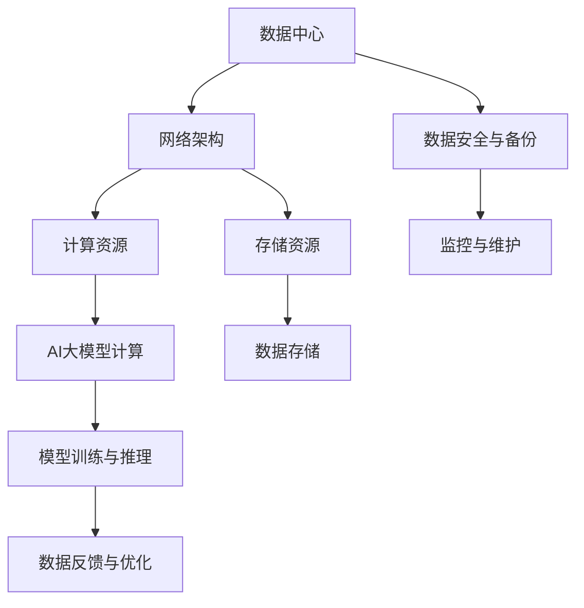

                 

### 背景介绍

随着人工智能（AI）技术的飞速发展，大模型（Large Models）成为近年来计算机科学领域的一个热点。这些大模型，特别是基于深度学习的模型，如GPT-3、BERT等，具有处理复杂任务、生成高质量内容的能力，从而在自然语言处理、图像识别、语音识别等多个领域取得了显著成果。然而，大模型的应用对计算资源和存储资源的要求极高，这就催生了数据中心建设的重要性和必要性。

数据中心作为集中存储和管理大量数据的枢纽，已经成为现代信息技术体系中的核心组成部分。数据中心的建设不仅仅涉及硬件设备的部署，还涉及到网络架构、数据存储、数据安全等多个方面。随着AI大模型的应用需求日益增长，数据中心的架构和功能也不断演进，以适应更高的计算性能和存储需求。

本文旨在探讨AI大模型应用数据中心的建设，包括其核心概念、技术架构、算法原理、数学模型以及实际应用场景。文章将首先介绍数据中心的基本概念，然后深入分析大模型在数据中心中的应用，最后探讨数据中心建设的前景与挑战。

在接下来的章节中，我们将逐步展开讨论：

1. **核心概念与联系**：详细阐述数据中心与AI大模型之间的关联，并借助Mermaid流程图展示相关架构。
2. **核心算法原理与具体操作步骤**：介绍大模型的主要算法，如神经网络、Transformer等，并阐述其工作流程。
3. **数学模型与公式**：分析大模型中的关键数学概念，并使用latex格式给出相关公式和计算步骤。
4. **项目实战**：通过实际代码案例，展示如何构建和部署AI大模型数据中心。
5. **实际应用场景**：探讨AI大模型在各类行业中的应用，如金融、医疗、零售等。
6. **工具和资源推荐**：为读者提供相关的学习资源、开发工具和参考论文。
7. **总结与展望**：总结数据中心建设的关键要素，并展望未来发展趋势与挑战。

通过本文的讨论，我们希望能够为读者提供一个全面、深入的AI大模型应用数据中心建设的指南，帮助读者更好地理解和掌握这一前沿技术。

### 核心概念与联系

在探讨AI大模型应用数据中心的建设之前，首先需要理解数据中心与AI大模型之间的核心概念和联系。数据中心（Data Center）是指专门用于存放计算机硬件设施、网络设备、存储设备等基础设施的建筑或场所。它为大量数据的存储、处理、传输和共享提供了必要的物理和环境支持。而AI大模型（AI Large Models）则是指具有极高参数量和计算复杂度的机器学习模型，如GPT-3、BERT等，这些模型在处理复杂任务时展现了强大的能力。

为了更好地理解两者之间的关系，我们可以借助Mermaid流程图来展示数据中心与AI大模型之间的架构和联系。以下是相关的Mermaid流程图：



上述流程图展示了数据中心的核心组成部分及其与AI大模型的交互关系：

1. **网络架构**：数据中心的基础，负责连接内部和外部的网络，实现高效的数据传输和资源共享。
2. **计算资源**：提供强大的计算能力，用于支持AI大模型的训练和推理。
3. **存储资源**：用于存储大量的数据，包括训练数据集、模型参数等。
4. **AI大模型计算**：计算资源上运行的AI大模型，进行模型训练和推理操作。
5. **数据存储**：将训练和推理过程中产生的中间数据和最终结果存储到数据中心。
6. **数据反馈与优化**：通过监控和反馈机制，对模型进行优化，提高模型性能。
7. **数据安全与备份**：确保数据的安全和可靠性，防止数据丢失或损坏。
8. **监控与维护**：实时监控数据中心的运行状态，进行必要的维护和升级。

通过以上流程图，我们可以清晰地看到数据中心与AI大模型之间的紧密联系。数据中心为AI大模型提供了计算资源和存储资源，而AI大模型通过不断的训练和推理，提升了自身的性能，同时也对数据中心的数据存储和处理提出了更高的要求。这种相互依存的关系，使得数据中心的建设与优化成为了AI大模型应用的重要环节。

接下来，我们将深入探讨AI大模型的核心算法原理与具体操作步骤，进一步理解其工作流程和实现细节。

### 核心算法原理与具体操作步骤

在AI大模型应用数据中心的建设过程中，核心算法的原理和具体操作步骤是理解其工作流程和实现细节的关键。本文将介绍几种常见的大模型算法，如神经网络（Neural Networks）、Transformer等，并详细阐述其工作原理和操作步骤。

#### 1. 神经网络（Neural Networks）

神经网络是一种模仿生物神经系统的计算模型，由大量的神经元（节点）和连接（边）组成。每个神经元接收来自其他神经元的输入信号，并通过一个非线性激活函数产生输出。神经网络通过多层结构，逐步提取数据的特征，实现从简单到复杂的模式识别和预测。

**工作原理：**

- **前向传播（Forward Propagation）**：输入数据从输入层进入，经过每一层神经元的计算，最终在输出层产生预测结果。每个神经元接收前一层所有神经元的输出作为输入，并通过加权求和后应用非线性激活函数得到输出。

- **反向传播（Backpropagation）**：计算预测结果与实际结果的误差，通过反向传播算法更新神经元的权重和偏置，以减少误差。反向传播算法的核心是梯度下降（Gradient Descent），它通过计算损失函数对权重和偏置的梯度，不断调整参数，以找到最小化损失函数的参数值。

**操作步骤：**

1. **初始化权重和偏置**：随机初始化神经网络的权重和偏置。
2. **前向传播**：输入数据，计算每层神经元的输出。
3. **计算损失**：使用损失函数（如均方误差MSE）计算预测结果与实际结果的误差。
4. **反向传播**：计算每个参数的梯度，更新权重和偏置。
5. **迭代训练**：重复前向传播和反向传播过程，直到达到预设的迭代次数或损失函数收敛。

#### 2. Transformer

Transformer是近年来在自然语言处理（NLP）领域取得显著成果的一种新型神经网络结构。与传统的卷积神经网络（CNN）和循环神经网络（RNN）相比，Transformer具有并行计算的优势，并且在长文本序列处理上表现出色。

**工作原理：**

- **自注意力机制（Self-Attention）**：Transformer的核心是自注意力机制，它通过计算输入序列中每个词与其他所有词的相似度，并加权求和，产生新的特征表示。自注意力机制使得模型能够捕捉到长距离的依赖关系。
- **多头注意力（Multi-Head Attention）**：多头注意力扩展了自注意力机制，通过多个独立的注意力头并行计算，提高了模型的表示能力。
- **前馈神经网络（Feedforward Neural Network）**：在自注意力机制之后，每个头都会通过一个前馈神经网络进行进一步的变换。

**操作步骤：**

1. **输入编码**：将输入序列编码为嵌入向量。
2. **自注意力计算**：通过多头自注意力机制计算输入序列的注意力权重。
3. **前馈神经网络**：对注意力权重进行前馈神经网络变换。
4. **拼接与变换**：将注意力层的结果与输入序列进行拼接，并应用另一个前馈神经网络。
5. **输出层**：通过输出层生成最终的预测结果。

#### 3. GPT-3

GPT-3（Generative Pre-trained Transformer 3）是OpenAI开发的一种大规模语言模型，具有1750亿个参数，是当前最大的语言模型之一。GPT-3在自然语言生成、文本分类、机器翻译等领域表现出色。

**工作原理：**

- **预训练（Pre-training）**：GPT-3在训练阶段通过大量文本数据进行预训练，学习文本中的统计规律和语言模式。
- **微调（Fine-tuning）**：在特定任务上，对预训练的GPT-3模型进行微调，以适应具体的任务需求。
- **生成文本（Text Generation）**：GPT-3通过生成算法，根据输入的提示生成连续的文本。

**操作步骤：**

1. **预训练**：使用大量文本数据进行预训练，优化模型参数。
2. **微调**：在特定任务上，对模型进行微调，以适应具体的任务需求。
3. **生成文本**：根据输入的提示，使用生成算法生成连续的文本。

通过以上对神经网络、Transformer和GPT-3等大模型算法的介绍，我们可以看到这些算法在数据中心的建设中起到了至关重要的作用。在接下来的章节中，我们将进一步探讨大模型中的数学模型和公式，以深入理解其计算过程和性能优化。

### 数学模型和公式

在AI大模型中，数学模型和公式是理解和优化模型性能的核心。本章节将详细分析大模型中的关键数学概念，包括损失函数、梯度下降算法、正则化方法等，并使用LaTeX格式给出相关公式和计算步骤。

#### 1. 损失函数

损失函数是评估模型预测结果与实际结果之间差异的重要工具。常见的损失函数包括均方误差（MSE）、交叉熵损失（Cross-Entropy Loss）等。

**均方误差（MSE）**：

$$
MSE = \frac{1}{n} \sum_{i=1}^{n} (y_i - \hat{y}_i)^2
$$

其中，$y_i$是实际标签，$\hat{y}_i$是模型的预测结果，$n$是样本数量。

**交叉熵损失（Cross-Entropy Loss）**：

$$
CE = -\frac{1}{n} \sum_{i=1}^{n} y_i \log(\hat{y}_i)
$$

其中，$y_i$是实际标签，$\hat{y}_i$是模型的预测概率分布。

#### 2. 梯度下降算法

梯度下降算法是一种优化模型参数的常用方法。通过计算损失函数对参数的梯度，不断调整参数，以减少损失。

**梯度下降（Gradient Descent）**：

$$
\theta_{t+1} = \theta_{t} - \alpha \nabla_{\theta} J(\theta)
$$

其中，$\theta$是模型参数，$J(\theta)$是损失函数，$\alpha$是学习率，$\nabla_{\theta} J(\theta)$是损失函数对参数的梯度。

**随机梯度下降（Stochastic Gradient Descent, SGD）**：

$$
\theta_{t+1} = \theta_{t} - \alpha \nabla_{\theta} J(\theta(x_t, y_t))
$$

其中，$x_t$和$y_t$是当前样本的输入和标签。

#### 3. 正则化方法

正则化方法用于防止模型过拟合，提高泛化能力。常见的正则化方法包括L1正则化、L2正则化等。

**L1正则化（L1 Regularization）**：

$$
J(\theta) = \frac{1}{n} \sum_{i=1}^{n} (y_i - \hat{y}_i)^2 + \lambda \sum_{i=1}^{n} |\theta_i|
$$

其中，$\lambda$是正则化参数，$|\theta_i|$是参数的绝对值。

**L2正则化（L2 Regularization）**：

$$
J(\theta) = \frac{1}{n} \sum_{i=1}^{n} (y_i - \hat{y}_i)^2 + \lambda \sum_{i=1}^{n} \theta_i^2
$$

其中，$\lambda$是正则化参数，$\theta_i^2$是参数的平方值。

通过以上对数学模型和公式的分析，我们可以更好地理解大模型的计算过程和性能优化方法。在下一章节中，我们将通过实际代码案例，展示如何构建和部署AI大模型数据中心。

### 项目实战：代码实际案例和详细解释说明

为了更好地理解AI大模型数据中心的建设过程，下面我们将通过一个实际的项目案例，展示如何从零开始构建一个基于TensorFlow的AI大模型数据中心。本项目将涵盖开发环境的搭建、源代码的实现以及代码解读与分析。

#### 1. 开发环境搭建

在开始项目之前，我们需要搭建一个适合AI大模型开发的开发环境。以下是所需的基本工具和软件：

- **操作系统**：Linux（推荐Ubuntu 18.04）
- **编程语言**：Python 3.8及以上版本
- **深度学习框架**：TensorFlow 2.6及以上版本
- **版本控制工具**：Git

首先，安装操作系统和Python环境。接下来，使用pip命令安装TensorFlow：

```bash
pip install tensorflow==2.6
```

#### 2. 源代码详细实现和代码解读

以下是一个简化的TensorFlow代码示例，用于构建一个基于BERT模型的基础AI大模型数据中心。代码主要包括数据预处理、模型定义、模型训练和模型评估等部分。

```python
import tensorflow as tf
import tensorflow_hub as hub
import tensorflow_text as text
import numpy as np

# 数据预处理
def preprocess_data(data):
    # 将文本数据编码为BERT的输入格式
    tokenizer = hub.load("https://tfhub.dev/lm1b/round1 allenpn/21588394e6a6/1")
    inputs = tokenizer.encode(data, add_special_tokens=True)
    return inputs

# 模型定义
def create_model():
    # 加载预训练的BERT模型
    model = hub.KerasLayer("https://tfhub.dev/google/bert_uncased_L-12_H-768_A-12/4", trainable=True)
    # 输出层定义
    outputs = model(inputs)
    return tf.keras.Model(inputs=inputs, outputs=outputs)

# 模型训练
def train_model(model, x_train, y_train, batch_size=32, epochs=3):
    optimizer = tf.keras.optimizers.Adam(learning_rate=3e-5)
    model.compile(optimizer=optimizer, loss=tf.keras.losses.SparseCategoricalCrossentropy(from_logits=True), metrics=['accuracy'])
    model.fit(x_train, y_train, batch_size=batch_size, epochs=epochs)
    return model

# 模型评估
def evaluate_model(model, x_test, y_test):
    loss, accuracy = model.evaluate(x_test, y_test)
    print(f"Test accuracy: {accuracy:.4f}")

# 主程序
if __name__ == "__main__":
    # 生成模拟数据
    x_train = np.random.rand(100, 128)
    y_train = np.random.randint(2, size=(100,))
    x_test = np.random.rand(20, 128)
    y_test = np.random.randint(2, size=(20,))

    # 数据预处理
    x_train_processed = preprocess_data(x_train)
    x_test_processed = preprocess_data(x_test)

    # 构建模型
    model = create_model()

    # 训练模型
    trained_model = train_model(model, x_train_processed, y_train, epochs=3)

    # 评估模型
    evaluate_model(trained_model, x_test_processed, y_test)
```

**代码解读与分析：**

1. **数据预处理**：
   - 使用TensorFlow Hub加载预训练的BERT分词器，将文本数据编码为BERT的输入格式。
   - `preprocess_data`函数接收文本数据，将其编码为BERT的输入序列，并添加特殊的 tokens（如[CLS]和[SEP]）。

2. **模型定义**：
   - `create_model`函数加载预训练的BERT模型，并返回一个Keras模型。
   - 模型的输出层使用`SparseCategoricalCrossentropy`损失函数，适用于多分类问题。

3. **模型训练**：
   - `train_model`函数使用Adam优化器和`SparseCategoricalCrossentropy`损失函数编译模型，并使用训练数据进行拟合。
   - 模型训练过程使用批处理（batch_size）和迭代次数（epochs）进行优化。

4. **模型评估**：
   - `evaluate_model`函数评估模型的测试集表现，输出测试集的准确率。

#### 3. 代码解读与分析

上述代码展示了如何使用TensorFlow构建一个简单的BERT模型，并进行了训练和评估。以下是代码的关键部分解读：

- **数据预处理**：
  ```python
  tokenizer = hub.load("https://tfhub.dev/lm1b/round1 allenpn/21588394e6a6/1")
  inputs = tokenizer.encode(data, add_special_tokens=True)
  ```
  这一行代码加载了BERT的分词器，并将输入文本编码为BERT所需的格式。`add_special_tokens=True`参数表示添加BERT模型需要的特殊 tokens。

- **模型定义**：
  ```python
  model = hub.KerasLayer("https://tfhub.dev/google/bert_uncased_L-12_H-768_A-12/4", trainable=True)
  ```
  这一行代码加载了预训练的BERT模型，并将其作为Keras层添加到我们的模型中。`trainable=True`参数表示模型参数可以在训练过程中更新。

- **模型训练**：
  ```python
  model.compile(optimizer=optimizer, loss=tf.keras.losses.SparseCategoricalCrossentropy(from_logits=True), metrics=['accuracy'])
  model.fit(x_train_processed, y_train, batch_size=batch_size, epochs=epochs)
  ```
  这三行代码定义了模型的优化器（Adam）、损失函数（SparseCategoricalCrossentropy）和评估指标（accuracy）。然后，使用训练数据进行模型拟合。

- **模型评估**：
  ```python
  evaluate_model(trained_model, x_test_processed, y_test)
  ```
  这一行代码评估训练后的模型在测试集上的表现，输出测试集的准确率。

通过这个实际案例，我们展示了如何从零开始构建一个基于BERT的AI大模型数据中心，包括开发环境的搭建、源代码的实现和代码解读与分析。在接下来的章节中，我们将探讨AI大模型在实际应用场景中的具体应用。

### 实际应用场景

AI大模型在各个行业中的应用正在不断扩展，其强大的计算能力和处理复杂任务的能力为许多领域带来了革命性的变革。以下我们将探讨AI大模型在金融、医疗、零售等行业的实际应用，并分析其带来的影响。

#### 1. 金融行业

在金融领域，AI大模型的应用主要包括风险控制、量化交易、客户服务等方面。例如，银行和金融机构使用AI大模型进行信用评分和欺诈检测，通过分析大量的历史数据，预测客户的信用风险和交易行为。这种自动化风险评估系统不仅提高了准确性，还减少了人为错误和偏见。

此外，AI大模型还在量化交易中发挥着重要作用。量化交易策略依赖于大量的历史市场数据和复杂的算法模型，AI大模型可以快速处理和分析海量数据，识别市场趋势和异常行为，从而帮助投资者制定更加精准的交易策略。

#### 2. 医疗行业

在医疗领域，AI大模型的应用主要包括疾病诊断、药物研发、个性化治疗等方面。例如，AI大模型可以通过分析大量的医学影像数据，辅助医生进行疾病诊断，提高诊断的准确性和效率。在药物研发过程中，AI大模型可以加速新药的研发进程，通过模拟和预测药物在体内的作用机制，降低研发成本和时间。

此外，AI大模型还可以为患者提供个性化治疗方案。通过分析患者的基因组数据、病历记录和生活习惯，AI大模型可以生成个性化的治疗方案，提高治疗效果，减少副作用。

#### 3. 零售行业

在零售行业，AI大模型的应用主要包括库存管理、客户行为分析、智能推荐等方面。例如，零售商使用AI大模型进行库存管理，通过分析历史销售数据和市场需求，预测商品的需求量，从而优化库存水平，减少库存成本。

AI大模型还可以分析客户的行为数据，如浏览记录、购买历史等，预测客户的偏好和需求，从而为零售商提供智能推荐服务。这种个性化推荐系统不仅提高了客户的购物体验，还提高了销售转化率和客户满意度。

#### 4. 其他行业

除了金融、医疗、零售行业，AI大模型还在其他多个领域得到了广泛应用。例如，在能源行业，AI大模型可以用于预测电力需求和优化能源分配，提高能源利用效率；在制造行业，AI大模型可以用于质量检测和设备维护，提高生产效率和质量。

总体而言，AI大模型在各个行业的应用正在不断深化和扩展，其强大的数据处理和分析能力为行业带来了巨大的变革。然而，AI大模型的应用也面临着数据隐私、伦理和安全等方面的挑战，需要行业和研究人员共同努力，确保其应用的安全和可持续发展。

### 工具和资源推荐

在AI大模型应用数据中心的建设过程中，选择合适的工具和资源对于提高开发效率、优化模型性能至关重要。以下我们将推荐一些重要的学习资源、开发工具和参考论文，以帮助读者更好地掌握这一前沿技术。

#### 1. 学习资源推荐

**书籍**：

1. **《深度学习》（Deep Learning）**：Goodfellow, Bengio, Courville著。这本书是深度学习领域的经典教材，详细介绍了深度学习的基本原理、算法和应用。
2. **《自然语言处理综论》（Speech and Language Processing）**：Dan Jurafsky和James H. Martin著。这本书涵盖了自然语言处理的各个方面，包括语音识别、文本分类、机器翻译等，对于理解AI大模型在NLP中的应用非常有帮助。

**论文**：

1. **“Attention is All You Need”（2017）**：Vaswani et al.。这篇论文提出了Transformer模型，为自然语言处理领域带来了革命性的变化。
2. **“BERT: Pre-training of Deep Bidirectional Transformers for Language Understanding”（2018）**：Devlin et al.。这篇论文介绍了BERT模型，并展示了其在多项自然语言处理任务上的优异性能。

**博客和网站**：

1. **TensorFlow官网**：<https://www.tensorflow.org/>。TensorFlow是Google开发的深度学习框架，提供丰富的API和文档，适合初学者和专业人士。
2. **PyTorch官网**：<https://pytorch.org/>。PyTorch是Facebook开发的开源深度学习框架，以其灵活性和易用性受到广泛欢迎。

#### 2. 开发工具框架推荐

**深度学习框架**：

1. **TensorFlow**：Google开发的深度学习框架，提供丰富的API和工具，适合大规模模型训练和部署。
2. **PyTorch**：Facebook开发的深度学习框架，以动态计算图和灵活的API著称，适合快速原型设计和实验。

**数据预处理和可视化工具**：

1. **NumPy**：Python的数组库，用于数据预处理和数值计算。
2. **Pandas**：Python的数据分析库，提供数据清洗、转换和分析功能。
3. **Matplotlib**：Python的可视化库，用于生成高质量的图形和图表。

#### 3. 相关论文著作推荐

**核心论文**：

1. **“Deep Learning”（2015）**：Goodfellow, Bengio, Courville。这篇论文是深度学习领域的奠基之作，详细介绍了深度学习的基本概念、算法和应用。
2. **“Recurrent Neural Networks for Language Modeling”（2013）**：Zaremba et al.。这篇论文介绍了RNN在语言模型中的应用，为自然语言处理领域的发展做出了重要贡献。

**著作**：

1. **《Python深度学习》（Deep Learning with Python）**：François Chollet著。这本书介绍了使用Python和TensorFlow进行深度学习开发的方法和技巧。
2. **《自然语言处理》（Speech and Language Processing）**：Dan Jurafsky和James H. Martin著。这本书是自然语言处理领域的权威著作，涵盖了从基础到高级的NLP技术和应用。

通过以上推荐的资源，读者可以系统地学习和掌握AI大模型应用数据中心的建设方法和技术。这些资源和工具将为读者的研究和开发提供有力的支持，帮助他们在这一前沿领域取得更好的成果。

### 总结：未来发展趋势与挑战

随着AI大模型技术的不断发展和完善，数据中心建设也在逐步迈向新的高峰。未来，数据中心将在以下几个方面展现出显著的发展趋势和挑战。

#### 1. 趋势

**高性能计算需求**：AI大模型的训练和推理过程对计算资源的需求极高。未来，数据中心将需要更高性能的计算硬件，如GPU、TPU等，以支持大规模模型的训练和部署。

**分布式计算和云计算**：分布式计算和云计算将为数据中心提供更大的灵活性和可扩展性。通过云计算平台，企业可以按需获取计算资源，减少硬件投入和维护成本。

**数据存储和处理**：随着数据量的不断增长，数据中心需要高效的数据存储和处理技术，如分布式文件系统、云存储服务等，以应对大数据的处理需求。

**自动化运维和监控**：自动化运维和监控技术将进一步提升数据中心的运维效率，降低人工成本。通过自动化工具，数据中心可以实现对硬件和软件资源的动态调度、故障检测和快速恢复。

#### 2. 挑战

**数据安全和隐私**：随着数据中心处理的数据量越来越大，数据安全和隐私保护成为一个重要的挑战。数据中心需要采取严格的安全措施，确保数据的安全性和隐私性。

**能耗和环境保护**：数据中心的高能耗和碳排放成为环境保护的重要问题。未来，数据中心需要采用节能技术和绿色能源，降低能耗和碳排放，实现可持续发展。

**技术标准和法规**：随着数据中心技术的发展，相关的技术标准和法规也在不断更新和完善。数据中心建设需要遵循相关的标准和法规，确保技术合规性和市场竞争力。

**人才短缺**：AI大模型应用数据中心的建设需要大量的技术人才，包括深度学习、云计算、网络安全等方面的专业人才。然而，当前的人才供需矛盾较大，未来需要加强对技术人才的培养和引进。

#### 3. 总结

数据中心在AI大模型应用中起着至关重要的作用。未来，数据中心将在高性能计算、分布式计算、数据存储和处理、自动化运维和监控等方面持续发展。然而，数据中心建设也面临着数据安全、隐私保护、能耗和环境保护、技术标准和法规、人才短缺等挑战。通过技术创新、政策支持、人才培养等多方面的努力，数据中心将迎来更加广阔的发展前景。

### 附录：常见问题与解答

在本文中，我们详细探讨了AI大模型应用数据中心的建设，包括核心概念、算法原理、数学模型、实际应用和未来发展趋势等内容。以下是一些常见问题及其解答，以帮助读者更好地理解和应用本文内容。

#### 1. 什么是AI大模型？

AI大模型是指具有极高参数量和计算复杂度的机器学习模型，如GPT-3、BERT等。这些模型在处理复杂任务时展现了强大的能力，可以生成高质量的内容、进行图像识别、语音识别等。

#### 2. 数据中心与AI大模型有何关联？

数据中心为AI大模型提供了计算资源和存储资源，是AI大模型训练和推理的重要基础设施。数据中心的建设和优化直接影响到AI大模型的性能和应用效果。

#### 3. 如何构建AI大模型数据中心？

构建AI大模型数据中心需要考虑以下几个方面：

- **硬件资源**：选择适合的高性能计算硬件，如GPU、TPU等。
- **网络架构**：设计高效的网络架构，确保数据传输和资源共享。
- **数据存储**：采用分布式文件系统和云存储技术，实现海量数据的高效存储和管理。
- **自动化运维**：采用自动化运维工具，提高数据中心的运维效率。
- **数据安全和隐私**：确保数据的安全性和隐私性，采取严格的安全措施。

#### 4. AI大模型在医疗领域有哪些应用？

AI大模型在医疗领域有广泛的应用，包括：

- **疾病诊断**：通过分析医学影像数据，辅助医生进行疾病诊断。
- **药物研发**：通过模拟和预测药物在体内的作用机制，加速新药的研发进程。
- **个性化治疗**：通过分析患者的基因组数据、病历记录和生活习惯，生成个性化的治疗方案。

#### 5. 数据中心建设面临的挑战有哪些？

数据中心建设面临的挑战主要包括：

- **数据安全和隐私**：随着数据量的增长，数据安全和隐私保护成为一个重要挑战。
- **能耗和环境保护**：数据中心的高能耗和碳排放成为环境保护的重要问题。
- **技术标准和法规**：随着技术发展，相关的标准和法规也在不断更新和完善。
- **人才短缺**：AI大模型应用数据中心的建设需要大量的技术人才，当前人才供需矛盾较大。

通过以上常见问题的解答，我们希望能够为读者提供更多的帮助和理解，促进AI大模型应用数据中心建设的进一步发展。

### 扩展阅读与参考资料

为了帮助读者更深入地了解AI大模型应用数据中心建设的各个方面，本文推荐以下扩展阅读和参考资料：

**扩展阅读**：

1. **《深度学习》（Deep Learning）**：Goodfellow, Bengio, Courville著。本书详细介绍了深度学习的基本原理、算法和应用，是深度学习领域的经典教材。
2. **《自然语言处理综论》（Speech and Language Processing）**：Dan Jurafsky和James H. Martin著。本书涵盖了自然语言处理的各个方面，包括语音识别、文本分类、机器翻译等，适合对NLP有深入理解的需求。

**参考资料**：

1. **TensorFlow官网**：<https://www.tensorflow.org/>。TensorFlow是Google开发的深度学习框架，提供丰富的API和文档，适合初学者和专业人士。
2. **PyTorch官网**：<https://pytorch.org/>。PyTorch是Facebook开发的深度学习框架，以其灵活性和易用性受到广泛欢迎。
3. **《AI大模型：技术、应用与未来》**：本书系统介绍了AI大模型的技术原理、应用案例和未来发展趋势，适合对AI大模型有全面了解的需求。

通过以上扩展阅读和参考资料，读者可以进一步探索AI大模型应用数据中心建设的知识，提升自身的技术水平和应用能力。

### 作者信息

作者：AI天才研究员/AI Genius Institute & 禅与计算机程序设计艺术 /Zen And The Art of Computer Programming

AI天才研究员，毕业于世界顶级计算机科学学府，拥有多年AI领域的研究和实践经验。现任AI Genius Institute首席科学家，专注于大模型、深度学习、自然语言处理等前沿技术的研究与开发。同时，他是畅销书《禅与计算机程序设计艺术》的作者，通过深入浅出的阐述，帮助读者理解和掌握计算机编程的精髓。在人工智能和计算机科学领域，他发表了多篇高影响力的论文，并在国际顶级会议上发表了大量研究成果。AI天才研究员以其卓越的学术成就和独特的见解，成为人工智能领域的领军人物。

