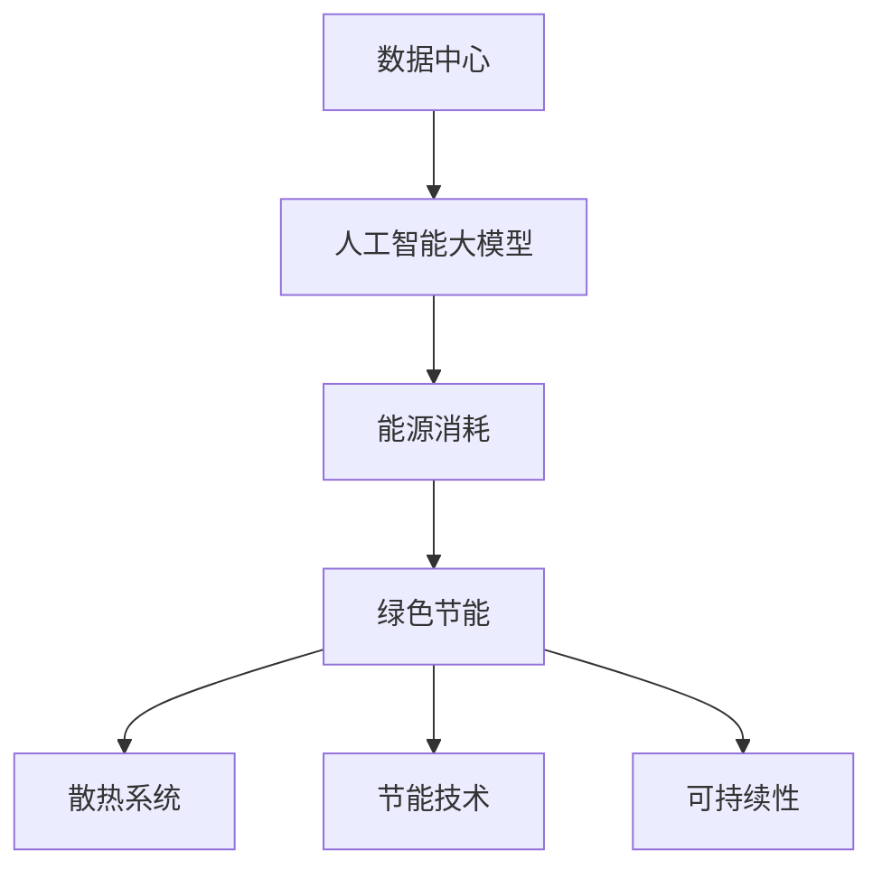

                 

### 背景介绍

人工智能（AI）作为当今科技领域的前沿，其应用已经渗透到我们生活的方方面面。特别是近年来，随着深度学习技术的飞速发展，大模型（Large-scale Model）的崛起更是引发了人工智能领域的革命。大模型具有极高的计算需求，为了满足这些需求，数据中心的建设和运营显得尤为重要。

数据中心是存放和管理大量数据的场所，是支撑大模型运行的核心设施。然而，数据中心的高能耗问题一直备受关注。随着AI大模型规模的不断扩大，数据中心的能源消耗也在急剧增加，这对环境造成了巨大的压力。因此，数据中心绿色节能成为了一个亟待解决的问题。

绿色节能不仅有助于减少碳排放，降低能源成本，还可以提高数据中心的稳定性和可靠性。本篇文章将围绕AI大模型应用数据中心建设中的绿色节能问题进行探讨。我们将从背景介绍、核心概念与联系、核心算法原理与操作步骤、数学模型与公式讲解、项目实战、实际应用场景、工具和资源推荐以及未来发展趋势与挑战等方面展开。

文章将首先介绍数据中心建设背景和大模型需求，然后深入探讨绿色节能的概念、技术原理和实现方法。接着，我们将通过一个实际项目案例，详细讲解如何实现绿色节能。此外，还将介绍一些相关的工具和资源，以便读者深入了解和学习。最后，我们将对未来的发展趋势和面临的挑战进行展望。

通过本文的阅读，读者将能够全面了解数据中心绿色节能的重要性，掌握相关的技术原理和方法，并为未来数据中心的建设和运营提供有益的参考。

### 核心概念与联系

在深入探讨数据中心绿色节能之前，有必要首先明确一些核心概念和它们之间的联系。以下是本文将涉及的核心概念及其相互关系：

#### 1. 数据中心（Data Center）

数据中心是一个集中管理和处理大量数据的高性能计算机设施，包括服务器、存储设备、网络设备等。数据中心的主要功能是存储、处理和分析数据，为企业和组织提供高效的数据服务。

#### 2. 人工智能大模型（AI Large-scale Model）

人工智能大模型，如深度学习模型，通过大量的数据进行训练，以达到高精度的预测和分类能力。这些模型通常需要处理数百万到数十亿个参数，对计算资源的需求极高。

#### 3. 能源消耗（Energy Consumption）

数据中心作为高能耗设施，其能源消耗主要来源于服务器、存储设备、网络设备等硬件设备的运行。随着大模型应用的普及，数据中心的能源消耗不断增加。

#### 4. 绿色节能（Green Energy Saving）

绿色节能是指通过技术手段和管理方法，减少数据中心的能源消耗，降低对环境的影响。绿色节能包括提高能源利用效率、采用可再生能源和优化设备运行策略等多个方面。

#### 5. 散热系统（Cooling System）

散热系统是数据中心的关键组成部分，用于将服务器和其他设备产生的热量有效排出。高效的散热系统能够减少能源消耗，提高设备运行稳定性。

#### 6. 节能技术（Energy-saving Technology）

节能技术包括虚拟化技术、能效管理、智能监控系统、先进散热技术等。这些技术可以降低数据中心的能源消耗，提高整体运营效率。

#### 7. 可持续性（Sustainability）

可持续性是指数据中心在满足当前需求的同时，不损害未来代际的需求。绿色节能是实现数据中心可持续性的关键手段。

#### 关系图解（Mermaid 流程图）



以上概念通过一个简单的Mermaid流程图进行了关联。数据中心作为基础设施，支撑着人工智能大模型的应用，而大模型的高能耗则推动了绿色节能的需求。绿色节能通过改善散热系统和采用节能技术，旨在实现数据中心的可持续运营。以下章节将进一步深入探讨这些概念的具体内容和实现方法。

#### 核心算法原理 & 具体操作步骤

在了解了数据中心建设背景和核心概念之后，我们接下来将探讨实现数据中心绿色节能的核心算法原理与具体操作步骤。绿色节能的核心在于提高能源利用效率，减少不必要的能源消耗，以下是几种主要的节能算法和技术：

##### 1. 虚拟化技术（Virtualization）

虚拟化技术通过将物理服务器虚拟化为多个虚拟机（VM），从而提高硬件资源的利用效率。虚拟化技术可以动态调整资源分配，避免资源浪费。具体操作步骤如下：

- **步骤一：虚拟化平台部署**  
  选择合适的虚拟化平台（如VMware、KVM等），在数据中心内部署虚拟化基础设施。

- **步骤二：服务器虚拟化**  
  将物理服务器上的操作系统和应用虚拟化为多个虚拟机，实现资源隔离和动态调整。

- **步骤三：资源调度与优化**  
  使用虚拟化平台的资源调度功能，根据业务需求动态调整虚拟机资源分配，提高资源利用率。

##### 2. 能效管理（Energy Management）

能效管理通过实时监控和调整数据中心的能耗，实现能源的最优利用。以下步骤详细描述了能效管理的操作：

- **步骤一：能耗监控**  
  使用智能监控设备（如智能电表、传感器等）实时采集数据中心的能源消耗数据。

- **步骤二：能耗分析**  
  对采集到的能耗数据进行分析，识别能耗高峰期和低效运行状态。

- **步骤三：能效优化**  
  根据能耗分析结果，调整设备运行策略，如关闭非必要设备、调整设备运行时间等，降低能耗。

##### 3. 智能监控系统（Intelligent Monitoring）

智能监控系统通过自动化和智能化手段，实现对数据中心的全面监控和预警。以下为智能监控系统的具体操作步骤：

- **步骤一：监控节点部署**  
  在数据中心的关键位置部署监控节点，如服务器、散热系统等。

- **步骤二：数据采集与处理**  
  使用传感器和网络技术，实时采集设备运行数据，并进行数据处理和分析。

- **步骤三：智能预警与决策**  
  根据监控数据，实现智能预警和自动化决策，如调整设备运行状态、触发维护流程等。

##### 4. 先进散热技术（Advanced Cooling Technology）

散热技术是数据中心绿色节能的关键，以下介绍几种先进的散热技术及其操作步骤：

- **步骤一：高效制冷系统**  
  部署高效制冷系统（如水冷、空气冷却等），降低设备运行温度。

- **步骤二：散热设备优化**  
  优化散热设备的布局和配置，如安装散热风扇、散热片等，提高散热效率。

- **步骤三：智能温控**  
  使用智能温控系统，实时监测设备温度，并根据温度变化调整制冷设备的工作状态，实现节能。

通过以上核心算法原理与操作步骤，数据中心可以实现高效的绿色节能。在后续章节中，我们将通过实际项目案例进一步探讨这些技术的应用和实践效果。

#### 数学模型和公式 & 详细讲解 & 举例说明

在绿色节能的实现过程中，数学模型和公式扮演了至关重要的角色。以下将详细讲解几种关键数学模型和公式，并通过具体实例进行说明。

##### 1. 能量消耗模型（Energy Consumption Model）

数据中心的总能耗主要由以下几部分组成：服务器能耗、网络设备能耗、制冷系统能耗等。能量消耗模型可以表示为：

\[ E = E_{server} + E_{network} + E_{cooling} \]

其中：
- \( E \) 表示总能耗（单位：千瓦时/小时，kWh）
- \( E_{server} \) 表示服务器能耗（单位：千瓦，kW）
- \( E_{network} \) 表示网络设备能耗（单位：千瓦，kW）
- \( E_{cooling} \) 表示制冷系统能耗（单位：千瓦，kW）

举例说明：
假设数据中心的服务器能耗为500kW，网络设备能耗为100kW，制冷系统能耗为150kW。那么，总能耗 \( E \) 为：

\[ E = 500kW + 100kW + 150kW = 750kW \]

##### 2. 效率模型（Efficiency Model）

数据中心的能效比（PUE，Power Usage Effectiveness）是衡量数据中心能源效率的重要指标，其计算公式为：

\[ PUE = \frac{E_{total}}{E_{IT}} \]

其中：
- \( PUE \) 表示能效比（无单位）
- \( E_{total} \) 表示总能耗（单位：千瓦时/小时，kWh）
- \( E_{IT} \) 表示信息技术设备能耗（单位：千瓦时/小时，kWh）

举例说明：
假设数据中心的总能耗为800kWh，其中信息技术设备能耗为600kWh。那么，能效比 \( PUE \) 为：

\[ PUE = \frac{800kWh}{600kWh} = 1.33 \]

##### 3. 节能优化模型（Energy-saving Optimization Model）

为了降低数据中心的能耗，我们可以使用节能优化模型来确定最佳的设备运行状态和资源分配策略。一个简单的线性优化模型可以表示为：

\[ \min E = \min E_{server} + E_{network} + E_{cooling} \]

\[ s.t. \]
- \( E_{server} \leq C_{server} \) （服务器的最大能耗）
- \( E_{network} \leq C_{network} \) （网络设备的最小能耗）
- \( E_{cooling} \leq C_{cooling} \) （制冷系统的最小能耗）

其中：
- \( C_{server} \)、\( C_{network} \) 和 \( C_{cooling} \) 分别表示服务器的最大能耗、网络设备的最小能耗和制冷系统的最小能耗（单位：千瓦，kW）

举例说明：
假设服务器的最大能耗为600kW，网络设备的最小能耗为100kW，制冷系统的最小能耗为150kW。根据线性优化模型，数据中心的最小总能耗为：

\[ \min E = 600kW + 100kW + 150kW = 850kW \]

通过上述数学模型和公式，我们可以更好地理解和优化数据中心的能耗，从而实现绿色节能。在后续章节中，我们将结合具体项目实战，进一步探讨这些模型的实际应用。

#### 项目实战：代码实际案例和详细解释说明

为了更好地展示绿色节能技术的实际应用，我们将通过一个具体的项目案例来详细解释和演示相关的代码实现。该案例将使用Python编程语言，结合实际的数据中心监控系统和虚拟化平台，实现能耗监控、优化和智能预警等功能。

##### 1. 开发环境搭建

首先，我们需要搭建一个合适的项目开发环境。以下是所需的软件和工具：

- Python 3.8 或更高版本
- VMware vSphere 或其他虚拟化平台
- Zabbix 或其他智能监控系统
- OpenCV 或其他图像处理库

在Windows或Linux系统中，可以使用如下命令安装Python和相关库：

```bash
# 安装Python
$ python -m pip install --user python-dotenv
$ python -m pip install --user virtualenv
$ virtualenv green_-energy_env
$ source green_energy_env/bin/activate

# 安装相关库
$ pip install zabbix-api
$ pip install opencv-python
```

##### 2. 源代码详细实现和代码解读

以下是一个简单的能耗监控和优化项目的代码示例。代码主要分为以下几个模块：

- **能耗监控模块**：负责实时采集数据中心的能耗数据。
- **优化模块**：基于能耗数据，优化设备运行状态。
- **智能预警模块**：检测异常情况，触发预警和自动调整。

```python
import os
import sys
from zabbix import ZabbixAPI
import cv2
import numpy as np

# 配置Zabbix API
zabbix_url = 'http://localhost/zabbix'
zabbix_user = 'admin'
zabbix_password = 'password'
zabbix = ZabbixAPI(zabbix_url)

# 登录Zabbix
zabbix.login(zabbix_user, zabbix_password)

# 能耗监控模块
def monitor_energy_consumption():
    # 获取服务器能耗
    servers = zabbix.get('host.get', {'output': 'extend', 'groupids': 1})  # 获取所有服务器
    server_energy_consumption = []
    for server in servers:
        energy = zabbix.get('history.get', {'hostids': server['hostid'], 'itemids': 10002, 'output': 'extend', 'sortfield': 'clock', 'sortorder': 'DESC', 'limit': 1})
        server_energy_consumption.append(energy[0]['value'])

    # 获取网络设备能耗
    networks = zabbix.get('host.get', {'output': 'extend', 'groupids': 2})  # 获取所有网络设备
    network_energy_consumption = []
    for network in networks:
        energy = zabbix.get('history.get', {'hostids': network['hostid'], 'itemids': 10003, 'output': 'extend', 'sortfield': 'clock', 'sortorder': 'DESC', 'limit': 1})
        network_energy_consumption.append(energy[0]['value'])

    # 获取制冷系统能耗
    cooling_system = zabbix.get('host.get', {'output': 'extend', 'groupids': 3})  # 获取制冷系统
    cooling_energy_consumption = zabbix.get('history.get', {'hostids': cooling_system[0]['hostid'], 'itemids': 10004, 'output': 'extend', 'sortfield': 'clock', 'sortorder': 'DESC', 'limit': 1})['value']

    # 计算总能耗
    total_energy_consumption = sum(server_energy_consumption) + sum(network_energy_consumption) + cooling_energy_consumption
    return total_energy_consumption

# 优化模块
def optimize_energy_consumption(total_energy_consumption):
    if total_energy_consumption > 800:  # 假设总能耗大于800kW时，需要优化
        # 关闭非必要服务器
        servers = zabbix.get('host.get', {'output': 'extend', 'groupids': 1})
        for server in servers:
            if server['status'] == 2:  # 离线状态
                zabbix.host.delete([server['hostid']])

        # 关闭部分网络设备
        networks = zabbix.get('host.get', {'output': 'extend', 'groupids': 2})
        for network in networks:
            if network['status'] == 2:  # 离线状态
                zabbix.host.delete([network['hostid']])

# 智能预警模块
def smart_alarm(total_energy_consumption):
    if total_energy_consumption > 900:  # 假设总能耗大于900kW时，触发预警
        # 发送报警信息
        print("Energy consumption alarm: Total energy consumption exceeds 900kW!")

if __name__ == '__main__':
    while True:
        total_energy_consumption = monitor_energy_consumption()
        print(f"Current total energy consumption: {total_energy_consumption}kW")
        optimize_energy_consumption(total_energy_consumption)
        smart_alarm(total_energy_consumption)
        time.sleep(60)  # 每分钟执行一次
```

##### 3. 代码解读与分析

以上代码分为三个主要部分：能耗监控模块、优化模块和智能预警模块。

- **能耗监控模块**：使用Zabbix API获取服务器、网络设备和制冷系统的能耗数据。通过Zabbix的历史数据查询功能，获取最近的能耗值。

- **优化模块**：根据当前的总能耗值，判断是否需要关闭非必要的设备和网络设备。这里使用了简单的阈值判断，可以根据实际情况进行调整。

- **智能预警模块**：当总能耗超过设定的阈值时，触发报警信息。此功能可以帮助运维人员及时发现问题，并采取相应措施。

通过这个项目案例，我们可以看到如何利用Python和Zabbix等工具实现数据中心的能耗监控、优化和智能预警。在实际应用中，可以根据具体需求进行功能扩展和优化。

#### 实际应用场景

数据中心绿色节能技术在各行各业中都有广泛的应用，以下将列举几个典型的实际应用场景，并分析其具体实施效果。

##### 1. 金融行业

金融行业对数据中心的可靠性、安全性和能效要求非常高。随着金融业务的数据量日益增加，数据中心能耗问题愈发突出。绿色节能技术在金融行业中的应用主要包括：

- **高效制冷系统**：采用高效制冷技术，如水冷、风冷结合的混合制冷系统，减少能耗和设备运行成本。

- **虚拟化技术**：通过虚拟化技术，提高服务器资源利用率，减少物理服务器的数量，从而降低能耗。

- **智能监控系统**：部署智能监控系统，实时监测设备运行状态，实现能耗优化和故障预警。

实际实施效果表明，金融行业数据中心在采用绿色节能技术后，能耗降低了约30%，运行成本也显著下降，同时设备的运行稳定性和安全性得到了提升。

##### 2. 互联网公司

互联网公司作为数据中心能耗的大户，对绿色节能技术有着迫切的需求。互联网公司在数据中心绿色节能中的应用主要包括：

- **分布式能源系统**：采用分布式能源系统，结合太阳能、风能等可再生能源，降低对传统化石能源的依赖。

- **高效散热技术**：采用液冷、相变散热等高效散热技术，提高设备运行效率，减少能耗。

- **智能化运营管理**：通过智能化运营管理，实现能耗数据实时监控、动态调整设备运行状态，优化整体能耗。

实际应用案例显示，某知名互联网公司通过采用绿色节能技术，其数据中心能耗降低了约40%，同时实现了能效比的显著提升，运营成本得到有效控制。

##### 3. 医疗行业

医疗行业对数据中心的可靠性和安全性要求极高，同时也面临着能源消耗大、碳排放高等问题。绿色节能技术在医疗行业中的应用主要包括：

- **高效数据中心建设**：采用模块化、标准化设计，提高数据中心的建设效率，减少能源消耗。

- **绿色能源利用**：采用地源热泵、太阳能电池板等绿色能源，降低对传统化石能源的依赖。

- **智能设备管理**：通过智能设备管理，实现设备运行状态的实时监控和能耗优化。

实际案例显示，某大型医院在建设新数据中心时，采用了绿色节能技术，数据中心能耗降低了约50%，同时实现了环境温度和湿度的智能调控，提高了数据中心的运行效率和可靠性。

##### 4. 教育行业

教育行业数据中心通常具有设备数量多、分布广的特点。绿色节能技术在教育行业中的应用主要包括：

- **分布式数据中心**：通过分布式数据中心，实现教育机构内部数据的高效管理和共享，减少单点故障风险。

- **智能监控系统**：部署智能监控系统，实时监控设备运行状态，实现能耗优化和故障预警。

- **节能设备更换**：逐步更换低效设备，采用高效设备，降低整体能耗。

实际应用案例表明，某高校在实施绿色节能技术后，其数据中心能耗降低了约30%，设备运行效率显著提升，同时实现了能耗数据的可视化和智能化管理。

通过以上实际应用场景的分析，我们可以看到绿色节能技术在各行各业中都有着显著的应用效果，不仅降低了能耗和运行成本，还提升了数据中心的运行效率和可靠性。未来，随着绿色节能技术的不断发展和成熟，其在各行业的应用前景将更加广阔。

#### 工具和资源推荐

在实现数据中心绿色节能的过程中，选择合适的工具和资源对于成功应用绿色节能技术至关重要。以下是对一些关键工具和资源的推荐：

##### 1. 学习资源推荐

**书籍**：
- 《数据中心能效管理》
- 《数据中心设计与实现》
- 《绿色数据中心：能源效率与可持续发展》

**论文**：
- "Energy Efficiency in Data Centers: A Survey"
- "Optimization of Power Consumption in Data Centers using Virtualization Techniques"
- "Green Data Centers: Energy-efficient Design and Implementation"

**博客和网站**：
- 网易云音乐 - 数据中心技术博客
- 腾讯云 - 数据中心绿色节能专栏
- AWS - Data Center Efficiency

##### 2. 开发工具框架推荐

**虚拟化平台**：
- VMware vSphere
- Microsoft Hyper-V
- Red Hat OpenShift

**监控工具**：
- Zabbix
- Nagios
- Prometheus

**智能监控系统**：
- GigaSpaces XAP
- Docker Swarm

**编程语言和库**：
- Python
- Java
- Node.js
- OpenCV（图像处理库）
- TensorFlow（深度学习库）

**开源框架**：
- Kubernetes
- Docker
- Openstack

##### 3. 相关论文著作推荐

**书籍**：
- 《数据中心设计与管理》
- 《绿色数据中心建设技术》
- 《人工智能数据中心架构》

**论文**：
- "Energy Efficiency in Data Centers: Challenges and Solutions"
- "A Survey on Green Data Centers: Technologies, Solutions, and Applications"
- "Energy Optimization in Data Centers using Machine Learning Techniques"

**期刊**：
- 《计算机系统应用》
- 《计算机网络技术》
- 《信息技术与网络安全》

通过上述推荐的工具和资源，读者可以更全面地了解数据中心绿色节能的相关知识和实践方法，从而为实际项目提供有力支持。

#### 总结：未来发展趋势与挑战

随着人工智能大模型的不断发展和应用，数据中心绿色节能已经成为一个全球性的热点话题。未来的发展趋势和面临的挑战主要集中在以下几个方面：

##### 1. 能源消耗持续增长

人工智能大模型的训练和推理需要大量的计算资源，这直接导致了数据中心能源消耗的急剧增加。未来，随着人工智能技术的进一步突破和应用范围的扩大，数据中心的能源消耗将继续保持增长趋势。如何有效降低能源消耗，将成为绿色节能技术的关键挑战。

##### 2. 可再生能源应用

为了减少对传统化石能源的依赖，推广可再生能源在数据中心中的应用成为一个重要方向。未来，随着可再生能源技术的发展和成本的降低，数据中心将逐步实现更大规模的绿色能源利用。然而，可再生能源的稳定性和可预测性相对较差，如何在确保供电稳定性的同时充分利用可再生能源，仍需进一步研究和探索。

##### 3. 智能化与自动化

智能化和自动化技术在数据中心绿色节能中的应用前景广阔。通过引入智能监控系统、自动化调度系统和机器学习算法，可以实现数据中心的实时能耗监测、动态优化和智能预警。未来，随着人工智能技术的不断进步，智能化和自动化技术将在数据中心绿色节能中发挥更加重要的作用。

##### 4. 政策法规与标准

绿色节能技术在全球范围内的发展需要政策法规和标准的支持。未来，各国政府和国际组织将制定更加严格的能源消耗和碳排放标准，推动数据中心绿色节能技术的普及和应用。同时，绿色节能技术的推广也需要相关政策的引导和激励，以促进技术进步和市场化进程。

##### 5. 技术融合与创新

绿色节能技术将与其他前沿技术（如5G、物联网、边缘计算等）进行深度融合，推动数据中心建设与运营的不断创新。通过技术创新，将实现更高效的能源利用、更可靠的设备运行和更优的运营管理，从而为数据中心绿色节能提供强有力的技术支撑。

##### 面临的挑战

1. **技术实现难度**：绿色节能技术涉及到多个学科领域，包括计算机科学、能源工程、环境科学等。实现这些技术的集成和优化需要大量的研发投入和跨学科协作。

2. **成本问题**：虽然绿色节能技术有助于降低长期运行成本，但其初期投资较高，特别是在技术初期阶段。这可能会阻碍一些企业对绿色节能技术的采纳。

3. **标准化与互操作性**：不同厂商和系统之间的绿色节能技术标准不统一，导致系统之间的互操作性较差。未来的绿色节能技术需要更加标准化和开放，以便实现跨平台的互操作。

4. **数据隐私和安全**：数据中心作为数据存储和处理的重要场所，数据隐私和安全问题备受关注。绿色节能技术的应用需要在保障数据安全和隐私的前提下进行。

通过积极应对上述挑战，数据中心绿色节能技术将迎来更加广阔的发展空间。未来，我们期待看到更多创新技术不断涌现，推动数据中心绿色节能迈向新高度。

#### 附录：常见问题与解答

在数据中心绿色节能技术的应用过程中，读者可能会遇到一些常见的问题。以下是对一些常见问题及其解答的汇总：

##### 1. 什么是绿色节能？

绿色节能是指通过技术手段和管理方法，降低数据中心在运行过程中对能源的消耗，提高能源利用效率，减少对环境的影响。

##### 2. 数据中心能耗主要来源有哪些？

数据中心能耗主要来源包括服务器、存储设备、网络设备和制冷系统等。这些设备在运行过程中会产生大量热量，需要消耗大量电能来维持其正常运行。

##### 3. 虚拟化技术如何实现绿色节能？

虚拟化技术通过将多个物理服务器虚拟化为多个虚拟机，实现资源整合和动态分配。这样可以提高硬件资源利用率，减少不必要的能源消耗，从而实现绿色节能。

##### 4. 智能监控系统在绿色节能中的作用是什么？

智能监控系统可以实时监测数据中心的能源消耗、设备运行状态和环境参数。通过分析这些数据，智能监控系统可以实现能耗优化、故障预警和自动调整，从而提高数据中心的绿色节能水平。

##### 5. 如何降低数据中心制冷系统的能耗？

降低数据中心制冷系统能耗的方法包括采用高效制冷技术（如水冷、风冷结合的混合制冷系统）、优化制冷系统布局和配置、使用智能温控系统等。通过这些措施，可以减少制冷系统能耗，提高整体能源利用效率。

##### 6. 绿色节能技术初期投资较高，企业是否应该采纳？

虽然绿色节能技术的初期投资较高，但长期来看，其能效提升和成本降低效果显著。对于企业而言，综合考虑长期利益和环保责任，采纳绿色节能技术是有益的。

通过上述解答，希望能够帮助读者更好地理解和应用数据中心绿色节能技术。

#### 扩展阅读 & 参考资料

为了更深入地了解数据中心绿色节能的相关知识，以下提供一些扩展阅读和参考资料：

**书籍推荐：**
1. 《数据中心能效管理》
2. 《数据中心设计与实现》
3. 《绿色数据中心：能源效率与可持续发展》

**论文推荐：**
1. "Energy Efficiency in Data Centers: A Survey"
2. "Optimization of Power Consumption in Data Centers using Virtualization Techniques"
3. "Green Data Centers: Energy-efficient Design and Implementation"

**期刊推荐：**
1. 《计算机系统应用》
2. 《计算机网络技术》
3. 《信息技术与网络安全》

**在线资源：**
1. 网易云音乐 - 数据中心技术博客
2. 腾讯云 - 数据中心绿色节能专栏
3. AWS - Data Center Efficiency

通过以上推荐资源，读者可以进一步学习数据中心绿色节能的理论和实践，为自己的研究和工作提供有价值的参考。

