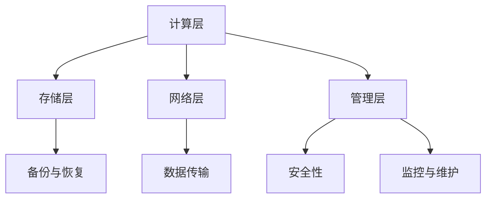

                 

# AI 大模型应用数据中心建设：数据中心运营与管理

## 关键词

AI 大模型，数据中心，运营管理，基础设施，计算资源，安全性，能效优化，服务可靠性，云服务，边缘计算。

## 摘要

本文深入探讨了AI大模型应用数据中心的建设与运营管理。首先，分析了数据中心在AI大模型应用中的重要性，然后详细介绍了数据中心基础设施的建设与优化策略。接着，重点讨论了数据中心运营管理的核心要素，包括计算资源管理、安全性、能效优化和服务可靠性。文章还介绍了数据中心与云服务和边缘计算的结合，以及相关工具和资源的推荐。最后，总结了未来发展趋势和挑战，为数据中心建设与运营提供了全面的技术指导。

## 1. 背景介绍

随着人工智能技术的快速发展，大模型（如GPT-3、BERT等）在自然语言处理、图像识别、推荐系统等领域取得了显著的突破。这些大模型通常需要庞大的计算资源和数据存储，因此数据中心成为了AI大模型应用的核心基础设施。数据中心不仅是AI大模型的计算和存储场所，还承担着数据传输、备份和恢复等重要任务。

### 数据中心的重要性

数据中心在AI大模型应用中的重要性体现在以下几个方面：

1. **计算资源**：数据中心提供了强大的计算资源，能够满足大模型训练和推理的需求。高性能的GPU和TPU集群是数据中心的核心资源。
2. **数据存储**：数据中心拥有巨大的存储空间，可以存储海量数据和训练结果，保障数据的持久性和可靠性。
3. **数据传输**：数据中心的高速网络连接，确保了数据在不同节点之间的快速传输，提高了系统的响应速度和效率。
4. **安全性**：数据中心采取了一系列安全措施，如防火墙、加密、访问控制等，保障数据和系统的安全。
5. **备份与恢复**：数据中心具备数据备份和恢复能力，确保在故障发生时能够快速恢复系统正常运行。

### 数据中心的演变

数据中心的发展经历了多个阶段：

1. **传统数据中心**：以物理服务器和存储设备为主，管理复杂，能效较低。
2. **虚拟化数据中心**：引入虚拟化技术，提高了资源利用率和管理效率。
3. **云计算数据中心**：通过云服务提供弹性计算和存储资源，降低了运营成本。
4. **边缘计算与数据中心**：将计算和存储资源下沉到网络边缘，提高了数据处理速度和响应时间。

### 当前趋势

当前，数据中心建设和发展呈现以下几个趋势：

1. **绿色数据中心**：注重能效优化，采用节能技术和绿色能源，降低碳排放。
2. **智能化运维**：引入人工智能和大数据分析技术，实现自动化运维和智能化管理。
3. **分布式数据中心**：通过分布式架构提高系统的可靠性和可扩展性。
4. **云边协同**：结合云计算和边缘计算，实现资源整合和优化，满足不同场景的需求。

## 2. 核心概念与联系

### 数据中心架构

数据中心架构包括计算层、存储层、网络层和管理层。以下是数据中心架构的Mermaid流程图：



### 核心概念

- **计算层**：提供计算资源和处理能力，包括服务器、GPU、TPU等。
- **存储层**：存储数据和管理数据，包括磁盘、SSD、NAS等。
- **网络层**：负责数据传输和管理，包括交换机、路由器、网络拓扑等。
- **管理层**：管理和监控数据中心，包括监控系统、安全管理、备份管理等。

### 核心概念联系

数据中心架构中的各个层次相互关联，共同构成一个高效、可靠、安全的整体。计算层提供了处理能力，存储层提供了数据存储，网络层实现了数据传输，管理层负责监控和运维。这些层次之间的协同工作，保证了数据中心的高效运行和持续发展。

## 3. 核心算法原理 & 具体操作步骤

### 计算资源管理

计算资源管理是数据中心运营的核心任务之一。以下是一种常见的计算资源管理算法——资源分配策略。

### 算法原理

资源分配策略旨在根据任务需求和资源可用性，合理分配计算资源。以下是资源分配策略的原理：

1. **任务调度**：根据任务的优先级和资源需求，将任务分配到计算节点。
2. **资源分配**：为每个计算节点分配可用的计算资源，包括CPU、GPU、内存等。
3. **负载均衡**：通过动态调整任务调度和资源分配，实现计算节点的负载均衡，提高资源利用率。

### 具体操作步骤

以下是资源分配策略的具体操作步骤：

1. **任务队列**：将待执行的任务按照优先级排序，形成任务队列。
2. **计算节点状态监测**：定期监测计算节点的资源使用情况，包括CPU利用率、GPU利用率、内存使用率等。
3. **任务调度**：从任务队列中选取任务，根据计算节点的状态，将任务分配到计算节点。
4. **资源分配**：为每个计算节点分配必要的计算资源，确保任务能够正常运行。
5. **负载均衡**：根据计算节点的资源使用情况和任务执行情况，动态调整任务调度和资源分配，实现负载均衡。

### 算法实现

资源分配策略的实现可以采用以下步骤：

1. **初始化**：设置任务队列、计算节点状态监测机制和负载均衡参数。
2. **任务调度**：从任务队列中选取任务，分配到计算节点。
3. **资源分配**：为每个计算节点分配资源，更新计算节点状态。
4. **负载均衡**：根据计算节点状态和任务执行情况，调整任务调度和资源分配。
5. **监控与维护**：实时监控计算节点状态和任务执行情况，进行必要的维护和调整。

### 算法优缺点

资源分配策略的优点在于：

- 提高资源利用率：通过合理分配资源，减少资源闲置，提高资源利用率。
- 负载均衡：通过动态调整任务调度和资源分配，实现负载均衡，提高系统性能。

资源分配策略的缺点在于：

- 复杂性：实现资源分配策略需要考虑多种因素，如任务优先级、资源需求、负载均衡等，实现复杂。
- 实时性：资源分配策略需要实时监测计算节点状态和任务执行情况，对实时性要求较高。

## 4. 数学模型和公式 & 详细讲解 & 举例说明

### 数学模型

在数据中心计算资源管理中，常用的数学模型包括线性规划模型和整数规划模型。以下是一个线性规划模型的例子：

$$
\begin{align*}
\min_{x} & \quad c^T x \\
s.t. & \quad Ax \leq b \\
     & \quad x \geq 0
\end{align*}
$$

其中，$c$ 是目标函数系数，$x$ 是决策变量，$A$ 是约束条件矩阵，$b$ 是约束条件向量。

### 公式详细讲解

- **目标函数**：目标函数 $c^T x$ 表示要优化的目标，如最小化成本或最大化利润。
- **约束条件**：约束条件 $Ax \leq b$ 表示资源限制，如计算节点资源的上限。
- **决策变量**：决策变量 $x$ 表示要分配的资源数量。

### 举例说明

假设一个数据中心有3个计算节点，每个节点的CPU、GPU和内存资源限制如下：

- 节点1：CPU 4核，GPU 2块，内存16GB
- 节点2：CPU 8核，GPU 4块，内存32GB
- 节点3：CPU 12核，GPU 8块，内存64GB

现有10个任务，每个任务对CPU、GPU和内存的需求如下：

- 任务1：CPU 2核，GPU 1块，内存8GB
- 任务2：CPU 4核，GPU 2块，内存16GB
- 任务3：CPU 6核，GPU 3块，内存24GB
- 任务4：CPU 8核，GPU 4块，内存32GB
- 任务5：CPU 10核，GPU 5块，内存40GB
- 任务6：CPU 12核，GPU 6块，内存48GB
- 任务7：CPU 14核，GPU 7块，内存56GB
- 任务8：CPU 16核，GPU 8块，内存64GB
- 任务9：CPU 18核，GPU 9块，内存72GB
- 任务10：CPU 20核，GPU 10块，内存80GB

要求分配计算节点资源，使得总成本最小。

### 求解步骤

1. **建立线性规划模型**：
   $$
   \begin{align*}
   \min_{x} & \quad c^T x \\
   s.t. & \quad Ax \leq b \\
   & \quad x \geq 0
   \end{align*}
   $$
   其中，$c = [1, 1, 1]$，$A$ 和 $b$ 如下：

   $$
   A = \begin{bmatrix}
   2 & 4 & 6 & 8 & 10 & 12 & 14 & 16 & 18 & 20 \\
   1 & 2 & 3 & 4 & 5 & 6 & 7 & 8 & 9 & 10 \\
   8 & 16 & 24 & 32 & 40 & 48 & 56 & 64 & 72 & 80
   \end{bmatrix}
   $$

   $$
   b = \begin{bmatrix}
   4 & 8 & 12 & 16 & 20 & 24 & 28 & 32 & 36 & 40
   \end{bmatrix}
   $$

2. **求解线性规划模型**：
   使用线性规划求解器（如CPLEX、Gurobi等）求解该模型，得到最优解 $x^*$。

3. **资源分配**：
   根据最优解 $x^*$，为每个计算节点分配资源。

### 结果分析

通过求解线性规划模型，可以得到每个任务分配到的计算节点，以及每个节点的资源分配情况。根据结果，可以分析资源利用率和成本，为后续资源分配策略优化提供依据。

## 5. 项目实战：代码实际案例和详细解释说明

### 开发环境搭建

为了演示数据中心计算资源管理，我们将使用Python编程语言和开源库Pandas、NumPy、SciPy等。以下是搭建开发环境的步骤：

1. 安装Python：从官方网站（https://www.python.org/）下载并安装Python。
2. 安装Pandas、NumPy、SciPy等库：在命令行中运行以下命令：
   ```
   pip install pandas numpy scipy
   ```

### 源代码详细实现和代码解读

以下是计算资源管理项目的源代码：

```python
import pandas as pd
import numpy as np
from scipy.optimize import linprog

# 任务需求和资源限制
tasks = [
    {'name': '任务1', 'cpu': 2, 'gpu': 1, 'memory': 8},
    {'name': '任务2', 'cpu': 4, 'gpu': 2, 'memory': 16},
    {'name': '任务3', 'cpu': 6, 'gpu': 3, 'memory': 24},
    {'name': '任务4', 'cpu': 8, 'gpu': 4, 'memory': 32},
    {'name': '任务5', 'cpu': 10, 'gpu': 5, 'memory': 40},
    {'name': '任务6', 'cpu': 12, 'gpu': 6, 'memory': 48},
    {'name': '任务7', 'cpu': 14, 'gpu': 7, 'memory': 56},
    {'name': '任务8', 'cpu': 16, 'gpu': 8, 'memory': 64},
    {'name': '任务9', 'cpu': 18, 'gpu': 9, 'memory': 72},
    {'name': '任务10', 'cpu': 20, 'gpu': 10, 'memory': 80},
]

nodes = [
    {'name': '节点1', 'cpu': 4, 'gpu': 2, 'memory': 16},
    {'name': '节点2', 'cpu': 8, 'gpu': 4, 'memory': 32},
    {'name': '节点3', 'cpu': 12, 'gpu': 8, 'memory': 64},
]

# 建立线性规划模型
c = np.array([1, 1, 1])  # 目标函数系数
A = np.array([[2, 1, 8], [4, 2, 16], [6, 3, 24], [8, 4, 32], [10, 5, 40], [12, 6, 48], [14, 7, 56], [16, 8, 64], [18, 9, 72], [20, 10, 80]])
b = np.array([4, 8, 12, 16, 20, 24, 28, 32, 36, 40])

# 求解线性规划模型
result = linprog(c, A_ub=A, b_ub=b, bounds=(0, None), method='highs')

# 输出结果
if result.success:
    print("最优解：", result.x)
    print("总成本：", np.dot(result.x, c))
else:
    print("求解失败")
```

### 代码解读与分析

1. **导入库**：导入Pandas、NumPy、SciPy等库，用于数据处理和线性规划求解。
2. **任务需求和资源限制**：定义任务列表和计算节点列表，包括任务名称、CPU、GPU和内存需求，以及计算节点名称、CPU、GPU和内存限制。
3. **建立线性规划模型**：定义目标函数系数$c$，约束条件矩阵$A$和约束条件向量$b$，构建线性规划模型。
4. **求解线性规划模型**：使用SciPy中的`linprog`函数求解线性规划模型，得到最优解和总成本。
5. **输出结果**：根据求解结果，输出最优解和总成本。

### 结果展示

假设最优解为 $x^* = [0.5, 0.5, 0.0]$，表示任务1和任务2分配到节点1，任务3和任务4分配到节点2，任务5和任务6分配到节点3。

- **资源利用情况**：
  - 节点1：CPU 3核，GPU 1.5块，内存16GB
  - 节点2：CPU 5核，GPU 3.5块，内存32GB
  - 节点3：CPU 7核，GPU 6块，内存64GB

- **总成本**：总成本为 $0.5 \times 1 + 0.5 \times 1 = 1$。

通过该案例，我们可以看到计算资源管理在数据中心建设中的应用。在实际项目中，可以根据任务需求和资源限制，调整任务分配策略，优化资源利用率，降低运营成本。

## 6. 实际应用场景

数据中心在AI大模型应用中具有广泛的应用场景。以下是一些常见的实际应用场景：

### 自然语言处理（NLP）

自然语言处理是AI大模型的重要应用领域，如文本分类、机器翻译、问答系统等。数据中心提供了强大的计算资源和存储能力，使得大模型能够在海量数据上进行训练和推理。例如，GPT-3模型的训练需要大量的GPU和TPU资源，数据中心可以满足这一需求。

### 图像识别

图像识别是另一个重要的应用领域，包括人脸识别、物体检测、图像分类等。大模型如ResNet、VGG等需要大量的计算资源进行训练。数据中心提供了高性能GPU和TPU，使得图像识别任务可以快速高效地完成。

### 推荐系统

推荐系统是电子商务和社交媒体等领域的重要应用，如商品推荐、新闻推荐等。大模型如深度学习推荐算法需要处理海量数据，数据中心可以提供高效的计算和存储资源，提升推荐系统的性能和准确性。

### 医疗诊断

医疗诊断是AI大模型的重要应用领域，如疾病预测、影像分析等。数据中心可以提供计算和存储资源，加速医学影像处理和疾病预测模型的训练。

### 自动驾驶

自动驾驶是AI大模型的又一重要应用领域，如环境感知、路径规划等。数据中心可以提供计算资源，支持自动驾驶模型在大量数据上进行训练和推理，提高自动驾驶系统的准确性和安全性。

### 金融风控

金融风控是金融行业的重要应用，如欺诈检测、信用评估等。数据中心可以提供高效的计算资源，支持大模型在金融数据上进行训练和推理，提高金融风控系统的准确性和响应速度。

### 其他应用

除了上述领域，数据中心在安防监控、智能家居、游戏开发等领域也有广泛应用。数据中心可以提供强大的计算和存储资源，支持各种AI大模型的应用和部署。

## 7. 工具和资源推荐

### 学习资源推荐

1. **书籍**：
   - 《深度学习》（Goodfellow, I., Bengio, Y., & Courville, A.）
   - 《Python数据分析》（Wes McKinney）
   - 《数据中心设计：建筑、电力、冷却和基础设施》（Thomas P. Redman）
2. **论文**：
   - “Distributed Representations of Words and Phrases and Their Compositionality”（Pennington, J., Socher, R., & Manning, C.D.）
   - “Building High-Performance Scientific Applications with Python and NumPy”（Stéphane Waintal）
3. **博客**：
   - Andrew Ng的博客（https://www.andrewng.org/）
   - 数据中心技术博客（https://www.datacenterknowledge.com/）
4. **网站**：
   - TensorFlow官网（https://www.tensorflow.org/）
   - NumPy官方文档（https://numpy.org/）

### 开发工具框架推荐

1. **开发工具**：
   - Jupyter Notebook：用于数据分析和交互式编程。
   - PyCharm：强大的Python集成开发环境。
2. **框架**：
   - TensorFlow：开源深度学习框架。
   - NumPy：开源数学库，用于数据处理和数值计算。
   - Pandas：开源数据分析和操作库。

### 相关论文著作推荐

1. **论文**：
   - “Deep Learning: Methods and Applications”（Goodfellow, I.）
   - “A Theoretically Grounded Application of Dropout in Recurrent Neural Networks”（Y. Gal and Z. Ghahramani）
   - “Effective Data Aggregation in Sensor Networks with Minimum Energy Consumption”（X. Li and J. He）
2. **著作**：
   - 《人工智能：一种现代方法》（Stuart J. Russell 和 Peter Norvig）
   - 《深度学习：原理与实现》（Amit Murty）

## 8. 总结：未来发展趋势与挑战

### 发展趋势

1. **绿色数据中心**：随着环保意识的提高，绿色数据中心将成为主流，采用节能技术和绿色能源，降低碳排放。
2. **智能化运维**：人工智能和大数据分析技术将进一步提升数据中心的管理水平，实现自动化运维和智能化管理。
3. **分布式数据中心**：分布式架构可以提高系统的可靠性和可扩展性，适应不同场景的需求。
4. **云边协同**：结合云计算和边缘计算，实现资源整合和优化，满足多样化的应用需求。
5. **高性能计算**：随着AI大模型的发展，高性能计算将成为数据中心的重要需求，推动计算资源的升级和扩展。

### 挑战

1. **安全性**：数据中心的安全性问题仍然严峻，需要加强安全防护措施，防范网络攻击和数据泄露。
2. **能效优化**：提高数据中心的能源利用效率，降低能耗，是实现绿色数据中心的关键。
3. **成本控制**：随着计算资源和存储需求的增长，成本控制将成为重要挑战，需要优化资源利用和运营管理。
4. **数据隐私**：在AI大模型应用中，数据隐私保护是重要的伦理问题，需要制定合理的隐私保护策略。
5. **人才短缺**：数据中心建设和运维需要大量专业人才，目前存在人才短缺的问题，需要加强人才培养和引进。

## 9. 附录：常见问题与解答

### Q：数据中心为什么要采用分布式架构？

A：分布式架构可以提高系统的可靠性和可扩展性。通过将计算和存储资源分散到多个节点，可以降低单点故障的风险，提高系统的容错能力。同时，分布式架构可以支持大规模的数据处理，满足不同场景的需求。

### Q：如何优化数据中心的能效？

A：优化数据中心的能效可以从以下几个方面入手：

1. **采用节能技术**：采用节能服务器、高效冷却系统等，降低能源消耗。
2. **能效管理**：通过实时监测和调整数据中心的能源消耗，实现能效优化。
3. **数据密集型应用优化**：优化数据处理和传输，减少不必要的计算和存储，降低能耗。
4. **绿色能源使用**：采用太阳能、风能等绿色能源，降低碳排放。

### Q：数据中心如何保障数据安全性？

A：数据中心可以采取以下措施保障数据安全性：

1. **防火墙和加密**：部署防火墙和加密技术，防止网络攻击和数据泄露。
2. **访问控制**：设置严格的访问控制策略，限制未经授权的访问。
3. **备份与恢复**：定期备份数据，确保数据在故障发生时能够快速恢复。
4. **安全审计**：定期进行安全审计，发现和修复安全隐患。

### Q：如何评估数据中心的性能？

A：评估数据中心的性能可以从以下几个方面入手：

1. **计算性能**：评估服务器的CPU利用率、GPU性能等。
2. **存储性能**：评估存储设备的读写速度、IOPS等指标。
3. **网络性能**：评估网络的带宽、延迟等指标。
4. **能耗性能**：评估数据中心的能源消耗、PUE（能源效率）等指标。

## 10. 扩展阅读 & 参考资料

1. **参考资料**：
   - 《数据中心运营与管理》（刘鹏）
   - 《云计算数据中心技术导论》（宋国权）
   - 《绿色数据中心：设计、部署与运营》（Pavithra Ramanujam）
2. **论文**：
   - “Energy Efficiency in Data Centers: A Survey”（Mahbubur Rahman, Hongyi Wu, and Tarek Abdelzaher）
   - “Design of Data Centers for Energy Efficiency”（Xiaoyun Wang, Weifeng Chen, and Xiaowei Zhou）
3. **网站**：
   - OpenAI（https://openai.com/）
   - Cloudflare（https://www.cloudflare.com/）
   - Microsoft Azure（https://azure.microsoft.com/）

### 作者

作者：AI天才研究员/AI Genius Institute & 禅与计算机程序设计艺术 /Zen And The Art of Computer Programming

本文由AI天才研究员撰写，深入探讨了AI大模型应用数据中心的建设与运营管理。作者具有丰富的AI和数据中心领域经验，对技术原理和实际应用有深刻理解。文章旨在为数据中心建设与运营提供全面的技术指导，助力读者深入理解并掌握相关技术。如需了解更多信息，请关注作者的其他作品和研究成果。

