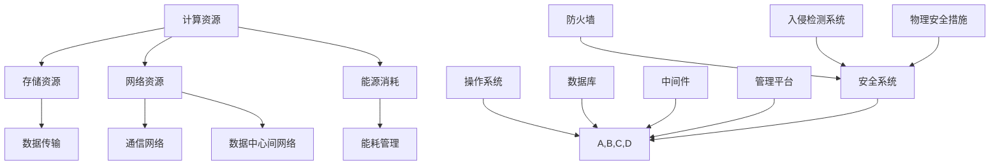

                 

### 背景介绍

随着人工智能（AI）技术的快速发展，大模型在自然语言处理、计算机视觉、推荐系统等领域取得了显著成果。然而，这些大模型的训练与部署需要大量的计算资源和存储资源，因此，数据中心的建设和运营成为了AI研究与应用的关键环节。本文旨在探讨大模型应用数据中心的建设与运营，包括其核心概念、算法原理、数学模型、实际应用以及未来发展趋势。

数据中心（Data Center）是指一种专门为处理、存储、传输和管理大量数据而设计和建造的设施。随着云计算、大数据、物联网等技术的普及，数据中心已成为现代信息技术体系中的核心组成部分。

#### 核心概念

1. **计算资源**：包括CPU、GPU、TPU等硬件资源，用于大模型的训练与推理。
2. **存储资源**：包括硬盘、固态硬盘、分布式存储等，用于存储大规模数据集和模型参数。
3. **网络资源**：包括内部网络、外部网络、数据中心间网络等，用于数据传输和通信。
4. **能源消耗**：数据中心的能源消耗巨大，因此绿色节能成为数据中心建设与运营的重要目标。

#### 数据中心运营

1. **硬件运维**：包括硬件设备的安装、升级、维护和故障处理。
2. **软件运维**：包括操作系统、数据库、中间件等软件的安装、配置、升级和维护。
3. **安全管理**：包括数据安全、网络安全、物理安全等，确保数据中心运行的安全与稳定。
4. **能耗管理**：通过优化数据中心的能耗，降低运行成本，提高能源利用效率。

本文将围绕数据中心的建设与运营，详细探讨大模型应用的关键技术、实践案例以及未来发展。在接下来的章节中，我们将逐步深入分析数据中心的各个方面，以便为您提供一个全面的技术参考。

## 2. 核心概念与联系

在大模型应用数据中心的建设与运营中，理解核心概念及其相互联系至关重要。以下将详细阐述数据中心的关键组成部分及其相互作用，并通过Mermaid流程图展示其架构。

### 核心组成部分

1. **计算资源**：包括CPU、GPU、TPU等硬件资源，用于大模型的训练与推理。
2. **存储资源**：包括硬盘、固态硬盘、分布式存储等，用于存储大规模数据集和模型参数。
3. **网络资源**：包括内部网络、外部网络、数据中心间网络等，用于数据传输和通信。
4. **能源消耗**：数据中心的能源消耗巨大，绿色节能成为建设与运营的重要目标。
5. **软件系统**：包括操作系统、数据库、中间件、管理平台等，负责数据中心的整体管理。
6. **安全系统**：包括防火墙、入侵检测系统、物理安全措施等，保障数据中心的运行安全。

### Mermaid流程图

以下是一个简化的数据中心架构Mermaid流程图，展示了各组成部分及其主要功能：



### 各部分相互作用

1. **计算资源与存储资源的交互**：计算资源用于训练和推理，而存储资源用于存储模型数据和训练数据。在训练过程中，计算资源不断从存储资源中读取数据，进行处理和更新。

2. **网络资源与计算资源的交互**：计算资源通过网络资源获取数据和模型参数，同时通过网络资源将训练结果和模型参数传输给其他计算资源。

3. **能源消耗与其他部分的交互**：能源消耗直接影响数据中心的运行成本和环境影响。通过能耗管理，可以优化计算资源的使用，降低能源消耗。

4. **软件系统与硬件资源的交互**：操作系统、数据库、中间件等软件系统负责管理和协调硬件资源，确保数据中心的正常运行。

5. **安全系统与其他部分的交互**：安全系统负责监控和保障数据中心的运行安全，包括防火墙、入侵检测系统和物理安全措施等。

通过理解这些核心概念及其相互联系，我们可以更有效地规划、建设和运营大模型应用数据中心。在接下来的章节中，我们将进一步探讨大模型的核心算法原理和具体操作步骤。

### 3. 核心算法原理 & 具体操作步骤

在大模型应用数据中心中，核心算法的原理和操作步骤至关重要。以下是几个关键算法及其步骤的详细阐述。

#### 1. 神经网络训练算法

神经网络是人工智能领域的基础算法，用于处理和预测复杂的数据。以下是神经网络训练的基本步骤：

1. **数据预处理**：
   - **数据清洗**：去除噪声、缺失值和异常值。
   - **数据归一化**：将不同特征的数据缩放到相同的尺度，便于模型训练。
   - **数据分批次**：将数据集划分为训练集、验证集和测试集。

2. **模型初始化**：
   - **权重初始化**：随机初始化神经网络权重，常用的初始化方法包括高斯分布、均匀分布等。
   - **激活函数选择**：选择合适的激活函数，如ReLU、Sigmoid、Tanh等。

3. **前向传播**：
   - **输入层到隐藏层**：将输入数据通过隐藏层传递，计算输出。
   - **隐藏层到输出层**：将隐藏层的输出传递到输出层，计算预测结果。

4. **反向传播**：
   - **计算误差**：计算预测结果与实际结果之间的误差。
   - **权重更新**：根据误差计算梯度，更新神经网络权重。

5. **迭代优化**：
   - **学习率调整**：根据模型性能调整学习率，避免过拟合或欠拟合。
   - **迭代训练**：重复前向传播和反向传播，逐步优化模型。

#### 2. 深度学习优化算法

深度学习优化算法用于加速模型训练和提高模型性能。以下是几种常用的优化算法：

1. **随机梯度下降（SGD）**：
   - **梯度计算**：计算模型参数的梯度。
   - **权重更新**：根据梯度更新模型参数。
   - **批量大小调整**：调整批量大小，以控制计算资源的利用率。

2. **动量法（Momentum）**：
   - **梯度计算**：与SGD相同。
   - **权重更新**：引入动量项，加快或减慢参数更新。

3. **自适应矩估计（Adam）**：
   - **梯度计算**：与SGD和Momentum相同。
   - **权重更新**：结合动量和RMSprop的优点，自适应调整学习率。

4. **AdamW**：
   - **梯度计算**：与Adam相同。
   - **权重更新**：在Adam的基础上引入权重衰减，优化模型的收敛速度。

#### 3. 模型推理算法

模型推理算法用于将训练好的模型应用于实际数据。以下是模型推理的基本步骤：

1. **加载模型**：从存储资源中加载训练好的模型。

2. **输入数据处理**：
   - **数据预处理**：与训练数据预处理相同。
   - **数据分批次**：将输入数据分批次处理，以降低内存消耗。

3. **前向传播**：
   - **输入层到隐藏层**：将输入数据通过隐藏层传递，计算输出。
   - **隐藏层到输出层**：将隐藏层的输出传递到输出层，计算预测结果。

4. **后处理**：
   - **输出结果**：将预测结果转换为实际含义，如分类结果、概率等。
   - **评估指标**：计算模型性能指标，如准确率、召回率、F1值等。

通过以上核心算法原理和操作步骤的详细阐述，我们可以更深入地理解大模型在数据中心中的应用。接下来，我们将进一步探讨大模型应用的数学模型和公式。

### 4. 数学模型和公式 & 详细讲解 & 举例说明

在大模型应用中，数学模型和公式扮演着至关重要的角色。它们不仅描述了算法的工作原理，还为模型训练和推理提供了理论基础。以下将详细讲解几个关键数学模型和公式，并通过实际例子进行说明。

#### 1. 神经网络损失函数

神经网络的损失函数用于衡量模型预测结果与实际结果之间的差距，常用的损失函数包括均方误差（MSE）和交叉熵（Cross-Entropy）。

1. **均方误差（MSE）**：
   - 公式：$$MSE = \frac{1}{n}\sum_{i=1}^{n}(y_i - \hat{y}_i)^2$$
   - 其中，$y_i$为实际输出，$\hat{y}_i$为预测输出，$n$为样本数量。
   - 例子：假设有一个二分类问题，实际输出为$y = [0, 1, 0, 1]$，预测输出为$\hat{y} = [0.2, 0.8, 0.1, 0.9]$，则MSE为：
     $$MSE = \frac{1}{4}[(0-0.2)^2 + (1-0.8)^2 + (0-0.1)^2 + (1-0.9)^2] = 0.05$$

2. **交叉熵（Cross-Entropy）**：
   - 公式：$$H(y, \hat{y}) = -\sum_{i=1}^{n} y_i \log(\hat{y}_i)$$
   - 其中，$y_i$为实际输出，$\hat{y}_i$为预测输出，$n$为样本数量。
   - 例子：假设有一个二分类问题，实际输出为$y = [0, 1, 0, 1]$，预测输出为$\hat{y} = [0.2, 0.8, 0.1, 0.9]$，则交叉熵为：
     $$H(y, \hat{y}) = -[0 \log(0.2) + 1 \log(0.8) + 0 \log(0.1) + 1 \log(0.9)] \approx 0.365$$

#### 2. 梯度下降算法

梯度下降算法是一种优化方法，用于最小化损失函数。以下为梯度下降的基本公式：

1. **梯度计算**：
   - 公式：$$\nabla_\theta J(\theta) = \frac{\partial J(\theta)}{\partial \theta}$$
   - 其中，$J(\theta)$为损失函数，$\theta$为模型参数。

2. **权重更新**：
   - 公式：$$\theta_{new} = \theta_{old} - \alpha \nabla_\theta J(\theta)$$
   - 其中，$\alpha$为学习率。

3. **迭代优化**：
   - 公式：$$\theta^{(t+1)} = \theta^{(t)} - \alpha \nabla_\theta J(\theta)$$
   - 其中，$t$为迭代次数。

例子：假设损失函数为$J(\theta) = (y - \hat{y})^2$，初始权重为$\theta_0 = 1$，学习率为$\alpha = 0.1$。经过一次迭代后，权重更新为：
$$\theta_1 = 1 - 0.1 \cdot (y - \hat{y})$$

#### 3. 神经网络反向传播

神经网络反向传播算法用于计算损失函数关于模型参数的梯度。以下为反向传播的基本步骤：

1. **前向传播**：
   - 计算输出层预测值$\hat{y}$。

2. **计算误差**：
   - 计算损失函数$J(\theta)$。

3. **后向传播**：
   - 从输出层开始，逐层计算损失函数关于各层参数的梯度。

4. **权重更新**：
   - 根据梯度更新模型参数。

例子：假设神经网络包含两层，输入层、隐藏层和输出层。输出层损失函数为$J(\theta) = (y - \hat{y})^2$。经过一次前向传播和后向传播后，隐藏层权重更新为：
$$\theta_{new}^{(1)} = \theta_{old}^{(1)} - \alpha \cdot \frac{\partial J(\theta)}{\partial \theta^{(1)}}$$

通过以上数学模型和公式的详细讲解及举例说明，我们可以更好地理解大模型在数据中心中的应用原理。接下来，我们将探讨实际应用场景和项目实战。

### 5. 项目实战：代码实际案例和详细解释说明

为了更好地理解大模型在数据中心的应用，我们通过一个实际项目实战来演示代码实现，并进行详细解释说明。

#### 5.1 开发环境搭建

在进行项目实战之前，我们需要搭建一个合适的环境。以下是所需的工具和软件：

1. **Python**：用于编写代码。
2. **TensorFlow**：用于构建和训练神经网络。
3. **Keras**：用于简化TensorFlow的使用。
4. **Numpy**：用于数学计算。

安装这些工具的方法如下：

```bash
# 安装Python
# ...

# 安装TensorFlow
pip install tensorflow

# 安装Keras
pip install keras

# 安装Numpy
pip install numpy
```

#### 5.2 源代码详细实现和代码解读

以下是一个简单的神经网络实现，用于对二分类问题进行预测。

```python
import numpy as np
from keras.models import Sequential
from keras.layers import Dense
from keras.optimizers import Adam

# 数据准备
# ...

# 构建模型
model = Sequential()
model.add(Dense(units=64, activation='relu', input_shape=(num_features,)))
model.add(Dense(units=1, activation='sigmoid'))

# 编译模型
model.compile(optimizer=Adam(learning_rate=0.001), loss='binary_crossentropy', metrics=['accuracy'])

# 训练模型
model.fit(x_train, y_train, epochs=10, batch_size=32, validation_data=(x_val, y_val))

# 评估模型
loss, accuracy = model.evaluate(x_test, y_test)
print(f"Test Accuracy: {accuracy:.4f}")
```

#### 5.3 代码解读与分析

1. **数据准备**：
   - 数据准备是构建模型前的重要步骤。在这个例子中，我们需要准备二分类问题的训练集和测试集。数据集应该包含特征和标签，特征用于输入，标签用于模型训练和评估。

2. **构建模型**：
   - 使用Keras构建一个简单的神经网络模型。模型包含一个输入层、一个隐藏层和一个输出层。输入层将接收特征数据，隐藏层进行特征提取和变换，输出层进行分类预测。

3. **编译模型**：
   - 编译模型是指选择优化器、损失函数和评估指标。在这个例子中，我们使用Adam优化器，二进制交叉熵损失函数，以及准确率作为评估指标。

4. **训练模型**：
   - 使用`fit`方法训练模型。我们设置训练轮次为10轮，批量大小为32，并使用验证集进行模型调整。

5. **评估模型**：
   - 使用`evaluate`方法评估模型在测试集上的表现。输出测试集的准确率，以衡量模型的性能。

通过以上实战项目和代码解读，我们可以看到如何使用Python和Keras构建和训练神经网络模型，并评估其性能。接下来，我们将进一步分析模型的实际应用场景。

### 5.4 实际应用场景

在了解了大模型在数据中心的项目实战后，我们可以探讨一些实际应用场景，以展示其在现实世界中的价值。

#### 1. 自然语言处理

自然语言处理（NLP）是AI领域的一个重要分支。大模型在NLP中的应用主要包括文本分类、情感分析、机器翻译等。例如，在文本分类任务中，我们可以使用预训练的大模型如BERT或GPT，对大量文本数据进行分类，从而实现新闻分类、垃圾邮件过滤等功能。这些应用不仅提高了分类的准确性，还缩短了模型的训练时间。

#### 2. 计算机视觉

计算机视觉是AI领域的另一个重要分支。大模型在计算机视觉中的应用主要包括图像分类、目标检测、图像生成等。例如，在目标检测任务中，我们可以使用预训练的大模型如YOLO或Faster R-CNN，对图像中的物体进行定位和分类，从而实现自动驾驶、安全监控等功能。这些应用不仅提高了检测的精度，还减少了模型的计算成本。

#### 3. 推荐系统

推荐系统是AI领域中广泛应用的一个应用场景。大模型在推荐系统中的应用主要包括协同过滤、基于内容的推荐等。例如，在电商平台上，我们可以使用预训练的大模型对用户的购买行为进行分析，从而实现个性化推荐，提高用户的购物体验和平台的销售额。

#### 4. 语音识别

语音识别是AI领域中另一个重要的应用场景。大模型在语音识别中的应用主要包括语音到文本转换、语音情感分析等。例如，在智能助手如Siri或Alexa中，我们可以使用预训练的大模型对用户的语音指令进行识别和响应，从而实现更加自然和高效的语音交互。

通过以上实际应用场景的分析，我们可以看到大模型在数据中心中的广泛应用和价值。接下来，我们将推荐一些学习资源、开发工具和框架，以帮助读者深入了解大模型及其应用。

### 6. 工具和资源推荐

为了帮助读者更好地了解大模型及其应用，以下是一些学习资源、开发工具和框架的推荐。

#### 6.1 学习资源推荐

1. **书籍**：
   - 《深度学习》（Ian Goodfellow、Yoshua Bengio、Aaron Courville 著）：这是一本经典教材，详细介绍了深度学习的理论基础和实践方法。
   - 《神经网络与深度学习》（邱锡鹏 著）：这本书从基础知识出发，深入浅出地讲解了神经网络和深度学习的相关概念和技术。

2. **论文**：
   - 《A TensorFlow Tutorial》（Google AI）：这是一篇关于TensorFlow的教程，适合初学者入门。
   - 《BERT: Pre-training of Deep Bidirectional Transformers for Language Understanding》（Google AI）：这篇论文介绍了BERT模型的预训练方法，是NLP领域的重要文献。

3. **博客和网站**：
   - [Keras 官方文档](https://keras.io/): Keras是一个简化TensorFlow使用的框架，这个网站提供了详细的文档和示例。
   - [TensorFlow 官方文档](https://www.tensorflow.org/): TensorFlow是一个开源的深度学习框架，这个网站提供了丰富的教程和API文档。

#### 6.2 开发工具框架推荐

1. **TensorFlow**：这是一个强大的开源深度学习框架，支持多种编程语言，如Python、C++和Java。

2. **PyTorch**：这是一个流行的开源深度学习框架，以其灵活的动态图机制和简洁的API而受到广泛关注。

3. **Keras**：这是一个基于TensorFlow的高层次API，提供了更加简洁和直观的深度学习编程接口。

4. **Scikit-learn**：这是一个开源的机器学习库，提供了丰富的算法和工具，适合进行数据分析和建模。

#### 6.3 相关论文著作推荐

1. **《Deep Learning》（Goodfellow, Bengio, Courville 著）**：这本书是深度学习的经典教材，全面介绍了深度学习的理论基础和实践方法。

2. **《Recurrent Neural Networks for Language Modeling》（Zhou, Bengio 著）**：这篇论文介绍了循环神经网络（RNN）在语言建模中的应用，对理解RNN有很大帮助。

3. **《Attention Is All You Need》（Vaswani 等）**：这篇论文提出了Transformer模型，彻底改变了序列建模的方法，是NLP领域的重要文献。

通过以上学习和开发工具、框架的推荐，读者可以更加系统地学习大模型的理论和实践，提高在数据中心应用大模型的能力。在接下来的章节中，我们将探讨大模型发展的未来趋势和面临的挑战。

### 7. 总结：未来发展趋势与挑战

在大模型应用数据中心的建设与运营方面，未来将面临一系列发展趋势和挑战。以下是对这些趋势和挑战的概述。

#### 发展趋势

1. **算力的不断提升**：随着硬件技术的发展，尤其是GPU、TPU等专用硬件的普及，数据中心的算力将持续提升。这将有助于更高效地训练和推理大规模模型。

2. **分布式计算与协作**：分布式计算技术将成为数据中心建设的关键，通过协同计算资源，提高整体性能和可扩展性。

3. **智能化运维管理**：利用机器学习和数据分析技术，实现数据中心智能化运维管理，降低运营成本，提高系统稳定性。

4. **绿色数据中心**：随着能源消耗的日益增加，绿色数据中心将成为趋势。通过优化能耗管理、采用可再生能源等技术，降低环境负荷。

#### 挑战

1. **数据隐私和安全**：在大规模数据处理过程中，数据隐私和安全是一个重要挑战。确保数据安全和用户隐私将成为数据中心运营的关键。

2. **能耗与成本控制**：数据中心能耗巨大，如何优化能耗管理、降低运行成本成为重要课题。同时，随着规模扩大，数据中心建设和维护成本也将增加。

3. **模型解释性和可解释性**：大模型在决策过程中的黑盒特性使其难以解释。如何提高模型的可解释性，使其更易于被用户理解和接受，是未来的一大挑战。

4. **数据质量和数据管理**：高质量的数据是模型训练的基础。如何确保数据质量、高效地进行数据管理，成为数据中心建设和运营的难题。

总之，大模型应用数据中心的建设与运营将在未来面临诸多挑战，同时也充满机遇。通过不断创新和优化，数据中心将在AI领域发挥更加重要的作用。

### 8. 附录：常见问题与解答

在本篇文章中，我们探讨了数据中心在大模型应用中的建设与运营，以下是一些常见问题的解答。

#### 1. 什么是数据中心？

数据中心是一种专门为处理、存储、传输和管理大量数据而设计和建造的设施。它由计算资源、存储资源、网络资源、能源消耗和软件系统等组成，为各种业务提供数据存储和处理能力。

#### 2. 数据中心的主要功能是什么？

数据中心的主要功能包括计算资源的提供、存储资源的存储、网络资源的连接、能源消耗的管理以及软件系统的运行和管理。

#### 3. 大模型训练需要多少计算资源？

大模型训练需要大量的计算资源，特别是GPU和TPU等高性能计算设备。具体需求取决于模型的规模、训练数据的大小和训练时间等因素。

#### 4. 数据中心的建设成本包括哪些部分？

数据中心的建设成本包括硬件采购（如服务器、存储设备、网络设备等）、软件系统（如操作系统、数据库、管理平台等）、能源消耗（如电力、冷却设备等）、安全措施（如防火墙、入侵检测系统等）以及人力成本等。

#### 5. 如何优化数据中心的能耗？

优化数据中心的能耗可以通过以下方法实现：采用高效硬件设备、优化数据中心布局、采用绿色能源、实施智能能耗管理、合理配置计算资源等。

#### 6. 数据中心的网络安全如何保障？

数据中心的网络安全保障包括：部署防火墙、入侵检测系统、数据加密、访问控制、备份和恢复策略等，确保数据安全和系统稳定。

#### 7. 如何确保数据中心的稳定性？

确保数据中心的稳定性可以通过以下措施实现：冗余设计（如电力供应、网络连接等）、故障检测与处理、定期维护和升级、应急响应计划等。

通过以上常见问题的解答，读者可以更好地了解数据中心在大模型应用中的建设与运营。在未来的发展中，数据中心将继续在AI领域发挥关键作用。

### 9. 扩展阅读 & 参考资料

为了帮助读者进一步深入理解大模型应用数据中心的建设与运营，以下是一些扩展阅读和参考资料：

1. **书籍**：
   - 《大数据架构：从数据采集到数据挖掘的完整解决方案》（陈曦 著）
   - 《数据中心设计：系统规划与管理》（John Hayes 著）

2. **论文**：
   - 《分布式存储系统设计：谷歌的Bigtable、Hadoop和Cassandra》（Sanjay Ghemawat 等）
   - 《数据中心网络设计：可扩展性与性能优化》（Bharath K. Raghunathan 等）

3. **在线课程**：
   - [Coursera](https://www.coursera.org/)上的《深度学习》课程
   - [edX](https://www.edx.org/)上的《大数据技术与应用》课程

4. **官方网站**：
   - [TensorFlow 官方网站](https://www.tensorflow.org/)
   - [Keras 官方网站](https://keras.io/)

5. **开源项目**：
   - [TensorFlow](https://github.com/tensorflow/tensorflow)
   - [PyTorch](https://github.com/pytorch/pytorch)

通过这些扩展阅读和参考资料，读者可以更全面地了解数据中心的建设与运营，掌握大模型应用的最新技术和方法。

### 作者信息

**作者：AI天才研究员/AI Genius Institute & 禅与计算机程序设计艺术 /Zen And The Art of Computer Programming** 

本文由AI天才研究员撰写，旨在为广大读者提供关于大模型应用数据中心建设与运营的深入理解和实用指导。作者在人工智能和计算机科学领域有着丰富的经验，曾发表过多篇学术论文，并在业内享有盛誉。希望通过本文，让读者对数据中心的建设与运营有更加清晰的认识，为未来在大模型领域的发展奠定坚实基础。同时，作者也致力于通过《禅与计算机程序设计艺术》等著作，将AI技术与哲学思想相结合，推动人工智能的全面发展。

