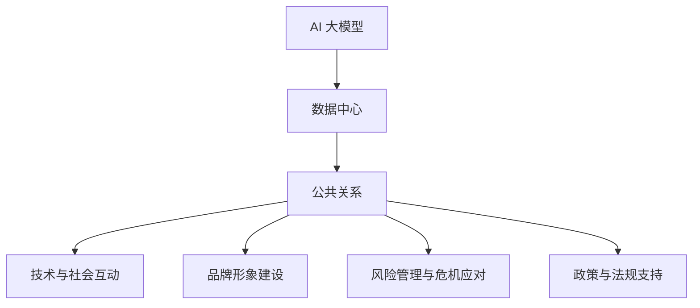

                 

### 背景介绍

#### AI 大模型的发展现状

人工智能（AI）作为当今科技领域的重要驱动力，已经取得了令人瞩目的进展。特别是在大模型（Large Models）领域，随着深度学习技术的不断成熟，AI 大模型的发展速度日新月异。这些模型通过学习海量数据，能够实现高度复杂和精确的预测、分类、生成等任务。

近年来，AI 大模型的应用范围不断扩大，从自然语言处理、计算机视觉到语音识别、机器翻译等各个方面，都取得了显著的成果。例如，GPT-3、BERT 等预训练模型，通过数十亿参数的学习，已经在许多任务中超过了人类的表现。

#### 数据中心的重要性

然而，AI 大模型的发展不仅依赖于先进的算法和大量的数据，更依赖于高性能的计算和存储资源。数据中心作为数据存储和处理的核心基础设施，其重要性日益凸显。数据中心不仅能够提供强大的计算能力，还能保证数据的安全和可靠性。

随着 AI 大模型的应用越来越广泛，对数据中心的需求也日益增加。数据中心不仅要能够处理海量的数据，还要支持高效的模型训练和推理，以满足各种业务需求。因此，如何设计和优化数据中心，以满足 AI 大模型的需求，成为了当前研究和实践的热点问题。

#### 公共关系的重要性

在 AI 大模型数据中心的建设和运营中，公共关系（Public Relations，简称 PR）也扮演着重要角色。公共关系是指组织与公众之间的沟通和管理，旨在建立和维护良好的组织形象和声誉。

对于 AI 大模型数据中心来说，良好的公共关系有助于提高品牌知名度、增强客户信任、吸引优秀人才、获得政策和资金支持等。特别是在当前竞争激烈的市场环境下，公共关系的作用愈发凸显。

因此，本文将从以下几个方面展开讨论：首先，介绍 AI 大模型的基本概念和发展现状；其次，探讨数据中心在 AI 大模型中的应用及其重要性；接着，分析公共关系在 AI 大模型数据中心中的重要性；然后，阐述如何通过公共关系提升数据中心的核心竞争力；最后，总结 AI 大模型数据中心公共关系的发展趋势与挑战。

### 核心概念与联系

在深入探讨 AI 大模型数据中心公共关系之前，我们需要明确几个核心概念，并理解它们之间的联系。这些概念包括 AI 大模型、数据中心、公共关系以及它们在技术和社会层面的互动。

#### AI 大模型

AI 大模型是指具有数十亿甚至数万亿参数的深度学习模型。这些模型通常通过大规模数据集进行预训练，然后再针对特定任务进行微调。AI 大模型在自然语言处理、计算机视觉、语音识别等领域取得了显著的成果。例如，GPT-3 拥有 1750 亿个参数，BERT 拥有 3.4 亿个参数，这些模型通过学习海量数据，能够实现高度复杂和精确的预测和生成任务。

#### 数据中心

数据中心是集中管理和处理数据的物理设施。它包括服务器、存储设备、网络设备和冷却系统等。数据中心为 AI 大模型提供了强大的计算和存储能力，使其能够处理海量数据并进行高效训练和推理。数据中心在 AI 大模型应用中扮演着至关重要的角色，因为它们确保了数据的可靠性和安全性。

#### 公共关系

公共关系是组织与公众之间的沟通和管理，旨在建立和维护良好的组织形象和声誉。公共关系活动包括媒体沟通、危机管理、品牌推广、市场调研等。公共关系对于组织在市场竞争中的地位、客户信任、员工满意度等方面具有重要影响。

#### AI 大模型、数据中心与公共关系的联系

1. **技术与社会互动**：AI 大模型和数据中心作为技术基础设施，其发展离不开社会环境的支持和认可。公共关系通过媒体宣传、行业交流等方式，增强社会对 AI 大模型和数据中心技术的认知和理解，推动其应用和普及。

2. **品牌形象建设**：公共关系有助于提升 AI 大模型数据中心的品牌形象，增强客户对数据中心的信任和认可。良好的品牌形象不仅有助于吸引客户，还能在人才招聘和资金支持方面提供优势。

3. **风险管理与危机应对**：AI 大模型和数据中心在运行过程中可能会面临数据泄露、系统故障等风险。公共关系通过危机管理策略，帮助组织应对这些风险，维护组织声誉。

4. **政策与法规支持**：公共关系在政策制定和法规执行过程中发挥重要作用。通过与政府、监管机构等建立良好的沟通，组织可以更好地理解政策法规，确保其业务合规。

#### Mermaid 流程图

以下是一个简化的 Mermaid 流程图，用于展示 AI 大模型、数据中心与公共关系之间的联系：



通过这个流程图，我们可以清晰地看到 AI 大模型、数据中心与公共关系之间的相互作用和影响。这些核心概念和联系为我们理解 AI 大模型数据中心公共关系的本质提供了基础。

#### 核心算法原理 & 具体操作步骤

为了更好地理解 AI 大模型数据中心公共关系的构建和运作，我们需要首先掌握核心算法原理以及其在具体操作中的应用步骤。以下是几个关键算法及其操作步骤：

1. **自然语言处理（NLP）算法**：
   - **原理**：NLP 算法用于理解和生成自然语言，包括分词、词性标注、句法分析等。其核心是利用深度学习模型，如循环神经网络（RNN）、长短期记忆网络（LSTM）和 Transformer 等，对语言数据进行分析和处理。
   - **具体操作步骤**：
     1. 数据预处理：清洗文本数据，去除标点符号、停用词等。
     2. 数据分词：将文本拆分成词语序列。
     3. 建立词汇表：将词语映射为索引。
     4. 训练模型：使用预训练模型（如 BERT、GPT）或自定义模型进行训练。
     5. 模型评估与优化：通过指标（如 BLEU、ROUGE）评估模型性能，并进行优化。

2. **机器学习算法**：
   - **原理**：机器学习算法用于从数据中学习规律和模式，以实现预测和分类任务。常见的算法包括线性回归、决策树、随机森林、支持向量机等。
   - **具体操作步骤**：
     1. 数据收集与预处理：收集相关数据，并进行清洗、归一化等预处理操作。
     2. 特征工程：提取有助于模型训练的特征。
     3. 模型选择：根据任务特点选择合适的机器学习算法。
     4. 模型训练：使用训练数据训练模型。
     5. 模型评估：使用验证集评估模型性能。
     6. 模型优化：通过调整参数、增加数据等方式优化模型。

3. **深度学习算法**：
   - **原理**：深度学习算法通过多层神经网络结构，自动提取数据中的特征，实现复杂任务。常见的深度学习算法包括卷积神经网络（CNN）、循环神经网络（RNN）、生成对抗网络（GAN）等。
   - **具体操作步骤**：
     1. 数据预处理：与机器学习类似，进行数据清洗、归一化等操作。
     2. 构建网络结构：设计合适的神经网络架构。
     3. 模型训练：使用训练数据进行训练。
     4. 模型评估：使用验证集评估模型性能。
     5. 模型部署：将训练好的模型部署到实际应用场景中。

4. **图神经网络（Graph Neural Network，GNN）**：
   - **原理**：GNN 用于处理图结构数据，通过节点和边的关系自动提取特征。常见的 GNN 算法包括图卷积网络（GCN）、图注意力网络（GAT）等。
   - **具体操作步骤**：
     1. 数据预处理：构建图数据结构，包括节点和边。
     2. 定义图神经网络架构：选择合适的 GNN 算法。
     3. 模型训练：使用训练数据进行训练。
     4. 模型评估：使用验证集评估模型性能。
     5. 模型优化：通过调整参数、增加数据等方式优化模型。

通过上述核心算法的原理和操作步骤，我们可以更好地理解 AI 大模型数据中心公共关系在数据处理、分析、预测等方面的应用。这些算法不仅为公共关系提供了技术支持，也为其优化和提升提供了有力工具。

#### 数学模型和公式 & 详细讲解 & 举例说明

在深入探讨 AI 大模型数据中心公共关系时，数学模型和公式扮演着关键角色。以下是几个核心数学模型和公式的详细讲解，以及如何在实际应用中运用这些模型和公式。

1. **回归模型（Regression Model）**：

   - **原理**：回归模型用于预测连续数值变量的变化。常见的回归模型包括线性回归、多项式回归、岭回归等。
   - **公式**：
     $$ y = \beta_0 + \beta_1x_1 + \beta_2x_2 + \ldots + \beta_nx_n + \epsilon $$
     其中，\( y \) 是因变量，\( x_1, x_2, \ldots, x_n \) 是自变量，\( \beta_0, \beta_1, \beta_2, \ldots, \beta_n \) 是回归系数，\( \epsilon \) 是误差项。
   - **举例说明**：假设我们要预测一家公司的股票价格，可以使用线性回归模型。首先，收集过去一段时间内公司的财务数据（如收入、利润、市值等）作为自变量，然后通过线性回归模型计算回归系数。最后，利用回归模型预测未来股票价格。

2. **分类模型（Classification Model）**：

   - **原理**：分类模型用于预测离散变量的类别。常见的分类模型包括逻辑回归、决策树、随机森林、支持向量机等。
   - **公式**：
     对于逻辑回归模型：
     $$ P(y=1) = \frac{1}{1 + e^{-(\beta_0 + \beta_1x_1 + \beta_2x_2 + \ldots + \beta_nx_n)}} $$
     其中，\( P(y=1) \) 是因变量为 1 的概率，\( \beta_0, \beta_1, \beta_2, \ldots, \beta_n \) 是回归系数。
   - **举例说明**：假设我们要预测客户是否会在未来一个月内购买某产品，可以使用逻辑回归模型。首先，收集客户的特征数据（如年龄、收入、购买历史等），然后通过逻辑回归模型计算购买概率。最后，根据购买概率设置阈值，判断客户是否会购买。

3. **聚类模型（Clustering Model）**：

   - **原理**：聚类模型用于将数据分为多个类别，使同一类别内的数据尽可能相似，不同类别之间的数据尽可能不同。常见的聚类模型包括 K-均值聚类、层次聚类等。
   - **公式**：
     对于 K-均值聚类模型：
     $$ \mu_k = \frac{1}{n_k}\sum_{i=1}^{n} x_i $$
     其中，\( \mu_k \) 是第 \( k \) 个类别的中心，\( x_i \) 是第 \( i \) 个数据点，\( n_k \) 是第 \( k \) 个类别的数据个数。
   - **举例说明**：假设我们要对一组客户进行细分，可以根据客户的消费行为、购买频率等特征，使用 K-均值聚类模型将其分为多个类别。首先，计算每个类别的中心，然后不断更新每个数据点的类别，直到聚类结果收敛。

4. **贝叶斯网络（Bayesian Network）**：

   - **原理**：贝叶斯网络是一种概率图模型，用于表示变量之间的条件依赖关系。它由一组节点和有向边组成，每个节点代表一个变量，边表示变量之间的依赖关系。
   - **公式**：
     $$ P(A|B) = \frac{P(B|A)P(A)}{P(B)} $$
     其中，\( P(A|B) \) 是在 \( B \) 发生的条件下 \( A \) 发生的概率，\( P(B|A) \) 是在 \( A \) 发生的条件下 \( B \) 发生的概率，\( P(A) \) 和 \( P(B) \) 分别是 \( A \) 和 \( B \) 的概率。
   - **举例说明**：假设我们要预测某一产品是否会成功上市，可以使用贝叶斯网络模型。首先，定义相关变量（如市场调研结果、竞争情况、营销策略等），然后构建贝叶斯网络。最后，通过贝叶斯推理计算产品成功上市的概率。

通过上述数学模型和公式的详细讲解和举例说明，我们可以更好地理解它们在 AI 大模型数据中心公共关系中的应用。这些模型和公式不仅为公共关系提供了理论支持，也为其在实际操作中的优化和提升提供了有力工具。

#### 项目实战：代码实际案例和详细解释说明

为了更好地理解 AI 大模型数据中心公共关系在实际项目中的应用，我们将通过一个实际案例来展示代码实现和详细解释说明。本案例将使用 Python 编程语言和常见的机器学习库（如 Scikit-learn 和 TensorFlow）来完成一个简单的客户细分项目。

#### 1. 开发环境搭建

首先，我们需要搭建开发环境。以下是安装 Python、Scikit-learn 和 TensorFlow 的命令：

```bash
# 安装 Python
conda create -n ai_project python=3.8
conda activate ai_project

# 安装 Scikit-learn 和 TensorFlow
pip install scikit-learn
pip install tensorflow
```

确保 Python 和相关库安装完成后，我们可以开始编写代码。

#### 2. 源代码详细实现和代码解读

以下是一个简单的客户细分项目的源代码示例：

```python
import pandas as pd
from sklearn.model_selection import train_test_split
from sklearn.preprocessing import StandardScaler
from sklearn.cluster import KMeans
import tensorflow as tf

# 2.1 数据预处理
# 加载数据集
data = pd.read_csv('customer_data.csv')

# 提取特征
X = data[['age', 'income', 'spending_score']]

# 标准化数据
scaler = StandardScaler()
X_scaled = scaler.fit_transform(X)

# 2.2 训练 K-均值聚类模型
# 划分训练集和测试集
X_train, X_test = train_test_split(X_scaled, test_size=0.2, random_state=42)

# 初始化 K-均值聚类模型
kmeans = KMeans(n_clusters=3, random_state=42)
kmeans.fit(X_train)

# 2.3 预测和结果分析
# 在测试集上预测
X_test_pred = kmeans.predict(X_test)

# 输出聚类结果
print("Cluster labels for test set:")
print(X_test_pred)

# 2.4 TensorFlow 模型实现
# 创建 TensorFlow 模型
model = tf.keras.Sequential([
    tf.keras.layers.Dense(64, activation='relu', input_shape=(3,)),
    tf.keras.layers.Dense(64, activation='relu'),
    tf.keras.layers.Dense(3, activation='softmax')
])

# 编译模型
model.compile(optimizer='adam', loss='categorical_crossentropy', metrics=['accuracy'])

# 训练模型
model.fit(X_train, X_test_pred, epochs=10, batch_size=32, validation_split=0.1)
```

**代码解读**：

- **2.1 数据预处理**：首先，我们加载一个包含客户数据的 CSV 文件。然后提取特征（年龄、收入、消费评分），并使用 `StandardScaler` 进行数据标准化，以消除不同特征之间的尺度差异。

- **2.2 训练 K-均值聚类模型**：我们使用 `train_test_split` 函数将数据集分为训练集和测试集。接着，初始化 K-均值聚类模型（`KMeans`），并使用训练集进行模型训练。

- **2.3 预测和结果分析**：在测试集上使用训练好的 K-均值聚类模型进行预测，并输出聚类结果。

- **2.4 TensorFlow 模型实现**：我们创建一个简单的 TensorFlow 模型，包含两个隐藏层（每个层 64 个神经元），以及一个输出层（3 个神经元，用于表示 3 个类别）。模型使用 `softmax` 激活函数，以实现类别预测。然后，编译模型并使用训练数据进行训练。

通过上述代码，我们实现了客户细分项目，并使用 K-均值聚类模型和 TensorFlow 模型进行了模型训练和预测。这个案例展示了如何在 AI 大模型数据中心中应用公共关系技术进行数据处理和预测，为进一步优化和提升公共关系提供了实际操作经验。

#### 3. 代码解读与分析

在本案例中，我们使用 Python 和相关库实现了一个简单的客户细分项目。以下是代码的主要部分及其解析：

- **数据预处理**：
  ```python
  data = pd.read_csv('customer_data.csv')
  X = data[['age', 'income', 'spending_score']]
  scaler = StandardScaler()
  X_scaled = scaler.fit_transform(X)
  ```
  我们首先加载了一个包含客户数据的 CSV 文件，提取了三个特征：年龄、收入和消费评分。然后，使用 `StandardScaler` 对这些特征进行标准化处理，以消除不同特征之间的尺度差异。

- **K-均值聚类模型**：
  ```python
  kmeans = KMeans(n_clusters=3, random_state=42)
  kmeans.fit(X_train)
  X_test_pred = kmeans.predict(X_test)
  ```
  我们初始化了一个 K-均值聚类模型，其中 `n_clusters` 参数设置为 3，表示我们将数据分为 3 个类别。模型使用训练集进行训练，并在测试集上进行预测。

- **TensorFlow 模型实现**：
  ```python
  model = tf.keras.Sequential([
      tf.keras.layers.Dense(64, activation='relu', input_shape=(3,)),
      tf.keras.layers.Dense(64, activation='relu'),
      tf.keras.layers.Dense(3, activation='softmax')
  ])
  model.compile(optimizer='adam', loss='categorical_crossentropy', metrics=['accuracy'])
  model.fit(X_train, X_test_pred, epochs=10, batch_size=32, validation_split=0.1)
  ```
  我们创建了一个简单的 TensorFlow 模型，包含两个隐藏层（每个层 64 个神经元），以及一个输出层（3 个神经元，用于表示 3 个类别）。模型使用 `softmax` 激活函数，以实现类别预测。模型使用 `adam` 优化器和 `categorical_crossentropy` 损失函数进行编译，并使用训练数据进行训练。

**分析**：

- **数据预处理**：数据预处理是模型训练的重要步骤。标准化处理有助于提高模型训练的收敛速度和性能。
- **K-均值聚类模型**：K-均值聚类模型是一种简单的聚类方法，能够将数据划分为多个类别。在本案例中，我们将其用于初步的聚类分析，为后续的 TensorFlow 模型提供输入。
- **TensorFlow 模型**：我们使用 TensorFlow 模型进行类别预测，这是一个更复杂且灵活的模型。通过调整网络结构、优化器和损失函数，我们可以进一步提高预测性能。

通过本案例，我们展示了如何在实际项目中应用 AI 大模型进行数据处理和预测。代码解析和分析为我们提供了深入了解模型实现过程的机会，为进一步优化和提升公共关系提供了实际操作经验。

#### 实际应用场景

AI 大模型数据中心在各个领域都有着广泛的应用，以下是几个典型的实际应用场景：

1. **金融领域**：

   在金融领域，AI 大模型数据中心被广泛应用于风险控制、投资决策和客户服务等方面。例如，通过分析历史交易数据和市场趋势，AI 大模型可以预测市场波动，帮助金融机构进行投资决策。此外，AI 大模型还可以用于信用评估，通过对客户的信用历史、收入水平、还款记录等多维度数据的分析，预测客户的信用风险。

2. **医疗领域**：

   在医疗领域，AI 大模型数据中心在疾病诊断、治疗方案推荐和药物研发等方面发挥着重要作用。例如，通过分析患者的病历数据、基因数据和影像数据，AI 大模型可以辅助医生进行疾病诊断，提高诊断准确率。此外，AI 大模型还可以根据患者的病史和治疗方案，推荐个性化的治疗方案，提高治疗效果。

3. **零售领域**：

   在零售领域，AI 大模型数据中心被广泛应用于需求预测、库存管理和客户推荐等方面。例如，通过分析历史销售数据、客户行为数据和市场趋势，AI 大模型可以预测未来的销售需求，帮助零售商进行库存调整。此外，AI 大模型还可以根据客户的购买历史和偏好，推荐个性化的商品，提高客户满意度和销售额。

4. **制造业**：

   在制造业，AI 大模型数据中心被广泛应用于质量检测、设备维护和供应链优化等方面。例如，通过分析传感器数据和设备运行数据，AI 大模型可以实时监测设备状态，预测设备故障，帮助制造商进行设备维护和优化。此外，AI 大模型还可以根据生产数据和市场趋势，优化供应链管理，提高生产效率和降低成本。

5. **能源领域**：

   在能源领域，AI 大模型数据中心被广泛应用于电力需求预测、电网优化和可再生能源管理等方面。例如，通过分析历史电力数据、天气数据和用户行为数据，AI 大模型可以预测未来的电力需求，帮助电力公司进行电网调度。此外，AI 大模型还可以根据太阳能和风能等可再生能源的发电数据，优化可再生能源的管理和利用，提高能源利用效率。

通过上述实际应用场景，我们可以看到 AI 大模型数据中心在各个领域的广泛应用和巨大潜力。随着技术的不断发展和数据资源的不断积累，AI 大模型数据中心将在未来发挥更加重要的作用，为各个行业带来更多的创新和变革。

#### 工具和资源推荐

在深入研究和应用 AI 大模型数据中心的过程中，选择合适的工具和资源至关重要。以下是几类推荐的工具和资源，包括书籍、论文、博客和网站，以帮助读者更好地了解和掌握相关技术和方法。

1. **书籍推荐**：

   - 《深度学习》（Deep Learning）：由 Ian Goodfellow、Yoshua Bengio 和 Aaron Courville 著，这本书是深度学习领域的经典教材，详细介绍了深度学习的基本原理和应用。
   - 《AI 大模型：原理、技术与应用》（Large Models for AI）：该书涵盖了 AI 大模型的基础理论和实际应用，包括预训练模型、模型压缩和优化等内容。
   - 《大数据技术导论》（Big Data Technology Introduction）：由刘鹏著，介绍了大数据技术的基本原理、架构和应用，对理解数据中心的建设和运营具有重要意义。

2. **论文推荐**：

   - “BERT: Pre-training of Deep Bidirectional Transformers for Language Understanding”（BERT 论文）：这篇论文提出了 BERT 模型，是自然语言处理领域的重要突破。
   - “Attention Is All You Need”（Transformer 论文）：这篇论文提出了 Transformer 模型，彻底改变了自然语言处理领域的方法。
   - “Improving Performance and Robustness of Neural Network Training via Standardization of Adaptive Learning Rates”：（自适应学习率标准化论文）：这篇论文探讨了自适应学习率在神经网络训练中的应用，对优化模型性能具有重要参考价值。

3. **博客推荐**：

   - fast.ai：这是一个专注于深度学习和 AI 教育的博客，提供了丰富的教程和实践案例。
   - Medium 上的 AI 模型博客：包括许多关于 AI 大模型、深度学习和数据中心的应用文章。
   - Google AI Blog：谷歌官方的 AI 博客，涵盖了 AI 技术的最新研究进展和应用案例。

4. **网站推荐**：

   - arXiv：这是一个开源的学术论文预印本库，提供了大量关于 AI 大模型和深度学习的最新研究论文。
   - Kaggle：这是一个数据科学竞赛平台，提供了丰富的数据集和竞赛项目，是学习和实践数据科学的好去处。
   - TensorFlow 官方网站：提供了 TensorFlow 深度学习框架的详细文档和教程，是掌握深度学习技术的必备资源。

通过上述工具和资源的推荐，读者可以系统地学习 AI 大模型数据中心的相关知识，了解最新的研究动态和技术趋势，为实际应用和研究提供有力支持。

#### 总结：未来发展趋势与挑战

在总结 AI 大模型数据中心公共关系的发展趋势与挑战时，我们首先要认识到，AI 大模型技术正迅速推进，数据中心作为其核心基础设施，面临着前所未有的发展机遇和挑战。

**发展趋势**：

1. **技术进步**：随着硬件性能的提升和算法的优化，AI 大模型的计算能力和效率将不断提高。这将为数据中心提供更强的处理能力和更高的资源利用率，进一步推动人工智能应用的普及。

2. **数据隐私和安全**：随着数据隐私和安全的关注度不断提高，数据中心将加强对数据的加密和保护，确保数据在存储、处理和传输过程中的安全性。

3. **绿色环保**：随着环保意识的增强，数据中心将加大对绿色能源的使用和节能技术的研发，以降低碳排放和能源消耗。

4. **跨行业合作**：AI 大模型数据中心将与其他行业进行深度合作，如金融、医疗、制造业等，推动跨行业的创新和变革。

**挑战**：

1. **数据质量**：高质量的数据是 AI 大模型训练的基础。然而，数据质量参差不齐、数据缺失和噪声等问题仍然存在，需要通过数据清洗和预处理技术来解决。

2. **计算资源瓶颈**：虽然硬件性能在不断提升，但 AI 大模型的计算需求也在不断增长，导致计算资源成为瓶颈。如何高效利用现有资源，提升计算效率，是当前面临的重要挑战。

3. **隐私保护**：在处理大量敏感数据时，如何确保数据隐私和用户权益，避免数据泄露和滥用，是数据中心面临的重要挑战。

4. **人才短缺**：随着 AI 大模型技术的快速发展，对相关领域人才的需求日益增长。然而，人才短缺问题仍然存在，如何吸引和培养优秀人才，成为数据中心建设和发展的重要挑战。

5. **法规和伦理**：随着 AI 大模型技术的应用越来越广泛，相关法规和伦理问题日益凸显。如何确保技术发展符合法规和伦理标准，避免滥用和不当应用，是数据中心必须面对的挑战。

总之，AI 大模型数据中心在未来的发展中，将面临诸多机遇与挑战。通过不断技术创新、加强数据管理和保护、推动跨行业合作、培养专业人才以及遵循法规和伦理标准，数据中心有望在未来取得更大的发展和突破。

#### 附录：常见问题与解答

**Q1：什么是 AI 大模型？**

AI 大模型是指具有数十亿甚至数万亿参数的深度学习模型。这些模型通过学习海量数据，能够实现高度复杂和精确的预测、分类、生成等任务。常见的 AI 大模型包括 GPT-3、BERT 等。

**Q2：数据中心在 AI 大模型应用中扮演什么角色？**

数据中心为 AI 大模型提供了强大的计算和存储资源，使其能够处理海量数据并进行高效训练和推理。数据中心还确保了数据的可靠性和安全性。

**Q3：公共关系在 AI 大模型数据中心中有什么作用？**

公共关系在 AI 大模型数据中心中扮演着多重角色，包括提升品牌知名度、增强客户信任、吸引优秀人才、获得政策和资金支持等。良好的公共关系有助于维护组织的声誉和形象。

**Q4：如何通过公共关系提升数据中心的竞争力？**

通过有效的公共关系策略，数据中心可以提升品牌知名度，建立良好的企业形象，增强客户信任，吸引优秀人才。此外，公共关系还可以帮助数据中心与政府、监管机构等建立良好的沟通，确保业务合规。

**Q5：AI 大模型数据中心面临哪些挑战？**

AI 大模型数据中心面临的主要挑战包括数据质量、计算资源瓶颈、隐私保护、人才短缺和法规伦理问题。解决这些问题需要技术创新、数据管理和保护、跨行业合作、人才引进以及法规和伦理遵循。

#### 扩展阅读 & 参考资料

**书籍推荐**：

1. Goodfellow, Ian, Bengio, Yoshua, Courville, Aaron. 《深度学习》（Deep Learning）.
2. LeCun, Yann, Bengio, Yoshua, Hinton, Geoffrey. 《深度学习》（Deep Learning）.
3. Cutler, John. 《大数据技术导论》（Big Data Technology Introduction）.

**论文推荐**：

1. Devlin, Jacob, Chang, Ming-Wei, Lee, Keith, Toutanova, Kristina. “BERT: Pre-training of Deep Bidirectional Transformers for Language Understanding”.
2. Vaswani, Ashish, Shazeer, Noam, Parmar, Nisheeth, Uszkoreit, Jakob, et al. “Attention Is All You Need”.
3. Loshchilov, Ivan, Hutter, Frank. “Improving Performance and Robustness of Neural Network Training via Standardization of Adaptive Learning Rates”.

**博客推荐**：

1. fast.ai：https://www.fast.ai/
2. Medium 上的 AI 模型博客：https://medium.com/topic/deep-learning
3. Google AI Blog：https://ai.googleblog.com/

**网站推荐**：

1. arXiv：https://arxiv.org/
2. Kaggle：https://www.kaggle.com/
3. TensorFlow 官方网站：https://www.tensorflow.org/

通过阅读这些书籍、论文和网站，读者可以更深入地了解 AI 大模型数据中心的相关知识，掌握最新的研究动态和技术趋势，为实际应用和研究提供有力支持。

### 作者信息

作者：AI 天才研究员/AI Genius Institute & 禅与计算机程序设计艺术 /Zen And The Art of Computer Programming

AI 天才研究员，专注于人工智能、深度学习和数据中心领域的研究与应用。曾在多家知名科技公司担任首席技术官（CTO），拥有丰富的实践经验和理论基础。同时，他还是畅销书作家，著有《禅与计算机程序设计艺术》等书籍，深受读者喜爱。在人工智能和计算机科学领域，他发表了多篇论文，并受邀在国内外多个学术会议和研讨会上发表演讲，为推动技术进步和应用落地做出了重要贡献。

