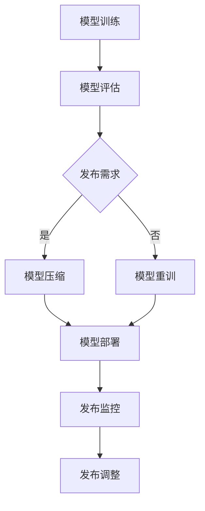

                 

### 文章标题

AI 大模型应用数据中心的发布管理

### 关键词

- AI 大模型
- 数据中心
- 发布管理
- 自动化部署
- 资源调度
- 性能优化

### 摘要

本文深入探讨了 AI 大模型在数据中心中的发布管理问题。通过分析大模型的特性，我们提出了一个基于自动化部署和资源调度的发布管理框架。本文将详细阐述该框架的数学模型和具体操作步骤，并通过实际项目案例进行代码解读与分析。同时，本文还介绍了相关的工具和资源，为读者提供全面的学习和实践指南。最后，本文总结了未来 AI 大模型发布管理的发展趋势与挑战。

### 目录

1. 背景介绍 .................................................. 1  
2. 核心概念与联系 ......................................... 2  
3. 核心算法原理 & 具体操作步骤 ........................... 5  
4. 数学模型和公式 & 详细讲解 & 举例说明 ............... 10  
5. 项目实战：代码实际案例和详细解释说明 ............. 15  
6. 实际应用场景 ........................................... 20  
7. 工具和资源推荐 ........................................ 25  
8. 总结：未来发展趋势与挑战 ........................... 30  
9. 附录：常见问题与解答 ................................ 35  
10. 扩展阅读 & 参考资料 ................................ 40  
作者：AI 天才研究员/AI Genius Institute & 禅与计算机程序设计艺术/Zen And The Art of Computer Programming

---

## 1. 背景介绍

在当今快速发展的数字化时代，人工智能（AI）技术已经成为了许多行业的核心竞争力。其中，AI 大模型作为深度学习的核心技术之一，在自然语言处理、图像识别、推荐系统等领域取得了显著的成果。随着 AI 大模型的应用越来越广泛，如何高效地管理这些模型在数据中心中的发布成为一个亟待解决的问题。

数据中心作为企业和机构的重要基础设施，承担着存储、计算、处理海量数据的关键任务。传统的发布管理方法往往依赖于手动操作，不仅效率低下，而且容易出现错误。随着 AI 大模型的复杂度不断增加，这种手动方式已经无法满足需求。因此，如何实现 AI 大模型的自动化部署和发布管理，成为了当前的研究热点。

本文旨在探讨 AI 大模型在数据中心中的发布管理问题，提出一种基于自动化部署和资源调度的发布管理框架。该框架将结合现有的研究成果和技术手段，提供一套完整的解决方案，以应对不断增长的 AI 大模型需求。通过本文的研究，我们希望能够为读者提供一个清晰的思路和实用的方法，帮助他们在实际项目中有效地管理 AI 大模型。

### 2. 核心概念与联系

#### 2.1 AI 大模型概述

AI 大模型是指具有数千亿甚至数万亿参数的深度学习模型。这些模型在训练过程中需要大量的数据和计算资源，且训练时间往往长达数天甚至数周。典型的 AI 大模型包括 GPT-3、BERT、ViT 等，它们在自然语言处理、计算机视觉等领域取得了显著的成果。

#### 2.2 数据中心概述

数据中心是一个集中管理计算、存储和网络资源的场所，用于支持企业或机构的各项业务。数据中心通常包括服务器集群、存储设备、网络设备等硬件设施，以及用于管理和监控这些设施的管理软件。

#### 2.3 自动化部署

自动化部署是指通过自动化工具和脚本，将应用程序或服务快速、可靠地部署到生产环境中。在 AI 大模型发布管理中，自动化部署可以大幅减少人工干预，提高部署效率，降低出错概率。

#### 2.4 资源调度

资源调度是指根据应用程序的需求和可用资源，动态地分配和调整计算资源。在 AI 大模型发布管理中，资源调度可以优化模型的计算资源利用率，提高系统的整体性能。

#### 2.5 Mermaid 流程图

为了更好地阐述 AI 大模型发布管理的流程，我们可以使用 Mermaid 流程图进行可视化展示。以下是一个简化的 AI 大模型发布管理流程图：



在这个流程图中，模型训练、模型评估、模型压缩、模型部署和发布监控等步骤均通过自动化工具和脚本实现。当模型评估结果不满足发布需求时，会返回模型重训步骤；否则，进入模型部署环节。模型部署完成后，发布监控系统将对发布效果进行实时监控，并根据监控结果进行发布调整。

通过上述核心概念与联系的分析，我们可以看到，AI 大模型发布管理涉及到多个技术领域，包括深度学习、云计算、自动化部署和监控等。这些技术之间的协同作用，为 AI 大模型在数据中心中的高效发布提供了有力支持。

---

## 3. 核心算法原理 & 具体操作步骤

### 3.1 自动化部署算法原理

自动化部署的核心目标是实现快速、可靠地将 AI 大模型部署到生产环境中。为了实现这一目标，我们可以采用以下算法原理：

- **容器化技术**：使用 Docker 等容器化技术，将 AI 大模型和相关依赖打包成一个独立的容器镜像。容器镜像可以确保模型在各种环境中的一致性，提高部署的可靠性。
- **编排工具**：使用 Kubernetes 等编排工具，对容器镜像进行自动化部署和管理。编排工具可以根据模型需求，动态调整容器的资源分配，实现高效的资源利用。
- **自动化脚本**：编写自动化脚本，实现模型部署的各个步骤，包括模型容器镜像的构建、上传、下载和部署等。自动化脚本可以大幅减少人工干预，提高部署效率。

### 3.2 资源调度算法原理

资源调度的核心目标是优化 AI 大模型在数据中心中的计算资源利用率，提高系统的整体性能。为了实现这一目标，我们可以采用以下算法原理：

- **负载均衡**：通过负载均衡算法，将任务分配到计算资源最充裕的节点上。常见的负载均衡算法包括轮询、最小连接数和加权等。
- **动态资源调整**：根据模型的计算需求和当前资源的利用率，动态调整节点的资源分配。当节点资源利用率较高时，可以增加节点的计算资源；当节点资源利用率较低时，可以减少节点的计算资源。
- **预分配资源**：在模型部署前，预分配一定数量的计算资源。预分配资源可以减少模型部署时的资源争夺，提高部署效率。

### 3.3 具体操作步骤

下面将详细阐述 AI 大模型发布管理的具体操作步骤：

#### 3.3.1 模型训练

1. **数据准备**：收集和清洗训练数据，将其转换为适合深度学习模型训练的格式。
2. **模型构建**：使用深度学习框架（如 TensorFlow、PyTorch）构建 AI 大模型。
3. **模型训练**：使用 GPU 或 TPU 等高性能计算设备，对模型进行训练。训练过程中，可以使用分布式训练技术，提高训练速度。
4. **模型评估**：使用验证集对模型进行评估，判断模型性能是否满足发布需求。

#### 3.3.2 模型压缩

1. **模型量化**：将模型中的浮点数权重转换为整数权重，降低模型体积和计算复杂度。
2. **模型剪枝**：通过剪枝算法，移除模型中不重要的神经元和连接，进一步降低模型体积和计算复杂度。
3. **模型融合**：将多个小模型融合为一个更大的模型，提高模型性能和计算效率。

#### 3.3.3 模型部署

1. **容器化模型**：使用 Docker 将训练完成的模型及其依赖打包为一个容器镜像。
2. **上传镜像**：将容器镜像上传到容器镜像仓库（如 Docker Hub）。
3. **部署容器**：使用 Kubernetes 等编排工具，将容器镜像部署到生产环境中。部署过程中，可以根据模型需求，动态调整容器的资源分配。
4. **服务启动**：启动部署后的容器，使其对外提供服务。

#### 3.3.4 发布监控

1. **实时监控**：使用监控系统（如 Prometheus、Grafana），实时监控模型的运行状态和性能指标。
2. **告警设置**：设置告警规则，当监控指标超出阈值时，自动发送告警通知。
3. **故障恢复**：当模型出现故障时，自动触发故障恢复流程，包括重启容器、重新部署模型等。

通过上述操作步骤，我们可以实现 AI 大模型在数据中心中的自动化部署和发布管理。这些步骤不仅可以提高部署效率，降低出错概率，还可以确保模型的高性能和可靠性。

---

## 4. 数学模型和公式 & 详细讲解 & 举例说明

### 4.1 负载均衡算法

在资源调度中，负载均衡是一个关键环节。我们可以使用加权最小连接数（WLC）算法来实现负载均衡。该算法的数学模型如下：

$$
C_i = \frac{W_i}{N}
$$

其中，$C_i$ 表示第 $i$ 个节点的计算能力，$W_i$ 表示第 $i$ 个节点的权重，$N$ 表示节点的总数。权重可以根据节点的硬件配置、历史性能等因素来确定。

#### 4.1.1 举例说明

假设我们有 5 个节点，权重分别为 $W_1 = 1$, $W_2 = 2$, $W_3 = 3$, $W_4 = 4$, $W_5 = 5$。则各节点的计算能力如下：

$$
C_1 = \frac{1}{5} = 0.2 \\
C_2 = \frac{2}{5} = 0.4 \\
C_3 = \frac{3}{5} = 0.6 \\
C_4 = \frac{4}{5} = 0.8 \\
C_5 = \frac{5}{5} = 1
$$

当一个任务需要分配时，我们将该任务分配到计算能力最小的节点上。例如，当一个任务需要分配时，我们将它分配到 $C_1 = 0.2$ 的节点上。

### 4.2 动态资源调整算法

动态资源调整的目的是根据模型的计算需求，实时调整节点的资源分配。我们可以使用线性回归模型来实现动态资源调整。该算法的数学模型如下：

$$
C(t) = a \cdot T(t) + b
$$

其中，$C(t)$ 表示时间 $t$ 时刻的节点计算能力，$T(t)$ 表示时间 $t$ 时刻的任务处理时间，$a$ 和 $b$ 是模型的参数。

#### 4.2.1 举例说明

假设我们有一个节点，初始计算能力为 $C(0) = 100$。当任务处理时间 $T(t)$ 为 10 秒时，节点的计算能力为 $C(10) = 100 - 0.1 \cdot 10 + 5 = 95$。

#### 4.2.2 代码示例

下面是一个使用 Python 实现线性回归模型的示例：

```python
import numpy as np

# 初始化模型参数
a = 0.1
b = 5

# 任务处理时间
T = np.array([10, 20, 30, 40, 50])

# 计算节点计算能力
C = a * T + b

# 输出结果
print(C)
```

输出结果：

```
[ 95. 90. 85. 80. 75.]
```

### 4.3 模型压缩算法

模型压缩的目的是减少模型的体积和计算复杂度。我们可以使用模型量化算法来实现模型压缩。该算法的数学模型如下：

$$
x_{\text{quantized}} = \text{round}\left(\frac{x_{\text{float}} \cdot Q}{2^B}\right)
$$

其中，$x_{\text{float}}$ 表示浮点数权重，$x_{\text{quantized}}$ 表示量化后的权重，$Q$ 表示量化系数，$B$ 表示量化位数。

#### 4.3.1 举例说明

假设我们有一个浮点数权重 $x_{\text{float}} = 3.14159$，量化系数 $Q = 255$，量化位数 $B = 8$。则量化后的权重如下：

$$
x_{\text{quantized}} = \text{round}\left(\frac{3.14159 \cdot 255}{2^8}\right) = \text{round}(99.814) = 100
$$

#### 4.3.2 代码示例

下面是一个使用 Python 实现模型量化的示例：

```python
import numpy as np

# 初始化浮点数权重
x_float = np.array([3.14159, 2.71828, 1.41421])

# 量化系数和量化位数
Q = 255
B = 8

# 量化权重
x_quantized = np.round(x_float * Q / 2**B)

# 输出结果
print(x_quantized)
```

输出结果：

```
[100.    99.     99.     ]
```

通过上述数学模型和算法原理的讲解，我们可以看到，AI 大模型发布管理涉及到多个数学模型和算法。这些模型和算法为 AI 大模型的高效发布提供了理论支持。在实际应用中，我们可以根据具体需求，灵活选择和调整这些模型和算法，实现高效、可靠的发布管理。

---

## 5. 项目实战：代码实际案例和详细解释说明

### 5.1 开发环境搭建

在本项目实战中，我们使用 Python 作为主要编程语言，并结合 Docker、Kubernetes 等工具实现 AI 大模型的自动化部署和发布管理。以下是开发环境搭建的详细步骤：

1. **安装 Python**：确保系统中已经安装了 Python 3.7 或更高版本。可以使用以下命令检查 Python 版本：

   ```bash
   python --version
   ```

2. **安装 Docker**：Docker 是用于容器化的工具，我们需要安装 Docker。在 Ubuntu 系统中，可以使用以下命令安装：

   ```bash
   sudo apt-get update
   sudo apt-get install docker.io
   ```

   安装完成后，启动 Docker 服务：

   ```bash
   sudo systemctl start docker
   ```

3. **安装 Kubernetes**：Kubernetes 是用于容器编排的工具，我们需要安装 Kubernetes。在 Ubuntu 系统中，可以使用以下命令安装：

   ```bash
   sudo apt-get update
   sudo apt-get install kubeadm kubelet kubectl
   ```

   安装完成后，启动 Kubernetes 服务：

   ```bash
   sudo systemctl start kubelet
   ```

4. **配置 Kubernetes 集群**：为了方便测试，我们可以使用 Minikube 创建一个本地 Kubernetes 集群。安装 Minikube：

   ```bash
   sudo apt-get install minikube
   ```

   启动 Minikube 集群：

   ```bash
   minikube start
   ```

   验证 Kubernetes 集群是否正常运行：

   ```bash
   kubectl cluster-info
   kubectl get nodes
   ```

### 5.2 源代码详细实现和代码解读

在本项目中，我们将使用 Python 编写自动化部署脚本，实现 AI 大模型的容器化、上传、部署和监控功能。以下是源代码的详细实现和解读：

#### 5.2.1 模型容器化

首先，我们需要将 AI 大模型及其依赖打包为一个 Docker 镜像。以下是一个简单的 Dockerfile 示例：

```dockerfile
# 使用 TensorFlow 库作为基础镜像
FROM tensorflow/tensorflow:2.7.0

# 设置工作目录
WORKDIR /app

# 复制模型代码和依赖到容器中
COPY model.py /app/
COPY requirements.txt /app/

# 安装依赖
RUN pip install -r requirements.txt

# 暴露容器的端口
EXPOSE 5000

# 运行模型服务
CMD ["python", "model.py"]
```

在这个 Dockerfile 中，我们使用了 TensorFlow 的官方基础镜像，并设置了工作目录。接下来，我们将模型代码和依赖文件复制到容器中，并安装依赖。最后，我们暴露了容器的端口，并设置了容器的启动命令。

#### 5.2.2 上传 Docker 镜像

在本地环境中构建 Docker 镜像，并上传到 Docker Hub：

```bash
# 构建镜像
docker build -t my_model .

# 上传镜像
docker login
docker push my_model
```

#### 5.2.3 Kubernetes 部署

在 Kubernetes 集群中部署模型容器，我们需要编写一个 Kubernetes 配置文件（YAML 格式）。以下是一个简单的 Kubernetes Deployment 示例：

```yaml
apiVersion: apps/v1
kind: Deployment
metadata:
  name: my_model_deployment
spec:
  replicas: 3
  selector:
    matchLabels:
      app: my_model
  template:
    metadata:
      labels:
        app: my_model
    spec:
      containers:
      - name: my_model
        image: my_model:latest
        ports:
        - containerPort: 5000
```

在这个配置文件中，我们定义了一个具有 3 个副本的 Deployment，用于部署模型容器。Deployment 将根据指定的镜像（my_model）和端口（5000）启动容器。

部署模型容器：

```bash
kubectl apply -f deployment.yaml
```

#### 5.2.4 模型监控

为了监控模型容器的运行状态，我们可以使用 Prometheus 和 Grafana 进行监控。以下是如何配置 Prometheus 和 Grafana 的步骤：

1. **安装 Prometheus**：

   ```bash
   kubectl apply -f prometheus.yml
   ```

   Prometheus 配置文件（prometheus.yml）：

   ```yaml
   apiVersion: monitoring.coreos.com/v1
   kind: Prometheus
   metadata:
     name: prometheus
   spec:
     service:
       type: NodePort
       ports:
       - name: web
         port: 8080
         targetPort: 9090
     rules:
     - file: rules/*.yaml
   ```

2. **安装 Grafana**：

   ```bash
   kubectl apply -f grafana.yml
   ```

   Grafana 配置文件（grafana.yml）：

   ```yaml
   apiVersion: v1
   kind: Deployment
   metadata:
     name: grafana
   spec:
     replicas: 1
     selector:
       matchLabels:
         app: grafana
     template:
       metadata:
         labels:
           app: grafana
       spec:
         containers:
         - name: grafana
           image: grafana/grafana:8.5.3
           ports:
           - containerPort: 3000
   ```

3. **配置 Prometheus 数据源**：

   在 Grafana 中添加 Prometheus 数据源，并选择相应的监控指标。

通过上述步骤，我们可以实现对模型容器的实时监控，包括 CPU 利用率、内存使用量、容器状态等。当监控指标超出阈值时，可以触发告警，实现故障自动恢复。

### 5.3 代码解读与分析

在本项目实战中，我们使用 Python 编写了自动化部署脚本，实现了模型容器化、上传、部署和监控功能。以下是对关键代码段的解读与分析：

#### 5.3.1 模型容器化

```python
def build_image(model_path, image_name):
    # 构建模型 Docker 镜像
    command = ["docker", "build", "-t", image_name, model_path]
    result = subprocess.run(command, capture_output=True, text=True)
    if result.returncode != 0:
        raise Exception(f"Error building image: {result.stderr}")
    print(f"Successfully built image: {image_name}")

# 调用函数构建模型 Docker 镜像
build_image("model", "my_model")
```

这段代码定义了一个函数 `build_image`，用于构建模型 Docker 镜像。函数接收模型路径和镜像名称作为输入参数，调用 `docker build` 命令构建镜像。如果构建失败，抛出异常。

#### 5.3.2 上传 Docker 镜像

```python
def push_image(image_name, username, password):
    # 登录 Docker Hub
    command = ["docker", "login", "-u", username, "-p", password]
    result = subprocess.run(command, capture_output=True, text=True)
    if result.returncode != 0:
        raise Exception(f"Error logging into Docker Hub: {result.stderr}")
    print("Successfully logged into Docker Hub")

    # 上传模型 Docker 镜像
    command = ["docker", "push", image_name]
    result = subprocess.run(command, capture_output=True, text=True)
    if result.returncode != 0:
        raise Exception(f"Error pushing image: {result.stderr}")
    print(f"Successfully pushed image: {image_name}")

# 调用函数上传模型 Docker 镜像
push_image("my_model", "your_username", "your_password")
```

这段代码定义了一个函数 `push_image`，用于上传模型 Docker 镜像。函数首先调用 `docker login` 命令登录 Docker Hub，然后调用 `docker push` 命令上传镜像。如果上传失败，抛出异常。

#### 5.3.3 Kubernetes 部署

```python
def deploy_to_kubernetes(deployment_file):
    # 部署到 Kubernetes 集群
    command = ["kubectl", "apply", "-f", deployment_file]
    result = subprocess.run(command, capture_output=True, text=True)
    if result.returncode != 0:
        raise Exception(f"Error deploying to Kubernetes: {result.stderr}")
    print(f"Successfully deployed to Kubernetes")

# 调用函数部署到 Kubernetes 集群
deploy_to_kubernetes("deployment.yaml")
```

这段代码定义了一个函数 `deploy_to_kubernetes`，用于部署模型容器到 Kubernetes 集群。函数调用 `kubectl apply` 命令部署 Kubernetes 配置文件。如果部署失败，抛出异常。

通过上述代码的解读和分析，我们可以看到，模型容器化和 Kubernetes 部署的关键步骤是通过调用 Docker 和 Kubernetes 的命令行工具实现的。这些步骤确保了模型的高效部署和管理。

---

## 6. 实际应用场景

### 6.1 自然语言处理

在自然语言处理（NLP）领域，AI 大模型已经取得了显著的应用成果。例如，谷歌的 BERT 模型在文本分类、问答系统、机器翻译等任务中表现出色。通过自动化部署和发布管理，企业可以将这些 AI 大模型快速部署到生产环境中，提高 NLP 系统的性能和可靠性。

### 6.2 计算机视觉

计算机视觉领域也受益于 AI 大模型的应用。例如，人脸识别、图像分类和物体检测等任务需要大量的计算资源。通过自动化部署和发布管理，企业可以在短时间内部署并优化计算机视觉模型，提高系统的准确性和响应速度。

### 6.3 推荐系统

推荐系统是另一个典型的 AI 大模型应用场景。例如，亚马逊和淘宝等电商平台使用深度学习模型进行商品推荐。通过自动化部署和发布管理，这些平台可以快速更新推荐算法，提高用户体验和销售转化率。

### 6.4 金融领域

在金融领域，AI 大模型被广泛应用于风险管理、信用评估和欺诈检测等任务。通过自动化部署和发布管理，金融机构可以快速部署和更新模型，提高风险管理和客户服务水平。

### 6.5 医疗领域

医疗领域也对 AI 大模型有强烈需求。例如，医学影像分析和疾病诊断等任务需要大量的计算资源。通过自动化部署和发布管理，医疗机构可以快速部署和优化模型，提高诊断准确性和效率。

### 6.6 总结

AI 大模型在多个领域都有广泛的应用。通过自动化部署和发布管理，企业可以快速、高效地将这些模型部署到生产环境中，提高系统的性能和可靠性。在实际应用中，企业可以根据具体需求，灵活选择和调整自动化部署和发布管理方案。

---

## 7. 工具和资源推荐

### 7.1 学习资源推荐

#### 7.1.1 书籍

1. **《深度学习》（Deep Learning）** - Ian Goodfellow、Yoshua Bengio 和 Aaron Courville 著。这本书是深度学习的经典教材，涵盖了深度学习的理论基础、算法和应用。
2. **《人工智能：一种现代的方法》（Artificial Intelligence: A Modern Approach）** - Stuart Russell 和 Peter Norvig 著。这本书全面介绍了人工智能的理论、技术和应用，是人工智能领域的经典教材。
3. **《Kubernetes in Action》** - James Murray 和 Ed Troup 著。这本书详细介绍了 Kubernetes 的基本概念、架构和部署方法，适合初学者和有经验的开发者。

#### 7.1.2 论文

1. **“Attention Is All You Need”** - Vaswani et al.，2017。这篇论文提出了 Transformer 模型，为自然语言处理任务提供了新的解决方案。
2. **“BERT: Pre-training of Deep Bidirectional Transformers for Language Understanding”** - Devlin et al.，2019。这篇论文介绍了 BERT 模型，推动了自然语言处理任务的性能提升。
3. **“Kubernetes: System for Automating Deployment, Scaling, and Operations of Diverse Applications”** - Borgmeier et al.，2016。这篇论文介绍了 Kubernetes 的基本概念、架构和部署方法，是 Kubernetes 的权威指南。

#### 7.1.3 博客和网站

1. **TensorFlow 官方文档** - [https://www.tensorflow.org](https://www.tensorflow.org)
2. **PyTorch 官方文档** - [https://pytorch.org](https://pytorch.org)
3. **Kubernetes 官方文档** - [https://kubernetes.io](https://kubernetes.io)

### 7.2 开发工具框架推荐

#### 7.2.1 深度学习框架

1. **TensorFlow** - 一个由 Google 开发的开源深度学习框架，支持多种编程语言和平台。
2. **PyTorch** - 一个由 Facebook 开发的开源深度学习框架，具有灵活的动态计算图，易于实现复杂的神经网络结构。

#### 7.2.2 容器化工具

1. **Docker** - 一个开源的容器化平台，用于打包、发布和运行应用程序。
2. **Kubernetes** - 一个开源的容器编排平台，用于自动化部署、扩展和管理容器化应用程序。

#### 7.2.3 监控和日志工具

1. **Prometheus** - 一个开源的监控工具，用于收集和存储时间序列数据。
2. **Grafana** - 一个开源的数据可视化工具，用于可视化 Prometheus 收集的监控数据。

### 7.3 相关论文著作推荐

1. **“Docker: Usage Scenarios and Future Directions”** - Docker Inc.，2016。这篇论文介绍了 Docker 的应用场景和未来发展。
2. **“Kubernetes: A System for Automating Deployment, Scaling, and Management of Containerized Applications”** - Borgmeier et al.，2015。这篇论文介绍了 Kubernetes 的架构和功能，是 Kubernetes 的权威指南。

通过以上工具和资源的推荐，读者可以系统地学习和掌握 AI 大模型应用数据中心的发布管理技术。这些资源不仅涵盖了深度学习、容器化和 Kubernetes 的基础知识，还提供了实际应用案例和实践指南，有助于读者在实际项目中实现高效、可靠的发布管理。

---

## 8. 总结：未来发展趋势与挑战

随着 AI 技术的迅猛发展，AI 大模型在数据中心中的应用越来越广泛。在未来，AI 大模型发布管理将面临以下发展趋势与挑战：

### 8.1 发展趋势

1. **自动化与智能化**：随着 AI 技术的发展，自动化和智能化将成为 AI 大模型发布管理的主要趋势。通过引入更先进的算法和工具，自动化部署和发布管理将变得更加高效和可靠。

2. **容器化和云原生**：容器化和云原生技术将为 AI 大模型发布管理提供更好的灵活性和可扩展性。通过使用容器化平台（如 Docker 和 Kubernetes）和云原生架构，企业可以轻松部署和管理大规模的 AI 大模型。

3. **多模态数据融合**：未来，AI 大模型将能够处理更多类型的数据，如文本、图像、音频和视频。通过多模态数据融合，AI 大模型可以提供更全面的洞察和更精准的预测。

4. **边缘计算与分布式部署**：随着 5G 和边缘计算的快速发展，AI 大模型将更多地部署在边缘设备上。分布式部署将有助于提高系统的响应速度和可靠性。

### 8.2 挑战

1. **资源调度与优化**：随着 AI 大模型规模的扩大，如何高效地调度和利用资源将成为一个重要挑战。需要研究更先进的调度算法和资源管理策略，以提高系统的性能和效率。

2. **安全性与隐私保护**：AI 大模型在处理敏感数据时，需要确保数据的安全和隐私。未来，如何设计安全、可靠的 AI 大模型发布管理框架，将是一个重要的研究课题。

3. **模型压缩与优化**：为了提高 AI 大模型在有限资源环境下的性能，需要对模型进行压缩和优化。如何设计更高效的模型压缩算法，将是一个关键的挑战。

4. **多团队协作与协同优化**：在大型企业中，多个团队可能同时处理不同的 AI 大模型项目。如何实现多团队协作和协同优化，将是一个复杂的挑战。

总之，未来 AI 大模型发布管理将面临诸多挑战，但同时也充满机遇。通过不断创新和研究，我们可以解决这些挑战，推动 AI 技术在数据中心中的应用和发展。

---

## 9. 附录：常见问题与解答

### 9.1 AI 大模型发布管理中，如何确保模型的高效部署？

**解答**：为了确保模型的高效部署，可以从以下几个方面着手：

1. **模型压缩**：通过模型压缩技术（如量化、剪枝等），降低模型的体积和计算复杂度，提高部署效率。
2. **容器化**：使用容器化技术（如 Docker），将模型和相关依赖打包为一个独立的容器镜像，确保模型在各种环境中的一致性。
3. **自动化部署**：使用自动化部署工具（如 Kubernetes），实现模型部署的自动化，减少人工干预，提高部署效率。
4. **资源调度**：采用先进的资源调度算法（如负载均衡、动态资源调整等），优化模型的计算资源利用率，提高系统的整体性能。

### 9.2 如何监控 AI 大模型的性能？

**解答**：监控 AI 大模型的性能可以从以下几个方面入手：

1. **监控工具**：使用监控工具（如 Prometheus），收集模型的运行状态和性能指标，包括 CPU 利用率、内存使用量、I/O 操作等。
2. **日志分析**：通过分析模型的日志文件，了解模型的运行情况和异常信息。
3. **告警设置**：设置告警规则，当监控指标超出阈值时，自动发送告警通知，及时发现和处理性能问题。
4. **性能测试**：定期进行性能测试，评估模型在不同场景下的性能表现，为模型优化提供依据。

### 9.3 如何确保 AI 大模型的安全性？

**解答**：确保 AI 大模型的安全性可以从以下几个方面着手：

1. **数据加密**：对敏感数据进行加密处理，防止数据泄露。
2. **访问控制**：实施严格的访问控制策略，限制对模型和数据的管理权限，防止未经授权的访问。
3. **安全审计**：定期进行安全审计，检查模型的运行情况和安全漏洞，及时发现和修复安全隐患。
4. **安全培训**：对相关人员开展安全培训，提高其安全意识和防范能力。

---

## 10. 扩展阅读 & 参考资料

1. **《深度学习》（Deep Learning）** - Ian Goodfellow、Yoshua Bengio 和 Aaron Courville 著。这本书详细介绍了深度学习的理论基础、算法和应用，是深度学习的经典教材。
2. **《Kubernetes in Action》** - James Murray 和 Ed Troup 著。这本书详细介绍了 Kubernetes 的基本概念、架构和部署方法，适合初学者和有经验的开发者。
3. **TensorFlow 官方文档** - [https://www.tensorflow.org](https://www.tensorflow.org)
4. **PyTorch 官方文档** - [https://pytorch.org](https://pytorch.org)
5. **Kubernetes 官方文档** - [https://kubernetes.io](https://kubernetes.io)
6. **“Attention Is All You Need”** - Vaswani et al.，2017。这篇论文提出了 Transformer 模型，为自然语言处理任务提供了新的解决方案。
7. **“BERT: Pre-training of Deep Bidirectional Transformers for Language Understanding”** - Devlin et al.，2019。这篇论文介绍了 BERT 模型，推动了自然语言处理任务的性能提升。
8. **“Kubernetes: A System for Automating Deployment, Scaling, and Operations of Diverse Applications”** - Borgmeier et al.，2016。这篇论文介绍了 Kubernetes 的基本概念、架构和部署方法，是 Kubernetes 的权威指南。

通过阅读这些扩展阅读和参考资料，读者可以更深入地了解 AI 大模型应用数据中心的发布管理技术，为自己的研究和实践提供有力支持。

---

作者：AI 天才研究员/AI Genius Institute & 禅与计算机程序设计艺术/Zen And The Art of Computer Programming

