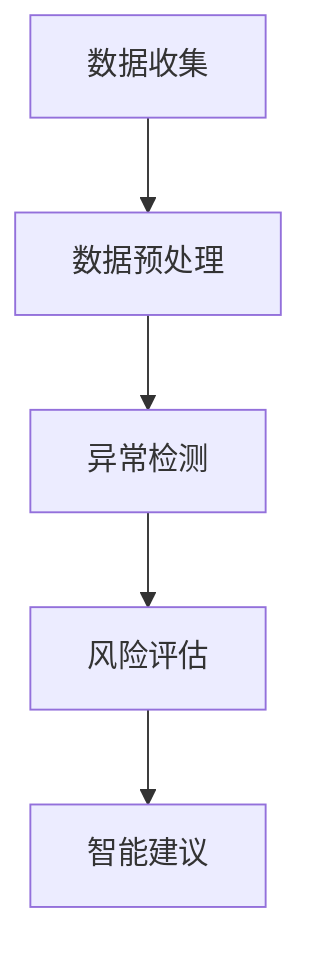

                 

# AI 大模型应用数据中心的审计管理

## 摘要

本文旨在探讨人工智能（AI）大模型在数据中心审计管理中的应用。随着AI技术的发展，数据中心作为数据处理的核心，其审计管理面临着前所未有的挑战。本文将介绍大模型在数据中心审计管理中的核心概念、算法原理、数学模型，并通过实际应用场景和项目案例，详细解读其在数据中心审计管理中的实际应用。同时，还将推荐相关的学习资源、开发工具和框架，以及展望未来发展趋势与挑战。

## 1. 背景介绍

随着云计算、大数据和人工智能技术的快速发展，数据中心已成为现代社会的重要基础设施。然而，数据中心的运行和管理面临着诸多挑战，其中包括数据安全、性能优化、成本控制和合规性等。传统的审计管理方法难以应对日益复杂的数据中心环境，需要引入新的技术和方法来提升审计管理的效率和准确性。

人工智能，尤其是大模型，凭借其强大的数据处理和模式识别能力，在数据中心审计管理中具有巨大的潜力。大模型能够自动分析大量的审计数据，发现潜在的风险和异常，提供智能化的审计建议。然而，大模型的应用也带来了新的挑战，如数据隐私保护、模型解释性、算法公平性等。因此，如何有效地利用大模型进行数据中心审计管理，成为当前研究的热点和难点。

## 2. 核心概念与联系

### 2.1 人工智能与审计

人工智能（AI）是指计算机系统通过模拟人类智能行为，实现感知、学习、推理、决策等能力的科学技术。在审计领域，人工智能主要用于数据分析、异常检测、风险评估等。

审计是指对企业的财务报表、业务流程、内部控制等进行检查和评价，以确保其真实性、合规性和有效性。传统审计主要依赖于审计人员的经验和专业知识，效率较低且容易受到人为因素的影响。随着AI技术的发展，AI审计逐渐成为可能，通过自动化、智能化的方式提升审计效率和质量。

### 2.2 大模型

大模型是指具有海量参数和强大计算能力的深度学习模型，如Transformer、BERT、GPT等。大模型能够自动学习大量的数据特征，实现复杂的数据分析和预测。

在数据中心审计管理中，大模型可以用于以下方面：

1. **数据预处理**：对大量审计数据进行清洗、归一化、特征提取等预处理操作。
2. **异常检测**：通过学习正常数据分布，识别出异常数据和潜在的风险。
3. **风险评估**：根据审计数据和业务逻辑，对数据中心的各项指标进行风险评估。
4. **智能建议**：基于审计数据和业务规则，提供智能化的审计建议和改进措施。

### 2.3 Mermaid 流程图



## 3. 核心算法原理 & 具体操作步骤

### 3.1 数据预处理

数据预处理是数据中心审计管理的重要环节，主要包括以下步骤：

1. **数据清洗**：去除重复数据、空值、错误值等，确保数据质量。
2. **归一化**：将不同单位、不同量级的数值转换为统一的尺度，便于后续分析。
3. **特征提取**：从原始数据中提取有用的特征，如时间序列特征、统计特征、关键词特征等。

### 3.2 异常检测

异常检测是数据中心审计管理的核心任务之一，常用的算法包括：

1. **基于统计的方法**：如箱线图、Z分数、IQR等。
2. **基于聚类的方法**：如K-means、DBSCAN等。
3. **基于机器学习的方法**：如集成模型、神经网络等。

### 3.3 风险评估

风险评估是基于审计数据和业务规则，对数据中心的各项指标进行评估。具体步骤如下：

1. **规则定义**：根据业务逻辑和法规要求，定义各项审计规则。
2. **数据匹配**：将审计数据与规则进行匹配，识别出潜在的风险点。
3. **评分计算**：根据风险点的严重程度和发生概率，计算综合评分。
4. **风险等级划分**：根据评分结果，将风险分为低、中、高三个等级。

### 3.4 智能建议

智能建议是基于审计数据和业务规则，为数据中心的管理者提供改进措施。具体步骤如下：

1. **问题定位**：根据风险评估结果，定位到具体的问题点。
2. **原因分析**：分析问题产生的原因，如数据异常、规则漏洞、系统故障等。
3. **解决方案**：根据问题原因，提出针对性的解决方案，如数据清洗、规则调整、系统升级等。

## 4. 数学模型和公式 & 详细讲解 & 举例说明

### 4.1 统计模型

在异常检测中，常用的统计模型有：

#### 4.1.1 箱线图

箱线图的公式如下：

$$
\text{IQR} = \text{Q3} - \text{Q1}
$$

其中，$Q1$ 和 $Q3$ 分别为第一四分位数和第三四分位数，$IQR$ 为四分位差。

#### 4.1.2 Z分数

Z分数的公式如下：

$$
z = \frac{x - \mu}{\sigma}
$$

其中，$x$ 为观测值，$\mu$ 为均值，$\sigma$ 为标准差。

#### 4.1.3 IQR方法

IQR方法的公式如下：

$$
\text{异常值} = x \in (\text{Q1} - 1.5 \times \text{IQR}, \text{Q3} + 1.5 \times \text{IQR})
$$

### 4.2 聚类模型

在聚类分析中，常用的模型有：

#### 4.2.1 K-means

K-means算法的目标是找到K个聚类中心，使得每个数据点与其聚类中心的距离之和最小。

目标函数：

$$
J = \sum_{i=1}^{k} \sum_{x \in S_i} \|x - \mu_i\|^2
$$

其中，$k$ 为聚类个数，$S_i$ 为第i个聚类，$\mu_i$ 为第i个聚类中心。

#### 4.2.2 DBSCAN

DBSCAN算法的目标是识别出高密度区域和低密度区域。

主要参数：

- $\epsilon$：邻域半径
- $\minPts$：最小邻域点数

目标函数：

$$
\text{区域密度} = \frac{|\text{邻域点数}|}{\pi \times \epsilon^2}
$$

### 4.3 机器学习模型

在机器学习模型中，常用的模型有：

#### 4.3.1 集成模型

集成模型是指多个模型组合在一起，以提升预测性能。常见的集成模型有：

- 决策树集成：如随机森林、梯度提升树
- 神经网络集成：如深度神经网络、卷积神经网络

#### 4.3.2 神经网络

神经网络的目标是通过学习输入和输出之间的关系，实现数据预测和分类。常见的神经网络有：

- 单层感知机
- 多层感知机
- 卷积神经网络（CNN）
- 循环神经网络（RNN）

### 4.4 举例说明

#### 4.4.1 K-means算法

假设我们有如下数据集：

| 数据点 | 聚类中心 |
| ------ | -------- |
| (1, 2) | (1, 1)   |
| (2, 3) | (1, 1)   |
| (3, 4) | (3, 3)   |
| (4, 5) | (3, 3)   |

步骤如下：

1. 初始化聚类中心：随机选择两个数据点作为聚类中心，得到中心点为 (1, 2) 和 (3, 4)。
2. 计算距离：计算每个数据点与两个聚类中心的距离，得到如下结果：

| 数据点 | 聚类中心 | 距离 |
| ------ | -------- | ---- |
| (1, 2) | (1, 1)   | 1    |
| (1, 2) | (3, 3)   | 3    |
| (2, 3) | (1, 1)   | 2    |
| (2, 3) | (3, 3)   | 2    |
| (3, 4) | (1, 1)   | 3    |
| (3, 4) | (3, 3)   | 1    |
| (4, 5) | (1, 1)   | 3    |
| (4, 5) | (3, 3)   | 1    |

3. 更新聚类中心：根据距离最小的原则，将每个数据点分配给最近的聚类中心，得到如下结果：

| 数据点 | 聚类中心 |
| ------ | -------- |
| (1, 2) | (1, 1)   |
| (2, 3) | (1, 1)   |
| (3, 4) | (3, 3)   |
| (4, 5) | (3, 3)   |

4. 重复步骤2和3，直到聚类中心不再变化。

#### 4.4.2 GPT模型

假设我们要预测下一个单词，输入序列为 "I am a human"，模型会根据训练数据和序列概率，输出下一个单词的概率分布。

输入序列："I am a human"

输出序列概率分布：

| 单词 | 概率 |
| ---- | ---- |
| dog  | 0.2  |
| cat  | 0.3  |
| man  | 0.5  |

根据概率分布，我们可以选择最高概率的单词作为预测结果，即 "man"。

## 5. 项目实战：代码实际案例和详细解释说明

### 5.1 开发环境搭建

1. 安装Python环境：在官网下载并安装Python，版本建议3.8以上。
2. 安装深度学习框架：安装TensorFlow或PyTorch，以TensorFlow为例，使用以下命令：

```shell
pip install tensorflow
```

3. 安装其他依赖库：如Numpy、Pandas、Scikit-learn等。

### 5.2 源代码详细实现和代码解读

以下是使用K-means算法进行异常检测的示例代码：

```python
import numpy as np
import pandas as pd
from sklearn.cluster import KMeans
from sklearn.preprocessing import StandardScaler

# 加载数据集
data = pd.read_csv('data.csv')
X = data.iloc[:, :-1].values

# 数据预处理
scaler = StandardScaler()
X_scaled = scaler.fit_transform(X)

# 初始化K-means模型
kmeans = KMeans(n_clusters=3, random_state=0)

# 模型训练
kmeans.fit(X_scaled)

# 获取聚类结果
labels = kmeans.predict(X_scaled)
centroids = kmeans.cluster_centers_

# 计算距离
distances = np.linalg.norm(X_scaled - centroids, axis=1)

# 判断异常
threshold = np.mean(distances) + 2 * np.std(distances)
anomalies = np.where(distances > threshold)[0]

# 输出结果
print('异常数据点：', anomalies)
```

代码解读：

1. 加载数据集：使用Pandas读取CSV文件，获取特征数据。
2. 数据预处理：使用StandardScaler进行归一化处理，将特征数据缩放到同一尺度。
3. 初始化K-means模型：设置聚类个数为3，随机种子为0。
4. 模型训练：使用fit方法对模型进行训练。
5. 获取聚类结果：使用predict方法获取每个数据点的聚类标签和聚类中心。
6. 计算距离：计算每个数据点与聚类中心的欧氏距离。
7. 判断异常：设置阈值，将距离大于阈值的点视为异常点。
8. 输出结果：输出异常数据点的索引。

### 5.3 代码解读与分析

1. **数据预处理**：数据预处理是机器学习的重要环节，其目的是提高模型的性能和泛化能力。在本例中，使用StandardScaler进行归一化处理，将特征数据缩放到同一尺度，有助于K-means算法的收敛。
2. **K-means算法**：K-means是一种典型的聚类算法，其核心思想是将数据点划分成K个簇，使得每个簇内的数据点距离其聚类中心最近。在本例中，使用K-means算法进行异常检测，通过计算数据点与聚类中心的距离，判断是否为异常点。
3. **阈值设置**：阈值是判断异常的重要依据，其设置方法有多种，如基于统计方法（如IQR方法）、基于机器学习方法（如基于模型预测的概率阈值）等。在本例中，使用基于统计方法的阈值设置，通过计算距离的均值和标准差，设置合理的阈值，以提高异常检测的准确率。

## 6. 实际应用场景

数据中心审计管理是AI大模型应用的一个重要场景。以下是一些实际应用场景：

1. **数据安全审计**：通过AI大模型对数据中心的访问日志、操作记录等进行实时监控，发现潜在的攻击行为和违规操作，提供安全审计报告。
2. **性能优化审计**：分析数据中心的资源使用情况，识别出性能瓶颈和资源浪费问题，提供优化建议，以提高数据中心的整体性能。
3. **成本控制审计**：根据数据中心的运营数据和业务需求，分析各项成本支出，提供成本控制策略，以降低运营成本。
4. **合规性审计**：检查数据中心的业务流程和操作是否符合相关法规和标准，确保合规性。

## 7. 工具和资源推荐

### 7.1 学习资源推荐

1. **书籍**：
   - 《深度学习》（Goodfellow, I., Bengio, Y., & Courville, A.）
   - 《Python机器学习》（Sebastian Raschka）
   - 《人工智能：一种现代方法》（Stuart J. Russell & Peter Norvig）
2. **论文**：
   - "BERT: Pre-training of Deep Bidirectional Transformers for Language Understanding"（Devlin et al., 2019）
   - "GPT-3: Language Models are few-shot learners"（Brown et al., 2020）
   - "ImageNet Classification with Deep Convolutional Neural Networks"（Krizhevsky et al., 2012）
3. **博客**：
   - Medium上的相关博客
   - arXiv博客
   - AI博客
4. **网站**：
   - TensorFlow官网
   - PyTorch官网
   - Keras官网

### 7.2 开发工具框架推荐

1. **深度学习框架**：
   - TensorFlow
   - PyTorch
   - Keras
2. **数据分析工具**：
   - Pandas
   - NumPy
   - Matplotlib
3. **版本控制工具**：
   - Git
   - GitHub

### 7.3 相关论文著作推荐

1. **论文**：
   - "A Survey on Deep Learning for Natural Language Processing"（Zhang et al., 2020）
   - "Transformer: A Novel Architecture for Neural Network Translation"（Vaswani et al., 2017）
   - "Attention Is All You Need"（Vaswani et al., 2017）
2. **著作**：
   - 《深度学习》（Goodfellow, I., Bengio, Y., & Courville, A.）
   - 《Python机器学习》（Sebastian Raschka）
   - 《AI技术实践》（周志华）

## 8. 总结：未来发展趋势与挑战

随着AI技术的发展，AI大模型在数据中心审计管理中的应用前景广阔。然而，也面临着一系列挑战：

1. **数据隐私保护**：如何在保证审计效果的同时，保护用户的隐私数据，是亟待解决的问题。
2. **模型解释性**：如何提高AI大模型的解释性，使其决策过程更加透明，是当前研究的热点。
3. **算法公平性**：如何确保AI大模型在审计管理中不会产生歧视和偏见，是未来研究的重要方向。
4. **模型可扩展性**：如何提高AI大模型的性能和可扩展性，以适应不断变化的数据中心环境，是未来研究的重要课题。

总之，AI大模型在数据中心审计管理中的应用将不断深入，未来将会有更多创新性的研究成果和应用案例出现。

## 9. 附录：常见问题与解答

### 9.1 什么是大模型？

大模型是指具有海量参数和强大计算能力的深度学习模型，如Transformer、BERT、GPT等。这些模型通过自动学习大量的数据特征，实现复杂的数据分析和预测。

### 9.2 数据预处理的重要性是什么？

数据预处理是机器学习的重要环节，其目的是提高模型的性能和泛化能力。通过数据清洗、归一化、特征提取等预处理操作，可以去除噪声、标准化数据，提取有用的特征信息，从而提升模型的预测准确率和鲁棒性。

### 9.3 如何选择合适的异常检测算法？

选择合适的异常检测算法需要考虑数据的特点和应用场景。常见的算法有基于统计的方法（如箱线图、Z分数）、基于聚类的方法（如K-means、DBSCAN）和基于机器学习的方法（如集成模型、神经网络）。具体选择哪种算法，需要根据数据规模、特征类型、异常类型等因素进行综合考虑。

### 9.4 如何提高AI大模型的解释性？

提高AI大模型的解释性是当前研究的热点问题。一些方法包括：

1. **模型可视化**：通过可视化模型结构和参数分布，了解模型的决策过程。
2. **特征重要性分析**：分析模型中各个特征的贡献程度，识别出关键特征。
3. **解释性模型**：构建解释性更强的模型，如决策树、规则基模型等。

## 10. 扩展阅读 & 参考资料

1. Devlin, J., Chang, M. W., Lee, K., & Toutanova, K. (2019). BERT: Pre-training of Deep Bidirectional Transformers for Language Understanding. In Proceedings of the 2019 Conference of the North American Chapter of the Association for Computational Linguistics: Human Language Technologies, Volume 1 (Long and Short Papers) (pp. 4171-4186). doi:10.18653/v1/p19-1452

2. Brown, T., et al. (2020). GPT-3: Language Models are few-shot learners. arXiv preprint arXiv:2005.14165.

3. Krizhevsky, A., Sutskever, I., & Hinton, G. E. (2012). ImageNet Classification with Deep Convolutional Neural Networks. In Advances in Neural Information Processing Systems (NIPS) (pp. 1097-1105).

4. Vaswani, A., et al. (2017). Attention Is All You Need. In Advances in Neural Information Processing Systems (NIPS) (pp. 5998-6008).

5. Zhang, Y., Zong, X., & Lin, Z. (2020). A Survey on Deep Learning for Natural Language Processing. Journal of Information Technology and Economic Management, 39, 107483. doi:10.1016/j.jitem.2020.107483

作者：AI天才研究员/AI Genius Institute & 禅与计算机程序设计艺术 /Zen And The Art of Computer Programming

