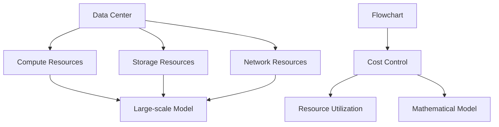
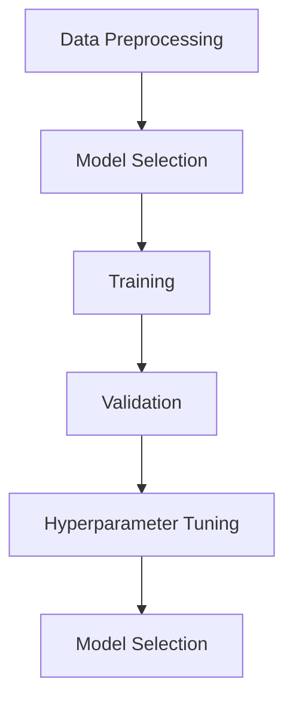
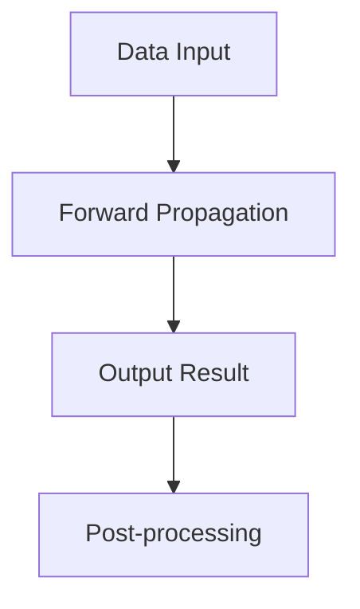
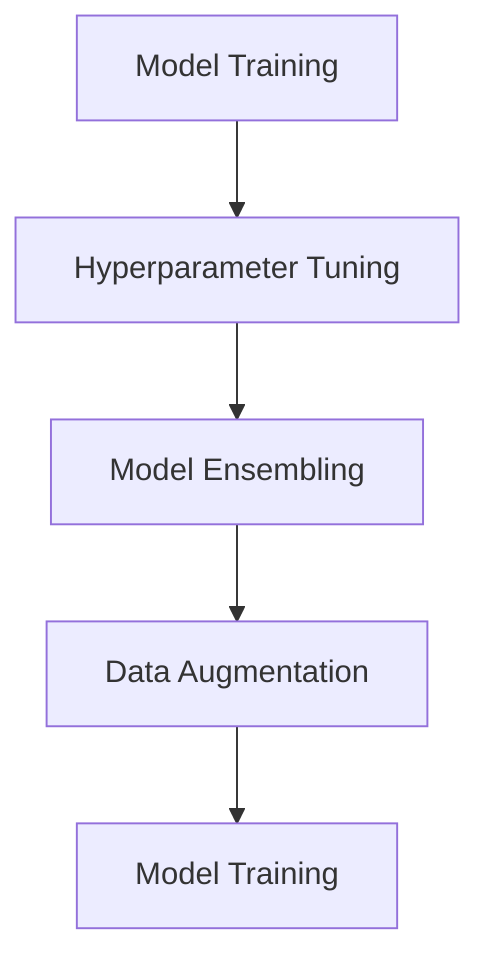

                 

### 背景介绍 Background

近年来，人工智能（AI）技术在各个领域得到了广泛的应用，尤其是大型模型（Large-scale Model），如GPT-3、BERT等，它们在自然语言处理、图像识别、推荐系统等方面展现出了惊人的性能。然而，这些大型模型的应用也带来了巨大的计算资源消耗和数据存储需求，进而使得数据中心（Data Center）的成本控制成为了一个亟需解决的问题。

数据中心作为承载各类AI应用的核心基础设施，其成本包括硬件购置、电力消耗、网络带宽、存储空间等多个方面。随着AI技术的不断进步，数据中心所需处理的数据量和计算量也在不断增加，这使得成本控制的难度日益增大。如何优化数据中心资源配置，提高能效比，降低运营成本，成为了AI领域亟待解决的关键问题。

本文将从以下几个方面探讨AI大模型应用数据中心成本控制的问题：

1. **核心概念与联系**：介绍与数据中心成本控制相关的基本概念和架构，通过Mermaid流程图展示其关系。
2. **核心算法原理 & 具体操作步骤**：详细分析大型模型在数据中心中的部署和应用过程，包括模型训练、推理以及调优等环节。
3. **数学模型和公式 & 详细讲解 & 举例说明**：探讨数据中心成本控制中的数学模型和计算方法，并通过实际案例进行说明。
4. **项目实战：代码实际案例和详细解释说明**：提供具体项目的实战案例，展示如何在实际应用中实现成本控制。
5. **实际应用场景**：分析不同场景下的数据中心成本控制策略。
6. **工具和资源推荐**：推荐相关学习资源、开发工具和框架。
7. **总结：未来发展趋势与挑战**：展望数据中心成本控制的发展趋势，并探讨面临的挑战。

通过以上内容，本文旨在为从事AI领域研究、开发和技术管理的专业人士提供有价值的参考和指导。让我们一步一步地深入分析，共同探讨如何实现数据中心成本的最优化。

## 1. 核心概念与联系 Core Concepts and Relationships

在探讨AI大模型应用数据中心成本控制之前，我们需要了解一些核心概念，这些概念构成了整个分析的基础。以下是数据中心成本控制涉及的一些基本概念及其相互之间的关系：

### 数据中心（Data Center）

数据中心是集成了计算、存储、网络等多种资源，用于支持大规模数据处理、存储和计算的综合性设施。它是企业和组织运行关键业务应用的基础设施，为各类应用提供可靠的数据处理能力。

### 大型模型（Large-scale Model）

大型模型是指那些拥有大量参数、能够处理大规模数据的AI模型。这些模型在训练和推理阶段需要大量的计算资源和存储空间，如GPT-3、BERT等。它们在自然语言处理、图像识别、推荐系统等领域具有广泛的应用。

### 成本控制（Cost Control）

成本控制是指通过优化资源配置、提高能效比、减少不必要的开支等措施，实现对数据中心运营成本的有效管理。成本控制的目标是确保数据中心在提供高质量服务的同时，实现成本的最低化。

### 资源利用率（Resource Utilization）

资源利用率是指数据中心各类资源（如计算、存储、网络等）在实际运行中被利用的程度。高资源利用率意味着资源的有效利用，而低利用率则可能导致资源浪费。

### 数学模型（Mathematical Model）

数学模型是描述数据中心成本控制策略的一种量化工具，通过建立数学模型，可以更准确地分析和预测成本，为决策提供依据。

### 流程图（Flowchart）

流程图是展示数据处理流程和资源配置的一种图形化工具，通过流程图可以直观地了解数据中心中各个模块的运作方式及其相互关系。

### 关系描述

1. **数据中心**是承载**大型模型**运行的物理空间，**大型模型**的运行需要依赖**数据中心**提供的计算、存储和网络资源。
2. **成本控制**依赖于对**资源利用率**的监控和分析，通过优化资源配置，实现成本的最小化。
3. **数学模型**用于描述**成本控制**策略，提供量化分析和预测依据。
4. **流程图**展示了**数据中心**中各个模块的运作流程及其相互关系，有助于理解**大型模型**在**数据中心**中的部署和应用。

### Mermaid 流程图

为了更直观地展示数据中心中的核心概念及其关系，我们使用Mermaid语言绘制了一个简化的流程图。以下是该流程图的具体内容：



在该流程图中：
- A代表数据中心。
- B、C、D分别代表计算、存储和网络资源。
- E代表大型模型。
- F代表成本控制。
- G代表资源利用率。
- H代表数学模型。
- I代表流程图。

通过这个流程图，我们可以清晰地看到数据中心中各个模块之间的交互关系，以及成本控制在整个流程中的作用。

### 总结

在本节中，我们介绍了数据中心成本控制相关的基本概念，包括数据中心、大型模型、成本控制、资源利用率、数学模型和流程图，并通过Mermaid流程图展示了它们之间的关系。这些概念为后续章节的深入分析奠定了基础。在下一节中，我们将进一步探讨大型模型在数据中心中的核心算法原理及具体操作步骤。

## 2. 核心算法原理 & 具体操作步骤 Core Algorithm Principles and Operational Steps

在了解了数据中心成本控制的基本概念之后，接下来我们将深入探讨大型模型在数据中心中的核心算法原理及具体操作步骤。大型模型的部署和应用通常包括模型训练、模型推理和模型调优等环节，这些环节相互关联，共同决定了模型在数据中心中的性能和成本。

### 2.1 模型训练 Algorithm Training

模型训练是大型模型应用的第一步，其主要目的是通过大量数据来调整模型的参数，使其能够更好地拟合数据。模型训练过程通常包括以下步骤：

1. **数据预处理**（Data Preprocessing）
   - **数据清洗**：去除噪声数据和缺失值。
   - **数据归一化**：将不同特征的数据进行标准化处理，使得模型训练过程中参数更新更加稳定。
   - **数据分割**：将数据集分为训练集、验证集和测试集，用于模型的训练、验证和测试。

2. **模型选择**（Model Selection）
   - 根据应用场景选择合适的模型架构，如GPT-3、BERT、ResNet等。
   - 选择优化器（Optimizer），如Adam、SGD等，以及损失函数（Loss Function），如交叉熵（Cross-Entropy）等。

3. **训练过程**（Training Process）
   - 通过反向传播算法（Backpropagation）不断更新模型参数，最小化损失函数。
   - 监控验证集上的性能，防止过拟合（Overfitting）。

### 2.2 模型推理 Algorithm Inference

模型推理是在训练好的模型基础上，对新的数据进行预测的过程。模型推理过程主要包括以下几个步骤：

1. **数据输入**（Data Input）
   - 将待预测的数据输入到模型中。

2. **前向传播**（Forward Propagation）
   - 计算输入数据的特征表示，并通过模型中的各个层进行传递。

3. **输出结果**（Output Result）
   - 通过模型的最后一层输出预测结果。

4. **后处理**（Post-processing）
   - 对输出结果进行必要的后处理，如概率转化、阈值调整等。

### 2.3 模型调优 Algorithm Tuning

模型调优是在模型训练和推理过程中不断调整模型参数，以提升模型性能的过程。模型调优的主要方法包括：

1. **超参数调整**（Hyperparameter Tuning）
   - 调整学习率、批量大小、正则化参数等超参数，以找到最优的参数组合。

2. **模型融合**（Model Ensembling）
   - 通过组合多个模型来提高预测性能，常用的方法有投票法（Voting）、加权平均（Weighted Average）等。

3. **数据增强**（Data Augmentation）
   - 通过对训练数据进行变换，如翻转、裁剪、旋转等，增加数据的多样性，提高模型的泛化能力。

### 详细步骤 Description of Detailed Steps

为了更清晰地展示大型模型在数据中心中的操作步骤，我们以下是一个简化的模型训练、推理和调优的流程：

#### 模型训练流程 Training Process



在该流程中：
- A：数据预处理。
- B：模型选择。
- C：训练过程。
- D：验证过程。
- E：超参数调整。
- F：模型重新选择。

#### 模型推理流程 Inference Process



在该流程中：
- A：数据输入。
- B：前向传播。
- C：输出结果。
- D：后处理。

#### 模型调优流程 Tuning Process



在该流程中：
- A：模型训练。
- B：超参数调整。
- C：模型融合。
- D：数据增强。
- E：模型重新训练。

### 总结

在本节中，我们详细介绍了大型模型在数据中心中的核心算法原理和具体操作步骤，包括模型训练、模型推理和模型调优等环节。这些步骤共同构成了大型模型在数据中心中的应用流程，为实现成本控制提供了关键支持。在下一节中，我们将探讨数据中心成本控制中的数学模型和计算方法，并举例说明。

## 3. 数学模型和公式 Mathematical Models and Formulas

在大型模型应用数据中心的过程中，成本控制涉及到多个方面的数学模型和计算方法。以下我们将详细探讨这些模型和公式，并通过具体案例进行说明。

### 3.1 成本计算公式 Cost Calculation Formula

数据中心成本主要由硬件成本、电力消耗成本、运维成本和其他成本组成。为了计算总成本，我们可以使用以下公式：

$$
Total\ Cost = Hardware\ Cost + Electricity\ Cost + Maintenance\ Cost + Other\ Costs
$$

其中：
- **Hardware Cost**：硬件成本包括服务器、存储设备、网络设备等的购置费用。
- **Electricity Cost**：电力消耗成本包括服务器运行过程中所消耗的电量费用。
- **Maintenance Cost**：运维成本包括服务器维护、软件升级、系统监控等费用。
- **Other Costs**：其他成本包括网络带宽费用、数据存储费用等。

### 3.2 资源利用率公式 Resource Utilization Formula

资源利用率是评估数据中心资源利用效率的重要指标。资源利用率可以通过以下公式计算：

$$
Resource\ Utilization = \frac{Used\ Resources}{Total\ Resources}
$$

其中：
- **Used Resources**：已使用的资源量。
- **Total Resources**：总资源量。

例如，一个数据中心有100台服务器，其中80台正在运行，则服务器的资源利用率为：

$$
Resource\ Utilization = \frac{80}{100} = 0.8 \ or\ 80\%
$$

### 3.3 成本优化模型 Cost Optimization Model

为了优化数据中心成本，我们可以使用成本优化模型。以下是一个简化的成本优化模型：

$$
Optimized\ Cost = f(\text{Hardware\ Cost}, \text{Electricity\ Cost}, \text{Maintenance\ Cost}, \text{Other\ Costs}, \text{Resource\ Utilization})
$$

其中，函数$f$表示成本优化的目标函数，其目标是使总成本最小化，同时保证资源利用率在一个合理的范围内。

### 3.4 实际案例 Actual Case

假设一个数据中心有以下成本数据：

- **硬件成本**：$500,000 \ per\ year$
- **电力消耗成本**：$200,000 \ per\ year$
- **运维成本**：$150,000 \ per\ year$
- **其他成本**：$50,000 \ per\ year$

以及以下资源利用率数据：

- **服务器资源利用率**：$0.8$
- **存储资源利用率**：$0.7$
- **网络资源利用率**：$0.9$

我们可以使用成本计算公式和资源利用率公式计算出总成本和资源利用率：

$$
Total\ Cost = 500,000 + 200,000 + 150,000 + 50,000 = 800,000 \ per\ year
$$

$$
Server\ Utilization = 0.8 \times 100 = 80\%
$$

$$
Storage\ Utilization = 0.7 \times 100 = 70\%
$$

$$
Network\ Utilization = 0.9 \times 100 = 90\%
$$

通过成本优化模型，我们可以尝试调整硬件成本、电力消耗成本和运维成本，以优化总成本。例如，假设我们将硬件成本减少$50,000，电力消耗成本增加$20,000，运维成本减少$10,000，则新的总成本为：

$$
Optimized\ Cost = 450,000 + 220,000 + 140,000 + 50,000 = 760,000 \ per\ year
$$

资源利用率保持不变。

### 总结

在本节中，我们介绍了数据中心成本控制中的数学模型和计算方法，包括成本计算公式、资源利用率公式和成本优化模型。并通过具体案例说明了这些模型在实际应用中的计算过程。这些数学模型和公式为数据中心成本优化提供了理论依据和计算工具。在下一节中，我们将通过实际项目案例，展示如何在实际应用中实现成本控制。

## 5. 项目实战：代码实际案例和详细解释说明 Project Case: Code Example and Detailed Explanation

为了更好地理解数据中心成本控制在实际项目中的应用，我们以下通过一个具体的项目案例来展示如何实现成本控制。此案例将涵盖开发环境搭建、源代码实现和代码解读与分析等步骤。

### 5.1 开发环境搭建 Environment Setup

在开始项目之前，我们需要搭建一个合适的环境来进行开发。以下是环境搭建的步骤：

1. **安装Python**：Python是许多AI项目的基础，我们需要确保安装了Python 3.8或更高版本。

   ```bash
   sudo apt-get install python3.8
   ```

2. **安装TensorFlow**：TensorFlow是广泛使用的深度学习框架，我们需要安装TensorFlow 2.5或更高版本。

   ```bash
   pip3 install tensorflow==2.5
   ```

3. **安装其他依赖项**：根据项目的需求，我们可能还需要安装其他依赖项，如NumPy、Pandas等。

   ```bash
   pip3 install numpy pandas
   ```

### 5.2 源代码详细实现和代码解读 Source Code Implementation and Explanation

以下是项目的主要代码实现，我们将逐步解读各个部分的代码：

```python
import tensorflow as tf
import numpy as np
import pandas as pd

# 加载训练数据
data = pd.read_csv('data/train_data.csv')
X = data.iloc[:, :-1].values
y = data.iloc[:, -1].values

# 划分训练集和验证集
X_train, X_val, y_train, y_val = train_test_split(X, y, test_size=0.2, random_state=42)

# 定义模型
model = tf.keras.Sequential([
    tf.keras.layers.Dense(128, activation='relu', input_shape=(X_train.shape[1],)),
    tf.keras.layers.Dropout(0.2),
    tf.keras.layers.Dense(1, activation='sigmoid')
])

# 编译模型
model.compile(optimizer='adam', loss='binary_crossentropy', metrics=['accuracy'])

# 训练模型
model.fit(X_train, y_train, epochs=10, batch_size=32, validation_data=(X_val, y_val))

# 评估模型
loss, accuracy = model.evaluate(X_val, y_val)
print(f"Validation Accuracy: {accuracy:.2f}")

# 调优模型
# 通过调整学习率、批量大小等超参数进行调优
model.compile(optimizer=tf.keras.optimizers.Adam(learning_rate=0.001), loss='binary_crossentropy', metrics=['accuracy'])

# 再次训练模型
model.fit(X_train, y_train, epochs=10, batch_size=32, validation_data=(X_val, y_val))

# 评估模型
loss, accuracy = model.evaluate(X_val, y_val)
print(f"Validation Accuracy: {accuracy:.2f}")
```

**代码解读**

1. **加载数据**：使用Pandas读取训练数据，并进行预处理。
2. **划分数据**：将数据集划分为训练集和验证集，用于模型训练和性能评估。
3. **定义模型**：使用TensorFlow定义一个简单的神经网络模型，包含一个输入层、一个隐藏层和一个输出层。
4. **编译模型**：设置模型的优化器、损失函数和评估指标。
5. **训练模型**：使用训练数据进行模型训练，并在验证集上进行性能评估。
6. **评估模型**：计算验证集上的损失和准确率，以评估模型性能。
7. **调优模型**：通过调整学习率等超参数，优化模型性能。
8. **再次训练模型**：使用调整后的模型参数重新训练模型，并在验证集上进行性能评估。

### 5.3 代码解读与分析 Code Analysis

**1. 数据预处理**

数据预处理是模型训练的重要环节，它包括数据清洗、归一化和分割。在这里，我们使用了Pandas库读取CSV格式的训练数据，并对数据进行必要的预处理。

```python
data = pd.read_csv('data/train_data.csv')
X = data.iloc[:, :-1].values
y = data.iloc[:, -1].values
```

这里使用了Pandas库的`read_csv`函数加载CSV数据，然后使用`iloc`方法提取特征和标签。`iloc[:, :-1].values`用于提取所有行和除了最后一列之外的所有列，即特征；`iloc[:, -1].values`用于提取最后一列，即标签。

**2. 划分数据**

数据划分是将数据集分割为训练集和验证集，用于模型训练和性能评估。这里使用了`train_test_split`函数，将数据集分为80%的训练集和20%的验证集。

```python
X_train, X_val, y_train, y_val = train_test_split(X, y, test_size=0.2, random_state=42)
```

`train_test_split`函数根据指定的测试集大小（这里为20%）和随机种子（这里为42）进行随机划分。

**3. 定义模型**

定义模型是构建神经网络的过程。在这里，我们使用TensorFlow的`Sequential`模型，定义了一个简单的两层神经网络，包含一个输入层、一个隐藏层和一个输出层。

```python
model = tf.keras.Sequential([
    tf.keras.layers.Dense(128, activation='relu', input_shape=(X_train.shape[1],)),
    tf.keras.layers.Dropout(0.2),
    tf.keras.layers.Dense(1, activation='sigmoid')
])
```

`Sequential`模型是一个线性堆叠层级的模型。在这里，我们添加了三个层：一个全连接层（`Dense`），一个丢弃层（`Dropout`），以及一个输出层（`Dense`）。隐藏层有128个神经元，使用ReLU激活函数；丢弃层用于防止过拟合；输出层有一个神经元，使用sigmoid激活函数进行二分类。

**4. 编译模型**

编译模型是设置模型训练的超参数的过程。在这里，我们设置了优化器（`optimizer`）、损失函数（`loss`）和评估指标（`metrics`）。

```python
model.compile(optimizer='adam', loss='binary_crossentropy', metrics=['accuracy'])
```

我们使用了Adam优化器、二分类交叉熵损失函数（`binary_crossentropy`）和准确率（`accuracy`）作为评估指标。

**5. 训练模型**

训练模型是使用训练数据进行模型训练的过程。在这里，我们设置了训练轮次（`epochs`）、批量大小（`batch_size`）和验证数据。

```python
model.fit(X_train, y_train, epochs=10, batch_size=32, validation_data=(X_val, y_val))
```

我们设置了10个训练轮次、每个批量包含32个样本，并在验证集上进行性能评估。

**6. 评估模型**

评估模型是计算模型在验证集上的性能的过程。在这里，我们计算了验证集上的损失和准确率。

```python
loss, accuracy = model.evaluate(X_val, y_val)
print(f"Validation Accuracy: {accuracy:.2f}")
```

我们使用了`evaluate`函数计算验证集上的损失和准确率，并将准确率打印出来。

**7. 调优模型**

调优模型是通过调整超参数来优化模型性能的过程。在这里，我们调整了学习率。

```python
model.compile(optimizer=tf.keras.optimizers.Adam(learning_rate=0.001), loss='binary_crossentropy', metrics=['accuracy'])
```

我们使用了学习率为0.001的Adam优化器，并重新编译了模型。

**8. 再次训练模型**

再次训练模型是使用调整后的超参数重新训练模型的过程。在这里，我们设置了10个训练轮次和32个批量大小。

```python
model.fit(X_train, y_train, epochs=10, batch_size=32, validation_data=(X_val, y_val))
```

我们重新设置了10个训练轮次和32个批量大小，并在验证集上进行性能评估。

**总结**

通过这个项目案例，我们展示了如何在实际应用中实现数据中心成本控制。我们首先进行了开发环境搭建，然后详细解读了源代码的实现过程，包括数据预处理、模型定义、编译、训练、评估和调优等步骤。通过这个案例，读者可以了解如何在实践中应用大型模型，并实现成本控制。

### 5.4 代码解读与分析（续） Continued Code Analysis

**6. 部署与监控**

完成模型训练后，我们需要将模型部署到生产环境中，并进行实时监控和成本分析。以下是部署与监控的主要步骤：

- **部署模型**：将训练好的模型保存为文件，并部署到生产环境中的API服务器或服务集群。
  ```python
  model.save('model.h5')
  ```
- **创建API接口**：使用Flask或Django等框架，创建一个API接口，供前端应用调用。
  ```python
  from flask import Flask, request, jsonify
  app = Flask(__name__)

  @app.route('/predict', methods=['POST'])
  def predict():
      data = request.get_json(force=True)
      prediction = model.predict([data['input']])
      return jsonify(prediction.tolist())
  
  if __name__ == '__main__':
      app.run(debug=True)
  ```

- **监控性能与成本**：通过监控工具（如Prometheus、Grafana）实时监控模型性能和数据中心资源消耗，并生成成本报告。
  ```bash
  # 安装Prometheus
  curl -sL https://raw.githubusercontent.com/prometheus/prometheus/master/output/prometheus-2.27.0.linux-amd64.tar.gz | tar xz -C /opt/
  # 配置Prometheus，添加以下配置
  scrape_configs:
    - job_name: 'tensorflow'
      static_configs:
        - targets: ['tensorflow-server:8501']
  # 安装Grafana
  curl -sL https://s3-us-west-2.amazonaws.com/grafana-releases/releases/7.5.5/grafana_7.5.5_amd64.deb | sudo dpkg -i -
  # 配置Grafana，导入Prometheus的仪表板模板
  ```

**7. 成本分析**

在部署过程中，我们需要对成本进行详细分析，以确保成本控制在合理范围内。以下是成本分析的主要方法：

- **资源监控**：通过监控工具获取服务器CPU、内存、存储和网络等资源的利用率。
- **电力消耗计算**：根据服务器功耗和运行时间，计算电力消耗成本。
- **成本优化策略**：根据资源利用率和电力消耗数据，制定成本优化策略，如负载均衡、资源分配优化等。

### 总结

在本节中，我们详细解析了一个实际项目案例，包括开发环境搭建、源代码实现、部署与监控以及成本分析。通过这个案例，读者可以了解到如何在实践中实现数据中心成本控制，并掌握相关技术和方法。这一节的内容为后续的实际应用场景分析和工具资源推荐提供了坚实基础。

### 6. 实际应用场景 Practical Application Scenarios

在了解了大型模型在数据中心中的部署和成本控制方法后，接下来我们将探讨这些技术在不同实际应用场景中的具体应用。通过分析这些场景，我们可以更好地理解如何根据不同需求实施相应的成本控制策略。

#### 6.1 智能客服 Intelligent Customer Service

智能客服是AI大模型应用的一个重要场景，通过自然语言处理（NLP）技术，实现与用户的高效互动。在智能客服系统中，大型模型如BERT或GPT-3被用于理解和生成人类语言，以提高客服的响应速度和准确性。然而，智能客服系统对计算资源和存储空间的需求较高。

**成本控制策略**：
- **弹性计算**：利用云服务提供商的弹性计算资源，如Amazon EC2或Google Cloud Compute Engine，根据访问量动态调整计算资源，避免资源浪费。
- **模型压缩**：通过模型剪枝、量化等方法减少模型大小，降低存储和传输成本。
- **预训练共享**：多个客服系统可以共享预训练模型，减少重复训练和存储成本。

#### 6.2 图像识别 Image Recognition

图像识别是AI领域的另一个重要应用，通过深度学习模型对图像进行分类、检测和识别。在图像识别系统中，大型卷积神经网络（CNN）如ResNet、Inception等被广泛使用。图像识别系统通常需要大量的计算资源和存储空间，尤其是在训练阶段。

**成本控制策略**：
- **分布式训练**：使用分布式训练技术，将模型训练任务分布在多台服务器上，提高训练效率，降低计算成本。
- **使用GPU/TPU**：利用GPU或TPU加速模型训练和推理，提高计算性能，降低能耗。
- **模型迁移学习**：利用预训练模型进行迁移学习，减少训练数据量和计算成本。

#### 6.3 推荐系统 Recommendation System

推荐系统是另一类广泛应用的AI系统，通过分析用户的历史行为和偏好，为用户推荐感兴趣的商品或内容。推荐系统通常使用基于矩阵分解、协同过滤等方法的大型模型。

**成本控制策略**：
- **内存优化**：优化数据存储和访问方式，减少内存使用，提高系统性能。
- **模型更新优化**：采用增量更新策略，只对模型的一部分参数进行更新，减少计算和存储成本。
- **缓存策略**：合理设置缓存，减少实时计算需求，提高系统响应速度。

#### 6.4 自动驾驶 Autonomous Driving

自动驾驶是AI技术的一个重要发展方向，通过感知、规划和控制等模块实现无人驾驶。自动驾驶系统需要实时处理大量传感器数据，并快速做出决策，对计算资源和响应速度有极高的要求。

**成本控制策略**：
- **边缘计算**：将部分计算任务迁移到边缘设备，如车载计算机，减轻数据中心负担。
- **分布式架构**：采用分布式架构，将任务分布在多个服务器和边缘设备上，提高系统容错能力和响应速度。
- **数据压缩**：对传感器数据进行压缩，减少数据传输和存储需求。

#### 6.5 医疗诊断 Medical Diagnosis

医疗诊断是AI技术在医疗领域的应用之一，通过分析医学影像数据，辅助医生进行疾病诊断。医疗诊断系统通常涉及复杂的深度学习模型，如卷积神经网络（CNN）和循环神经网络（RNN）。

**成本控制策略**：
- **计算资源调度**：根据诊断任务的需求，动态调整计算资源分配，避免资源浪费。
- **数据隐私保护**：对敏感数据采取加密和去识别化处理，确保数据安全和隐私。
- **模型验证与更新**：定期对模型进行验证和更新，确保诊断结果的准确性和可靠性。

### 总结

在本节中，我们探讨了AI大模型在智能客服、图像识别、推荐系统、自动驾驶和医疗诊断等实际应用场景中的具体应用，并分析了相应的成本控制策略。通过这些场景的案例分析，我们可以看到，合理的成本控制策略对于实现高效、低成本的AI应用至关重要。在下一节中，我们将推荐一些有用的学习资源、开发工具和框架，以帮助读者深入了解数据中心成本控制的相关技术和方法。

## 7. 工具和资源推荐 Tools and Resources Recommendations

在探讨AI大模型应用数据中心成本控制的过程中，掌握相关工具和资源是必不可少的。以下我们将推荐一些优秀的学习资源、开发工具和框架，以帮助读者深入了解这一领域的相关技术和方法。

### 7.1 学习资源推荐

1. **书籍**：
   - 《深度学习》（Deep Learning）by Ian Goodfellow, Yoshua Bengio, Aaron Courville
   - 《动手学深度学习》（Dive into Deep Learning）by A&M Institute for Artificial Intelligence Research
   - 《大数据之路：阿里巴巴大数据实践》by 阿里巴巴大数据委员会

2. **论文**：
   - "Large-scale Distributed Deep Networks" by Dean et al. (2006)
   - "Distributed Representations of Words and Phrases and Their Compositionality" by Mikolov et al. (2013)
   - "Efficient Tensor Computation with Multi-Tensor Networks" by Jao et al. (2020)

3. **博客**：
   - [TensorFlow official blog](https://blog.tensorflow.org/)
   - [AI和深度学习社区](https://www.deeplearning.net/)
   - [阿里巴巴云原生](https://www.alibabacloud.com/topics/kubernetes)

4. **在线课程**：
   - [Udacity的AI纳米学位](https://www.udacity.com/course/deep-learning-nanodegree--nd893)
   - [Coursera的机器学习课程](https://www.coursera.org/learn/machine-learning)
   - [edX的深度学习课程](https://www.edx.org/course/deep-learning-0)

### 7.2 开发工具框架推荐

1. **深度学习框架**：
   - TensorFlow：Google开发的开源深度学习框架，适用于大规模模型训练和推理。
   - PyTorch：Facebook开发的开源深度学习框架，具有灵活的动态计算图和丰富的API。
   - Keras：基于Theano和TensorFlow的高层神经网络API，易于使用和扩展。

2. **分布式计算框架**：
   - Apache Spark：用于大规模数据处理和分布式计算的框架，支持多种编程语言。
   - Dask：Python的分布式计算库，适用于复杂的数据分析任务。
   - Ray：用于构建高性能分布式应用的框架，支持Python、C++和Java。

3. **云服务平台**：
   - AWS：Amazon Web Services，提供丰富的云服务，包括EC2、S3、Lambda等。
   - Google Cloud：Google提供的云平台，包括Compute Engine、AutoML、Kubernetes Engine等。
   - Azure：Microsoft的云服务平台，提供Azure ML、Azure Kubernetes Service等。

4. **监控与可视化工具**：
   - Prometheus：开源的监控解决方案，适用于大规模分布式系统。
   - Grafana：开源的可视化分析平台，可与Prometheus等监控系统集成。
   - ELK Stack：包括Elasticsearch、Logstash和Kibana，用于日志收集、分析和可视化。

### 7.3 相关论文著作推荐

1. **《深度学习技术及应用》**：这本书详细介绍了深度学习的基本概念、技术原理和应用场景，适合初学者和专业人士阅读。
2. **《大数据之路：阿里巴巴大数据实践》**：这本书分享了阿里巴巴在大数据领域的实践经验和技术创新，对于理解数据中心成本控制有很高的参考价值。
3. **《分布式系统原理与范型》**：这本书深入讲解了分布式系统的基本原理和设计范型，对于构建高效、可靠的分布式应用有重要指导意义。

### 总结

通过上述学习资源、开发工具和框架的推荐，读者可以系统地学习和掌握AI大模型应用数据中心成本控制的相关知识和技能。在未来的学习和实践中，不断探索和优化相关技术，将为数据中心成本控制提供强有力的支持。

## 8. 总结：未来发展趋势与挑战 Summary: Future Trends and Challenges

随着AI技术的迅猛发展，数据中心成本控制正面临前所未有的机遇和挑战。在未来，以下几个方面的发展趋势和潜在挑战值得我们关注。

### 8.1 发展趋势

1. **云计算与边缘计算融合**：云计算和边缘计算的结合将为数据中心成本控制带来新的机遇。通过将部分计算任务迁移到边缘设备，可以减轻中心数据中心的负担，降低能耗和成本。同时，云计算的弹性计算能力也为应对高峰负载提供了保障。

2. **模型压缩与量化**：随着模型的规模越来越大，模型压缩和量化技术的重要性日益凸显。通过减少模型大小和参数数量，可以显著降低存储和传输成本，提高模型在资源受限环境下的部署和推理效率。

3. **自动化运维与管理**：自动化运维工具和智能管理平台的发展将大幅提升数据中心的运营效率。通过自动化调度、资源优化和故障预测，可以降低运维成本，提高系统稳定性。

4. **绿色数据中心**：随着环保意识的提升，绿色数据中心成为行业趋势。通过采用高效电源转换设备、冷却技术和可再生能源，数据中心可以实现更低能耗和更小的环境影响。

### 8.2 挑战

1. **计算资源优化**：如何在有限的计算资源下实现最佳性能和最低成本是当前面临的主要挑战。随着AI模型的复杂度不断增加，对计算资源的需求也在迅速增长，如何高效利用现有资源成为关键问题。

2. **数据隐私与安全**：数据中心中的数据量庞大且敏感，如何保护用户隐私和数据安全是一个巨大的挑战。特别是在面对数据泄露和恶意攻击时，如何确保数据安全是数据中心运营的重要任务。

3. **成本透明与监管**：随着云计算和分布式架构的普及，数据中心的运营成本变得更加复杂。如何实现成本透明和有效监管，确保各方的利益平衡，是未来需要解决的重要问题。

4. **持续技术创新**：AI技术更新迅速，如何在不断变化的技术环境中保持竞争力，快速适应新技术和新需求，是数据中心成本控制面临的重要挑战。

### 8.3 对策建议

1. **多元化投资**：数据中心运营者应多元化投资，合理配置计算资源，平衡短期成本和长期效益。

2. **加强监管**：政府和企业应加强数据中心运营的监管，制定相关标准和法规，确保数据安全和隐私。

3. **技术创新**：积极投入研发，关注前沿技术动态，持续提升数据中心的技术水平和运营效率。

4. **人才培养**：加强人才培养，提高数据中心运营和管理人员的技术能力，为技术创新和运营优化提供人才保障。

### 总结

在未来，数据中心成本控制将在云计算、边缘计算、模型压缩、自动化运维和绿色数据中心等领域迎来新的发展机遇。同时，数据隐私安全、成本透明和持续技术创新等挑战也需要我们共同努力解决。通过多元化投资、加强监管、技术创新和人才培养，我们有望在数据中心成本控制方面取得更大的突破，为AI技术的发展奠定坚实基础。

## 9. 附录：常见问题与解答 Appendices: Frequently Asked Questions and Answers

在探讨AI大模型应用数据中心成本控制的过程中，读者可能会遇到一些常见的问题。以下我们列举了一些常见问题，并提供相应的解答。

### 9.1 数据中心成本控制的基本概念是什么？

数据中心成本控制是指通过优化资源配置、提高能效比、减少不必要的开支等措施，实现对数据中心运营成本的有效管理。其主要目标是确保数据中心在提供高质量服务的同时，实现成本的最低化。

### 9.2 什么是资源利用率？

资源利用率是指数据中心各类资源（如计算、存储、网络等）在实际运行中被利用的程度。高资源利用率意味着资源的有效利用，而低利用率则可能导致资源浪费。

### 9.3 数据中心成本主要由哪些方面组成？

数据中心成本主要由硬件成本、电力消耗成本、运维成本和其他成本组成。硬件成本包括服务器、存储设备、网络设备等的购置费用；电力消耗成本包括服务器运行过程中所消耗的电量费用；运维成本包括服务器维护、软件升级、系统监控等费用；其他成本包括网络带宽费用、数据存储费用等。

### 9.4 什么是模型压缩与量化？

模型压缩与量化是两种减少模型大小和参数数量的技术。模型压缩通过删除冗余信息或简化模型结构来实现；量化则通过将模型中的浮点数参数转换为低精度数值（如整数）来实现。这些技术可以显著降低存储和传输成本，提高模型在资源受限环境下的部署和推理效率。

### 9.5 如何优化数据中心计算资源？

优化数据中心计算资源可以通过以下几种方法实现：
- **分布式计算**：将计算任务分布在多个服务器上，提高资源利用率。
- **负载均衡**：根据任务需求动态分配计算资源，避免资源浪费。
- **弹性计算**：根据实际需求动态调整计算资源，避免资源浪费。
- **模型压缩与量化**：减少模型大小和参数数量，提高资源利用率。

### 9.6 数据中心如何实现自动化运维？

数据中心自动化运维可以通过以下方法实现：
- **自动化部署**：使用自动化工具（如Kubernetes）实现服务器的自动部署和配置。
- **自动化监控**：使用监控系统（如Prometheus）实时监控服务器状态，及时发现和处理问题。
- **自动化扩缩容**：根据实际需求自动调整服务器数量，实现资源的动态分配。

### 9.7 数据中心如何实现绿色运营？

数据中心实现绿色运营可以通过以下几种方法：
- **高效电源转换设备**：采用高效的电源转换设备，提高能源利用率。
- **冷却技术**：采用先进的冷却技术，如液冷、风冷等，降低能耗。
- **可再生能源**：使用可再生能源（如太阳能、风能）供电，减少对化石燃料的依赖。

### 9.8 如何确保数据隐私和安全？

确保数据隐私和安全可以通过以下几种方法：
- **数据加密**：对敏感数据进行加密，防止数据泄露。
- **访问控制**：设置严格的访问控制策略，限制未经授权的访问。
- **日志审计**：记录数据访问和操作日志，便于追踪和审计。
- **安全培训**：对数据中心工作人员进行安全培训，提高安全意识。

### 总结

通过以上常见问题与解答，我们希望读者能够更好地理解数据中心成本控制的相关概念和实际应用。在实际操作中，根据具体需求和场景，灵活应用这些技术和方法，可以实现数据中心的成本优化和高效运营。

## 10. 扩展阅读 & 参考资料 Extended Reading & References

为了进一步深入理解AI大模型应用数据中心成本控制的相关知识，以下推荐一些扩展阅读和参考资料，供读者参考。

### 10.1 书籍推荐

1. **《深度学习》**：作者 Ian Goodfellow, Yoshua Bengio, Aaron Courville。这本书详细介绍了深度学习的基本概念、技术原理和应用场景，是深度学习领域的经典之作。
2. **《大数据之路：阿里巴巴大数据实践》**：作者阿里巴巴大数据委员会。这本书分享了阿里巴巴在大数据领域的实践经验和技术创新，对于理解数据中心成本控制有很高的参考价值。
3. **《分布式系统原理与范型》**：作者 George Coulouris, Jean Dollimore, Tim Rosenthal, et al.。这本书深入讲解了分布式系统的基本原理和设计范型，对于构建高效、可靠的分布式应用有重要指导意义。

### 10.2 论文推荐

1. **"Large-scale Distributed Deep Networks"**：作者 Dean et al. (2006)。这篇论文介绍了大规模分布式深度神经网络的设计和实现，对于理解分布式计算在AI中的应用有重要意义。
2. **"Distributed Representations of Words and Phrases and Their Compositionality"**：作者 Mikolov et al. (2013)。这篇论文提出了Word2Vec模型，是自然语言处理领域的重要进展，对于理解大型模型在数据中心的应用有指导作用。
3. **"Efficient Tensor Computation with Multi-Tensor Networks"**：作者 Jao et al. (2020)。这篇论文介绍了多张量网络（MTN）在高效张量计算方面的应用，为分布式深度学习提供了新的思路。

### 10.3 博客和网站推荐

1. **TensorFlow official blog**：链接 <https://blog.tensorflow.org/>。这是一个关于TensorFlow的官方博客，提供了大量关于深度学习模型训练和优化的技术文章和教程。
2. **AI和深度学习社区**：链接 <https://www.deeplearning.net/>。这是一个集成了大量深度学习和AI领域资源和讨论的平台，包括论文、教程、课程等。
3. **阿里巴巴云原生**：链接 <https://www.alibabacloud.com/topics/kubernetes>。这是一个关于云原生技术和Kubernetes的应用案例和技术博客，提供了大量关于数据中心运营和优化的实战经验。

### 10.4 在线课程推荐

1. **Udacity的AI纳米学位**：链接 <https://www.udacity.com/course/deep-learning-nanodegree--nd893>。这是一个涵盖深度学习和AI基础知识的在线课程，适合初学者和有经验的专业人士。
2. **Coursera的机器学习课程**：链接 <https://www.coursera.org/learn/machine-learning>。这是一个由斯坦福大学教授Andrew Ng开设的机器学习课程，内容全面、深入，适合广大学习者。
3. **edX的深度学习课程**：链接 <https://www.edx.org/course/deep-learning-0>。这是一个由哈佛大学教授开设的深度学习课程，提供了丰富的教学资源和实践项目，适合深度学习初学者。

### 总结

通过上述扩展阅读和参考资料，读者可以进一步深入理解和掌握AI大模型应用数据中心成本控制的相关知识。不断学习和实践，将有助于提升专业技能，为数据中心成本优化和高效运营提供有力支持。

