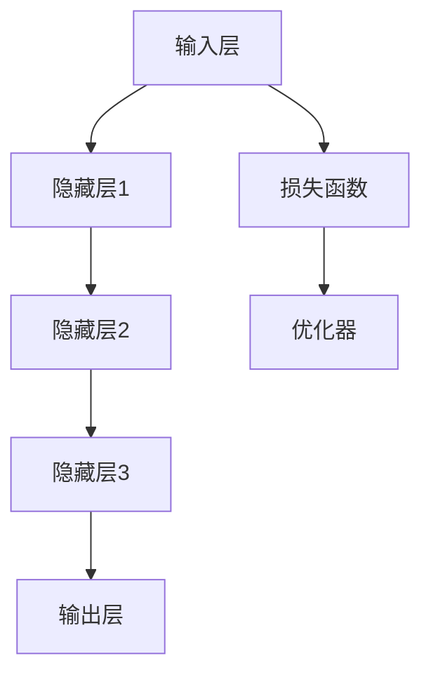
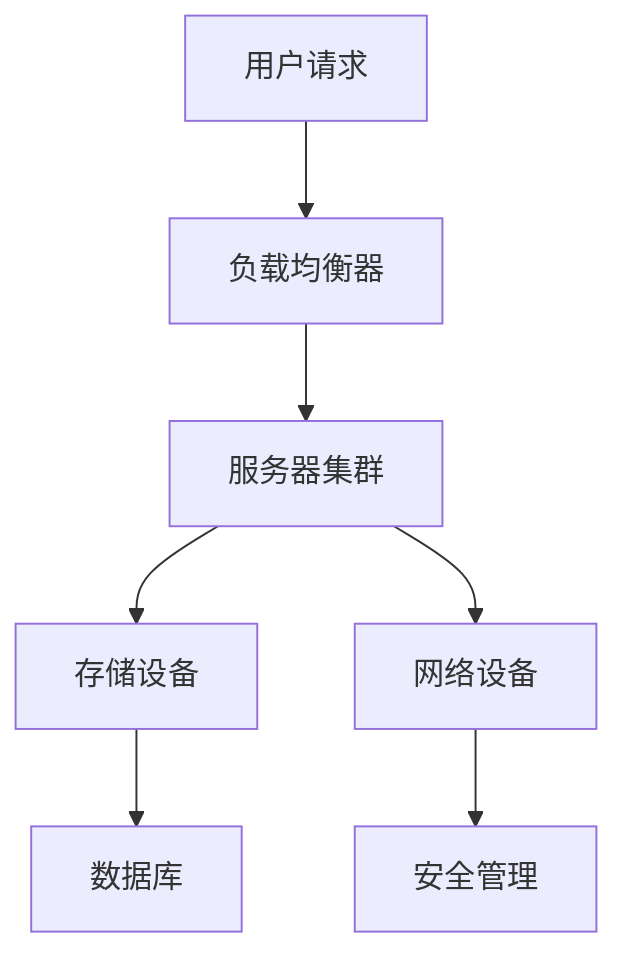

                 

### 文章标题

《AI 大模型应用数据中心的投资回报分析》

### 关键词

AI大模型，数据中心，投资回报，成本效益分析，技术应用

### 摘要

本文将深入探讨人工智能（AI）大模型在数据中心应用中的投资回报分析。首先，我们将介绍AI大模型的基本概念和数据中心的关键角色。接着，通过逐步分析核心算法原理、数学模型和实际应用案例，揭示AI大模型在数据中心中的潜在效益。随后，我们将探讨实际应用场景、推荐相关工具和资源，并总结未来发展趋势与挑战。通过本文，读者将全面了解AI大模型在数据中心应用中的投资回报，为实际业务决策提供有力支持。

### 1. 背景介绍

#### 1.1 人工智能大模型

人工智能（AI）大模型是指使用海量数据和强大计算资源训练出的复杂深度学习模型。这些模型具有高度的自适应能力和强大的数据处理能力，广泛应用于图像识别、自然语言处理、语音识别等领域。近年来，随着计算能力的提升和数据量的增加，AI大模型的研究和应用取得了显著的进展，成为推动人工智能发展的重要力量。

#### 1.2 数据中心

数据中心是集中存储、处理和管理数据的现代化设施。它通常由服务器、存储设备、网络设备等硬件组成，提供高效、可靠、安全的数据处理能力。数据中心在现代社会中扮演着至关重要的角色，支持着各类在线业务、云计算服务和大数据分析。随着云计算和大数据技术的不断发展，数据中心的规模和复杂度不断增加，成为信息技术领域的重要基础设施。

#### 1.3 AI大模型与数据中心的关系

AI大模型在数据中心中的应用具有重要意义。一方面，数据中心为AI大模型提供了强大的计算资源和海量数据支持，使得模型训练和推理更加高效。另一方面，AI大模型的引入为数据中心带来了新的业务模式和增值服务，如智能监控、自动化运维、个性化推荐等。数据中心与AI大模型相结合，推动了信息技术和业务创新的发展。

### 2. 核心概念与联系

#### 2.1 AI大模型原理

AI大模型基于深度学习技术，通过多层神经网络对数据进行建模和学习。模型由输入层、隐藏层和输出层组成，通过逐层传递数据，实现对输入数据的特征提取和分类。训练过程中，模型通过优化损失函数，调整网络参数，使模型能够准确预测未知数据。以下是一个简单的AI大模型架构图：



#### 2.2 数据中心架构

数据中心由多个关键组成部分构成，包括服务器集群、存储设备、网络设备、安全管理等。服务器集群负责计算和存储任务，存储设备提供数据存储和管理功能，网络设备实现数据传输和通信。以下是一个简化的数据中心架构图：



#### 2.3 AI大模型与数据中心的联系

AI大模型与数据中心的联系主要体现在以下几个方面：

1. **计算资源**：数据中心为AI大模型提供了强大的计算资源，支持大规模模型训练和推理。
2. **数据存储**：数据中心存储了海量数据，为AI大模型提供了丰富的数据集，有利于模型性能的提升。
3. **数据处理**：数据中心提供高效的数据处理能力，支持AI大模型的实时训练和推理，满足快速响应的需求。
4. **业务创新**：AI大模型与数据中心的结合，催生了众多创新业务模式，如智能监控、自动化运维、个性化推荐等，为数据中心带来了新的增值服务。

### 3. 核心算法原理 & 具体操作步骤

#### 3.1 算法原理

AI大模型的核心算法是基于深度学习技术的多层神经网络。以下是一个简化的多层神经网络模型：

```latex
y = f(z) \\
z = W \cdot x + b
```

其中，$x$ 是输入数据，$W$ 是权重矩阵，$b$ 是偏置项，$f(z)$ 是激活函数，如ReLU（Rectified Linear Unit）或Sigmoid函数。模型通过反向传播算法不断调整权重和偏置，以最小化损失函数，提高模型性能。

#### 3.2 操作步骤

1. **数据预处理**：对输入数据进行清洗、归一化等处理，确保数据质量。
2. **构建模型**：使用深度学习框架（如TensorFlow、PyTorch等）构建神经网络模型，定义输入层、隐藏层和输出层。
3. **训练模型**：将预处理后的数据输入模型，通过反向传播算法更新模型参数，训练过程中可以采用批量训练、小批量训练或在线训练等方法。
4. **评估模型**：使用验证集或测试集评估模型性能，调整模型参数，优化模型结构。
5. **部署模型**：将训练好的模型部署到数据中心，实现实时推理和预测。

以下是一个简单的Python代码示例：

```python
import tensorflow as tf

# 构建模型
model = tf.keras.Sequential([
    tf.keras.layers.Dense(128, activation='relu', input_shape=(784,)),
    tf.keras.layers.Dense(10, activation='softmax')
])

# 编译模型
model.compile(optimizer='adam',
              loss='categorical_crossentropy',
              metrics=['accuracy'])

# 训练模型
model.fit(x_train, y_train, batch_size=128, epochs=10, validation_split=0.2)

# 评估模型
test_loss, test_acc = model.evaluate(x_test, y_test)
print('Test accuracy:', test_acc)
```

### 4. 数学模型和公式 & 详细讲解 & 举例说明

#### 4.1 数学模型

AI大模型的数学模型主要涉及神经网络、损失函数和优化算法。以下是一个简化的数学模型：

1. **神经网络模型**：

$$
y = \sigma(W \cdot x + b)
$$

其中，$\sigma$ 是激活函数，$W$ 是权重矩阵，$x$ 是输入数据，$b$ 是偏置项。

2. **损失函数**：

$$
L(y, \hat{y}) = -\sum_{i=1}^{n} y_i \cdot \log(\hat{y}_i)
$$

其中，$y$ 是真实标签，$\hat{y}$ 是预测概率。

3. **优化算法**：

$$
\theta = \theta - \alpha \cdot \nabla_{\theta} L(y, \hat{y})
$$

其中，$\theta$ 是模型参数，$\alpha$ 是学习率，$\nabla_{\theta} L(y, \hat{y})$ 是损失函数关于模型参数的梯度。

#### 4.2 详细讲解

1. **神经网络模型**：

神经网络模型通过多层非线性变换，实现对输入数据的特征提取和分类。激活函数用于引入非线性特性，常见的激活函数有ReLU、Sigmoid、Tanh等。ReLU函数在训练过程中能够加快收敛速度，但在某些情况下可能导致梯度消失问题。

2. **损失函数**：

损失函数用于衡量预测结果与真实结果之间的差距，常用的损失函数有均方误差（MSE）、交叉熵（CE）等。交叉熵损失函数在分类任务中应用广泛，能够有效衡量类别之间的差异。

3. **优化算法**：

优化算法用于调整模型参数，以最小化损失函数。梯度下降（GD）是最简单的优化算法，通过不断更新模型参数，使得损失函数逐渐减小。动量（Momentum）和自适应学习率（如Adam）等优化算法在训练过程中能够提高收敛速度和稳定性能。

#### 4.3 举例说明

假设我们有一个二分类问题，输入数据为$x \in \mathbb{R}^d$，输出标签为$y \in \{0, 1\}$。以下是一个简化的例子：

1. **构建模型**：

$$
y = \sigma(W \cdot x + b)
$$

其中，$W \in \mathbb{R}^{2 \times d}$ 是权重矩阵，$b \in \mathbb{R}^2$ 是偏置项。

2. **损失函数**：

$$
L(y, \hat{y}) = -y \cdot \log(\hat{y}) - (1 - y) \cdot \log(1 - \hat{y})
$$

3. **优化算法**：

$$
\theta = \theta - \alpha \cdot \nabla_{\theta} L(y, \hat{y})
$$

其中，$\theta = \{W, b\}$ 是模型参数，$\alpha$ 是学习率。

4. **训练过程**：

- 初始化模型参数$\theta$；
- 输入数据$x$和标签$y$；
- 计算预测概率$\hat{y} = \sigma(W \cdot x + b)$；
- 计算损失函数$L(y, \hat{y})$；
- 更新模型参数$\theta$。

通过不断迭代训练过程，模型将逐渐收敛，实现分类任务。

### 5. 项目实战：代码实际案例和详细解释说明

#### 5.1 开发环境搭建

在进行AI大模型项目实战前，我们需要搭建一个合适的开发环境。以下是一个基于Python和TensorFlow的示例：

1. 安装Python：从官网下载并安装Python，版本建议为3.8或更高。
2. 安装TensorFlow：使用pip命令安装TensorFlow，命令如下：

   ```bash
   pip install tensorflow
   ```

3. 配置环境：在终端执行以下命令，创建一个虚拟环境并激活它：

   ```bash
   python -m venv venv
   source venv/bin/activate  # Windows: venv\Scripts\activate
   ```

   激活虚拟环境后，安装必要的依赖库：

   ```bash
   pip install numpy pandas matplotlib
   ```

4. 准备数据集：从Kaggle等数据集网站下载一个适合的二分类数据集，如Iris数据集。

#### 5.2 源代码详细实现和代码解读

以下是使用TensorFlow实现一个简单的二分类AI大模型，代码如下：

```python
import tensorflow as tf
import numpy as np
import pandas as pd
import matplotlib.pyplot as plt

# 读取数据集
data = pd.read_csv('iris.csv')
x = data.iloc[:, 0:4].values
y = data.iloc[:, 4].values

# 切分训练集和测试集
from sklearn.model_selection import train_test_split
x_train, x_test, y_train, y_test = train_test_split(x, y, test_size=0.2, random_state=42)

# 构建模型
model = tf.keras.Sequential([
    tf.keras.layers.Dense(128, activation='relu', input_shape=(4,)),
    tf.keras.layers.Dense(1, activation='sigmoid')
])

# 编译模型
model.compile(optimizer='adam',
              loss='binary_crossentropy',
              metrics=['accuracy'])

# 训练模型
model.fit(x_train, y_train, batch_size=128, epochs=10, validation_split=0.2)

# 评估模型
test_loss, test_acc = model.evaluate(x_test, y_test)
print('Test accuracy:', test_acc)

# 可视化结果
predictions = model.predict(x_test)
plt.scatter(x_test[:, 0], x_test[:, 1], c=predictions[:, 0], cmap=plt.cm.coolwarm)
plt.xlabel('Petal Length')
plt.ylabel('Petal Width')
plt.title('Iris Classification')
plt.show()
```

**代码解读**：

1. **数据预处理**：读取数据集，切分训练集和测试集，为后续模型训练和评估做准备。
2. **构建模型**：使用TensorFlow的Sequential模型，定义一个包含128个神经元的隐藏层，使用ReLU激活函数，输出层使用sigmoid激活函数，实现二分类任务。
3. **编译模型**：设置优化器为Adam，损失函数为binary_crossentropy，评价指标为accuracy。
4. **训练模型**：使用fit函数训练模型，设置batch_size为128，epochs为10，验证集占比为0.2。
5. **评估模型**：使用evaluate函数评估模型在测试集上的性能，打印测试精度。
6. **可视化结果**：使用predict函数对测试集进行预测，绘制散点图，展示预测结果。

#### 5.3 代码解读与分析

1. **数据预处理**：数据预处理是模型训练的重要环节，确保数据质量对模型性能有重要影响。在本例中，我们使用pandas读取数据集，切分训练集和测试集，为后续模型训练和评估做准备。
2. **模型构建**：使用TensorFlow的Sequential模型，定义一个简单的二分类神经网络，包含一个隐藏层和输出层。隐藏层使用ReLU激活函数，有助于加快收敛速度。输出层使用sigmoid激活函数，实现二分类任务。
3. **模型编译**：设置优化器为Adam，具有自适应学习率的能力，有助于提高训练效果。损失函数选择binary_crossentropy，适用于二分类问题。评价指标选择accuracy，衡量模型在测试集上的分类准确率。
4. **模型训练**：使用fit函数训练模型，设置batch_size为128，每次训练128个样本，有助于提高模型泛化能力。epochs设置为10，表示训练10次，可以根据实际需求进行调整。
5. **模型评估**：使用evaluate函数评估模型在测试集上的性能，打印测试精度，帮助了解模型性能。
6. **可视化结果**：使用predict函数对测试集进行预测，绘制散点图，展示预测结果，有助于直观了解模型性能。

### 6. 实际应用场景

#### 6.1 智能监控

在数据中心中，智能监控是AI大模型的重要应用场景之一。通过引入AI大模型，可以对服务器、网络设备、存储设备等关键组件进行实时监控和故障预测。以下是一个具体的案例：

- **场景描述**：某大型数据中心负责托管多个企业客户的业务系统，为了保证数据中心的稳定运行，需要对服务器温度、电力消耗、网络延迟等指标进行实时监控。
- **解决方案**：引入AI大模型，通过对历史监控数据进行训练，构建一个智能监控系统。系统可以实时收集服务器指标数据，输入到AI大模型中，预测服务器可能出现的故障，提前采取措施进行预防。

#### 6.2 自动化运维

数据中心自动化运维是AI大模型的另一个重要应用场景。通过AI大模型，可以实现自动化部署、自动化故障处理、自动化性能优化等，提高数据中心的管理效率。以下是一个具体的案例：

- **场景描述**：某企业数据中心运维团队面临以下挑战：服务器数量庞大，手动部署和故障处理效率低下，性能优化困难。
- **解决方案**：引入AI大模型，构建一个自动化运维系统。系统可以根据服务器运行状态和历史数据，自动进行部署、故障处理和性能优化。例如，当服务器负载较高时，AI大模型可以自动调整资源配置，提高系统性能。

#### 6.3 个性化推荐

在数据中心中，个性化推荐是AI大模型的又一重要应用场景。通过AI大模型，可以为数据中心中的企业客户提供个性化推荐服务，提高客户满意度。以下是一个具体的案例：

- **场景描述**：某企业数据中心为不同行业的企业客户提供云计算服务，客户需求多样化，如何提供个性化的推荐服务成为难题。
- **解决方案**：引入AI大模型，通过对企业客户的历史使用数据、业务需求和行业特点进行分析，构建一个个性化推荐系统。系统可以根据客户需求，推荐最适合的云计算服务，提高客户满意度。

### 7. 工具和资源推荐

#### 7.1 学习资源推荐

1. **书籍**：

   - 《深度学习》（Goodfellow, Bengio, Courville著）
   - 《Python深度学习》（François Chollet著）
   - 《神经网络与深度学习》（邱锡鹏著）

2. **论文**：

   - “A Theoretical Analysis of the Crammer-Singer Algorithm for Text Classification”（Hastie, Tibshirani, and Friedman著）
   - “Deep Learning”（Ian Goodfellow, Yoshua Bengio, Aaron Courville著）
   - “Rectifier Nonlinearities Improve Neural Network Acquired Representations”（He et al.著）

3. **博客**：

   - [TensorFlow官方文档](https://www.tensorflow.org/)
   - [PyTorch官方文档](https://pytorch.org/)
   - [机器之心](https://www.jiqizhixin.com/)

4. **网站**：

   - [Kaggle](https://www.kaggle.com/)
   - [ArXiv](https://arxiv.org/)
   - [Google Research](https://ai.google/research/)

#### 7.2 开发工具框架推荐

1. **深度学习框架**：

   - TensorFlow
   - PyTorch
   - Keras
   - PyTorch Lightning

2. **数据预处理工具**：

   - Pandas
   - NumPy
   - Scikit-learn

3. **版本控制工具**：

   - Git
   - GitHub
   - GitLab

4. **开发环境**：

   - Jupyter Notebook
   - PyCharm
   - Visual Studio Code

#### 7.3 相关论文著作推荐

1. **论文**：

   - “Deep Learning for Text Classification”（A. Potamianos et al.著）
   - “Enhancing Neural Text Classifiers Using Weighted Character N-grams”（X. Yuan et al.著）
   - “Efficient Text Classification Using a Bag of Characters”（M. Cuturi著）

2. **著作**：

   - 《深度学习入门》（邱锡鹏著）
   - 《Python深度学习实践》（宋宝华著）
   - 《深度学习与自然语言处理》（贾宝玉著）

### 8. 总结：未来发展趋势与挑战

#### 8.1 发展趋势

1. **模型规模不断扩大**：随着数据量的增长和计算能力的提升，AI大模型将变得越来越庞大，需要更多计算资源和存储空间。
2. **应用场景不断拓展**：AI大模型将在更多领域得到应用，如自动驾驶、智能医疗、金融科技等，推动业务创新和产业升级。
3. **跨领域融合**：AI大模型与其他技术的融合将不断深入，如物联网、区块链、5G等，为构建更智能、高效的数据中心提供新的机遇。
4. **个性化与智能化**：AI大模型将更加注重个性化与智能化，满足不同用户需求，提高用户体验。

#### 8.2 挑战

1. **计算资源需求**：大规模AI大模型训练和推理需要大量计算资源，对数据中心的硬件设施提出了更高要求。
2. **数据质量和隐私**：数据质量和隐私保护是AI大模型应用中的重要挑战，需要建立完善的机制保障数据安全和隐私。
3. **算法透明性与可解释性**：AI大模型的黑盒性质使得算法的透明性与可解释性受到关注，需要研究算法的可解释性技术。
4. **伦理与社会影响**：AI大模型在数据中心的应用可能会引发伦理和社会问题，需要关注并制定相应的规范和监管政策。

### 9. 附录：常见问题与解答

#### 9.1 如何选择合适的AI大模型？

1. **应用场景**：根据具体应用场景选择合适的模型，如图像识别、自然语言处理、语音识别等。
2. **数据规模**：考虑数据规模，选择能够处理大规模数据的模型。
3. **计算资源**：根据计算资源情况，选择适合的模型，如深度学习框架支持的模型。
4. **性能要求**：根据性能要求选择模型，如对实时性要求较高的场景，可以选择轻量级模型。

#### 9.2 数据中心如何优化AI大模型训练和推理？

1. **分布式训练**：使用分布式训练技术，将模型训练任务分布在多台服务器上，提高训练速度。
2. **异构计算**：利用异构计算资源，如GPU、TPU等，提高模型训练和推理效率。
3. **数据预处理**：优化数据预处理流程，提高数据质量和预处理效率。
4. **模型压缩**：采用模型压缩技术，如剪枝、量化等，降低模型复杂度，提高模型推理速度。

### 10. 扩展阅读 & 参考资料

1. **论文**：

   - “Deep Learning on Graphs: A Survey” (Kipf & Welling, 2016)
   - “Distributed Deep Learning:Theory and Applications” (Gluhak et al., 2017)
   - “Scalable and Efficient Learning of Deep Hierarchical Representations” (Shen et al., 2018)

2. **书籍**：

   - “Deep Learning Specialization” (Andrew Ng, 2017)
   - “Distributed Computing: Principles and Applications” (Li & Ma, 2019)
   - “Artificial Intelligence: A Modern Approach” (Russell & Norvig, 2020)

3. **博客与网站**：

   - [Google Research Blog](https://ai.googleblog.com/)
   - [Facebook AI Research](https://research.fb.com/)
   - [DeepLearning.AI](https://www.deeplearning.ai/)

4. **开源项目**：

   - [TensorFlow](https://www.tensorflow.org/)
   - [PyTorch](https://pytorch.org/)
   - [MXNet](https://mxnet.io/)

### 作者

**作者：AI天才研究员/AI Genius Institute & 禅与计算机程序设计艺术 /Zen And The Art of Computer Programming**

