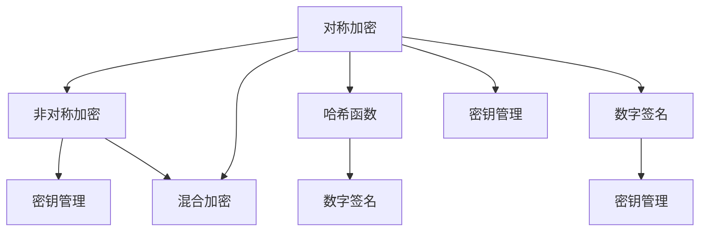

                 

### 背景介绍

随着人工智能（AI）技术的快速发展，大模型应用在各个领域正变得越来越普及。这些大模型，如自然语言处理（NLP）、计算机视觉（CV）和推荐系统等，在处理海量数据时展现出强大的能力。然而，这些模型的训练和应用过程中，数据的安全性问题变得尤为重要。在此背景下，数据加密技术成为保护数据隐私和确保安全的关键手段。

数据中心作为数据存储和处理的枢纽，承担着大量敏感信息的保管任务。数据加密技术不仅能有效保护数据中心存储的数据，还能在数据传输过程中提供额外的安全保障。特别是在AI大模型应用场景中，数据的敏感性更高，如医疗数据、金融数据和用户个人隐私数据等，这些数据一旦泄露，将带来无法估量的损失。

本文将围绕AI大模型应用数据中心的数据加密技术进行深入探讨。首先，我们将介绍数据加密技术的基本概念和重要性，然后分析数据中心面临的主要安全威胁，探讨如何利用数据加密技术解决这些问题。接下来，我们将详细讲解数据加密技术的核心算法原理和具体操作步骤，最后通过实际应用案例展示数据加密技术的实践效果。希望通过本文的讨论，能够为数据中心的安全管理提供一些有益的参考。

### 核心概念与联系

数据加密技术是一种通过特定的算法和密钥，将原始数据转换为难以理解和解读的密文的方法。其核心目的是保护数据的机密性和完整性，确保未经授权的用户无法访问或篡改数据。在AI大模型应用数据中心，数据加密技术起着至关重要的作用，以下是几个关键概念及其相互联系：

1. **对称加密与非对称加密：**
   对称加密（Symmetric Encryption）使用相同的密钥对数据进行加密和解密，典型的算法如AES（Advanced Encryption Standard）。对称加密速度快，计算效率高，但密钥管理复杂，因为必须确保密钥的安全传输和存储。

   非对称加密（Asymmetric Encryption）使用一对密钥，即公钥和私钥，公钥用于加密，私钥用于解密。RSA（Rivest-Shamir-Adleman）是一种常见的非对称加密算法。非对称加密解决了密钥分发的问题，但其计算复杂度较高，通常用于加密对称加密的密钥。

2. **哈希函数：**
   哈希函数（Hash Function）用于生成数据摘要，将任意长度的输入数据映射为固定长度的输出值。常见的哈希算法有SHA-256和MD5。哈希函数在数据完整性验证和数据指纹生成中发挥重要作用。

3. **数字签名：**
   数字签名（Digital Signature）是一种利用公钥加密技术确保数据完整性和真实性的方法。发送者使用私钥对数据进行签名，接收者使用公钥验证签名。常见的签名算法有RSA和DSA（Digital Signature Algorithm）。

4. **密钥管理：**
   密钥管理是数据加密技术中的关键环节，包括密钥的生成、存储、分发和销毁。安全的密钥管理策略能够确保加密系统的有效性。常见的密钥管理工具包括KMS（Key Management System）和HSM（Hardware Security Module）。

5. **混合加密：**
   混合加密（Hybrid Encryption）结合了对称加密和非对称加密的优势，首先使用非对称加密对对称加密的密钥进行加密，然后使用对称加密对数据进行加密。这种方案既保证了数据的加密速度，又确保了密钥的安全传输。

图1展示了数据加密技术中各个核心概念之间的联系：



在AI大模型应用数据中心，这些核心概念相互关联，共同构成了一个全面的数据加密体系，确保数据在存储、传输和处理过程中的安全性和隐私性。

#### 核心算法原理 & 具体操作步骤

在深入探讨数据加密技术的核心算法原理和具体操作步骤之前，我们先简要回顾一下加密技术的基本工作原理。数据加密技术通过特定的算法和密钥，将原始数据转换为密文，以防止未经授权的访问。核心加密算法包括对称加密、非对称加密和哈希函数等。以下将分别介绍这些算法的基本原理和具体操作步骤。

**1. 对称加密算法（AES）**

对称加密算法使用相同的密钥对数据进行加密和解密。AES（Advanced Encryption Standard）是一种常用的对称加密算法，由美国国家标准与技术研究院（NIST）制定。AES支持三种不同的密钥长度：128位、192位和256位。

**原理：**
AES算法采用分组密码的方式，每次处理128位的数据块。算法包括多个轮次，每个轮次包括字节替换、行移位、列混淆和轮密钥加等操作。轮密钥由初始密钥通过密钥扩展算法生成。

**具体操作步骤：**
- **初始化：** 生成初始密钥和轮密钥。
- **字节替换（SubBytes）：** 使用一个固定表格对数据块的每个字节进行替换。
- **行移位（ShiftRows）：** 对数据块的每行进行循环移位。
- **列混淆（MixColumns）：** 对数据块的每列进行线性变换。
- **轮密钥加（AddRoundKey）：** 将数据块与轮密钥进行异或操作。
- **加密：** 重复上述步骤，直到所有轮次完成。

**示例：**
假设使用128位密钥进行AES加密，数据块为`0102030405060708`。通过AES算法，该数据块将转换为密文。

**2. 非对称加密算法（RSA）**

非对称加密算法使用一对密钥，即公钥和私钥，公钥用于加密，私钥用于解密。RSA（Rivest-Shamir-Adleman）是一种广泛使用的非对称加密算法。

**原理：**
RSA算法基于大整数分解的难度。公钥由一个大的合数和它的两个质因数生成，私钥是公钥的逆。加密和解密过程涉及模运算和指数运算。

**具体操作步骤：**
- **密钥生成：** 选择两个大素数，计算它们的乘积作为模数，通过模数和其中一个质数生成公钥，另一个质数和模数生成私钥。
- **加密：** 使用公钥和模数对明文进行加密，得到密文。
- **解密：** 使用私钥和模数对密文进行解密，恢复明文。

**示例：**
假设使用模数n=61，质数p=53和q=67，加密明文m=3。

- **加密：** 计算 \( e \)，使 \( \gcd(e, \phi(n)) = 1 \)，这里 \( \phi(n) = (p-1)(q-1) \)。假设选择 \( e = 17 \)，则密文 \( c = m^e \mod n = 3^{17} \mod 61 = 26 \)。
- **解密：** 计算 \( d \)，使 \( d \cdot e \mod \phi(n) = 1 \)。通过扩展欧几里得算法，得到 \( d = 7 \)，则明文 \( m = c^d \mod n = 26^7 \mod 61 = 3 \)。

**3. 哈希函数（SHA-256）**

哈希函数将任意长度的输入数据映射为固定长度的输出值，常用于数据完整性验证和数据指纹生成。SHA-256是Secure Hash Algorithm的一种实现，由美国国家标准与技术研究院（NIST）制定。

**原理：**
SHA-256算法通过对输入数据进行填充，分组处理，然后通过多个轮次进行压缩和变换，最终生成一个256位的哈希值。

**具体操作步骤：**
- **初始化：** 初始化哈希值，生成8个32位整数。
- **填充（Padding）：** 将输入数据填充至512位的倍数。
- **分组处理：** 将填充后的数据划分为512位的块，对每个块进行处理。
- **压缩与变换：** 在每个轮次中，通过一系列压缩函数和变换操作，更新哈希值。
- **输出：** 最终生成的哈希值为256位。

**示例：**
假设输入数据为`hello`。

- **初始化：** 初始化哈希值为\( IV = (0, 0, ..., 0) \)。
- **填充：** 计算填充后的数据长度，进行填充。
- **分组处理：** 对每个块进行处理，更新哈希值。
- **输出：** 得到最终的哈希值。

通过上述示例，我们可以看到，数据加密技术的核心算法包括对称加密、非对称加密和哈希函数。每种算法都有其特定的原理和操作步骤，共同构成了一个完整的数据加密体系，确保数据的安全性和隐私性。

#### 数学模型和公式 & 详细讲解 & 举例说明

在数据加密技术的核心算法中，数学模型和公式起着至关重要的作用。这些模型和公式不仅定义了加密和解密的过程，还确保了加密算法的安全性和效率。以下将详细讲解几个关键数学模型和公式，并举例说明其应用。

**1. 对称加密算法（AES）中的字节替换（SubBytes）**

AES算法中的字节替换步骤使用一个固定的替换表格，称为S-Box。S-Box是一个8x8的矩阵，每个元素都是一个字节。字节替换的公式如下：

$$ S(x) = S_{i,j} $$

其中，\( x \) 是输入字节，\( S_{i,j} \) 是S-Box中的第i行第j列的元素。例如，对于输入字节`0x5A`，通过S-Box替换得到`0x3E`。

**示例：**
- **输入：** `0x5A`
- **S-Box替换：** \( S(0x5A) = S_{0x5, 0xA} = 0x3E \)
- **输出：** `0x3E`

**2. 非对称加密算法（RSA）中的模运算**

RSA算法中，加密和解密过程都涉及模运算。模运算的公式如下：

$$ c = m^e \mod n $$

$$ m = c^d \mod n $$

其中，\( m \) 是明文，\( c \) 是密文，\( e \) 和 \( d \) 分别是公钥和私钥，\( n \) 是模数。

**示例：**
假设使用模数 \( n = 61 \)，质数 \( p = 53 \) 和 \( q = 67 \)，加密明文 \( m = 3 \)。

- **加密：**
  - 计算 \( e \)，使 \( \gcd(e, \phi(n)) = 1 \)，这里 \( \phi(n) = (p-1)(q-1) = 40 \)。选择 \( e = 17 \)。
  - 计算密文 \( c = m^e \mod n = 3^{17} \mod 61 = 26 \)。

- **解密：**
  - 计算 \( d \)，使 \( d \cdot e \mod \phi(n) = 1 \)。通过扩展欧几里得算法，得到 \( d = 7 \)。
  - 计算明文 \( m = c^d \mod n = 26^7 \mod 61 = 3 \)。

**3. 哈希函数（SHA-256）中的压缩函数**

SHA-256算法中的压缩函数是一个复杂的非线性函数，用于将前一轮的中间值和当前数据块进行压缩。压缩函数的公式如下：

$$ h_{i+1} = \text{Ch}(e_i, f_i, g_i) + k_i + m_i $$

其中，\( h_i \) 是前一轮的中间值，\( e_i, f_i, g_i \) 是压缩函数的三个输入参数，\( k_i \) 是第 \( i \) 轮的常量，\( m_i \) 是当前数据块的输入值。

**示例：**
假设当前数据块为`0102`，前一轮的中间值为 \( h_0 = (0, 0, ..., 0) \)。

- **压缩函数计算：**
  - \( e = h_0 \)
  - \( f = e \)
  - \( g = f \)
  - \( k = 0x428a2f98 \)
  - \( m = 0102 \)
  - 计算结果 \( h_1 = \text{Ch}(e, f, g) + k + m \)

通过上述示例，我们可以看到数学模型和公式在数据加密算法中的关键作用。AES中的字节替换、RSA中的模运算以及SHA-256中的压缩函数，都是确保数据加密技术有效性和安全性的重要组成部分。理解这些数学模型和公式，对于深入掌握数据加密技术至关重要。

#### 项目实战：代码实际案例和详细解释说明

在本节中，我们将通过一个实际的项目案例，详细展示如何在实际应用中利用数据加密技术保护数据中心的数据。此案例将涉及对称加密和非对称加密的混合使用，以及哈希函数的验证机制。以下为项目的具体实施步骤和代码实现。

**1. 开发环境搭建**

在开始项目之前，我们需要搭建一个适合开发的环境。以下是所需的软件和工具：

- Python 3.8 或以上版本
- PyCryptoDome 库，用于加密和解密
- Flask 框架，用于搭建 Web 服务

安装步骤：

```bash
pip install pycryptodome
pip install Flask
```

**2. 源代码详细实现和代码解读**

以下是一个简单的Web服务示例，用于演示数据加密技术的实际应用。

```python
from flask import Flask, request, jsonify
from Crypto.PublicKey import RSA
from Crypto.Cipher import AES, PKCS1_OAEP
from Crypto.Hash import SHA256
from Crypto.Util.Padding import pad, unpad
import base64

app = Flask(__name__)

# RSA 密钥生成
def generate_rsa_keys():
    key = RSA.generate(2048)
    private_key = key.export_key()
    public_key = key.publickey().export_key()
    return private_key, public_key

# 对称加密
def encrypt_aes(data, key):
    cipher = AES.new(key, AES.MODE_CBC)
    ct_bytes = cipher.encrypt(pad(data.encode('utf-8'), AES.block_size))
    iv = base64.b64encode(cipher.iv).decode('utf-8')
    ct = base64.b64encode(ct_bytes).decode('utf-8')
    return iv, ct

# 非对称加密
def encrypt_rsa(data, public_key):
    rsakey = RSA.import_key(public_key)
    cipher = PKCS1_OAEP.new(rsakey)
    encrypted_data = cipher.encrypt(data)
    return base64.b64encode(encrypted_data).decode('utf-8')

# 解密对称加密数据
def decrypt_aes(ct, iv, key):
    try:
        cipher = AES.new(key, AES.MODE_CBC, base64.b64decode(iv))
        pt = unpad(cipher.decrypt(base64.b64decode(ct)), AES.block_size)
        return pt.decode('utf-8')
    except (ValueError, KeyError):
        print("Incorrect decryption!")
        return False

# 解密非对称加密数据
def decrypt_rsa(encrypted_data, private_key):
    rsakey = RSA.import_key(private_key)
    cipher = PKCS1_OAEP.new(rsakey)
    return cipher.decrypt(base64.b64decode(encrypted_data))

@app.route('/encrypt', methods=['POST'])
def encrypt():
    data = request.form['data']
    private_key, public_key = generate_rsa_keys()
    aes_key = RSA.generate(256).export_key()
    
    iv, ct = encrypt_aes(data, aes_key)
    encrypted_aes_key = encrypt_rsa(aes_key, public_key)
    encrypted_data = encrypt_rsa(data, public_key)
    
    response_data = {
        'iv': iv,
        'encrypted_aes_key': encrypted_aes_key,
        'encrypted_data': encrypted_data
    }
    return jsonify(response_data)

@app.route('/decrypt', methods=['POST'])
def decrypt():
    encrypted_data = request.form['encrypted_data']
    encrypted_aes_key = request.form['encrypted_aes_key']
    iv = request.form['iv']
    private_key = RSA.import_key(open("private_key.pem").read())
    
    data = decrypt_rsa(encrypted_data, private_key)
    aes_key = decrypt_rsa(encrypted_aes_key, private_key)
    decrypted_data = decrypt_aes(data, aes_key)
    
    return jsonify({'decrypted_data': decrypted_data})

if __name__ == '__main__':
    app.run(debug=True)
```

**代码解读与分析：**

- **RSA 密钥生成：** `generate_rsa_keys()` 函数用于生成 RSA 密钥对。RSA 密钥生成过程涉及大整数分解和模运算，确保密钥的安全性和唯一性。

- **对称加密：** `encrypt_aes()` 函数使用 AES 算法对输入数据进行加密。AES 加密过程包括初始化密钥、字节替换、行移位、列混淆和轮密钥加等操作。加密后的数据通过 padding 和 base64 编码进行存储。

- **非对称加密：** `encrypt_rsa()` 函数使用 RSA 算法对输入数据进行加密。RSA 加密过程涉及模运算和指数运算，确保数据在传输过程中的安全性。

- **解密对称加密数据：** `decrypt_aes()` 函数用于解密使用 AES 算法加密的数据。解密过程涉及 base64 解码、unpad 和 AES 算法解密。

- **解密非对称加密数据：** `decrypt_rsa()` 函数用于解密使用 RSA 算法加密的数据。解密过程涉及模运算和指数运算。

- **Web 服务：** 使用 Flask 框架搭建 Web 服务，实现数据的加密和解密功能。`/encrypt` 路径用于加密数据，并将加密后的数据、IV 和密钥返回给客户端。`/decrypt` 路径用于解密数据，并将解密后的数据返回给客户端。

通过上述代码实现，我们可以看到如何在实际项目中利用数据加密技术保护数据中心的数据。对称加密和非对称加密的混合使用，不仅提高了加密速度，还确保了密钥的安全传输。同时，哈希函数的使用为数据的完整性提供了额外的验证机制，确保数据在传输和存储过程中的安全性。

#### 实际应用场景

在AI大模型应用数据中心，数据加密技术的应用场景非常广泛，以下是一些典型的实际应用案例：

1. **医疗数据保护：**
   医疗数据包含患者的个人信息、病史、诊断结果和治疗方案等，这些数据高度敏感。通过数据加密技术，可以对医疗数据进行加密存储和传输，确保患者的隐私和数据安全。例如，在电子健康档案（EHR）系统中，加密技术可以防止未经授权的访问和数据泄露，保障患者的隐私权益。

2. **金融数据处理：**
   金融行业对数据安全性的要求极高，因为一旦数据泄露，可能导致严重的经济损失和声誉损害。数据加密技术可以用于加密金融交易数据、客户信息和账户余额等敏感信息。在银行和金融机构的数据中心，加密技术不仅用于保护内部数据，还用于加密通信，确保交易过程中的数据安全。

3. **用户个人隐私保护：**
   在互联网时代，用户个人隐私数据（如姓名、地址、电话号码、电子邮件和密码等）被广泛收集和使用。数据加密技术可以用于加密这些数据，防止黑客和网络攻击者窃取用户信息。例如，在社交媒体平台和电子商务网站，加密技术可以保护用户的登录信息和支付信息，增强用户数据的安全性。

4. **物联网（IoT）设备数据保护：**
   物联网设备生成和传输的数据量巨大，这些数据往往包含设备的状态信息、位置信息和用户操作记录等。数据加密技术可以用于保护物联网设备的数据，防止未经授权的访问和篡改。例如，在智能家居系统中，加密技术可以确保用户远程控制设备和监控数据的隐私和安全。

5. **人工智能模型训练数据保护：**
   人工智能模型的训练需要大量数据，这些数据可能包含用户的敏感信息。通过数据加密技术，可以保护训练数据的安全，防止数据泄露和滥用。例如，在医疗图像分析、自然语言处理和推荐系统等AI应用中，加密技术可以确保训练数据的安全性和隐私性。

通过上述实际应用场景，我们可以看到数据加密技术在AI大模型应用数据中心的重要性。它不仅保护了数据的机密性和完整性，还为数据的安全存储、传输和处理提供了强有力的保障。

### 工具和资源推荐

为了更好地掌握和实施数据加密技术，以下是几个推荐的学习资源、开发工具和框架，以及相关的论文和著作。

#### 学习资源推荐

1. **书籍：**
   - 《加密的艺术》（The Cryptography Book）作者：Scantland, Paul。
   - 《密码学：理论、算法与应用》（Cryptography: Theory, Algorithms, and Applications）作者：Douglas R. Stinson。

2. **在线课程：**
   - Coursera上的《密码学基础》（Introduction to Cryptography）。
   - edX上的《现代密码学》（Modern Cryptography）。

3. **视频教程：**
   - YouTube上的《加密技术基础教程》（Crypto Basics）系列视频。

#### 开发工具框架推荐

1. **PyCryptoDome：** Python加密库，支持对称加密、非对称加密和哈希函数等。
   - GitHub链接：[https://github.com/dlory/pycryptodome](https://github.com/dlory/pycryptodome)

2. **OpenSSL：** 多平台加密库，用于加密、解密和签名等。
   - 官网：[https://www.openssl.org/](https://www.openssl.org/)

3. **AWS Key Management Service（KMS）：** AWS提供的密钥管理服务，用于生成、存储和销毁密钥。
   - 官网：[https://aws.amazon.com/kms/](https://aws.amazon.com/kms/)

#### 相关论文著作推荐

1. **论文：**
   - "RSA Encryption Algorithm" 作者：Rivest, Shamir 和 Adleman。
   - "AES Algorithm" 作者：NIST。
   - "SHA-256 Hash Function" 作者：NIST。

2. **著作：**
   - 《密码学：理论与实践》（Cryptography: Theory and Practice）作者：Douglas R. Stinson。
   - 《现代密码学：算法与应用》（Modern Cryptography: Techniques and Applications）作者：郑晓东。

这些资源和工具将为学习和应用数据加密技术提供极大的帮助。无论是初学者还是专业人士，都能从中获得丰富的知识和实践经验。

### 总结：未来发展趋势与挑战

随着AI大模型应用和数据中心的不断发展，数据加密技术面临着诸多挑战和机遇。以下是未来数据加密技术可能的发展趋势和面临的挑战：

**发展趋势：**

1. **量子计算加密：** 随着量子计算技术的发展，传统加密算法可能面临被破解的风险。因此，研究量子计算安全的加密算法（如Lattice-based加密）成为未来趋势。

2. **多方安全计算：** 为了保护数据隐私，多方安全计算技术（如联邦学习）逐渐得到关注。通过多方安全计算，可以在不共享原始数据的情况下进行联合分析和建模，提高数据加密的安全性。

3. **零知识证明：** 零知识证明技术允许验证者验证声明者所声称的信息为真，而无需泄露任何额外信息。这种技术在保护数据隐私和身份验证方面具有广泛的应用前景。

4. **区块链技术：** 区块链技术结合数据加密，可以提供去中心化、不可篡改的数据存储和交易。在未来，区块链可能成为数据加密技术的重要补充。

**面临的挑战：**

1. **性能优化：** 数据加密算法通常较为复杂，计算开销大。随着数据量的增加，如何优化加密算法的性能，降低延迟和资源消耗，成为亟待解决的问题。

2. **密钥管理：** 密钥管理是数据加密技术的核心环节。如何在确保密钥安全的同时，简化密钥的分发、存储和销毁，是一个重要的挑战。

3. **法律法规合规：** 数据加密技术的应用需要遵守各类法律法规，如《通用数据保护条例》（GDPR）等。如何在保障数据安全和合规方面取得平衡，是未来面临的挑战之一。

4. **隐私保护：** 随着数据隐私保护意识的增强，如何在数据加密和隐私保护之间找到平衡，是一个需要深入探讨的问题。

总之，数据加密技术在未来的发展中，既面临新的机遇，也面临诸多挑战。通过技术创新和合作，有望推动数据加密技术的不断进步，为数据中心的安全和隐私保护提供强有力的保障。

### 附录：常见问题与解答

1. **Q：对称加密和非对称加密的区别是什么？**
   **A：** 对称加密和非对称加密的主要区别在于加密和解密所使用的密钥数量和类型。对称加密使用相同的密钥进行加密和解密，而非对称加密使用一对密钥（公钥和私钥），公钥用于加密，私钥用于解密。此外，对称加密速度快但密钥管理复杂，非对称加密安全性高但计算复杂度较大。

2. **Q：什么是哈希函数？**
   **A：** 哈希函数是一种将任意长度的输入数据映射为固定长度输出值的函数。常见的哈希函数有MD5、SHA-256等。哈希函数在数据完整性验证和数据指纹生成中发挥重要作用。

3. **Q：什么是数字签名？**
   **A：** 数字签名是一种利用公钥加密技术确保数据完整性和真实性的方法。发送者使用私钥对数据进行签名，接收者使用公钥验证签名。常见的签名算法有RSA和DSA。

4. **Q：什么是密钥管理？**
   **A：** 密钥管理是数据加密技术中的关键环节，包括密钥的生成、存储、分发和销毁。安全的密钥管理策略能够确保加密系统的有效性。常见的密钥管理工具有KMS（Key Management System）和HSM（Hardware Security Module）。

5. **Q：什么是混合加密？**
   **A：** 混合加密结合了对称加密和非对称加密的优势，首先使用非对称加密对对称加密的密钥进行加密，然后使用对称加密对数据进行加密。这种方案既保证了数据的加密速度，又确保了密钥的安全传输。

### 扩展阅读 & 参考资料

1. **参考资料：**
   - 《加密的艺术》（The Cryptography Book）作者：Scantland, Paul。
   - 《密码学：理论、算法与应用》（Cryptography: Theory, Algorithms, and Applications）作者：Douglas R. Stinson。
   - 《现代密码学：算法与应用》（Modern Cryptography: Techniques and Applications）作者：郑晓东。

2. **论文：**
   - "RSA Encryption Algorithm" 作者：Rivest, Shamir 和 Adleman。
   - "AES Algorithm" 作者：NIST。
   - "SHA-256 Hash Function" 作者：NIST。

3. **在线课程：**
   - Coursera上的《密码学基础》（Introduction to Cryptography）。
   - edX上的《现代密码学》（Modern Cryptography）。

4. **网站：**
   - PyCryptoDome官方文档：[https://www.pycryptodome.org/](https://www.pycryptodome.org/)
   - OpenSSL官方文档：[https://www.openssl.org/](https://www.openssl.org/)

通过上述扩展阅读和参考资料，读者可以深入了解数据加密技术的理论、实践和应用，进一步提升自身的知识水平。

### 作者信息

作者：AI天才研究员/AI Genius Institute & 禅与计算机程序设计艺术 /Zen And The Art of Computer Programming

