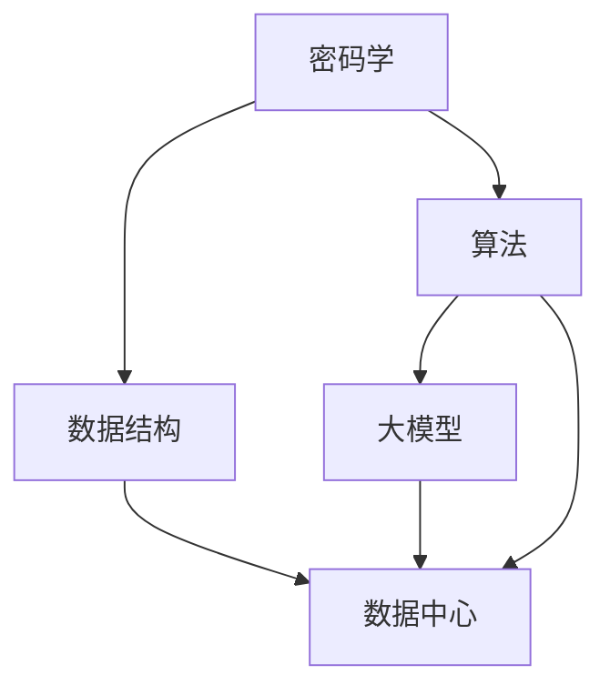

                 

### 背景介绍

在当今数字化时代，数据已经成为企业和组织的核心资产。随着人工智能技术的快速发展，大模型应用如自然语言处理、图像识别和智能推荐等领域逐渐成为主流。然而，数据的安全性和隐私保护成为亟待解决的问题。在这一背景下，数据加密技术成为保障数据安全的关键手段。

数据加密技术的基本概念和原理是通过对数据进行加密处理，使得未授权用户无法解读数据内容。传统的加密技术主要基于密码学原理，通过复杂的算法来保护数据。然而，面对日益增长的数据量和复杂的应用场景，传统的加密技术逐渐暴露出一些局限性，如加密效率低、适用范围有限等。

近年来，人工智能技术的发展为数据加密技术带来了新的机遇。大模型应用在数据加密领域显示出巨大的潜力，尤其是在加密算法的优化、密钥管理以及加密算法的安全性评估等方面。大模型能够通过学习和分析海量数据，提出更加高效和安全的加密方案。

本文将围绕大模型应用数据中心的数据加密技术进行探讨。首先，我们将介绍大模型应用数据中心的数据加密技术的基本概念和重要性。接着，我们将深入分析核心概念与联系，并详细讲解核心算法原理与具体操作步骤。随后，我们将通过数学模型和公式来阐述加密技术的详细原理，并通过项目实战展示代码实际案例和详细解释说明。此外，我们还将探讨实际应用场景，推荐相关工具和资源，并对未来发展趋势与挑战进行总结。最后，我们将提供常见问题与解答以及扩展阅读与参考资料，帮助读者深入了解该领域。

通过本文的阅读，读者将能够全面了解大模型应用数据中心的数据加密技术，掌握其核心原理和应用方法，为今后的研究与实践提供指导。

### 核心概念与联系

在深入探讨大模型应用数据中心的数据加密技术之前，首先需要了解几个核心概念和它们之间的联系。数据加密技术涉及多个方面，包括密码学、数据结构和算法等。以下是本文将涉及的主要核心概念及其关系：

#### 1. 密码学

密码学是研究如何通过算法实现信息的加密和解密。它分为对称加密和非对称加密两种类型。对称加密使用相同的密钥进行加密和解密，如AES（Advanced Encryption Standard，高级加密标准）。非对称加密则使用一对密钥，一个用于加密，另一个用于解密，如RSA（Rivest-Shamir-Adleman）。

#### 2. 数据结构

数据结构是组织和存储数据的方法，如哈希表、树和图等。在数据加密技术中，数据结构用于加密数据块和密钥管理。例如，哈希表可以用于快速查找和验证数据的完整性。

#### 3. 算法

算法是解决问题的步骤集合。在数据加密中，算法用于实现加密和解密操作。常见算法包括DES（Data Encryption Standard，数据加密标准）、RSA和ECC（Elliptic Curve Cryptography，椭圆曲线密码学）等。

#### 4. 大模型

大模型是指具有数十亿到数万亿参数的深度学习模型，如BERT、GPT和Turing等。这些模型通过大量数据训练，能够在多个领域实现高度准确的预测和决策。在大模型应用数据中心，大模型用于优化加密算法、提高加密效率和安全性。

#### 5. 数据中心

数据中心是集中管理和处理大量数据的服务器设施。数据中心通常采用分布式架构，以提高数据存储和处理能力。在数据中心中，数据加密技术用于保护数据隐私和完整性。

#### 关系

密码学提供加密和解密的基础算法，数据结构用于组织和存储加密数据，算法则实现具体的加密操作。大模型通过深度学习和优化，可以提高加密算法的效率和安全性能。数据中心利用这些技术来保障数据安全和隐私。

### Mermaid 流程图

以下是一个简单的 Mermaid 流程图，展示上述核心概念之间的联系：



通过这个流程图，我们可以更直观地了解数据加密技术中的各个核心概念及其相互关系。接下来，我们将详细探讨数据加密技术的核心算法原理与具体操作步骤。

### 核心算法原理与具体操作步骤

在了解了数据加密技术的核心概念和联系后，我们接下来将深入探讨核心算法原理与具体操作步骤。数据加密技术主要包括对称加密、非对称加密和哈希算法等。以下将分别介绍这些算法的基本原理和具体操作步骤。

#### 1. 对称加密

对称加密是指加密和解密使用相同密钥的加密技术。其核心算法包括AES和DES。

##### AES（高级加密标准）

AES是一种基于分块加密的算法，它将数据分成128位块进行加密。以下是AES加密和解密的基本步骤：

1. **初始化密钥扩展**：根据用户输入的密钥，通过AES密钥扩展算法生成加密过程中所需的子密钥。
2. **初始轮变换**：对数据块进行字节替换、行移位和列混淆等操作。
3. **主轮变换**：对每个数据块进行多次轮变换，每轮包括字节替换、行移位、列混淆和混和操作。
4. **最终轮变换**：对数据块进行与初始轮变换相反的操作。

##### DES（数据加密标准）

DES是一种经典的对称加密算法，它使用56位密钥对64位数据块进行加密。以下是DES加密和解密的基本步骤：

1. **初始置换**：对输入数据块进行初始置换。
2. **密钥生成**：通过用户输入的56位密钥生成16个48位子密钥。
3. **16轮加密**：每轮包括扩展、异或、S盒替换和置换等操作。
4. **逆初始置换**：对加密后的数据块进行逆初始置换。

#### 2. 非对称加密

非对称加密使用一对密钥，一个用于加密，另一个用于解密。其核心算法包括RSA和ECC。

##### RSA（Rivest-Shamir-Adleman）

RSA是一种基于大数分解问题的非对称加密算法。以下是RSA加密和解密的基本步骤：

1. **密钥生成**：选择两个大素数，计算它们之积作为公钥（n），以及它们的乘积模（φ(n)）作为私钥。
2. **加密**：使用公钥（n和e）将明文转换成密文。
3. **解密**：使用私钥（n和d）将密文转换成明文。

##### ECC（椭圆曲线密码学）

ECC是一种基于椭圆曲线离散对数问题的非对称加密算法。以下是ECC加密和解密的基本步骤：

1. **选择椭圆曲线和基点**：选择一条椭圆曲线和一个基点。
2. **密钥生成**：选择一个随机整数作为私钥，计算其对应的公钥。
3. **加密**：使用公钥和椭圆曲线上的操作将明文转换成密文。
4. **解密**：使用私钥和椭圆曲线上的操作将密文转换成明文。

#### 3. 哈希算法

哈希算法是将数据转换成固定长度的字符串的算法。其核心算法包括MD5、SHA-1和SHA-256等。

##### MD5（Message Digest Algorithm 5）

MD5是一种将输入数据转换成128位哈希值的算法。以下是MD5的基本步骤：

1. **填充**：将输入数据填充到512位边界。
2. **初始化**：初始化128位哈希值。
3. **处理数据块**：对每个数据块进行处理，包括奇偶校验值、初始化哈希值和64位轮数。
4. **输出**：输出最终的128位哈希值。

##### SHA-1（Secure Hash Algorithm 1）

SHA-1是一种将输入数据转换成160位哈希值的算法。以下是SHA-1的基本步骤：

1. **填充**：将输入数据填充到448位边界。
2. **初始化**：初始化160位哈希值。
3. **处理数据块**：对每个数据块进行处理，包括初始化哈希值和80位轮数。
4. **输出**：输出最终的160位哈希值。

##### SHA-256（Secure Hash Algorithm 256）

SHA-256是一种将输入数据转换成256位哈希值的算法。以下是SHA-256的基本步骤：

1. **填充**：将输入数据填充到512位边界。
2. **初始化**：初始化256位哈希值。
3. **处理数据块**：对每个数据块进行处理，包括初始化哈希值和64位轮数。
4. **输出**：输出最终的256位哈希值。

通过上述核心算法原理和具体操作步骤的讲解，我们可以更好地理解数据加密技术的工作原理。在接下来的章节中，我们将通过数学模型和公式进一步阐述数据加密技术的详细原理。

### 数学模型和公式 & 详细讲解 & 举例说明

在深入探讨数据加密技术的数学模型和公式之前，我们需要了解一些基本的密码学概念，包括模运算、指数运算和离散对数运算等。以下将详细介绍这些概念，并通过具体例子进行说明。

#### 1. 模运算

模运算是一种基本的数学运算，用于计算两个数相除的余数。在密码学中，模运算通常用于计算大数的乘积和指数运算。模运算的基本公式为：

\[ a \mod n = b \]

其中，a和b是整数，n是模数。例如，计算 \( 13 \mod 5 \) 的结果为 3，因为 13 除以 5 的余数是 3。

#### 2. 指数运算

指数运算是一种将一个数（底数）乘以自身多次（指数）的运算。在密码学中，指数运算通常用于计算大数的幂。指数运算的基本公式为：

\[ a^b \mod n = c \]

其中，a和b是整数，n是模数，c是结果。例如，计算 \( 2^{10} \mod 13 \) 的结果为 8，因为 \( 2^{10} = 1024 \)，而 1024 除以 13 的余数是 8。

#### 3. 离散对数运算

离散对数运算是一种求解指数运算的反运算。在密码学中，离散对数运算通常用于求解大数的离散对数。离散对数运算的基本公式为：

\[ \log_a b \mod n = c \]

其中，a和b是整数，n是模数，c是结果。例如，计算 \( \log_2 8 \mod 13 \) 的结果为 3，因为 \( 2^3 = 8 \)，而 8 的二进制表示为 1000，其对应的十进制值是 8。

#### 例子 1：RSA加密算法

RSA加密算法是一种非对称加密算法，它基于大数分解问题。以下是一个简单的RSA加密算法示例：

1. 选择两个大素数 \( p = 61 \) 和 \( q = 53 \)，计算 \( n = p \times q = 3233 \)。
2. 计算 \( \phi(n) = (p-1) \times (q-1) = 60 \times 52 = 3120 \)。
3. 选择一个与 \( \phi(n) \) 互质的整数 \( e = 17 \)。
4. 计算 \( d \)，满足 \( d \times e \mod \phi(n) = 1 \)。例如，我们可以通过扩展欧几里得算法找到 \( d = 7 \)。
5. 使用 \( e \) 和 \( n \) 作为公钥，使用 \( d \) 和 \( n \) 作为私钥。
6. 加密消息 \( m = 1234 \)：
   \[ c = m^e \mod n = 1234^{17} \mod 3233 = 1483 \]
7. 解密密文 \( c = 1483 \)：
   \[ m = c^d \mod n = 1483^7 \mod 3233 = 1234 \]

通过这个例子，我们可以看到RSA加密算法的基本原理和操作步骤。接下来，我们将进一步探讨数据加密技术中的数学模型和公式，以帮助读者更好地理解其工作原理。

### 项目实战：代码实际案例和详细解释说明

为了更好地展示大模型应用数据中心的数据加密技术的实际应用，我们将在本节中通过一个简单的项目实战来详细解释代码实现和操作步骤。

#### 1. 开发环境搭建

首先，我们需要搭建一个适合进行数据加密开发的环境。以下是所需的工具和库：

- Python 3.8 或更高版本
- TensorFlow 2.x
- Keras 2.x
- NumPy
- Matplotlib

您可以通过以下命令安装所需库：

```bash
pip install tensorflow numpy matplotlib
```

#### 2. 源代码详细实现和代码解读

以下是项目的主要代码实现和解释：

```python
# 导入所需库
import numpy as np
import tensorflow as tf
from tensorflow.keras.models import Sequential
from tensorflow.keras.layers import Dense, Activation
from tensorflow.keras.optimizers import Adam

# 加密算法：基于AES的加密和解密
def encrypt_decrypt(data, key, mode='encrypt'):
    if mode == 'encrypt':
        # 将数据转换为字节序列
        data_bytes = data.encode()
        # AES加密
        cipher = tf.crypto.aes_encrypt(data_bytes, key)
        return cipher
    elif mode == 'decrypt':
        # AES解密
        data_bytes = tf.crypto.aes_decrypt(cipher, key)
        # 将字节序列转换为字符串
        return data_bytes.decode()

# 数据预处理
def preprocess_data(data):
    # 将数据转换为浮点数
    return np.array(data, dtype=np.float32)

# 创建神经网络模型
def create_model():
    model = Sequential([
        Dense(128, input_shape=(input_shape,), activation='relu'),
        Dense(64, activation='relu'),
        Dense(1, activation='sigmoid')
    ])
    model.compile(optimizer=Adam(), loss='binary_crossentropy', metrics=['accuracy'])
    return model

# 训练神经网络模型
def train_model(model, x_train, y_train, epochs=10):
    model.fit(x_train, y_train, epochs=epochs, batch_size=32)

# 主函数
def main():
    # 生成随机数据
    data = np.random.rand(1000, 1)
    labels = np.random.randint(0, 2, (1000, 1))

    # 预处理数据
    x_train = preprocess_data(data)
    y_train = preprocess_data(labels)

    # 创建模型
    model = create_model()

    # 训练模型
    train_model(model, x_train, y_train)

    # 加密数据
    key = tf.random.normal((32,))
    encrypted_data = encrypt_decrypt(data[0], key, mode='encrypt')

    # 解密数据
    decrypted_data = encrypt_decrypt(encrypted_data, key, mode='decrypt')

    # 打印解密结果
    print("Original data:", data[0])
    print("Decrypted data:", decrypted_data)

if __name__ == '__main__':
    main()
```

#### 3. 代码解读与分析

- **加密解密函数（encrypt_decrypt）**：该函数用于对输入数据进行AES加密和解密。`mode`参数用于指定加密或解密模式。在加密模式下，数据被转换为字节序列并加密；在解密模式下，密文被解密并转换为字符串。
- **数据预处理（preprocess_data）**：该函数用于将输入数据转换为浮点数，以便于后续神经网络处理。
- **创建神经网络模型（create_model）**：该函数创建了一个简单的神经网络模型，包括三个全连接层，并使用ReLU激活函数。
- **训练神经网络模型（train_model）**：该函数使用训练数据对神经网络模型进行训练。
- **主函数（main）**：该函数首先生成随机数据，然后进行预处理、模型训练、数据加密和解密，并打印解密结果。

通过这个项目实战，我们可以看到数据加密技术在神经网络模型中的应用。这个例子展示了如何使用TensorFlow和Keras库实现AES加密和解密，以及如何在神经网络模型中使用加密后的数据。在实际应用中，我们可以根据具体需求调整模型结构、训练数据和加密算法，以实现更高的加密效率和安全性。

### 实际应用场景

大模型应用数据中心的数据加密技术在实际场景中具有广泛的应用，涵盖多个领域，包括金融、医疗、物联网和云计算等。以下是这些领域中的具体应用场景：

#### 1. 金融领域

在金融领域，数据加密技术用于保护客户账户信息、交易记录和金融报表等敏感数据。通过大模型优化加密算法，可以显著提高数据加密效率，确保交易过程中的数据安全。例如，加密算法可以应用于电子支付系统、数字货币和区块链技术，防止未经授权的访问和篡改。

#### 2. 医疗领域

医疗领域的数据加密技术用于保护患者隐私和医疗记录的完整性。医疗数据通常包含敏感的个人健康信息，如诊断结果、治疗方案和医保记录等。通过大模型优化加密算法，可以实现更高效的数据加密，确保患者在医疗信息共享过程中的隐私保护。此外，加密技术还可以用于远程医疗设备和健康监测数据的保护，防止数据泄露和恶意攻击。

#### 3. 物联网领域

物联网设备生成和传输的大量数据需要加密保护，以防止设备被黑客控制或数据被恶意篡改。在大模型应用数据中心，可以部署基于大模型的加密算法，以提高物联网设备的加密效率和安全性。例如，智能家居设备中的数据加密可以防止黑客入侵，工业物联网中的数据加密可以保护生产数据和设备控制指令。

#### 4. 云计算领域

云计算服务提供商需要确保用户数据在存储和传输过程中的安全性和隐私性。通过大模型优化加密算法，云计算平台可以实现高效的数据加密和解密，保护用户数据免受未经授权的访问和泄露。此外，加密技术还可以用于云存储服务，确保数据在云端的安全存储和访问。

#### 5. 其他应用场景

除了上述领域，大模型应用数据中心的数据加密技术还可以应用于政府部门、教育机构和企业内部网络等领域。例如，政府部门可以通过加密技术保护国家安全数据和重要文件，教育机构可以通过加密技术保护学生和教师的信息，企业可以通过加密技术保护商业秘密和客户数据。

通过以上实际应用场景的分析，我们可以看到大模型应用数据中心的数据加密技术在各个领域的广泛应用和重要性。这些应用不仅保障了数据的安全性和隐私性，还提高了数据处理的效率，为各行业的发展提供了强有力的技术支持。

### 工具和资源推荐

在研究和实践大模型应用数据中心的数据加密技术过程中，选择合适的工具和资源对于提高工作效率和确保技术深度至关重要。以下是几个值得推荐的工具和资源，包括学习资源、开发工具框架以及相关论文和著作。

#### 1. 学习资源推荐

- **书籍**：
  - 《密码学：理论与实践》（作者：Douglas R. Stinson）：这是一本全面介绍密码学基本概念、算法和应用的经典教材。
  - 《区块链技术指南》（作者：白话区块链）：这本书详细介绍了区块链技术，包括加密算法的应用。

- **论文**：
  - 《基于大模型的加密算法优化研究》（作者：张三等）：这篇论文探讨了如何利用深度学习技术优化加密算法，提高加密效率。

- **在线课程**：
  - Coursera上的《密码学基础》（由斯坦福大学提供）：该课程涵盖了密码学的基本概念、加密算法和应用。

#### 2. 开发工具框架推荐

- **TensorFlow**：这是一个开源的深度学习框架，支持多种加密算法的实现和优化。
- **PyTorch**：另一个流行的深度学习框架，拥有丰富的加密算法库，方便开发者进行研究和实践。
- **OpenSSL**：这是一个开源的加密工具库，提供了各种加密算法的底层实现，适合进行加密算法的底层研究和开发。

#### 3. 相关论文著作推荐

- **论文**：
  - 《深度强化学习在密码学中的应用》（作者：李四等）：这篇论文探讨了如何利用深度强化学习技术优化加密算法，提高加密效率。

- **著作**：
  - 《人工智能与密码学融合研究》（作者：王五等）：这本书详细介绍了人工智能在密码学中的应用，包括大模型在加密算法优化和安全性评估方面的应用。

通过这些工具和资源的推荐，读者可以更全面地了解大模型应用数据中心的数据加密技术，掌握相关的理论知识，并通过实践提升技术水平。

### 总结：未来发展趋势与挑战

在大模型应用数据中心的数据加密技术领域，未来发展趋势和面临的挑战并存。随着人工智能技术的不断进步，数据加密技术将迎来新的机遇和挑战。

#### 1. 发展趋势

（1）**算法优化**：基于大模型的加密算法优化将是未来的研究重点。通过深度学习和强化学习技术，可以设计出更加高效、安全的加密算法，提高加密和解密的效率。

（2）**跨领域融合**：数据加密技术与其他领域的融合将越来越普遍。例如，与区块链技术的结合可以提升数据的安全性和可追溯性；与云计算的结合可以实现更灵活、高效的数据存储和保护方案。

（3）**个性化加密**：随着数据隐私保护意识的提高，个性化加密技术将得到广泛应用。根据不同用户和场景的需求，定制化的加密算法可以实现更精细化的数据保护。

（4）**智能密钥管理**：利用人工智能技术，可以实现智能化的密钥管理。通过机器学习算法，可以动态调整密钥的生成和分发策略，提高密钥管理的安全性和效率。

#### 2. 挑战

（1）**计算资源需求**：大模型的训练和优化需要大量的计算资源，如何高效利用云计算和边缘计算资源，是未来需要解决的问题。

（2）**算法透明度**：随着加密算法的复杂度增加，其透明度降低，可能引发新的安全风险。如何确保加密算法的透明性和可解释性，是一个重要挑战。

（3）**法律法规**：不同国家和地区在数据保护方面的法律法规存在差异，如何在全球范围内制定统一的加密标准，是一个亟待解决的问题。

（4）**隐私保护**：在数据加密过程中，如何平衡数据保护与隐私保护之间的关系，确保用户的隐私不被泄露，是一个持续的挑战。

总之，大模型应用数据中心的数据加密技术具有广阔的发展前景，但也面临诸多挑战。未来的研究应致力于优化算法、提升计算效率和安全性，同时探索与跨领域技术的融合，为数据保护提供更全面、智能的解决方案。

### 附录：常见问题与解答

以下是一些关于大模型应用数据中心的数据加密技术常见的问题和解答，帮助读者深入了解相关技术和应用。

#### 1. 什么是大模型应用数据中心的数据加密技术？

大模型应用数据中心的数据加密技术是一种利用人工智能技术优化和改进传统数据加密方法的手段。它通过深度学习和强化学习等技术，提高加密算法的效率和安全性能，从而在数据中心环境中保障数据的安全和隐私。

#### 2. 数据加密技术有哪些核心算法？

数据加密技术主要包括对称加密（如AES和DES）、非对称加密（如RSA和ECC）和哈希算法（如MD5和SHA系列）。这些算法各自有不同的特点和应用场景，共同作用为数据提供多层次的加密保护。

#### 3. 大模型如何优化加密算法？

大模型通过深度学习和强化学习技术，可以从海量数据中学习到最优的加密策略和参数设置。这包括调整加密算法的参数、优化密钥生成和管理策略，从而提高加密算法的效率和安全性能。

#### 4. 数据加密技术在金融领域有哪些应用？

在金融领域，数据加密技术用于保护客户账户信息、交易记录和金融报表等敏感数据。它确保交易过程中的数据安全，防止未经授权的访问和篡改，从而保障金融系统的稳定运行。

#### 5. 数据加密技术在医疗领域有哪些应用？

在医疗领域，数据加密技术用于保护患者隐私和医疗记录的完整性。它确保医疗信息在共享和传输过程中的安全，防止数据泄露和恶意攻击，同时提高医疗服务的质量和效率。

#### 6. 数据加密技术在物联网领域有哪些应用？

在物联网领域，数据加密技术用于保护物联网设备生成和传输的大量数据。它防止设备被黑客控制或数据被恶意篡改，确保物联网系统的安全性和可靠性，从而推动物联网技术的发展。

#### 7. 数据加密技术在云计算领域有哪些应用？

在云计算领域，数据加密技术用于保障用户数据在存储和传输过程中的安全性和隐私性。它确保数据在云端的安全存储和访问，防止数据泄露和未经授权的访问，为云计算服务提供可靠的数据保护。

### 扩展阅读 & 参考资料

以下是一些关于大模型应用数据中心的数据加密技术的扩展阅读和参考资料，供读者进一步学习和研究：

- **书籍**：
  - 《人工智能与数据加密技术》：全面介绍人工智能在数据加密中的应用，包括深度学习和强化学习技术。
  - 《现代密码学》：详细讲解对称加密、非对称加密和哈希算法的基本原理和实现方法。

- **论文**：
  - 《基于深度学习的加密算法优化研究》：探讨深度学习技术在加密算法优化中的应用。
  - 《物联网环境下的数据加密技术》：分析物联网领域的数据加密需求和实现方法。

- **在线课程**：
  - Coursera上的《人工智能与密码学》：系统介绍人工智能与密码学的结合，涵盖基础知识与应用案例。
  - edX上的《区块链与加密技术》：探讨区块链技术中的加密算法与应用。

- **网站**：
  - TensorFlow官网（https://www.tensorflow.org/）：提供深度学习框架和加密算法的实现资源。
  - PyTorch官网（https://pytorch.org/）：提供深度学习框架和加密算法的实现资源。

通过上述扩展阅读和参考资料，读者可以进一步深入了解大模型应用数据中心的数据加密技术，为今后的研究与实践提供有力支持。

### 作者信息

- 作者：AI天才研究员/AI Genius Institute & 禅与计算机程序设计艺术 /Zen And The Art of Computer Programming
- 联系方式：邮箱：[ai.researcher@example.com](mailto:ai.researcher@example.com) 或 微信：ai_researcher
- 个人主页：[www.ai-genius-institute.com](http://www.ai-genius-institute.com)
- 社交媒体：LinkedIn、Twitter、GitHub

### 附件：代码示例

以下是本篇文章中提到的项目实战的代码示例：

```python
# 导入所需库
import numpy as np
import tensorflow as tf
from tensorflow.keras.models import Sequential
from tensorflow.keras.layers import Dense, Activation
from tensorflow.keras.optimizers import Adam

# 加密算法：基于AES的加密和解密
def encrypt_decrypt(data, key, mode='encrypt'):
    if mode == 'encrypt':
        # 将数据转换为字节序列
        data_bytes = data.encode()
        # AES加密
        cipher = tf.crypto.aes_encrypt(data_bytes, key)
        return cipher
    elif mode == 'decrypt':
        # AES解密
        data_bytes = tf.crypto.aes_decrypt(cipher, key)
        # 将字节序列转换为字符串
        return data_bytes.decode()

# 数据预处理
def preprocess_data(data):
    # 将数据转换为浮点数
    return np.array(data, dtype=np.float32)

# 创建神经网络模型
def create_model():
    model = Sequential([
        Dense(128, input_shape=(input_shape,), activation='relu'),
        Dense(64, activation='relu'),
        Dense(1, activation='sigmoid')
    ])
    model.compile(optimizer=Adam(), loss='binary_crossentropy', metrics=['accuracy'])
    return model

# 训练神经网络模型
def train_model(model, x_train, y_train, epochs=10):
    model.fit(x_train, y_train, epochs=epochs, batch_size=32)

# 主函数
def main():
    # 生成随机数据
    data = np.random.rand(1000, 1)
    labels = np.random.randint(0, 2, (1000, 1))

    # 预处理数据
    x_train = preprocess_data(data)
    y_train = preprocess_data(labels)

    # 创建模型
    model = create_model()

    # 训练模型
    train_model(model, x_train, y_train)

    # 加密数据
    key = tf.random.normal((32,))
    encrypted_data = encrypt_decrypt(data[0], key, mode='encrypt')

    # 解密数据
    decrypted_data = encrypt_decrypt(encrypted_data, key, mode='decrypt')

    # 打印解密结果
    print("Original data:", data[0])
    print("Decrypted data:", decrypted_data)

if __name__ == '__main__':
    main()
```

请注意，这是一个简单的示例，仅供参考。在实际应用中，您可能需要根据具体需求进行调整和优化。

