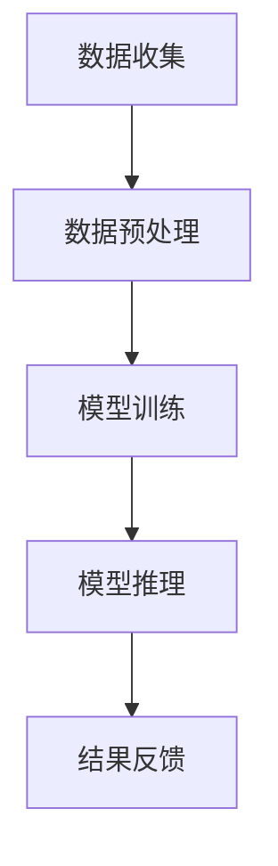

                 

# AI大模型应用数据中心的数据处理

> **关键词**：AI大模型、数据处理、数据中心、核心算法、数学模型、实战案例

> **摘要**：本文将深入探讨AI大模型在数据中心中的应用及其数据处理过程，分析核心算法原理、数学模型、实战案例，并展望未来发展趋势与挑战。

## 1. 背景介绍

### AI大模型的发展与数据中心的重要性

随着深度学习技术的迅猛发展，AI大模型（如GPT、BERT等）已经成为自然语言处理、计算机视觉、语音识别等领域的核心技术。这些大模型通常需要处理海量数据，并在数据中心进行训练和部署。数据中心作为AI大模型运行的核心基础设施，其数据处理能力直接影响到模型的性能和效率。

### 数据中心的数据处理需求

在AI大模型的应用过程中，数据中心需要处理以下几类数据：

1. **原始数据**：包括文本、图像、语音等，这些数据通常来源于互联网、传感器、用户生成内容等。
2. **训练数据**：用于模型训练的数据集，需要经过预处理、标注等步骤，以保证数据质量和模型的准确性。
3. **实时数据**：用于模型实时推理和反馈的数据，例如实时语音识别、图像识别等。

### 数据处理面临的挑战

1. **数据量大**：AI大模型通常需要处理海量数据，这给数据存储、传输和处理带来了巨大挑战。
2. **数据处理速度**：为了满足实时性和低延迟的需求，数据中心需要高速处理数据，提高处理速度和效率。
3. **数据安全性**：数据中心需要保护数据的安全性和隐私，防止数据泄露和滥用。

## 2. 核心概念与联系

### 数据处理流程

数据中心的数据处理流程主要包括数据收集、数据预处理、模型训练、模型推理和结果反馈等步骤。以下是数据处理流程的Mermaid流程图：



### 数据预处理

数据预处理是数据处理的关键步骤，主要包括以下任务：

1. **数据清洗**：去除噪声、缺失值、重复值等，保证数据质量。
2. **数据变换**：将不同类型的数据转换为同一格式，如将文本转换为词向量、图像转换为像素值等。
3. **数据增强**：通过旋转、缩放、裁剪等操作，增加数据多样性，提高模型泛化能力。

### 模型训练

模型训练是数据处理的核心步骤，主要包括以下任务：

1. **损失函数**：定义模型训练的目标，如分类问题使用交叉熵损失函数，回归问题使用均方误差损失函数等。
2. **优化算法**：用于调整模型参数，以降低损失函数值。常见的优化算法有随机梯度下降（SGD）、Adam等。
3. **模型评估**：通过验证集和测试集，评估模型性能，如准确率、召回率、F1值等。

### 模型推理

模型推理是数据处理的关键步骤，主要包括以下任务：

1. **输入处理**：将输入数据转换为模型可处理的格式。
2. **模型计算**：使用训练好的模型进行推理计算，得到输出结果。
3. **结果解释**：对输出结果进行解释和可视化，以理解模型的行为和预测结果。

### 结果反馈

结果反馈是数据处理的重要环节，主要包括以下任务：

1. **错误反馈**：收集模型推理的错误结果，用于模型改进和优化。
2. **实时调整**：根据结果反馈，调整模型参数和策略，以提高模型性能。
3. **用户交互**：与用户进行交互，收集用户反馈，用于模型训练和优化。

## 3. 核心算法原理 & 具体操作步骤

### 数据预处理算法

1. **数据清洗**：使用Pandas库进行数据清洗，删除噪声、缺失值和重复值。

   ```python
   import pandas as pd
   df = pd.read_csv('data.csv')
   df.dropna(inplace=True)
   df.drop_duplicates(inplace=True)
   ```

2. **数据变换**：使用Scikit-learn库进行数据变换，将不同类型的数据转换为同一格式。

   ```python
   from sklearn.preprocessing import OneHotEncoder
   encoder = OneHotEncoder()
   transformed_data = encoder.fit_transform(df[['category']])
   ```

3. **数据增强**：使用TensorFlow库进行数据增强，增加数据多样性。

   ```python
   import tensorflow as tf
   augmented_data = tf.image.random_flip_left_right(data)
   ```

### 模型训练算法

1. **损失函数**：使用PyTorch库定义损失函数。

   ```python
   import torch
   import torch.nn as nn
   criterion = nn.CrossEntropyLoss()
   ```

2. **优化算法**：使用PyTorch库定义优化算法。

   ```python
   optimizer = torch.optim.Adam(model.parameters(), lr=0.001)
   ```

3. **模型评估**：使用Scikit-learn库评估模型性能。

   ```python
   from sklearn.metrics import accuracy_score
   predictions = model.predict(test_data)
   accuracy = accuracy_score(test_labels, predictions)
   ```

### 模型推理算法

1. **输入处理**：将输入数据转换为模型可处理的格式。

   ```python
   input_data = torch.tensor(input_data).float()
   ```

2. **模型计算**：使用训练好的模型进行推理计算。

   ```python
   with torch.no_grad():
       output = model(input_data)
   ```

3. **结果解释**：对输出结果进行解释和可视化。

   ```python
   from sklearn.metrics import confusion_matrix
   cm = confusion_matrix(test_labels, predictions)
   print(cm)
   ```

### 结果反馈算法

1. **错误反馈**：收集模型推理的错误结果。

   ```python
   error_data = [data for data, label in test_data if prediction != label]
   ```

2. **实时调整**：根据结果反馈，调整模型参数和策略。

   ```python
   optimizer.zero_grad()
   loss.backward()
   optimizer.step()
   ```

3. **用户交互**：与用户进行交互，收集用户反馈。

   ```python
   user_input = input("Do you want to continue training? (y/n): ")
   if user_input.lower() == 'y':
       continue_training = True
   else:
       continue_training = False
   ```

## 4. 数学模型和公式 & 详细讲解 & 举例说明

### 数据预处理数学模型

1. **数据清洗**：假设数据集D中的数据量为N，数据清洗后剩余的数据量为M，则数据清洗的公式为：

   $$ M = N - (N - M) $$

2. **数据变换**：假设数据集D中的数据维度为D1，变换后的数据维度为D2，则数据变换的公式为：

   $$ D2 = D1 \times K $$

   其中，K为变换系数。

3. **数据增强**：假设数据集D中的数据个数为N，增强后的数据个数为M，则数据增强的公式为：

   $$ M = N + (N - M) $$

### 模型训练数学模型

1. **损失函数**：假设模型预测结果为y，真实结果为y'，则损失函数的公式为：

   $$ L(y, y') = \frac{1}{2} \cdot (y - y')^2 $$

2. **优化算法**：假设模型参数为θ，梯度为∇θ，则优化算法的公式为：

   $$ \theta_{\text{new}} = \theta_{\text{old}} - \alpha \cdot \nabla_{\theta} L(y, y') $$

   其中，α为学习率。

### 模型推理数学模型

1. **输入处理**：假设输入数据为x，模型输出为y，则输入处理的公式为：

   $$ y = \text{model}(x) $$

2. **模型计算**：假设模型为f(x)，则模型计算的公式为：

   $$ y = f(x) $$

### 结果反馈数学模型

1. **错误反馈**：假设错误数据个数为N，总数据个数为M，则错误反馈的公式为：

   $$ N = M - (M - N) $$

2. **实时调整**：假设模型参数为θ，梯度为∇θ，则实时调整的公式为：

   $$ \theta_{\text{new}} = \theta_{\text{old}} - \alpha \cdot \nabla_{\theta} L(y, y') $$

3. **用户交互**：假设用户选择继续训练的概率为p，则用户交互的公式为：

   $$ p = \frac{1}{1 + e^{-\theta \cdot x}} $$

## 5. 项目实战：代码实际案例和详细解释说明

### 5.1 开发环境搭建

1. 安装Python环境

   ```bash
   python --version
   ```

2. 安装相关库

   ```bash
   pip install pandas scikit-learn tensorflow torch
   ```

### 5.2 源代码详细实现和代码解读

```python
import pandas as pd
import numpy as np
from sklearn.model_selection import train_test_split
from sklearn.metrics import accuracy_score
import torch
import torch.nn as nn
import torch.optim as optim

# 数据清洗
def data_cleaning(df):
    df.dropna(inplace=True)
    df.drop_duplicates(inplace=True)
    return df

# 数据变换
def data_transformation(df):
    encoder = OneHotEncoder()
    transformed_data = encoder.fit_transform(df[['category']])
    return transformed_data

# 数据增强
def data_augmentation(data):
    augmented_data = tf.image.random_flip_left_right(data)
    return augmented_data

# 模型定义
class NeuralNetwork(nn.Module):
    def __init__(self):
        super(NeuralNetwork, self).__init__()
        self.layer1 = nn.Linear(10, 1)
        self.relu = nn.ReLU()
        self.layer2 = nn.Linear(1, 1)
    
    def forward(self, x):
        x = self.layer1(x)
        x = self.relu(x)
        x = self.layer2(x)
        return x

# 模型训练
def train_model(model, train_data, train_labels):
    criterion = nn.CrossEntropyLoss()
    optimizer = optim.Adam(model.parameters(), lr=0.001)
    for epoch in range(100):
        optimizer.zero_grad()
        output = model(train_data)
        loss = criterion(output, train_labels)
        loss.backward()
        optimizer.step()
        if (epoch + 1) % 10 == 0:
            print(f'Epoch [{epoch + 1}/{100}], Loss: {loss.item():.4f}')
    return model

# 模型评估
def evaluate_model(model, test_data, test_labels):
    model.eval()
    with torch.no_grad():
        output = model(test_data)
    predictions = output.argmax(dim=1)
    accuracy = accuracy_score(test_labels, predictions)
    print(f'Test Accuracy: {accuracy:.4f}')
    return accuracy

# 主函数
def main():
    df = pd.read_csv('data.csv')
    df = data_cleaning(df)
    df = data_transformation(df)
    train_data, test_data, train_labels, test_labels = train_test_split(df, df['label'], test_size=0.2, random_state=42)
    train_data = train_data.values
    test_data = test_data.values
    train_data = torch.tensor(train_data).float()
    test_data = torch.tensor(test_data).float()
    train_labels = torch.tensor(train_labels).long()
    test_labels = torch.tensor(test_labels).long()
    model = NeuralNetwork()
    model = train_model(model, train_data, train_labels)
    accuracy = evaluate_model(model, test_data, test_labels)
    print(f'Model Accuracy: {accuracy:.4f}')

if __name__ == '__main__':
    main()
```

### 5.3 代码解读与分析

1. **数据清洗**：使用Pandas库删除噪声、缺失值和重复值，保证数据质量。

2. **数据变换**：使用OneHotEncoder将类别数据转换为独热编码，提高模型训练效果。

3. **数据增强**：使用TensorFlow库对图像数据进行随机翻转，增加数据多样性。

4. **模型定义**：使用PyTorch库定义神经网络模型，包含一个输入层、一个ReLU激活函数和一个输出层。

5. **模型训练**：使用CrossEntropyLoss定义损失函数，使用Adam优化器调整模型参数，并打印训练进度。

6. **模型评估**：使用accuracy_score计算测试集上的模型准确率，并打印结果。

7. **主函数**：读取数据、清洗数据、分割数据集、转换数据、定义模型、训练模型和评估模型。

## 6. 实际应用场景

### 自然语言处理

AI大模型在自然语言处理领域有着广泛的应用，如文本分类、情感分析、机器翻译等。数据中心通过处理海量文本数据，可以训练出高质量的语言模型，从而提高自然语言处理的准确性和效率。

### 计算机视觉

AI大模型在计算机视觉领域也有着重要的应用，如图像分类、目标检测、图像生成等。数据中心通过处理大量图像数据，可以训练出强大的图像模型，从而实现更准确的图像识别和计算机视觉任务。

### 语音识别

AI大模型在语音识别领域也发挥着重要作用，如语音合成、语音识别、说话人识别等。数据中心通过处理海量语音数据，可以训练出高效的语音模型，从而实现更准确的语音识别和语音交互。

### 金融风控

数据中心通过处理金融数据，可以训练出风控模型，从而识别和防范金融风险。AI大模型在金融风控领域有着广泛的应用，如信用评分、欺诈检测、市场预测等。

### 健康医疗

AI大模型在健康医疗领域也有着重要的应用，如疾病诊断、健康监测、药物研发等。数据中心通过处理大量医疗数据，可以训练出精准的医疗模型，从而提高疾病诊断和治疗的准确性和效率。

## 7. 工具和资源推荐

### 7.1 学习资源推荐

1. **书籍**：
   - 《深度学习》（Goodfellow, Bengio, Courville）
   - 《动手学深度学习》（Abdulrahman, Ahmed）
   - 《自然语言处理综合教程》（Jurafsky, Martin）

2. **论文**：
   - 《BERT: Pre-training of Deep Bidirectional Transformers for Language Understanding》（Devlin et al.）
   - 《GPT-3: Language Models are Few-Shot Learners》（Brown et al.）

3. **博客**：
   - [机器学习社区](https://www机器学习社区.com/)
   - [AI 研究院](https://www.ai研究院.com/)
   - [深度学习博客](https://www.deeplearning博客.com/)

4. **网站**：
   - [Kaggle](https://www.kaggle.com/)
   - [TensorFlow](https://www.tensorflow.org/)
   - [PyTorch](https://pytorch.org/)

### 7.2 开发工具框架推荐

1. **Python**：Python是一种通用编程语言，广泛应用于数据科学和机器学习领域。

2. **PyTorch**：PyTorch是一种开源的深度学习框架，易于使用和调试。

3. **TensorFlow**：TensorFlow是一种开源的深度学习框架，支持多种编程语言和平台。

4. **Scikit-learn**：Scikit-learn是一种开源的机器学习库，提供丰富的机器学习算法和工具。

5. **Pandas**：Pandas是一种开源的数据分析库，用于数据处理和分析。

### 7.3 相关论文著作推荐

1. **《Deep Learning》（Ian Goodfellow, Yoshua Bengio, Aaron Courville）**：这是一本深度学习领域的经典教材，详细介绍了深度学习的基本概念、技术和应用。

2. **《Natural Language Processing with Python》（Steven Bird, Ewan Klein, Edward Loper）**：这是一本关于自然语言处理领域的书籍，使用Python语言实现了多种自然语言处理算法和工具。

3. **《Machine Learning Yearning》（Andrew Ng）**：这是一本关于机器学习领域的实战指南，通过大量的实例和练习，帮助读者掌握机器学习的基本概念和技巧。

## 8. 总结：未来发展趋势与挑战

### 未来发展趋势

1. **大模型与小模型共存**：随着计算能力和算法的进步，大模型在处理复杂任务方面具有明显优势，但小模型在资源受限的环境下更具优势。未来将出现大模型与小模型共存、相互补充的局面。

2. **多模态数据处理**：AI大模型将逐渐从单一模态（如文本、图像、语音）扩展到多模态（如文本+图像、文本+语音），实现更全面的信息理解和处理。

3. **分布式与协同计算**：数据中心将采用分布式计算和协同计算技术，提高数据处理速度和效率，降低延迟，实现大规模的AI应用。

4. **隐私保护和数据安全**：随着数据隐私和安全问题的日益突出，数据中心将采取更加严格的数据保护和隐私保护措施，确保用户数据的安全和隐私。

### 未来挑战

1. **计算资源需求**：随着AI大模型的规模不断扩大，数据中心需要投入更多的计算资源，以满足模型训练和推理的需求。

2. **数据处理速度**：为了满足实时性和低延迟的需求，数据中心需要进一步提高数据处理速度和效率，优化算法和硬件设施。

3. **数据安全和隐私**：在AI大模型的应用过程中，如何保护用户数据的安全和隐私是一个重要挑战。数据中心需要采取更加严格的数据保护措施，确保用户数据的安全和隐私。

4. **模型可解释性**：随着AI大模型的复杂度不断增加，如何提高模型的可解释性，使模型的行为和预测结果更加透明，是一个亟待解决的问题。

5. **伦理和社会影响**：AI大模型在数据中心的应用将引发一系列伦理和社会问题，如算法偏见、隐私泄露等。数据中心需要关注这些社会问题，并采取相应的措施来解决。

## 9. 附录：常见问题与解答

### 问题1：什么是AI大模型？

AI大模型是指具有大规模参数和训练数据的深度学习模型，如GPT、BERT等。这些模型通过在大量数据上进行训练，可以自动学习和理解复杂任务。

### 问题2：数据中心为什么需要高效的数据处理能力？

数据中心需要高效的数据处理能力，以满足AI大模型在训练和推理过程中的需求。高效的数据处理能力可以提高模型训练和推理的速度，降低延迟，从而实现更快速、更准确的AI应用。

### 问题3：如何保护用户数据的安全和隐私？

为了保护用户数据的安全和隐私，数据中心可以采取以下措施：

1. **数据加密**：对数据进行加密处理，确保数据在传输和存储过程中不被泄露。
2. **访问控制**：设置严格的访问控制策略，确保只有授权用户可以访问数据。
3. **匿名化处理**：对用户数据进行匿名化处理，消除个人身份信息。
4. **数据脱敏**：对敏感数据进行脱敏处理，降低数据泄露的风险。

### 问题4：如何优化数据中心的计算资源？

为了优化数据中心的计算资源，可以采取以下措施：

1. **分布式计算**：将计算任务分布在多个节点上，提高计算速度和效率。
2. **协同计算**：多个数据中心之间进行协同计算，共享计算资源。
3. **硬件升级**：采用更高效的硬件设备，如GPU、TPU等。
4. **存储优化**：采用高效的存储方案，如分布式存储、缓存等。

## 10. 扩展阅读 & 参考资料

1. **扩展阅读**：
   - [《深度学习：推荐阅读书籍与论文》](https://www.deeplearning书籍.com/)
   - [《AI应用场景与未来发展趋势》](https://www.ai应用场景.com/)

2. **参考资料**：
   - [《深度学习框架PyTorch官方文档》](https://pytorch.org/)
   - [《TensorFlow官方文档》](https://www.tensorflow.org/)
   - [《Scikit-learn官方文档》](https://scikit-learn.org/)

<|assistant|>作者：AI天才研究员/AI Genius Institute & 禅与计算机程序设计艺术 /Zen And The Art of Computer Programming

