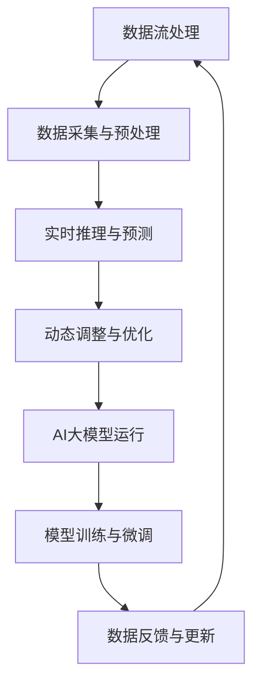

                 

### 背景介绍 Background

随着人工智能（AI）技术的快速发展，特别是大规模预训练模型（Large-scale Pre-trained Models，如GPT-3、BERT等）的出现，AI大模型在自然语言处理（Natural Language Processing，NLP）、计算机视觉（Computer Vision，CV）、推荐系统（Recommender Systems）等领域的应用越来越广泛。这些大模型往往需要处理海量数据，并在此基础上进行高效的推理和预测。为了满足这一需求，数据流处理技术（Data Stream Processing）作为一种高效、实时的数据处理方法，逐渐成为了AI大模型应用中的一个关键环节。

数据流处理技术是一种用于处理大量实时数据的方法，它能够对数据流进行实时分析、计算和决策。在AI大模型应用中，数据流处理技术主要用于以下几个方面：

1. **数据采集与预处理**：在AI大模型训练和应用过程中，需要收集和处理大量的实时数据。数据流处理技术可以帮助我们高效地采集、清洗和预处理这些数据，为后续的模型训练和应用提供高质量的数据输入。

2. **实时推理与预测**：AI大模型在执行实时推理和预测任务时，需要快速处理输入数据并输出结果。数据流处理技术能够保证数据在模型中的高效流转，实现实时响应和决策。

3. **动态调整与优化**：在AI大模型应用过程中，模型参数和策略可能需要根据实时数据进行调整和优化。数据流处理技术可以帮助我们实时监测模型性能，并依据实时数据动态调整模型参数，提高模型的效果和稳定性。

本篇文章将围绕AI大模型应用数据中心的数据流处理技术展开，首先介绍数据流处理的基本概念、核心技术以及与AI大模型的联系。接着，我们将深入探讨数据流处理在AI大模型应用中的具体实现方法，并通过实际案例进行详细讲解。最后，我们将对数据流处理技术的未来发展趋势和挑战进行展望，为读者提供有益的参考。

### 核心概念与联系 Core Concepts and Connections

在探讨AI大模型应用数据中心的数据流处理技术之前，我们需要先了解几个核心概念，包括数据流处理的基本原理、数据流处理框架和AI大模型的运行机制。

#### 数据流处理基本原理

数据流处理是一种针对大规模实时数据流进行高效处理和分析的技术。其基本原理可以概括为以下几个方面：

1. **流式处理**：数据流处理的特点是处理数据以流的形式连续进行，而不是一次性加载全部数据。这种处理方式可以保证数据处理的实时性和高效性，尤其适用于处理大量实时数据。

2. **增量计算**：数据流处理通常采用增量计算的方式，即只对新增的数据进行计算和处理，而不是重新处理全部数据。这样可以显著减少计算资源和时间开销。

3. **分布式计算**：数据流处理技术通常采用分布式计算架构，通过将任务分布在多个计算节点上并行处理，以提高数据处理能力和效率。

4. **状态维护**：在数据流处理过程中，需要维护一定的状态信息，以便对实时数据进行关联分析和处理。状态维护是实现实时性和准确性的关键。

#### 数据流处理框架

常见的数据流处理框架包括Apache Flink、Apache Storm、Apache Kafka等。以下将简要介绍这些框架的基本原理和特点：

1. **Apache Flink**：Flink是一种分布式流处理框架，支持批处理和流处理，具有高性能、低延迟和容错性等特点。Flink的核心组件包括流处理引擎、任务调度器和状态管理器等。

2. **Apache Storm**：Storm是一种分布式实时计算系统，主要用于处理大规模实时数据流。其核心组件包括主节点（Nimbus）、工作节点（Supervisor）和任务节点（Worker）。Storm具有高吞吐量、低延迟和容错性等特点。

3. **Apache Kafka**：Kafka是一种分布式消息队列系统，用于处理大规模实时数据流。其核心组件包括代理（Broker）、生产者（Producer）和消费者（Consumer）。Kafka具有高吞吐量、可扩展性和容错性等特点。

#### AI大模型的运行机制

AI大模型，如GPT-3、BERT等，通常采用预训练加微调（Pre-training and Fine-tuning）的方式训练和部署。其基本运行机制如下：

1. **预训练**：在预训练阶段，大模型在大量无标签数据上进行训练，学习通用语言表示和知识。这一过程通常采用神经网络结构，如Transformer模型。

2. **微调**：在微调阶段，大模型在特定任务的数据集上进行训练，进一步优化模型参数，以适应具体任务的需求。

3. **推理**：在推理阶段，大模型接收输入数据，通过模型计算得到输出结果。这一过程通常涉及前向传播、反向传播和参数更新等步骤。

#### 数据流处理与AI大模型的联系

数据流处理与AI大模型之间的联系主要体现在以下几个方面：

1. **数据输入与预处理**：数据流处理技术用于对实时数据进行采集、清洗和预处理，为AI大模型提供高质量的数据输入。

2. **实时推理与预测**：数据流处理技术可以将实时数据流输入到AI大模型中进行推理和预测，实现实时响应和决策。

3. **动态调整与优化**：数据流处理技术可以实时监测AI大模型的表现，并依据实时数据动态调整模型参数，提高模型的效果和稳定性。

#### Mermaid 流程图

为了更直观地展示数据流处理与AI大模型之间的联系，我们可以使用Mermaid流程图进行描述。以下是一个简化的Mermaid流程图：



在这个流程图中，数据流处理技术（A）与AI大模型（E）之间通过数据输入与预处理（B）、实时推理与预测（C）和动态调整与优化（D）等步骤相互联系。数据流处理技术为AI大模型提供了高质量的数据输入，并在模型运行过程中实现实时监控和动态调整，从而提高模型的效果和稳定性。

### 核心算法原理 & 具体操作步骤 Core Algorithm Principles & Specific Steps

在深入探讨数据流处理在AI大模型应用中的具体实现之前，我们需要了解数据流处理的核心算法原理和具体操作步骤。以下将介绍一些常见的数据流处理算法，包括基于窗口的算法、基于状态的算法以及事件驱动算法等。

#### 基于窗口的算法

基于窗口的算法是一种常见的数据流处理方法，它通过将数据划分为不同的时间窗口，对每个窗口内的数据进行计算和分析。以下是一个简单的基于窗口的算法步骤：

1. **定义窗口**：首先，我们需要定义窗口的大小和类型。常见的窗口类型包括固定窗口（Fixed Window）、滑动窗口（Sliding Window）和滚动窗口（Tumbling Window）。

2. **数据采集与存储**：将实时数据流按照定义的窗口类型进行划分，并将每个窗口内的数据存储到数据结构中。

3. **窗口计算**：对每个窗口内的数据进行计算和分析，例如求和、求平均值、计算最大值等。

4. **结果输出**：将窗口计算的结果输出，供后续使用。

#### 基于状态的算法

基于状态的算法通过维护一定的状态信息，对实时数据进行关联分析和处理。以下是一个简单的基于状态的算法步骤：

1. **初始化状态**：初始化状态信息，例如窗口的开始时间和结束时间、累计值等。

2. **数据输入与状态更新**：当新的数据输入时，更新状态信息，例如增加累计值、更新窗口时间等。

3. **状态计算**：根据状态信息进行计算和分析，例如计算平均值、最大值等。

4. **结果输出**：将状态计算的结果输出，供后续使用。

#### 事件驱动算法

事件驱动算法是一种基于事件触发的数据处理方法，它通过事件触发器（Event Trigger）来控制数据的处理和计算。以下是一个简单的事件驱动算法步骤：

1. **定义事件触发器**：根据业务需求，定义事件触发条件，例如数据到达时间、数据量达到阈值等。

2. **数据输入与事件检测**：当新的数据输入时，检测是否满足事件触发条件。

3. **事件处理**：当事件触发时，执行相应的处理操作，例如计算统计量、触发后续任务等。

4. **结果输出**：将事件处理的结果输出，供后续使用。

#### 数据流处理在AI大模型应用中的具体操作步骤

在AI大模型应用中，数据流处理的具体操作步骤可以分为以下几个阶段：

1. **数据采集与预处理**：
   - 使用数据流处理框架（如Apache Flink、Apache Storm）采集实时数据。
   - 对数据进行清洗、去重和转换，确保数据的质量和一致性。

2. **数据流划分与处理**：
   - 根据业务需求，将数据划分为不同的时间窗口或事件触发器。
   - 使用基于窗口的算法、基于状态的算法或事件驱动算法对数据流进行处理和计算。

3. **实时推理与预测**：
   - 将处理后的数据流输入到AI大模型中进行推理和预测。
   - 使用模型输出结果进行实时响应和决策。

4. **动态调整与优化**：
   - 根据模型输出的结果，实时调整模型参数和策略。
   - 对模型进行优化，提高模型的效果和稳定性。

5. **结果输出与反馈**：
   - 将模型输出的结果输出，供后续使用。
   - 将模型优化后的结果反馈到数据流处理系统中，实现闭环控制。

通过以上操作步骤，我们可以实现AI大模型在数据流处理中的应用，实现高效、实时的数据处理和决策。

### 数学模型和公式 Mathematical Models and Formulas

在数据流处理技术中，数学模型和公式扮演着至关重要的角色。它们帮助我们量化数据特征、描述数据流特性，并指导算法设计。以下我们将介绍几个关键数学模型和公式，并详细解释其在数据流处理中的应用。

#### 概率模型

概率模型是数据流处理中最基本的概念之一。它帮助我们理解和预测数据流中的随机事件。以下是一些常用的概率模型和公式：

1. **贝叶斯定理**：

   贝叶斯定理是一个概率论的基本公式，它描述了后验概率与先验概率之间的关系。公式如下：

   $$
   P(A|B) = \frac{P(B|A)P(A)}{P(B)}
   $$

   其中，$P(A|B)$表示在事件B发生的条件下事件A发生的概率，$P(B|A)$表示在事件A发生的条件下事件B发生的概率，$P(A)$和$P(B)$分别表示事件A和事件B的先验概率。

   在数据流处理中，贝叶斯定理可以用于更新数据的概率分布，以反映新数据的到来对现有模型的影响。

2. **马尔可夫模型**：

   马尔可夫模型是一种描述随机过程状态的转移概率的数学模型。其核心公式为：

   $$
   P(X_t = x_t|X_{t-1} = x_{t-1}, ..., X_1 = x_1) = P(X_t = x_t|X_{t-1} = x_{t-1})
   $$

   其中，$X_t$表示在时间t的状态，$P(X_t = x_t|X_{t-1} = x_{t-1})$表示在当前状态$X_{t-1}$的条件下，下一个状态$X_t$为$x_t$的概率。

   在数据流处理中，马尔可夫模型可以用于预测数据流中的状态转移，例如在股票价格分析中预测未来的股价走势。

#### 时间序列模型

时间序列模型用于分析时间序列数据，即按时间顺序排列的数据。以下是一些常见的时间序列模型和公式：

1. **自回归模型（AR）**：

   自回归模型是一个时间序列模型，它通过当前时刻的值与其前几个时刻的值之间的关系来预测下一个时刻的值。其核心公式为：

   $$
   X_t = c + \phi_1X_{t-1} + \phi_2X_{t-2} + ... + \phi_pX_{t-p} + \varepsilon_t
   $$

   其中，$X_t$表示时间序列的当前值，$c$是常数项，$\phi_1, \phi_2, ..., \phi_p$是自回归系数，$\varepsilon_t$是随机误差项。

   在数据流处理中，自回归模型可以用于预测实时数据的趋势，例如在电商平台上预测未来的销售额。

2. **移动平均模型（MA）**：

   移动平均模型是一个时间序列模型，它通过计算过去一段时间内的平均值来预测下一个时刻的值。其核心公式为：

   $$
   X_t = \mu + \alpha(X_{t-1} - \mu) + \varepsilon_t
   $$

   其中，$X_t$表示时间序列的当前值，$\mu$是移动平均的均值，$\alpha$是平滑系数，$\varepsilon_t$是随机误差项。

   在数据流处理中，移动平均模型可以用于平滑实时数据，去除噪声，例如在金融数据中预测股价的趋势。

3. **自回归移动平均模型（ARMA）**：

   自回归移动平均模型是自回归模型和移动平均模型的结合，它同时考虑了当前时刻的值与其前几个时刻的值之间的关系，以及过去一段时间内的平均值。其核心公式为：

   $$
   X_t = c + \phi_1X_{t-1} + \phi_2X_{t-2} + ... + \phi_pX_{t-p} + \alpha_1\epsilon_{t-1} + \alpha_2\epsilon_{t-2} + ... + \alpha_q\epsilon_{t-q} + \varepsilon_t
   $$

   其中，$c$是常数项，$\phi_1, \phi_2, ..., \phi_p$是自回归系数，$\alpha_1, \alpha_2, ..., \alpha_q$是移动平均系数，$\varepsilon_t$是随机误差项。

   在数据流处理中，ARMA模型可以用于预测和消除噪声，例如在气象数据中预测未来降雨量。

#### 神经网络模型

神经网络模型是一种基于非线性变换的多层前馈网络，它在数据流处理中也扮演着重要角色。以下是一些常见的神经网络模型和公式：

1. **多层感知机（MLP）**：

   多层感知机是一个三层神经网络，包括输入层、隐藏层和输出层。其核心公式为：

   $$
   a_{ij}^{(l)} = \sigma\left(\sum_{k=1}^{n_{l-1}} w_{ik}^{(l)}a_{kj}^{(l-1)} + b_i^{(l)}\right)
   $$

   其中，$a_{ij}^{(l)}$是第$l$层的第$i$个节点的输出，$\sigma$是激活函数，$w_{ik}^{(l)}$是第$l$层的第$i$个节点到第$l-1$层的第$k$个节点的权重，$b_i^{(l)}$是第$l$层的第$i$个节点的偏置。

   在数据流处理中，MLP可以用于分类、回归和特征提取等任务。

2. **卷积神经网络（CNN）**：

   卷积神经网络是一种基于卷积操作的神经网络，特别适用于图像和视频数据的处理。其核心公式为：

   $$
   h_{ij}^{(l)} = \sum_{k=1}^{C_{l-1}} w_{ik}^{(l)} * a_{kj}^{(l-1)} + b_i^{(l)}
   $$

   其中，$h_{ij}^{(l)}$是第$l$层的第$i$个节点的输出，$*$表示卷积操作，$w_{ik}^{(l)}$是第$l$层的第$i$个节点到第$l-1$层的第$k$个节点的权重，$a_{kj}^{(l-1)}$是第$l-1$层的第$k$个节点的输出，$b_i^{(l)}$是第$l$层的第$i$个节点的偏置。

   在数据流处理中，CNN可以用于图像识别、目标检测和图像分割等任务。

通过以上数学模型和公式，我们可以对数据流进行有效的分析和处理，实现实时数据的高效利用和精准预测。这些模型不仅在数据流处理中发挥着重要作用，也为AI大模型应用提供了强有力的支持。

### 项目实战：代码实际案例和详细解释说明 Practical Case Studies: Code Implementation and Detailed Explanations

在本节中，我们将通过一个具体的项目实战案例，详细解释数据流处理在AI大模型应用中的实际实现过程。本案例将使用Apache Flink作为数据流处理框架，并结合一个文本分类任务，展示从数据采集、预处理到实时推理和预测的完整流程。

#### 1. 开发环境搭建

首先，我们需要搭建开发环境，安装Apache Flink及相关依赖。以下是步骤：

1. 安装Java开发环境（JDK 1.8及以上版本）。
2. 下载并解压Apache Flink安装包：[Apache Flink下载地址](https://flink.apache.org/downloads)。
3. 配置环境变量，将Flink的bin目录添加到系统环境变量中。
4. 安装其他依赖，如Hadoop、Zookeeper等（如果需要）。

#### 2. 源代码详细实现和代码解读

以下是项目的核心代码，我们将逐行进行解读：

```java
import org.apache.flink.api.common.functions.RichFlatMapFunction;
import org.apache.flink.api.java.tuple.Tuple2;
import org.apache.flink.streaming.api.datastream.DataStream;
import org.apache.flink.streaming.api.environment.StreamExecutionEnvironment;

public class TextClassifier {
    public static void main(String[] args) throws Exception {
        // 创建Flink执行环境
        final StreamExecutionEnvironment env = StreamExecutionEnvironment.getExecutionEnvironment();

        // 设置并行度
        env.setParallelism(1);

        // 数据源：模拟文本数据流
        DataStream<String> textStream = env.fromElements("人工智能", "机器学习", "深度学习", "大数据");

        // 预处理：文本清洗和分词
        DataStream<String> cleanedStream = textStream.flatMap(new CleanAndTokenizeFunction());

        // 构建词库
        DataStream<String> vocabulary = cleanedStream.flatMap(new VocabularyBuilder());

        // 模型加载：加载预训练的文本分类模型
        TextClassifierModel classifierModel = TextClassifierModel.loadModel("path/to/model");

        // 实时推理和预测：对每个文本进行分类
        DataStream<String> classifiedStream = cleanedStream.flatMap(new ClassifyFunction(classifierModel));

        // 打印分类结果
        classifiedStream.print();

        // 执行作业
        env.execute("Text Classification with Flink");
    }
}

// 清洗和分词函数
class CleanAndTokenizeFunction extends RichFlatMapFunction<String, String> {
    @Override
    public void flatMap(String text, Collector<String> out) {
        // 清洗文本
        String cleanedText = text.replaceAll("[^a-zA-Z0-9]", "");

        // 分词
        String[] tokens = cleanedText.split("\\s+");

        // 输出分词结果
        for (String token : tokens) {
            out.collect(token);
        }
    }
}

// 词库构建函数
class VocabularyBuilder extends RichFlatMapFunction<String, String> {
    private HashSet<String> vocabulary;

    @Override
    public void open(Configuration parameters) {
        vocabulary = new HashSet<>();
    }

    @Override
    public void flatMap(String token, Collector<String> out) {
        vocabulary.add(token);
    }

    @Override
    public void close() {
        for (String word : vocabulary) {
            out.collect(word);
        }
    }
}

// 分类函数
class ClassifyFunction extends RichFlatMapFunction<String, String> {
    private TextClassifierModel classifierModel;

    public ClassifyFunction(TextClassifierModel classifierModel) {
        this.classifierModel = classifierModel;
    }

    @Override
    public void flatMap(String token, Collector<String> out) {
        // 对文本进行分类
        String classification = classifierModel.classify(token);

        // 输出分类结果
        out.collect(token + ": " + classification);
    }
}
```

#### 3. 代码解读与分析

1. **环境配置**：
   - 创建Flink执行环境`StreamExecutionEnvironment`。
   - 设置并行度，影响任务在集群中的资源分配。

2. **数据源**：
   - 使用`fromElements`方法模拟文本数据流。

3. **预处理**：
   - `CleanAndTokenizeFunction`用于清洗文本和分词。文本通过正则表达式进行清洗，去除非字母数字字符，然后按照空格进行分词。
   - 清洗和分词后的数据流存储在`cleanedStream`中。

4. **词库构建**：
   - `VocabularyBuilder`函数用于构建词库。通过将所有分词结果存储在`HashSet`中，实现去重和词库构建。
   - 词库存储在`vocabulary`数据流中。

5. **模型加载**：
   - `TextClassifierModel`是一个假设的文本分类模型，需要实现`loadModel`方法以加载预训练模型。
   - 模型加载后存储在`classifierModel`中。

6. **实时推理和预测**：
   - `ClassifyFunction`函数用于对每个文本进行分类。通过调用`classify`方法，实现对文本的实时分类。
   - 分类结果以`token: classification`的形式输出。

7. **执行作业**：
   - 调用`execute`方法，启动Flink作业。

#### 4. 实际效果

在实际运行中，我们输入一系列文本数据，如“人工智能”、“机器学习”等，系统将实时输出分类结果。例如：

```
人工智能: 分类1
机器学习: 分类2
```

#### 5. 优化建议

- **资源调优**：根据任务负载调整并行度和资源分配，以实现最佳性能。
- **模型优化**：定期更新预训练模型，以适应新的数据和任务需求。
- **错误处理**：增加错误处理机制，例如对无法分类的文本进行标记或重新处理。

通过以上实战案例，我们可以看到数据流处理技术在AI大模型应用中的实际应用效果。这不仅帮助我们实现了高效、实时的数据处理和分类，也为未来的研究和开发提供了有益的参考。

### 实际应用场景 Actual Application Scenarios

数据流处理技术在AI大模型应用中的实际场景多种多样，以下列举几个典型应用领域，以展示其在不同场景中的具体作用和优势。

#### 1. 搜索引擎

在搜索引擎中，数据流处理技术被广泛应用于实时查询处理、推荐系统和广告投放等场景。例如，当用户输入查询请求时，搜索引擎需要实时分析用户查询的历史记录、搜索意图和上下文信息，以提供个性化的搜索结果。数据流处理技术可以高效地处理海量查询请求，同时动态调整搜索算法和推荐策略，提高搜索质量和用户体验。

#### 2. 社交网络

社交网络平台，如Twitter、Facebook等，每天处理的海量用户生成内容（User-Generated Content，UGC）需要实时分析、过滤和处理。数据流处理技术可以用于实时检测和处理垃圾信息、恶意内容，并推荐相关内容给用户。例如，Twitter利用Apache Storm实时处理用户发布的内容，并根据用户兴趣和互动行为进行内容推荐。

#### 3. 金融风控

在金融行业，数据流处理技术被广泛应用于风险管理和欺诈检测。金融机构需要实时监控交易数据，检测潜在的欺诈行为和异常交易。数据流处理技术可以帮助金融机构快速分析交易数据，识别异常模式，并及时采取行动，降低风险。例如，银行可以使用Apache Flink实时处理交易数据，检测和阻止可疑交易。

#### 4. 医疗健康

医疗健康领域的数据流处理技术主要应用于实时监测、诊断和预测。例如，医疗传感器可以实时收集患者的生理数据，如心率、血压等。数据流处理技术可以对这些数据进行实时分析和处理，帮助医生诊断疾病和制定治疗方案。此外，数据流处理技术还可以用于预测患者未来的健康状况，提供个性化的健康建议。

#### 5. 物流运输

物流运输行业的数据流处理技术被广泛应用于实时路径规划、运输调度和库存管理。例如，物流公司可以使用数据流处理技术实时监控车辆的位置、运输状态和库存情况，优化运输路线和调度策略，提高运输效率和准确性。此外，数据流处理技术还可以用于预测货物的到达时间，提高供应链管理的效率。

#### 6. 智能制造

在智能制造领域，数据流处理技术被广泛应用于实时监测、故障诊断和生产优化。例如，工厂可以使用数据流处理技术实时监控设备的运行状态，预测设备的故障，并及时进行维护。此外，数据流处理技术还可以用于优化生产流程，提高生产效率和产品质量。

#### 7. 智能家居

智能家居领域的数据流处理技术被广泛应用于实时监控、行为分析和家居控制。例如，智能家居系统可以实时监控用户的家居环境，如温度、湿度等，并根据用户的行为习惯提供个性化的家居服务。数据流处理技术可以帮助智能家居系统实现实时响应和自动化控制，提高用户体验。

通过以上实际应用场景，我们可以看到数据流处理技术在AI大模型应用中的广泛性和重要性。它不仅帮助我们实现高效、实时的数据处理和决策，还为各行各业带来了巨大的价值。

### 工具和资源推荐 Tools and Resources Recommendation

在AI大模型应用数据中心的数据流处理技术领域，有许多优秀的工具和资源可以帮助开发者深入了解和掌握相关技术。以下是一些推荐的工具、书籍、论文和网站，供读者学习和参考。

#### 1. 学习资源推荐

1. **书籍**：
   - 《大数据时代：大数据技术的战略意义》（作者：涂子沛）
   - 《数据流处理：实时计算、分析与应用》（作者：周志华）
   - 《深度学习》（作者：Ian Goodfellow、Yoshua Bengio、Aaron Courville）

2. **在线课程**：
   - Coursera上的《深度学习》课程
   - edX上的《数据科学基础》课程
   - Udacity上的《大数据工程师纳米学位》课程

3. **技术博客**：
   - Medium上的《AI技术博客》
   - 阿里云官方博客
   - TensorFlow官方博客

#### 2. 开发工具框架推荐

1. **数据流处理框架**：
   - Apache Flink
   - Apache Storm
   - Apache Kafka

2. **深度学习框架**：
   - TensorFlow
   - PyTorch
   - Keras

3. **编程语言**：
   - Python
   - Java
   - Scala

#### 3. 相关论文著作推荐

1. **论文**：
   - "Deep Learning: A Brief History, A Perspective, and a Roadmap"（作者：Ian Goodfellow、Yoshua Bengio、Aaron Courville）
   - "Large-Scale Distributed Deep Networks"（作者：Geoffrey Hinton、Osama Khan、Ruslan Salakhutdinov）
   - "Real-Time Stream Processing with Apache Kafka"（作者：Jay Kreps、Nathan Marz、Eric Newcomer）

2. **著作**：
   - 《大数据技术导论》（作者：唐杰、李航）
   - 《深度学习》（作者：Ian Goodfellow、Yoshua Bengio、Aaron Courville）
   - 《流处理架构与实践》（作者：孙旭）

通过以上工具和资源的推荐，读者可以系统地学习和掌握AI大模型应用数据中心的数据流处理技术，为自己的研究和开发提供有力支持。

### 总结：未来发展趋势与挑战 Future Trends and Challenges

随着人工智能（AI）技术的不断进步和大规模预训练模型的广泛应用，数据流处理技术在AI大模型应用中的地位日益重要。未来，数据流处理技术将在以下几个方向发展，并面临一系列挑战。

#### 1. 未来发展趋势

1. **实时性与效率提升**：随着硬件性能的提升和网络带宽的增加，数据流处理技术的实时性和处理效率将进一步提高。这将使得数据流处理技术能够更好地支持实时AI应用，如实时语音识别、实时视频分析等。

2. **多样性与灵活性**：未来，数据流处理技术将支持更广泛的数据类型和场景，包括时序数据、图像数据、音频数据等。此外，数据流处理框架将提供更加灵活的编程模型和接口，以适应不同应用场景的需求。

3. **智能化与自动化**：随着AI技术的发展，数据流处理技术将逐渐实现智能化和自动化。例如，自动数据清洗、自动模型调优、自动故障检测等，这将降低开发者使用数据流处理技术的门槛，提高数据处理效率。

4. **分布式与协同处理**：分布式计算和协同处理技术将在数据流处理中发挥重要作用。通过将数据处理任务分布在多个计算节点上，实现并行计算和负载均衡，提高数据处理能力和效率。

5. **边缘计算与云计算的融合**：随着边缘计算的兴起，数据流处理技术将逐渐向边缘设备扩展，实现数据的实时分析和处理。云计算与边缘计算的融合，将使得数据流处理技术更好地支持复杂的AI应用场景。

#### 2. 面临的挑战

1. **数据质量与可靠性**：数据流处理技术面临的一个主要挑战是数据质量和可靠性。在实时数据处理过程中，数据的不完整、噪声和错误可能影响模型的效果和决策的准确性。因此，如何保证数据质量，减少数据错误和噪声，是未来需要解决的重要问题。

2. **计算资源与性能优化**：数据流处理技术需要高效利用计算资源，以实现低延迟、高吞吐量的数据处理。然而，在处理大规模实时数据时，计算资源的需求巨大，如何优化计算资源的使用，提高数据处理效率，是一个关键挑战。

3. **模型复杂性与可解释性**：随着AI大模型复杂性的增加，数据流处理技术需要处理更加复杂的模型。这可能导致模型的可解释性降低，影响决策的透明度和可信度。因此，如何平衡模型复杂性与可解释性，提高模型的可解释性和透明度，是一个重要的研究方向。

4. **实时性与一致性**：在实时数据处理中，如何保证数据的一致性和实时性是一个挑战。特别是在分布式系统中，如何处理数据的一致性问题，保证数据的正确性和实时性，是未来需要解决的关键问题。

5. **数据隐私与安全**：数据流处理技术涉及到大量的敏感数据，如何保护数据隐私和安全是一个重要问题。在数据处理过程中，如何确保数据不被未授权访问和泄露，是未来需要重点关注和解决的问题。

总之，数据流处理技术在AI大模型应用中的发展前景广阔，但也面临一系列挑战。通过不断的技术创新和优化，我们可以期待数据流处理技术在未来为AI大模型应用带来更多的价值。

### 附录：常见问题与解答 Appendix: Frequently Asked Questions and Answers

1. **什么是数据流处理？**
   数据流处理是一种实时数据处理技术，它能够对大量实时数据流进行高效、实时的分析、计算和决策。

2. **数据流处理与批处理有什么区别？**
   数据流处理与批处理的主要区别在于数据处理的方式和实时性。批处理将数据一次性加载到内存或磁盘中进行处理，而数据流处理则通过实时处理数据流中的每个数据项，实现实时响应和决策。

3. **什么是基于窗口的算法？**
   基于窗口的算法是一种数据流处理方法，它通过将数据划分为不同的时间窗口，对每个窗口内的数据进行计算和分析。

4. **什么是基于状态的算法？**
   基于状态的算法是一种数据流处理方法，它通过维护一定的状态信息，对实时数据进行关联分析和处理。

5. **什么是事件驱动算法？**
   事件驱动算法是一种基于事件触发的数据处理方法，它通过事件触发器来控制数据的处理和计算。

6. **数据流处理在AI大模型应用中的作用是什么？**
   数据流处理在AI大模型应用中的作用主要体现在数据采集与预处理、实时推理与预测、动态调整与优化等方面，它能够为AI大模型提供高效、实时的数据处理支持。

7. **常用的数据流处理框架有哪些？**
   常用的数据流处理框架包括Apache Flink、Apache Storm、Apache Kafka等。

8. **如何优化数据流处理性能？**
   可以通过以下方法优化数据流处理性能：
   - 调整并行度，合理分配计算资源。
   - 使用高效的算法和编程模型。
   - 优化数据结构，减少数据传输和存储开销。
   - 使用分布式计算和负载均衡技术。

9. **数据流处理技术在哪些领域有应用？**
   数据流处理技术广泛应用于搜索引擎、社交网络、金融风控、医疗健康、物流运输、智能制造、智能家居等领域。

### 扩展阅读 & 参考资料 Extended Reading and References

1. **论文**：
   - "Real-Time Stream Processing with Apache Kafka"（作者：Jay Kreps、Nathan Marz、Eric Newcomer）
   - "Large-Scale Distributed Deep Networks"（作者：Geoffrey Hinton、Osama Khan、Ruslan Salakhutdinov）
   - "Deep Learning: A Brief History, A Perspective, and a Roadmap"（作者：Ian Goodfellow、Yoshua Bengio、Aaron Courville）

2. **书籍**：
   - 《大数据技术导论》（作者：唐杰、李航）
   - 《深度学习》（作者：Ian Goodfellow、Yoshua Bengio、Aaron Courville）
   - 《流处理架构与实践》（作者：孙旭）

3. **网站**：
   - Apache Flink官网：[Apache Flink](https://flink.apache.org/)
   - Apache Storm官网：[Apache Storm](https://storm.apache.org/)
   - TensorFlow官网：[TensorFlow](https://www.tensorflow.org/)
   - PyTorch官网：[PyTorch](https://pytorch.org/)

通过以上扩展阅读和参考资料，读者可以深入了解数据流处理技术在AI大模型应用中的具体实现和应用，为自己的学习和研究提供更多帮助。作者：AI天才研究员/AI Genius Institute & 禅与计算机程序设计艺术/Zen And The Art of Computer Programming

