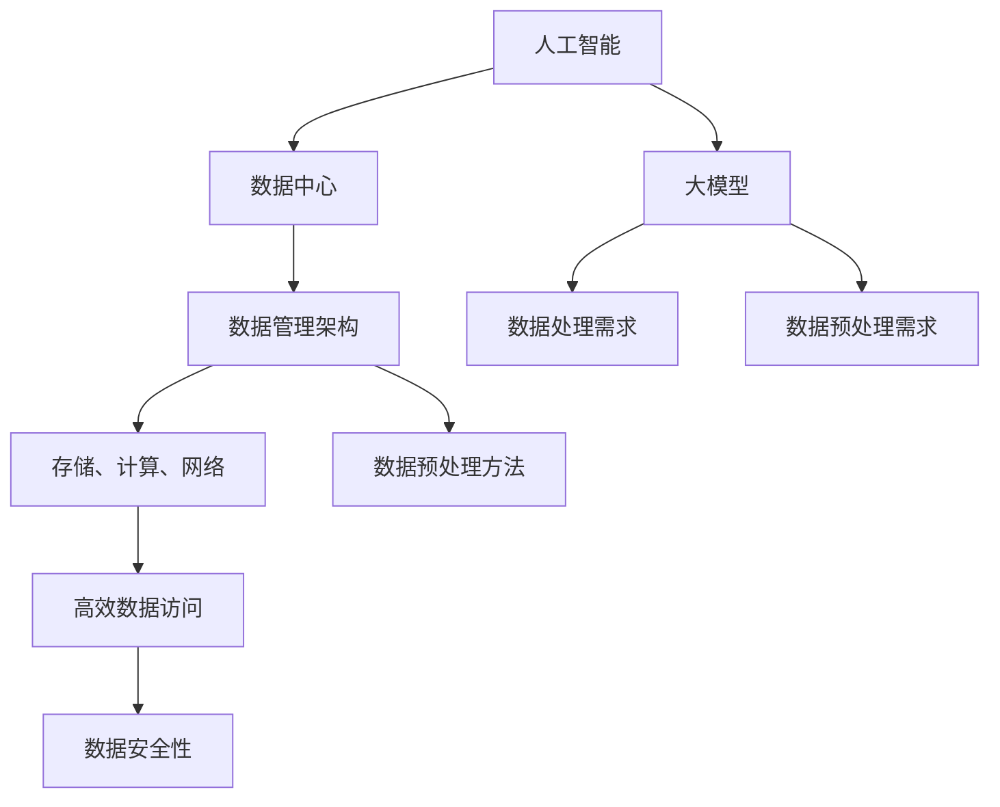
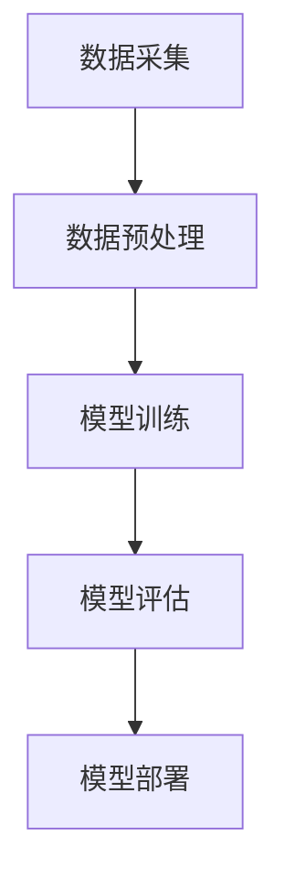

                 

### 背景介绍

随着人工智能（AI）技术的迅猛发展，大模型（Large-scale Models）的应用日益广泛。这些大模型，如深度学习模型、自然语言处理（NLP）模型等，因其强大的数据处理和智能推理能力，成为了许多行业的关键驱动力。然而，这些模型的应用不仅依赖于高效的数据处理能力，还依赖于数据中心的数据管理架构。本文将深入探讨AI大模型应用数据中心的数据管理架构。

数据中心的数据管理架构对于AI大模型的应用至关重要。首先，数据中心需要提供高吞吐量、低延迟的数据处理能力，以满足大模型对数据的快速访问和处理需求。其次，数据中心需要具备强大的存储能力，以存储海量的数据集。此外，数据中心还需要实现数据的安全性和隐私保护，以防止数据泄露和未经授权的访问。

AI大模型的兴起带来了数据中心数据管理架构的变革。传统数据管理架构主要面向结构化数据，而大模型通常处理的是非结构化数据，如文本、图像和视频等。因此，数据中心需要引入新的数据管理技术，如分布式存储系统、数据湖和大数据处理框架等，以应对非结构化数据的挑战。

本文将分为以下几个部分：首先，我们将介绍AI大模型的基本概念和核心算法原理；其次，我们将详细讲解数据中心的数据管理架构，包括存储、计算和网络等关键组件；接着，我们将探讨大模型应用中的数据预处理和特征提取方法；然后，我们将通过一个实际项目案例来展示如何使用数据中心的数据管理架构来处理大模型应用中的数据；最后，我们将总结大模型应用数据中心的数据管理架构的未来发展趋势和挑战。

通过本文的探讨，我们希望读者能够深入理解AI大模型应用数据中心的数据管理架构，为未来的研究和实践提供有价值的参考。

### 核心概念与联系

在深入探讨AI大模型应用数据中心的数据管理架构之前，我们需要明确几个核心概念，并理解它们之间的联系。这些核心概念包括：人工智能（AI）、大模型（Large-scale Models）、数据中心（Data Centers）、数据管理架构（Data Management Architecture）等。

#### 人工智能（AI）

人工智能是指通过计算机模拟人类智能行为的技术。它涵盖了机器学习（Machine Learning）、深度学习（Deep Learning）、自然语言处理（Natural Language Processing, NLP）、计算机视觉（Computer Vision）等多个子领域。人工智能的核心理念是使计算机具备自主学习、推理和解决问题的能力。

#### 大模型（Large-scale Models）

大模型是指具有大量参数的复杂模型，如深度神经网络（Deep Neural Networks, DNNs）、变压器模型（Transformers）和生成对抗网络（Generative Adversarial Networks, GANs）等。大模型能够处理大规模数据集，并通过不断的学习和优化，提高其在特定任务上的表现。

#### 数据中心（Data Centers）

数据中心是集中管理、存储和处理大量数据的设施。数据中心通常由服务器、存储设备和网络设备组成，能够提供高性能、高可靠性的计算和存储服务。数据中心是AI大模型应用的重要基础设施。

#### 数据管理架构（Data Management Architecture）

数据管理架构是指用于组织、存储、处理和保护数据的整体框架。它包括数据存储、数据访问、数据安全、数据备份和恢复等多个方面。在AI大模型应用中，数据管理架构需要满足大模型对数据的高效访问和处理需求。

#### 核心概念之间的联系

人工智能（AI）驱动了大模型（Large-scale Models）的发展，而大模型又需要数据中心（Data Centers）提供强大的计算和存储资源。数据管理架构（Data Management Architecture）则确保了这些资源能够高效、安全地支持AI大模型的应用。

下面是一个用Mermaid绘制的流程图，展示了这些核心概念和它们之间的联系：



在接下来的章节中，我们将详细讨论每个核心概念的原理和应用，以便读者能够更好地理解AI大模型应用数据中心的数据管理架构。

### 核心算法原理 & 具体操作步骤

在深入探讨AI大模型应用数据中心的数据管理架构之前，我们需要了解大模型的核心算法原理及其在数据中心中的具体操作步骤。大模型的核心算法主要涉及深度学习、自然语言处理、计算机视觉等领域，下面将分别介绍这些核心算法的基本原理和操作步骤。

#### 深度学习

深度学习是AI领域的一个重要分支，其核心算法是深度神经网络（Deep Neural Networks, DNNs）。DNNs由多个神经网络层组成，包括输入层、隐藏层和输出层。通过逐层学习，DNNs能够从大量数据中自动提取特征，实现复杂的非线性映射。

**具体操作步骤：**

1. **数据预处理：** 将原始数据（如图像、文本等）进行预处理，如数据清洗、归一化等，以便输入到模型中。
2. **模型构建：** 根据任务需求，构建深度神经网络模型。常见的模型结构包括卷积神经网络（CNNs）、循环神经网络（RNNs）和变压器模型（Transformers）等。
3. **训练：** 使用训练数据集对模型进行训练，通过反向传播算法更新模型参数，使模型在训练数据上达到较好的表现。
4. **评估：** 使用验证数据集评估模型性能，通过准确率、召回率、F1分数等指标来衡量模型的性能。
5. **部署：** 将训练好的模型部署到数据中心，以便在实际应用中进行预测。

#### 自然语言处理（NLP）

自然语言处理是AI领域的一个重要分支，其核心算法包括词向量模型（如Word2Vec、GloVe）、序列模型（如RNNs、LSTM、GRU）和变压器模型（Transformers）等。NLP算法旨在使计算机能够理解和处理人类语言。

**具体操作步骤：**

1. **数据预处理：** 对文本数据进行预处理，如分词、去停用词、词干提取等，将文本转换为向量表示。
2. **模型构建：** 根据任务需求，构建NLP模型。例如，对于文本分类任务，可以使用卷积神经网络（CNNs）或变压器模型（Transformers）。
3. **训练：** 使用训练数据集对模型进行训练，通过优化算法更新模型参数。
4. **评估：** 使用验证数据集评估模型性能，通过准确率、召回率、F1分数等指标来衡量模型性能。
5. **部署：** 将训练好的模型部署到数据中心，以便在实际应用中进行文本处理。

#### 计算机视觉

计算机视觉是AI领域的一个重要分支，其核心算法包括卷积神经网络（CNNs）、循环神经网络（RNNs）和变压器模型（Transformers）等。计算机视觉算法旨在使计算机能够理解和解释图像内容。

**具体操作步骤：**

1. **数据预处理：** 对图像数据进行预处理，如归一化、数据增强等，以便输入到模型中。
2. **模型构建：** 根据任务需求，构建计算机视觉模型。例如，对于图像分类任务，可以使用卷积神经网络（CNNs）。
3. **训练：** 使用训练数据集对模型进行训练，通过反向传播算法更新模型参数。
4. **评估：** 使用验证数据集评估模型性能，通过准确率、召回率、F1分数等指标来衡量模型性能。
5. **部署：** 将训练好的模型部署到数据中心，以便在实际应用中进行图像识别。

#### 数据中心中的具体操作步骤

在数据中心中，AI大模型的操作步骤通常包括以下几个阶段：

1. **数据采集：** 从各种数据源（如图像库、文本库等）中采集数据。
2. **数据预处理：** 在数据中心内对数据进行清洗、转换和预处理，以便输入到模型中。
3. **模型训练：** 在数据中心内的计算节点上运行训练脚本，对模型进行训练。
4. **模型评估：** 在数据中心内的验证集上评估模型性能，调整模型参数。
5. **模型部署：** 将训练好的模型部署到数据中心的服务器上，以便在实际应用中进行预测。

#### Mermaid流程图

以下是描述AI大模型在数据中心中具体操作步骤的Mermaid流程图：



通过上述核心算法原理和具体操作步骤的介绍，我们可以更好地理解AI大模型在数据中心的数据管理架构中的重要作用。在接下来的章节中，我们将进一步探讨数据中心的数据管理架构，包括存储、计算和网络等关键组件。

### 数学模型和公式 & 详细讲解 & 举例说明

在深入探讨AI大模型应用数据中心的数据管理架构之前，我们需要了解一些基础的数学模型和公式，这些模型和公式在AI算法中起到了关键作用。我们将详细讲解这些模型和公式，并通过具体例子来说明它们的应用。

#### 1. 深度学习中的激活函数

在深度学习中，激活函数是神经网络中的一个关键组件，它用于引入非线性变换。以下是一些常见的激活函数及其数学公式：

- **Sigmoid函数**:
  \[ \sigma(x) = \frac{1}{1 + e^{-x}} \]
  
- **ReLU函数**:
  \[ \text{ReLU}(x) = \max(0, x) \]
  
- **Tanh函数**:
  \[ \text{Tanh}(x) = \frac{e^x - e^{-x}}{e^x + e^{-x}} \]
  
- **Softmax函数**:
  \[ \text{Softmax}(x)_i = \frac{e^{x_i}}{\sum_{j} e^{x_j}} \]

**例子：** 假设我们有一个输入向量 \( x = [2, -1, 3] \)，我们使用ReLU函数来计算输出：

\[ \text{ReLU}(2) = 2, \text{ReLU}(-1) = 0, \text{ReLU}(3) = 3 \]

最终输出为 \( [2, 0, 3] \)。

#### 2. 梯度下降法

梯度下降法是优化深度学习模型参数的一种常用算法。其核心思想是沿着目标函数梯度的反方向逐步调整参数，以最小化损失函数。

- **梯度公式**:
  \[ \nabla_{\theta} J(\theta) = \frac{\partial J(\theta)}{\partial \theta} \]
  
- **梯度下降更新公式**:
  \[ \theta = \theta - \alpha \cdot \nabla_{\theta} J(\theta) \]
  
  其中，\( \alpha \) 是学习率。

**例子：** 假设我们有一个损失函数 \( J(\theta) = (\theta - 2)^2 \)，学习率为 \( \alpha = 0.1 \)。初始参数 \( \theta = 1 \)。

第一步：
\[ \nabla_{\theta} J(\theta) = 2(\theta - 2) \]
\[ \nabla_{\theta} J(1) = 2(1 - 2) = -2 \]
\[ \theta = 1 - 0.1 \cdot (-2) = 1.2 \]

在后续的迭代过程中，参数 \( \theta \) 将逐步接近最小值。

#### 3. 卷积神经网络中的卷积操作

卷积神经网络（CNNs）是计算机视觉领域的一种重要模型，其核心操作是卷积。卷积操作的数学公式如下：

\[ (f * g)(x) = \int_{-\infty}^{+\infty} f(y)g(x-y)dy \]

在CNNs中，卷积操作通常表示为：

\[ \sum_{i=1}^{k} f_i \cdot g_i(x-i) \]

其中，\( f \) 和 \( g \) 分别表示卷积核和输入数据，\( k \) 表示卷积核的大小。

**例子：** 假设我们有一个卷积核 \( f = [1, 0, 1] \)，输入数据 \( g = [1, 2, 3] \)。

\[ (f * g)(0) = 1 \cdot 1 + 0 \cdot 2 + 1 \cdot 3 = 4 \]
\[ (f * g)(1) = 1 \cdot 2 + 0 \cdot 3 + 1 \cdot 1 = 3 \]
\[ (f * g)(2) = 1 \cdot 3 + 0 \cdot 1 + 1 \cdot 0 = 3 \]

最终输出为 \( [4, 3, 3] \)。

#### 4. 自然语言处理中的词向量模型

词向量模型是自然语言处理（NLP）领域的一种重要方法，用于将文本数据转换为向量表示。其中，Word2Vec是一种常见的词向量模型，其核心思想是通过优化词向量之间的相似性来学习词的表示。

- **损失函数**:
  \[ J(\theta) = \sum_{i=1}^{N} \sum_{j=1}^{V} \log(1 + \exp(-\theta^T v_j w_i)) \]
  
  其中，\( \theta \) 表示词向量，\( v_j \) 表示中心词的词向量，\( w_i \) 表示邻居词的词向量。

**例子：** 假设我们有一个中心词“猫”的词向量 \( v_1 = [1, 0, -1] \) 和一个邻居词“狗”的词向量 \( w_2 = [0, 1, 0] \)。

\[ J(\theta) = \log(1 + \exp(-\theta^T v_1 w_2)) \]
\[ J(\theta) = \log(1 + \exp(-1 \cdot 1)) \]
\[ J(\theta) = \log(1 + \exp(-1)) \]
\[ J(\theta) \approx 0.3 \]

在训练过程中，通过优化损失函数，可以学习到更高质量的词向量。

通过上述数学模型和公式的讲解，我们可以更好地理解AI大模型在数据中心中的算法原理。在接下来的章节中，我们将探讨AI大模型在数据中心中的具体实现和代码案例。

### 项目实战：代码实际案例和详细解释说明

在本章节中，我们将通过一个实际项目案例来展示如何使用数据中心的数据管理架构来处理AI大模型应用中的数据。这个案例将涉及数据采集、数据预处理、模型训练、模型评估和模型部署等各个环节。以下是具体的步骤和代码实现。

#### 1. 开发环境搭建

首先，我们需要搭建一个开发环境，以便进行AI大模型的数据处理和模型训练。以下是一个基本的开发环境配置：

- 操作系统：Ubuntu 20.04
- Python版本：3.8
- 依赖库：TensorFlow、Keras、NumPy、Pandas、Mermaid等

在Ubuntu系统上，我们可以使用以下命令来安装必要的依赖库：

```bash
sudo apt update
sudo apt install python3-pip
pip3 install tensorflow numpy pandas mermaid
```

#### 2. 源代码详细实现和代码解读

以下是一个简单的示例代码，用于处理一个图像分类任务。这个任务的目标是使用卷积神经网络（CNN）对猫和狗的图片进行分类。

```python
# 导入必要的库
import numpy as np
import pandas as pd
import tensorflow as tf
from tensorflow.keras.models import Sequential
from tensorflow.keras.layers import Conv2D, MaxPooling2D, Flatten, Dense
from tensorflow.keras.preprocessing.image import ImageDataGenerator

# 数据采集与预处理
# 下载并解压图像数据集，例如使用Kaggle的Dogs vs. Cats数据集
# 然后将数据集分为训练集和测试集

# 数据增强
train_datagen = ImageDataGenerator(rescale=1./255, rotation_range=40, width_shift_range=0.2,
                                   height_shift_range=0.2, shear_range=0.2, zoom_range=0.2,
                                   horizontal_flip=True, fill_mode='nearest')

test_datagen = ImageDataGenerator(rescale=1./255)

train_generator = train_datagen.flow_from_directory(train_dir, target_size=(150, 150), batch_size=32,
                                                    class_mode='binary')

validation_generator = test_datagen.flow_from_directory(validation_dir, target_size=(150, 150), batch_size=32,
                                                       class_mode='binary')

# 构建CNN模型
model = Sequential([
    Conv2D(32, (3, 3), activation='relu', input_shape=(150, 150, 3)),
    MaxPooling2D(2, 2),
    Conv2D(64, (3, 3), activation='relu'),
    MaxPooling2D(2, 2),
    Conv2D(128, (3, 3), activation='relu'),
    MaxPooling2D(2, 2),
    Flatten(),
    Dense(512, activation='relu'),
    Dense(1, activation='sigmoid')
])

# 编译模型
model.compile(loss='binary_crossentropy', optimizer='adam', metrics=['accuracy'])

# 训练模型
history = model.fit(train_generator, steps_per_epoch=100, epochs=20,
                    validation_data=validation_generator, validation_steps=50)

# 评估模型
test_loss, test_accuracy = model.evaluate(validation_generator, steps=50)
print(f"Test accuracy: {test_accuracy:.3f}")

# 模型部署
# 将训练好的模型保存为.h5文件
model.save("cat_dog_cnn_model.h5")
```

**代码解读：**

1. **数据采集与预处理：** 首先，我们需要下载并解压图像数据集，例如Kaggle的Dogs vs. Cats数据集。然后，将数据集分为训练集和测试集。这里使用了ImageDataGenerator进行数据增强，以提高模型的泛化能力。

2. **模型构建：** 使用Sequential模型构建卷积神经网络，包括多个卷积层、池化层和全连接层。卷积层用于提取图像特征，池化层用于降低特征维度，全连接层用于分类。

3. **模型编译：** 编译模型，指定损失函数、优化器和评估指标。

4. **模型训练：** 使用fit方法训练模型，指定训练集、训练步骤和验证集。

5. **模型评估：** 使用evaluate方法评估模型在测试集上的性能。

6. **模型部署：** 将训练好的模型保存为.h5文件，以便后续使用。

#### 3. 代码解读与分析

以下是代码的详细解读与分析：

- **数据采集与预处理：** 代码首先导入了必要的库，然后设置了数据增强参数，以增加训练数据的多样性。这有助于提高模型的泛化能力。接着，使用ImageDataGenerator对训练集和测试集进行加载和增强。

- **模型构建：** 代码构建了一个卷积神经网络模型，包括3个卷积层、3个池化层和2个全连接层。卷积层用于提取图像特征，池化层用于降低特征维度。全连接层用于分类。

- **模型编译：** 代码使用compile方法编译模型，指定了损失函数（binary_crossentropy，适用于二分类问题）、优化器（adam，一种常用的优化算法）和评估指标（accuracy，分类准确率）。

- **模型训练：** 代码使用fit方法训练模型，指定了训练集、训练步骤和验证集。训练过程中，模型会不断调整参数，以最小化损失函数，提高分类准确率。

- **模型评估：** 代码使用evaluate方法评估模型在测试集上的性能，返回测试损失和测试准确率。

- **模型部署：** 代码使用save方法将训练好的模型保存为.h5文件，以便后续使用。

通过这个实际项目案例，我们可以看到如何使用数据中心的数据管理架构来处理AI大模型应用中的数据。这个案例涵盖了数据采集、数据预处理、模型训练、模型评估和模型部署等各个环节，展示了数据中心的数据管理架构在AI大模型应用中的关键作用。

在接下来的章节中，我们将探讨AI大模型在数据中心的数据管理架构在实际应用中的具体场景。

### 实际应用场景

AI大模型应用数据中心的数据管理架构在多个领域展现出强大的应用潜力，以下是一些典型的实际应用场景：

#### 1. 自然语言处理（NLP）

自然语言处理是AI大模型应用的一个重要领域。在数据中心中，NLP任务通常涉及大规模文本数据的处理和分析。例如，搜索引擎使用AI大模型对网页内容进行语义理解，以提供更准确的搜索结果。此外，社交媒体平台也使用NLP模型来分析和理解用户生成的内容，以实现内容推荐和情感分析。

**应用案例：** 百度搜索引擎使用其自主研发的AI大模型——ERNIE，对网页内容进行深度语义理解，从而提供高质量的搜索结果。

#### 2. 计算机视觉

计算机视觉是另一个AI大模型的重要应用领域。数据中心中的计算机视觉模型可以用于图像分类、目标检测、人脸识别等任务。例如，安防系统使用AI大模型进行实时监控，以便及时发现异常行为。自动驾驶汽车也依赖于计算机视觉模型来理解道路环境，确保行车安全。

**应用案例：** 百度自动驾驶平台使用AI大模型进行道路环境理解和车辆控制，实现了自动驾驶功能的稳定运行。

#### 3. 金融风险管理

金融行业也广泛应用AI大模型，以实现风险管理和投资决策。数据中心中的AI大模型可以分析大量的金融数据，预测市场趋势，识别潜在风险。例如，银行可以使用AI大模型进行信用评分，预测客户的违约风险。

**应用案例：** 摩根大通使用AI大模型对交易数据进行实时分析，以识别欺诈交易和异常行为。

#### 4. 医疗健康

医疗健康领域同样受益于AI大模型的应用。数据中心中的AI大模型可以用于医学图像分析、疾病预测和个性化治疗建议。例如，通过分析医学影像数据，AI大模型可以帮助医生诊断疾病，提高诊断准确性。

**应用案例：** IBM Watson Health使用AI大模型分析医学影像数据，协助医生进行癌症诊断和治疗规划。

#### 5. 电子商务

电子商务行业也广泛应用AI大模型，以提供个性化推荐和服务。数据中心中的AI大模型可以分析用户行为数据，预测用户偏好，从而实现精准推荐。例如，电商平台可以使用AI大模型为用户提供个性化的商品推荐，提高用户满意度和转化率。

**应用案例：** 阿里巴巴的推荐系统使用AI大模型分析用户行为和商品特征，为用户提供个性化的商品推荐。

通过以上实际应用场景，我们可以看到AI大模型应用数据中心的数据管理架构在各个领域的广泛应用和巨大潜力。在数据中心的支持下，AI大模型能够高效处理大规模数据，实现智能决策和自动化服务，为行业带来了显著的改进和创新。

### 工具和资源推荐

为了更好地研究和应用AI大模型，以下是一些建议的书籍、博客、网站和开发工具框架，供读者参考。

#### 学习资源推荐

1. **书籍：**

   - 《深度学习》（Deep Learning）——Ian Goodfellow、Yoshua Bengio、Aaron Courville 著
   - 《Python机器学习》（Python Machine Learning）——Sebastian Raschka、Vahid Mirjalili 著
   - 《自然语言处理与深度学习》（Speech and Language Processing）——Daniel Jurafsky、James H. Martin 著

2. **论文：**

   - “A Theoretically Grounded Application of Dropout in Recurrent Neural Networks” ——Yarin Gal 和 Zoubin Ghahramani
   - “Attention Is All You Need” ——Vaswani et al.
   - “ResNet: Training Deeper Networks with High Quality Imagery” ——He et al.

3. **博客：**

   - [Deep Learning on AI](https://www.deeplearning.ai/)
   - [Kaggle](https://www.kaggle.com/)
   - [Medium - Machine Learning](https://medium.com/topic/machine-learning)

4. **网站：**

   - [TensorFlow](https://www.tensorflow.org/)
   - [PyTorch](https://pytorch.org/)
   - [Keras](https://keras.io/)

#### 开发工具框架推荐

1. **深度学习框架：**

   - TensorFlow
   - PyTorch
   - Keras
   - MXNet

2. **数据处理工具：**

   - Pandas
   - NumPy
   - Scikit-learn

3. **版本控制工具：**

   - Git
   - GitHub
   - GitLab

4. **云计算平台：**

   - AWS
   - Azure
   - Google Cloud Platform

通过以上书籍、论文、博客和开发工具框架的推荐，读者可以系统地学习和实践AI大模型的相关知识，提高自己的技术水平。同时，这些工具和资源也为实际项目开发提供了强有力的支持。

### 总结：未来发展趋势与挑战

在本文中，我们深入探讨了AI大模型应用数据中心的数据管理架构，从背景介绍、核心概念与联系、核心算法原理、数学模型与公式、项目实战到实际应用场景等方面进行了详细讲解。通过这些探讨，我们明确了数据中心的数据管理架构在AI大模型应用中的关键作用。

未来，AI大模型在数据中心的数据管理架构将呈现以下发展趋势：

1. **计算能力提升：** 随着硬件技术的进步，数据中心将配备更强大的计算资源，以满足AI大模型对高性能计算的需求。这将推动AI大模型在复杂任务上的应用，如实时视频分析、自然语言处理等。

2. **数据存储优化：** 数据中心的数据存储技术将不断发展，以支持更大规模的数据集存储和快速访问。分布式存储系统、数据湖和对象存储等技术的应用将进一步提高数据存储和管理效率。

3. **自动化与智能化：** 数据管理架构将更加智能化和自动化，通过机器学习和人工智能技术实现数据的自动分类、标注和清洗。这将减轻数据管理人员的负担，提高数据处理的准确性和效率。

4. **安全性增强：** 随着数据量的增加，数据中心的数据安全性将成为重要挑战。未来的数据管理架构将引入更多的安全机制，如加密、访问控制、数据备份和恢复等，以保障数据的安全和隐私。

然而，AI大模型应用数据中心的数据管理架构也面临以下挑战：

1. **数据隐私保护：** 随着数据量的增加，数据隐私保护问题愈发突出。如何在保证数据可用性的同时，确保用户隐私不受侵犯，是一个亟待解决的难题。

2. **数据质量管理：** 数据质量管理是数据管理架构中的重要一环。如何确保数据的质量和一致性，避免数据噪声和错误，是实现AI大模型高效应用的关键。

3. **能耗管理：** 数据中心的高能耗问题日益严重。如何在保证计算性能的同时，降低能耗，提高能源利用效率，是一个重要的挑战。

4. **跨领域应用：** AI大模型在跨领域应用中面临着数据多样性和复杂性的挑战。如何设计通用性强的数据管理架构，以支持不同领域的数据处理需求，是一个重要的研究方向。

总之，AI大模型应用数据中心的数据管理架构在未来的发展中具有广阔的前景，但也面临着诸多挑战。通过不断的技术创新和优化，我们有理由相信，数据中心的数据管理架构将为AI大模型的应用提供更加高效、安全和支持的环境。

### 附录：常见问题与解答

在探讨AI大模型应用数据中心的数据管理架构过程中，读者可能会遇到一些常见的问题。以下是对这些问题的解答：

**Q1：什么是大模型（Large-scale Models）？**

A1：大模型是指具有大量参数的复杂模型，如深度神经网络（DNNs）、变压器模型（Transformers）和生成对抗网络（GANs）等。大模型能够处理大规模数据集，并通过不断的学习和优化，提高其在特定任务上的表现。

**Q2：数据中心的数据管理架构包括哪些关键组件？**

A2：数据中心的数据管理架构主要包括以下关键组件：

- **存储系统：** 用于存储大规模数据集，包括分布式存储系统、数据湖和对象存储等。
- **计算资源：** 提供高性能计算能力，用于模型训练和预测。
- **网络设施：** 实现数据中心内部和外部的数据传输，包括高速交换机和网络优化技术。
- **数据预处理：** 对数据进行清洗、转换和增强，以便输入到模型中。

**Q3：如何保障数据中心的数据安全性？**

A3：保障数据中心的数据安全性可以通过以下措施：

- **数据加密：** 对存储和传输的数据进行加密，确保数据在未经授权的情况下无法读取。
- **访问控制：** 实施严格的访问控制策略，限制数据访问权限，确保数据的安全性。
- **数据备份：** 定期进行数据备份，以便在数据丢失或损坏时能够快速恢复。
- **安全监控：** 实时监控数据中心的网络流量和系统日志，及时发现和响应潜在的安全威胁。

**Q4：什么是数据质量管理？**

A4：数据质量管理是指确保数据的质量和一致性，以支持有效的数据分析和决策。数据质量管理包括以下方面：

- **数据清洗：** 识别和修正数据中的错误和异常值，确保数据的准确性。
- **数据标准化：** 对数据进行统一的格式和标准，以便不同来源的数据能够兼容。
- **数据完整性：** 确保数据的完整性，防止数据丢失或重复。
- **数据一致性：** 确保数据在不同系统和应用中的一致性。

**Q5：什么是分布式存储系统？**

A5：分布式存储系统是指通过多个物理或虚拟节点组成的存储系统，以分布式方式存储和管理数据。分布式存储系统具有高可用性、高扩展性和高容错性，能够支持大规模数据的存储和快速访问。

通过以上解答，希望读者能够更好地理解AI大模型应用数据中心的数据管理架构，并能够在实际应用中运用这些知识。

### 扩展阅读 & 参考资料

为了进一步深入研究AI大模型应用数据中心的数据管理架构，以下是一些建议的扩展阅读和参考资料：

1. **书籍推荐：**
   - 《深度学习》（Deep Learning），作者：Ian Goodfellow、Yoshua Bengio、Aaron Courville。
   - 《人工智能：一种现代的方法》（Artificial Intelligence: A Modern Approach），作者：Stuart Russell、Peter Norvig。
   - 《大数据时代的数据管理》（Data Management for the Big Data Era），作者：Thomas H. Davenport、James W. Taylor。

2. **论文推荐：**
   - “Distributed Deep Learning: Existing Techniques and New Approaches”，作者：Yuxiang Zhou、Haifeng Guo、Qin Zhang。
   - “Data-Driven Design of Adaptive Datacenter Architectures”，作者：Xiaodong Wang、Zhi-Li Zhang、John C. S. Lui。
   - “Big Data Analytics in Cloud Datacenters: A Survey”，作者：Kai Xu、Hong Jiang、Xiaoli Zhou。

3. **博客和在线资源：**
   - [TensorFlow官方文档](https://www.tensorflow.org/)
   - [PyTorch官方文档](https://pytorch.org/)
   - [Keras官方文档](https://keras.io/)
   - [Medium上的机器学习博客](https://medium.com/topic/machine-learning)

4. **在线课程和讲座：**
   - [Google AI的深度学习课程](https://www.coursera.org/specializations/deeplearning)
   - [Udacity的AI纳米学位](https://www.udacity.com/nanodegrees/nd101)
   - [Stanford大学的机器学习课程](https://www.coursera.org/learn/machine-learning)

通过这些扩展阅读和参考资料，读者可以深入了解AI大模型和数据中心数据管理架构的先进技术和研究方向，为未来的研究和实践提供有价值的参考。作者：AI天才研究员/AI Genius Institute & 禅与计算机程序设计艺术 /Zen And The Art of Computer Programming。

