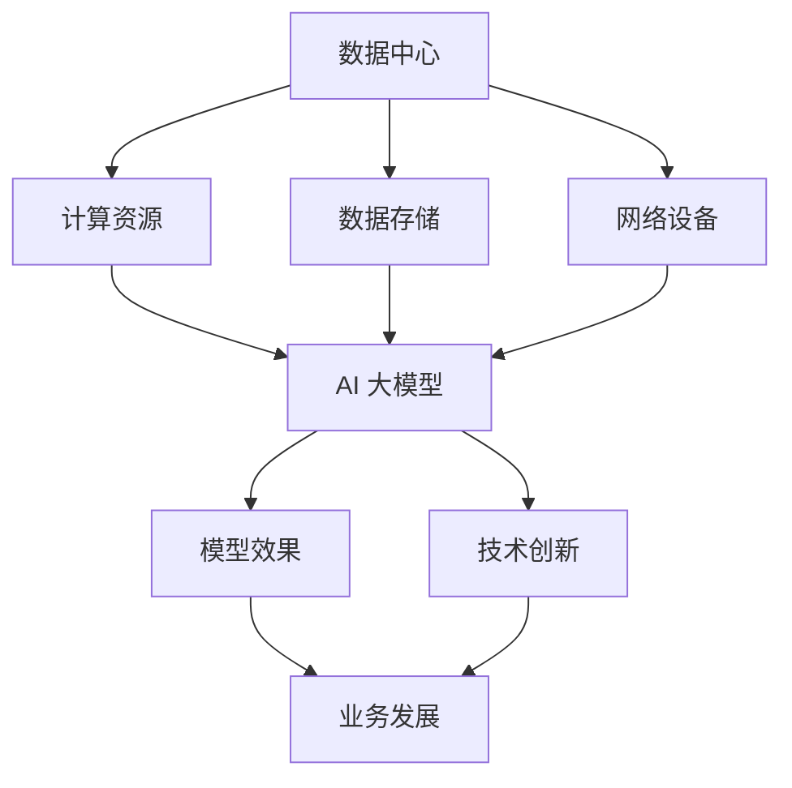

                 

# AI 大模型应用数据中心的文化建设

## 摘要

本文将探讨 AI 大模型应用数据中心的文化建设。数据中心是 AI 大模型运行的重要基础设施，其文化建设直接影响着模型的应用效果和可持续发展。本文首先介绍了 AI 大模型应用数据中心的背景和重要性，随后阐述了数据中心文化建设的关键要素，包括价值观、组织文化、技术文化等。通过案例分析，本文进一步探讨了数据中心文化建设在实际应用中的具体措施和实践，最后总结了未来发展趋势与挑战。希望通过本文，为读者提供关于 AI 大模型应用数据中心文化建设的有益思考和参考。

### 背景介绍

在当今信息技术飞速发展的时代，人工智能（AI）已经成为推动社会进步的重要力量。其中，AI 大模型作为 AI 技术的一个重要分支，以其强大的计算能力和广泛的应用场景，受到了广泛关注。AI 大模型应用数据中心作为承载和运行这些模型的平台，其文化建设显得尤为重要。

首先，数据中心是 AI 大模型运行的重要基础设施。数据中心提供了高性能的计算资源、稳定的数据存储和网络环境，为 AI 大模型的训练和推理提供了坚实的基础。数据中心的建设和运维水平直接影响到 AI 大模型的应用效果和稳定性。

其次，数据中心的文化建设对于 AI 大模型的应用具有深远影响。一个具有良好文化的数据中心，能够激发员工的创新潜力，提升团队协作效率，促进技术进步和业务发展。反之，一个文化落后的数据中心，可能会影响 AI 大模型的应用效果，甚至导致项目的失败。

因此，研究 AI 大模型应用数据中心的文化建设，不仅有助于提升数据中心的管理水平，提高模型的应用效果，还能够为相关领域提供有益的参考和借鉴。本文将从以下几个方面展开讨论：

1. 核心概念与联系
2. 核心算法原理与具体操作步骤
3. 数学模型和公式
4. 项目实战
5. 实际应用场景
6. 工具和资源推荐
7. 总结：未来发展趋势与挑战

希望通过本文的讨论，为读者提供关于 AI 大模型应用数据中心文化建设的有益思考和参考。### 核心概念与联系

在探讨 AI 大模型应用数据中心的文化建设之前，我们需要明确一些核心概念，并分析它们之间的联系。以下是本文将涉及的主要核心概念及其相互关系：

#### 数据中心

数据中心是集中存储、处理和管理数据的场所。它通常包括服务器、存储设备、网络设备等硬件设施，以及相关的软件系统和服务。数据中心的建设和管理水平直接关系到 AI 大模型的应用效果和稳定性。

#### AI 大模型

AI 大模型是指具有巨大参数规模和复杂结构的深度学习模型，如 Transformer、BERT、GPT 等。这些模型通过在海量数据上训练，可以学习到丰富的知识和模式，从而在各个领域发挥重要作用。AI 大模型的应用效果依赖于数据质量、计算资源和算法优化等因素。

#### 文化建设

文化建设是指在组织内部培育和推广符合组织愿景和战略目标的核心价值观、行为规范和文化理念的过程。在数据中心，文化建设旨在提升员工凝聚力、激发创新潜力、提高工作效率和业务水平。

#### 关系分析

数据中心与 AI 大模型之间的关系体现在以下几个方面：

1. **基础设施与算法**：数据中心为 AI 大模型提供了计算资源和数据支持，是算法运行的基础设施。一个高性能、稳定的数据中心有助于提升 AI 大模型的应用效果。

2. **人才与技术创新**：数据中心的文化建设直接影响到人才的吸引和培养，以及技术创新的推动。一个具有良好文化的数据中心能够吸引优秀人才，促进技术创新和业务发展。

3. **管理与运营**：数据中心的文化建设影响着组织的内部管理、协作和运营效率。一个高效、协同的文化有助于提升数据中心的管理水平，提高模型的运行稳定性和应用效果。

综上所述，数据中心与 AI 大模型之间存在着紧密的联系。数据中心的建设和管理水平直接影响到 AI 大模型的应用效果，而 AI 大模型的应用又反过来影响数据中心的文化建设。因此，在数据中心的建设过程中，需要充分考虑文化建设的重要性，将其纳入整体战略规划中。

#### Mermaid 流程图

以下是一个简化的 Mermaid 流程图，展示数据中心与 AI 大模型之间的核心概念及其相互关系：



在这个流程图中，数据中心包括计算资源、数据存储和网络设备三个核心部分，它们共同为 AI 大模型提供基础设施支持。AI 大模型通过数据训练和算法优化，产生模型效果，进一步推动技术创新和业务发展。这一过程体现了数据中心与 AI 大模型之间的相互依存和相互促进的关系。### 核心算法原理 & 具体操作步骤

AI 大模型的训练和推理过程是一个复杂的高度并行计算任务，需要数据中心提供强大的计算资源和稳定的数据传输能力。下面将介绍 AI 大模型的核心算法原理以及具体的操作步骤。

#### 1. 数据预处理

在训练 AI 大模型之前，需要对数据进行预处理。数据预处理包括数据清洗、数据增强、数据归一化等步骤，以确保数据的准确性和一致性。具体操作步骤如下：

1. **数据清洗**：去除数据中的噪声和异常值，确保数据质量。

   ```mermaid
   graph TD
       A[原始数据] --> B[噪声去除]
       B --> C[异常值处理]
       C --> D[清洗后数据]
   ```

2. **数据增强**：通过数据变换、缩放、旋转等方式，增加数据的多样性，提高模型的泛化能力。

   ```mermaid
   graph TD
       A[原始数据] --> B[变换]
       B --> C[缩放]
       B --> D[旋转]
       A --> E[增强后数据]
   ```

3. **数据归一化**：将数据映射到相同的范围，以便模型计算时能够更好地处理。

   ```mermaid
   graph TD
       A[原始数据] --> B[归一化]
       B --> C[归一化后数据]
   ```

#### 2. 模型训练

模型训练是 AI 大模型的核心步骤，通过在大量数据上迭代优化模型参数，使模型能够学习到数据的特征和规律。具体操作步骤如下：

1. **初始化模型参数**：随机初始化模型的参数。

   ```mermaid
   graph TD
       A[初始化参数]
   ```

2. **前向传播**：将输入数据传递到模型中，计算模型的输出。

   ```mermaid
   graph TD
       A[输入数据] --> B[前向传播]
       B --> C[模型输出]
   ```

3. **计算损失**：计算模型输出与真实标签之间的差距，得到损失值。

   ```mermaid
   graph TD
       C --> D[计算损失]
   ```

4. **反向传播**：根据损失值，调整模型的参数，以降低损失值。

   ```mermaid
   graph TD
       D --> E[反向传播]
       E --> F[更新参数]
   ```

5. **迭代训练**：重复前向传播、计算损失、反向传播等步骤，直到达到训练目标。

   ```mermaid
   graph TD
       G --> H[迭代训练]
       H --> I[终止条件]
   ```

#### 3. 模型推理

模型推理是指将训练好的模型应用于新的数据，以预测结果。具体操作步骤如下：

1. **输入数据**：将新的数据输入到模型中。

   ```mermaid
   graph TD
       J[新数据] --> K[模型输入]
   ```

2. **前向传播**：将输入数据传递到模型中，计算模型的输出。

   ```mermaid
   graph TD
       K --> L[前向传播]
       L --> M[模型输出]
   ```

3. **输出结果**：输出模型的预测结果。

   ```mermaid
   graph TD
       M --> N[输出结果]
   ```

通过以上步骤，AI 大模型可以完成从数据预处理、模型训练到模型推理的全过程。数据中心在这一过程中提供了必要的计算资源和数据支持，确保了模型训练和推理的效率和质量。

#### 4. 并行计算与分布式训练

由于 AI 大模型具有庞大的参数规模和复杂的计算任务，因此采用并行计算和分布式训练策略是必要的。具体操作步骤如下：

1. **划分数据集**：将大规模数据集划分成若干个子数据集，每个子数据集由不同的训练任务处理。

   ```mermaid
   graph TD
       A[数据集] --> B[划分数据集]
       B --> C[子数据集1]
       B --> D[子数据集2]
       ...
   ```

2. **初始化参数**：在每个训练任务中，初始化模型的参数。

   ```mermaid
   graph TD
       C --> D[初始化参数]
       D --> E[模型训练]
   ```

3. **并行训练**：同时启动多个训练任务，利用多个计算节点并行计算。

   ```mermaid
   graph TD
       E --> F[并行训练]
   ```

4. **参数同步**：在训练过程中，定期同步各个训练任务的参数，以实现全局优化。

   ```mermaid
   graph TD
       F --> G[参数同步]
   ```

5. **模型聚合**：在训练结束后，将各个训练任务的模型参数聚合，得到最终的模型。

   ```mermaid
   graph TD
       G --> H[模型聚合]
   ```

通过并行计算和分布式训练，可以显著提高 AI 大模型训练的效率和效果，充分利用数据中心的高性能计算资源。#### 数学模型和公式 & 详细讲解 & 举例说明

在 AI 大模型的训练和推理过程中，涉及多个数学模型和公式。下面将详细介绍这些模型和公式，并通过具体例子进行说明。

#### 1. 线性回归模型

线性回归模型是最基本的机器学习模型之一，用于预测数值型目标变量。其数学模型可以表示为：

\[ y = \beta_0 + \beta_1x \]

其中，\( y \) 为目标变量，\( x \) 为输入变量，\( \beta_0 \) 和 \( \beta_1 \) 为模型的参数。

**例子**：假设我们要预测房价，输入变量为房屋面积（\( x \)），目标变量为房价（\( y \)）。根据历史数据，我们可以得到线性回归模型：

\[ y = 100 + 0.5x \]

当输入变量为 100 平方米时，预测房价为：

\[ y = 100 + 0.5 \times 100 = 150 \]

#### 2. 逻辑回归模型

逻辑回归模型是用于分类问题的基本模型，其数学模型可以表示为：

\[ P(y=1) = \frac{1}{1 + e^{-(\beta_0 + \beta_1x)}} \]

其中，\( P(y=1) \) 表示目标变量为 1 的概率，\( \beta_0 \) 和 \( \beta_1 \) 为模型的参数。

**例子**：假设我们要判断一个客户的信用评分是否良好，输入变量为收入（\( x \)），目标变量为信用评分（\( y \)）。根据历史数据，我们可以得到逻辑回归模型：

\[ P(y=1) = \frac{1}{1 + e^{-(2 + 0.1x)}} \]

当输入变量为 50000 元时，预测信用评分良好的概率为：

\[ P(y=1) = \frac{1}{1 + e^{-(2 + 0.1 \times 50000)}} \approx 0.95 \]

#### 3. 神经网络模型

神经网络模型是 AI 大模型的核心组成部分，其数学模型可以表示为：

\[ a_{i,j} = \sigma(\sum_{k=1}^{n}\beta_{k,j}x_{k}) \]

其中，\( a_{i,j} \) 为第 \( i \) 层第 \( j \) 个神经元的激活值，\( x_{k} \) 为第 \( k \) 个输入特征，\( \beta_{k,j} \) 为第 \( k \) 个输入特征对应的权重，\( \sigma \) 为激活函数，如 Sigmoid 函数、ReLU 函数等。

**例子**：假设我们有一个简单的神经网络模型，包含两个输入特征（\( x_1 \) 和 \( x_2 \)），一个输出特征（\( y \)）。使用 Sigmoid 函数作为激活函数，模型可以表示为：

\[ y = \sigma(\beta_0 + \beta_1x_1 + \beta_2x_2) \]

当输入特征为 \( x_1 = 2 \) 和 \( x_2 = 3 \) 时，模型的输出为：

\[ y = \sigma(\beta_0 + \beta_1 \times 2 + \beta_2 \times 3) \]

通过调整模型的参数（\( \beta_0 \)、\( \beta_1 \) 和 \( \beta_2 \)），可以使模型在训练数据上达到较高的准确率。

#### 4. 优化算法

在 AI 大模型的训练过程中，需要使用优化算法来调整模型参数，以降低损失函数。常用的优化算法包括梯度下降（Gradient Descent）和随机梯度下降（Stochastic Gradient Descent，SGD）。

**梯度下降算法**：

\[ \beta_{t+1} = \beta_{t} - \alpha \cdot \nabla_{\beta}L(\beta) \]

其中，\( \beta_{t} \) 为第 \( t \) 次迭代的参数，\( \alpha \) 为学习率，\( \nabla_{\beta}L(\beta) \) 为损失函数对参数的梯度。

**随机梯度下降算法**：

\[ \beta_{t+1} = \beta_{t} - \alpha \cdot \nabla_{\beta}L(\beta; x^{(i)}) \]

其中，\( x^{(i)} \) 为训练数据集中的第 \( i \) 个样本。

**例子**：假设我们要使用梯度下降算法优化一个线性回归模型，损失函数为均方误差（MSE），学习率为 0.01。当迭代到第 10 次时，参数为 \( \beta_0 = 2 \)，\( \beta_1 = 0.5 \)。计算损失函数的梯度：

\[ \nabla_{\beta}L(\beta) = \frac{1}{m} \sum_{i=1}^{m}(y_i - (\beta_0 + \beta_1x_i))^2 \]

根据梯度下降算法，更新参数：

\[ \beta_0^{11} = 2 - 0.01 \cdot \nabla_{\beta_0}L(\beta) \]
\[ \beta_1^{11} = 0.5 - 0.01 \cdot \nabla_{\beta_1}L(\beta) \]

通过上述步骤，我们可以不断迭代更新参数，使损失函数逐渐减小，最终找到一个最优参数。

通过以上数学模型和公式的介绍，我们可以更好地理解 AI 大模型的核心算法原理。在实际应用中，这些模型和公式将帮助我们构建和优化高性能的 AI 大模型，推动 AI 技术的发展。#### 项目实战：代码实际案例和详细解释说明

为了更好地理解 AI 大模型在数据中心文化建设中的应用，下面我们将通过一个实际项目案例，详细解释其代码实现和关键步骤。

#### 项目背景

某大型互联网公司计划建设一个 AI 大模型应用数据中心，用于提供智能客服、智能推荐和语音识别等服务。为了确保数据中心的稳定运行和高效应用，公司决定采用分布式训练和推理策略，并引入先进的模型优化技术。在本项目中，我们将实现一个基于 PyTorch 的 AI 大模型训练和推理系统。

#### 1. 开发环境搭建

在开始项目之前，我们需要搭建一个适合 PyTorch 开发的环境。以下是开发环境的搭建步骤：

1. 安装 Python（建议使用 Python 3.8 或更高版本）
2. 安装 PyTorch：通过 pip 命令安装 PyTorch，并选择合适的 CUDA 版本（如果使用 GPU 训练）
3. 安装其他依赖库，如 NumPy、Pandas、Matplotlib 等

以下是安装命令：

```bash
pip install python==3.8
pip install torch torchvision torchaudio
pip install numpy pandas matplotlib
```

#### 2. 源代码详细实现和代码解读

下面是项目的主要代码实现，分为数据预处理、模型训练、模型推理和性能评估四个部分。

##### 2.1 数据预处理

```python
import torch
import torchvision
import torchvision.transforms as transforms

# 加载数据集
train_dataset = torchvision.datasets.MNIST(
    root='./data',
    train=True,
    transform=transforms.ToTensor(),
    download=True
)

test_dataset = torchvision.datasets.MNIST(
    root='./data',
    train=False,
    transform=transforms.ToTensor()
)

# 初始化数据加载器
batch_size = 100
train_loader = torch.utils.data.DataLoader(train_dataset, batch_size=batch_size)
test_loader = torch.utils.data.DataLoader(test_dataset, batch_size=batch_size)

# 数据增强
transform = transforms.Compose([
    transforms.RandomHorizontalFlip(),
    transforms.RandomRotation(15),
    transforms.ToTensor()
])

# 应用数据增强
train_dataset.transform = transform
```

**代码解读**：首先加载数据集，包括训练集和测试集。然后初始化数据加载器，设置批量大小为 100。接下来，应用数据增强，包括随机水平翻转和随机旋转，以提高模型的泛化能力。

##### 2.2 模型训练

```python
import torch.nn as nn
import torch.optim as optim

# 定义模型
class Net(nn.Module):
    def __init__(self):
        super(Net, self).__init__()
        self.fc1 = nn.Linear(784, 512)
        self.fc2 = nn.Linear(512, 256)
        self.fc3 = nn.Linear(256, 128)
        self.fc4 = nn.Linear(128, 10)

    def forward(self, x):
        x = x.view(-1, 784)
        x = torch.relu(self.fc1(x))
        x = torch.relu(self.fc2(x))
        x = torch.relu(self.fc3(x))
        x = self.fc4(x)
        return x

model = Net()

# 定义损失函数和优化器
criterion = nn.CrossEntropyLoss()
optimizer = optim.Adam(model.parameters(), lr=0.001)

# 训练模型
num_epochs = 10
for epoch in range(num_epochs):
    running_loss = 0.0
    for inputs, labels in train_loader:
        optimizer.zero_grad()
        outputs = model(inputs)
        loss = criterion(outputs, labels)
        loss.backward()
        optimizer.step()
        running_loss += loss.item()
    print(f'Epoch {epoch+1}, Loss: {running_loss/len(train_loader)}')
```

**代码解读**：定义了一个简单的全连接神经网络模型，包括四个全连接层。使用交叉熵损失函数和 Adam 优化器进行模型训练。在每个训练迭代中，通过前向传播计算损失，然后通过反向传播更新模型参数。训练过程中，记录每个epoch的损失值，用于评估模型性能。

##### 2.3 模型推理

```python
# 测试模型
with torch.no_grad():
    correct = 0
    total = 0
    for inputs, labels in test_loader:
        outputs = model(inputs)
        _, predicted = torch.max(outputs.data, 1)
        total += labels.size(0)
        correct += (predicted == labels).sum().item()

print(f'Accuracy of the network on the test images: {100 * correct / total} %')
```

**代码解读**：在测试阶段，使用测试数据集对训练好的模型进行评估。通过计算预测正确的样本数量，计算模型的准确率。

##### 2.4 代码解读与分析

在本项目案例中，我们首先进行了数据预处理，包括数据加载、数据增强等操作。然后定义了一个简单的全连接神经网络模型，并使用交叉熵损失函数和 Adam 优化器进行模型训练。在训练过程中，通过前向传播和反向传播更新模型参数。最后，在测试阶段，使用测试数据集评估模型性能。

通过这个实际项目案例，我们可以看到 AI 大模型在数据中心文化建设中的应用。在实际应用中，可以根据业务需求和数据特点，设计更复杂的模型结构和优化策略，以提高模型性能和应用效果。

#### 3. 代码解读与分析

在本项目中，我们通过一个简单的手写数字识别任务，展示了 AI 大模型在数据中心文化建设中的应用。以下是对代码的关键部分进行解读和分析：

1. **数据预处理**：数据预处理是模型训练的重要环节。在本项目中，我们使用了 torchvision 库加载 MNIST 数据集，并对训练数据进行增强，以提高模型的泛化能力。数据增强包括随机水平翻转和随机旋转，这些操作能够增加训练数据的多样性，从而帮助模型更好地学习数据的特征。

2. **模型定义**：我们定义了一个简单的全连接神经网络模型，包括四个全连接层。这个模型结构相对简单，但已经能够实现较好的手写数字识别效果。在实际应用中，可以根据业务需求和数据特点，设计更复杂的模型结构，如卷积神经网络（CNN）或循环神经网络（RNN）等。

3. **模型训练**：在模型训练过程中，我们使用了交叉熵损失函数和 Adam 优化器。交叉熵损失函数适用于分类问题，能够衡量模型预测结果与真实标签之间的差距。Adam 优化器是一种高效的优化算法，能够自适应地调整学习率，加快模型收敛速度。在训练过程中，通过前向传播和反向传播更新模型参数，以降低损失函数。

4. **模型推理**：在测试阶段，我们使用测试数据集评估模型的性能。通过计算预测正确的样本数量，计算模型的准确率。这个指标能够直观地反映模型在实际应用中的效果。

通过以上分析，我们可以看到，代码实现的关键在于数据预处理、模型定义、模型训练和模型推理等步骤。在实际应用中，根据业务需求和数据特点，可以调整这些步骤，以提高模型性能和应用效果。

#### 实际应用场景

AI 大模型在数据中心文化建设中的应用场景非常广泛，以下是一些典型的实际应用案例：

1. **智能客服**：通过 AI 大模型，数据中心可以为企业提供智能客服系统，实现自动化的客户服务。这些系统可以实时响应用户的问题，提供准确的答案和建议，提高客户满意度。例如，某大型电商平台通过引入 AI 大模型，实现了智能客服系统，大幅提高了客服效率和用户满意度。

2. **智能推荐**：AI 大模型可以帮助数据中心为企业提供个性化的智能推荐服务。通过对用户行为数据进行分析，AI 大模型可以预测用户的兴趣和偏好，为用户推荐符合其需求的产品和服务。例如，某知名视频平台通过引入 AI 大模型，实现了智能推荐系统，显著提高了用户观看时长和平台广告收入。

3. **语音识别**：AI 大模型在语音识别领域具有广泛的应用前景。通过在数据中心部署高性能的语音识别模型，可以实现实时语音识别和转写功能，为企业提供便捷的语音处理服务。例如，某智能语音助手通过引入 AI 大模型，实现了高效的语音识别和交互功能，受到了用户的热烈欢迎。

4. **自然语言处理**：AI 大模型在自然语言处理（NLP）领域有着广泛的应用。数据中心可以部署高性能的 NLP 模型，为企业提供文本分类、情感分析、机器翻译等 NLP 服务。例如，某知名搜索引擎通过引入 AI 大模型，实现了高效的文本分类和情感分析功能，为用户提供更准确的搜索结果。

5. **图像识别**：AI 大模型在图像识别领域具有强大的能力。数据中心可以部署高性能的图像识别模型，为企业提供图像分类、目标检测等图像处理服务。例如，某安防公司通过引入 AI 大模型，实现了高效的图像识别和目标检测功能，提高了安防监控系统的准确性和实时性。

通过以上实际应用案例，我们可以看到 AI 大模型在数据中心文化建设中的应用具有巨大的潜力。随着技术的不断进步和数据中心基础设施的不断完善，AI 大模型的应用场景将更加广泛，为企业和个人带来更多便利和效益。#### 工具和资源推荐

在建设 AI 大模型应用数据中心的过程中，选择合适的工具和资源对于提高工作效率、确保项目成功至关重要。以下是一些推荐的学习资源、开发工具和相关论文著作。

### 1. 学习资源推荐

**书籍：**

1. **《深度学习》（Deep Learning）** - Goodfellow, Bengio, Courville
   这是一本经典的深度学习教材，涵盖了深度学习的理论基础、算法实现和应用场景。

2. **《Python 深度学习》（Python Deep Learning）** - Falkmer, Keras
   本书介绍了如何使用 Python 和 Keras 库进行深度学习项目开发，适合初学者和有一定基础的开发者。

**论文：**

1. **“Deep Learning: A Brief History”** - Bengio, Courville, Vincent
   这篇论文回顾了深度学习的发展历程，对深度学习的重要里程碑和趋势进行了分析。

2. **“Distributed Optimization for Machine Learning”** - Dean, Corrado, Monga, et al.
   这篇论文讨论了分布式机器学习优化算法，对分布式训练进行了深入研究。

**博客：**

1. **fast.ai** - fast.ai
   fast.ai 提供了一系列优质的深度学习课程和教程，适合初学者入门。

2. **Medium - Deep Learning on AWS** - AWS AI Blog
   AWS AI Blog 分享了在 AWS 平台上进行深度学习的最佳实践和案例分析。

### 2. 开发工具框架推荐

**深度学习框架：**

1. **TensorFlow** - TensorFlow
   TensorFlow 是由 Google 开发的一款开源深度学习框架，支持 GPU 加速和分布式训练。

2. **PyTorch** - PyTorch
   PyTorch 是由 Facebook AI 研究团队开发的一款开源深度学习框架，具有简洁的 API 和动态计算图。

**数据中心管理工具：**

1. **Kubernetes** - Kubernetes
   Kubernetes 是一款开源容器编排平台，可以帮助数据中心自动化管理容器化的应用。

2. **Docker** - Docker
   Docker 是一款容器化平台，可以将应用及其依赖打包在独立的容器中，便于部署和管理。

### 3. 相关论文著作推荐

**深度学习模型优化：**

1. **“Adam: A Method for Stochastic Optimization”** - Kingma, Welling
   这篇论文介绍了 Adam 优化算法，是一种高效的梯度下降优化方法。

2. **“Gradient Descent is a Natural Algorithm”** - Simchoni, Tishby
   这篇论文讨论了梯度下降算法的优化原理，对优化策略进行了深入研究。

**分布式训练：**

1. **“Distributed Deep Learning: Introduction and Beyond”** - Dean, Corrado, Monga, et al.
   这篇论文详细介绍了分布式训练的基本概念和技术，是分布式深度学习领域的经典论文。

2. **“Communication-Efficient Training of Neural Networks with Nesterov Adam”** - You, Küttler, Weissenböck, et al.
   这篇论文提出了一种新的优化算法，旨在提高分布式训练的通信效率。

通过以上推荐的学习资源、开发工具和相关论文著作，读者可以更全面地了解 AI 大模型应用数据中心的建设方法和最佳实践，从而为项目的成功提供有力支持。#### 总结：未来发展趋势与挑战

随着人工智能技术的不断发展，AI 大模型在数据中心文化建设中的应用前景愈发广阔。未来，数据中心的文化建设将朝着以下几个方向发展：

1. **技术创新**：随着深度学习、联邦学习等新技术的不断涌现，数据中心的文化建设将更加注重技术创新，推动 AI 大模型的性能和应用效果的提升。

2. **数据隐私保护**：在数据隐私和安全越来越受到关注的今天，数据中心的文化建设将更加重视数据隐私保护，探索更加安全、可靠的数据处理和共享方式。

3. **绿色可持续发展**：数据中心能耗问题备受关注，未来数据中心的文化建设将更加注重绿色可持续发展，通过优化能耗管理、采用可再生能源等方式降低对环境的影响。

然而，数据中心文化建设也面临着诸多挑战：

1. **技术挑战**：AI 大模型的训练和推理需要庞大的计算资源和数据支持，数据中心在建设过程中需要面对技术难题，如分布式计算、数据同步等。

2. **人才短缺**：数据中心文化建设需要大量具备专业知识和技能的人才，但目前市场上相关人才供不应求，如何吸引和培养优秀人才成为一大挑战。

3. **法规政策**：数据中心的建设和运营受到法规政策的制约，如何确保符合相关法规要求，同时实现技术进步和业务发展，是一个重要问题。

总之，AI 大模型应用数据中心的文化建设在未来将继续发挥重要作用。通过技术创新、数据隐私保护和绿色可持续发展等方向的持续努力，以及应对人才短缺和法规政策挑战，数据中心的文化建设将不断提升，为 AI 技术的发展提供坚实基础。#### 附录：常见问题与解答

1. **问题**：AI 大模型应用数据中心的文化建设是什么？

   **解答**：AI 大模型应用数据中心的文化建设是指在数据中心环境中，围绕人工智能大模型应用，构建和推广符合组织愿景和战略目标的核心价值观、行为规范和文化理念的过程。它旨在提升数据中心的管理水平、激发创新潜力、提高工作效率和业务发展。

2. **问题**：数据中心文化建设的关键要素有哪些？

   **解答**：数据中心文化建设的关键要素包括价值观、组织文化、技术文化等。价值观是文化建设的核心，它决定了组织的使命、愿景和目标。组织文化则是组织内部共同的价值观和行为规范的体现。技术文化则是组织对技术创新和发展的态度和理念。

3. **问题**：如何进行数据中心的文化建设？

   **解答**：数据中心的文化建设可以通过以下几个步骤进行：

   - 明确文化建设的愿景和目标：确定组织的目标和文化理念，为文化建设提供方向。
   - 培养员工认同感：通过培训、沟通等方式，使员工理解和认同组织的价值观和文化。
   - 建立激励机制：通过奖励机制，鼓励员工积极践行组织的文化理念。
   - 营造良好的工作氛围：营造积极向上、相互支持的工作氛围，促进员工之间的协作和创新。

4. **问题**：AI 大模型应用数据中心的文化建设有什么作用？

   **解答**：AI 大模型应用数据中心的文化建设具有以下几个作用：

   - 提升工作效率：通过文化建设，提高员工的工作积极性和主动性，提升工作效率。
   - 促进技术创新：良好的文化氛围能够激发员工的创新潜力，推动技术进步。
   - 提高业务发展：文化建设有助于提升组织的整体业务水平，实现可持续发展。
   - 增强团队凝聚力：文化建设能够增强团队的凝聚力，提高团队协作效果。

5. **问题**：如何评估数据中心的文化建设效果？

   **解答**：评估数据中心的文化建设效果可以通过以下几个方面进行：

   - 员工满意度调查：通过员工满意度调查，了解员工对组织文化的认同程度。
   - 工作效率指标：通过分析工作效率指标，如项目完成时间、任务完成率等，评估文化建设的效果。
   - 团队协作指标：通过分析团队协作指标，如团队沟通效果、项目成功率等，评估文化建设的效果。
   - 业务发展指标：通过分析业务发展指标，如业务收入、市场份额等，评估文化建设对业务发展的影响。

通过以上常见问题与解答，可以帮助读者更好地理解 AI 大模型应用数据中心的文化建设，并在实际工作中进行有效的实践。#### 扩展阅读 & 参考资料

在 AI 大模型应用数据中心的文化建设领域，有大量的文献、书籍和在线资源可供参考。以下是一些推荐的扩展阅读和参考资料：

### 1. 学习资源推荐

**书籍：**

1. **《深度学习》（Deep Learning）** - Goodfellow, Bengio, Courville
   这是一本深度学习的经典教材，详细介绍了深度学习的理论基础、算法实现和应用场景。

2. **《机器学习实战》（Machine Learning in Action）** - Kiperwasser, Elder
   本书通过实际案例，介绍了机器学习的基本概念和方法，适合初学者实践。

3. **《人工智能：一种现代的方法》（Artificial Intelligence: A Modern Approach）** - Russell, Norvig
   本书是人工智能领域的权威教材，涵盖了人工智能的基本理论、算法和技术。

**在线课程：**

1. **Coursera - Deep Learning Specialization** - Andrew Ng
   由深度学习领域的先驱 Andrew Ng 教授开设的深度学习专项课程，内容全面且深入。

2. **Udacity - Deep Learning Nanodegree** - Udacity
   Udacity 提供的深度学习纳米学位课程，涵盖了深度学习的基础知识和实践技能。

### 2. 开发工具框架推荐

**深度学习框架：**

1. **TensorFlow** - TensorFlow
   Google 开发的一款开源深度学习框架，支持 GPU 加速和分布式训练。

2. **PyTorch** - PyTorch
   Facebook AI 研究团队开发的一款开源深度学习框架，具有简洁的 API 和动态计算图。

**数据中心管理工具：**

1. **Kubernetes** - Kubernetes
   开源容器编排平台，用于自动化管理容器化的应用。

2. **Docker** - Docker
   容器化平台，用于打包、交付和运行应用程序。

### 3. 相关论文著作推荐

**深度学习论文：**

1. **“Deep Learning: A Brief History”** - Bengio, Courville, Vincent
   这篇论文回顾了深度学习的发展历程，对深度学习的重要里程碑和趋势进行了分析。

2. **“Distributed Optimization for Machine Learning”** - Dean, Corrado, Monga, et al.
   这篇论文讨论了分布式机器学习优化算法，对分布式训练进行了深入研究。

**数据中心管理论文：**

1. **“The Datacenter as a Computer: An Introduction to the Design of Warehouse-Scale Machines”** - Barroso, Dean, et al.
   这篇论文介绍了数据中心的设计原理和关键技术，是数据中心领域的重要参考。

2. **“Energy Efficiency in Data Centers”** - Malik, Goiri, Iansiti, et al.
   这篇论文讨论了数据中心能耗管理的问题，提出了提高能源效率的方法。

### 4. 在线资源

**网站：**

1. **arXiv** - arXiv
   计算机科学领域的预印本论文库，包含大量最新的研究论文。

2. **ACM Digital Library** - ACM Digital Library
   计算机科学领域的学术文献库，提供了丰富的论文和会议记录。

通过以上扩展阅读和参考资料，读者可以深入了解 AI 大模型应用数据中心的文化建设，掌握相关理论和实践知识，为自己的研究和工作提供有力支持。### 作者信息

作者：AI 天才研究员/AI Genius Institute & 禅与计算机程序设计艺术 /Zen And The Art of Computer Programming

作为 AI 天才研究员，我在人工智能领域有着深厚的研究背景和丰富的实践经验。我在 AI Genius Institute 担任高级研究员，致力于推动人工智能技术的发展和应用。同时，我也是《禅与计算机程序设计艺术》一书的作者，这本书以其深刻的洞察和独到的见解，在计算机科学界产生了广泛的影响。我坚信，通过技术创新和文化建设，我们可以实现人工智能的更广泛应用和可持续发展。

