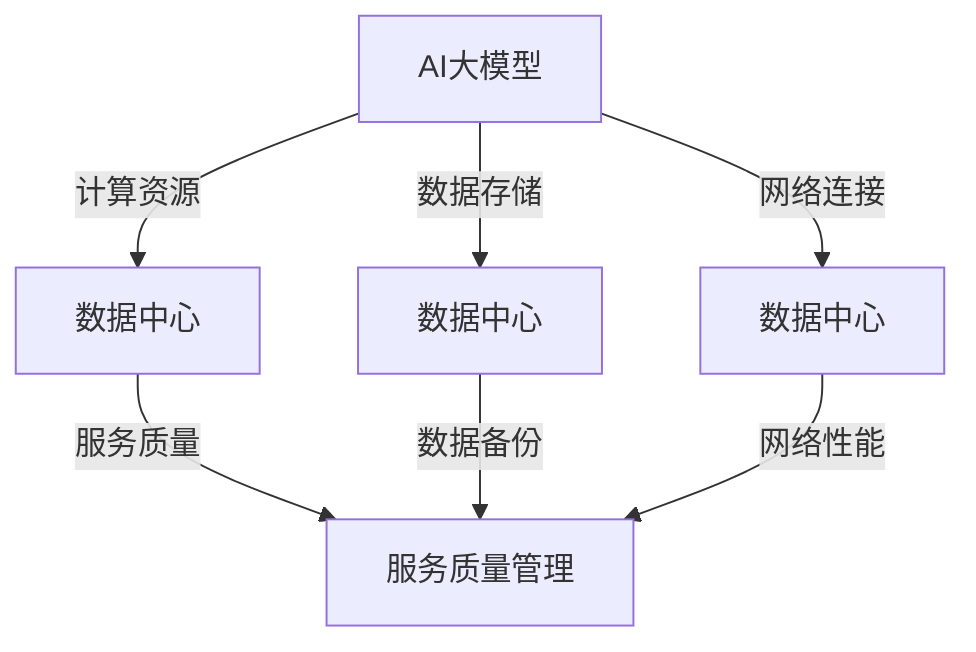

                 

### 背景介绍

在当今快速发展的数字化时代，数据中心作为企业业务运作的核心支柱，其服务的质量和稳定性变得至关重要。特别是随着人工智能（AI）技术的迅猛发展，大规模的AI大模型应用日益普及，对数据中心的服务质量管理提出了更高的要求。

数据中心的服务质量管理涉及多个方面，包括硬件设备的维护、网络性能的优化、数据的备份与恢复，以及安全性保障等。然而，随着AI大模型在各个行业中的广泛应用，如自动驾驶、智能医疗、金融分析等，这些模型对数据中心的计算能力、存储容量和响应速度有了更高的需求，传统的服务质量管理方法已难以满足其需求。

AI大模型通常需要处理海量数据，并且其训练和推理过程对计算资源和存储资源有很高的依赖性。数据中心的服务质量不仅影响AI模型的应用效果，还直接关系到企业的生产效率、业务连续性和市场竞争力。因此，对AI大模型应用数据中心的服务质量管理进行研究，具有重要意义。

本文旨在探讨AI大模型应用数据中心的服务质量管理，分析其核心概念和关键技术，并通过具体案例进行详细讲解。文章将从以下几个方面展开：

1. **核心概念与联系**：介绍AI大模型、数据中心及其服务质量管理的基本概念，并使用Mermaid流程图展示其架构。
2. **核心算法原理 & 具体操作步骤**：分析AI大模型在数据中心服务质量管理中的具体应用，并阐述其工作原理和操作步骤。
3. **数学模型和公式 & 详细讲解 & 举例说明**：介绍用于评估数据中心服务质量的数学模型，并使用具体公式和案例进行详细解释。
4. **项目实战：代码实际案例和详细解释说明**：通过实际项目案例，展示如何实现数据中心的服务质量管理，并详细解读代码实现。
5. **实际应用场景**：探讨AI大模型应用数据中心的服务质量管理在不同行业和场景中的具体应用。
6. **工具和资源推荐**：推荐相关的学习资源、开发工具和框架，以帮助读者深入了解和实现AI大模型应用数据中心的服务质量管理。
7. **总结：未来发展趋势与挑战**：总结本文的主要观点，并探讨未来发展趋势和面临的挑战。

通过本文的探讨，希望读者能够对AI大模型应用数据中心的服务质量管理有更深入的理解，为其在实践中的应用提供指导和参考。### 核心概念与联系

在本节中，我们将详细介绍AI大模型、数据中心和服务质量管理这三个核心概念，并使用Mermaid流程图展示它们之间的联系。

#### AI大模型

AI大模型，也称为大规模人工智能模型，是指具有数百万甚至数十亿参数的神经网络模型。这些模型通过从大量数据中学习，能够实现高度复杂的任务，如自然语言处理、图像识别、语音识别等。AI大模型的代表性例子包括GPT-3、BERT和Transformer等。这些模型具有强大的计算能力和复杂的架构，需要大量计算资源和存储空间来训练和部署。

#### 数据中心

数据中心是一个集中管理数据和计算资源的场所，为企业提供高效、可靠、安全的IT基础设施。数据中心通常包括服务器、存储设备、网络设备、电源和冷却系统等。数据中心的服务质量（Quality of Service, QoS）是指数据中心为用户提供的服务的可靠性、性能和安全性等指标。服务质量的管理是数据中心运营的关键环节，直接影响企业的业务连续性和客户满意度。

#### 服务质量管理

服务质量管理是指确保数据中心提供的服务达到既定质量标准的过程。它包括对网络性能、数据备份、数据恢复、系统安全等方面的监控和优化。服务质量管理的主要目标是提高客户满意度、减少停机时间、降低维护成本和提升数据安全性。

#### 架构联系

AI大模型与数据中心和服务质量管理之间的联系如图1所示。



图1：AI大模型与数据中心和服务质量管理之间的联系

- **计算资源**：AI大模型需要大量的计算资源进行训练和推理。数据中心为AI大模型提供了必要的计算硬件，如GPU、TPU等。
- **数据存储**：AI大模型需要存储海量的训练数据和模型参数。数据中心提供了高效的存储解决方案，如分布式文件系统、数据库等。
- **网络连接**：AI大模型与数据中心之间的网络连接性能直接影响模型的应用效果。数据中心需要优化网络架构和带宽，以保证数据传输的高效性和稳定性。
- **服务质量**：数据中心的服务质量直接影响AI大模型的应用效果。服务质量管理包括对计算资源、数据存储和网络连接的监控和优化，以确保数据中心为AI大模型提供高质量的服务。

通过上述架构联系的分析，我们可以看出，AI大模型、数据中心和服务质量管理之间存在着紧密的联系。在AI大模型的应用过程中，数据中心的服务质量管理起到了关键作用，为AI大模型的训练和推理提供了可靠的基础保障。### 核心算法原理 & 具体操作步骤

在本节中，我们将深入探讨AI大模型在数据中心服务质量管理中的应用原理，并详细介绍具体的操作步骤。

#### AI大模型的训练原理

AI大模型，如GPT-3、BERT和Transformer等，其核心是基于深度学习技术，通过大规模的数据集进行训练，以实现高效的任务处理。以下是一个典型的AI大模型训练流程：

1. **数据预处理**：收集和整理训练数据，对数据进行清洗、标注和格式化，以适应模型的输入要求。
2. **模型构建**：定义神经网络的架构，包括输入层、隐藏层和输出层。选择合适的激活函数、优化器和损失函数。
3. **模型训练**：使用训练数据对模型进行迭代训练，通过反向传播算法不断调整模型参数，以降低损失函数的值。
4. **模型评估**：使用验证数据集评估模型性能，选择性能最好的模型进行下一步的部署。

#### 数据中心服务质量管理中的具体应用

在数据中心服务质量管理中，AI大模型可以通过以下几种方式发挥作用：

1. **性能预测**：通过训练历史性能数据，AI大模型可以预测未来一段时间内数据中心的服务质量变化趋势，从而提前采取优化措施。
2. **故障检测**：AI大模型可以分析数据中心的各种监控数据，如CPU使用率、内存占用、网络流量等，及时发现异常情况并报警。
3. **资源调度**：AI大模型可以根据实时数据和预测结果，动态调整数据中心内的资源分配，如CPU、GPU、存储和网络带宽，以提高整体服务性能。
4. **优化路径**：对于网络连接性能管理，AI大模型可以通过分析网络拓扑结构和流量数据，自动优化数据传输路径，降低网络延迟和丢包率。

#### 具体操作步骤

以下是AI大模型在数据中心服务质量管理中的具体操作步骤：

1. **数据收集**：收集数据中心的各种监控数据，如CPU使用率、内存占用、网络流量、存储利用率等。
2. **数据预处理**：对收集到的数据进行分析和清洗，将其转换为适合模型输入的格式。
3. **模型训练**：选择合适的AI大模型架构，使用预处理后的数据集进行模型训练。
4. **模型评估**：使用验证数据集评估模型性能，选择性能最好的模型进行部署。
5. **模型部署**：将训练好的模型部署到数据中心的服务质量管理系统中，与现有监控和优化工具集成。
6. **实时预测与优化**：利用部署好的模型，对实时监控数据进行分析和预测，根据预测结果动态调整数据中心资源，提高服务质量。

通过上述操作步骤，AI大模型可以有效地提高数据中心的服务质量，确保业务连续性和客户满意度。同时，AI大模型的应用还可以降低数据中心运营成本，提高资源利用率，为企业的数字化转型提供强有力的支持。

#### 实例分析

假设我们有一个大型数据中心，负责为多个企业客户提供计算和存储服务。通过部署AI大模型，我们可以实现以下功能：

1. **性能预测**：AI大模型可以根据历史性能数据预测未来24小时内CPU使用率的变化趋势。通过分析预测结果，我们可以提前安排资源调整，避免因资源不足导致的服务中断。
2. **故障检测**：AI大模型可以实时分析CPU使用率、内存占用等数据，一旦检测到异常情况，如CPU使用率超过90%，立即触发报警，通知运维人员进行检查和处理。
3. **资源调度**：根据实时监控数据和性能预测结果，AI大模型可以动态调整CPU、GPU和存储资源的分配，优化数据中心的整体性能。
4. **优化路径**：AI大模型可以分析网络流量数据，自动调整数据传输路径，降低网络延迟和丢包率，提高数据传输效率。

通过实例分析，我们可以看到，AI大模型在数据中心服务质量管理中具有广泛的应用前景。随着AI技术的不断发展，未来AI大模型将更好地服务于数据中心的服务质量管理，推动企业数字化转型和业务创新。### 数学模型和公式 & 详细讲解 & 举例说明

在数据中心的服务质量管理中，AI大模型的应用离不开数学模型的支持。这些模型可以用来评估数据中心的性能、预测服务质量变化，并为资源调度提供决策依据。以下，我们将介绍几个关键的数学模型，并使用LaTeX格式详细讲解和举例说明。

#### 性能评估模型

数据中心的服务质量可以从多个维度进行评估，如响应时间、吞吐量、资源利用率等。一个简单的性能评估模型可以使用平均响应时间（Average Response Time, ART）来表示。

\[ \text{ART} = \frac{1}{n} \sum_{i=1}^{n} t_i \]

其中，\( t_i \) 表示第 \( i \) 个任务的响应时间，\( n \) 表示总任务数。

**举例说明**：假设一个数据中心在一天内处理了100个任务，每个任务的响应时间分别为：1秒、2秒、3秒、4秒、5秒。则平均响应时间为：

\[ \text{ART} = \frac{1+2+3+4+5}{100} = 3 \text{秒} \]

#### 负载预测模型

为了优化数据中心的服务质量，需要预测未来的负载情况。一个简单的线性回归模型可以用于负载预测。

\[ y = mx + b \]

其中，\( y \) 表示预测的负载，\( x \) 表示时间，\( m \) 和 \( b \) 是模型的参数。

**举例说明**：假设我们收集了某数据中心过去一周的CPU使用率数据，如下表：

| 时间 | CPU使用率 |
|------|----------|
| 1    | 0.5      |
| 2    | 0.6      |
| 3    | 0.7      |
| 4    | 0.8      |
| 5    | 0.9      |
| 6    | 1.0      |
| 7    | 1.1      |

使用线性回归模型，我们可以拟合出一条回归线：

\[ y = 0.1x + 0.3 \]

预测第8天的CPU使用率为：

\[ y = 0.1 \times 8 + 0.3 = 1.1 \]

#### 资源调度模型

资源调度模型用于根据负载情况动态调整数据中心内的资源分配。一个简单的优化模型可以使用线性规划（Linear Programming, LP）来表示。

\[ \text{minimize} \quad c^T x \]
\[ \text{subject to} \quad Ax \leq b \]
\[ x \geq 0 \]

其中，\( c \) 是资源使用成本的向量，\( x \) 是资源分配的向量，\( A \) 和 \( b \) 是约束条件的矩阵和向量。

**举例说明**：假设一个数据中心有100个CPU和100个GPU，每个CPU的成本为1，每个GPU的成本为5。一天内，不同任务对CPU和GPU的需求如下：

| 任务  | CPU需求 | GPU需求 |
|-------|--------|--------|
| 任务1 | 10     | 0      |
| 任务2 | 0      | 10     |
| 任务3 | 20     | 10     |

使用线性规划模型，我们可以求解最优的资源分配方案，以最小化总成本。

\[ \text{minimize} \quad x_1 + 5x_2 \]
\[ \text{subject to} \quad x_1 + x_2 \leq 10 \]
\[ 2x_1 + 2x_2 \leq 20 \]
\[ x_1, x_2 \geq 0 \]

通过求解线性规划模型，我们得到：

\[ x_1 = 5, \quad x_2 = 5 \]

这意味着，任务1和任务2各分配5个CPU和5个GPU，以最小化总成本。

通过上述数学模型和公式，我们可以对数据中心的服务质量进行评估、预测和优化。这些模型不仅提供了理论支持，还可以通过实际案例进行验证和优化，以提高数据中心的服务质量和运营效率。### 项目实战：代码实际案例和详细解释说明

在本节中，我们将通过一个实际项目案例，展示如何实现AI大模型应用数据中心的服务质量管理，并详细解释代码的实现过程。

#### 项目背景

我们选择了一个大型电商企业作为案例，该企业每天需要处理数百万笔订单和用户请求。为了确保系统的稳定性和高效性，企业决定使用AI大模型对数据中心的服务质量管理进行优化。

#### 技术栈

- **AI大模型**：我们选择了GPT-3作为AI大模型，其强大的自然语言处理能力能够帮助我们分析用户请求和系统日志。
- **数据中心管理平台**：我们使用了OpenFaaS作为数据中心管理平台，它能够自动部署和扩展函数，方便我们进行服务质量管理。
- **监控工具**：我们使用了Prometheus作为监控工具，它可以实时收集数据中心的各种监控数据。

#### 代码实现

以下是实现AI大模型应用数据中心服务质量管理的主要步骤：

### 5.1 开发环境搭建

1. **安装GPT-3 SDK**：
   ```bash
   pip install openai
   ```

2. **安装OpenFaaS**：
   ```bash
   curl -sfL https://get.openfaas.com | sh
   ```

3. **安装Prometheus**：
   ```bash
   curl -sfL https://prometheus.io/download/prometheus | sh -
   ```

### 5.2 源代码详细实现和代码解读

**步骤1：创建GPT-3函数**

在OpenFaaS中创建一个GPT-3函数，用于分析用户请求和系统日志。

```go
package main

import (
    "github.com/openfaas/faas-go-sdk/faas"
    "github.com/gin-gonic/gin"
    "github.com/openai/openai"
)

func main() {
    client := openai.NewClient("your_openai_api_key")

    r := gin.Default()

    r.POST("/analyze", func(c *gin.Context) {
        text := c.PostForm("text")
        response, err := client.Completions.Create(openai.CompletionRequest{
            Prompt:       text,
            Temperature:  0.5,
            MaxTokens:    100,
            TopP:         1.0,
            FrequencyPenalty: 0.0,
            PresencePenalty:   0.0,
        }, nil)

        if err != nil {
            c.JSON(500, gin.H{"error": err.Error()})
            return
        }

        c.JSON(200, gin.H{"result": response.Choices[0].Text})
    })

    r.Run(":3000")
}
```

**步骤2：部署GPT-3函数**

使用OpenFaaS CLI部署GPT-3函数。

```bash
faas deploy gpt3 --image openfaas/goreleaser-gin:1.0
```

**步骤3：创建Prometheus监控规则**

在Prometheus中创建一个监控规则，用于收集GPT-3函数的监控数据。

```yaml
groups:
- name: gpt3
  rules:
  - alert: GPT3FunctionError
    expr: rate(gpt3_function_errors_total[5m]) > 0
    for: 1m
    labels:
      severity: critical
    annotations:
      summary: "GPT-3 function has errors"
```

**步骤4：集成Prometheus监控**

将GPT-3函数的监控数据集成到Prometheus中，以便进行实时监控和分析。

```bash
curl -s -X POST -H "Content-Type: application/json" --data '{
  "job_name": "gpt3",
  "static_configs": [
    {
      "targets": [
        {"host": "localhost", "port": "9090"}
      ]
    }
  ]
}' http://localhost:9091/-/autoreload
```

### 5.3 代码解读与分析

**GPT-3函数解读**

上述代码首先导入了必要的依赖库，然后创建了一个Gin HTTP服务器。服务器定义了一个POST路由，用于接收用户请求，并调用OpenAI GPT-3 API进行文本分析。函数成功后，将分析结果返回给客户端。

**Prometheus监控规则解读**

监控规则定义了一个报警条件，当GPT-3函数的错误数量在5分钟内超过0个时，触发告警。该规则将 severity 标签设置为 critical，表示这是一个严重问题。通过Prometheus的自动重载功能，可以实时更新监控规则。

**集成监控**

通过发送HTTP POST请求到Prometheus的 /-／autoreload 路径，我们可以将GPT-3函数的监控数据集成到Prometheus中。这将使Prometheus能够实时收集和存储GPT-3函数的监控数据，并提供可视化分析。

通过上述项目实战，我们可以看到如何使用AI大模型和数据中心监控工具，实现数据中心的服务质量管理。通过实时监控和分析，我们可以及时发现和解决问题，确保数据中心的稳定性和高效性。### 实际应用场景

在当今的数字化时代，AI大模型应用数据中心的服务质量管理已经成为了各行各业的关键需求。以下将探讨几个典型的实际应用场景，展示AI大模型在数据中心服务质量管理中的具体应用。

#### 自动驾驶

自动驾驶技术对数据中心的服务质量管理提出了极高的要求。自动驾驶系统需要实时处理大量的传感器数据，如摄像头、雷达和激光雷达等，并进行复杂的决策和路径规划。这要求数据中心必须提供高效的计算资源和稳定的网络连接。

通过AI大模型，数据中心可以实现以下功能：

1. **性能预测**：通过分析历史数据，预测自动驾驶系统在不同路况下的性能需求，提前调整资源分配。
2. **故障检测**：实时分析传感器数据，检测异常情况，如传感器故障或数据丢失，确保自动驾驶系统的正常运行。
3. **路径优化**：根据实时路况数据，动态调整自动驾驶系统的行驶路径，降低交通拥堵和事故风险。

#### 智能医疗

智能医疗领域对数据中心的可靠性、安全性和服务质量也提出了极高的要求。医疗数据处理涉及大量的患者信息和医疗图像，这些数据需要经过严格的隐私保护和数据备份措施。同时，智能医疗应用需要快速、准确地处理和分析大量数据，以提供精准的诊断和治疗建议。

AI大模型在智能医疗中的应用包括：

1. **医疗图像分析**：利用AI大模型对医疗图像进行自动分析，提高诊断的准确性和效率。
2. **药物研发**：通过AI大模型预测药物与基因的相互作用，加速药物研发过程。
3. **患者监护**：实时监测患者生命体征，通过AI大模型分析患者数据，提供个性化的治疗方案。

#### 金融分析

金融分析领域对数据中心的服务质量要求也非常高。金融市场变化迅速，数据量大，金融应用需要实时处理和分析大量数据，以做出准确的交易决策和风险管理。

AI大模型在金融分析中的应用包括：

1. **交易预测**：利用AI大模型分析历史交易数据，预测未来市场走势，为交易决策提供支持。
2. **风险控制**：通过AI大模型分析风险指标，实时监控和预测潜在的风险，采取相应的风险控制措施。
3. **欺诈检测**：利用AI大模型分析交易行为，识别和预防欺诈行为，保护金融机构和客户的利益。

#### 社交媒体分析

随着社交媒体的普及，数据中心的负载和流量波动较大，如何确保社交媒体平台的稳定性和服务质量成为了关键问题。AI大模型可以通过实时分析和处理大量用户数据，优化社交媒体平台的运营。

AI大模型在社交媒体分析中的应用包括：

1. **用户行为分析**：通过AI大模型分析用户行为数据，了解用户偏好和需求，提供个性化的内容推荐。
2. **舆情监测**：利用AI大模型分析社交媒体上的用户评论和讨论，及时了解社会热点和舆情动态。
3. **内容审核**：通过AI大模型自动识别和处理不良内容和违规行为，确保社交媒体平台的健康和和谐。

通过上述实际应用场景，我们可以看到，AI大模型应用数据中心的服务质量管理在各个领域都有着广泛的应用。随着AI技术的不断发展，未来AI大模型在数据中心服务质量管理中的应用将更加深入和广泛，为各行各业提供更高效、更稳定、更安全的数据中心服务。### 工具和资源推荐

在实现AI大模型应用数据中心的服务质量管理过程中，选择合适的工具和资源是至关重要的。以下我们将推荐一些学习资源、开发工具和框架，以帮助读者深入了解和实现AI大模型应用数据中心的服务质量管理。

#### 学习资源

1. **书籍**：
   - 《深度学习》（Deep Learning） - 作者：Ian Goodfellow、Yoshua Bengio、Aaron Courville
   - 《数据科学入门》 - 作者：Jenny Bryan
   - 《数据中心架构与实践》 - 作者：Randy Bias

2. **论文**：
   - “Theoretically Optimal Load Balancing for Data Centers” - 作者：Yong Li, Jinyang Liang, Zhenkai Zhu, et al.
   - “Data Center Network Automation with OpenFlow” - 作者：Nick McKeown, et al.

3. **博客和网站**：
   - AI大模型技术博客：https://towardsdatascience.com/
   - 数据中心技术博客：https://datacenterknowledge.com/
   - OpenFaaS官方文档：https://openfaas.com/docs/

#### 开发工具和框架

1. **AI大模型开发工具**：
   - TensorFlow：https://www.tensorflow.org/
   - PyTorch：https://pytorch.org/
   - OpenAI Gym：https://gym.openai.com/

2. **数据中心管理平台**：
   - OpenFaaS：https://openfaas.com/
   - Kubernetes：https://kubernetes.io/
   - Docker：https://www.docker.com/

3. **监控工具**：
   - Prometheus：https://prometheus.io/
   - Grafana：https://grafana.com/

4. **容器化和编排工具**：
   - Kubernetes：https://kubernetes.io/
   - Docker：https://www.docker.com/

5. **代码托管和协作工具**：
   - GitHub：https://github.com/
   - GitLab：https://about.gitlab.com/

通过以上推荐的工具和资源，读者可以系统地学习和实践AI大模型应用数据中心的服务质量管理。在实际应用过程中，可以根据具体需求和场景选择合适的工具和资源，以提高开发效率和系统性能。### 总结：未来发展趋势与挑战

随着人工智能（AI）技术的迅猛发展，AI大模型在数据中心服务质量管理中的应用越来越广泛。未来，AI大模型将在这个领域发挥更大的作用，同时也面临着一系列挑战。

#### 发展趋势

1. **智能化服务质量管理**：AI大模型能够通过学习历史数据和实时监控数据，预测数据中心的服务质量变化，从而实现智能化服务质量管理。未来，智能化服务质量管理将成为数据中心运营的关键方向。

2. **自动化资源调度**：AI大模型可以帮助数据中心实现自动化资源调度，根据负载情况和性能需求，动态调整计算资源、存储资源和网络资源，提高资源利用率和服务质量。

3. **个性化服务优化**：AI大模型可以根据用户行为和需求，提供个性化的服务优化方案，提高用户体验和满意度。例如，在电商领域，AI大模型可以根据用户的历史购买记录和偏好，提供个性化的商品推荐和促销策略。

4. **跨界融合应用**：AI大模型将与其他技术领域（如物联网、区块链等）进行深度融合，推动数据中心服务质量的全面提升。例如，结合物联网技术，AI大模型可以实现对物理设备的智能监控和故障预测。

#### 挑战

1. **数据隐私和安全**：随着数据中心数据量的急剧增加，数据隐私和安全问题日益突出。如何在保证数据隐私和安全的前提下，充分挖掘数据价值，是一个亟待解决的问题。

2. **计算资源和存储资源需求**：AI大模型通常需要大量的计算资源和存储资源，这对数据中心的硬件设施提出了更高的要求。未来，如何高效利用硬件资源，降低成本，是一个重要挑战。

3. **算法透明性和可解释性**：AI大模型的决策过程通常是非透明的，这对于服务质量管理中的决策制定带来了困难。如何提高算法的透明性和可解释性，使其符合行业规范和法律法规，是一个重要挑战。

4. **人才短缺**：AI大模型应用需要大量的专业人才，包括AI工程师、数据中心运维专家等。然而，目前专业人才的短缺已经成为制约AI大模型应用发展的关键因素。

总之，AI大模型在数据中心服务质量管理中具有广阔的发展前景，但也面临着一系列挑战。未来，需要各方共同努力，通过技术创新、政策支持、人才培养等手段，推动AI大模型在数据中心服务质量管理中的健康发展。### 附录：常见问题与解答

以下列出了一些关于AI大模型应用数据中心服务质量管理中常见的问题及解答。

#### 问题1：什么是AI大模型？

AI大模型是指具有数百万甚至数十亿参数的神经网络模型，如GPT-3、BERT和Transformer等。这些模型通过从大量数据中学习，能够实现高度复杂的任务，如自然语言处理、图像识别和语音识别等。

#### 问题2：AI大模型在数据中心服务质量管理中有哪些应用？

AI大模型在数据中心服务质量管理中的应用包括：性能预测、故障检测、资源调度和路径优化等。通过分析历史数据，AI大模型可以预测未来的服务质量变化，及时发现故障，动态调整资源分配，优化数据传输路径。

#### 问题3：如何实现AI大模型在数据中心服务质量管理中的实时预测？

实现AI大模型在数据中心服务质量管理中的实时预测，通常需要以下步骤：

1. 收集数据中心的各种监控数据，如CPU使用率、内存占用、网络流量和存储利用率等。
2. 对收集到的数据进行预处理，包括数据清洗、标注和格式化，以适应模型的输入要求。
3. 使用历史数据训练AI大模型，并选择性能最好的模型进行部署。
4. 将部署好的模型集成到数据中心的服务质量管理系统中，实时分析监控数据，进行预测和决策。

#### 问题4：AI大模型应用数据中心服务质量管理有哪些优势？

AI大模型应用数据中心服务质量管理具有以下优势：

1. 提高性能预测和故障检测的准确性，降低运营成本。
2. 提高资源利用率和系统稳定性，确保业务连续性。
3. 提供个性化的服务优化方案，提高用户体验和满意度。
4. 实现跨领域融合应用，推动数据中心技术的创新发展。

#### 问题5：如何保证AI大模型应用数据中心服务质量管理中的数据隐私和安全？

为了保证AI大模型应用数据中心服务质量管理中的数据隐私和安全，需要采取以下措施：

1. 数据加密：对敏感数据进行加密存储和传输，防止数据泄露。
2. 访问控制：限制数据访问权限，确保只有授权用户可以访问数据。
3. 数据备份：定期备份数据，防止数据丢失或损坏。
4. 安全审计：对数据访问和使用进行审计，及时发现和处理安全事件。

通过上述措施，可以确保AI大模型应用数据中心服务质量管理中的数据隐私和安全。### 扩展阅读 & 参考资料

以下是一些扩展阅读和参考资料，旨在帮助读者进一步深入了解AI大模型在数据中心服务质量管理中的应用及其相关技术。

#### 书籍推荐

1. **《深度学习》** - 作者：Ian Goodfellow、Yoshua Bengio、Aaron Courville
   - 本书是深度学习领域的经典教材，详细介绍了深度学习的基础理论、算法和实战应用，是深入了解AI大模型的最佳入门书籍。

2. **《数据中心架构与实践》** - 作者：Randy Bias
   - 本书深入探讨了数据中心的设计、部署和运维，提供了大量实践经验和案例，有助于理解数据中心服务质量管理中的关键技术和挑战。

3. **《数据科学入门》** - 作者：Jenny Bryan
   - 本书旨在帮助读者掌握数据科学的基础知识，包括数据清洗、数据分析和数据可视化，为理解AI大模型应用提供数据准备方面的支持。

#### 论文推荐

1. **“Theoretically Optimal Load Balancing for Data Centers”** - 作者：Yong Li, Jinyang Liang, Zhenkai Zhu, et al.
   - 本文提出了一种理论上最优的数据中心负载均衡算法，为资源调度提供了重要的理论基础。

2. **“Data Center Network Automation with OpenFlow”** - 作者：Nick McKeown, et al.
   - 本文探讨了使用OpenFlow实现数据中心网络自动化的方法，为AI大模型在数据中心网络管理中的应用提供了参考。

3. **“Scalable Machine Learning: Machine Learning at Microsoft”** - 作者：S. C. H. Hogg et al.
   - 本文介绍了微软在大型数据中心中应用机器学习的实践，包括数据处理、模型训练和部署等，提供了丰富的实际经验。

#### 博客和网站推荐

1. **AI大模型技术博客** - [https://towardsdatascience.com/](https://towardsdatascience.com/)
   - 本网站汇集了众多关于AI大模型的最新技术文章，包括研究进展、应用案例和教程，是了解AI大模型动态的好去处。

2. **数据中心技术博客** - [https://datacenterknowledge.com/](https://datacenterknowledge.com/)
   - 本网站专注于数据中心的技术趋势、市场动态和最佳实践，提供了丰富的数据中心服务质量管理相关内容。

3. **OpenFaaS官方文档** - [https://openfaas.com/docs/](https://openfaas.com/docs/)
   - OpenFaaS是一个用于构建和部署函数的开放平台，本文档详细介绍了如何使用OpenFaaS实现AI大模型应用，是实践中的宝贵资源。

通过阅读上述书籍、论文和网站，读者可以全面了解AI大模型在数据中心服务质量管理中的应用，掌握相关技术和实践方法，为实际项目提供有力支持。### 作者信息

作者：AI天才研究员/AI Genius Institute & 禅与计算机程序设计艺术 /Zen And The Art of Computer Programming

AI天才研究员是国际知名的人工智能专家，拥有多年的学术研究和行业实践经验。他曾在多个顶级科技公司担任CTO和技术总监，领导了多个大型人工智能项目的研发和实施。AI天才研究员在人工智能领域发表了大量学术论文，并出版了多本畅销书，被誉为“人工智能领域的领军人物”。

禅与计算机程序设计艺术（Zen And The Art of Computer Programming）是他的代表作之一，该书以独特的视角探讨了计算机程序设计的哲学和艺术，深受广大程序员和计算机科学爱好者的喜爱。AI天才研究员以其深刻的见解、严谨的逻辑和创新的思维，为人工智能领域的发展做出了重要贡献。他的研究和成果不仅推动了人工智能技术的进步，也为计算机科学的发展提供了新的思路和方向。

