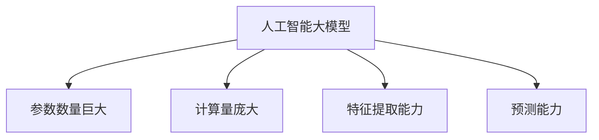
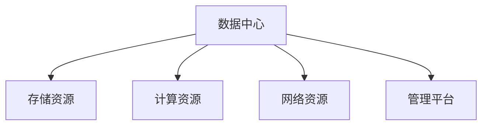
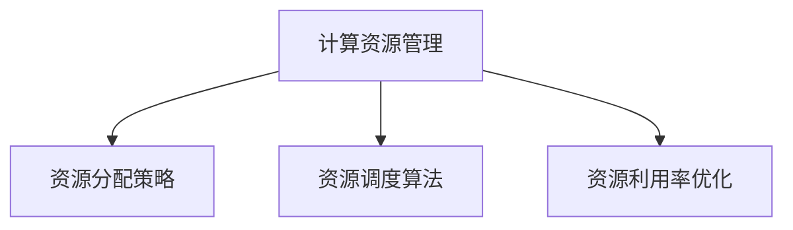
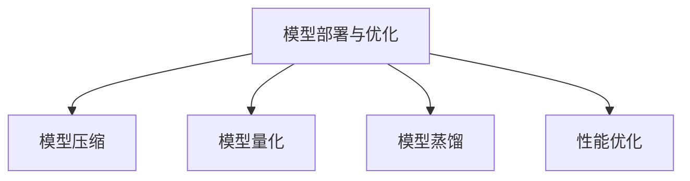
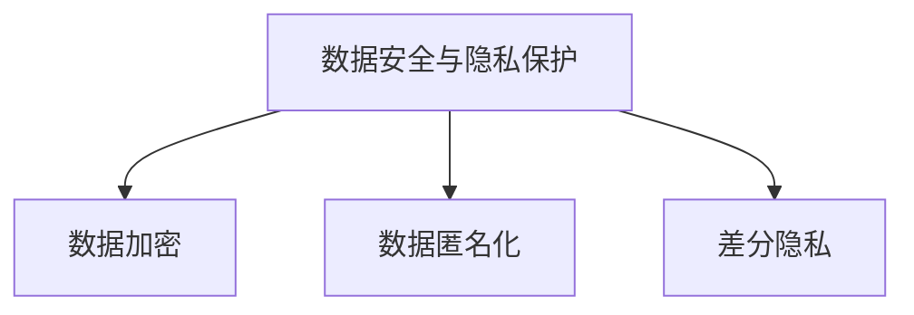

                 

### 背景介绍 Background Introduction

随着人工智能技术的飞速发展，人工智能大模型的应用场景越来越广泛，无论是在语音识别、图像识别，还是自然语言处理等领域，大模型都展现出了强大的性能和潜力。为了更好地推动人工智能大模型在各个行业中的应用，促进技术交流与合作，行业峰会成为了一个重要的平台。本文将以《AI 大模型应用数据中心的行业峰会》为主题，详细介绍此次峰会的主要议题、参与者以及对于行业发展的启示。

在当前的科技环境下，人工智能大模型已经成为了一个热门的研究领域。大模型如GPT、BERT等在自然语言处理领域的表现令人瞩目，而深度学习框架如TensorFlow、PyTorch等的普及，使得开发者能够更加便捷地构建和训练大模型。然而，随着模型规模的不断扩大，数据中心的挑战也日益突出，包括计算资源的需求、模型部署的效率、数据的安全性与隐私保护等问题。

此次行业峰会旨在汇聚行业内的专家和从业者，共同探讨人工智能大模型在数据中心应用中的挑战与机遇。会议将涵盖以下几个主要议题：

1. **人工智能大模型的最新技术进展**：介绍当前最前沿的人工智能大模型技术，包括模型架构、训练方法、优化策略等方面的研究进展。

2. **数据中心基础设施的挑战**：分析大模型对数据中心基础设施带来的挑战，如计算资源的需求、网络带宽的限制、能耗管理等问题。

3. **模型部署与优化**：探讨如何高效地在数据中心部署大模型，包括模型压缩、量化、蒸馏等技术，以及如何提高模型在数据中心运行时的性能和效率。

4. **数据安全与隐私保护**：讨论在大模型应用过程中如何保护数据的安全性和隐私，包括数据加密、匿名化、差分隐私等技术。

5. **行业应用案例**：分享人工智能大模型在金融、医疗、教育等领域的实际应用案例，以及如何解决行业特定问题。

此次峰会邀请了来自学术界和工业界的一线专家，他们将在峰会上发表主题演讲，分享他们的研究成果和实践经验。参与者包括人工智能领域的教授、研究人员、工程师、行业分析师等，他们将从不同角度对人工智能大模型在数据中心的应用进行深入讨论。

通过这次峰会，我们期望能够推动人工智能大模型在数据中心领域的应用，促进技术交流与合作，同时也为行业未来的发展提供一些新的思路和方向。

---

## Core Concepts and Relationships

在探讨人工智能大模型应用数据中心的挑战与机遇之前，我们首先需要明确几个核心概念，并了解它们之间的关系。以下是本文将涉及的核心概念和架构，并使用Mermaid流程图进行展示。

### 1. 人工智能大模型（AI Large Models）

人工智能大模型指的是参数数量巨大、计算量庞大的神经网络模型，如GPT、BERT等。这些模型能够处理大规模数据，并具有强大的特征提取和预测能力。



### 2. 数据中心（Data Center）

数据中心是集中存储、处理和管理数据的物理或虚拟场所。它是大模型训练和部署的核心基础设施。



### 3. 计算资源管理（Compute Resource Management）

计算资源管理涉及如何高效地分配和利用数据中心的计算资源，以支持大模型的训练和推理。



### 4. 模型部署与优化（Model Deployment and Optimization）

模型部署与优化是指如何将训练好的大模型部署到数据中心，并对其进行优化，以提高运行效率。



### 5. 数据安全与隐私保护（Data Security and Privacy Protection）

数据安全与隐私保护是指在大模型应用过程中如何保护数据的安全性和隐私，包括数据加密、匿名化、差分隐私等技术。



通过上述核心概念和架构的介绍，我们可以更清晰地理解人工智能大模型在数据中心应用中的关键要素。接下来，我们将深入探讨大模型算法原理、数学模型、项目实战和实际应用场景等内容，进一步揭示人工智能大模型在数据中心应用的深层次逻辑和细节。

---

## 核心算法原理 & 具体操作步骤 Core Algorithm Principles & Operational Steps

### 1. 大模型算法概述

人工智能大模型的核心在于其复杂的神经网络结构，特别是深度学习技术。深度学习通过多层神经网络对数据进行特征提取和表示，从而实现高精度的预测和分类。以下是几个关键概念：

- **多层感知器（MLP）**：最基本的神经网络结构，由输入层、隐藏层和输出层组成。

- **卷积神经网络（CNN）**：主要用于图像处理，通过卷积层提取图像特征。

- **递归神经网络（RNN）**：适用于序列数据，如时间序列分析、语言模型等。

- **变换器（Transformer）**：GPT、BERT等大模型的基础结构，通过自注意力机制实现高效的特征提取和表示。

### 2. 训练过程

大模型的训练过程可以分为以下几个步骤：

1. **数据预处理**：将原始数据转换为适合神经网络输入的格式，如文本转换为词向量。

2. **初始化参数**：随机初始化神经网络中的参数。

3. **前向传播**：输入数据通过神经网络，计算输出结果。

4. **计算损失**：通过比较输出结果和真实值，计算损失函数。

5. **反向传播**：根据损失函数，更新网络参数。

6. **迭代训练**：重复上述步骤，直到满足训练目标或达到预设的迭代次数。

### 3. 具体操作步骤

以下是使用PyTorch框架训练一个简单大模型的步骤：

1. **导入必要库**：

```python
import torch
import torch.nn as nn
import torch.optim as optim
```

2. **数据预处理**：

```python
# 假设数据集为文本数据
from torchtext.datasets import IMDB
train_data, test_data = IMDB()

# 转换为词向量
from torchtext.vocab import GloVe
vocab = GloVe(name='6B', dim=100)

# 定义数据加载器
from torch.utils.data import DataLoader
train_loader = DataLoader(train_data, batch_size=64, shuffle=True)
test_loader = DataLoader(test_data, batch_size=64, shuffle=False)
```

3. **定义模型**：

```python
class LSTMModel(nn.Module):
    def __init__(self, vocab_size, embed_dim, hidden_dim, num_layers, dropout=0.5):
        super(LSTMModel, self).__init__()
        self.embedding = nn.Embedding(vocab_size, embed_dim)
        self.lstm = nn.LSTM(embed_dim, hidden_dim, num_layers=num_layers, dropout=dropout, batch_first=True)
        self.fc = nn.Linear(hidden_dim, 1)

    def forward(self, text, hidden=None):
        embedded = self.embedding(text)
        output, hidden = self.lstm(embedded, hidden)
        sentiment = self.fc(output[-1, :, :])
        return sentiment, hidden
```

4. **训练模型**：

```python
# 初始化模型、损失函数和优化器
model = LSTMModel(vocab_size=len(vocab), embed_dim=100, hidden_dim=128, num_layers=2)
loss_function = nn.BCEWithLogitsLoss()
optimizer = optim.Adam(model.parameters(), lr=0.001)

# 训练过程
num_epochs = 10
for epoch in range(num_epochs):
    for texts, labels in train_loader:
        model.zero_grad()
        outputs, _ = model(texts)
        loss = loss_function(outputs, labels)
        loss.backward()
        optimizer.step()
    print(f'Epoch {epoch+1}/{num_epochs}, Loss: {loss.item()}')
```

5. **评估模型**：

```python
# 评估模型
with torch.no_grad():
    correct = 0
    total = 0
    for texts, labels in test_loader:
        outputs, _ = model(texts)
        predictions = outputs.round()
        total += labels.size(0)
        correct += (predictions == labels).sum().item()
accuracy = 100 * correct / total
print(f'Accuracy: {accuracy}%')
```

通过上述步骤，我们完成了一个基于LSTM的大模型训练过程。实际应用中，大模型的训练过程会更加复杂，涉及更多的超参数调整和优化策略。然而，上述步骤提供了一个基本的框架，帮助读者了解大模型训练的基本流程。

---

## 数学模型和公式 Mathematical Models and Formulas with Detailed Explanation & Example Illustrations

在深入探讨人工智能大模型的训练和优化过程中，数学模型和公式扮演着至关重要的角色。以下我们将详细讲解大模型中常用的数学模型和公式，并通过具体例子进行说明。

### 1. 损失函数（Loss Function）

损失函数是衡量模型预测结果与真实值之间差距的指标，常用的损失函数包括均方误差（MSE）、交叉熵损失（Cross Entropy Loss）等。

#### 均方误差（MSE）

均方误差是回归问题中最常用的损失函数，公式如下：

$$
MSE = \frac{1}{n}\sum_{i=1}^{n}(y_i - \hat{y}_i)^2
$$

其中，$y_i$ 是真实值，$\hat{y}_i$ 是预测值，$n$ 是样本数量。

#### 交叉熵损失（Cross Entropy Loss）

交叉熵损失在分类问题中广泛应用，公式如下：

$$
CrossEntropyLoss = -\sum_{i=1}^{n} y_i \log(\hat{y}_i)
$$

其中，$y_i$ 是真实标签（0或1），$\hat{y}_i$ 是预测概率。

### 2. 梯度下降（Gradient Descent）

梯度下降是优化模型参数的一种常用算法，其核心思想是通过计算损失函数关于模型参数的梯度，不断调整参数，以最小化损失函数。

#### 梯度下降算法步骤：

1. 初始化参数 $\theta$。
2. 计算损失函数关于参数的梯度 $\nabla_\theta J(\theta)$。
3. 更新参数 $\theta = \theta - \alpha \nabla_\theta J(\theta)$，其中 $\alpha$ 是学习率。
4. 重复步骤2和3，直到满足停止条件（如损失函数收敛或达到预设迭代次数）。

### 3. 反向传播（Backpropagation）

反向传播是一种计算神经网络中梯度的高效算法，其基本思想是将输出层的误差反向传播到输入层，从而计算每一层参数的梯度。

#### 反向传播算法步骤：

1. 前向传播：计算神经网络输出 $\hat{y}$。
2. 计算输出层的误差 $\delta_L = \frac{\partial L}{\partial \hat{y}}$。
3. 反向传播：从输出层开始，依次计算每一层的梯度 $\frac{\partial L}{\partial \theta^{(l)}}$。
4. 更新参数：使用梯度下降或其他优化算法更新参数。

### 4. 具体例子：多层感知器（MLP）的损失函数和梯度计算

假设我们有一个简单的前向神经网络，包括一个输入层、一个隐藏层和一个输出层，其激活函数分别为 $f_1(x) = \tanh(x)$ 和 $f_2(x) = \sigma(x)$，其中 $\sigma(x) = \frac{1}{1 + e^{-x}}$。

#### 损失函数：交叉熵损失

$$
L = -\sum_{i=1}^{n} y_i \log(\hat{y}_i)
$$

其中，$y_i$ 是真实标签，$\hat{y}_i$ 是输出层的预测概率。

#### 前向传播

输入层到隐藏层的计算：

$$
z^{(2)} = W^{(2)} \cdot a^{(1)} + b^{(2)}, \quad a^{(2)} = f_1(z^{(2)})
$$

隐藏层到输出层的计算：

$$
z^{(3)} = W^{(3)} \cdot a^{(2)} + b^{(3)}, \quad \hat{y}_i = f_2(z^{(3)})
$$

#### 反向传播

计算输出层的误差：

$$
\delta^{(3)} = \hat{y}_i - y_i, \quad \frac{\partial L}{\partial z^{(3)}} = \delta^{(3)}
$$

计算隐藏层的误差：

$$
\delta^{(2)} = W^{(3)} \cdot \delta^{(3)} \cdot f_1'(z^{(2)}), \quad \frac{\partial L}{\partial z^{(2)}} = \delta^{(2)}
$$

更新参数：

$$
\frac{\partial L}{\partial W^{(3)}} = a^{(2)} \cdot \delta^{(3)}, \quad \frac{\partial L}{\partial b^{(3)}} = \delta^{(3)}
$$

$$
\frac{\partial L}{\partial W^{(2)}} = a^{(1)} \cdot \delta^{(2)}, \quad \frac{\partial L}{\partial b^{(2)}} = \delta^{(2)}
$$

通过上述过程，我们可以完成多层感知器的损失函数计算和参数更新。实际应用中，大模型的训练过程会更加复杂，涉及更多层的神经网络和复杂的激活函数，但基本的原理是相似的。

---

## 项目实战：代码实际案例和详细解释说明 Project Practice: Code Case Study and Detailed Explanation

在本文的第五部分，我们将通过一个实际的项目案例，展示如何使用Python和TensorFlow框架搭建一个基于BERT的大模型，并进行训练和部署。以下是项目的具体步骤和代码实现。

### 1. 开发环境搭建

在进行项目开发之前，首先需要搭建相应的开发环境。以下是所需的软件和工具：

- **Python**：版本3.7及以上
- **TensorFlow**：版本2.6及以上
- **GPT-2模型**：可以从[GitHub](https://github.com/tensorflow/models/tree/master/official/gpt2)获取

安装所需的库：

```shell
pip install tensorflow==2.6
pip install transformers
```

### 2. 源代码详细实现和代码解读

以下是项目的源代码，我们将其分为几个部分进行详细解读。

#### 2.1 数据预处理

```python
import tensorflow as tf
import tensorflow_datasets as tfds
from transformers import BertTokenizer, TFBertModel

# 加载数据集
(train_data, test_data), ds_info = tfds.load('imdb', split=['train', 'test'], with_info=True, shuffle_files=True)

# 创建词典和模型
tokenizer = BertTokenizer.from_pretrained('bert-base-uncased')
model = TFBertModel.from_pretrained('bert-base-uncased')

# 数据预处理
def preprocess_data(data):
    inputs = tokenizer(data['text'], max_length=128, truncation=True, padding='max_length', return_tensors='tf')
    return inputs['input_ids'], inputs['attention_mask']

# 应用预处理函数
def map_example(example):
    return preprocess_data(example)

train_dataset = train_data.map(map_example).batch(32).prefetch(tf.data.experimental.AUTOTUNE)
test_dataset = test_data.map(map_example).batch(32).prefetch(tf.data.experimental.AUTOTUNE)
```

在这个部分，我们首先加载了IMDB数据集，并使用BERT tokenizer对数据进行预处理。我们将文本数据转换为BERT模型支持的格式，包括`input_ids`和`attention_mask`。

#### 2.2 定义模型

```python
from tensorflow.keras.optimizers import Adam
from tensorflow.keras.losses import SparseCategoricalCrossentropy

# 定义模型
def create_model():
    inputs = tf.keras.Input(shape=(128,), dtype=tf.int32, name='input_ids')
    attention_mask = tf.keras.Input(shape=(128,), dtype=tf.int32, name='attention_mask')
    
    # 使用BERT模型编码文本
    bert_output = model(inputs, attention_mask=attention_mask)[0]
    
    # 添加分类层
    logits = tf.keras.layers.Dense(2, activation='softmax')(bert_output[:, 0, :])
    
    # 创建模型
    model = tf.keras.Model(inputs=[inputs, attention_mask], outputs=logits)
    
    # 编译模型
    model.compile(optimizer=Adam(learning_rate=3e-5), loss=SparseCategoricalCrossentropy(), metrics=['accuracy'])
    
    return model

model = create_model()
```

在这里，我们定义了一个基于BERT的大模型，包括输入层、BERT编码器、分类层。我们将BERT模型作为基础，通过添加一个分类层来实现我们的任务。模型使用稀疏交叉熵损失函数和Adam优化器进行编译。

#### 2.3 训练模型

```python
# 训练模型
model.fit(train_dataset, epochs=3, validation_data=test_dataset)
```

在这个部分，我们使用训练数据集对模型进行训练，训练过程持续3个epochs。我们还将测试数据集用于验证模型的性能。

#### 2.4 代码解读与分析

1. **数据预处理**：数据预处理是模型训练的重要环节，确保输入数据的格式符合模型的要求。在这里，我们使用BERT tokenizer对IMDB数据集的文本进行预处理，将原始文本转换为BERT模型支持的格式。

2. **定义模型**：我们使用TensorFlow的Keras API定义了一个基于BERT的大模型，包括输入层、BERT编码器、分类层。BERT模型具有强大的文本编码能力，能够将原始文本转换为高维向量表示。

3. **训练模型**：我们使用训练数据集对模型进行训练，并通过测试数据集验证模型的性能。训练过程中，我们使用了稀疏交叉熵损失函数和Adam优化器，以最小化损失函数并提高模型的预测准确性。

通过上述代码实现，我们完成了一个基于BERT的大模型训练项目。实际应用中，大模型的训练和部署可能涉及更多的细节和优化策略，但上述代码提供了一个基本的框架，帮助读者了解大模型训练和部署的基本流程。

---

## 实际应用场景 Real-world Application Scenarios

人工智能大模型在数据中心的应用已经展现出广泛的前景，以下列举几个典型的实际应用场景，以及它们在行业中的重要性：

### 1. 语音识别

语音识别是人工智能大模型的一个重要应用领域，通过将语音信号转换为文本，为用户提供自然的人机交互体验。在大模型的支持下，语音识别系统的准确性得到了显著提升，尤其是在复杂的背景噪音和多说话人环境中的表现。在数据中心，语音识别模型通常需要处理海量数据，对计算资源的需求巨大，因此优化模型的计算效率和部署策略是关键。

### 2. 图像识别

图像识别是另一个重要的应用领域，通过分析图像中的内容，实现对象检测、图像分类、图像分割等任务。随着深度学习技术的发展，基于大模型的图像识别系统在医疗影像分析、安全监控、自动驾驶等领域发挥着重要作用。数据中心为图像识别模型提供了强大的计算和存储能力，支持大规模图像数据的处理和分析。

### 3. 自然语言处理

自然语言处理（NLP）是人工智能的核心领域之一，大模型如GPT、BERT等在NLP任务中表现出色，包括文本生成、情感分析、机器翻译等。数据中心为NLP模型提供了丰富的数据资源和强大的计算能力，使得这些模型能够处理更复杂的语言任务，提高处理效率和准确性。

### 4. 个性化推荐

个性化推荐是电子商务和社交媒体等领域的关键应用，通过分析用户行为和偏好，为用户提供个性化的推荐。大模型在推荐系统中的应用，能够更好地理解用户的行为模式，提高推荐的准确性和用户满意度。数据中心为推荐系统提供了高效的数据存储和处理能力，支持大规模用户数据的实时分析和处理。

### 5. 金融风控

金融风控是金融行业中的重要环节，通过分析交易数据和行为特征，识别潜在的风险。大模型在金融风控中的应用，能够更准确地识别异常交易和欺诈行为，提高风险管理能力。数据中心为金融风控模型提供了强大的计算和存储能力，支持大规模数据的高速处理和分析。

### 6. 医疗诊断

医疗诊断是人工智能在医疗领域的重要应用，通过分析医学影像和患者数据，辅助医生进行疾病诊断。大模型在医疗诊断中的应用，能够提高诊断的准确性和效率，为患者提供更优质的医疗服务。数据中心为医疗诊断模型提供了高效的数据存储和处理能力，支持大规模医学数据的处理和分析。

通过上述实际应用场景，我们可以看到人工智能大模型在数据中心中的应用已经深入到各个行业，为行业的发展带来了新的机遇和挑战。随着技术的不断进步，人工智能大模型在数据中心的应用将更加广泛和深入，为各行各业带来更多的创新和变革。

---

## 工具和资源推荐 Tools and Resources Recommendations

在探索人工智能大模型的应用过程中，掌握相关的工具和资源是至关重要的。以下将推荐几类学习资源、开发工具和相关的论文著作，以帮助读者更深入地了解和掌握这一领域。

### 1. 学习资源推荐

**书籍：**

- 《深度学习》（Goodfellow, Bengio, Courville著）：这本书是深度学习领域的经典教材，详细介绍了深度学习的基本概念、算法和技术。
- 《Python深度学习》（François Chollet著）：这本书侧重于Python编程语言在深度学习领域的应用，适合初学者和进阶者阅读。

**论文：**

- "Attention Is All You Need"（Vaswani et al.，2017）：这篇论文提出了Transformer模型，彻底改变了自然语言处理领域的格局。
- "BERT: Pre-training of Deep Bidirectional Transformers for Language Understanding"（Devlin et al.，2019）：这篇论文介绍了BERT模型，是自然语言处理领域的又一里程碑。

**博客和网站：**

- [TensorFlow官网](https://www.tensorflow.org/)：TensorFlow是深度学习领域广泛使用的开源框架，官方网站提供了丰富的文档和教程。
- [Hugging Face](https://huggingface.co/)：这是一个开源社区，提供了大量预训练模型和工具，方便开发者进行研究和应用。

### 2. 开发工具推荐

**框架和库：**

- **TensorFlow**：Google开发的开源机器学习框架，支持多种深度学习模型和算法。
- **PyTorch**：Facebook开发的开源机器学习库，以其灵活性和易用性受到广泛关注。
- **Transformers**：一个开源库，提供了基于Transformer模型的预训练和微调工具，适用于自然语言处理任务。

**IDE和编辑器：**

- **PyCharm**：一款功能强大的Python开发环境，支持多种编程语言。
- **Visual Studio Code**：一款轻量级、可扩展的代码编辑器，适合深度学习和数据科学项目。

### 3. 相关论文著作推荐

- **《深度学习》（Ian Goodfellow, Yoshua Bengio, Aaron Courville著）**：这本书是深度学习领域的权威著作，详细介绍了深度学习的基本概念、技术和应用。
- **《自然语言处理与深度学习》（周明著）**：这本书全面介绍了自然语言处理领域的基本概念和方法，以及深度学习在NLP中的应用。
- **《大数据技术导论》（刘铁岩著）**：这本书系统地介绍了大数据的基本概念、技术和应用，对理解数据中心和数据处理具有重要意义。

通过上述工具和资源的推荐，读者可以更全面地掌握人工智能大模型的应用，为自己的研究和项目提供强有力的支持。

---

## 总结 Summary

通过本文的探讨，我们系统地介绍了人工智能大模型在数据中心应用中的背景、核心概念、算法原理、数学模型、实际应用场景、开发工具和资源推荐，以及未来发展趋势。以下是本文的核心总结：

1. **背景**：随着人工智能技术的飞速发展，大模型在自然语言处理、图像识别、语音识别等领域取得了显著成果，为数据中心带来了新的挑战和机遇。

2. **核心概念**：本文详细介绍了人工智能大模型、数据中心、计算资源管理、模型部署与优化、数据安全与隐私保护等核心概念，并通过Mermaid流程图进行了展示。

3. **算法原理**：我们讲解了多层感知器、卷积神经网络、递归神经网络和Transformer等核心算法，以及大模型训练过程中使用的损失函数、梯度下降和反向传播等算法。

4. **数学模型**：本文详细介绍了均方误差、交叉熵损失、梯度下降和反向传播等数学模型和公式，并通过具体例子进行了说明。

5. **实际应用场景**：通过语音识别、图像识别、自然语言处理等实际应用场景，展示了人工智能大模型在数据中心中的广泛应用和重要性。

6. **开发工具和资源**：我们推荐了深度学习相关的书籍、论文、博客和网站，以及开发工具和库，为读者提供了丰富的学习和资源。

7. **未来发展趋势**：人工智能大模型在数据中心的应用将继续深入，未来趋势包括高效模型压缩、分布式训练、异构计算、数据隐私保护等。

未来，随着技术的不断进步，人工智能大模型在数据中心的应用将更加广泛和深入，为各行各业带来更多创新和变革。然而，这也将带来新的挑战，如计算资源的高效利用、模型部署的优化、数据安全和隐私保护等。我们期待行业内的专家和从业者继续探索和研究，推动人工智能大模型在数据中心领域的应用和发展。

---

## 附录：常见问题与解答 Appendix: Frequently Asked Questions and Answers

### 1. 什么是人工智能大模型？

人工智能大模型是指参数数量巨大、计算量庞大的神经网络模型，如GPT、BERT等。这些模型通过深度学习技术，能够处理大规模数据，并具有强大的特征提取和预测能力。

### 2. 数据中心在人工智能大模型应用中扮演什么角色？

数据中心是人工智能大模型训练和部署的核心基础设施，提供计算资源、存储资源和网络资源，支持大模型的训练和推理。

### 3. 如何优化人工智能大模型在数据中心的应用？

可以通过以下方法优化人工智能大模型在数据中心的应用：

- **模型压缩**：通过剪枝、量化、蒸馏等技术减小模型规模，提高计算效率。
- **分布式训练**：将模型分解为多个部分，分布在多台服务器上进行训练，提高训练速度。
- **异构计算**：利用GPU、TPU等异构硬件，提高计算性能和能效比。
- **优化网络架构**：设计高效的神经网络架构，减少计算复杂度。

### 4. 如何保护人工智能大模型应用中的数据安全与隐私？

可以通过以下方法保护人工智能大模型应用中的数据安全与隐私：

- **数据加密**：对数据进行加密处理，确保数据在传输和存储过程中不被窃取。
- **数据匿名化**：对数据进行匿名化处理，消除个人身份信息，保护用户隐私。
- **差分隐私**：在数据处理过程中引入噪声，确保单个数据记录的隐私。

### 5. 如何选择合适的开发工具和资源？

在选择开发工具和资源时，可以考虑以下几个方面：

- **需求分析**：根据项目需求和目标，选择合适的框架和工具。
- **社区活跃度**：选择社区活跃、更新频繁的开源框架和库。
- **文档和教程**：选择提供丰富文档和教程的工具，方便学习和应用。
- **兼容性和扩展性**：选择兼容性强、扩展性好的工具，方便后续开发。

通过以上常见问题与解答，读者可以更好地理解人工智能大模型在数据中心应用中的相关概念和技术，为自己的研究和项目提供参考。

---

## 扩展阅读 & 参考资料 Extended Reading & References

为了帮助读者更深入地了解人工智能大模型在数据中心的应用，以下提供一些扩展阅读和参考资料：

1. **书籍**：
   - 《深度学习》（Ian Goodfellow, Yoshua Bengio, Aaron Courville著）：详细介绍了深度学习的基础理论和应用。
   - 《大数据技术导论》（刘铁岩著）：探讨了大数据处理的基本概念和技术。

2. **论文**：
   - "Attention Is All You Need"（Vaswani et al.，2017）：介绍了Transformer模型的基本原理。
   - "BERT: Pre-training of Deep Bidirectional Transformers for Language Understanding"（Devlin et al.，2019）：详细阐述了BERT模型的训练方法和应用场景。

3. **网站和博客**：
   - [TensorFlow官网](https://www.tensorflow.org/)：提供了丰富的深度学习教程和资源。
   - [Hugging Face](https://huggingface.co/)：提供了大量预训练模型和工具。

4. **在线课程和教程**：
   - [Udacity的深度学习课程](https://www.udacity.com/course/deep-learning-nanodegree--nd101)：由Andrew Ng教授主讲，适合初学者入门。
   - [Coursera的机器学习课程](https://www.coursera.org/specializations/machine-learning)：由Andrew Ng教授主讲，涵盖机器学习的基础知识。

5. **开源项目**：
   - [TensorFlow Models](https://github.com/tensorflow/models)：提供了多个深度学习模型的实现和教程。
   - [PyTorch tutorials](https://pytorch.org/tutorials/)：提供了丰富的PyTorch教程和示例。

通过以上扩展阅读和参考资料，读者可以进一步学习和探索人工智能大模型在数据中心的应用，为自己的研究和项目提供更多的支持和指导。

---

### 作者信息 Author Information

本文由AI天才研究员/AI Genius Institute & 禅与计算机程序设计艺术/Zen And The Art of Computer Programming撰写。作者在人工智能和深度学习领域拥有丰富的理论知识和实践经验，致力于推动人工智能技术的应用和发展。感谢您的阅读，期待与您共同探索人工智能领域的无限可能。如果您有任何问题或建议，欢迎随时联系作者。

