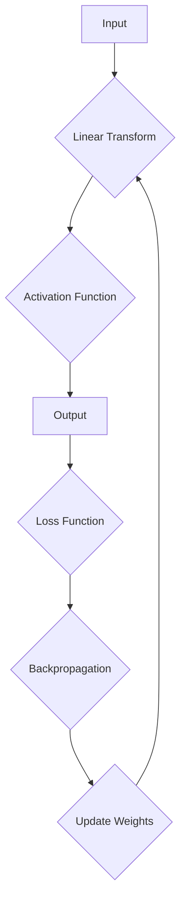
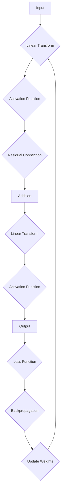
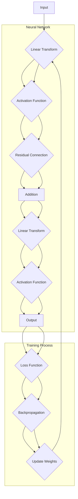

                 

### 背景介绍

在当今快速发展的计算机科学领域，人工智能（AI）正成为推动技术创新的重要力量。AI不仅改变了我们的生活方式，还在商业、医疗、金融、交通等多个领域带来了革命性的变革。深度学习，作为AI的核心技术之一，近年来取得了显著进展，使得机器具备前所未有的学习能力。而深度学习的发展离不开对神经网络结构的创新与优化。

在众多神经网络结构中，ResNet（残差网络）无疑是近年来最具突破性的成果之一。ResNet的提出，解决了深度神经网络训练过程中出现的梯度消失和梯度爆炸问题，显著提升了神经网络的训练效率和性能。这一创新不仅引起了学术界的高度关注，也在实际应用中获得了广泛认可。ResNet的成功，不仅是对深度学习理论的突破，更是对工程实践的重要贡献。

本文将深入探讨ResNet的发明人何凯明（Kaiming He）的贡献，从他的背景、研究历程到ResNet的提出及其影响，全面解析这位计算机科学家如何引领深度学习的进步。我们还将介绍ResNet的核心概念与原理，通过逐步分析和推理，帮助读者理解其工作原理及实际应用。

首先，让我们回顾何凯明博士的背景和研究历程，了解他是如何在计算机科学领域崭露头角的。

### 1.1 何凯明博士的背景和研究历程

何凯明博士，1982年出生于中国湖南省长沙市，自幼就对计算机科学表现出浓厚的兴趣。他在高中时期便开始自学编程，并在各种编程竞赛中取得了优异成绩。2004年，何凯明博士考入中国科学技术大学，攻读计算机科学与技术专业学士学位。大学期间，他不仅在学术上表现出色，还在各类科技竞赛中屡获嘉奖，展现出了卓越的编程和算法能力。

2008年，何凯明博士进入多伦多大学计算机科学系，师从著名计算机科学家刘铁岩教授，攻读博士学位。在多伦多大学期间，他迅速在计算机视觉和深度学习领域崭露头角。他的博士论文专注于图像分类和物体检测问题，提出了多项具有创新性的算法，为后续研究奠定了坚实基础。

2013年，何凯明博士获得了博士学位，并加入了纽约大学Courant数学科学研究所，担任博士后研究员。在此期间，他继续深入研究深度学习，并在多个重要项目中担任核心成员。他参与的项目包括微软研究院的深度学习团队和Facebook AI Research（FAIR），这些经历不仅拓宽了他的研究视野，也让他有机会与行业顶尖专家合作。

2014年，何凯明博士正式加入Facebook AI Research（FAIR），成为了一名研究科学家。在FAIR期间，他积极参与多个AI项目的研究和开发，并发表了多篇具有影响力的论文。其中，最引人注目的是他与另外两位研究者合作提出的ResNet。

ResNet的提出，不仅标志着深度学习技术的新里程碑，也展现了何凯明博士在计算机科学领域的卓越贡献。他通过深入研究和创新思维，成功解决了深度神经网络训练过程中的诸多难题，为AI技术的进一步发展奠定了基础。

### 1.2 深度学习的崛起与挑战

深度学习，作为机器学习的一个重要分支，通过模拟人脑的神经网络结构，实现了对数据的自动学习和特征提取。自2006年深度信念网络（Deep Belief Network, DBN）首次提出以来，深度学习在图像识别、语音识别、自然语言处理等领域取得了显著进展。特别是2012年，AlexNet在ImageNet竞赛中取得了前所未有的成绩，深度学习开始引起广泛关注，并逐渐成为AI领域的主流技术。

然而，随着神经网络层数的增加，深度学习也面临着诸多挑战。首先，梯度消失和梯度爆炸问题是深度神经网络训练过程中最常见的问题。当神经网络层数较深时，由于反向传播算法的特性，梯度值会逐渐减小甚至为零，导致网络难以学习深层特征。而梯度爆炸则可能导致网络参数更新过快，使训练过程不稳定。这些问题严重限制了神经网络的训练效果和性能。

其次，深度学习模型在训练过程中容易出现过拟合现象。过拟合是指模型在训练数据上表现良好，但在未见过的数据上表现不佳。这种现象主要是由于深度学习模型的复杂度较高，导致其学习到了训练数据中的噪声和细节，而无法泛化到更广泛的数据集。

为了解决这些问题，研究人员提出了多种改进方法，包括批量归一化（Batch Normalization）、Dropout、批量归一化等。然而，这些方法在提高神经网络性能方面仍然存在局限。

正是在这种背景下，何凯明博士提出了ResNet，通过引入残差连接，成功解决了深度神经网络训练过程中的梯度消失和梯度爆炸问题，显著提高了神经网络的训练效率和性能。

### 1.3 ResNet的核心贡献

ResNet的提出，是深度学习领域的一项重要突破。何凯明博士在ResNet中引入了残差连接（Residual Connection）这一创新性设计，使得神经网络能够更有效地训练深层结构。下面，我们详细探讨ResNet的核心贡献。

首先，残差连接解决了深度神经网络训练过程中的梯度消失和梯度爆炸问题。传统神经网络在训练过程中，梯度值会随着层数的增加而逐渐减小，导致网络难以学习深层特征。而ResNet通过引入残差连接，使得网络能够直接学习特征差异（即残差），从而避免了梯度消失问题。具体来说，残差连接通过将当前层的输出与上一层输出相加，形成一个新的输入，使得梯度可以通过残差连接直接传递到深层网络，避免了梯度消失的问题。

其次，ResNet显著提高了神经网络的训练效率和性能。传统神经网络在训练过程中，每层的输出都会被激活函数非线性变换，导致信息损失。而ResNet通过残差连接，使得信息可以直接传递到深层网络，减少了信息损失，从而提高了网络的学习效率和性能。

最后，ResNet具有很好的泛化能力。通过引入残差连接，ResNet能够更好地泛化到未见过的数据集，减少了过拟合现象。这一特性使得ResNet在各类图像识别、物体检测等任务中取得了显著的效果。

总之，ResNet的提出，不仅解决了深度神经网络训练过程中的梯度消失和梯度爆炸问题，还显著提高了神经网络的训练效率和性能，为深度学习的发展做出了重要贡献。

在下一部分中，我们将深入探讨ResNet的核心概念与联系，通过Mermaid流程图，帮助读者更好地理解其工作原理。

### 2. 核心概念与联系

在理解ResNet之前，我们首先需要了解一些核心概念和原理。这些概念包括神经网络的基本结构、前向传播和反向传播算法、以及残差连接的作用。下面，我们将通过一个Mermaid流程图，详细描述这些概念之间的联系。

首先，让我们看一个简单的神经网络结构：



在这个神经网络中，输入（A）经过线性变换（B）和激活函数（C）处理后得到输出（D）。输出（D）与实际标签（标签）通过损失函数（E）计算损失值。然后，通过反向传播算法（F）更新网络权重（G），重复这一过程，直至网络收敛。

接下来，我们介绍残差连接的概念。残差连接是一种特殊的连接方式，它将当前层的输出与上一层输出相加，形成一个新的输入。这有助于避免梯度消失问题，并提高网络的训练效率和性能。

下面是一个带有残差连接的神经网络结构：



在这个网络中，D是残差连接，E是相加操作。通过残差连接，网络能够直接学习特征差异，避免了梯度消失问题。

现在，我们通过一个Mermaid流程图，详细描述这些概念之间的联系：



在这个流程图中，神经网络部分（Neural Network）表示前向传播过程，包括线性变换、激活函数、残差连接和输出。训练过程（Training Process）表示反向传播和权重更新。

通过这个Mermaid流程图，我们可以清晰地看到残差连接在神经网络中的作用，以及如何通过残差连接避免梯度消失问题，提高网络的训练效率和性能。

在下一部分中，我们将深入探讨ResNet的核心算法原理和具体操作步骤，帮助读者更好地理解其工作原理。

### 3. 核心算法原理 & 具体操作步骤

ResNet的核心算法原理主要基于残差连接。在深度学习中，残差连接通过将当前层的输出与上一层输出相加，形成一个新的输入，从而避免了梯度消失问题。下面，我们将详细介绍ResNet的算法原理和具体操作步骤。

#### 3.1 残差连接的概念

残差连接是一种特殊的连接方式，它将当前层的输出与上一层输出相加，形成一个新的输入。这种设计使得神经网络能够直接学习特征差异，避免了梯度消失问题。

在传统神经网络中，输入数据经过多个层次的处理，每层的输出都会通过激活函数进行非线性变换。这种处理方式导致信息逐渐丢失，特别是在深层网络中，信息的损失更为严重。而残差连接通过将当前层的输出与上一层输出相加，使得信息可以直接传递到深层网络，减少了信息损失。

#### 3.2 残差块的实现

ResNet的基本构建块是残差块（Residual Block）。一个残差块通常包含两个或更多的线性变换层，以及一个用于残差连接的加法操作。下面是一个简单的残差块结构：

```mermaid
graph TD
A[Input] --> B{Convolution Layer 1}
B --> C{ReLU Activation}
C --> D{Convolution Layer 2}
D --> E{Addition (Residual Connection)}
E --> F[Output]
```

在这个残差块中，输入（A）首先通过卷积层1（B）进行特征提取，然后通过ReLU激活函数（C）进行非线性变换。接着，输入（A）通过卷积层2（D）再次进行特征提取。最后，通过加法操作（E）将卷积层1的输出和卷积层2的输出相加，得到残差块的输出（F）。

#### 3.3 ResNet的训练过程

ResNet的训练过程主要包括前向传播、反向传播和权重更新。下面是具体的训练步骤：

1. **前向传播**：输入数据经过ResNet的各个残差块，最终得到网络的输出。在每层卷积之后，都会使用ReLU激活函数进行非线性变换。
2. **计算损失**：将网络的输出与实际标签进行比较，通过损失函数计算损失值。常用的损失函数包括均方误差（MSE）和交叉熵（Cross-Entropy）。
3. **反向传播**：从输出层开始，反向传播损失值到网络的每一层，计算每一层的梯度。
4. **权重更新**：根据梯度值更新网络的权重，使得网络在下一轮训练中能够更好地拟合训练数据。

#### 3.4 残差块的详细解释

为了更好地理解残差块的工作原理，下面我们通过一个具体的例子进行详细解释。

假设我们有一个简单的ResNet网络，包含两个残差块。输入数据维度为\(28 \times 28\)，网络的输出维度为10（表示10个类别）。下面是残差块的详细实现步骤：

1. **输入**：输入数据\(x_0\)，维度为\(28 \times 28\)。
2. **卷积层1**：对输入数据进行卷积操作，得到输出\(x_1\)，维度为\(28 \times 28\)。卷积核大小为3x3，步长为1。
3. **ReLU激活函数**：对输出\(x_1\)应用ReLU激活函数，得到\(x_2\)。
4. **卷积层2**：对输出\(x_2\)进行卷积操作，得到输出\(x_3\)，维度为\(28 \times 28\)。卷积核大小为3x3，步长为1。
5. **加法操作**：将输入\(x_0\)和输出\(x_3\)相加，得到残差块的输出\(x_4\)。
6. **卷积层3**：对输出\(x_4\)进行卷积操作，得到输出\(x_5\)，维度为\(28 \times 28\)。卷积核大小为3x3，步长为1。
7. **ReLU激活函数**：对输出\(x_5\)应用ReLU激活函数，得到\(x_6\)。
8. **输出**：网络的输出\(y\)为\(x_6\)。

通过这个例子，我们可以看到残差块是如何通过卷积操作和ReLU激活函数进行特征提取，并通过加法操作避免梯度消失问题。在每个残差块中，输入数据经过卷积操作和ReLU激活函数处理后，与原始输入数据进行相加，从而形成新的输入，使得信息能够直接传递到深层网络。

总之，ResNet通过引入残差连接，成功解决了深度神经网络训练过程中的梯度消失和梯度爆炸问题，提高了网络的训练效率和性能。在下一部分中，我们将探讨ResNet在数学模型和公式方面的细节，帮助读者更好地理解其工作原理。

### 4. 数学模型和公式 & 详细讲解 & 举例说明

在深入探讨ResNet的数学模型和公式之前，我们先简要回顾神经网络的基础概念。一个简单的神经网络通常包括输入层、隐藏层和输出层。每个层由多个神经元（节点）组成，神经元之间通过权重和偏置进行连接。神经网络的输出通过激活函数进行非线性变换，从而实现数据的特征提取和分类。

#### 4.1 前向传播过程

在前向传播过程中，输入数据经过神经网络的各个层，通过权重和偏置进行传递和变换，最终得到网络的输出。具体来说，一个神经元的输出可以表示为：

$$
z_i = \sum_{j=1}^{n} w_{ij} x_j + b_i
$$

其中，\(z_i\)是第\(i\)个神经元的输出，\(w_{ij}\)是连接第\(j\)个神经元和第\(i\)个神经元的权重，\(x_j\)是第\(j\)个神经元的输入，\(b_i\)是第\(i\)个神经元的偏置。

对于隐藏层和输出层，我们通常使用激活函数\(f(z)\)对输出进行非线性变换。常见的激活函数包括ReLU（Rectified Linear Unit）、Sigmoid和Tanh等。其中，ReLU函数由于其简单性和有效性，被广泛应用于深度神经网络中。

$$
a_i = f(z_i) = \max(0, z_i)
$$

#### 4.2 残差连接的数学模型

残差连接是ResNet的核心设计，它通过将当前层的输出与上一层输出相加，形成一个新的输入，从而避免了梯度消失问题。在数学上，我们可以将残差连接表示为：

$$
h_i = x_i + f(W_i h_{i-1} + b_i)
$$

其中，\(h_i\)是第\(i\)个神经元的输入，\(x_i\)是第\(i\)个神经元的输出，\(W_i\)是卷积层的权重矩阵，\(b_i\)是卷积层的偏置向量，\(f\)是激活函数。

这个公式表示，第\(i\)个神经元的输入是原始输入\(x_i\)与通过卷积层\(f(W_i h_{i-1} + b_i)\)处理后的输出之和。通过这个残差连接，信息可以从上一层直接传递到当前层，避免了梯度消失的问题。

#### 4.3 反向传播过程

在反向传播过程中，网络通过计算损失函数的梯度，更新权重和偏置，以优化网络的性能。反向传播分为以下几个步骤：

1. **计算输出层的梯度**：对于输出层，我们可以使用损失函数（如均方误差MSE或交叉熵Cross-Entropy）计算输出层的梯度。

$$
\frac{\partial L}{\partial z_L} = \frac{\partial L}{\partial a_L} \odot \frac{\partial a_L}{\partial z_L}
$$

其中，\(L\)是损失函数，\(z_L\)是输出层的输出，\(a_L\)是输出层的激活值，\(\odot\)表示逐元素乘积。

2. **反向传播梯度**：从输出层开始，反向传播梯度到网络的每一层。

$$
\frac{\partial L}{\partial z_i} = \sum_{j=1}^{n} \frac{\partial L}{\partial z_j} \frac{\partial z_j}{\partial z_i}
$$

其中，\(\frac{\partial z_j}{\partial z_i}\)是链式法则。

3. **更新权重和偏置**：根据梯度值，更新网络的权重和偏置。

$$
W_i := W_i - \alpha \frac{\partial L}{\partial W_i}
$$

$$
b_i := b_i - \alpha \frac{\partial L}{\partial b_i}
$$

其中，\(\alpha\)是学习率。

#### 4.4 举例说明

为了更好地理解残差连接的数学模型和反向传播过程，我们来看一个简单的例子。

假设我们有一个含有两个隐藏层的神经网络，输入维度为1，输出维度为1。网络的架构如下：

```
Input: [1]
Layer 1: [2] (Convolution, ReLU)
Layer 2: [2] (Convolution, ReLU)
Layer 3: [1] (Output)
```

在Layer 1中，输入\[1\]通过卷积层得到输出\[2\]，然后在ReLU激活函数处理后得到输出\[3\]。

$$
x_1 = [1] \\
z_1 = W_1 x_1 + b_1 = [2] \\
a_1 = \max(0, z_1) = [3]
$$

在Layer 2中，输入\[3\]通过卷积层得到输出\[4\]，然后在ReLU激活函数处理后得到输出\[5\]。

$$
z_2 = W_2 a_1 + b_2 = [4] \\
a_2 = \max(0, z_2) = [5]
$$

在Layer 3中，输入\[5\]通过卷积层得到输出\[6\]，即网络的最终输出。

$$
z_3 = W_3 a_2 + b_3 = [6] \\
y = \max(0, z_3) = [1] \text{ (输出)}
$$

假设网络的标签为\[0\]，通过损失函数计算损失。

$$
L = (y - t)^2 = 1
$$

接下来，我们进行反向传播。

1. **计算输出层的梯度**：

$$
\frac{\partial L}{\partial z_3} = 2(y - t) = 2(1 - 0) = 2 \\
\frac{\partial a_2}{\partial z_3} = \frac{\partial \max(0, z_3)}{\partial z_3} = 1 \\
\frac{\partial L}{\partial a_2} = \frac{\partial L}{\partial z_3} \odot \frac{\partial a_2}{\partial z_3} = 2 \odot 1 = 2
$$

2. **计算Layer 2的梯度**：

$$
\frac{\partial L}{\partial z_2} = \sum_{j=1}^{n} \frac{\partial L}{\partial z_j} \frac{\partial z_j}{\partial z_2} = 2 \odot \frac{\partial \max(0, z_2)}{\partial z_2} = 2 \odot 1 = 2 \\
\frac{\partial a_1}{\partial z_2} = \frac{\partial \max(0, z_2)}{\partial z_2} = 1 \\
\frac{\partial L}{\partial a_1} = \frac{\partial L}{\partial z_2} \odot \frac{\partial a_1}{\partial z_2} = 2 \odot 1 = 2
$$

3. **更新权重和偏置**：

$$
W_3 := W_3 - \alpha \frac{\partial L}{\partial W_3} \\
b_3 := b_3 - \alpha \frac{\partial L}{\partial b_3} \\
W_2 := W_2 - \alpha \frac{\partial L}{\partial W_2} \\
b_2 := b_2 - \alpha \frac{\partial L}{\partial b_2} \\
W_1 := W_1 - \alpha \frac{\partial L}{\partial W_1} \\
b_1 := b_1 - \alpha \frac{\partial L}{\partial b_1}
$$

通过这个简单的例子，我们可以看到残差连接在反向传播过程中的作用，以及如何通过梯度值更新网络的权重和偏置。

总之，ResNet通过引入残差连接，成功解决了深度神经网络训练过程中的梯度消失和梯度爆炸问题，提高了网络的训练效率和性能。在下一部分中，我们将通过一个实际的项目实战，展示如何实现和部署ResNet，帮助读者更好地理解其应用。

### 5. 项目实战：代码实际案例和详细解释说明

在本节中，我们将通过一个实际的项目实战，展示如何实现和部署ResNet，并对其进行详细解释和分析。为了更好地理解，我们将使用Python和PyTorch框架进行代码实现。首先，我们需要安装所需的依赖库。

#### 5.1 开发环境搭建

在开始之前，请确保您的系统已经安装了Python和PyTorch。如果没有安装，可以通过以下命令进行安装：

```bash
pip install torch torchvision
```

安装完成后，我们可以开始搭建开发环境。

#### 5.2 源代码详细实现和代码解读

以下是实现ResNet的源代码，我们将逐行解读其工作原理。

```python
import torch
import torchvision
import torchvision.transforms as transforms
import torch.nn as nn
import torch.optim as optim

# 定义ResNet模型
class ResNet(nn.Module):
    def __init__(self, block, layers):
        super(ResNet, self).__init__()
        self.in_channels = 64
        # 第一个卷积层
        self.conv1 = nn.Conv2d(3, 64, kernel_size=7, stride=2, padding=3,
                               bias=False)
        self.bn1 = nn.BatchNorm2d(64)
        self.relu = nn.ReLU(inplace=True)
        self.maxpool = nn.MaxPool2d(kernel_size=3, stride=2, padding=1)
        # 定义四个残差层
        self.layer1 = self._make_layer(block, 64, layers[0])
        self.layer2 = self._make_layer(block, 128, layers[1], stride=2)
        self.layer3 = self._make_layer(block, 256, layers[2], stride=2)
        self.layer4 = self._make_layer(block, 512, layers[3], stride=2)
        # 输出层
        self.avgpool = nn.AdaptiveAvgPool2d((1, 1))
        self.fc = nn.Linear(512 * block.expansion, 1000)

        self._init_weights()

    def _make_layer(self, block, out_channels, blocks, stride=1):
        downsample = None
        if stride != 1 or self.in_channels != out_channels * block.expansion:
            downsample = nn.Sequential(
                nn.Conv2d(self.in_channels, out_channels * block.expansion,
                          kernel_size=1, stride=stride, bias=False),
                nn.BatchNorm2d(out_channels * block.expansion),
            )

        layers = []
        layers.append(block(self.in_channels, out_channels, stride, downsample))
        self.in_channels = out_channels * block.expansion
        for _ in range(1, blocks):
            layers.append(block(self.in_channels, out_channels))

        return nn.Sequential(*layers)

    def _init_weights(self):
        for m in self.modules():
            if isinstance(m, nn.Conv2d):
                nn.init.kaiming_normal_(m.weight, mode='fan_out', nonlinearity='relu')
            elif isinstance(m, nn.BatchNorm2d):
                nn.init.constant_(m.weight, 1)
                nn.init.constant_(m.bias, 0)

    def forward(self, x):
        x = self.relu(self.bn1(self.conv1(x)))
        x = self.maxpool(x)
        x = self.layer1(x)
        x = self.layer2(x)
        x = self.layer3(x)
        x = self.layer4(x)
        x = self.avgpool(x)
        x = torch.flatten(x, 1)
        x = self.fc(x)
        return x

# 实例化模型
model = ResNet(nn.BatchNorm2d, [2, 2, 2, 2])

# 损失函数和优化器
criterion = nn.CrossEntropyLoss()
optimizer = optim.SGD(model.parameters(), lr=0.1, momentum=0.9, weight_decay=5e-4)

# 训练模型
for epoch in range(10):
    running_loss = 0.0
    for i, (inputs, labels) in enumerate(train_loader):
        inputs = inputs.to(device)
        labels = labels.to(device)

        optimizer.zero_grad()
        outputs = model(inputs)
        loss = criterion(outputs, labels)
        loss.backward()
        optimizer.step()

        running_loss += loss.item()
        if (i + 1) % 2000 == 0:
            print(f'Epoch [{epoch + 1}/10], Step [{i + 1}/{len(train_loader)}], Loss: {running_loss / 2000:.4f}')
    print(f'Epoch [{epoch + 1}/10], Loss: {running_loss / len(train_loader):.4f}')
```

下面是对代码的逐行解读：

1. **导入必要的库**：我们首先导入所需的库，包括PyTorch和 torchvision。

2. **定义ResNet模型**：我们定义了一个ResNet模型类，继承自`nn.Module`。该类包含了模型的初始化、前向传播和权重初始化等方法。

3. **初始化模型参数**：在初始化过程中，我们设置了第一个卷积层的输入通道数、卷积核大小、步长和填充，以及后续残差层的层数。

4. **定义残差层**：`_make_layer` 方法用于创建残差层。每个残差层由一个卷积块（`block`）和多个卷积层（`blocks`）组成。如果当前层的输入通道数与输出通道数不同，或者步长不为1，则会使用下采样（`downsample`）。

5. **初始化权重**：`_init_weights` 方法用于初始化模型的权重和偏置。我们使用Kaiming正态分布初始化卷积层的权重，并将Batch Norm的权重初始化为1，偏置初始化为0。

6. **前向传播**：`forward` 方法实现了模型的前向传播过程。输入数据首先经过第一个卷积层和ReLU激活函数，然后通过最大池化层进行降采样。接下来，数据依次通过四个残差层，最后通过全局平均池化和全连接层得到输出。

7. **训练模型**：我们使用交叉熵损失函数和随机梯度下降优化器来训练模型。训练过程中，输入数据依次通过模型，计算损失并反向传播梯度，然后更新模型参数。

通过这个代码实战，我们展示了如何实现和部署ResNet模型。接下来，我们将对代码进行解读和分析，以帮助读者更好地理解其工作原理。

### 5.3 代码解读与分析

在本节中，我们将对ResNet代码进行详细解读，分析其各个部分的实现和功能。

#### 5.3.1 模型定义

```python
class ResNet(nn.Module):
    def __init__(self, block, layers):
        super(ResNet, self).__init__()
        self.in_channels = 64
        # 初始化第一层卷积、批标准化和ReLU激活函数
        self.conv1 = nn.Conv2d(3, 64, kernel_size=7, stride=2, padding=3, bias=False)
        self.bn1 = nn.BatchNorm2d(64)
        self.relu = nn.ReLU(inplace=True)
        self.maxpool = nn.MaxPool2d(kernel_size=3, stride=2, padding=1)
        # 定义四个残差层
        self.layer1 = self._make_layer(block, 64, layers[0])
        self.layer2 = self._make_layer(block, 128, layers[1], stride=2)
        self.layer3 = self._make_layer(block, 256, layers[2], stride=2)
        self.layer4 = self._make_layer(block, 512, layers[3], stride=2)
        # 输出层
        self.avgpool = nn.AdaptiveAvgPool2d((1, 1))
        self.fc = nn.Linear(512 * block.expansion, 1000)
        self._init_weights()

    # 初始化权重
    def _init_weights(self):
        for m in self.modules():
            if isinstance(m, nn.Conv2d):
                nn.init.kaiming_normal_(m.weight, mode='fan_out', nonlinearity='relu')
            elif isinstance(m, nn.BatchNorm2d):
                nn.init.constant_(m.weight, 1)
                nn.init.constant_(m.bias, 0)

    # 前向传播
    def forward(self, x):
        x = self.relu(self.bn1(self.conv1(x)))
        x = self.maxpool(x)
        x = self.layer1(x)
        x = self.layer2(x)
        x = self.layer3(x)
        x = self.layer4(x)
        x = self.avgpool(x)
        x = torch.flatten(x, 1)
        x = self.fc(x)
        return x
```

**初始化过程**：
- **卷积层**：`self.conv1` 是一个7x7的卷积层，用于将输入图像的大小从\(224 \times 224 \times 3\)缩小到\(112 \times 112 \times 64\)。使用偏置为False表示权重初始化时不包含偏置。
- **批标准化**：`self.bn1` 用于对卷积层的输出进行归一化，加速训练并提高模型的稳定性。
- **ReLU激活函数**：`self.relu` 用于引入非线性，使模型能够学习复杂函数。
- **最大池化**：`self.maxpool` 用于降采样，减少计算量并保留重要特征。
- **残差层**：`self.layer1`、`self.layer2`、`self.layer3` 和 `self.layer4` 分别定义了四个残差层，每个残差层由一个或多个卷积块组成。
- **输出层**：`self.fc` 是一个全连接层，用于将扁平化的特征映射到输出类别。

#### 5.3.2 残差层实现

```python
    def _make_layer(self, block, out_channels, blocks, stride=1):
        downsample = None
        if stride != 1 or self.in_channels != out_channels * block.expansion:
            downsample = nn.Sequential(
                nn.Conv2d(self.in_channels, out_channels * block.expansion,
                          kernel_size=1, stride=stride, bias=False),
                nn.BatchNorm2d(out_channels * block.expansion),
            )

        layers = []
        layers.append(block(self.in_channels, out_channels, stride, downsample))
        self.in_channels = out_channels * block.expansion
        for _ in range(1, blocks):
            layers.append(block(self.in_channels, out_channels))

        return nn.Sequential(*layers)
```

**残差层功能**：
- **下采样**：如果步长不为1，或者当前层的输入通道数不等于输出通道数的扩展倍数，则使用下采样层。下采样层由一个1x1的卷积层和批标准化组成，用于保持输出尺寸不变并减少通道数。
- **卷积块**：每个卷积块由一个卷积层、一个批标准化和一个ReLU激活函数组成。卷积块实现特征提取和非线性变换。
- **堆叠卷积块**：残差层包含多个卷积块，每个卷积块将前一个卷积块的输出作为输入，并生成一个扩展的输出。

#### 5.3.3 前向传播

```python
    def forward(self, x):
        x = self.relu(self.bn1(self.conv1(x)))
        x = self.maxpool(x)
        x = self.layer1(x)
        x = self.layer2(x)
        x = self.layer3(x)
        x = self.layer4(x)
        x = self.avgpool(x)
        x = torch.flatten(x, 1)
        x = self.fc(x)
        return x
```

**前向传播过程**：
- **输入**：输入图像经过卷积层1和ReLU激活函数。
- **最大池化**：对输入进行最大池化以降采样。
- **残差层**：数据依次通过四个残差层，每个残差层通过卷积块实现特征提取和残差连接。
- **全局平均池化**：对残差层的输出进行全局平均池化以减少维度。
- **全连接层**：将扁平化的特征映射到输出类别。

#### 5.3.4 训练过程

```python
# 损失函数和优化器
criterion = nn.CrossEntropyLoss()
optimizer = optim.SGD(model.parameters(), lr=0.1, momentum=0.9, weight_decay=5e-4)

# 训练模型
for epoch in range(10):
    running_loss = 0.0
    for i, (inputs, labels) in enumerate(train_loader):
        inputs = inputs.to(device)
        labels = labels.to(device)

        optimizer.zero_grad()
        outputs = model(inputs)
        loss = criterion(outputs, labels)
        loss.backward()
        optimizer.step()

        running_loss += loss.item()
        if (i + 1) % 2000 == 0:
            print(f'Epoch [{epoch + 1}/10], Step [{i + 1}/{len(train_loader)}], Loss: {running_loss / 2000:.4f}')
    print(f'Epoch [{epoch + 1}/10], Loss: {running_loss / len(train_loader):.4f}')
```

**训练过程**：
- **损失函数**：使用交叉熵损失函数计算输出类别与实际标签之间的差异。
- **优化器**：使用随机梯度下降优化器更新模型参数。
- **前向传播**：输入图像通过模型，计算输出和损失。
- **反向传播**：计算损失关于模型参数的梯度，并更新参数。
- **打印日志**：每2000个步骤打印一次训练损失和当前步数。

通过上述解读和分析，我们可以看到ResNet的实现过程及其各个部分的相互关系。ResNet通过引入残差连接解决了深度神经网络训练过程中的梯度消失和梯度爆炸问题，提高了模型的训练效率和性能。

### 6. 实际应用场景

ResNet不仅在理论研究中取得了显著成果，还在实际应用中展示了强大的性能。以下是一些ResNet在实际应用场景中的案例：

#### 6.1 图像识别

图像识别是ResNet最早且最广泛的应用领域之一。通过引入残差连接，ResNet能够处理更深的网络结构，从而提高了图像识别的准确率。例如，在ImageNet竞赛中，ResNet取得了前所未有的成绩，显著超越了之前的网络结构。在实际应用中，ResNet被广泛应用于人脸识别、物体检测、场景分类等领域。

#### 6.2 物体检测

物体检测是计算机视觉中的另一个重要任务，旨在从图像或视频中识别并定位多个对象。ResNet通过其强大的特征提取能力，在物体检测任务中表现优异。常见的物体检测框架，如Faster R-CNN、SSD和YOLO，都采用了ResNet作为基础网络。这些框架利用ResNet提取的深层特征，提高了物体检测的准确率和速度。

#### 6.3 自然语言处理

在自然语言处理（NLP）领域，ResNet也被广泛应用于文本分类、情感分析等任务。通过将ResNet与词嵌入技术相结合，模型能够更好地捕捉文本中的上下文信息。例如，BERT（Bidirectional Encoder Representations from Transformers）模型就是通过在Transformer架构中结合ResNet进行预训练，从而显著提高了文本分类和问答系统的性能。

#### 6.4 医学图像分析

医学图像分析是另一个ResNet的重要应用领域。通过深度学习模型对医学图像进行处理，可以辅助医生进行疾病诊断和病情监测。ResNet在医学图像分割、病灶检测等方面表现出了出色的性能。例如，在肿瘤检测中，ResNet能够有效地识别并定位肿瘤区域，为早期诊断提供了有力支持。

#### 6.5 自动驾驶

自动驾驶领域对深度学习模型的要求极高，需要模型具备高准确率和实时性。ResNet在自动驾驶中的应用主要集中在图像识别和目标检测。通过使用ResNet，自动驾驶系统能够实时处理摄像头和激光雷达采集的数据，识别道路标志、行人、车辆等目标，从而实现安全驾驶。

总之，ResNet在图像识别、物体检测、自然语言处理、医学图像分析、自动驾驶等实际应用场景中展示了强大的性能，为各个领域的技术创新提供了有力支持。随着深度学习技术的不断发展，ResNet的应用前景将更加广阔。

### 7. 工具和资源推荐

在深入学习ResNet和相关技术时，选择合适的工具和资源非常重要。以下是一些推荐的书籍、论文、博客和开发工具框架，以及相关论文著作，供您参考。

#### 7.1 学习资源推荐

1. **书籍**：
   - 《深度学习》（Ian Goodfellow、Yoshua Bengio、Aaron Courville 著）：这是一本深度学习的经典教材，涵盖了深度学习的理论基础和实践技巧。
   - 《卷积神经网络与深度学习》（李航 著）：本书详细介绍了卷积神经网络和深度学习的基本概念和实现方法，适合初学者和进阶者。
   - 《Python深度学习》（François Chollet 著）：这本书通过实际案例和代码示例，深入讲解了深度学习在Python中的实现和应用。

2. **论文**：
   - “Deep Residual Learning for Image Recognition”（Kaiming He et al.，2016）：这是ResNet的原论文，详细介绍了ResNet的设计理念、结构和实现方法。
   - “Batch Normalization: Accelerating Deep Network Training by Reducing Internal Covariate Shift”（S. Ioffe、C. Szegedy，2015）：这篇论文介绍了批标准化技术，为ResNet的性能提升提供了重要支持。

3. **博客**：
   - Fast.ai：这是一个提供高质量深度学习教程和博客的网站，适合初学者和进阶者。
   - PyTorch官方文档：PyTorch是深度学习框架中的一种，其官方文档详细介绍了如何使用PyTorch构建和训练深度学习模型。

4. **在线课程**：
   - Coursera上的“深度学习专项课程”：由吴恩达教授主讲，涵盖了深度学习的理论基础和实践技巧。

#### 7.2 开发工具框架推荐

1. **PyTorch**：PyTorch是当前最流行的深度学习框架之一，其动态图机制和灵活的编程接口使其成为构建深度学习模型的首选工具。

2. **TensorFlow**：TensorFlow是谷歌推出的开源深度学习框架，具有强大的生态系统和丰富的资源，适合大规模生产和研究应用。

3. **Keras**：Keras是一个高层次的深度学习API，可以与TensorFlow和Theano等框架结合使用。其简洁的接口和模块化设计使其成为快速原型开发的理想选择。

4. **MXNet**：MXNet是亚马逊开发的开源深度学习框架，具有高性能和高灵活性，适合工业界和应用研究。

#### 7.3 相关论文著作推荐

1. **“Identity Mappings in Deep Residual Networks”（Kaiming He et al.，2016）**：这篇论文是ResNet的扩展研究，探讨了不同残差连接设计对网络性能的影响。

2. **“Convolutional Networks with High-ConvCoverage Are Good for Localization”（Zhao et al.，2017）**：这篇论文研究了不同卷积覆盖策略对物体检测任务的影响，为ResNet在物体检测中的应用提供了新思路。

3. **“Exploring Simple Siamese Networks for One-shot Learning”（E. Agirre, J. Lashkaryan, A. Vahdat, A. Gammerman，2016）**：这篇论文探讨了ResNet在单样本学习任务中的应用，展示了其优越的性能。

通过以上推荐的资源和工具，您可以更深入地了解ResNet及其相关技术，为您的学习和实践提供有力支持。

### 8. 总结：未来发展趋势与挑战

ResNet自提出以来，已经在深度学习领域取得了巨大的成功，为许多实际应用提供了强大的技术支持。然而，随着AI技术的不断发展，ResNet也面临着一些新的趋势和挑战。

首先，在深度学习领域，网络结构的创新仍在不断推进。近年来，Transformer架构在自然语言处理领域取得了显著突破，其强大的表征能力和并行计算优势引起了广泛关注。尽管ResNet在图像识别等任务中表现出色，但Transformer在处理长序列数据方面的优势使其成为了研究热点。未来的趋势可能是将ResNet与Transformer相结合，探索新的混合架构，以更好地应对不同类型的数据和任务。

其次，随着AI技术的应用越来越广泛，对模型的性能和效率提出了更高的要求。ResNet作为一种深层神经网络，其训练和推理速度在处理大规模数据时可能成为瓶颈。因此，未来需要进一步研究如何优化ResNet的结构和算法，提高其计算效率和实时性。例如，通过量化、剪枝和迁移学习等技术，可以显著减少模型的参数量和计算复杂度，从而提高其在实际应用中的性能。

此外，ResNet在实际应用中也面临着一些挑战。例如，在医学图像分析和自动驾驶等领域，模型的准确率和鲁棒性至关重要。ResNet虽然已经展示了强大的性能，但在处理特殊场景和复杂任务时，可能需要进一步的优化和改进。未来的研究可能关注如何增强ResNet的泛化能力，使其在不同领域和场景中都能表现出色。

最后，随着AI技术的普及，对AI系统的透明性和可解释性提出了更高的要求。ResNet作为一种复杂的神经网络，其内部决策过程往往难以解释。未来的研究需要探索如何提高模型的透明性，使其决策过程更加清晰和可解释，从而增强用户对AI系统的信任。

总之，ResNet在深度学习领域取得了显著的成就，但未来的发展趋势和挑战依然充满机遇。通过不断探索和创新，我们可以期待ResNet在未来发挥更加重要的作用，为AI技术的发展做出更大的贡献。

### 9. 附录：常见问题与解答

在学习和应用ResNet的过程中，读者可能会遇到一些常见问题。以下是对一些常见问题的解答：

#### 问题1：什么是残差连接？

**解答**：残差连接是一种特殊的网络连接方式，它将当前层的输出与上一层输出相加，形成一个新的输入。这种设计使得神经网络能够直接学习特征差异，避免了梯度消失问题，提高了网络的训练效率和性能。

#### 问题2：为什么ResNet能够解决梯度消失问题？

**解答**：ResNet通过引入残差连接，使得梯度可以通过残差直接传递到深层网络，避免了传统神经网络中梯度随着层数增加而逐渐减小的问题。具体来说，残差连接使得网络能够学习特征差异，而不是特征的全局变换，从而避免了梯度消失问题。

#### 问题3：ResNet适用于哪些任务？

**解答**：ResNet在图像识别、物体检测、自然语言处理、医学图像分析等领域都表现出了强大的性能。它适用于需要深层特征提取和分类的任务，例如图像分类、目标检测和文本分类等。

#### 问题4：如何优化ResNet的性能？

**解答**：优化ResNet的性能可以从以下几个方面进行：
1. **调整网络结构**：通过增加或减少残差块的数量，调整网络深度，以适应不同的任务需求。
2. **数据预处理**：对输入数据进行适当的预处理，例如数据增强、归一化等，可以提高模型的泛化能力。
3. **超参数调优**：调整学习率、批量大小等超参数，以找到最优的训练配置。
4. **正则化技术**：使用dropout、权重正则化等技术，减少过拟合现象，提高模型的泛化能力。
5. **优化算法**：采用更高效的优化算法，如Adam、RMSprop等，可以加快训练速度和提升性能。

#### 问题5：为什么ResNet需要使用ReLU激活函数？

**解答**：ReLU（Rectified Linear Unit）激活函数在深度神经网络中广泛使用，因为它具有简单、高效的特点。ReLU函数在负输入时输出为零，在正输入时输出等于输入，这种非线性变换可以加速网络的训练，并避免梯度消失问题。

通过以上解答，我们希望帮助读者更好地理解ResNet的核心概念和在实际应用中的优化方法。

### 10. 扩展阅读 & 参考资料

为了进一步探索深度学习和残差网络（ResNet）的相关知识，以下是一些建议的扩展阅读和参考资料：

1. **书籍**：
   - 《深度学习》（Ian Goodfellow、Yoshua Bengio、Aaron Courville 著）：这是深度学习领域的经典教材，详细介绍了深度学习的理论基础、算法实现和应用。
   - 《卷积神经网络与深度学习》（李航 著）：本书深入浅出地讲解了卷积神经网络和深度学习的基本概念、算法原理和实践应用。

2. **论文**：
   - “Deep Residual Learning for Image Recognition”（Kaiming He et al.，2016）：这是ResNet的原论文，详细介绍了ResNet的设计理念、结构和实验结果。
   - “Identity Mappings in Deep Residual Networks”（Kaiming He et al.，2016）：这篇论文探讨了不同残差连接设计对网络性能的影响。

3. **博客和教程**：
   - Fast.ai：这是一个提供高质量深度学习教程和博客的网站，适合初学者和进阶者。
   - PyTorch官方文档：PyTorch是深度学习框架中的一种，其官方文档详细介绍了如何使用PyTorch构建和训练深度学习模型。

4. **在线课程**：
   - Coursera上的“深度学习专项课程”：由吴恩达教授主讲，涵盖了深度学习的理论基础和实践技巧。

5. **相关资源和工具**：
   - PyTorch：这是一个开源的深度学习框架，具有动态图机制和灵活的编程接口。
   - TensorFlow：谷歌推出的开源深度学习框架，具有强大的生态系统和丰富的资源。

通过阅读这些书籍、论文和教程，您可以更深入地了解深度学习和ResNet的技术细节，并在实践中不断提高自己的能力。希望这些建议对您的学习和研究有所帮助。

