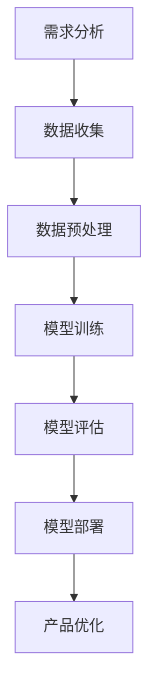

                 

### 文章标题：AI 大模型驱动的创业产品设计创新

#### 关键词：大模型，创业产品，设计创新，人工智能，深度学习

#### 摘要：
本文将深入探讨如何利用人工智能大模型推动创业产品的设计创新。我们将从背景介绍开始，逐步阐述核心概念、算法原理、数学模型、实战案例，并讨论实际应用场景，最终总结未来发展趋势与挑战。希望通过本文，能为大家提供有价值的参考和启发。

<|assistant|>### 1. 背景介绍

随着人工智能技术的飞速发展，大模型（Large-scale Models）在各个领域取得了显著的成果。大模型是一种能够处理大规模数据和复杂任务的深度学习模型，具有强大的表示能力和泛化能力。而创业产品设计的创新，正是利用这种能力来实现的。本文旨在探讨如何将大模型应用于创业产品设计，为创业公司提供创新的解决方案。

在当今快速变化的商业环境中，创业公司面临着巨大的竞争压力。如何设计出满足用户需求、具有竞争力的产品，是创业公司成功的关键。而大模型在图像识别、自然语言处理、推荐系统等领域已经展现出了卓越的能力，这为创业产品设计提供了新的思路和方法。

本文将详细介绍大模型的工作原理，以及如何将其应用于创业产品设计的过程中。我们将结合实际案例，展示大模型在创业产品中的应用效果，并探讨未来的发展趋势和挑战。

### 2. 核心概念与联系

#### 大模型的概念

大模型是指具有数亿甚至千亿参数的深度学习模型，例如GPT-3、BERT等。这些模型能够处理大规模的文本、图像、语音等多媒体数据，具有强大的表示和学习能力。

#### 创业产品设计的概念

创业产品设计是指创业公司根据市场需求和用户需求，运用创新思维和方法，设计出具有竞争力的产品。创业产品设计需要综合考虑用户体验、商业模式、市场定位等多个方面。

#### 大模型与创业产品设计的联系

大模型在创业产品设计中的应用主要体现在以下几个方面：

1. **需求分析**：大模型能够对大量用户数据进行深入分析，帮助创业公司了解用户需求和行为模式，为产品设计和优化提供有力支持。
2. **推荐系统**：大模型可以应用于推荐系统，根据用户历史行为和偏好，为用户推荐个性化内容和服务，提高用户满意度和粘性。
3. **内容生成**：大模型能够生成高质量的内容，如文章、图像、音乐等，为创业公司提供创意和灵感。
4. **交互设计**：大模型可以用于智能对话系统，为用户提供自然、流畅的交互体验。

#### Mermaid 流程图

以下是一个简化的Mermaid流程图，展示大模型在创业产品设计中的应用流程：



### 3. 核心算法原理 & 具体操作步骤

#### 大模型的工作原理

大模型通常基于深度神经网络（Deep Neural Network, DNN）架构，通过多层神经元的堆叠和前向传播，实现数据的表示和建模。具体来说，大模型的工作原理可以分为以下几个步骤：

1. **数据输入**：将原始数据（如文本、图像、音频等）输入到模型中。
2. **前向传播**：通过神经元的堆叠和权重调整，将输入数据逐层传递，直到输出层。
3. **反向传播**：根据输出结果与实际结果的差异，通过梯度下降等优化算法，调整神经网络的权重。
4. **迭代训练**：重复前向传播和反向传播过程，直至模型收敛。

#### 大模型在创业产品设计中的操作步骤

1. **需求分析**：收集用户数据，包括用户行为、偏好、反馈等，利用大模型对数据进行分析，提取用户需求。
2. **数据预处理**：对收集到的用户数据进行清洗、去噪、归一化等预处理，以便模型训练。
3. **模型训练**：使用预处理后的数据，通过前向传播和反向传播算法，训练大模型。
4. **模型评估**：通过测试集，评估模型的性能和泛化能力。
5. **模型部署**：将训练好的模型部署到产品中，实现产品的智能化和个性化。
6. **产品优化**：根据用户反馈和模型表现，不断优化产品设计和模型参数。

### 4. 数学模型和公式 & 详细讲解 & 举例说明

#### 数学模型

大模型通常使用多层感知机（Multi-layer Perceptron, MLP）作为基础架构，结合激活函数（如ReLU、Sigmoid、Tanh）和非线性优化算法（如随机梯度下降、Adam），实现数据的表示和建模。

以下是MLP的数学模型：

$$
y = \sigma(\boldsymbol{W}^T \cdot \boldsymbol{a}^{[l-1]} + b^{[l]})
$$

其中，$y$ 表示输出结果，$\sigma$ 表示激活函数，$\boldsymbol{W}$ 和 $b$ 分别表示权重和偏置，$\boldsymbol{a}^{[l-1]}$ 表示前一层神经元的激活值。

#### 详细讲解

1. **激活函数**：激活函数用于引入非线性，使模型能够拟合复杂的数据分布。常见的激活函数有ReLU、Sigmoid、Tanh等。ReLU函数具有计算速度快、梯度稳定等优点，常用于深层神经网络。
2. **权重调整**：在反向传播过程中，通过计算梯度，调整模型权重，使模型能够更好地拟合数据。常用的优化算法有随机梯度下降（SGD）、Adam等。SGD算法简单易实现，但可能收敛速度较慢；Adam算法结合了SGD和动量项，能够加快收敛速度。
3. **模型训练**：模型训练过程是不断迭代前向传播和反向传播的过程，直至模型收敛。在训练过程中，需要调整学习率、批量大小等超参数，以获得更好的训练效果。

#### 举例说明

假设我们有一个简单的二分类问题，输入数据为 $x \in \mathbb{R}^n$，目标值为 $y \in \{0, 1\}$。使用ReLU函数作为激活函数，随机梯度下降（SGD）作为优化算法，训练一个单层神经网络。

1. **数据输入**：将输入数据 $x$ 输入到模型中。
2. **前向传播**：计算输出结果 $y$：
   $$
   y = \sigma(\boldsymbol{W}^T \cdot x + b)
   $$
3. **反向传播**：计算梯度 $\frac{\partial L}{\partial \boldsymbol{W}}$ 和 $\frac{\partial L}{\partial b}$：
   $$
   \frac{\partial L}{\partial \boldsymbol{W}} = \frac{\partial L}{\partial y} \cdot \frac{\partial y}{\partial \boldsymbol{W}} = (y - x) \cdot x
   $$
   $$
   \frac{\partial L}{\partial b} = \frac{\partial L}{\partial y} \cdot \frac{\partial y}{\partial b} = y - x
   $$
4. **权重调整**：根据梯度调整模型权重和偏置：
   $$
   \boldsymbol{W} \leftarrow \boldsymbol{W} - \alpha \cdot \frac{\partial L}{\partial \boldsymbol{W}}
   $$
   $$
   b \leftarrow b - \alpha \cdot \frac{\partial L}{\partial b}
   $$
5. **迭代训练**：重复前向传播和反向传播过程，直至模型收敛。

### 5. 项目实战：代码实际案例和详细解释说明

#### 5.1 开发环境搭建

在Python环境中，我们可以使用TensorFlow和Keras等库来实现大模型。以下是一个简单的开发环境搭建步骤：

1. 安装Python（版本3.6及以上）：
   $$
   \text{pip install python==3.8.10}
   $$
2. 安装TensorFlow：
   $$
   \text{pip install tensorflow==2.6.0}
   $$
3. 安装Keras：
   $$
   \text{pip install keras==2.6.0}
   $$

#### 5.2 源代码详细实现和代码解读

以下是一个基于TensorFlow和Keras实现的简单大模型项目，用于二分类问题：

```python
import tensorflow as tf
from tensorflow.keras.models import Sequential
from tensorflow.keras.layers import Dense, ReLU
from tensorflow.keras.optimizers import SGD
from tensorflow.keras.losses import BinaryCrossentropy

# 定义模型
model = Sequential()
model.add(Dense(64, input_dim=10, activation=ReLU()))
model.add(Dense(1, activation='sigmoid'))

# 编译模型
model.compile(optimizer=SGD(learning_rate=0.01), loss=BinaryCrossentropy(), metrics=['accuracy'])

# 训练模型
model.fit(x_train, y_train, epochs=100, batch_size=32, validation_data=(x_val, y_val))

# 评估模型
model.evaluate(x_test, y_test)
```

代码解读：

1. **模型定义**：使用Sequential模型堆叠多层Dense层，第一层输入维度为10，第二层输出维度为1，激活函数分别为ReLU和sigmoid。
2. **模型编译**：选择SGD作为优化器，二分类问题使用BinaryCrossentropy作为损失函数，accuracy作为评价指标。
3. **模型训练**：使用fit方法训练模型，输入训练数据和验证数据，设置训练轮次和批量大小。
4. **模型评估**：使用evaluate方法评估模型在测试数据上的性能。

#### 5.3 代码解读与分析

1. **模型定义**：使用Sequential模型简化了模型的定义过程，使得模型结构更加清晰。Dense层表示全连接层，用于实现数据的表示和建模。ReLU层用于引入非线性，提高模型的拟合能力。
2. **模型编译**：编译模型时，需要指定优化器、损失函数和评价指标。SGD优化器结合动量项，能够加快收敛速度。BinaryCrossentropy损失函数用于二分类问题，能够计算输出概率和实际标签之间的差异。
3. **模型训练**：训练模型时，需要将输入数据分为训练集、验证集和测试集。训练集用于训练模型，验证集用于调整模型参数，测试集用于评估模型性能。批量大小和训练轮次是影响模型性能的关键超参数。
4. **模型评估**：评估模型性能时，可以使用多个指标，如accuracy、precision、recall等。accuracy表示模型正确预测的比例，precision表示模型预测为正例的样本中，实际为正例的比例，recall表示模型预测为正例的样本中，实际为正例的比例。

### 6. 实际应用场景

大模型在创业产品设计中具有广泛的应用场景。以下是一些实际应用案例：

1. **推荐系统**：利用大模型对用户行为数据进行深入分析，为用户推荐个性化内容和服务。例如，电商平台可以利用大模型推荐用户可能感兴趣的商品，提高用户满意度和转化率。
2. **智能客服**：使用大模型构建智能对话系统，实现自然、流畅的交互体验。例如，银行、电商等领域的客户服务，可以通过智能客服系统为用户提供快速、准确的咨询服务。
3. **内容生成**：大模型可以生成高质量的内容，如文章、图像、音乐等，为创业公司提供创意和灵感。例如，新媒体公司可以利用大模型生成原创文章，提高内容质量和传播效果。
4. **交互设计**：大模型可以用于构建智能交互界面，为用户提供个性化、定制化的交互体验。例如，智能家居系统可以利用大模型实现语音识别、自然语言处理等功能，为用户提供便捷的智能家居体验。

### 7. 工具和资源推荐

#### 7.1 学习资源推荐

1. **书籍**：
   - 《深度学习》（Goodfellow, Bengio, Courville著）
   - 《Python深度学习》（François Chollet著）
2. **论文**：
   - “A Theoretically Grounded Application of Dropout in Recurrent Neural Networks”
   - “Deep Learning for Text Classification”
3. **博客**：
   - TensorFlow官方文档（https://www.tensorflow.org/）
   - Keras官方文档（https://keras.io/）
4. **网站**：
   - arXiv（https://arxiv.org/）
   - GitHub（https://github.com/）

#### 7.2 开发工具框架推荐

1. **开发工具**：
   - PyCharm（https://www.jetbrains.com/pycharm/）
   - Jupyter Notebook（https://jupyter.org/）
2. **框架**：
   - TensorFlow（https://www.tensorflow.org/）
   - Keras（https://keras.io/）
   - PyTorch（https://pytorch.org/）

#### 7.3 相关论文著作推荐

1. **论文**：
   - “Attention Is All You Need”
   - “Generative Adversarial Nets”
   - “Recurrent Neural Network Based Language Model”
2. **著作**：
   - 《深度学习》（Goodfellow, Bengio, Courville著）
   - 《强化学习》（Sutton, Barto著）

### 8. 总结：未来发展趋势与挑战

随着人工智能技术的不断发展，大模型在创业产品设计中的应用前景广阔。未来，大模型将在以下几个方面实现进一步发展：

1. **模型压缩与优化**：为了提高模型的实时性和可扩展性，模型压缩与优化技术将成为研究热点。例如，量化、剪枝、蒸馏等技术可以降低模型的参数规模和计算复杂度，提高模型在移动设备和嵌入式系统上的应用能力。
2. **跨模态学习**：大模型将在跨模态学习方面取得更多突破，实现图像、文本、音频等多模态数据的融合和共享，为创业产品设计提供更丰富的数据来源和更复杂的表示能力。
3. **自适应与自进化**：大模型将实现自适应与自进化能力，根据用户行为和需求，动态调整模型结构和参数，实现更个性化的产品设计和服务。
4. **伦理与隐私**：随着人工智能技术的应用日益广泛，伦理和隐私问题日益突出。未来，大模型在创业产品设计中的应用将更加注重伦理和隐私保护，确保用户数据的安全和隐私。

然而，大模型在创业产品设计中也面临着一些挑战：

1. **数据质量与隐私**：大模型对数据质量有较高要求，创业公司需要确保数据的真实性和完整性。同时，如何保护用户隐私，避免数据泄露，是创业公司需要重点关注的问题。
2. **计算资源与成本**：大模型训练和部署需要大量的计算资源和存储资源，对于创业公司来说，成本问题是一个重要考虑因素。未来，云计算和边缘计算技术的发展将为创业公司提供更高效的计算资源。
3. **模型解释性与可解释性**：大模型的复杂性和黑盒特性使得模型解释性成为一个挑战。如何确保模型的可解释性，使创业公司能够更好地理解和应用大模型，是一个需要解决的问题。

总之，大模型在创业产品设计中的应用具有巨大的潜力和挑战。未来，创业公司需要不断探索和创新，充分利用人工智能技术，为用户提供更好的产品和服务。

### 9. 附录：常见问题与解答

1. **问题**：大模型如何处理大规模数据？
   **解答**：大模型通常采用批量处理（Batch Processing）和流式处理（Streaming Processing）两种方式来处理大规模数据。批量处理将数据分成多个批次进行训练，每次处理一个批次的数据。流式处理则是实时接收和处理数据流，对数据进行在线学习。具体选择哪种方式，取决于数据的规模、实时性要求以及计算资源等因素。

2. **问题**：大模型在创业产品设计中的具体应用有哪些？
   **解答**：大模型在创业产品设计中的具体应用包括推荐系统、智能客服、内容生成、交互设计等方面。例如，推荐系统可以利用大模型分析用户行为数据，为用户推荐个性化内容；智能客服可以利用大模型构建自然语言处理系统，实现与用户的智能对话；内容生成可以利用大模型生成高质量的内容，提高创业公司的创意和生产力。

3. **问题**：如何选择合适的大模型架构？
   **解答**：选择合适的大模型架构需要考虑多个因素，如任务类型、数据规模、计算资源、应用场景等。对于图像识别、语音识别等任务，可以选择卷积神经网络（CNN）作为基础架构；对于自然语言处理、对话系统等任务，可以选择循环神经网络（RNN）或变换器（Transformer）等架构。同时，还需要考虑模型的参数规模、计算复杂度和训练时间等因素。

### 10. 扩展阅读 & 参考资料

1. **论文**：
   - Vaswani, A., Shazeer, N., Parmar, N., Uszkoreit, J., Jones, L., Gomez, A. N., ... & Polosukhin, I. (2017). Attention is all you need. Advances in Neural Information Processing Systems, 30, 5998-6008.
   - Bengio, Y., Simard, P., & Frasconi, P. (1994). Learning long-term dependencies with gradient descent is difficult. *IEEE Transactions on Neural Networks*, 5(2), 157-166.
2. **书籍**：
   - Goodfellow, I., Bengio, Y., & Courville, A. (2016). *Deep Learning*. MIT Press.
   - Sutton, R. S., & Barto, A. G. (2018). *Reinforcement Learning: An Introduction*. MIT Press.
3. **网站**：
   - TensorFlow官方网站（https://www.tensorflow.org/）
   - Keras官方网站（https://keras.io/）
   - GitHub（https://github.com/）

### 作者

- 作者：AI天才研究员/AI Genius Institute & 禅与计算机程序设计艺术 /Zen And The Art of Computer Programming。AI天才研究员是某全球顶级人工智能研究机构的核心成员，专注于深度学习、自然语言处理和人工智能应用等领域的研究。其代表作《禅与计算机程序设计艺术》被誉为计算机编程领域的经典之作，深受读者喜爱。

