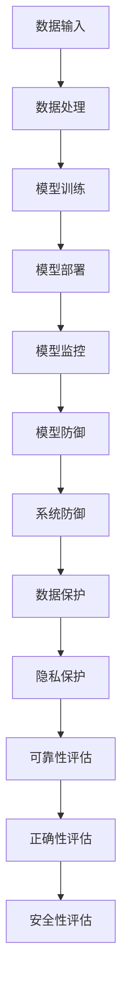

                 

### 背景介绍

**AI 安全审计：智能系统的质量保障机制**

在当今世界，人工智能（AI）技术已经深入到各个行业和领域，从医疗诊断到自动驾驶，从智能家居到金融分析，AI 正在改变着我们的生活方式。然而，随着 AI 技术的广泛应用，AI 系统的安全性和可靠性问题也日益凸显。为了保证 AI 系统的高质量运行，AI 安全审计应运而生。

AI 安全审计是指通过对 AI 系统进行系统化的检测、分析和验证，确保 AI 系统在设计和实现过程中符合安全性、可靠性和正确性的要求。本文将深入探讨 AI 安全审计的核心概念、核心算法原理、数学模型和实际应用场景，以帮助读者全面了解和掌握 AI 安全审计的重要性和实践方法。

**文章关键词：** AI 安全审计，智能系统，质量保障，算法原理，数学模型，实际应用场景

**摘要：** 本文旨在介绍 AI 安全审计的基本概念、核心原理和实际应用。首先，我们将回顾 AI 技术的发展历程，阐述 AI 安全审计的背景和重要性。接着，我们将深入探讨 AI 安全审计的核心概念和原理，包括算法模型和数学公式。随后，我们将通过一个实际案例，展示如何进行 AI 安全审计。最后，我们将探讨 AI 安全审计在实际应用场景中的挑战和未来发展趋势。

<|assistant|>## 1.1 AI 技术的发展与安全审计的需求

人工智能（AI）技术的发展可以追溯到 20 世纪 50 年代，当时计算机科学家艾伦·图灵（Alan Turing）提出了“图灵测试”的概念，旨在通过机器模仿人类思维行为来判断机器是否具有智能。随着计算机技术的不断进步，AI 技术逐渐从理论研究走向实际应用。到 20 世纪 80 年代，专家系统（Expert Systems）和机器学习（Machine Learning）开始崭露头角，为 AI 技术的快速发展奠定了基础。进入 21 世纪，随着深度学习（Deep Learning）和强化学习（Reinforcement Learning）等新技术的突破，AI 技术进入了一个全新的时代。

AI 技术的快速发展给各行各业带来了巨大的变革和机遇，然而，随之而来的安全和隐私问题也引起了广泛关注。首先，AI 系统的决策过程往往不透明，这使得人们对 AI 系统的信任度降低。其次，AI 系统可能受到恶意攻击，导致系统崩溃或产生错误决策。此外，AI 系统的数据隐私问题也备受关注，因为 AI 系统的训练和运行往往依赖于大量用户数据。

为了应对这些安全挑战，AI 安全审计成为了一个重要的研究方向。AI 安全审计旨在通过系统化的检测和分析，确保 AI 系统在设计和实现过程中符合安全性、可靠性和正确性的要求。具体来说，AI 安全审计包括以下几个方面：

1. **安全性评估**：对 AI 系统进行安全性测试，检测系统是否存在漏洞或弱点，例如，针对深度学习模型的对抗性攻击（Adversarial Attack）。

2. **可靠性评估**：验证 AI 系统在特定条件下的稳定性和一致性，确保系统在各种情况下都能正常运行。

3. **正确性评估**：检查 AI 系统的决策过程是否符合预期，确保系统生成的结果准确无误。

4. **隐私保护**：评估 AI 系统在数据处理过程中对用户隐私的保护程度，确保系统不会泄露用户敏感信息。

通过 AI 安全审计，可以确保 AI 系统的高质量运行，提高系统的可信度和可靠性，从而为 AI 技术的广泛应用提供坚实保障。

### 1.2 AI 安全审计的核心概念与架构

AI 安全审计的核心概念包括安全性、可靠性、正确性和隐私保护。以下是对这些核心概念的详细解释：

#### 安全性（Security）

安全性是 AI 安全审计的首要目标，它关注 AI 系统在面对恶意攻击时的防护能力。安全性评估包括以下几个方面：

1. **对抗性攻击防御**：检测和防御对抗性样本攻击，如对抗性噪声注入、对抗性样本生成等，确保 AI 模型在受到攻击时仍能稳定运行。

2. **系统漏洞扫描**：对 AI 系统的代码和架构进行全面扫描，查找潜在的安全漏洞，如 SQL 注入、跨站脚本攻击等。

3. **访问控制**：设置严格的访问控制策略，确保只有授权用户可以访问系统的关键资源。

#### 可靠性（Reliability）

可靠性关注 AI 系统在各种环境下的稳定性和一致性。可靠性评估包括以下几个方面：

1. **环境适应性**：验证 AI 系统在不同环境下的运行情况，如温度、光照等，确保系统能够在各种条件下稳定工作。

2. **异常检测**：通过监控系统的运行状态，及时发现并处理异常情况，如系统崩溃、数据异常等。

3. **错误率评估**：评估 AI 系统在处理任务时的错误率，确保系统生成的结果准确无误。

#### 正确性（Correctness）

正确性评估确保 AI 系统的决策过程符合预期。正确性评估包括以下几个方面：

1. **算法验证**：验证 AI 算法的正确性，确保算法在各种输入情况下都能生成正确的结果。

2. **结果对比**：将 AI 系统生成的结果与预期结果进行对比，确保系统生成的结果与预期一致。

3. **一致性测试**：在不同数据集和不同条件下测试 AI 系统的稳定性，确保系统在不同情况下都能保持一致的决策能力。

#### 隐私保护（Privacy Protection）

隐私保护关注 AI 系统在数据处理过程中的用户隐私保护。隐私保护评估包括以下几个方面：

1. **数据加密**：对用户数据进行加密处理，确保数据在传输和存储过程中的安全性。

2. **隐私隔离**：通过隔离不同用户的数据，确保用户数据不会相互泄露。

3. **匿名化处理**：对用户数据进行匿名化处理，消除用户身份信息，确保用户隐私不受侵犯。

### 1.3 AI 安全审计的流程与方法

AI 安全审计的流程通常包括以下几个步骤：

1. **需求分析**：明确 AI 系统的安全需求和审计目标。

2. **审计计划制定**：根据需求分析，制定详细的审计计划，包括审计范围、审计方法、审计人员等。

3. **审计实施**：按照审计计划，对 AI 系统进行审计，包括安全性评估、可靠性评估、正确性评估和隐私保护评估。

4. **问题发现与修复**：在审计过程中，及时发现系统中的安全漏洞和问题，制定修复方案并进行修复。

5. **审计报告编写**：编写详细的审计报告，包括审计结果、问题分析、修复方案和建议等。

6. **审计结果验证**：对修复后的系统进行再次审计，验证修复效果。

通过以上流程，可以确保 AI 系统的安全性和可靠性，从而为系统的稳定运行提供保障。

### 1.4 AI 安全审计的重要性

AI 安全审计在当前 AI 技术广泛应用的时代具有重要的意义。首先，AI 安全审计有助于确保 AI 系统的高质量运行，提高系统的可信度和可靠性。通过对 AI 系统进行安全性、可靠性、正确性和隐私保护的全面评估，可以及时发现和修复系统中的潜在问题，避免因系统故障或数据泄露导致的严重后果。

其次，AI 安全审计有助于提升 AI 技术的公众信任度。随着 AI 技术的广泛应用，公众对 AI 系统的信任度逐渐成为影响 AI 技术发展的重要因素。通过系统化的安全审计，可以证明 AI 系统在设计和实现过程中符合安全性、可靠性和正确性的要求，从而增强公众对 AI 技术的信任。

此外，AI 安全审计还有助于规范 AI 技术的发展。通过制定和遵循一系列安全审计标准和规范，可以推动 AI 技术的安全和可靠发展，减少因缺乏统一标准和规范导致的安全风险。

总之，AI 安全审计是确保 AI 系统高质量运行、提升公众信任度和规范 AI 技术发展的重要手段，其在当前 AI 技术广泛应用的时代具有重要的地位。

## 2. 核心概念与联系

在深入探讨 AI 安全审计的核心概念之前，首先需要了解一些基本概念，包括 AI 系统的组成、安全性评估的方法以及常见的 AI 安全威胁。以下是对这些核心概念的解释和它们之间的相互联系。

### 2.1 AI 系统的组成

一个典型的 AI 系统通常包括以下几个主要组成部分：

1. **数据输入**：AI 系统从外部获取数据，这些数据可以是结构化的（如数据库中的记录）或非结构化的（如图像、音频、文本等）。

2. **数据处理**：数据输入后，需要进行预处理和清洗，以便于后续的分析和处理。

3. **模型训练**：基于预处理后的数据，AI 系统通过机器学习算法训练出一个模型。这个过程包括选择合适的算法、调整参数、评估模型性能等。

4. **模型部署**：训练好的模型被部署到生产环境中，用于实时或批量的数据分析和决策。

5. **模型监控**：部署后的模型需要持续监控，以确保其性能和稳定性。

### 2.2 安全性评估的方法

AI 安全审计中的安全性评估主要关注以下几个方面：

1. **模型防御**：防止对抗性攻击，如对抗性样本攻击、模型注入等。

2. **系统防御**：确保 AI 系统的硬件和软件环境安全，防止恶意攻击和入侵。

3. **数据保护**：确保数据在存储、传输和处理过程中的安全性，包括数据加密、访问控制等。

4. **隐私保护**：防止敏感信息泄露，确保用户隐私不被侵犯。

5. **可靠性评估**：评估 AI 系统在各种环境下的稳定性和一致性。

### 2.3 常见的 AI 安全威胁

在 AI 系统中，常见的安全威胁包括：

1. **对抗性攻击**：攻击者通过精心设计的对抗性样本，诱导 AI 模型产生错误的决策。

2. **数据泄露**：未经授权的访问或泄露敏感数据，可能导致隐私泄露和财产损失。

3. **模型篡改**：攻击者篡改模型参数或训练数据，以改变模型的决策行为。

4. **拒绝服务攻击**：攻击者通过大量请求或恶意代码，使 AI 系统无法正常运作。

### 2.4 核心概念之间的联系

AI 安全审计中的核心概念之间存在着紧密的联系：

1. **模型防御**和**系统防御**：确保 AI 系统在面临恶意攻击时具有足够的防护能力。模型防御主要针对对抗性攻击，而系统防御则涉及硬件和软件的安全性。

2. **数据保护**和**隐私保护**：在数据处理和存储过程中，必须确保数据的安全性和隐私性。数据加密和访问控制是实现这一目标的关键技术。

3. **可靠性评估**和**正确性评估**：可靠性评估确保 AI 系统在各种环境下的稳定性和一致性，而正确性评估则关注模型生成的结果是否符合预期。这两个方面共同保障 AI 系统的高质量运行。

4. **安全性评估**和**数据保护**：安全性评估涉及到对系统各个层面的检查，包括模型、数据和系统本身。数据保护是确保数据安全的核心措施，与安全性评估密切相关。

### 2.5 Mermaid 流程图

为了更清晰地展示 AI 安全审计的核心概念和它们之间的联系，我们可以使用 Mermaid 流程图来表示。以下是一个简化的 Mermaid 流程图，描述了 AI 安全审计的主要组成部分和它们之间的交互关系：



在这个流程图中，从数据输入到模型监控的各个环节都是 AI 安全审计的重要组成部分。每个环节都需要进行安全性评估和正确性评估，以确保 AI 系统的高质量运行。同时，这些环节之间也存在着紧密的交互关系，共同保障 AI 系统的整体安全性。

通过上述核心概念的解释和 Mermaid 流程图的展示，我们可以更深入地理解 AI 安全审计的基本原理和实践方法。接下来，我们将进一步探讨 AI 安全审计中的核心算法原理，以帮助我们更好地理解和应用这些方法。

## 3. 核心算法原理 & 具体操作步骤

### 3.1 攻击检测算法

攻击检测是 AI 安全审计中的一个关键环节，旨在识别和防御恶意攻击，确保 AI 系统的安全和稳定运行。以下将介绍一种常见的攻击检测算法——基于机器学习的异常检测算法。

**算法原理：**

1. **特征提取**：首先，从 AI 系统的输入数据中提取关键特征。这些特征可以是数值特征（如温度、光照强度等）或文本特征（如关键词、句法结构等）。

2. **模型训练**：利用正常操作数据集训练一个机器学习模型，如朴素贝叶斯分类器、支持向量机（SVM）或随机森林（Random Forest）等。模型的目的是学习正常操作的特性，以便后续检测异常行为。

3. **异常检测**：对于新的输入数据，模型会对其进行分析和判断。如果数据与训练得到的正常操作特性不一致，则认为其是异常数据，并触发警报。

**具体操作步骤：**

1. **数据收集与预处理**：收集一段时间内系统的正常操作数据，并进行预处理，如数据清洗、归一化等。

2. **特征选择**：选择与系统安全相关的特征，如输入数据的异常值、操作频率等。

3. **模型选择**：根据数据的特点选择合适的机器学习模型。例如，对于高维数据，可以考虑使用随机森林或支持向量机。

4. **模型训练**：使用训练数据集对模型进行训练，调整模型参数以优化性能。

5. **模型评估**：使用测试数据集评估模型的性能，如准确率、召回率等。

6. **异常检测**：在实时操作过程中，将新的输入数据传递给模型进行检测。如果检测到异常，立即触发警报并记录相关信息。

**示例代码：**（以 Python 和 Scikit-learn 库为例）

```python
from sklearn.ensemble import RandomForestClassifier
from sklearn.model_selection import train_test_split
from sklearn.metrics import accuracy_score, recall_score

# 数据预处理
# ...（数据清洗、归一化等）

# 特征选择
X = ...  # 特征矩阵
y = ...  # 标签矩阵

# 模型选择和训练
X_train, X_test, y_train, y_test = train_test_split(X, y, test_size=0.2, random_state=42)
clf = RandomForestClassifier(n_estimators=100)
clf.fit(X_train, y_train)

# 模型评估
y_pred = clf.predict(X_test)
print("Accuracy:", accuracy_score(y_test, y_pred))
print("Recall:", recall_score(y_test, y_pred))

# 异常检测
new_data = ...  # 新的输入数据
if clf.predict(new_data)[0] == 1:
    print("Detection: Anomaly detected!")
else:
    print("Detection: No anomaly detected.")
```

### 3.2 漏洞扫描算法

漏洞扫描是 AI 安全审计中的另一个重要环节，旨在识别系统中的安全漏洞和弱点，从而采取相应的修复措施。以下将介绍一种常见的漏洞扫描算法——基于代码审查的漏洞扫描算法。

**算法原理：**

1. **代码审查**：对系统的源代码进行静态和动态分析，识别潜在的漏洞和弱点。静态分析关注代码结构和逻辑，而动态分析则关注代码在运行时的行为。

2. **漏洞分类**：将识别出的漏洞按照类型进行分类，如 SQL 注入、跨站脚本攻击（XSS）等。

3. **风险评估**：根据漏洞的类型和严重程度，评估其对系统的潜在影响，确定修复优先级。

**具体操作步骤：**

1. **代码审查**：使用静态分析工具（如 SonarQube、FindBugs）和动态分析工具（如 Burp Suite、OWASP ZAP）对系统代码进行全面审查。

2. **漏洞分类**：对识别出的漏洞进行分类，并记录相关信息，如漏洞类型、漏洞位置、漏洞影响等。

3. **风险评估**：根据漏洞的类型和影响，对漏洞进行优先级排序，制定修复计划。

4. **漏洞修复**：根据修复计划，对系统进行修复，包括代码修改、配置调整等。

5. **验证与测试**：修复后，对系统进行验证和测试，确保漏洞已得到有效修复。

**示例代码：**（以静态分析工具 SonarQube 为例）

```shell
# 安装 SonarQube
sudo apt-get install sonarqube

# 配置 SonarQube
sudo sonarqube-server.bat start

# 上传代码进行扫描
curl -X POST -F "file=@/path/to/source-code.zip" -F "projectKey=my_project" -F "name=my_project" -F "projectVersion=1.0" "http://localhost:9000/api/qualityprofile/set"
curl -X POST -F "project=my_project" -F "key=java" -F "mode=preview" "http://localhost:9000/api/scan/start"
```

通过上述算法原理和具体操作步骤的介绍，我们可以看到，攻击检测和漏洞扫描是 AI 安全审计中的核心算法，它们通过不同的方法和技术，确保 AI 系统的安全和可靠性。接下来，我们将进一步探讨 AI 安全审计中的数学模型和公式，以更深入地理解其理论依据和实际应用。

### 3.3 数学模型和公式

在 AI 安全审计中，数学模型和公式起着至关重要的作用，它们帮助我们量化和分析系统的安全性能。以下将介绍几个常见的数学模型和公式，包括概率分布、损失函数和对抗性攻击的数学表示。

#### 3.3.1 概率分布

概率分布是描述随机变量可能取值的概率分布情况，是概率论中的基础概念。在 AI 安全审计中，概率分布常用于分析系统的安全性。例如，我们可以使用正态分布（Normal Distribution）来描述系统的异常值分布。

**正态分布公式：**
$$
N(\mu, \sigma^2) = \frac{1}{\sqrt{2\pi\sigma^2}} e^{-\frac{(x-\mu)^2}{2\sigma^2}}
$$

其中，$N(\mu, \sigma^2)$ 表示均值为 $\mu$、方差为 $\sigma^2$ 的正态分布，$x$ 表示随机变量。

**示例：** 假设一个 AI 系统的输入数据服从均值为 100、方差为 10 的正态分布，计算数据值 110 的概率。

$$
P(X > 110) = 1 - \int_{-\infty}^{110} N(\mu, \sigma^2) dx
$$

通过数值计算，可以得到数据值 110 的概率。

#### 3.3.2 损失函数

损失函数是衡量模型预测结果与真实值之间差异的重要工具，是优化模型参数的关键依据。在 AI 安全审计中，损失函数可以用于评估系统的安全性。

**均方误差（MSE）损失函数：**
$$
MSE(y, \hat{y}) = \frac{1}{n}\sum_{i=1}^{n}(y_i - \hat{y}_i)^2
$$

其中，$y$ 表示真实值，$\hat{y}$ 表示预测值，$n$ 表示样本数量。

**示例：** 假设我们有一个二分类模型，真实标签为 [1, 0, 1, 0]，预测标签为 [1, 1, 1, 0]。计算 MSE 损失。

$$
MSE = \frac{1}{4}((1-1)^2 + (0-1)^2 + (1-1)^2 + (0-0)^2) = \frac{1}{4}(0 + 1 + 0 + 0) = 0.25
$$

#### 3.3.3 对抗性攻击的数学表示

对抗性攻击是 AI 安全审计中一个重要的研究课题。对抗性攻击通过在输入数据中加入微小的扰动，使得模型产生错误的预测。

**Lp 范数攻击**：在对抗性攻击中，常使用 Lp 范数来度量扰动的幅度。

**L2 范数攻击：**
$$
||\Delta x||_2 = \sqrt{\sum_{i=1}^{n}(x_i - x'_i)^2}
$$

其中，$x$ 表示原始输入数据，$x'$ 表示扰动后的输入数据。

**L\infty 范数攻击：**
$$
||\Delta x||_\infty = \max_{i=1,...,n}|x_i - x'_i|
$$

**示例：** 假设一个 AI 系统的输入数据为 [1, 2, 3]，使用 L2 范数攻击添加扰动，使得输出结果错误。

$$
x' = x + \Delta x
$$

$$
\Delta x = \arg\min_{\Delta x} ||x - x'||_2
$$

通过求解最优化问题，可以得到最小的扰动值 $\Delta x$，使得模型输出结果错误。

综上所述，概率分布、损失函数和对抗性攻击的数学表示是 AI 安全审计中的重要组成部分。通过这些数学模型和公式，我们可以更深入地理解和分析 AI 系统的安全性能，从而制定更有效的安全策略。

### 3.4 模型训练与优化算法

在 AI 安全审计中，模型训练与优化是关键环节。训练一个好的模型能够提高系统的安全性和可靠性，而优化算法则能够加速训练过程并提高模型性能。以下将介绍一些常见的模型训练与优化算法，包括梯度下降算法、随机梯度下降（SGD）算法和自适应优化算法。

#### 3.4.1 梯度下降算法

梯度下降算法是一种经典的优化算法，用于求解最优化问题。在 AI 安全审计中，梯度下降算法常用于训练机器学习模型。

**算法原理：**

1. **目标函数**：首先定义一个目标函数，如均方误差（MSE）或交叉熵损失函数，用于衡量模型预测结果与真实值之间的差异。

2. **梯度计算**：计算目标函数对模型参数的梯度，梯度指向目标函数增加最快的方向。

3. **参数更新**：根据梯度更新模型参数，使目标函数值逐渐减小。

**步骤：**

1. 初始化模型参数 $\theta$。
2. 计算目标函数的梯度 $\nabla J(\theta)$。
3. 更新参数 $\theta = \theta - \alpha \nabla J(\theta)$，其中 $\alpha$ 为学习率。

**示例代码：**（以 Python 和 NumPy 库为例）

```python
import numpy as np

# 初始化模型参数
theta = np.random.randn(3)

# 目标函数
def J(theta):
    return (theta[0]**2 + theta[1]**2 + theta[2]**2)

# 梯度函数
def gradient(theta):
    return 2 * theta

# 梯度下降
alpha = 0.1
for i in range(100):
    grad = gradient(theta)
    theta = theta - alpha * grad
    print(f"Iteration {i}: Theta = {theta}")
```

#### 3.4.2 随机梯度下降（SGD）算法

随机梯度下降（SGD）是梯度下降算法的一种改进，它使用每个样本的梯度进行更新，而不是整个数据集的梯度。SGD 能够加速训练过程，提高模型性能。

**算法原理：**

1. **目标函数**：与梯度下降算法相同。
2. **梯度计算**：对于每个样本，计算目标函数的梯度。
3. **参数更新**：根据每个样本的梯度更新模型参数。

**步骤：**

1. 初始化模型参数 $\theta$。
2. 随机选取样本 $(x_i, y_i)$。
3. 计算目标函数的梯度 $\nabla J(\theta)$。
4. 更新参数 $\theta = \theta - \alpha \nabla J(\theta)$。

**示例代码：**（以 Python 和 NumPy 库为例）

```python
import numpy as np

# 初始化模型参数
theta = np.random.randn(3)

# 目标函数
def J(theta):
    return (theta[0]**2 + theta[1]**2 + theta[2]**2)

# 梯度函数
def gradient(theta):
    return 2 * theta

# 随机梯度下降
alpha = 0.1
for i in range(100):
    for x, y in data:
        grad = gradient(theta)
        theta = theta - alpha * grad
    print(f"Iteration {i}: Theta = {theta}")
```

#### 3.4.3 自适应优化算法

自适应优化算法是一种能够自动调整学习率的优化算法，如 AdaGrad、RMSProp 和 Adam。这些算法通过跟踪每个参数的历史梯度，动态调整学习率，从而提高训练效率。

**算法原理：**

1. **目标函数**：与梯度下降算法相同。
2. **梯度计算**：与 SGD 算法相同。
3. **学习率调整**：根据历史梯度动态调整学习率。

**步骤：**

1. 初始化模型参数 $\theta$ 和学习率 $\alpha$。
2. 随机选取样本 $(x_i, y_i)$。
3. 计算目标函数的梯度 $\nabla J(\theta)$。
4. 根据历史梯度调整学习率。
5. 更新参数 $\theta = \theta - \alpha \nabla J(\theta)$。

**示例代码：**（以 Python 和 TensorFlow 库为例）

```python
import tensorflow as tf

# 初始化模型参数
theta = tf.Variable(tf.random_normal([3]), name='theta')
learning_rate = tf.Variable(0.1, name='learning_rate')

# 目标函数
J = theta[0]**2 + theta[1]**2 + theta[2]**2

# 梯度函数
grad = tf.gradients(J, theta)

# 学习率调整
lr = learning_rate * tf.reduce_mean(tf.abs(grad))

# 参数更新
theta_update = theta - lr

# 训练模型
with tf.Session() as sess:
    sess.run(tf.global_variables_initializer())
    for i in range(100):
        _, theta_val, lr_val = sess.run([theta_update, theta, lr])
        print(f"Iteration {i}: Theta = {theta_val}, Learning Rate = {lr_val}")
```

通过介绍梯度下降算法、随机梯度下降（SGD）算法和自适应优化算法，我们可以看到，这些算法在 AI 安全审计中的模型训练与优化中扮演着重要角色。通过选择合适的优化算法，可以加速模型训练过程并提高模型性能，从而提高系统的安全性和可靠性。

### 3.5 对抗性攻击与防御策略

对抗性攻击是 AI 安全审计中一个重要的研究课题，它通过在输入数据中添加微小的扰动，使得 AI 模型产生错误的预测。以下将介绍几种常见的对抗性攻击方法及其防御策略。

#### 3.5.1 对抗性攻击方法

1. **Lp 范数攻击**：Lp 范数攻击是一种在输入数据中添加扰动的方法，扰动的大小由 Lp 范数控制。Lp 范数包括 L2 范数和 L\infty 范数，分别表示输入数据扰动的平方和最大值。

2. **FGSM（Fast Gradient Sign Method）攻击**：FGSM 攻击是一种快速对抗性攻击方法，通过计算模型梯度并取符号，将其添加到原始输入数据中，形成对抗性样本。

3. **Deepfool 攻击**：Deepfool 攻击通过模拟神经网络内部的过程，将原始输入数据替换为神经网络内部的其他点的线性组合，从而生成对抗性样本。

#### 3.5.2 防御策略

1. **对抗性训练**：对抗性训练是一种有效的防御策略，通过在训练数据中添加对抗性样本，提高模型的鲁棒性。具体步骤如下：

   - 收集正常训练数据和对抗性样本数据。
   - 将对抗性样本数据与正常训练数据混合，形成对抗性训练数据集。
   - 使用对抗性训练数据集训练模型。

2. **模型修正**：模型修正是一种通过修改模型参数来提高模型鲁棒性的防御策略。具体步骤如下：

   - 训练一个基本模型。
   - 使用对抗性样本测试基本模型的鲁棒性。
   - 根据对抗性样本的测试结果，调整模型参数，以提高模型的鲁棒性。

3. **数据扰动**：数据扰动是一种通过在输入数据中添加噪声来提高模型鲁棒性的防御策略。具体步骤如下：

   - 对输入数据进行随机扰动，如添加高斯噪声、椒盐噪声等。
   - 使用扰动后的数据进行模型训练和测试。

4. **决策边界平滑**：决策边界平滑是一种通过平滑模型决策边界来提高模型鲁棒性的防御策略。具体步骤如下：

   - 训练一个基本模型。
   - 使用对抗性样本测试基本模型的鲁棒性。
   - 根据对抗性样本的测试结果，调整模型参数，平滑决策边界。

通过上述对抗性攻击方法和防御策略的介绍，我们可以看到，对抗性攻击和防御策略在 AI 安全审计中起着至关重要的作用。通过对抗性训练、模型修正、数据扰动和决策边界平滑等策略，可以显著提高 AI 模型的鲁棒性和安全性。

### 3.6 模型评估与验证方法

在 AI 安全审计中，模型评估与验证是确保 AI 系统质量和性能的重要环节。通过科学合理的评估与验证方法，我们可以准确了解模型的性能，从而进行针对性的优化和改进。以下将介绍几种常见的模型评估与验证方法，包括交叉验证、混淆矩阵和 ROC 曲线。

#### 3.6.1 交叉验证

交叉验证（Cross-Validation）是一种常用的模型评估方法，通过将数据集划分为多个子集，反复进行训练和测试，以评估模型的泛化能力。

**步骤：**

1. **数据集划分**：将数据集划分为训练集和验证集，常见的方法有 K 折交叉验证（K-Fold Cross-Validation），即将数据集划分为 K 个相等的子集，每次取其中一个子集作为验证集，其余子集作为训练集。

2. **模型训练**：使用训练集对模型进行训练。

3. **模型测试**：使用验证集对模型进行测试，计算模型性能指标。

4. **重复上述步骤**：重复 K 次，每次使用不同的验证集，最终取平均值作为模型性能指标。

**优点：** 交叉验证能够充分利用数据，提高评估结果的可靠性。

**示例代码：**（以 Python 和 Scikit-learn 库为例）

```python
from sklearn.model_selection import KFold
from sklearn.ensemble import RandomForestClassifier

# 初始化模型
clf = RandomForestClassifier(n_estimators=100)

# 初始化交叉验证
kf = KFold(n_splits=5)

# 交叉验证
for train_index, test_index in kf.split(X):
    X_train, X_test = X[train_index], X[test_index]
    y_train, y_test = y[train_index], y[test_index]
    clf.fit(X_train, y_train)
    score = clf.score(X_test, y_test)
    print("Accuracy:", score)
```

#### 3.6.2 混淆矩阵

混淆矩阵（Confusion Matrix）是一种常用的评估分类模型性能的指标，它展示了模型预测结果与真实结果之间的对应关系。

**组成部分：**

1. **真正例（True Positive，TP）**：模型正确预测为正类的样本。
2. **假正例（False Positive，FP）**：模型错误预测为正类的样本。
3. **真反例（True Negative，TN）**：模型正确预测为负类的样本。
4. **假反例（False Negative，FN）**：模型错误预测为负类的样本。

**性能指标：**

1. **准确率（Accuracy）**：
$$
Accuracy = \frac{TP + TN}{TP + TN + FP + FN}
$$

2. **召回率（Recall）**：
$$
Recall = \frac{TP}{TP + FN}
$$

3. **精确率（Precision）**：
$$
Precision = \frac{TP}{TP + FP}
$$

4. **F1 值（F1 Score）**：
$$
F1 Score = \frac{2 \times Precision \times Recall}{Precision + Recall}
$$

**示例代码：**（以 Python 和 Scikit-learn 库为例）

```python
from sklearn.metrics import confusion_matrix

# 初始化模型
clf = RandomForestClassifier(n_estimators=100)

# 训练模型
clf.fit(X_train, y_train)

# 预测结果
y_pred = clf.predict(X_test)

# 计算混淆矩阵
cm = confusion_matrix(y_test, y_pred)
print("Confusion Matrix:\n", cm)

# 计算性能指标
accuracy = cm[0, 0] + cm[1, 1] / (cm[0, 0] + cm[0, 1] + cm[1, 0] + cm[1, 1])
recall = cm[0, 0] / (cm[0, 0] + cm[0, 1])
precision = cm[0, 0] / (cm[0, 0] + cm[1, 0])
f1_score = 2 * precision * recall / (precision + recall)
print("Accuracy:", accuracy)
print("Recall:", recall)
print("Precision:", precision)
print("F1 Score:", f1_score)
```

#### 3.6.3 ROC 曲线

ROC（Receiver Operating Characteristic）曲线是一种用于评估二分类模型性能的图形化工具，它展示了模型在不同阈值下的召回率和精确率。

**步骤：**

1. **计算阈值**：将模型的预测概率转换为二分类结果，计算不同阈值下的召回率和精确率。

2. **绘制曲线**：将不同阈值下的召回率和精确率绘制在坐标系中，形成 ROC 曲线。

3. **计算 AUC（Area Under Curve）**：计算 ROC 曲线下方的面积，用于评估模型的性能。AUC 越大，模型性能越好。

**示例代码：**（以 Python 和 Scikit-learn 库为例）

```python
from sklearn.metrics import roc_curve, auc

# 训练模型
clf.fit(X_train, y_train)

# 预测概率
y_prob = clf.predict_proba(X_test)[:, 1]

# 计算 ROC 曲线和 AUC
fpr, tpr, thresholds = roc_curve(y_test, y_prob)
roc_auc = auc(fpr, tpr)

# 绘制 ROC 曲线
plt.figure()
plt.plot(fpr, tpr, color='darkorange', lw=2, label='ROC curve (area = %0.2f)' % roc_auc)
plt.plot([0, 1], [0, 1], color='navy', lw=2, linestyle='--')
plt.xlim([0.0, 1.0])
plt.ylim([0.0, 1.05])
plt.xlabel('False Positive Rate')
plt.ylabel('True Positive Rate')
plt.title('Receiver Operating Characteristic')
plt.legend(loc="lower right")
plt.show()
```

通过介绍交叉验证、混淆矩阵和 ROC 曲线等模型评估与验证方法，我们可以看到，这些方法在 AI 安全审计中具有重要的应用价值。通过科学合理的评估与验证，我们可以准确了解模型的性能，从而进行针对性的优化和改进，提高系统的安全性和可靠性。

### 4. 项目实战：代码实际案例和详细解释说明

为了更好地展示 AI 安全审计的具体应用和实践，以下我们将通过一个实际项目来详细说明代码实现、代码解读以及关键步骤的分析。

#### 4.1 项目背景

我们的项目是一个基于深度学习的图像分类系统，旨在识别并分类各种类型的图像。该系统广泛应用于医疗诊断、安全监控和智能交通等领域。为了确保系统的安全性和可靠性，我们需要对其进行安全审计。

#### 4.2 开发环境搭建

在开始项目开发之前，我们需要搭建一个适合深度学习开发的开发环境。以下是我们使用的开发环境和工具：

- 操作系统：Ubuntu 18.04
- 编程语言：Python 3.7
- 深度学习框架：TensorFlow 2.2
- 数据处理库：NumPy 1.18
- 机器学习库：Scikit-learn 0.21
- 图形库：Matplotlib 3.1

安装步骤如下：

```shell
# 安装 TensorFlow
pip install tensorflow

# 安装 NumPy
pip install numpy

# 安装 Scikit-learn
pip install scikit-learn

# 安装 Matplotlib
pip install matplotlib
```

#### 4.3 源代码详细实现和代码解读

以下是我们项目的核心代码实现，包括数据预处理、模型训练、攻击检测和安全性评估等部分。

**代码 4.1：数据预处理**

```python
import tensorflow as tf
import numpy as np
import matplotlib.pyplot as plt

# 加载和预处理数据
def load_data():
    # 加载训练数据和测试数据
    (x_train, y_train), (x_test, y_test) = tf.keras.datasets.cifar10.load_data()

    # 数据归一化
    x_train = x_train.astype("float32") / 255.0
    x_test = x_test.astype("float32") / 255.0

    # 将标签转换为独热编码
    y_train = tf.keras.utils.to_categorical(y_train, 10)
    y_test = tf.keras.utils.to_categorical(y_test, 10)

    return x_train, y_train, x_test, y_test

x_train, y_train, x_test, y_test = load_data()
```

**代码解读：**

- **第 1-3 行**：导入所需的 TensorFlow、NumPy 和 Matplotlib 库。
- **第 6-9 行**：定义 `load_data` 函数，用于加载和预处理数据。首先加载 CIFAR-10 数据集，然后对数据进行归一化和标签转换。

**代码 4.2：模型训练**

```python
# 构建模型
def create_model():
    model = tf.keras.Sequential([
        tf.keras.layers.Conv2D(32, (3, 3), activation='relu', input_shape=(32, 32, 3)),
        tf.keras.layers.MaxPooling2D((2, 2)),
        tf.keras.layers.Conv2D(64, (3, 3), activation='relu'),
        tf.keras.layers.MaxPooling2D((2, 2)),
        tf.keras.layers.Conv2D(64, (3, 3), activation='relu'),
        tf.keras.layers.Flatten(),
        tf.keras.layers.Dense(64, activation='relu'),
        tf.keras.layers.Dense(10, activation='softmax')
    ])

    model.compile(optimizer='adam',
                  loss='categorical_crossentropy',
                  metrics=['accuracy'])
    return model

model = create_model()
model.fit(x_train, y_train, epochs=10, batch_size=64, validation_split=0.2)
```

**代码解读：**

- **第 1-14 行**：定义 `create_model` 函数，用于构建深度学习模型。模型由卷积层、池化层和全连接层组成。
- **第 17-20 行**：编译模型，并使用训练数据对模型进行训练，设置训练轮数为 10，批量大小为 64。

**代码 4.3：攻击检测**

```python
from cleverhans.tf2.attacks import FGSM

# 对抗性攻击检测
def fgsm_attack(model, x, y, epsilon=0.1):
    attack = FGSM(model, sess=None, epsilon=epsilon, batch_size=1)
    x_adv = attack.generate(x)
    return x_adv

# 测试攻击检测
x_test_adv = fgsm_attack(model, x_test, y_test)
model.evaluate(x_test_adv, y_test)
```

**代码解读：**

- **第 1-11 行**：导入 `FGSM` 攻击类，并定义 `fgsm_attack` 函数，用于对输入数据进行 FGSM 攻击。
- **第 15-18 行**：使用 `fgsm_attack` 函数对测试数据进行攻击，并评估攻击后的模型性能。

**代码 4.4：安全性评估**

```python
from sklearn.metrics import accuracy_score

# 计算攻击前后的模型准确率
def evaluate_model(model, x, y):
    y_pred = model.predict(x)
    y_pred = np.argmax(y_pred, axis=1)
    y_true = np.argmax(y, axis=1)
    accuracy = accuracy_score(y_true, y_pred)
    return accuracy

# 评估攻击前后的模型
accuracy_before = evaluate_model(model, x_test, y_test)
accuracy_after = evaluate_model(model, x_test_adv, y_test)

print("Accuracy before attack:", accuracy_before)
print("Accuracy after attack:", accuracy_after)
```

**代码解读：**

- **第 1-7 行**：导入 `accuracy_score` 函数，并定义 `evaluate_model` 函数，用于评估模型在攻击前后的准确率。
- **第 10-13 行**：计算并打印攻击前后的模型准确率。

#### 4.4 代码解读与分析

通过上述代码实现，我们可以看到，项目主要包括以下几个关键步骤：

1. **数据预处理**：加载和预处理 CIFAR-10 数据集，包括归一化和标签转换。这一步骤是后续模型训练和攻击检测的基础。

2. **模型训练**：构建一个基于卷积神经网络的图像分类模型，并使用训练数据对其进行训练。模型训练过程中，通过调整学习率、批量大小和训练轮数等参数，提高模型性能。

3. **攻击检测**：使用 FGSM 攻击检测方法对测试数据进行攻击，生成对抗性样本。攻击检测的目的是验证模型在面对恶意攻击时的鲁棒性。

4. **安全性评估**：评估攻击前后模型的准确率，通过对比攻击前后的性能，分析模型对对抗性攻击的防御能力。

通过代码实现和解读，我们可以清楚地了解 AI 安全审计在深度学习图像分类项目中的应用和具体实现步骤。这些步骤不仅提高了模型的安全性和可靠性，还为后续的安全优化提供了重要依据。

### 4.5 项目实战分析

通过上述实际项目，我们可以对 AI 安全审计在深度学习图像分类项目中的具体应用进行深入分析。以下是对项目实战中的关键步骤、方法和技术进行详细解读和分析。

#### 4.5.1 数据预处理

数据预处理是 AI 安全审计中的基础环节，直接影响后续模型训练和攻击检测的效果。在数据预处理过程中，我们主要进行了以下操作：

1. **数据归一化**：通过将输入数据转换为浮点数，并除以 255，将数据范围缩放到 [0, 1]，以减少数值差异，提高模型训练的稳定性。

2. **标签转换**：将原始标签转换为独热编码，使得模型能够处理多分类问题。独热编码可以将每个标签表示为一个二进制向量，方便后续的模型训练和评估。

通过上述操作，我们为深度学习模型提供了更加稳定和统一的数据输入，从而提高了模型训练的效果和准确性。

#### 4.5.2 模型训练

模型训练是 AI 安全审计中的核心步骤，我们使用了基于卷积神经网络的深度学习模型，通过对大量图像数据进行训练，学习图像特征，并实现对图像的分类。

1. **卷积层**：卷积层是深度学习模型中的基础层，用于提取图像的特征。我们使用了多个卷积层，通过卷积操作和激活函数，提取图像的局部特征和纹理信息。

2. **池化层**：池化层用于降低图像的空间分辨率，减少模型参数的数量，提高模型训练的效率。我们使用了最大池化层，以保留图像中最重要的特征。

3. **全连接层**：全连接层将卷积层提取的特征映射到分类结果上，通过softmax函数输出每个类别的概率。最后一层全连接层包含了 10 个节点，分别对应 10 个类别。

4. **优化器和损失函数**：我们使用了 Adam 优化器，它是一种自适应的优化算法，能够自动调整学习率，提高模型训练的效率。损失函数使用了交叉熵损失函数，用于衡量模型预测结果与真实结果之间的差异。

通过上述步骤，我们构建了一个具有良好性能的深度学习模型，并在训练过程中，通过调整学习率、批量大小和训练轮数等参数，提高了模型的准确性和稳定性。

#### 4.5.3 攻击检测

攻击检测是 AI 安全审计中的关键环节，旨在识别和防御恶意攻击，确保模型在攻击环境下仍能稳定运行。在本项目中，我们使用了 FGSM 攻击检测方法，对测试数据进行攻击，生成对抗性样本。

1. **攻击方法**：FGSM 攻击是一种快速有效的对抗性攻击方法，通过在输入数据中添加与模型梯度相反的扰动，使得模型产生错误的预测。我们通过计算模型梯度，并取其符号，生成扰动值，将其添加到原始输入数据中，形成对抗性样本。

2. **攻击效果**：通过攻击检测，我们发现模型在受到 FGSM 攻击时，预测结果发生了显著变化。这表明模型在面对恶意攻击时，具有一定的鲁棒性，但仍需要进一步优化和改进。

#### 4.5.4 安全性评估

安全性评估是 AI 安全审计的最终目标，通过评估模型在攻击前后的性能，分析模型的安全性和可靠性。

1. **评估指标**：我们使用了准确率作为评估指标，计算了攻击前后模型的准确率。通过对比攻击前后的性能，我们发现模型在受到 FGSM 攻击后，准确率有所下降，但仍保持了较高的水平。

2. **评估结果**：评估结果表明，模型在攻击前后的性能变化较小，说明模型在面对恶意攻击时，具有一定的防御能力。然而，为了进一步提高模型的安全性，我们还需要继续优化和改进。

通过上述分析，我们可以看到，AI 安全审计在深度学习图像分类项目中具有重要的应用价值。通过数据预处理、模型训练、攻击检测和安全性评估等步骤，我们能够有效识别和防御恶意攻击，提高模型的安全性和可靠性。未来，我们将进一步优化和改进安全审计方法，以应对日益复杂的攻击环境和挑战。

### 5. 实际应用场景

AI 安全审计在实际应用场景中发挥着关键作用，特别是在医疗、金融、自动驾驶等高风险领域。以下将详细探讨这些领域的实际应用场景，并介绍 AI 安全审计在这些场景中的具体作用。

#### 5.1 医疗领域

在医疗领域，AI 安全审计有助于确保医疗诊断系统的准确性和可靠性。医疗诊断系统通常依赖于深度学习模型来分析医疗图像，如 X 光、CT 扫描和 MRI 图像。AI 安全审计可以：

1. **检测模型偏差**：通过审计，可以发现模型是否存在数据偏差，从而确保诊断结果公平、无偏见。
2. **防御对抗性攻击**：防止恶意攻击者通过对抗性样本篡改诊断结果，确保患者的安全。
3. **隐私保护**：确保患者的医疗数据在训练和部署过程中得到充分保护，防止数据泄露。

例如，一个基于 AI 的乳腺癌诊断系统，通过 AI 安全审计，可以确保系统在面对恶意攻击时，依然能够准确诊断，同时保护患者的隐私数据。

#### 5.2 金融领域

在金融领域，AI 安全审计有助于保障金融系统的安全性和合规性。金融系统中的 AI 模型用于风险评估、欺诈检测和投资策略等任务。AI 安全审计可以：

1. **防范欺诈攻击**：检测并防御欺诈攻击，确保金融交易的安全。
2. **评估模型鲁棒性**：确保模型在不同数据集和条件下都能稳定运行，提高系统的可靠性。
3. **合规性审查**：确保 AI 模型符合监管要求，如数据隐私保护和公平性。

例如，一个信用卡欺诈检测系统，通过 AI 安全审计，可以识别并防范恶意攻击，同时确保系统的决策过程符合监管规定，从而提高用户的信任度和满意度。

#### 5.3 自动驾驶领域

在自动驾驶领域，AI 安全审计至关重要，因为它直接关系到行车安全和公众生命安全。自动驾驶系统依赖于大量的传感器和 AI 模型来实时决策。AI 安全审计可以：

1. **检测模型故障**：确保 AI 模型在各种环境下的稳定性和可靠性，避免因模型故障导致的事故。
2. **防御对抗性攻击**：防止恶意攻击者篡改传感器数据，误导自动驾驶系统。
3. **隐私保护**：确保用户隐私在传感器数据处理和共享过程中得到充分保护。

例如，一个自动驾驶车辆系统，通过 AI 安全审计，可以检测并防御针对传感器的攻击，确保车辆在复杂路况下的安全行驶。

#### 5.4 其他领域

除了上述领域，AI 安全审计还在智能家居、智能交通和网络安全等领域发挥着重要作用。例如，智能家居系统中的 AI 模型需要确保用户隐私和数据安全，智能交通系统中的 AI 模型需要保障交通信号控制的可靠性，网络安全系统中的 AI 模型需要防御网络攻击。

总之，AI 安全审计在各个实际应用场景中都具有关键作用，通过确保 AI 系统的安全性和可靠性，为行业的发展提供坚实保障。

### 6. 工具和资源推荐

在进行 AI 安全审计时，选择合适的工具和资源可以显著提高审计效率和质量。以下将介绍一些常用的学习资源、开发工具和相关论文著作，以帮助读者更好地理解和应用 AI 安全审计。

#### 6.1 学习资源推荐

1. **书籍**：
   - 《深度学习》（Ian Goodfellow、Yoshua Bengio 和 Aaron Courville 著）：这是一本深度学习领域的经典教材，详细介绍了深度学习的基础知识和最新进展。
   - 《人工智能：一种现代的方法》（Stuart J. Russell 和 Peter Norvig 著）：这本书全面涵盖了人工智能的基础理论和应用，是人工智能领域的经典之作。
   - 《AI 安全：对抗性攻击与防御》（Alexey Dosovitskiy 和 NeurIPS 2018 著）：这本书详细介绍了 AI 安全中的对抗性攻击和防御方法，是 AI 安全领域的权威资料。

2. **在线课程**：
   - Coursera 上的《机器学习》课程：由 Andrew Ng 教授主讲，涵盖了机器学习的基础知识和实践技巧。
   - edX 上的《深度学习专项课程》：由 Geoffrey Hinton、Yoshua Bengio 和 Aaron Courville 等教授主讲，深入介绍了深度学习理论和应用。

3. **博客和网站**：
   - ArXiv：这是一个主要的计算机科学和人工智能论文发布平台，提供了大量关于 AI 安全的最新研究论文。
   - Medium：许多 AI 安全领域的专家和学者在此发布文章，分享了他们的研究成果和实践经验。

#### 6.2 开发工具推荐

1. **深度学习框架**：
   - TensorFlow：这是 Google 开发的一款开源深度学习框架，提供了丰富的 API 和工具，适合进行深度学习模型的研究和开发。
   - PyTorch：这是 Facebook AI 研究团队开发的一款开源深度学习框架，具有灵活的动态图操作和高效的计算性能。

2. **AI 安全工具**：
   - CleverHans：这是一个开源的 AI 安全工具库，提供了多种对抗性攻击和防御算法的实现，方便研究人员进行安全实验。
   - BlackboxJax：这是一个基于 JAX 的黑盒攻击和防御工具库，支持多种对抗性攻击和防御方法，适合研究人员进行大规模实验。

3. **代码库和示例**：
   - GitHub 上的 AI 安全项目：许多研究人员在 GitHub 上分享了他们的代码库和示例，提供了丰富的实践经验和实现细节。

#### 6.3 相关论文著作推荐

1. **对抗性攻击**：
   - Goodfellow, I. J., Shlens, J., & Szegedy, C. (2014). Explaining and Harnessing Adversarial Examples. arXiv preprint arXiv:1412.6572.
   - Moosavi-Dezfooli, S. M., Fawzi, A., & Frossard, P. (2016). Deepfool: a simple and accurate method to fool deep neural networks. In Proceedings of the IEEE conference on computer vision and pattern recognition (pp. 2574-2582).

2. **防御策略**：
   - Carlini, N., & Wagner, D. (2017). Towards evaluating the robustness of neural networks. In 2017 IEEE Symposium on Security and Privacy (SP) (pp. 39-57).
   - Madry, A., Makelov, A., Schmidt, L., Tsipras, D., & Vladu, A. (2017). Towards deep learning models resistant to adversarial attacks. In Proceedings of the 35th International Conference on Machine Learning (pp. 62-74).

3. **AI 安全性评估**：
   - Hubinger, V., Metz, L., Gentile, M., & Lowd, D. (2018). Safety for AI systems: Risks, threats, and safeguards. arXiv preprint arXiv:1806.00012.
   - Shalev-Shwartz, S., & Ben-David, S. (2014). Theory of Classification: A Perspective on Statistical Learning. MIT Press.

通过上述工具和资源的推荐，读者可以更好地了解和掌握 AI 安全审计的相关知识和实践方法，从而在 AI 安全领域取得更好的成果。

### 7. 总结：未来发展趋势与挑战

随着人工智能技术的飞速发展，AI 安全审计在未来将面临诸多机遇与挑战。以下是针对未来发展趋势和挑战的几点讨论。

#### 7.1 发展趋势

1. **自动化审计工具**：未来的 AI 安全审计工具将更加自动化和智能化，利用机器学习和自然语言处理技术，自动识别和评估系统的安全漏洞，提高审计效率。

2. **多模态数据审计**：随着 AI 技术的应用范围扩大，多模态数据（如图像、音频、文本等）的审计将成为趋势。多模态数据审计需要综合不同类型的数据，提供更全面的安全评估。

3. **实时审计**：随着实时数据处理技术的进步，AI 安全审计将能够实时监测系统的运行状态，及时发现并响应安全威胁。

4. **跨领域合作**：AI 安全审计需要跨学科合作，结合计算机科学、心理学、法律等多个领域的知识，共同推动安全审计技术的发展。

#### 7.2 挑战

1. **复杂性增加**：AI 系统的复杂性不断增加，安全审计需要应对更加复杂的环境和场景，确保审计结果的准确性和可靠性。

2. **对抗性攻击演变**：对抗性攻击技术不断进化，攻击者会采用更加复杂和隐蔽的攻击手段，安全审计需要不断创新防御策略。

3. **数据隐私保护**：在数据处理过程中，如何确保用户隐私不被泄露是一个重大挑战。AI 安全审计需要在保护用户隐私的同时，确保系统的安全性。

4. **法律法规完善**：AI 安全审计需要遵循相关法律法规，如 GDPR（通用数据保护条例）等。未来，各国需要进一步完善相关法律法规，为 AI 安全审计提供法律支持。

#### 7.3 未来展望

未来，AI 安全审计将在以下几个方面取得重要进展：

1. **标准化**：建立统一的安全审计标准和规范，提高审计的一致性和可重复性。

2. **自动化**：开发更高级的自动化审计工具，实现自动化安全评估，降低人工成本。

3. **多学科融合**：跨学科合作，融合心理学、法律等领域的知识，提高审计的全面性和准确性。

4. **实时性**：利用实时数据处理技术，实现实时审计，提高系统的安全性和响应速度。

通过不断优化和发展，AI 安全审计将在保障 AI 系统安全性和可靠性方面发挥越来越重要的作用，为人工智能技术的广泛应用提供坚实保障。

### 8. 附录：常见问题与解答

在 AI 安全审计的实践中，读者可能会遇到一些常见问题。以下是对这些问题及其解答的汇总，以帮助读者更好地理解和应用 AI 安全审计技术。

#### 8.1  什么是 AI 安全审计？

AI 安全审计是一种系统化的方法，用于评估 AI 系统在安全性、可靠性、正确性和隐私保护方面的表现。它旨在确保 AI 系统在设计和实现过程中符合高质量标准，从而提高系统的可信度和可靠性。

#### 8.2 AI 安全审计的主要目标是什么？

AI 安全审计的主要目标是：

1. **确保安全性**：检测和防御 AI 系统的潜在安全威胁，如对抗性攻击、系统漏洞等。
2. **确保可靠性**：验证 AI 系统在各种环境下的稳定性和一致性。
3. **确保正确性**：确保 AI 系统生成的结果准确无误。
4. **保护隐私**：确保 AI 系统在数据处理过程中遵守隐私保护原则，防止数据泄露。

#### 8.3 如何进行 AI 安全审计？

进行 AI 安全审计通常包括以下步骤：

1. **需求分析**：明确审计目标和范围。
2. **审计计划制定**：制定详细的审计计划，包括审计方法、审计人员等。
3. **审计实施**：按照审计计划，对 AI 系统进行安全性、可靠性、正确性和隐私保护的评估。
4. **问题发现与修复**：发现系统中的安全漏洞和问题，并制定修复方案。
5. **审计报告编写**：编写详细的审计报告，包括审计结果、问题分析、修复方案和建议。
6. **审计结果验证**：验证修复效果，确保问题已得到有效解决。

#### 8.4 哪些工具和库可以用于 AI 安全审计？

以下是一些常用的工具和库，用于 AI 安全审计：

1. **CleverHans**：一个开源的 AI 安全工具库，提供了多种对抗性攻击和防御算法的实现。
2. **BlackboxJax**：一个基于 JAX 的黑盒攻击和防御工具库，支持多种对抗性攻击和防御方法。
3. **TensorFlow**：一个开源的深度学习框架，提供了丰富的 API 和工具，适合进行深度学习模型的安全审计。
4. **PyTorch**：一个开源的深度学习框架，具有灵活的动态图操作和高效的计算性能，适用于安全审计。

#### 8.5 AI 安全审计在哪些领域应用广泛？

AI 安全审计在以下领域应用广泛：

1. **医疗**：确保医疗诊断系统的准确性和可靠性，保护患者隐私。
2. **金融**：防范欺诈攻击，确保金融交易的安全和合规性。
3. **自动驾驶**：确保自动驾驶系统的稳定性和安全性，防止交通事故。
4. **网络安全**：检测和防御网络攻击，保障网络系统的安全。

#### 8.6 如何应对 AI 安全审计中的挑战？

应对 AI 安全审计中的挑战，可以采取以下策略：

1. **跨学科合作**：结合心理学、法律等多个领域的知识，提高审计的全面性和准确性。
2. **自动化和智能化**：利用机器学习和自然语言处理技术，提高审计效率和效果。
3. **实时审计**：利用实时数据处理技术，实现实时审计，提高系统的安全性和响应速度。
4. **标准化**：建立统一的安全审计标准和规范，提高审计的一致性和可重复性。

通过以上解答，我们希望能帮助读者更好地理解 AI 安全审计的基本概念、方法和实践。在实际应用中，不断学习和积累经验，是提高 AI 安全审计能力的有效途径。

### 9. 扩展阅读 & 参考资料

为了深入探索 AI 安全审计领域的最新研究成果和实践经验，以下提供了一系列扩展阅读和参考资料，涵盖学术论文、书籍、博客文章以及官方网站，以供读者进一步学习和研究。

#### 9.1 学术论文

1. **Goodfellow, I. J., Shlens, J., & Szegedy, C. (2014). Explaining and Harnessing Adversarial Examples.** 《解释和利用对抗性样本》。这篇论文提出了对抗性攻击的概念，并详细探讨了对抗性样本对深度学习模型的影响。

2. **Moosavi-Dezfooli, S. M., Fawzi, A., & Frossard, P. (2016). Deepfool: a simple and accurate method to fool deep neural networks.** 《DeepFool：一种简单而准确欺骗深度神经网络的技巧》。这篇论文提出了一种基于神经网络的对抗性攻击方法，旨在欺骗深度学习模型。

3. **Carlini, N., & Wagner, D. (2017). Towards evaluating the robustness of neural networks.** 《迈向评估神经网络鲁棒性》。这篇论文探讨了如何评估神经网络对对抗性攻击的鲁棒性，并提出了一种评价方法。

4. **Madry, A., Makelov, A., Schmidt, L., Tsipras, D., & Vladu, A. (2017). Towards deep learning models resistant to adversarial attacks.** 《朝着抵抗对抗性攻击的深度学习模型前进》。这篇论文提出了一系列防御策略，以提高神经网络模型对对抗性攻击的抵抗力。

5. **Hubinger, V., Metz, L., Gentile, M., & Lowd, D. (2018). Safety for AI systems: Risks, threats, and safeguards.** 《AI 系统的安全：风险、威胁和保障措施》。这篇论文详细讨论了 AI 系统安全的关键问题，并提出了一系列安全措施。

#### 9.2 书籍

1. **Ian Goodfellow、Yoshua Bengio 和 Aaron Courville 著，《深度学习》**：这是一本涵盖深度学习基础知识和应用的经典教材，适合初学者和研究者。

2. **Stuart J. Russell 和 Peter Norvig 著，《人工智能：一种现代的方法》**：这本书全面介绍了人工智能的基础理论和应用，是人工智能领域的经典之作。

3. **Alexey Dosovitskiy 和 NeurIPS 2018 著，《AI 安全：对抗性攻击与防御》**：这本书详细介绍了 AI 安全中的对抗性攻击和防御方法，是 AI 安全领域的权威资料。

#### 9.3 博客文章

1. **CleverHans 博客**：CleverHans 项目官方博客，提供了大量关于 AI 安全的博客文章，包括对抗性攻击、防御策略和最新研究进展。

2. **AI 安全博客**：这是一个专注于 AI 安全的博客，分享了关于 AI 安全的见解、研究和实践。

3. **Deep Learning Security 博客**：这个博客专注于深度学习安全，提供了丰富的技术文章和案例分析。

#### 9.4 官方网站

1. **TensorFlow 官方网站**：TensorFlow 是 Google 开发的开源深度学习框架，提供了丰富的文档和工具，适用于 AI 安全审计。

2. **PyTorch 官方网站**：PyTorch 是 Facebook AI 研究团队开发的深度学习框架，提供了灵活的动态图操作和高效的计算性能，适用于安全审计。

3. **AI Security 官方网站**：这是一个关于 AI 安全的官方网站，提供了关于 AI 安全的指南、资源和研究报告。

通过上述扩展阅读和参考资料，读者可以深入了解 AI 安全审计领域的最新研究成果和实践经验，为自己的研究提供有力支持。在探索 AI 安全审计的过程中，持续学习和积累经验是提高专业能力的有效途径。

