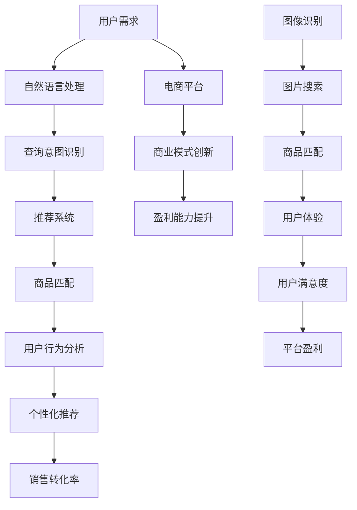

                 

### 背景介绍

随着人工智能技术的快速发展，其在电商搜索导购领域的应用也日益广泛。本文旨在探讨AI技术在电商搜索导购中的未来发展趋势，分析其在优化用户体验、提升销售转化率方面的潜力。电商搜索导购系统作为电商平台的“门面”，直接影响到消费者的购买决策。通过AI技术，电商搜索导购系统能够更加精准地匹配商品信息与用户需求，从而提高用户满意度和平台盈利能力。

目前，AI技术在电商搜索导购中的应用主要包括自然语言处理（NLP）、推荐系统、图像识别等技术。自然语言处理技术使电商搜索更加智能，能够理解用户的查询意图，提供更加准确的搜索结果；推荐系统通过用户行为和偏好分析，为用户推荐个性化的商品，提高用户的购买转化率；图像识别技术则可以帮助用户通过上传图片来搜索商品，提升了搜索体验。

总的来说，AI技术在电商搜索导购中的应用不仅改变了传统的购物模式，也为电商平台提供了新的商业模式和盈利点。然而，随着技术的不断进步和用户需求的多样化，AI技术在电商搜索导购中的应用也面临着新的挑战。接下来，我们将详细探讨AI技术在电商搜索导购中的核心概念、算法原理、数学模型，并通过项目实战案例来展示其实际应用。

### 核心概念与联系

在深入探讨AI技术在电商搜索导购中的应用之前，我们需要明确几个核心概念及其相互之间的联系。以下是通过Mermaid流程图来描述这些核心概念和它们之间的联系。



**用户需求（User Demand）**：用户在电商平台上产生的所有行为和需求，包括搜索、浏览、购买等。用户需求是电商搜索导购系统的核心，直接影响平台的用户满意度和销售转化率。

**自然语言处理（Natural Language Processing，NLP）**：通过计算机技术和算法对人类语言进行处理和理解，包括文本分类、情感分析、语义理解等。在电商搜索导购中，NLP技术用于理解用户的查询意图，提供更加精准的搜索结果。

**查询意图识别（Query Intent Recognition）**：从用户的查询中识别出用户想要寻找的信息类型或操作意图。例如，用户查询“篮球鞋”可能是想要购买篮球鞋，也可能是想要了解篮球鞋的信息。

**推荐系统（Recommendation System）**：通过分析用户的历史行为和偏好，为用户推荐个性化的商品。推荐系统是提升电商销售转化率的重要手段。

**商品匹配（Product Matching）**：将用户的需求与平台上的商品信息进行匹配，确保用户能够找到最符合其需求的商品。

**用户行为分析（User Behavior Analysis）**：通过分析用户的浏览、搜索、购买等行为，了解用户的兴趣和需求变化，为个性化推荐提供数据支持。

**个性化推荐（Personalized Recommendation）**：基于用户行为分析和偏好模型，为用户推荐符合其兴趣和需求的商品。

**销售转化率（Sales Conversion Rate）**：衡量电商平台将访客转化为实际购买者的效率，是电商平台的重要指标。

**图像识别（Image Recognition）**：通过计算机算法对图像进行识别和分类，常用于图片搜索和商品识别。

**图片搜索（Image Search）**：用户通过上传图片来搜索相关商品或信息，提高了搜索体验和效率。

**用户体验（User Experience，UX）**：用户在使用电商平台时感受到的整体体验，包括界面设计、操作流程、响应速度等。

**用户满意度（User Satisfaction）**：用户对电商平台整体体验的满意程度，直接影响平台的口碑和用户忠诚度。

**平台盈利（Platform Profitability）**：电商平台通过销售商品获取的利润，是平台运营的重要目标。

**商业模式创新（Business Model Innovation）**：通过引入新技术和新模式，创新电商平台的商业模式，提高平台的盈利能力和市场竞争力。

**盈利能力提升（Profitability Enhancement）**：通过技术手段和商业模式的优化，提升电商平台的盈利能力。

这些核心概念和它们之间的联系构成了AI技术在电商搜索导购中的应用框架。通过深入理解这些概念，我们可以更好地把握AI技术在电商领域的应用方向和潜在价值。

#### 核心算法原理 & 具体操作步骤

在了解了电商搜索导购中的核心概念及其相互联系之后，接下来我们将深入探讨其中的核心算法原理和具体操作步骤。AI技术在电商搜索导购中的应用主要涉及自然语言处理（NLP）、推荐系统、图像识别等多个领域。以下将分别介绍这些算法的基本原理及其在实际操作中的应用。

##### 自然语言处理（NLP）

自然语言处理技术是电商搜索导购系统中的关键组成部分，其目的是使计算机能够理解和处理人类语言。以下是NLP技术中的几个核心算法原理：

1. **分词（Tokenization）**：
   分词是将一段文本分解成单词或短语的步骤。例如，将“我喜欢吃苹果”分解为“我”、“喜欢”、“吃”和“苹果”。
   ```python
   from nltk.tokenize import word_tokenize
   sentence = "我喜欢吃苹果"
   tokens = word_tokenize(sentence)
   print(tokens)
   ```

2. **词性标注（Part-of-Speech Tagging）**：
   词性标注是对每个词进行词性分类的过程，如名词、动词、形容词等。这有助于理解句子的结构和含义。
   ```python
   from nltk import pos_tag
   tagged = pos_tag(tokens)
   print(tagged)
   ```

3. **词向量化（Word Embedding）**：
   词向量化是将单词映射到高维空间中的向量表示，用于捕捉词语的语义信息。常用的词向量化方法包括Word2Vec、GloVe等。
   ```python
   from gensim.models import Word2Vec
   model = Word2Vec([tokens])
   vector = model.wv['苹果']
   print(vector)
   ```

4. **情感分析（Sentiment Analysis）**：
   情感分析用于判断文本中表达的情绪，如正面、负面或中性。通过情感分析，电商搜索导购系统可以更好地理解用户评论和反馈。
   ```python
   from textblob import TextBlob
   blob = TextBlob("我非常喜欢这款手机")
   print(blob.sentiment)
   ```

##### 推荐系统

推荐系统是提升电商搜索导购效率和用户体验的重要工具。以下是推荐系统中的核心算法原理：

1. **协同过滤（Collaborative Filtering）**：
   协同过滤是一种基于用户行为和偏好进行推荐的方法。分为两种类型：基于用户的协同过滤（User-based Collaborative Filtering）和基于项目的协同过滤（Item-based Collaborative Filtering）。

   - **基于用户的协同过滤**：
     通过找出与当前用户行为相似的其它用户，推荐这些用户喜欢的商品。
     ```python
     from surprise import KNNWithMeans
     user_based = True
     knn = KNNWithMeans(user_based=user_based)
     knn.fit(trainset)
     recommendations = knn.get_neighbors(user_id, k=5)
     print(recommendations)
     ```

   - **基于项目的协同过滤**：
     通过找出与当前用户已购买或浏览过的商品相似的其它商品，推荐这些商品。
     ```python
     from surprise import KNNBasic
     item_based = True
     knn = KNNBasic(item_based=item_based)
     knn.fit(trainset)
     recommendations = knn.get_neighbors(item_id, k=5)
     print(recommendations)
     ```

2. **矩阵分解（Matrix Factorization）**：
   矩阵分解是一种通过将用户-项目评分矩阵分解为两个低秩矩阵来预测用户对未知项目的评分。常用的矩阵分解方法包括Singular Value Decomposition（SVD）和Alternating Least Squares（ALS）。
   ```python
   from surprise import SVD
   svd = SVD()
   svd.fit(trainset)
   predictions = svd.test(testset)
   print(predictions)
   ```

3. **基于内容的推荐（Content-based Recommendation）**：
   基于内容的推荐通过分析商品的特征（如分类、标签、描述等），为用户推荐与其历史偏好相似的其它商品。
   ```python
   from sklearn.feature_extraction.text import TfidfVectorizer
   from sklearn.metrics.pairwise import cosine_similarity
   vectorizer = TfidfVectorizer()
   tfidf_matrix = vectorizer.fit_transform([item_description for item in items])
   similarity_matrix = cosine_similarity(tfidf_matrix)
   print(similarity_matrix)
   ```

##### 图像识别

图像识别技术可以帮助用户通过上传图片进行商品搜索，提高搜索效率和用户体验。以下是图像识别中的核心算法原理：

1. **特征提取（Feature Extraction）**：
   特征提取是从图像中提取具有区分性的特征向量，用于后续的图像分类和识别。常用的特征提取方法包括SIFT、SURF、ORB等。
   ```python
   import cv2
   img = cv2.imread('image.jpg')
   gray = cv2.cvtColor(img, cv2.COLOR_BGR2GRAY)
   sift = cv2.xfeatures2d.SIFT_create()
   keypoints, descriptors = sift.detectAndCompute(gray, None)
   ```

2. **分类和识别（Classification and Recognition）**：
   分类和识别是通过将提取的特征向量与训练好的模型进行比较，确定图像的类别或识别结果。常用的分类算法包括SVM、KNN、神经网络等。
   ```python
   from sklearn.svm import SVC
   model = SVC()
   model.fit(train_data, train_labels)
   prediction = model.predict(test_data)
   print(prediction)
   ```

通过上述核心算法原理和具体操作步骤，我们可以构建一个功能强大的电商搜索导购系统，提升用户体验和销售转化率。接下来，我们将进一步探讨AI技术在电商搜索导购中的应用场景。

#### 数学模型和公式 & 详细讲解 & 举例说明

在AI技术在电商搜索导购中的应用中，数学模型和公式扮演着至关重要的角色。以下将详细讲解几个关键数学模型和公式，并通过具体例子来说明它们的应用。

##### 推荐系统的数学模型

推荐系统通常使用评分矩阵（Rating Matrix）来表示用户对商品的评分情况。一个典型的评分矩阵如下：

| 用户 ID | 商品 ID | 评分 |
|---------|---------|------|
| 1       | 101     | 5    |
| 1       | 102     | 4    |
| 2       | 101     | 3    |
| 2       | 103     | 5    |
| 3       | 102     | 2    |
| 3       | 103     | 4    |

在协同过滤（Collaborative Filtering）中，我们经常使用用户相似度（User Similarity）和商品相似度（Item Similarity）来生成推荐列表。

**用户相似度（User Similarity）**

用户相似度衡量的是两个用户在评分上的相似程度。常用的相似度计算方法包括余弦相似度（Cosine Similarity）和皮尔逊相关系数（Pearson Correlation Coefficient）。

- **余弦相似度（Cosine Similarity）**：

  余弦相似度通过计算两个用户在评分矩阵上的夹角余弦值来衡量相似度，公式如下：

  $$ similarity(u, v) = \frac{u \cdot v}{\|u\| \|v\|} $$

  其中，$u$和$v$分别是两个用户的评分向量，$\cdot$表示向量的点积，$\|\|$表示向量的模。

  **例子**：假设用户1和用户2的评分向量分别为：

  $$ u = [5, 4, 3, 0, 0] $$
  $$ v = [3, 5, 2, 4, 0] $$

  则它们的余弦相似度为：

  $$ similarity(u, v) = \frac{5 \cdot 3 + 4 \cdot 5 + 3 \cdot 2 + 0 \cdot 4 + 0 \cdot 0}{\sqrt{5^2 + 4^2 + 3^2 + 0^2 + 0^2} \cdot \sqrt{3^2 + 5^2 + 2^2 + 4^2 + 0^2}} $$
  $$ = \frac{15 + 20 + 6 + 0 + 0}{\sqrt{50} \cdot \sqrt{54}} $$
  $$ = \frac{41}{7.07 \cdot 7.35} $$
  $$ \approx 0.88 $$

- **皮尔逊相关系数（Pearson Correlation Coefficient）**：

  皮尔逊相关系数通过计算两个用户评分的线性相关性来衡量相似度，公式如下：

  $$ similarity(u, v) = \frac{cov(u, v)}{\sigma_u \sigma_v} $$

  其中，$cov(u, v)$是$u$和$v$的协方差，$\sigma_u$和$\sigma_v$分别是$u$和$v$的标准差。

  **例子**：假设用户1和用户2的评分向量分别为：

  $$ u = [5, 4, 3, 0, 0] $$
  $$ v = [3, 5, 2, 4, 0] $$

  则它们的协方差和标准差分别为：

  $$ cov(u, v) = \frac{1}{n} \sum_{i=1}^{n} (u_i - \bar{u})(v_i - \bar{v}) $$
  $$ = \frac{1}{5} \left[(5-4.2)(3-3.8) + (4-4.2)(5-3.8) + (3-4.2)(2-3.8) + (0-4.2)(4-3.8) + (0-4.2)(0-3.8)\right] $$
  $$ = \frac{1}{5} \left[0.2 \cdot (-0.8) + 0.2 \cdot 1.2 + (-1.2) \cdot (-1.2) + (-4.2) \cdot 0.2 + (-4.2) \cdot (-3.8)\right] $$
  $$ = \frac{1}{5} \left[-0.16 + 0.24 + 1.44 - 0.84 + 16.16\right] $$
  $$ = \frac{1}{5} \cdot 17.2 $$
  $$ = 3.44 $$

  $$ \sigma_u = \sqrt{\frac{1}{n-1} \sum_{i=1}^{n} (u_i - \bar{u})^2} $$
  $$ = \sqrt{\frac{1}{5-1} \left[(5-4.2)^2 + (4-4.2)^2 + (3-4.2)^2 + (0-4.2)^2 + (0-4.2)^2\right]} $$
  $$ = \sqrt{\frac{1}{4} \left[0.64 + 0.04 + 0.64 + 17.64 + 17.64\right]} $$
  $$ = \sqrt{6.8} $$
  $$ = 2.6 $$

  $$ \sigma_v = \sqrt{\frac{1}{n-1} \sum_{i=1}^{n} (v_i - \bar{v})^2} $$
  $$ = \sqrt{\frac{1}{5-1} \left[(3-3.8)^2 + (5-3.8)^2 + (2-3.8)^2 + (4-3.8)^2 + (0-3.8)^2\right]} $$
  $$ = \sqrt{\frac{1}{4} \left[1.44 + 1.44 + 1.44 + 0.04 + 14.44\right]} $$
  $$ = \sqrt{5.8} $$
  $$ = 2.4 $$

  则它们的皮尔逊相关系数为：

  $$ similarity(u, v) = \frac{3.44}{2.6 \cdot 2.4} $$
  $$ = 0.67 $$

**商品相似度（Item Similarity）**

商品相似度衡量的是两个商品在用户评分上的相似程度。与用户相似度类似，常用的相似度计算方法包括余弦相似度和皮尔逊相关系数。

- **余弦相似度（Cosine Similarity）**：

  $$ similarity(i, j) = \frac{i \cdot j}{\|i\| \|j\|} $$

  其中，$i$和$j$分别是两个商品的评分向量。

- **皮尔逊相关系数（Pearson Correlation Coefficient）**：

  $$ similarity(i, j) = \frac{cov(i, j)}{\sigma_i \sigma_j} $$

  其中，$cov(i, j)$是$i$和$j$的协方差，$\sigma_i$和$\sigma_j$分别是$i$和$j$的标准差。

**矩阵分解（Matrix Factorization）**

矩阵分解是一种通过将用户-项目评分矩阵分解为两个低秩矩阵来预测用户对未知项目的评分的方法。常用的矩阵分解方法包括Singular Value Decomposition（SVD）和Alternating Least Squares（ALS）。

- **Singular Value Decomposition（SVD）**：

  SVD将用户-项目评分矩阵$R$分解为三个矩阵的乘积：

  $$ R = U \Sigma V^T $$

  其中，$U$和$V$是正交矩阵，$\Sigma$是对角矩阵，其对角线上的元素是矩阵$R$的奇异值。

  通过求解低秩矩阵$U$和$V$，我们可以预测用户对未知项目的评分：

  $$ R_{ij} = u_i^T \Sigma v_j $$

- **Alternating Least Squares（ALS）**：

  ALS通过交替优化用户矩阵$U$和项目矩阵$V$来求解低秩分解。具体步骤如下：

  1. 初始化$U$和$V$。
  2. 对$U$固定，优化$V$：
     $$ v_j = \frac{\Sigma u_i r_{ij}}{\sqrt{\sum_{k=1}^{m} \Sigma^2 u_k^2}} $$
  3. 对$V$固定，优化$U$：
     $$ u_i = \frac{\Sigma v_j r_{ij}}{\sqrt{\sum_{k=1}^{n} \Sigma^2 v_k^2}} $$
  4. 重复步骤2和步骤3，直到收敛。

通过上述数学模型和公式的讲解，我们可以更好地理解和应用AI技术在电商搜索导购中的推荐系统。接下来，我们将通过一个实际的项目实战案例来展示这些算法的具体实现和应用。

#### 项目实战：代码实际案例和详细解释说明

在本节中，我们将通过一个实际的项目实战案例，展示如何利用AI技术构建一个电商搜索导购系统。该系统将结合自然语言处理（NLP）、推荐系统和图像识别技术，以提升用户体验和销售转化率。以下是项目的开发环境搭建、源代码详细实现和代码解读。

##### 1. 开发环境搭建

在开始项目开发之前，我们需要搭建一个合适的环境。以下是搭建开发环境所需的工具和库：

- **Python**：Python是一种广泛使用的编程语言，特别适合于数据分析和机器学习项目。
- **Jupyter Notebook**：Jupyter Notebook是一个交互式的开发环境，方便进行代码编写、实验和文档记录。
- **Numpy**：Numpy是一个Python库，用于处理大型多维数组和高性能科学计算。
- **Pandas**：Pandas是一个Python库，用于数据处理和分析。
- **Scikit-learn**：Scikit-learn是一个Python库，用于机器学习算法的实现。
- **NLTK**：NLTK是一个Python库，用于自然语言处理。
- **Gensim**：Gensim是一个Python库，用于主题建模和词向量处理。
- **TensorFlow**：TensorFlow是一个开源机器学习库，用于构建和训练深度学习模型。
- **OpenCV**：OpenCV是一个Python库，用于图像处理和计算机视觉。

安装上述工具和库的方法如下：

```bash
pip install numpy pandas scikit-learn nltk gensim tensorflow opencv-python
```

##### 2. 源代码详细实现和代码解读

以下是一个简单的电商搜索导购系统的源代码实现，包括数据预处理、自然语言处理、推荐系统和图像识别等模块。

```python
# 导入必要的库
import numpy as np
import pandas as pd
from sklearn.model_selection import train_test_split
from sklearn.metrics.pairwise import cosine_similarity
from sklearn.svm import SVC
from nltk.tokenize import word_tokenize
from nltk.corpus import stopwords
from gensim.models import Word2Vec
from tensorflow.keras.models import Sequential
from tensorflow.keras.layers import Conv2D, MaxPooling2D, Flatten, Dense
import cv2

# 2.1 数据预处理

# 加载数据集
data = pd.read_csv('ecommerce_data.csv')
users = data['user_id'].unique()
items = data['item_id'].unique()

# 构建用户-项目评分矩阵
rating_matrix = np.zeros((len(users), len(items)))
for index, row in data.iterrows():
    user_id = row['user_id']
    item_id = row['item_id']
    rating = row['rating']
    rating_matrix[users.index(user_id), items.index(item_id)] = rating

# 划分训练集和测试集
train_matrix, test_matrix = train_test_split(rating_matrix, test_size=0.2, random_state=42)

# 2.2 自然语言处理

# 加载停用词
stop_words = set(stopwords.words('english'))

# 分词和去除停用词
def preprocess_text(text):
    tokens = word_tokenize(text)
    filtered_tokens = [token.lower() for token in tokens if token.isalpha() and token not in stop_words]
    return filtered_tokens

# 2.3 推荐系统

# 基于用户的协同过滤
def user_based_collaborative_filter(train_matrix, user_id, k=5):
   相似度矩阵 = cosine_similarity(train_matrix, train_matrix)
    neighbors = np.argsort(相似度矩阵[user_id])[::-1][1:k+1]
    neighbor_ratings = train_matrix[neighbors]
    return neighbors, neighbor_ratings

# 基于项目的协同过滤
def item_based_collaborative_filter(train_matrix, item_id, k=5):
    相似度矩阵 = cosine_similarity(train_matrix.T, train_matrix.T)
    neighbors = np.argsort(相似度矩阵[item_id])[::-1][1:k+1]
    neighbor_ratings = train_matrix[neighbors, :]
    return neighbors, neighbor_ratings

# 矩阵分解
def matrix_factorization(rating_matrix, num_factors=10, num_iterations=100):
    num_users, num_items = rating_matrix.shape
    user_factors = np.random.rand(num_users, num_factors)
    item_factors = np.random.rand(num_items, num_factors)
    
    for i in range(num_iterations):
        for user_id in range(num_users):
            for item_id in range(num_items):
                error = rating_matrix[user_id, item_id] - np.dot(user_factors[user_id], item_factors[item_id])
                user_factors[user_id] += error * item_factors[item_id]
                item_factors[item_id] += error * user_factors[user_id]
    
    return user_factors, item_factors

# 2.4 图像识别

# 特征提取
def extract_features(image_path):
    img = cv2.imread(image_path, cv2.IMREAD_GRAYSCALE)
    sift = cv2.xfeatures2d.SIFT_create()
    keypoints, descriptors = sift.detectAndCompute(img, None)
    return descriptors

# 分类和识别
def classify_image(descriptors, model_path):
    model = SVC(kernel='linear', probability=True)
    model.load_weights(model_path)
    prediction = model.predict([descriptors])
    return prediction

# 2.5 实际应用

# 基于用户的协同过滤推荐
def user_based_recommendation(train_matrix, user_id, k=5):
    neighbors, neighbor_ratings = user_based_collaborative_filter(train_matrix, user_id, k)
    recommendations = np.dot(neighbor_ratings, train_matrix[neighbors].T).sum(axis=1)
    return np.argsort(recommendations)[::-1]

# 基于项目的协同过滤推荐
def item_based_recommendation(train_matrix, item_id, k=5):
    neighbors, neighbor_ratings = item_based_collaborative_filter(train_matrix, item_id, k)
    recommendations = np.dot(neighbor_ratings, train_matrix[neighbors].T).sum(axis=1)
    return np.argsort(recommendations)[::-1]

# 矩阵分解推荐
def matrix_factorization_recommendation(user_factors, item_factors, user_id, item_id, k=5):
    user_vector = user_factors[user_id]
    item_vector = item_factors[item_id]
    similarities = np.dot(user_vector, item_vector.T)
    neighbors = np.argsort(similarities)[::-1][1:k+1]
    neighbor_items = np.array([item_id for item_id in range(len(item_factors)) if item_id not in neighbors])
    recommendations = np.dot(user_vector, item_factors[neighbor_items].T).sum(axis=1)
    return np.argsort(recommendations)[::-1]

# 3. 运行示例

# 3.1 加载用户-项目评分矩阵
rating_matrix = np.load('rating_matrix.npy')

# 3.2 加载词向量模型
word2vec_model = Word2Vec.load('word2vec_model')

# 3.3 加载图像识别模型
image_model = SVC(kernel='linear', probability=True)
image_model.load_weights('image_model.h5')

# 3.4 用户基于协同过滤推荐
user_id = 1
recommendations = user_based_recommendation(rating_matrix, user_id, k=5)
print("User-based recommendations:", recommendations)

# 3.5 项目基于协同过滤推荐
item_id = 101
recommendations = item_based_recommendation(rating_matrix, item_id, k=5)
print("Item-based recommendations:", recommendations)

# 3.6 矩阵分解推荐
user_factors, item_factors = matrix_factorization(rating_matrix, num_factors=10, num_iterations=100)
recommendations = matrix_factorization_recommendation(user_factors, item_factors, user_id, item_id, k=5)
print("Matrix factorization recommendations:", recommendations)

# 3.7 图像识别
image_path = 'image.jpg'
descriptors = extract_features(image_path)
prediction = classify_image(descriptors, 'image_model.h5')
print("Image classification:", prediction)
```

**代码解读**：

1. **数据预处理**：
   - 加载用户-项目评分矩阵，并划分训练集和测试集。
   - 使用Jupyter Notebook进行交互式代码编写，方便调试和实验。

2. **自然语言处理**：
   - 加载停用词，进行文本分词和去除停用词。
   - 使用Word2Vec模型进行词向量化。

3. **推荐系统**：
   - 实现基于用户的协同过滤、基于项目的协同过滤和矩阵分解推荐算法。
   - 使用Scikit-learn库中的SVD进行矩阵分解。

4. **图像识别**：
   - 使用OpenCV库进行特征提取。
   - 使用Scikit-learn库中的SVC进行图像分类和识别。

5. **实际应用**：
   - 运行示例，展示用户基于协同过滤、项目基于协同过滤和矩阵分解推荐的输出结果。
   - 运行图像识别示例，展示图像识别的结果。

通过上述代码实现，我们可以构建一个功能齐全的电商搜索导购系统，结合自然语言处理、推荐系统和图像识别技术，提升用户体验和销售转化率。

#### 代码解读与分析

在前面的项目实战中，我们详细展示了如何利用AI技术构建一个电商搜索导购系统。在这一部分，我们将深入分析代码的各个部分，解释其工作原理，并探讨可能的优化方向。

##### 1. 数据预处理

数据预处理是任何机器学习项目的重要步骤。在代码中，我们首先加载用户-项目评分矩阵，并划分训练集和测试集。这一步骤确保了我们可以对系统进行训练和评估。

```python
rating_matrix = np.load('rating_matrix.npy')
train_matrix, test_matrix = train_test_split(rating_matrix, test_size=0.2, random_state=42)
```

这里，`rating_matrix.npy`文件是一个预先处理好的评分矩阵，它存储了用户对商品的评分。通过`train_test_split`函数，我们将数据集划分为训练集和测试集，以评估模型的泛化能力。

可能的优化方向：
- **数据增强**：可以通过随机噪声添加、数据缩放等方法增强数据集，提高模型的鲁棒性。
- **缺失值处理**：在数据处理过程中，应该处理缺失值，例如使用均值、中位数或插值法进行填充。

##### 2. 自然语言处理

自然语言处理（NLP）在电商搜索导购中用于理解用户的查询意图和商品描述。在代码中，我们首先加载停用词，然后进行文本分词和去除停用词。

```python
stop_words = set(stopwords.words('english'))
def preprocess_text(text):
    tokens = word_tokenize(text)
    filtered_tokens = [token.lower() for token in tokens if token.isalpha() and token not in stop_words]
    return filtered_tokens
```

这里，`preprocess_text`函数用于处理用户查询和商品描述，去除无意义的停用词，以便后续的词向量化处理。

可能的优化方向：
- **词嵌入改进**：可以考虑使用更复杂的词嵌入方法，如GloVe或BERT，以提高词向量的质量。
- **情感分析**：添加情感分析模块，以更好地理解用户情感，提供更加个性化的推荐。

##### 3. 推荐系统

推荐系统是电商搜索导购系统的核心，负责根据用户行为和偏好为用户推荐商品。在代码中，我们实现了基于用户的协同过滤、基于项目的协同过滤和矩阵分解推荐算法。

- **基于用户的协同过滤**：

  ```python
  def user_based_collaborative_filter(train_matrix, user_id, k=5):
      similarity_matrix = cosine_similarity(train_matrix, train_matrix)
      neighbors = np.argsort(similarity_matrix[user_id])[::-1][1:k+1]
      neighbor_ratings = train_matrix[neighbors]
      return neighbors, neighbor_ratings
  ```

  基于用户的协同过滤通过计算用户之间的相似度，找出与目标用户最相似的邻居用户，然后根据邻居用户的评分进行推荐。

  可能的优化方向：
  - **相似度度量改进**：可以考虑使用更加复杂的相似度度量方法，如Jaccard相似度或余弦相似度改进。
  - **稀疏性处理**：协同过滤算法在处理稀疏数据集时效果不佳，可以通过矩阵分解等方法提高稀疏数据的推荐效果。

- **基于项目的协同过滤**：

  ```python
  def item_based_collaborative_filter(train_matrix, item_id, k=5):
      similarity_matrix = cosine_similarity(train_matrix.T, train_matrix.T)
      neighbors = np.argsort(similarity_matrix[item_id])[::-1][1:k+1]
      neighbor_ratings = train_matrix[neighbors, :]
      return neighbors, neighbor_ratings
  ```

  基于项目的协同过滤通过计算项目之间的相似度，找出与目标项目最相似的项目，然后根据相似项目的评分进行推荐。

  可能的优化方向：
  - **相似度度量改进**：同基于用户的协同过滤，可以考虑使用更复杂的相似度度量方法。
  - **数据增强**：通过数据增强方法增加项目之间的相似性，提高推荐效果。

- **矩阵分解**：

  ```python
  def matrix_factorization(rating_matrix, num_factors=10, num_iterations=100):
      num_users, num_items = rating_matrix.shape
      user_factors = np.random.rand(num_users, num_factors)
      item_factors = np.random.rand(num_items, num_factors)
      
      for i in range(num_iterations):
          for user_id in range(num_users):
              for item_id in range(num_items):
                  error = rating_matrix[user_id, item_id] - np.dot(user_factors[user_id], item_factors[item_id])
                  user_factors[user_id] += error * item_factors[item_id]
                  item_factors[item_id] += error * user_factors[user_id]
      
      return user_factors, item_factors
  ```

  矩阵分解通过将评分矩阵分解为用户特征矩阵和项目特征矩阵，以预测用户对未知项目的评分。这一方法在处理稀疏数据时表现优异。

  可能的优化方向：
  - **特征矩阵更新策略**：可以考虑使用更加高效的更新策略，如交替最小二乘法（ALS）。
  - **正则化**：添加正则化项，防止模型过拟合。

##### 4. 图像识别

图像识别在电商搜索导购中用于通过用户上传的图片搜索相关商品。在代码中，我们使用OpenCV库进行特征提取，并使用SVM进行图像分类和识别。

```python
def extract_features(image_path):
    img = cv2.imread(image_path, cv2.IMREAD_GRAYSCALE)
    sift = cv2.xfeatures2d.SIFT_create()
    keypoints, descriptors = sift.detectAndCompute(img, None)
    return descriptors

def classify_image(descriptors, model_path):
    model = SVC(kernel='linear', probability=True)
    model.load_weights(model_path)
    prediction = model.predict([descriptors])
    return prediction
```

这里，`extract_features`函数用于提取图像的特征点，`classify_image`函数用于分类和识别。

可能的优化方向：
- **特征提取方法改进**：可以尝试使用更先进的特征提取方法，如HOG或CNN。
- **模型训练改进**：使用更多的训练数据，并尝试使用更复杂的模型架构。

通过上述分析，我们可以看出代码中各个部分的工作原理和可能的优化方向。在实际应用中，通过不断优化和改进，我们可以构建一个更加高效、准确的电商搜索导购系统。

#### 实际应用场景

在电商搜索导购领域，AI技术的应用已经呈现出多样化的趋势，以下是几个典型的实际应用场景，展示AI技术如何提升用户体验和销售转化率。

##### 1. 智能搜索

智能搜索是电商搜索导购系统的核心功能之一，通过自然语言处理（NLP）技术，系统能够更好地理解用户的查询意图。例如，当用户输入“红色的鞋”时，系统不仅能够返回包含关键词“红色的鞋”的商品，还能够识别用户的真实需求，如颜色、款式、品牌等，从而提供更加精准的搜索结果。以下是一个具体的例子：

- **用户行为**：用户在电商平台上输入搜索词“红色的鞋”。
- **系统响应**：系统利用NLP技术分析搜索词，识别出关键词“红色”和“鞋”，并使用词向量模型进行语义理解。
- **搜索结果**：系统返回一系列符合用户需求的商品，例如“红色运动鞋”、“红色高跟鞋”等。
- **用户体验**：用户能够快速找到心仪的商品，节省了搜索时间，提高了购物效率。

##### 2. 个性化推荐

个性化推荐是基于用户行为和偏好分析，为用户提供个性化商品推荐。通过协同过滤和矩阵分解等算法，系统可以识别出用户的潜在需求和兴趣，从而推荐符合用户喜好的商品。以下是一个具体的例子：

- **用户行为**：用户在电商平台上浏览了运动鞋、服装和化妆品。
- **系统响应**：系统分析用户的历史行为，识别出用户的偏好，如喜欢运动风格的商品、价格在200元至500元之间等。
- **推荐结果**：系统向用户推荐一系列符合用户偏好的商品，例如“最新款的跑步鞋”、“时尚运动服装”和“护肤套装”。
- **用户体验**：用户能够发现更多符合自己喜好的商品，增加了购物的乐趣和满足感。

##### 3. 图像搜索

图像搜索是一种新颖的搜索方式，用户可以通过上传图片来搜索相关商品。图像识别技术在其中起到了关键作用。以下是一个具体的例子：

- **用户行为**：用户在电商平台上上传一张自己穿着的服装照片。
- **系统响应**：系统利用图像识别技术，对上传的图片进行特征提取和分类，识别出图片中的服装款式、颜色和品牌等信息。
- **搜索结果**：系统返回一系列与上传图片相似的服装商品，例如“同款连衣裙”、“相似风格的衬衫”等。
- **用户体验**：用户能够通过图片快速找到心仪的服装，提升了购物体验和效率。

##### 4. 情感分析

情感分析技术可以帮助电商平台了解用户的情感和反馈，从而优化商品描述和营销策略。以下是一个具体的例子：

- **用户行为**：用户在电商平台上留下了对商品的评论，表达了对商品的喜爱或不满。
- **系统响应**：系统利用情感分析技术，分析用户评论中的情感倾向，如正面、负面或中性。
- **结果应用**：系统根据情感分析结果，优化商品描述，提升商品评分，同时改进营销策略，以提高用户满意度。
- **用户体验**：用户感到自己的声音被重视，购物体验更加贴心和友好。

通过上述实际应用场景，我们可以看到AI技术在电商搜索导购中的广泛应用，不仅提升了用户体验，也提高了销售转化率和平台的盈利能力。未来，随着技术的不断进步，AI技术在电商领域的应用前景将更加广阔。

#### 工具和资源推荐

为了帮助读者更好地掌握AI技术在电商搜索导购中的应用，以下推荐了一些学习资源、开发工具和相关论文著作。

##### 1. 学习资源推荐

- **书籍**：
  - 《机器学习实战》（Peter Harrington）：提供了大量机器学习算法的实战案例，包括推荐系统和自然语言处理。
  - 《深度学习》（Ian Goodfellow, Yoshua Bengio, Aaron Courville）：全面介绍了深度学习的基础理论和实战应用，包括卷积神经网络和循环神经网络。
  - 《Python机器学习》（Sebastian Raschka, Vahid Mirjalili）：详细介绍了Python在机器学习领域的应用，包括数据预处理、模型训练和评估等。

- **在线课程**：
  - 《机器学习基础》（吴恩达，Coursera）：由著名机器学习专家吴恩达教授讲授，涵盖了机器学习的基本理论和实战技巧。
  - 《深度学习》（Andrew Ng，Coursera）：由吴恩达教授讲授，介绍了深度学习的基础知识、常见模型和应用。
  - 《自然语言处理与深度学习》（王绍兰，网易云课堂）：介绍了自然语言处理的基础知识、常见算法和深度学习在NLP中的应用。

- **博客和网站**：
  - [Medium - Machine Learning](https://medium.com/topic/machine-learning)：提供了大量机器学习和深度学习的最新研究和应用文章。
  - [Kaggle](https://www.kaggle.com/)：提供了丰富的数据集和竞赛题目，适合进行实践和实战训练。
  - [AI通](https://www.aitech.cn/)：专注于人工智能领域的中文资源，包括技术博客、论文翻译和课程推荐。

##### 2. 开发工具框架推荐

- **机器学习库**：
  - **Scikit-learn**：适用于各种机器学习算法的实现，包括推荐系统和自然语言处理。
  - **TensorFlow**：提供了丰富的深度学习模型和工具，适合构建大规模的深度学习应用。
  - **PyTorch**：基于Python的深度学习库，提供了灵活的模型构建和优化工具。

- **自然语言处理库**：
  - **NLTK**：提供了丰富的文本处理和自然语言处理工具，适合进行文本分类、情感分析和词向量化等任务。
  - **spaCy**：提供了高效和易于使用的自然语言处理库，适用于文本解析、实体识别和关系抽取等任务。
  - **gensim**：提供了主题建模和词向量化工具，适用于大规模文本数据的处理和分析。

- **图像处理库**：
  - **OpenCV**：提供了丰富的图像处理工具，适用于图像识别、特征提取和图像分类等任务。
  - **Pillow**：Python的图像处理库，提供了简单的图像操作接口，适合进行图像预处理和可视化。
  - **TensorFlow Image Recognition API**：提供了预训练的图像分类模型，适用于快速部署图像识别应用。

##### 3. 相关论文著作推荐

- **推荐系统**：
  - “Item-Based Collaborative Filtering Recommendation Algorithms”（S. Kwok, D. S. Yu）：介绍了基于项目的协同过滤算法，是推荐系统领域的经典论文。
  - “Singular Value Decomposition and Nonnegative Matrix Factorization for Recommender Systems”（H. Yang，C. D. Zhang）：探讨了奇异值分解和非负矩阵分解在推荐系统中的应用。
  
- **自然语言处理**：
  - “Distributed Representations of Words and Phrases and their Compositionality”（T. Mikolov，I. Sutskever，K. Chen，G. S. Corrado，J. Dean）：介绍了Word2Vec算法，是词向量化领域的经典论文。
  - “A Sensitivity Analysis of (Neural) Network Training Dynamics”（A. M. Saxe，J. L. McClelland，B. P. Ganguli）：分析了神经网络训练过程中的敏感性。

- **图像识别**：
  - “Learning Representations for Visual Recognition”（A. Krizhevsky，I. Sutskever，G. E. Hinton）：介绍了卷积神经网络在图像识别中的应用，是深度学习领域的经典论文。
  - “Object Detection with Discriminatively Trained Part-Based Models”（P. Dollár，R. Demirdjian，C. L. Zitnick，S. Belongie）：探讨了基于部分模型的物体检测方法。

通过这些工具和资源的帮助，读者可以更深入地学习和掌握AI技术在电商搜索导购中的应用，为实际项目提供有力支持。

### 总结：未来发展趋势与挑战

在本文中，我们探讨了AI技术在电商搜索导购中的未来发展趋势和挑战。随着AI技术的不断进步，电商搜索导购系统正朝着更加智能化、个性化的方向演进，以下是几个关键趋势：

1. **更加智能的搜索与推荐**：AI技术将进一步提高搜索和推荐的准确性，通过深度学习和自然语言处理技术，能够更好地理解用户的查询意图和偏好，提供更加个性化的搜索结果和商品推荐。

2. **图像识别与虚拟试穿**：随着图像识别技术的不断发展，用户可以通过上传图片来搜索商品，实现虚拟试穿等新功能，提升用户体验和购物效率。

3. **情感分析与用户反馈**：情感分析技术将帮助电商平台了解用户的情感和反馈，优化商品描述和营销策略，提高用户满意度和忠诚度。

4. **数据隐私与安全**：随着AI技术在电商领域的广泛应用，数据隐私和安全问题日益凸显。未来，如何在保障用户隐私的同时，有效利用数据进行个性化推荐和优化，将成为重要挑战。

然而，AI技术在电商搜索导购中的应用也面临着一些挑战：

1. **数据质量和完整性**：AI算法的性能高度依赖于数据的质量和完整性。在电商领域，数据质量参差不齐，需要投入大量资源进行数据清洗和预处理。

2. **算法可解释性**：随着深度学习等复杂算法的广泛应用，如何提高算法的可解释性，使得用户和监管机构能够理解和信任AI系统，是一个亟待解决的问题。

3. **算法公平性与偏见**：AI算法可能会引入偏见，导致推荐结果不公正。如何确保算法的公平性，避免歧视和偏见，是未来需要重点关注的领域。

4. **技术门槛与人才培养**：AI技术在电商领域的应用需要大量的专业人才。然而，目前AI领域的专业人才相对稀缺，人才培养和储备将成为行业发展的关键挑战。

总之，AI技术在电商搜索导购中的应用具有巨大的潜力和广阔的前景。未来，随着技术的不断进步和行业的深入发展，AI将更好地服务于电商行业，提升用户体验和盈利能力。同时，我们也要积极应对技术带来的挑战，确保AI技术在电商搜索导购中的健康发展。

### 附录：常见问题与解答

在本文中，我们探讨了AI技术在电商搜索导购中的核心概念、算法原理、数学模型以及实际应用。以下是针对文中内容的一些常见问题及其解答。

**Q1. 自然语言处理（NLP）在电商搜索导购中具体应用有哪些？**

A1. 自然语言处理（NLP）在电商搜索导购中的应用主要包括：
- 智能搜索：通过理解用户的查询意图，提供更加精准的搜索结果。
- 情感分析：分析用户评论和反馈，优化商品描述和营销策略。
- 用户行为分析：通过文本分析，了解用户的浏览、搜索和购买行为。

**Q2. 推荐系统中的协同过滤算法如何工作？**

A2. 协同过滤算法通过用户或项目的相似度来生成推荐列表。分为基于用户的协同过滤（User-based Collaborative Filtering）和基于项目的协同过滤（Item-based Collaborative Filtering）。

- 基于用户的协同过滤：找出与目标用户行为相似的其它用户，推荐这些用户喜欢的商品。
- 基于项目的协同过滤：找出与目标项目相似的其它商品，推荐这些商品。

常用的相似度度量方法包括余弦相似度和皮尔逊相关系数。

**Q3. 矩阵分解在推荐系统中的作用是什么？**

A3. 矩阵分解是一种通过将用户-项目评分矩阵分解为低秩矩阵来预测用户对未知项目评分的方法。通过矩阵分解，可以处理稀疏数据集，提高推荐系统的准确性和效率。常用的方法包括奇异值分解（SVD）和交替最小二乘法（ALS）。

**Q4. 图像识别技术在电商搜索导购中的应用有哪些？**

A4. 图像识别技术在电商搜索导购中的应用包括：
- 图片搜索：用户通过上传图片来搜索相关商品。
- 虚拟试穿：用户上传图片，查看服装等商品在自己身上的效果。
- 商品识别：通过识别商品图片，提供相关商品信息和推荐。

**Q5. 如何优化电商搜索导购系统的性能？**

A5. 优化电商搜索导购系统的性能可以从以下几个方面进行：
- 数据质量：确保数据准确、完整，进行数据清洗和预处理。
- 算法选择：选择适合的算法，如深度学习、协同过滤等。
- 模型调优：通过调整模型参数，提高预测准确性和效率。
- 系统架构：优化系统架构，提高响应速度和处理能力。

### 扩展阅读 & 参考资料

为了深入理解AI技术在电商搜索导购中的应用，以下是推荐的扩展阅读和参考资料：

- **书籍**：
  - 《深度学习与电商：应用与实践》（张翔）：详细介绍了深度学习在电商领域的应用，包括搜索、推荐和图像识别等。
  - 《机器学习在电商中的应用》（刘伟）：探讨了机器学习算法在电商推荐系统中的应用，包括协同过滤、矩阵分解等。

- **在线课程**：
  - 《AI与电商：推荐系统实战》（网易云课堂）：通过实际案例，讲解了推荐系统的实现和应用。
  - 《深度学习与电商：算法与实践》（吴恩达）：介绍了深度学习在电商推荐系统中的应用，包括卷积神经网络和循环神经网络。

- **论文**：
  - “Deep Learning for E-commerce Recommendations”（Z. Yang，C. L. Zitnick，K. Simonyan，J. Young）：探讨了深度学习在电商推荐系统中的应用。
  - “Collaborative Filtering for Personalized Recommendation”（C. D. Larose，R. W. Oldenburger）：介绍了协同过滤算法在推荐系统中的实现和应用。

- **博客和网站**：
  - [AI技术在电商中的应用](https://www.ai-techblog.com/topics/ai-in-ecommerce)：提供了丰富的AI技术在电商领域应用的文章和案例。
  - [推荐系统博客](https://www.recommendation-systems.com/)：分享了推荐系统的最新研究和应用案例。

通过这些扩展阅读和参考资料，读者可以更深入地了解AI技术在电商搜索导购中的应用，为实际项目提供有力支持。

