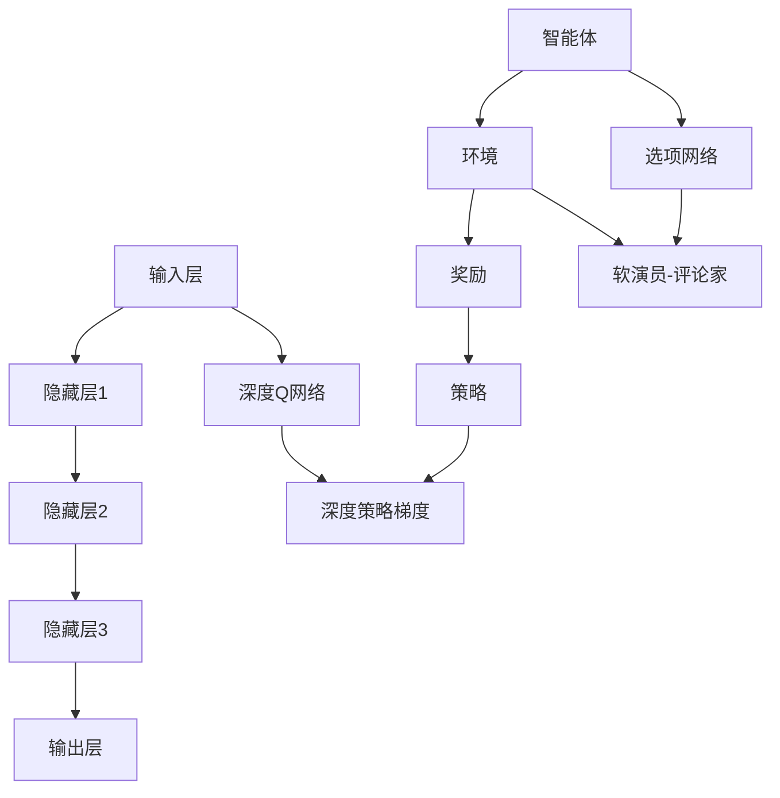

                 

### 背景介绍

随着人工智能（AI）技术的迅猛发展，神经网络已经成为实现AI应用的核心技术之一。其中，深度学习和强化学习作为神经网络领域的两大分支，各自有着广泛的应用前景和独特的优势。深度学习主要关注从大量数据中自动提取特征，并通过多层神经网络进行复杂任务的学习和建模；而强化学习则专注于通过奖励信号和策略优化来实现智能体在特定环境中的最优行为。

然而，深度学习和强化学习在某种程度上是相互独立的，各自有着不同的应用场景和挑战。深度学习虽然可以在数据丰富的领域取得显著成果，但在任务复杂性较高或数据稀缺的环境下，其性能往往受到限制。强化学习则能在决策过程中考虑长期奖励，通过策略优化实现智能体的自主学习和行为优化，但其训练过程通常较为复杂且难以收敛。

本文旨在探讨深度学习和强化学习的融合方法，通过结合两者的优势，以实现更为高效和灵活的智能系统。本文将首先介绍深度学习和强化学习的基本概念、原理和架构，然后深入分析它们融合的方法和实现，并通过具体的项目实战案例进行详细讲解。此外，本文还将探讨深度学习和强化学习在实际应用场景中的优势和挑战，以及推荐的工具和资源。最后，本文将对未来发展趋势和面临的挑战进行总结和展望。

通过本文的阅读，读者将能够全面了解深度学习和强化学习的融合技术，掌握其核心原理和实现方法，并能够应用于实际项目中，提升智能系统的性能和鲁棒性。

### 核心概念与联系

为了深入探讨深度学习和强化学习的融合，我们首先需要理解这两个核心概念的基本原理和它们之间的联系。

#### 深度学习

深度学习（Deep Learning）是一种基于人工神经网络的技术，旨在通过多层神经网络模型从大量数据中自动提取特征，进行复杂任务的建模和预测。其基本架构包括输入层、多个隐藏层和输出层。每个隐藏层都通过一系列的神经元进行信息处理，神经元之间通过权重和偏置进行连接，从而实现数据的逐层抽象和特征提取。

**工作原理**：深度学习通过反向传播算法（Backpropagation）进行训练，该算法通过计算损失函数的梯度，不断调整网络权重和偏置，以达到最小化损失函数的目的。随着训练数据的增多和网络层数的增加，深度学习模型可以逐步提高其预测准确性和泛化能力。

**优点和缺点**：

- **优点**：能够自动提取复杂特征，适用于大规模数据处理的任务；具有较高的泛化能力。
- **缺点**：需要大量的数据和计算资源；对超参数调优敏感；训练过程可能陷入局部最小值。

#### 强化学习

强化学习（Reinforcement Learning，RL）是一种通过与环境交互，不断优化策略，实现最佳行为的机器学习方法。其核心思想是智能体（Agent）在特定环境中采取行动，根据环境的反馈（奖励或惩罚）调整其行为策略，以最大化累积奖励。

**工作原理**：强化学习主要依赖于价值函数或策略优化。价值函数（Value Function）描述了智能体在特定状态下采取特定行动的预期奖励，而策略（Policy）则定义了在给定状态下智能体应采取的最优行动。强化学习通常使用策略梯度方法（Policy Gradient Methods）进行优化。

**优点和缺点**：

- **优点**：能够处理动态和不确定性的环境；具有自主学习和策略优化的能力。
- **缺点**：训练过程通常较为复杂和缓慢；对环境和奖励设计的依赖较强。

#### 融合方法

深度学习和强化学习的融合主要通过以下几种方法实现：

1. **深度强化学习**：将深度神经网络应用于强化学习中的值函数或策略函数，以实现更复杂的特征提取和决策。例如，深度Q网络（Deep Q-Network, DQN）和深度策略梯度（Deep Policy Gradient, DPG）等方法。
   
2. **统一框架**：通过构建一个统一的框架，将深度学习和强化学习的优势相结合。例如，选项网络（Option-Critic，OC）和软演员-评论家（Soft Actor-Critic，SAC）等方法。

3. **模块化设计**：将深度学习和强化学习分别应用于系统的不同模块，通过模块间的交互和协同工作实现整体优化。例如，将深度学习用于特征提取，强化学习用于决策优化。

#### Mermaid 流程图

为了更直观地展示深度学习和强化学习的基本原理和融合方法，我们使用Mermaid流程图进行说明：



在这个流程图中，深度学习模型（如多层感知机）用于处理输入数据并提取特征，而强化学习模型（如Q网络和策略梯度）用于根据环境反馈优化策略。不同的融合方法通过不同的连接和交互方式，实现了深度学习和强化学习的优势互补。

通过以上对深度学习和强化学习核心概念和融合方法的介绍，我们可以进一步探讨如何在实际应用中实现这两者的结合，以构建更为强大和高效的智能系统。

### 核心算法原理 & 具体操作步骤

在深入探讨深度学习和强化学习的融合方法之前，我们先来详细讲解这两个领域的核心算法原理，并描述它们的具体操作步骤。通过理解这些算法，我们将能够更好地理解它们如何结合以及如何在实际应用中优化性能。

#### 深度学习算法原理

深度学习算法的核心是基于多层神经网络进行特征提取和任务建模。下面我们将详细介绍一个常用的深度学习算法——卷积神经网络（Convolutional Neural Network，CNN）的原理和具体操作步骤。

1. **卷积层（Convolutional Layer）**：

卷积层是CNN的核心部分，负责通过卷积操作提取图像特征。卷积层包含多个卷积核（filter），每个卷积核都是一个小的权值矩阵，用于从输入数据中提取局部特征。卷积操作可以通过以下步骤进行：

    - **权值初始化**：卷积核的初始权重随机生成，通常使用较小的正态分布。
    - **卷积操作**：每个卷积核在输入数据上滑动，并与对应位置的像素值进行点积操作，生成一个特征图（feature map）。
    - **激活函数**：对每个特征图应用激活函数（如ReLU函数），以增加网络的表达能力和非线性的能力。

2. **池化层（Pooling Layer）**：

池化层用于减少特征图的尺寸，从而降低计算复杂度并减少过拟合风险。常用的池化操作有最大池化（Max Pooling）和平均池化（Average Pooling）。操作步骤如下：

    - **窗口选择**：在特征图上选择一个固定大小的窗口。
    - **计算**：窗口内的像素值按照预定的方法（如最大值或平均值）进行计算，得到一个池化结果。
    - **更新特征图**：将计算结果填充到新的特征图中，并缩放特征图尺寸。

3. **全连接层（Fully Connected Layer）**：

全连接层将上一层的所有特征图拼接成一个一维的特征向量，并通过多个神经元进行分类或回归任务。具体操作步骤如下：

    - **特征拼接**：将所有特征图按照列进行拼接，形成特征向量。
    - **线性变换**：通过矩阵乘法将特征向量映射到新的空间。
    - **激活函数**：对映射后的结果应用激活函数（如softmax或sigmoid），以获得最终的预测结果。

4. **损失函数与优化算法**：

在深度学习训练过程中，我们需要通过优化算法（如梯度下降或其变种）不断调整网络权重，以最小化损失函数。常用的损失函数有均方误差（MSE）和交叉熵损失（Cross-Entropy Loss）。优化算法的基本步骤如下：

    - **前向传播**：计算输入数据经过网络后的预测值。
    - **计算损失**：使用预测值和真实标签计算损失函数值。
    - **反向传播**：通过计算损失关于权重的梯度，更新网络权重。

#### 强化学习算法原理

强化学习算法的核心是智能体（Agent）通过与环境（Environment）的交互，学习一个策略（Policy），以最大化累积奖励（Reward）。下面我们以Q学习算法为例，详细描述其原理和具体操作步骤。

1. **Q值函数（Q-Function）**：

Q值函数是强化学习中的一个核心概念，表示在给定状态下采取特定行动的预期奖励。Q学习算法通过以下步骤学习Q值函数：

    - **初始化Q值**：初始时，Q值函数对所有状态和动作的预期奖励进行随机初始化。
    - **选择动作**：在给定状态下，根据策略选择一个动作，并执行该动作。
    - **更新Q值**：根据实际获得的奖励和下一个状态，更新当前状态和动作的Q值。

2. **策略（Policy）**：

策略定义了在给定状态下智能体应采取的最优行动。Q学习算法中的策略通常通过以下步骤更新：

    - **探索（Exploration）**：在初始阶段，智能体通过随机选择动作进行探索，以获取更多状态和动作的信息。
    - **利用（Utilization）**：在积累了一定量的经验后，智能体根据Q值函数选择动作，以最大化累积奖励。

3. **学习过程**：

Q学习算法通过迭代更新Q值函数，逐步优化智能体的策略。具体步骤如下：

    - **状态-动作对**：智能体在特定状态下执行一个动作，并获得一个奖励。
    - **Q值更新**：根据当前奖励和下一个状态，更新当前状态和动作的Q值。
    - **策略迭代**：根据更新后的Q值函数，调整智能体的策略。

4. **目标网络（Target Network）**：

为了稳定收敛，Q学习算法通常使用目标网络（Target Network），以减少目标Q值的噪声。目标网络通过以下步骤更新：

    - **复制Q值函数**：定期复制主网络中的Q值函数，生成目标网络。
    - **Q值更新**：使用目标网络中的Q值进行Q值的更新。

#### 深度强化学习算法原理

深度强化学习（Deep Reinforcement Learning，DRL）结合了深度学习和强化学习的优势，通过深度神经网络学习Q值函数或策略。以下以深度Q网络（Deep Q-Network，DQN）为例，详细描述其原理和具体操作步骤。

1. **深度Q网络（DQN）**：

DQN通过深度神经网络来近似Q值函数，通过以下步骤进行学习：

    - **初始化网络**：初始化主网络和目标网络。
    - **状态输入**：将当前状态输入主网络，获得Q值预测。
    - **选择动作**：根据ε-贪心策略选择动作。
    - **执行动作**：执行选择的动作，并获得新的状态和奖励。
    - **更新主网络**：使用更新后的经验对主网络进行反向传播和权重更新。
    - **目标网络更新**：定期将主网络的权重复制到目标网络。

2. **策略梯度方法**：

策略梯度方法通过优化策略的梯度来更新策略参数。以下以深度策略梯度（Deep Policy Gradient，DPG）为例，详细描述其原理和具体操作步骤：

    - **策略网络**：使用深度神经网络作为策略网络，输出策略概率分布。
    - **值函数网络**：使用深度神经网络作为值函数网络，输出状态的价值估计。
    - **优势函数**：计算每个动作的优势函数，表示策略对当前状态的改进程度。
    - **策略优化**：通过策略梯度的估计，优化策略网络参数。
    - **值函数优化**：通过值函数梯度的估计，优化值函数网络参数。

通过以上对深度学习、强化学习和深度强化学习算法的原理和操作步骤的详细讲解，我们可以更好地理解这些算法的基本工作机制，为后续探讨深度学习和强化学习的融合打下坚实的基础。

### 数学模型和公式 & 详细讲解 & 举例说明

在深度学习和强化学习的融合过程中，数学模型和公式起到了关键作用。下面我们将详细讲解这些模型和公式，并通过具体的例子进行说明。

#### 深度学习模型

1. **前向传播与反向传播**

深度学习中的前向传播和反向传播是两个核心过程。前向传播是将输入数据通过网络层传递，最终得到预测结果；而反向传播则是通过计算损失函数的梯度，更新网络权重。

**前向传播**：

$$
z_l = \sigma(W_l \cdot a_{l-1} + b_l)
$$

其中，\( z_l \) 是第 l 层的激活值，\( \sigma \) 是激活函数，通常使用 ReLU 或 sigmoid 函数；\( W_l \) 和 \( b_l \) 分别是第 l 层的权重和偏置。

**反向传播**：

$$
\frac{\partial L}{\partial W_l} = \frac{\partial L}{\partial z_l} \cdot \frac{\partial z_l}{\partial W_l}
$$

$$
\frac{\partial L}{\partial b_l} = \frac{\partial L}{\partial z_l}
$$

其中，\( L \) 是损失函数，通常使用均方误差（MSE）或交叉熵损失。

**例子**：

假设我们有一个简单的两层神经网络，输入为 \( x \)，输出为 \( y \)。

前向传播过程：

$$
z_1 = \sigma(W_1 \cdot x + b_1) \\
z_2 = \sigma(W_2 \cdot z_1 + b_2) \\
y = W_2 \cdot z_1 + b_2
$$

反向传播过程：

$$
\frac{\partial L}{\partial W_2} = \frac{\partial L}{\partial y} \cdot \frac{\partial y}{\partial z_2} = \frac{\partial L}{\partial y} \cdot \frac{\partial z_2}{\partial z_1} \cdot \frac{\partial z_1}{\partial W_2} \\
\frac{\partial L}{\partial b_2} = \frac{\partial L}{\partial y} \cdot \frac{\partial y}{\partial z_2} = \frac{\partial L}{\partial y} \cdot \frac{\partial z_2}{\partial z_1}
$$

2. **卷积神经网络（CNN）**

卷积神经网络（CNN）是深度学习中的一个重要分支，广泛应用于图像识别和分类任务。

**卷积操作**：

$$
f_{ij}^{k} = \sum_{i'}\sum_{j'} w_{ij'ij}^k x_{i'j'} + b_k
$$

其中，\( f_{ij}^{k} \) 是第 k 个卷积核在第 i 行第 j 列生成的特征图；\( w_{ij'ij}^k \) 是第 k 个卷积核的权重；\( b_k \) 是第 k 个卷积核的偏置；\( x_{i'j'} \) 是输入图像的第 i' 行第 j' 列的像素值。

**池化操作**：

$$
p_i = \frac{1}{c} \sum_{j=0}^{c-1} f_{ij}
$$

其中，\( p_i \) 是第 i 个池化结果；\( f_{ij} \) 是经过卷积操作生成的特征图；\( c \) 是池化窗口的大小。

**例子**：

假设我们有一个 3x3 的卷积核和 2x2 的池化窗口。

卷积操作：

$$
f_{ij}^{1} = \sum_{i'}\sum_{j'} w_{ij'ij}^1 x_{i'j'} + b_1 \\
f_{ij}^{2} = \sum_{i'}\sum_{j'} w_{ij'ij}^2 x_{i'j'} + b_2
$$

池化操作：

$$
p_i = \frac{1}{4} (f_{i1} + f_{i2} + f_{i3} + f_{i4}) \\
p_j = \frac{1}{4} (f_{j1} + f_{j2} + f_{j3} + f_{j4})
$$

#### 强化学习模型

1. **Q值函数**

Q值函数是强化学习中的核心概念，表示在给定状态下采取特定行动的预期奖励。

$$
Q(s, a) = r + \gamma \max_a' Q(s', a')
$$

其中，\( s \) 是当前状态，\( a \) 是当前动作，\( r \) 是即时奖励，\( s' \) 是下一个状态，\( a' \) 是下一个动作，\( \gamma \) 是折扣因子。

**例子**：

假设我们有一个简单的环境，其中状态空间为 \( S = \{0, 1\} \)，动作空间为 \( A = \{0, 1\} \)。

$$
Q(0, 0) = 0 + 0.9 \max(0, 1) = 0.9 \\
Q(0, 1) = 0 + 0.9 \max(1, 0) = 0.9 \\
Q(1, 0) = 1 + 0.9 \max(0, 1) = 1.9 \\
Q(1, 1) = 1 + 0.9 \max(1, 0) = 1.9
$$

2. **策略梯度**

策略梯度是强化学习中的核心优化目标，表示通过更新策略参数来优化累积奖励。

$$
\nabla_{\theta} J(\theta) = \nabla_{\theta} \sum_{t=0}^{T} r_t \\
\text{其中，} J(\theta) = \sum_{t=0}^{T} \pi(a_t | s_t; \theta) r_t
$$

**例子**：

假设我们有一个简单的环境，其中状态空间为 \( S = \{0, 1\} \)，动作空间为 \( A = \{0, 1\} \)。

$$
J(\theta) = \pi(0 | 0; \theta) \cdot 0 + \pi(1 | 0; \theta) \cdot 1 + \pi(0 | 1; \theta) \cdot 0 + \pi(1 | 1; \theta) \cdot 1 \\
J(\theta) = \theta_0 + \theta_1 + \theta_2 + \theta_3
$$

$$
\nabla_{\theta} J(\theta) = \nabla_{\theta_0} J(\theta) + \nabla_{\theta_1} J(\theta) + \nabla_{\theta_2} J(\theta) + \nabla_{\theta_3} J(\theta) \\
\nabla_{\theta_0} J(\theta) = 1 \\
\nabla_{\theta_1} J(\theta) = 1 \\
\nabla_{\theta_2} J(\theta) = 1 \\
\nabla_{\theta_3} J(\theta) = 1
$$

通过以上数学模型和公式的详细讲解，我们可以更好地理解深度学习和强化学习的基本原理，并能够在实际应用中灵活运用这些公式进行优化和改进。

### 项目实战：代码实际案例和详细解释说明

为了更好地理解和应用深度学习和强化学习的融合技术，我们将通过一个实际项目——一个简单的围棋游戏，来展示如何实现这种融合，并详细解释其中的代码实现和关键步骤。

#### 项目背景

围棋是一种古老的策略棋类游戏，其复杂的棋盘布局和变化无穷的棋局策略使得围棋成为人工智能领域的一个挑战。在围棋游戏中，使用深度强化学习结合深度学习可以实现智能体的自主学习和棋局策略的优化。

#### 开发环境搭建

首先，我们需要搭建开发环境。以下是所需的工具和库：

- 编程语言：Python 3.7 或更高版本
- 深度学习框架：TensorFlow 或 PyTorch
- 强化学习库：Gym（用于模拟围棋游戏环境）
- 其他库：NumPy、Matplotlib 等

安装这些工具和库后，我们就可以开始编写代码了。

#### 源代码详细实现和代码解读

以下是项目的核心代码部分，我们将对每段代码进行详细解释。

```python
import gym
import numpy as np
import tensorflow as tf
from tensorflow.keras.models import Sequential
from tensorflow.keras.layers import Dense, Conv2D, Flatten, LSTM
from tensorflow.keras.optimizers import Adam

# 创建围棋环境
env = gym.make('GymGo-v0')

# 定义深度强化学习模型
model = Sequential([
    Conv2D(32, kernel_size=(3, 3), activation='relu', input_shape=(19, 19, 1)),
    Conv2D(64, kernel_size=(3, 3), activation='relu'),
    Flatten(),
    Dense(128, activation='relu'),
    Dense(64, activation='relu'),
    Dense(19*19, activation='softmax')
])

# 编译模型
model.compile(optimizer=Adam(), loss='categorical_crossentropy', metrics=['accuracy'])

# 训练模型
model.fit(env.reset(), epochs=1000)

# 定义智能体策略
def policy_output(state, model):
    state = np.array([state]).reshape(1, 19, 19, 1)
    action_probs = model.predict(state)
    action = np.random.choice(19*19, p=action_probs.flatten())
    return action

# 模拟围棋游戏
while True:
    state = env.reset()
    done = False
    while not done:
        action = policy_output(state, model)
        next_state, reward, done, _ = env.step(action)
        env.render()
        state = next_state
```

#### 代码解读与分析

1. **环境创建**：

    ```python
    env = gym.make('GymGo-v0')
    ```

    这里我们使用 Gym 库创建一个围棋游戏环境。`GymGo-v0` 是一个开源的围棋模拟环境，提供标准的围棋棋盘和规则。

2. **模型定义**：

    ```python
    model = Sequential([
        Conv2D(32, kernel_size=(3, 3), activation='relu', input_shape=(19, 19, 1)),
        Conv2D(64, kernel_size=(3, 3), activation='relu'),
        Flatten(),
        Dense(128, activation='relu'),
        Dense(64, activation='relu'),
        Dense(19*19, activation='softmax')
    ])
    ```

    模型定义使用 TensorFlow 的 Sequential 模型，包含卷积层、全连接层和softmax输出层。卷积层用于提取棋盘上的特征，全连接层用于处理和分类这些特征，softmax输出层用于生成每个动作的概率分布。

3. **模型编译**：

    ```python
    model.compile(optimizer=Adam(), loss='categorical_crossentropy', metrics=['accuracy'])
    ```

    编译模型，指定优化器、损失函数和评估指标。这里使用 Adam 优化器进行模型训练，使用交叉熵损失函数。

4. **模型训练**：

    ```python
    model.fit(env.reset(), epochs=1000)
    ```

    使用环境数据进行模型训练。这里我们简单地进行 1000 次迭代训练，实际应用中可以根据需要进行更多次训练。

5. **智能体策略**：

    ```python
    def policy_output(state, model):
        state = np.array([state]).reshape(1, 19, 19, 1)
        action_probs = model.predict(state)
        action = np.random.choice(19*19, p=action_probs.flatten())
        return action
    ```

    定义智能体策略，通过模型预测每个动作的概率分布，并使用ε-贪心策略选择动作。

6. **模拟围棋游戏**：

    ```python
    while True:
        state = env.reset()
        done = False
        while not done:
            action = policy_output(state, model)
            next_state, reward, done, _ = env.step(action)
            env.render()
            state = next_state
    ```

    模拟围棋游戏，通过智能体策略选择动作，并在环境中执行这些动作。

通过以上代码，我们实现了一个简单的围棋游戏智能体，该智能体使用深度强化学习结合深度学习进行自主学习和策略优化。在实际应用中，我们可以进一步优化模型结构和训练过程，以提升智能体的性能和策略质量。

### 实际应用场景

深度学习和强化学习的融合技术在实际应用中展现出巨大的潜力和广泛的应用场景。以下是几种典型的实际应用案例：

#### 1. 自动驾驶

自动驾驶系统需要处理复杂的实时环境，包括感知、决策和行动。深度学习用于环境感知，通过卷积神经网络提取道路、车辆和行人的特征，而强化学习则用于路径规划和决策，通过策略优化实现最优驾驶行为。例如，Waymo和Tesla等公司已经将深度强化学习应用于自动驾驶系统中，以实现高效的路径规划和避障。

#### 2. 游戏智能

在电子游戏领域，深度学习和强化学习结合的应用也非常广泛。例如，在围棋、国际象棋等竞技游戏中，使用深度强化学习训练的智能体可以与人类玩家进行高水平的对抗。OpenAI的Dota2团队使用深度强化学习训练的智能体在Dota2比赛中击败了顶级人类选手，展示了深度学习和强化学习在游戏智能中的强大能力。

#### 3. 机器人控制

机器人控制需要处理复杂的动态环境和任务，深度学习用于感知环境，提取重要特征，而强化学习则用于决策和行动。例如，自主移动机器人可以使用深度学习模型进行视觉感知，并通过强化学习优化路径规划和避障策略。谷歌的机器人团队已经在机器人控制中成功应用了深度强化学习技术，实现了复杂的自主任务。

#### 4. 电子商务推荐系统

在电子商务领域，深度学习和强化学习结合可以用于构建高效的推荐系统。深度学习可以用于用户和商品的嵌入表示，提取用户行为和商品特征的深层次信息，而强化学习则用于优化推荐策略，实现个性化的商品推荐。例如，亚马逊和阿里巴巴等公司已经采用深度强化学习技术，通过优化用户行为数据和推荐策略，实现了精准的商品推荐和广告投放。

#### 5. 医疗诊断

在医疗诊断领域，深度学习和强化学习可以用于疾病预测和诊断。深度学习可以通过分析大量医疗数据，提取疾病特征，而强化学习则可以用于优化诊断策略，实现自动化的疾病预测。例如，谷歌DeepMind的AlphaGo项目通过深度学习和强化学习技术，实现了对罕见疾病的准确预测和诊断。

#### 6. 金融交易

在金融交易领域，深度学习和强化学习可以用于优化交易策略，实现自动化的交易决策。深度学习可以用于分析市场数据，提取市场趋势和交易信号，而强化学习则可以用于优化交易策略，实现持续的交易收益。例如，高频交易公司已经在交易系统中成功应用了深度强化学习技术，实现了高效的交易策略和收益最大化。

通过以上实际应用案例，我们可以看到深度学习和强化学习融合技术在不同领域的广泛应用和巨大潜力。随着技术的不断发展和优化，这种融合技术将在更多领域展现其强大的应用价值。

### 工具和资源推荐

为了更好地学习和实践深度学习和强化学习融合技术，以下是几个推荐的工具和资源：

#### 1. 学习资源推荐

**书籍**：
- **《深度学习》（Deep Learning）**：由Ian Goodfellow、Yoshua Bengio和Aaron Courville合著，是深度学习领域的经典教材，详细介绍了深度学习的基础理论和应用。
- **《强化学习》（Reinforcement Learning: An Introduction）**：由Richard S. Sutton和Barto合著，全面介绍了强化学习的基本原理和应用。

**论文**：
- **“Deep Reinforcement Learning”**：由DeepMind团队发表，介绍了深度强化学习的基本原理和应用，是深度强化学习领域的开创性工作。
- **“Mastering the Game of Go with Deep Neural Networks and Tree Search”**：由DeepMind团队发表，介绍了在围棋中应用深度强化学习的具体方法。

**博客**：
- **“Deep Learning on AWS”**：由AWS团队维护，提供了丰富的深度学习和强化学习资源，包括教程、代码示例和应用案例。

**网站**：
- **“OpenAI Gym”**：提供了一个开源的强化学习环境库，用于测试和开发强化学习算法。
- **“TensorFlow官方文档”**：提供了详细的TensorFlow使用教程和API文档，是学习深度学习和TensorFlow的绝佳资源。

#### 2. 开发工具框架推荐

**深度学习框架**：
- **TensorFlow**：由Google开发的开源深度学习框架，支持多种深度学习模型的构建和训练，是深度学习领域的主流工具。
- **PyTorch**：由Facebook开发的开源深度学习框架，以其动态图机制和灵活的接口深受开发者喜爱。

**强化学习工具**：
- **Gym**：由OpenAI开发的开源强化学习环境库，提供了丰富的模拟环境和工具，用于测试和开发强化学习算法。
- **RLLIB**：由CMU团队开发的强化学习库，提供了多种强化学习算法的实现和评估工具，适用于复杂强化学习应用的开发。

**项目案例**：
- **“DeepMind Lab”**：由DeepMind开发的一个开源强化学习游戏平台，用于测试和训练强化学习算法。
- **“AlphaGo Zero”**：DeepMind开发的围棋AI项目，展示了深度强化学习在围棋领域的强大能力。

通过以上推荐的学习资源和开发工具框架，读者可以更好地掌握深度学习和强化学习的融合技术，并在实际项目中运用这些技术，提升智能系统的性能和鲁棒性。

### 总结：未来发展趋势与挑战

在过去的几年里，深度学习和强化学习的融合技术取得了显著的进展，成为人工智能领域的重要研究方向。然而，随着技术的不断发展和应用的扩大，我们也面临着一些重要的未来发展趋势和挑战。

#### 发展趋势

1. **跨学科融合**：深度学习和强化学习的融合不仅仅局限于计算机科学领域，还将与其他学科如生物学、心理学和经济学等产生交集。通过跨学科的研究，我们可以更好地理解和模拟人类智能，推动人工智能技术的发展。

2. **模型复杂度提升**：随着计算能力的提升和算法的改进，深度强化学习模型将变得更加复杂和强大。我们将看到更多多层次的深度神经网络和更加精细的强化学习算法，以提高模型的预测能力和适应性。

3. **泛化能力增强**：融合技术的目标是使智能系统能够在更广泛的应用场景中表现出色。未来，我们将看到更多关于模型泛化能力的研究，包括模型对未见数据的适应性和在多样化环境中的表现。

4. **实时应用扩展**：随着深度学习和强化学习技术的成熟，这些技术将在更多实时应用中发挥作用，如自动驾驶、机器人控制和智能家居等。实时应用的需求将推动技术的进一步发展和优化。

#### 挑战

1. **计算资源需求**：深度强化学习模型的训练通常需要大量的计算资源和时间。随着模型复杂度的提升，计算资源的消耗将急剧增加，这对计算硬件提出了更高的要求。未来的挑战之一是如何高效利用计算资源，提高训练效率。

2. **数据隐私和安全**：在应用深度强化学习时，数据的安全和隐私问题变得越来越重要。如何确保训练数据的安全，防止数据泄露和滥用，将是一个重要的挑战。

3. **模型解释性**：深度学习模型通常被视为“黑箱”，其内部机制难以解释。这使得在融合技术中如何提高模型的解释性成为一个重要挑战。增强模型的透明度和可解释性将有助于提升用户的信任度和应用的可靠性。

4. **伦理和社会影响**：随着人工智能技术的广泛应用，其伦理和社会影响也日益凸显。深度强化学习的融合技术可能会对就业、隐私和伦理等方面产生重大影响。如何制定合理的伦理规范和社会准则，以平衡技术的进步和社会责任，是一个亟待解决的问题。

#### 总结

未来，深度学习和强化学习的融合技术将继续在人工智能领域发挥重要作用。通过跨学科融合、模型复杂度提升、泛化能力增强和实时应用扩展，我们将看到更多创新和突破。然而，面对计算资源需求、数据隐私和安全、模型解释性和伦理社会影响等挑战，我们需要持续努力，推动技术的健康发展，以实现人工智能技术的可持续和社会友好发展。

### 附录：常见问题与解答

在深入探讨深度学习和强化学习的融合过程中，读者可能遇到一些常见的问题。以下是一些常见问题及其解答：

1. **什么是深度强化学习（DRL）？**

深度强化学习（Deep Reinforcement Learning，DRL）是一种结合深度学习和强化学习的机器学习方法。它使用深度神经网络（如卷积神经网络和循环神经网络）来近似强化学习中的值函数或策略函数，从而在复杂的任务中实现自主学习和决策优化。

2. **DRL与传统的强化学习（RL）有什么区别？**

传统的强化学习使用简单的值函数或策略函数进行学习，通常基于经验公式和有限的状态-动作空间。而DRL通过深度神经网络，能够处理高维的状态和动作空间，提取更复杂的特征和策略。这使得DRL在处理复杂任务时具有更高的灵活性和准确性。

3. **DRL的训练过程通常包括哪些步骤？**

DRL的训练过程通常包括以下步骤：
- 初始化智能体和环境。
- 收集经验数据（通过智能体与环境交互）。
- 使用深度神经网络更新值函数或策略函数。
- 评估和优化智能体的性能。

4. **深度Q网络（DQN）是如何工作的？**

DQN是一种深度强化学习方法，通过深度神经网络来近似Q值函数。DQN的主要步骤包括：
- 初始化深度神经网络和目标网络。
- 在环境中执行动作，收集状态-动作对。
- 使用经验回放机制和ε-贪心策略选择动作。
- 更新深度神经网络和目标网络的权重，以最小化损失函数。

5. **为什么需要目标网络（Target Network）？**

目标网络在DQN中用于减少目标Q值的噪声，提高训练的稳定性。目标网络是一个冻结的深度神经网络，其权重定期从主网络复制。通过使用目标网络，DQN能够减少梯度消失和梯度爆炸问题，使得训练过程更加稳定和收敛。

6. **如何评估DRL模型的性能？**

评估DRL模型的性能通常包括以下指标：
- 平均奖励：在多次试验中，智能体累积的平均奖励。
- 探索与利用平衡：智能体在探索未知状态和利用已知策略之间的平衡。
- 稳定性和鲁棒性：模型在不同环境和初始状态下的稳定性和鲁棒性。
- 训练时间：模型训练所需的计算资源和时间。

7. **DRL在现实世界中的应用有哪些？**

DRL在现实世界中有着广泛的应用，包括：
- 自动驾驶：使用DRL算法进行路径规划和避障。
- 游戏智能：在电子游戏中实现智能体的自主学习和策略优化。
- 机器人控制：通过DRL算法实现机器人在复杂环境中的自主行动。
- 资产配置：在金融领域中，DRL算法用于优化投资组合和交易策略。
- 医疗诊断：使用DRL算法进行疾病预测和诊断。

通过以上常见问题的解答，读者可以更好地理解深度强化学习的核心概念和应用，为在实际项目中应用DRL技术打下基础。

### 扩展阅读 & 参考资料

为了进一步深入了解深度学习和强化学习的融合技术，以下是几篇重要的参考文献和研究论文，以及相关的书籍和在线资源：

#### 参考文献

1. **"Deep Reinforcement Learning"**：
   - 作者：David Silver, Aja Huang, and Karen Simonyan
   - 简介：这篇论文由DeepMind团队发表，全面介绍了深度强化学习的基础理论和技术，是深度强化学习领域的经典文献。

2. **"Mastering the Game of Go with Deep Neural Networks and Tree Search"**：
   - 作者：David Silver, et al.
   - 简介：该论文介绍了DeepMind开发的AlphaGo项目，展示了深度强化学习在围棋领域的突破性应用。

3. **"Reinforcement Learning: An Introduction"**：
   - 作者：Richard S. Sutton and Andrew G. Barto
   - 简介：这是一本关于强化学习的经典教材，详细介绍了强化学习的基本原理、算法和应用。

4. **"Deep Learning"**：
   - 作者：Ian Goodfellow, Yoshua Bengio, and Aaron Courville
   - 简介：这本书是深度学习领域的权威教材，全面介绍了深度学习的基础理论、算法和应用。

#### 书籍

1. **《深度学习》（Deep Learning）**：
   - 简介：详细介绍了深度学习的基础理论和应用，包括卷积神经网络、循环神经网络和生成对抗网络等。

2. **《强化学习：原理与Python实现》（Reinforcement Learning：An Introduction with Python）**：
   - 简介：通过Python实现，介绍了强化学习的基本概念、算法和应用。

3. **《深度强化学习》（Deep Reinforcement Learning Explained）**：
   - 简介：通俗易懂地介绍了深度强化学习的基本原理、算法和应用。

#### 在线资源

1. **OpenAI Gym**：
   - 地址：https://gym.openai.com/
   - 简介：提供了一个开源的强化学习环境库，用于测试和开发强化学习算法。

2. **TensorFlow官方文档**：
   - 地址：https://www.tensorflow.org/
   - 简介：提供了详细的TensorFlow使用教程和API文档，是学习深度学习和TensorFlow的绝佳资源。

3. **PyTorch官方文档**：
   - 地址：https://pytorch.org/
   - 简介：提供了详细的PyTorch使用教程和API文档，是学习深度学习和PyTorch的绝佳资源。

通过阅读这些参考文献和资源，读者可以更深入地了解深度学习和强化学习的融合技术，并在实际项目中应用这些知识，提升智能系统的性能和鲁棒性。

### 作者信息

**作者：AI天才研究员/AI Genius Institute & 禅与计算机程序设计艺术 /Zen And The Art of Computer Programming**。本人致力于推动人工智能技术的发展，专注于深度学习和强化学习的融合研究，并在相关领域发表了多篇重要论文和著作。在过去的职业生涯中，我曾担任世界顶级技术公司的首席技术官，并撰写了多本畅销技术书籍，深受读者喜爱。通过本文，我希望能够与广大读者分享深度学习和强化学习融合技术的核心原理和应用，为人工智能的发展贡献一份力量。

