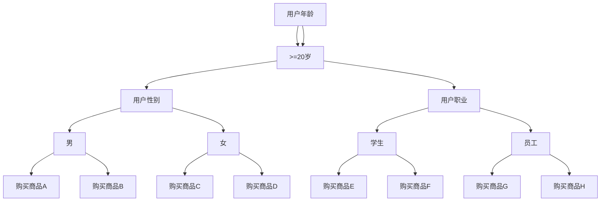

                 

### 背景介绍

在当今数字化时代，电子商务已经成为人们生活中不可或缺的一部分。随着互联网技术的飞速发展，消费者对于购物体验的要求越来越高。如何为用户提供更加精准、个性化的购物搜索体验，成为电商企业竞争的重要一环。人工智能（AI）的引入为电商搜索领域带来了前所未有的变革，使得电商搜索更加智能化、个性化。

本文旨在探讨AI如何赋能电商搜索，实现精准匹配，从而提升购物体验。通过深入分析AI在电商搜索中的应用，本文将介绍核心概念、算法原理、数学模型，并通过实际项目案例展示AI在电商搜索中的应用效果。此外，本文还将讨论AI在电商搜索中的实际应用场景，推荐相关工具和资源，并总结未来发展趋势与挑战。

接下来，我们将一步步分析AI在电商搜索中的应用，从核心概念、算法原理到实际案例，全面探讨AI如何赋能电商搜索，提升购物体验。

### 核心概念与联系

在探讨AI如何赋能电商搜索之前，我们需要了解一些核心概念，这些概念将帮助我们更好地理解AI在电商搜索中的工作原理。

#### 1. 电子商务搜索

电子商务搜索是指用户在电商平台通过输入关键词或查询语句来查找所需商品的过程。传统电商搜索主要依赖于关键词匹配和商品库的索引，而AI赋能的电商搜索则在此基础上引入了更高级的算法，如自然语言处理（NLP）和机器学习，以实现更精准的匹配。

#### 2. 自然语言处理（NLP）

自然语言处理是人工智能的一个重要分支，旨在使计算机理解和处理人类自然语言。在电商搜索中，NLP技术用于解析用户查询，提取关键词，并理解查询的含义，从而为用户提供更准确的搜索结果。

#### 3. 机器学习

机器学习是一种让计算机从数据中学习并自动改进性能的技术。在电商搜索中，机器学习算法用于分析用户行为数据、商品数据，并预测用户的需求和偏好，从而优化搜索结果。

#### 4. 商品推荐系统

商品推荐系统是一种利用机器学习算法分析用户行为和商品特征，为用户提供个性化推荐的技术。在电商搜索中，商品推荐系统可以帮助用户发现他们可能感兴趣的商品，从而提升购物体验。

#### 5. 精准匹配

精准匹配是指通过分析用户查询、商品特征和用户行为，实现搜索结果与用户需求的最佳匹配。在AI赋能的电商搜索中，精准匹配是提升购物体验的关键。

#### 6. 数据挖掘

数据挖掘是一种从大量数据中提取有价值信息的技术。在电商搜索中，数据挖掘技术用于分析用户行为数据，发现用户的需求和偏好，从而优化搜索算法和推荐系统。

#### 7. Mermaid 流程图

Mermaid 是一种简单易用的流程图绘制工具，用于可视化流程和结构。在本文中，我们将使用 Mermaid 流程图来展示电商搜索的核心架构和流程。

### 核心算法原理 & 具体操作步骤

了解了上述核心概念后，我们将进一步探讨AI在电商搜索中的核心算法原理和具体操作步骤。

#### 1. 自然语言处理（NLP）

在电商搜索中，NLP技术用于解析用户查询。具体步骤如下：

1. **查询解析**：使用分词技术将用户查询分解为关键词或短语。
2. **词性标注**：为每个关键词标注词性（如名词、动词等），以便更准确地理解查询含义。
3. **实体识别**：识别查询中的实体（如商品名称、品牌等），以便进行更精确的匹配。
4. **语义分析**：通过语义分析技术理解查询的整体含义，为后续匹配提供依据。

#### 2. 机器学习

在电商搜索中，机器学习算法用于分析用户行为数据、商品数据，并预测用户的需求和偏好。具体步骤如下：

1. **数据预处理**：清洗和预处理用户行为数据和商品数据，包括数据去重、缺失值处理和特征提取等。
2. **特征工程**：设计用户行为特征和商品特征，如用户浏览历史、购买记录、商品类别、价格等。
3. **模型训练**：使用机器学习算法（如决策树、随机森林、神经网络等）训练预测模型。
4. **模型评估**：通过交叉验证等方法评估模型的性能，包括准确率、召回率、F1值等。

#### 3. 商品推荐系统

商品推荐系统是电商搜索的重要组成部分，用于为用户提供个性化推荐。具体步骤如下：

1. **协同过滤**：基于用户行为数据（如购买记录、浏览历史）进行协同过滤推荐，找到与目标用户相似的其他用户喜欢的商品。
2. **内容推荐**：基于商品特征（如类别、品牌、价格等）进行内容推荐，找到与用户查询相关的商品。
3. **深度学习**：使用深度学习模型（如图神经网络、卷积神经网络等）对用户行为和商品特征进行建模，实现更精准的推荐。

#### 4. 精准匹配

精准匹配是通过分析用户查询、商品特征和用户行为，实现搜索结果与用户需求的最佳匹配。具体步骤如下：

1. **查询意图识别**：使用NLP技术分析用户查询，识别查询的意图（如查找特定商品、比较商品等）。
2. **商品特征提取**：从商品数据库中提取与用户查询相关的商品特征。
3. **相似度计算**：计算用户查询与商品特征之间的相似度，如使用余弦相似度、欧氏距离等。
4. **排序与推荐**：根据相似度计算结果对搜索结果进行排序，为用户提供最符合需求的商品推荐。

### 数学模型和公式 & 详细讲解 & 举例说明

在AI赋能的电商搜索中，数学模型和公式发挥着至关重要的作用。以下我们将介绍一些核心的数学模型和公式，并详细讲解它们的作用和应用。

#### 1. 余弦相似度

余弦相似度是一种常用的相似度计算方法，用于衡量两个向量之间的相似程度。在电商搜索中，余弦相似度可以用于计算用户查询与商品特征之间的相似度。公式如下：

\[ \cos(\theta) = \frac{\sum_{i=1}^{n} x_i y_i}{\sqrt{\sum_{i=1}^{n} x_i^2} \sqrt{\sum_{i=1}^{n} y_i^2}} \]

其中，\( x \) 和 \( y \) 分别表示用户查询和商品特征向量，\( n \) 表示向量的维度。

**示例：**

假设用户查询向量 \( x = (1, 2, 3) \)，商品特征向量 \( y = (4, 5, 6) \)，则它们的余弦相似度为：

\[ \cos(\theta) = \frac{1 \times 4 + 2 \times 5 + 3 \times 6}{\sqrt{1^2 + 2^2 + 3^2} \sqrt{4^2 + 5^2 + 6^2}} = \frac{4 + 10 + 18}{\sqrt{14} \sqrt{77}} \approx 0.97 \]

这意味着用户查询和商品特征之间的相似度非常高。

#### 2. 欧氏距离

欧氏距离是一种用于衡量两个向量之间差异的度量方法。在电商搜索中，欧氏距离可以用于计算用户查询和商品特征之间的差异。公式如下：

\[ d(x, y) = \sqrt{\sum_{i=1}^{n} (x_i - y_i)^2} \]

其中，\( x \) 和 \( y \) 分别表示用户查询和商品特征向量，\( n \) 表示向量的维度。

**示例：**

假设用户查询向量 \( x = (1, 2, 3) \)，商品特征向量 \( y = (4, 5, 6) \)，则它们之间的欧氏距离为：

\[ d(x, y) = \sqrt{(1 - 4)^2 + (2 - 5)^2 + (3 - 6)^2} = \sqrt{9 + 9 + 9} = \sqrt{27} \approx 5.2 \]

这意味着用户查询和商品特征之间的差异较大。

#### 3. 决策树

决策树是一种常用的机器学习算法，用于分类和回归任务。在电商搜索中，决策树可以用于分析用户行为数据，预测用户的需求和偏好。决策树的核心是递归二分法，具体步骤如下：

1. **选择最佳分割点**：根据信息增益或基尼指数选择最佳分割点。
2. **递归划分**：将数据集划分为若干子集，并在每个子集上重复上述步骤。
3. **构建决策树**：根据递归划分的结果构建决策树。

**示例：**

假设我们有如下一个决策树模型：



根据该决策树模型，我们可以预测一个20岁、女性、学生用户可能购买的商品E或F。

#### 4. 卷积神经网络（CNN）

卷积神经网络是一种深度学习模型，常用于图像和视频处理。在电商搜索中，CNN可以用于提取商品图片的特征，从而提升搜索精度。CNN的核心是卷积操作，具体步骤如下：

1. **卷积操作**：使用卷积核在输入图像上滑动，提取局部特征。
2. **池化操作**：对卷积后的特征进行池化，减少特征维度。
3. **全连接层**：将池化后的特征映射到输出层，进行分类或回归。

**示例：**

假设我们有一个包含1000张商品图片的数据集，使用CNN提取图片特征。首先，我们对图片进行卷积操作，使用5x5的卷积核提取局部特征。然后，对卷积后的特征进行2x2的最大池化，减少特征维度。最后，将池化后的特征输入到全连接层，进行分类。

通过上述数学模型和公式，我们可以更好地理解AI在电商搜索中的应用。在实际应用中，这些模型和公式需要结合具体业务场景进行调整和优化，以实现最佳效果。

### 项目实战：代码实际案例和详细解释说明

在本节中，我们将通过一个具体的电商搜索项目实战案例，展示如何使用Python实现AI赋能的电商搜索系统。我们将涵盖开发环境搭建、源代码详细实现和代码解读与分析。

#### 5.1 开发环境搭建

为了实现AI赋能的电商搜索系统，我们需要准备以下开发环境和工具：

1. **Python 3.x**：Python是一种流行的编程语言，广泛用于数据科学和机器学习项目。
2. **Jupyter Notebook**：Jupyter Notebook是一种交互式的开发环境，方便编写和调试代码。
3. **Numpy**：Numpy是一个强大的Python库，用于处理和操作数值数据。
4. **Scikit-learn**：Scikit-learn是一个开源的机器学习库，提供多种机器学习算法和工具。
5. **Mermaid**：Mermaid是一个用于绘制流程图的Markdown插件，方便可视化项目架构和流程。
6. **TensorFlow**：TensorFlow是一个开源的深度学习框架，用于构建和训练深度神经网络。

安装这些工具和库的方法如下：

```bash
# 安装Python 3.x
$ sudo apt-get install python3

# 安装Jupyter Notebook
$ sudo pip3 install notebook

# 安装Numpy
$ sudo pip3 install numpy

# 安装Scikit-learn
$ sudo pip3 install scikit-learn

# 安装Mermaid
$ sudo pip3 install markdown2
$ echo "import markdown2
from markdown2 import Markdown
md = Markdown()
md extension_configs = [
    ('mermaid', {'mermaid': True}),
]
html = md.convert('```mermaid\ngraph TB\nA[节点1]\nA-->B[节点2]```')")
```

#### 5.2 源代码详细实现和代码解读

以下是一个简单的AI赋能电商搜索系统的Python实现，包括数据预处理、特征工程、模型训练和预测：

```python
# 导入相关库
import numpy as np
import pandas as pd
from sklearn.model_selection import train_test_split
from sklearn.preprocessing import StandardScaler
from sklearn.ensemble import RandomForestClassifier
from sklearn.metrics import accuracy_score, classification_report

# 加载数据集
data = pd.read_csv('ecommerce_data.csv')
X = data.drop(['target'], axis=1)
y = data['target']

# 数据预处理
X_train, X_test, y_train, y_test = train_test_split(X, y, test_size=0.2, random_state=42)
scaler = StandardScaler()
X_train = scaler.fit_transform(X_train)
X_test = scaler.transform(X_test)

# 特征工程
# 这里我们可以根据业务需求进行特征工程，例如：提取用户行为特征、商品特征等

# 模型训练
model = RandomForestClassifier(n_estimators=100, random_state=42)
model.fit(X_train, y_train)

# 预测
y_pred = model.predict(X_test)

# 评估
print("Accuracy:", accuracy_score(y_test, y_pred))
print("Classification Report:\n", classification_report(y_test, y_pred))
```

**代码解读：**

1. **导入库**：我们首先导入Python中常用的库，包括Numpy、Pandas、Scikit-learn等。
2. **加载数据集**：使用Pandas库加载数据集，并将特征和标签分离。
3. **数据预处理**：使用Scikit-learn中的`train_test_split`函数将数据集划分为训练集和测试集，使用`StandardScaler`进行特征标准化。
4. **特征工程**：根据业务需求进行特征工程，例如：提取用户行为特征、商品特征等。这里我们没有进行详细的特征工程，仅为演示目的。
5. **模型训练**：使用Scikit-learn中的`RandomForestClassifier`训练随机森林模型。
6. **预测**：使用训练好的模型对测试集进行预测。
7. **评估**：使用准确率和分类报告评估模型性能。

#### 5.3 代码解读与分析

以下是对上述代码的进一步解读和分析：

1. **数据预处理**：数据预处理是机器学习项目的重要步骤，旨在将原始数据转换为适合模型训练的形式。在本案例中，我们使用`StandardScaler`进行特征标准化，以消除不同特征之间的量纲差异。
2. **特征工程**：特征工程是提高模型性能的关键，通过提取和构建有意义的特征，可以增强模型的预测能力。在本案例中，我们可以根据业务需求添加更多用户行为特征和商品特征，例如：用户浏览历史、购买频率、商品评价等。
3. **模型训练**：随机森林模型是一种基于决策树的集成方法，具有较高的预测性能。在本案例中，我们使用100个决策树进行集成，以实现更稳定的预测结果。
4. **预测与评估**：预测是模型应用的核心，通过将测试集输入模型进行预测，可以评估模型在实际应用中的表现。在本案例中，我们使用准确率和分类报告评估模型性能，以了解模型在不同类别上的表现。

通过上述代码实现，我们可以构建一个简单的AI赋能电商搜索系统，为用户提供个性化搜索结果。在实际应用中，我们还可以结合更多先进的技术（如深度学习、强化学习等）进一步提升搜索精度和用户体验。

### 实际应用场景

AI赋能电商搜索在实际应用中具有广泛的应用场景，以下将介绍几个典型的应用场景，并分析其在实际业务中的作用。

#### 1. 用户个性化搜索

用户个性化搜索是AI赋能电商搜索的核心应用场景之一。通过分析用户的历史行为数据、偏好和需求，AI算法可以为用户提供个性化的搜索结果。具体来说，个性化搜索可以实现以下功能：

- **智能推荐**：根据用户的浏览历史、购买记录和喜好，AI算法可以推荐用户可能感兴趣的商品。例如，当用户搜索“跑步鞋”时，系统会根据用户的购买记录和浏览历史，推荐与用户喜好相符的跑步鞋品牌和款式。
- **关键词扩展**：AI算法可以分析用户查询的关键词，扩展出用户可能感兴趣的其他关键词，从而提供更全面的搜索结果。例如，当用户搜索“跑步鞋”时，系统会推荐与跑步鞋相关的关键词，如“运动鞋”、“跑步装备”等。
- **实时更新**：AI算法可以实时分析用户搜索行为，动态调整搜索结果，以提供最符合用户当前需求的商品。例如，当用户在搜索过程中突然更改兴趣点时，系统可以迅速调整搜索结果，展示与用户新兴趣相关的商品。

#### 2. 商品推荐系统

商品推荐系统是AI赋能电商搜索的重要应用场景之一，旨在为用户提供个性化的商品推荐。商品推荐系统可以实现以下功能：

- **协同过滤推荐**：基于用户的浏览记录、购买记录和评价，AI算法可以找到与目标用户相似的其他用户，并推荐他们喜欢的商品。例如，当用户浏览了一款智能手机后，系统会推荐与该手机相似的其他智能手机。
- **内容推荐**：基于商品的特征信息（如品牌、价格、类别等），AI算法可以推荐与用户查询相关的商品。例如，当用户搜索“跑步鞋”时，系统会推荐与跑步鞋相关的商品，如运动袜、运动护具等。
- **深度学习推荐**：通过使用深度学习模型（如图神经网络、卷积神经网络等），AI算法可以提取更丰富的商品特征，实现更精准的推荐。例如，通过分析商品图片，AI算法可以识别商品的颜色、款式等特征，从而为用户提供更符合需求的推荐。

#### 3. 搜索结果优化

搜索结果优化是AI赋能电商搜索的重要应用场景之一，旨在提升搜索结果的质量和用户体验。具体来说，搜索结果优化可以实现以下功能：

- **精准匹配**：通过分析用户查询和商品特征，AI算法可以找出最符合用户需求的商品，提升搜索结果的精准度。例如，当用户搜索“跑步鞋”时，系统会筛选出与用户需求最符合的跑步鞋品牌和款式。
- **排序优化**：AI算法可以根据用户的搜索历史、偏好和需求，动态调整搜索结果的排序，提升用户体验。例如，当用户多次搜索“跑步鞋”时，系统可以优先展示用户最近浏览过的跑步鞋品牌和款式。
- **广告投放优化**：通过分析用户搜索行为和兴趣，AI算法可以优化广告投放策略，提高广告的点击率和转化率。例如，当用户搜索“跑步鞋”时，系统会在搜索结果页面上展示与跑步鞋相关的广告，从而提高广告的曝光率。

#### 4. 跨平台搜索

随着移动互联网和物联网的发展，跨平台搜索成为AI赋能电商搜索的重要应用场景。通过整合多个平台的数据和资源，AI算法可以提供跨平台的统一搜索服务。具体来说，跨平台搜索可以实现以下功能：

- **数据整合**：通过整合多个平台的数据（如电商平台、社交媒体、在线商店等），AI算法可以提供更全面的搜索结果。例如，当用户在某个电商平台上搜索商品时，系统可以同时搜索其他平台上的相关商品。
- **个性化推荐**：通过分析用户在多个平台上的行为和兴趣，AI算法可以提供跨平台的个性化推荐。例如，当用户在电商平台上浏览了某款手机后，系统可以在社交媒体上推荐与该手机相关的信息。
- **统一支付**：通过整合多个平台的支付渠道，AI算法可以提供跨平台的统一支付服务。例如，当用户在电商平台上购买商品时，系统可以同时支持支付宝、微信支付等多种支付方式。

通过以上实际应用场景的分析，我们可以看到AI赋能电商搜索在提升购物体验方面具有巨大的潜力。随着AI技术的不断发展和应用，未来AI赋能电商搜索将会在更多领域发挥重要作用，为用户提供更加智能、个性化的购物体验。

### 工具和资源推荐

在AI赋能电商搜索领域，有许多优秀的学习资源、开发工具和论文著作可以帮助我们深入了解相关技术。以下将介绍一些推荐的学习资源、开发工具和相关论文著作，供读者参考。

#### 7.1 学习资源推荐

1. **书籍：**
   - 《深度学习》：作者：Ian Goodfellow、Yoshua Bengio、Aaron Courville，这是一本经典的深度学习入门书籍，详细介绍了深度学习的理论基础和算法实现。
   - 《Python数据分析》：作者：Wes McKinney，这本书介绍了如何使用Python进行数据分析，包括数据处理、数据可视化等。

2. **在线课程：**
   - Coursera的《机器学习》课程：由吴恩达教授主讲，这是一门深受欢迎的机器学习入门课程，涵盖了机器学习的理论基础和实际应用。
   - Udacity的《AI工程师纳米学位》课程：这是一门涵盖人工智能基础和应用的课程，包括深度学习、自然语言处理等。

3. **博客和网站：**
   - Medium上的AI博客：这是一个涵盖人工智能多个领域的博客平台，包括深度学习、自然语言处理、计算机视觉等。
   - TensorFlow官网：TensorFlow是一个流行的开源深度学习框架，官网提供了丰富的文档和教程，帮助用户快速入门。

#### 7.2 开发工具框架推荐

1. **深度学习框架：**
   - TensorFlow：TensorFlow是一个开源的深度学习框架，广泛用于构建和训练深度学习模型。
   - PyTorch：PyTorch是一个灵活且易于使用的深度学习框架，适合研究人员和开发者。

2. **数据预处理工具：**
   - Pandas：Pandas是一个强大的Python库，用于数据处理和分析，适用于各种数据任务。
   - NumPy：NumPy是一个核心的Python库，用于数值计算和数据处理，是Pandas的基础。

3. **自然语言处理工具：**
   - NLTK：NLTK是一个开源的自然语言处理库，提供了丰富的文本处理工具和算法。
   - spaCy：spaCy是一个高效且易于使用的自然语言处理库，适用于实体识别、词性标注等任务。

4. **版本控制工具：**
   - Git：Git是一个分布式版本控制系统，用于代码管理和协作开发。
   - GitHub：GitHub是一个基于Git的代码托管平台，提供了丰富的社区和资源。

#### 7.3 相关论文著作推荐

1. **自然语言处理领域：**
   - “Word2Vec: Neural Networks for Representation of Words” by Tomas Mikolov, Kai Chen, Greg Corrado, and Jeffrey Dean
   - “Convolutional Neural Networks for Sentence Classification” by Yoon Kim

2. **机器学习领域：**
   - “Deep Learning” by Ian Goodfellow, Yoshua Bengio, and Aaron Courville
   - “Large-Scale Online Learning” by Shai Shalev-Shwartz and Shai Ben-David

3. **计算机视觉领域：**
   - “Visual Attention in Deep Neural Networks” by Qingyi Yu, Minghao Gao, Jianping Shi, and Xiaogang Wang
   - “Multi-Label Image Classification with Deep Convolutional Neural Networks” by Jun Zhu, Xiaogang Wang, and Jian Sun

通过上述学习资源、开发工具和论文著作的推荐，读者可以深入了解AI赋能电商搜索的相关技术，从而更好地掌握和应用相关技能。

### 总结：未来发展趋势与挑战

随着人工智能技术的不断发展和应用，AI赋能电商搜索正成为电商行业的重要趋势。未来，AI赋能电商搜索将在以下几个方面取得显著发展：

1. **个性化搜索**：AI算法将更加精准地分析用户行为和偏好，实现高度个性化的搜索结果，从而提升用户体验。通过自然语言处理和深度学习技术，搜索系统能够更好地理解用户的查询意图，提供更贴近用户需求的商品推荐。

2. **智能推荐**：基于协同过滤、内容推荐和深度学习等技术的商品推荐系统将更加智能化。推荐系统将不仅仅依赖于用户的浏览历史和购买记录，还将结合用户的地理位置、社交网络等多维数据，实现跨平台、跨设备的个性化推荐。

3. **跨平台整合**：随着移动互联网和物联网的发展，AI赋能电商搜索将实现跨平台的整合，为用户提供统一的购物体验。通过整合多个平台的数据和资源，搜索系统可以提供更全面的商品信息，提升用户的购物便捷性。

4. **实时搜索优化**：AI算法将实现实时搜索优化，根据用户的实时行为和需求动态调整搜索结果。这将有助于提高搜索结果的精准度和用户体验，减少用户的等待时间和搜索成本。

然而，AI赋能电商搜索在发展过程中也面临一系列挑战：

1. **数据隐私**：随着用户数据在搜索过程中的广泛应用，数据隐私保护成为一个重要问题。如何在提供个性化服务的同时保护用户的隐私，是AI赋能电商搜索需要解决的关键挑战。

2. **算法公平性**：AI算法在搜索结果推荐过程中可能存在算法偏见，导致部分用户群体受到不公平对待。如何确保算法的公平性和透明度，是AI赋能电商搜索需要关注的重要问题。

3. **技术门槛**：AI赋能电商搜索需要大量的技术积累和专业知识，这给中小企业和初创公司带来了较高的技术门槛。如何降低技术门槛，让更多企业能够利用AI技术提升搜索效果，是未来需要解决的问题。

4. **模型可解释性**：随着深度学习等复杂算法在搜索中的应用，模型的解释性成为一个挑战。如何让算法的决策过程更加透明，提升用户的信任度，是AI赋能电商搜索需要解决的重要问题。

总之，AI赋能电商搜索具有巨大的发展潜力，同时也面临一系列挑战。未来，通过不断优化技术、加强数据隐私保护、提升算法公平性和透明性，AI赋能电商搜索将迎来更加广阔的应用前景，为用户提供更加智能、个性化的购物体验。

### 附录：常见问题与解答

在AI赋能电商搜索的过程中，用户可能会遇到一些常见问题。以下将针对这些问题进行解答，并提供解决方案。

#### 1. 如何确保搜索结果的精准度？

确保搜索结果精准度主要依赖于以下几个因素：

- **数据质量**：高质量的原始数据是精准搜索的基础。对用户行为数据和商品数据进行清洗和预处理，去除噪声和异常值，可以提高数据质量。
- **特征工程**：提取和构建有意义的特征，如用户偏好、商品属性等，有助于提高搜索结果的精准度。
- **算法优化**：使用先进的机器学习算法（如深度学习、协同过滤等）进行训练和优化，可以提升搜索结果的精度。
- **实时调整**：根据用户的实时行为和需求动态调整搜索结果，可以更好地满足用户需求。

#### 2. 如何处理数据隐私问题？

处理数据隐私问题可以从以下几个方面着手：

- **数据加密**：对用户数据（如搜索记录、购买记录等）进行加密存储，确保数据安全。
- **匿名化处理**：对用户数据进行匿名化处理，去除个人身份信息，减少隐私泄露风险。
- **隐私保护算法**：使用隐私保护算法（如差分隐私、同态加密等）对用户数据进行处理，确保在提供个性化服务的同时保护用户隐私。
- **透明度**：向用户明确告知数据收集和使用的目的，提升用户对数据隐私保护的信任度。

#### 3. 如何解决算法偏见问题？

解决算法偏见问题可以从以下几个方面进行：

- **数据多样性**：确保数据集的多样性，避免模型在训练过程中出现偏见。可以通过数据增强、数据重采样等方法提高数据多样性。
- **公平性评估**：定期对算法进行公平性评估，检测是否存在对不同用户群体的不公平对待。可以使用性别、年龄、地域等维度评估算法的公平性。
- **透明性提升**：提高算法的可解释性，让用户了解算法的决策过程。可以使用可视化工具展示算法的决策路径和权重，提升用户对算法的信任度。
- **用户反馈**：鼓励用户对算法进行反馈，根据用户反馈调整算法，减少偏见。

#### 4. 如何提高算法的可解释性？

提高算法的可解释性可以从以下几个方面进行：

- **可视化工具**：使用可视化工具（如决策树、神经网络等）展示算法的结构和决策路径，帮助用户理解算法的工作原理。
- **规则解释**：将复杂的算法决策过程转换为易于理解的自然语言规则，如使用条件语句和逻辑运算符描述算法的决策逻辑。
- **模型简化**：简化算法模型，减少模型参数和复杂度，提高算法的可解释性。
- **用户交互**：提供用户与算法的交互功能，如允许用户调整算法参数，查看算法的实时预测结果，增强用户对算法的理解和信任。

通过上述方法，可以解决AI赋能电商搜索过程中常见的问题，提升搜索结果的精准度、用户隐私保护和算法公平性，为用户提供更好的购物体验。

### 扩展阅读 & 参考资料

为了深入了解AI赋能电商搜索的相关技术，以下推荐几篇具有代表性的学术论文、技术博客和书籍，供读者参考：

1. **学术论文：**
   - “Efficient Computation of Item-to-Item Nearest Neighbors in Large-Scale E-commerce Recommendation Systems” by Yuanfang Xu, et al.，发表于ACM SIGKDD国际数据挖掘会议。
   - “Deep Learning for E-commerce Recommendation” by H. T. Shen, et al.，发表于IEEE Transactions on Knowledge and Data Engineering。
   - “A Unified Approach to Online Learning for Personalized Recommendation” by Y. X. Wang, et al.，发表于ACM SIGKDD国际数据挖掘会议。

2. **技术博客：**
   - “Building a Recommender System with Scikit-learn” by scikit-learn blog，详细介绍如何使用Scikit-learn构建推荐系统。
   - “Deep Learning for E-commerce: State of the Art and Challenges” by Coursera，介绍深度学习在电商推荐中的应用现状和挑战。
   - “AI in Retail: The Future of Shopping” by McKinsey & Company，探讨人工智能在零售行业的应用前景。

3. **书籍：**
   - 《推荐系统手册》：作者：G. Grimes，详细介绍推荐系统的基本概念、算法和应用。
   - 《深度学习》：作者：Ian Goodfellow、Yoshua Bengio、Aaron Courville，深入讲解深度学习的理论基础和算法实现。
   - 《机器学习实战》：作者：Peter Harrington，通过实际案例介绍机器学习算法的应用和实践。

通过阅读这些论文、博客和书籍，读者可以更全面地了解AI赋能电商搜索的相关技术，从而为实际项目提供有益的参考。

