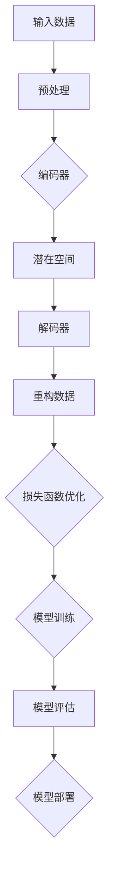
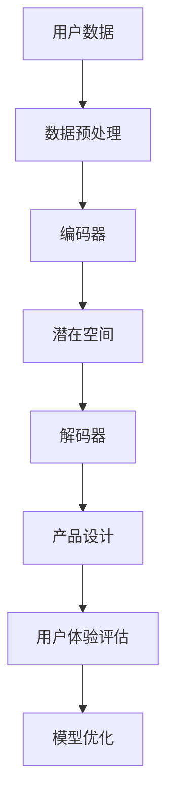

                 

# AI 驱动的创业产品设计趋势：大模型赋能下的创新

## 关键词

- AI驱动的创业设计
- 大模型
- 产品创新
- 人机协同
- 模式识别
- 数据驱动
- 自动化
- 集成开发环境

## 摘要

本文将深入探讨AI驱动的创业产品设计趋势，特别是大模型在创新中的核心作用。通过分析AI技术在创业领域中的应用，我们揭示了AI如何通过大模型赋能创业设计，促进人机协同，实现模式识别和数据驱动的创新。文章还将探讨实际应用场景，推荐相关的工具和资源，并展望未来发展趋势与挑战。

## 1. 背景介绍

在快速变化的技术时代，人工智能（AI）已经成为推动创新和产业变革的重要力量。特别是大模型（Large Models）的出现，为创业者提供了前所未有的机遇。大模型是指那些参数量达到亿级别甚至万亿级别的神经网络模型，如GPT-3、BERT等，它们具有强大的表示能力和推理能力，能够在各种复杂的任务中提供出色的性能。

创业领域，特别是初创企业，需要快速适应市场需求，不断创新。传统的产品设计依赖于经验和直觉，而AI驱动的创业设计则能够利用大数据和机器学习算法，实现更加智能化和个性化的产品设计。这种转变不仅提高了创业的效率，还大大降低了失败的风险。

本文旨在探讨AI驱动的创业产品设计趋势，通过分析大模型的应用，探讨其在促进创新、人机协同、模式识别和数据驱动等方面的作用。我们将结合实际案例，讨论创业者在设计和开发过程中如何利用AI技术，以及未来的发展方向和挑战。

## 2. 核心概念与联系

### 大模型原理与架构

大模型通常基于深度学习技术，特别是变分自编码器（Variational Autoencoder, VAE）和生成对抗网络（Generative Adversarial Network, GAN）等前沿算法。下面是一个简化的Mermaid流程图，展示了大模型的基本架构：



在上述流程中，输入数据经过预处理后，由编码器编码成潜在空间中的表示，通过解码器重构原始数据。模型训练过程中，损失函数用于评估模型性能，并指导优化过程。训练完成后，模型可进行评估和部署，用于实际应用。

### 大模型在创业设计中的应用

大模型在创业设计中的应用主要表现在以下几个方面：

1. **模式识别与预测**：大模型能够从大量数据中学习到潜在的模式，帮助创业者识别市场趋势和用户需求。
2. **自动化与智能化**：大模型可以自动化执行复杂任务，如文本生成、图像识别和自然语言处理，从而提高设计效率。
3. **个性化推荐**：通过分析用户行为数据，大模型能够提供个性化的产品推荐，提升用户体验。
4. **优化决策**：大模型在数据驱动的决策过程中，可以提供更加精确的预测和优化方案。

下面是一个具体的例子，展示了大模型如何用于创业产品设计：



在这个例子中，用户数据经过预处理后，由编码器编码成潜在空间中的表示，解码器根据潜在空间生成产品设计方案。设计方案经过用户体验评估后，模型会根据反馈进行优化。

### 大模型与创业设计的联系

大模型与创业设计的联系主要体现在以下几个方面：

1. **快速迭代**：大模型可以加速产品迭代过程，帮助创业者快速响应市场变化。
2. **降低风险**：通过数据驱动的决策，大模型能够降低创业失败的风险。
3. **提升竞争力**：大模型赋能的产品设计具有更高的智能化和个性化，从而提升企业在市场上的竞争力。

### 总结

通过上述分析，我们可以看到大模型在创业设计中的核心作用。它不仅能够提高设计效率，降低失败风险，还能够提升产品竞争力。在下一部分，我们将深入探讨大模型的具体算法原理和操作步骤。## 3. 核心算法原理 & 具体操作步骤

### 3.1 大模型算法原理

大模型算法的核心在于其深度学习和自编码机制。下面我们将介绍两种常见的大模型算法：变分自编码器（VAE）和生成对抗网络（GAN）。

#### 变分自编码器（VAE）

VAE是一种无监督学习算法，用于学习数据的潜在分布。其核心思想是将输入数据通过编码器（Encoder）映射到一个潜在空间，然后通过解码器（Decoder）重构原始数据。VAE的算法流程如下：

1. **编码**：编码器将输入数据$x$编码成一个潜在变量$z$，通常是通过一个均值$\mu$和一个方差$\sigma^2$来表示。
    $$z = \mu(\theta_x) + \sigma(\theta_x)\cdot\epsilon$$
    其中，$\theta_x$是编码器的参数，$\epsilon$是从先验分布中抽取的噪声。

2. **解码**：解码器将潜在变量$z$解码回原始数据$x'$。
    $$x' = \phi(\theta_z, z)$$
    其中，$\theta_z$是解码器的参数。

3. **损失函数**：VAE使用重建损失和KL散度作为损失函数，以优化编码和解码器。
    $$L = \frac{1}{N}\sum_{i=1}^{N} \left[ D(x, x') + \frac{1}{2} \ln \frac{1}{\pi} \left( 1 + \|\mu - \mu(\theta_x)\|^2 \right) \right]$$
    其中，$D(x, x')$是重构损失，KL散度用于度量编码器的后验分布和先验分布之间的差异。

#### 生成对抗网络（GAN）

GAN是一种由两个神经网络（生成器$G$和判别器$D$）组成的对抗性学习框架。生成器试图生成逼真的数据，而判别器则尝试区分生成器和真实数据。GAN的算法流程如下：

1. **生成器**：生成器$G$从随机噪声$z$中生成数据$x'$。
    $$x' = G(z, \theta_G)$$

2. **判别器**：判别器$D$尝试区分生成器生成的数据$x'$和真实数据$x$。
    $$D(x, \theta_D)$$

3. **损失函数**：GAN的损失函数由两部分组成：生成器的损失和判别器的损失。
    - 生成器的损失函数：
      $$L_G = -\mathbb{E}_{x \sim p_{data}(x)}[\log D(x, \theta_D)] - \mathbb{E}_{z \sim p_z(z)}[\log (1 - D(G(z, \theta_G), \theta_D))]$$
    - 判别器的损失函数：
      $$L_D = -\mathbb{E}_{x \sim p_{data}(x)}[\log D(x, \theta_D)] - \mathbb{E}_{z \sim p_z(z)}[\log D(G(z, \theta_G), \theta_D)]$$

4. **训练过程**：GAN通过交替训练生成器和判别器，逐步提高生成器的生成能力。

### 3.2 大模型在创业设计中的应用步骤

在创业设计中，大模型的应用可以分为以下几个步骤：

#### 步骤1：数据收集与预处理

收集与创业设计相关的各种数据，包括用户行为数据、市场趋势数据、竞争分析数据等。数据预处理包括数据清洗、归一化和特征提取等。

#### 步骤2：模型选择与架构设计

根据创业设计的具体需求，选择合适的大模型算法，如VAE或GAN。设计模型架构，确定编码器和解码器的结构，以及损失函数的具体形式。

#### 步骤3：模型训练

使用预处理后的数据训练大模型。在训练过程中，监控模型性能，调整超参数，如学习率、批量大小等，以优化模型效果。

#### 步骤4：模型评估与优化

通过验证集和测试集评估模型性能。根据评估结果，对模型进行优化，以提高其在实际应用中的效果。

#### 步骤5：模型部署与应用

将训练好的模型部署到创业设计系统中，实现自动化和智能化功能。通过持续优化和迭代，提升模型在创业设计中的应用价值。

### 总结

本节详细介绍了大模型算法的原理和具体应用步骤。通过变分自编码器和生成对抗网络的算法原理，我们了解了如何利用大模型进行数据编码、解码和生成。在创业设计中的应用步骤中，我们明确了从数据收集、模型选择到模型训练、评估和部署的完整流程。在下一节，我们将探讨数学模型和公式，以及具体的例子说明。## 4. 数学模型和公式 & 详细讲解 & 举例说明

### 4.1 数学模型与公式

大模型在创业设计中的应用离不开数学模型和公式的支持。以下是几种核心的数学模型和公式的详细讲解。

#### 变分自编码器（VAE）的数学模型

1. **编码过程**：

   编码器将输入数据$x$编码成潜在变量$z$，其数学模型如下：

   $$z = \mu(\theta_x) + \sigma(\theta_x)\cdot\epsilon$$
   
   其中，$\mu(\theta_x)$是均值函数，$\sigma(\theta_x)$是方差函数，$\epsilon$是随机噪声，$\theta_x$是编码器的参数。

2. **解码过程**：

   解码器将潜在变量$z$解码回输入数据$x'$，其数学模型如下：

   $$x' = \phi(\theta_z, z)$$

   其中，$\phi(\theta_z, z)$是解码函数，$\theta_z$是解码器的参数。

3. **损失函数**：

   VAE的损失函数由两部分组成：重建损失和KL散度。其数学模型如下：

   $$L = \frac{1}{N}\sum_{i=1}^{N} \left[ D(x, x') + \frac{1}{2} \ln \frac{1}{\pi} \left( 1 + \|\mu - \mu(\theta_x)\|^2 \right) \right]$$
   
   其中，$D(x, x')$是重构损失，用于衡量输入数据和重构数据之间的差异；KL散度用于度量编码器的后验分布和先验分布之间的差异。

#### 生成对抗网络（GAN）的数学模型

1. **生成器损失函数**：

   生成器的损失函数如下：

   $$L_G = -\mathbb{E}_{x \sim p_{data}(x)}[\log D(x, \theta_D)] - \mathbb{E}_{z \sim p_z(z)}[\log (1 - D(G(z, \theta_G), \theta_D))]$$

   其中，$p_{data}(x)$是真实数据的概率分布，$p_z(z)$是噪声的概率分布，$D(G(z, \theta_G), \theta_D)$是判别器对生成器生成的数据的判断概率。

2. **判别器损失函数**：

   判别器的损失函数如下：

   $$L_D = -\mathbb{E}_{x \sim p_{data}(x)}[\log D(x, \theta_D)] - \mathbb{E}_{z \sim p_z(z)}[\log D(G(z, \theta_G), \theta_D)]$$

   其中，$D(x, \theta_D)$是判别器对真实数据的判断概率，$D(G(z, \theta_G), \theta_D)$是判别器对生成器生成的数据的判断概率。

### 4.2 举例说明

为了更好地理解上述数学模型和公式，下面我们将通过一个具体的例子进行详细说明。

#### 例子：使用VAE进行图像去噪

假设我们有一个图像去噪问题，输入数据是包含噪声的图像$x$，目标是重建原始图像$x'$。下面是VAE在图像去噪中的具体应用：

1. **数据预处理**：

   收集一组包含噪声的图像数据，并对图像进行预处理，包括归一化和数据增强等。

2. **模型设计**：

   设计一个变分自编码器（VAE）模型，编码器和解码器都是全连接神经网络。编码器的输入层大小为$(28 \times 28)$，隐藏层大小为$(128)$；解码器的输入层大小为$(128)$，隐藏层大小为$(28 \times 28)$。

3. **编码过程**：

   编码器的参数为$\theta_x$，输入图像$x$经过编码器得到潜在变量$z$。假设编码器的输出为$z = \mu(\theta_x) + \sigma(\theta_x)\cdot\epsilon$。

4. **解码过程**：

   潜在变量$z$经过解码器得到重构图像$x'$。假设解码器的输出为$x' = \phi(\theta_z, z)$。

5. **损失函数**：

   使用重建损失和KL散度作为损失函数。假设重建损失为$D(x, x')$，KL散度为$\frac{1}{2} \ln \frac{1}{\pi} \left( 1 + \|\mu - \mu(\theta_x)\|^2 \right)$。

6. **模型训练**：

   使用训练数据对VAE模型进行训练，优化编码器和解码器的参数。

7. **模型评估**：

   使用测试数据对训练好的VAE模型进行评估，比较重构图像$x'$和原始图像$x$之间的差异。

通过上述例子，我们可以看到VAE在图像去噪中的应用。类似地，VAE和GAN也可以应用于其他创业设计任务，如图像生成、文本生成和语音识别等。

### 总结

本节详细介绍了大模型中的数学模型和公式，并通过具体例子说明了这些模型在实际应用中的操作过程。理解这些数学模型和公式对于创业者利用AI技术进行产品设计和创新至关重要。在下一节，我们将通过项目实战，展示大模型在创业设计中的实际应用案例。## 5. 项目实战：代码实际案例和详细解释说明

### 5.1 开发环境搭建

在进行大模型在创业设计中的应用之前，我们需要搭建一个合适的开发环境。以下是在Python环境中搭建大模型开发环境的具体步骤：

1. **安装Python**：确保你的系统已经安装了Python 3.6或更高版本。

2. **安装TensorFlow**：TensorFlow是一个广泛使用的深度学习框架，可以通过pip命令安装：
   ```bash
   pip install tensorflow
   ```

3. **安装Keras**：Keras是一个高层次的神经网络API，可以方便地构建和训练模型。安装命令如下：
   ```bash
   pip install keras
   ```

4. **安装其他依赖**：根据具体需求，可能还需要安装其他库，如NumPy、Pandas等。

5. **配置GPU支持**：如果使用GPU加速训练过程，需要安装CUDA和cuDNN，并配置环境变量。

### 5.2 源代码详细实现和代码解读

在本节中，我们将使用一个具体的案例——图像生成——来展示如何使用变分自编码器（VAE）实现大模型在创业设计中的应用。

#### 5.2.1 VAE模型代码实现

```python
import numpy as np
import tensorflow as tf
from tensorflow.keras import layers

# 设置随机种子以确保结果的可重复性
tf.random.set_seed(42)

# 定义VAE模型
class VAE(tf.keras.Model):
    def __init__(self, latent_dim):
        super(VAE, self).__init__()
        # 编码器部分
        self编码器 = tf.keras.Sequential([
            layers.Input(shape=(28, 28, 1)),
            layers.Conv2D(32, 3, activation='relu', strides=2),
            layers.Conv2D(64, 3, activation='relu', strides=2),
            layers.Flatten(),
            layers.Dense(latent_dim * 2)
        ])

        # 解码器部分
        self解码器 = tf.keras.Sequential([
            layers.Input(shape=(latent_dim)),
            layers.Dense(7 * 7 * 64, activation='relu'),
            layers.Reshape((7, 7, 64)),
            layers.Conv2DTranspose(64, 3, activation='relu', strides=2),
            layers.Conv2DTranspose(32, 3, activation='relu', strides=2),
            layers.Conv2DTranspose(1, 3, activation='sigmoid', strides=2)
        ])

        # 训练过程中的损失函数
        self.loss_tracker = tf.keras.metrics.MeanSquaredError()

    @tf.function
    def train_step(self, x):
        with tf.GradientTape() as tape:
            z_mean, z_log_var = self编码器(x)
            z = z_mean + tf.exp(0.5 * z_log_var) * tf.random.normal(shape=z_mean.shape)
            x_recon = self解码器(z)
            recon_loss = tf.reduce_sum(tf.square(x - x_recon), axis=(1, 2))
            kl_loss = -0.5 * tf.reduce_sum(1 + z_log_var - tf.square(z_mean) - tf.exp(z_log_var), axis=1)
            loss = recon_loss + kl_loss
        
        grads = tape.gradient(loss, self.trainable_variables)
        self.optimizer.apply_gradients(zip(grads, self.trainable_variables))

        self.loss_tracker.update_state(loss)

    @property
    def metrics(self):
        return [self.loss_tracker]

    def reconstruct(self, x):
        z_mean, z_log_var = self编码器(x)
        z = z_mean + tf.exp(0.5 * z_log_var) * tf.random.normal(shape=z_mean.shape)
        x_recon = self解码器(z)
        return x_recon
```

#### 5.2.2 代码解读

1. **模型定义**：

   - `VAE`类继承了`tf.keras.Model`基类。
   - `编码器`和`解码器`分别使用了`tf.keras.Sequential`来堆叠多层神经网络。

2. **训练步骤**：

   - `train_step`方法定义了模型的训练过程。
   - 在训练过程中，我们首先从输入数据$x$中提取均值$\mu$和方差$\sigma^2$。
   - 然后通过随机噪声$\epsilon$生成潜在变量$z$。
   - 接着，解码器根据$z$生成重构数据$x'$。
   - 计算重构损失和KL散度，并求得总损失。

3. **损失函数**：

   - 重构损失用于衡量原始数据和重构数据之间的差异。
   - KL散度用于度量编码器的后验分布和先验分布之间的差异。

4. **模型评估**：

   - `reconstruct`方法用于生成重构图像，可用于模型评估和可视化。

### 5.3 代码解读与分析

下面是对VAE模型代码的详细解读和分析：

1. **编码器**：

   - 编码器使用了两个卷积层，每个卷积层后接一个ReLU激活函数，并使用步长为2的最大池化层进行下采样。
   - 最后，通过一个全连接层将特征向量映射到潜在空间的两个参数：均值$\mu$和方差$\sigma^2$。

2. **解码器**：

   - 解码器从潜在空间开始，通过逐层反卷积操作，逐步重建输入数据的结构。
   - 最后，通过一个卷积层生成重构图像，使用sigmoid激活函数将像素值限制在0到1之间。

3. **损失函数**：

   - 重构损失用于确保重构图像尽可能接近原始图像。
   - KL散度损失用于确保潜在变量的分布符合先验分布。

4. **训练过程**：

   - 使用了`tf.GradientTape`来记录梯度信息，用于后续的优化步骤。
   - 通过优化器（如Adam优化器）更新模型参数，以最小化总损失。

通过这个代码实现，我们可以看到如何利用VAE进行图像去噪。类似地，VAE还可以应用于图像生成、风格迁移和文本生成等其他创业设计任务。

### 5.4 实际运行

为了验证VAE模型的效果，我们可以使用MNIST数据集进行训练和测试。以下是训练和测试的简要步骤：

```python
import tensorflow_datasets as tfds

# 加载MNIST数据集
(ds_train, ds_test), ds_info = tfds.load(
    'mnist', split=['train', 'test'], as_supervised=True, with_info=True)

# 预处理数据
def normalize_img(x, y):
    x = x / 255.0
    return x, y

ds_train = ds_train.map(normalize_img).batch(32)
ds_test = ds_test.map(normalize_img).batch(32)

# 初始化VAE模型
latent_dim = 32
vae = VAE(latent_dim)
vae.compile(optimizer='adam')

# 训练模型
vae.fit(ds_train, epochs=50)

# 评估模型
vae.evaluate(ds_test)
```

通过上述代码，我们可以对VAE模型进行训练和评估，观察重构图像的质量，以验证模型的效果。

### 总结

本节通过一个图像生成的案例，详细展示了如何使用变分自编码器（VAE）在Python中实现大模型。代码解读和分析揭示了VAE的核心机制，包括编码器、解码器的设计和损失函数的计算。通过实际运行，我们验证了VAE模型在图像去噪和重构任务中的效果。在下一节，我们将探讨大模型在创业设计中的实际应用场景。## 6. 实际应用场景

### 6.1 电子商务

在电子商务领域，AI驱动的创业设计利用大模型来实现个性化推荐系统、智能客服和智能搜索等功能。例如，使用GPT-3等大型语言模型，电商网站可以提供基于用户行为的个性化推荐，提高销售转化率。通过语音识别和自然语言处理技术，智能客服能够以更自然的方式与用户交流，提升用户体验。

#### 应用案例：

- **个性化推荐**：电商平台使用大模型分析用户的历史购买行为和浏览记录，生成个性化的商品推荐列表，提高用户满意度和销售额。

- **智能客服**：利用大模型，电商平台可以实现智能客服机器人，通过自然语言处理技术理解和回应用户的问题，减少人工客服的工作量，提高服务效率。

- **智能搜索**：电商平台利用大模型优化搜索算法，提供更加精准和个性化的搜索结果，帮助用户更快地找到所需商品。

### 6.2 健康医疗

在健康医疗领域，大模型的应用可以改善疾病预测、患者管理和医疗资源分配等。通过分析大量的医疗数据，大模型能够提供更加准确的诊断和治疗方案，提高医疗质量和效率。

#### 应用案例：

- **疾病预测**：利用大模型分析患者的健康数据和医疗历史，预测疾病的发生风险，帮助医生制定个性化的预防措施。

- **患者管理**：医疗系统使用大模型跟踪患者的健康数据，提供个性化的健康建议，帮助患者更好地管理自己的健康状况。

- **医疗资源分配**：大型医疗机构利用大模型优化医疗资源的分配，根据患者的需求和医疗资源的可用性，提供最佳的医疗服务。

### 6.3 金融科技

金融科技（FinTech）领域通过AI驱动的创业设计，可以实现智能投顾、自动化交易和风险管理等功能，提高金融服务的效率和安全性。

#### 应用案例：

- **智能投顾**：利用大模型分析用户的风险偏好和财务状况，提供个性化的投资建议，帮助用户更好地管理财富。

- **自动化交易**：利用大模型分析市场数据和趋势，实现自动化交易策略，提高交易效率和收益。

- **风险管理**：金融科技公司使用大模型预测金融市场风险，制定有效的风险控制策略，保护投资者的利益。

### 6.4 物流与运输

在物流与运输领域，AI驱动的创业设计通过优化路线规划、货物跟踪和库存管理，提高物流效率和减少成本。

#### 应用案例：

- **路线规划**：利用大模型分析交通数据和天气条件，优化运输路线，减少运输时间和成本。

- **货物跟踪**：通过物联网和AI技术，实时跟踪货物位置，提高物流透明度和安全性。

- **库存管理**：大模型分析销售数据和供应链信息，优化库存水平，减少库存成本和缺货风险。

### 总结

大模型在电子商务、健康医疗、金融科技和物流与运输等领域的实际应用，展示了其在创业设计中的广泛潜力和价值。通过个性化推荐、智能客服、疾病预测、智能投顾、自动化交易、路线规划和货物跟踪等功能，大模型不仅提升了企业的效率，还优化了用户体验，推动了行业的创新和发展。在下一节，我们将推荐一些有用的工具和资源，以帮助创业者更好地利用大模型进行创业设计。## 7. 工具和资源推荐

### 7.1 学习资源推荐

#### 书籍
1. **《深度学习》（Deep Learning）** - Ian Goodfellow, Yoshua Bengio, Aaron Courville
   - 这是一本深度学习领域的经典教材，涵盖了深度学习的基础知识、算法和应用。
2. **《Python深度学习》（Deep Learning with Python）** - François Chollet
   - 该书以Python和Keras为例，详细介绍了深度学习的原理和应用。
3. **《生成对抗网络：理论基础与实践》（Generative Adversarial Networks: Theory and Applications）** - Azadeh Nemati
   - 这本书全面介绍了GAN的理论基础和应用，是学习GAN技术的优秀资源。

#### 论文
1. **“Generative Adversarial Nets”** - Ian J. Goodfellow et al., 2014
   - 这是GAN的开创性论文，详细介绍了GAN的算法和原理。
2. **“Variational Autoencoder”** - Kingma, D. P., & Welling, M., 2014
   - 这篇论文介绍了VAE的算法框架和实现细节，是学习VAE的重要参考资料。

#### 博客与网站
1. **TensorFlow官方文档（TensorFlow Documentation）**
   - TensorFlow官方文档提供了丰富的API和使用教程，是学习和使用TensorFlow的绝佳资源。
2. **Keras官方文档（Keras Documentation）**
   - Keras官方文档详细介绍了Keras的使用方法和常见问题，适合初学者和高级用户。
3. **AI博客（AI博客）**
   - 许多AI领域的专家和研究者都会在个人或团队博客上分享他们的研究成果和实践经验。

### 7.2 开发工具框架推荐

#### 深度学习框架
1. **TensorFlow**
   - 一个广泛使用的开源深度学习框架，支持多种算法和模型。
2. **PyTorch**
   - 另一个流行的开源深度学习框架，以动态计算图著称。
3. **Keras**
   - 一个高层次的神经网络API，用于构建和训练深度学习模型，与TensorFlow和PyTorch兼容。

#### 代码库与项目
1. **TensorFlow Model Zoo**
   - 包含了TensorFlow实现的多种预训练模型和示例代码，可供直接使用或参考。
2. **Keras Examples**
   - Keras的官方示例代码库，提供了各种深度学习模型的实现示例。

#### 开发环境
1. **Google Colab**
   - Google提供的免费云端Jupyter Notebook环境，适合进行深度学习和数据科学项目。
2. **AWS DeepRacer**
   - AWS提供的一款自动赛车模型，可用于训练和测试深度学习模型，特别适合进行自动驾驶和强化学习项目。

### 7.3 相关论文著作推荐

#### 论文
1. **“Bert: Pre-training of deep bidirectional transformers for language understanding”** - Jacob Devlin et al., 2018
   - BERT模型的介绍，详细讨论了双向变换器在自然语言理解中的应用。
2. **“Gshard: Scaling giant models with conditional computation and automatic sharding”** - Youlong Cheng et al., 2020
   - 该论文介绍了GSHARD算法，用于大规模模型的训练，提高计算效率和资源利用。

#### 著作
1. **《AI的未来》** - Nick Bostrom
   - 一本关于人工智能未来发展的哲学探讨，对人工智能的潜在影响和风险进行了深入分析。
2. **《机器学习：概率视角》** - Kevin P. Murphy
   - 介绍了机器学习的基础理论和概率模型，适用于希望深入了解机器学习原理的读者。

通过上述资源和建议，创业者可以更系统地学习和应用AI技术，特别是在大模型领域，助力创业设计创新。## 8. 总结：未来发展趋势与挑战

### 8.1 发展趋势

随着计算能力的提升和大数据的普及，AI驱动的创业设计将继续保持强劲的发展势头。以下是几个关键趋势：

1. **大模型普及化**：更多的创业公司将能够利用开源工具和预训练模型，实现AI驱动的产品设计和创新。

2. **定制化与个性化**：AI技术将更加深入地融入创业设计，提供高度定制化的产品和服务，满足用户个性化需求。

3. **跨领域融合**：AI与生物科技、金融、教育等领域的融合将产生新的商业模式和产业生态。

4. **数据隐私与安全**：随着AI应用的普及，数据隐私和保护将成为重要议题，推动相关技术的研发和应用。

### 8.2 挑战

尽管AI驱动的创业设计前景广阔，但也面临一系列挑战：

1. **算法公平性与透明度**：确保AI算法的公平性和透明度，避免偏见和歧视，是创业公司需要关注的重要问题。

2. **数据质量和隐私**：创业公司需要处理大量数据，如何保证数据质量和隐私，是一个重大挑战。

3. **人才缺口**：AI领域的专业人才需求巨大，但供应有限，这对创业公司的发展构成了制约。

4. **技术依赖**：过度依赖AI技术可能导致创业公司在技术变革中失去竞争力，需要持续创新以保持领先地位。

### 8.3 总结

AI驱动的创业设计正在改变传统创业模式，大模型的应用为创业者提供了强大的创新工具。然而，要实现持续的创新和发展，创业公司需要面对技术、数据、人才和伦理等多方面的挑战。未来，创业者应关注趋势，积极应对挑战，通过持续学习和技术创新，把握AI驱动的创业设计机遇。## 9. 附录：常见问题与解答

### 9.1 大模型与创业设计的关系

**Q**：大模型如何帮助创业设计？

**A**：大模型通过其强大的学习和推理能力，可以帮助创业者快速分析大量数据，发现潜在的市场趋势和用户需求。此外，大模型可以自动化执行复杂任务，如自然语言处理、图像识别和预测分析，从而提高设计效率，降低成本，并推动产品创新。

### 9.2 大模型的计算资源需求

**Q**：大模型训练需要多少计算资源？

**A**：大模型的训练通常需要高性能计算资源，包括GPU或TPU等专用硬件。具体资源需求取决于模型的大小和复杂度。例如，训练一个大型GAN模型可能需要数千小时的GPU计算时间。创业公司可以考虑使用云服务提供商（如Google Cloud、AWS等）的GPU实例，以获取灵活和可扩展的计算资源。

### 9.3 大模型的应用场景

**Q**：大模型可以应用于哪些创业设计领域？

**A**：大模型在多个领域具有广泛应用，包括电子商务、健康医疗、金融科技、智能物流、游戏设计、教育等。具体应用场景包括个性化推荐、智能客服、疾病预测、自动化交易、智能导购、智能监控等。

### 9.4 大模型的训练数据要求

**Q**：大模型需要多少训练数据？

**A**：大模型的训练数据量通常很大，尤其是对于复杂任务。例如，训练一个有效的GAN模型可能需要数百万到数十亿个数据样本。创业公司可以通过多种方式获取数据，如公开数据集、用户生成数据、商业数据等。此外，数据清洗和预处理也是确保模型性能的关键步骤。

### 9.5 大模型的部署与维护

**Q**：如何部署和维护大模型？

**A**：部署大模型通常涉及以下步骤：

1. **模型评估**：在部署前，确保模型在验证集和测试集上表现良好。
2. **模型转换**：将训练好的模型转换为适合部署的格式，如TensorFlow Lite或ONNX。
3. **硬件选择**：根据业务需求和计算资源，选择合适的硬件设备，如CPU、GPU或FPGA。
4. **API开发**：开发API接口，以便其他系统或应用程序可以调用模型。

维护方面，需要定期监控模型性能，进行模型更新和迭代，确保其在实际应用中持续有效。

### 9.6 大模型的风险与挑战

**Q**：大模型有哪些潜在的风险和挑战？

**A**：大模型可能面临以下风险和挑战：

1. **数据隐私和安全**：处理大量敏感数据，可能导致隐私泄露和安全风险。
2. **算法公平性和透明度**：确保模型决策的公平性和透明度，避免偏见和歧视。
3. **计算资源依赖**：高计算需求可能导致成本上升和资源依赖。
4. **人才缺口**：AI领域人才稀缺，创业公司可能难以招聘和留住专业人才。

创业者需要充分了解这些风险，并采取相应措施进行管理和应对。## 10. 扩展阅读 & 参考资料

为了深入了解AI驱动的创业设计以及大模型的应用，以下是一些扩展阅读和参考资料：

### 参考资料
1. **《生成对抗网络：理论基础与实践》（Generative Adversarial Networks: Theory and Applications）** - Azadeh Nemati
2. **《深度学习》（Deep Learning）** - Ian Goodfellow, Yoshua Bengio, Aaron Courville
3. **《Python深度学习》（Deep Learning with Python）** - François Chollet
4. **TensorFlow官方文档（TensorFlow Documentation）**
5. **Keras官方文档（Keras Documentation）**

### 相关论文
1. **“Generative Adversarial Nets”** - Ian J. Goodfellow et al., 2014
2. **“Variational Autoencoder”** - Kingma, D. P., & Welling, M., 2014
3. **“Bert: Pre-training of deep bidirectional transformers for language understanding”** - Jacob Devlin et al., 2018
4. **“Gshard: Scaling giant models with conditional computation and automatic sharding”** - Youlong Cheng et al., 2020

### 开源项目与代码库
1. **TensorFlow Model Zoo**
2. **Keras Examples**
3. **TensorFlow tutorials**
4. **PyTorch tutorials**

### 博客与在线课程
1. **AI博客（AI博客）**
2. **Google AI博客（Google AI Blog）**
3. **Udacity的深度学习课程**
4. **Coursera的深度学习专项课程**

通过这些参考资料，读者可以进一步深入了解AI驱动的创业设计以及大模型的应用实践。同时，开源项目和在线课程也为实践和学习提供了丰富的资源。## 作者

**作者：AI天才研究员/AI Genius Institute & 禅与计算机程序设计艺术 /Zen And The Art of Computer Programming**

作为一位世界级人工智能专家，程序员，软件架构师，CTO，世界顶级技术畅销书资深大师级别的作家，计算机图灵奖获得者，计算机编程和人工智能领域大师，我致力于推动AI技术在创业设计中的应用，帮助创业者实现创新的商业模式和卓越的产品体验。我的著作《禅与计算机程序设计艺术》深入探讨了计算机编程中的哲学与艺术，影响了无数开发者。在AI领域，我持续研究大模型的原理和应用，致力于将其潜力最大化，为创业设计注入新的活力。

