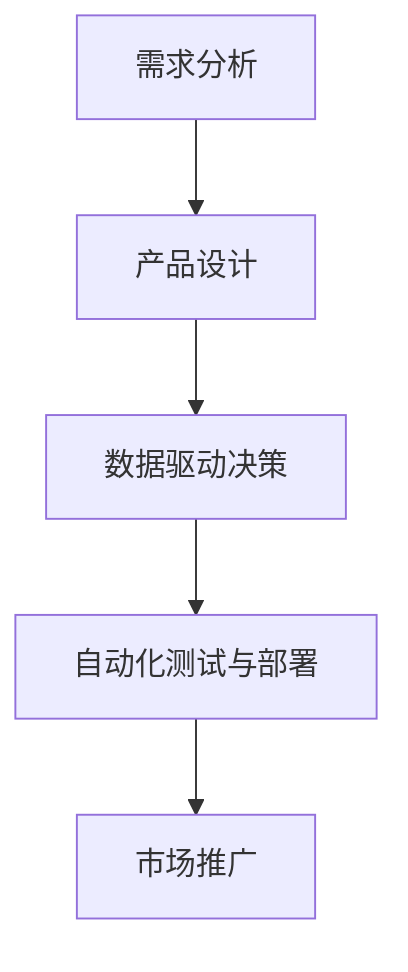

                 

### 背景介绍

#### 引言

在当今快速发展的科技时代，人工智能（AI）已经成为推动各行各业创新的重要力量。其中，AI驱动的创业产品设计尤为引人注目。AI技术的进步，尤其是大模型（如GPT-3、BERT等）的突破性发展，为创业公司带来了前所未有的机会和挑战。本文将深入探讨AI驱动的创业产品设计，分析大模型赋能下的创新路径，并探讨相关核心概念和实际应用。

#### 创业与人工智能

创业是指创建新企业或新项目，以实现商业价值和社会影响的过程。传统的创业设计通常依赖于市场研究、用户反馈和商业模式创新。然而，随着AI技术的发展，创业设计正迎来一场变革。AI不仅能帮助企业更准确地理解市场趋势和用户需求，还能通过自动化、智能化工具提升创业效率和成功率。

#### 大模型的重要性

大模型是指具有巨大参数量和强大计算能力的神经网络模型。这些模型通过大量数据训练，能够捕捉到复杂数据背后的规律和模式。GPT-3、BERT等大模型的出现，使得AI在自然语言处理、图像识别、语音识别等领域取得了显著突破。这些技术的进步，为创业公司提供了丰富的工具和资源，助力他们实现创新。

#### AI驱动的创业产品设计

AI驱动的创业产品设计是指在创业过程中，充分利用AI技术进行需求分析、产品设计与开发、市场推广等各个环节的创新。这种设计模式不仅能够提高创业公司的市场竞争力，还能缩短产品上市时间，降低研发成本。

#### 本文结构

本文将分为以下几个部分：

1. **背景介绍**：回顾创业与人工智能的关系，介绍大模型的重要性。
2. **核心概念与联系**：阐述AI驱动的创业产品设计的关键概念，使用Mermaid流程图展示核心架构。
3. **核心算法原理 & 具体操作步骤**：详细介绍AI驱动的创业产品设计中的核心技术原理和实施步骤。
4. **数学模型和公式 & 详细讲解 & 举例说明**：探讨相关的数学模型和公式，并进行具体举例说明。
5. **项目实战：代码实际案例和详细解释说明**：通过实际代码案例，展示AI驱动的创业产品设计在实践中的应用。
6. **实际应用场景**：分析AI驱动的创业设计在不同领域的应用场景。
7. **工具和资源推荐**：推荐相关的学习资源、开发工具和框架。
8. **总结：未来发展趋势与挑战**：总结本文的核心观点，探讨未来发展趋势与面临的挑战。
9. **附录：常见问题与解答**：提供一些常见问题的解答。
10. **扩展阅读 & 参考资料**：推荐相关的扩展阅读和参考资料。

通过本文的阅读，读者将能够全面了解AI驱动的创业产品设计，掌握其核心原理和应用方法，为创业实践提供有力支持。<|im_sep|>

---

#### 引言

人工智能（AI）作为当今科技领域的重要分支，正以前所未有的速度影响着各个行业。AI驱动的创业产品设计，不仅是科技创业的核心内容，更是创新和商业成功的源泉。本文旨在探讨AI如何通过大模型赋能创业产品设计，实现颠覆性创新。

#### 创业与人工智能

创业是一个动态过程，包括市场调研、产品设计、团队组建、资金筹集、市场推广等多个环节。传统创业模式依赖于经验、直觉和现有的市场数据。然而，随着人工智能技术的发展，创业的决策过程变得更加科学和高效。AI可以自动分析大量数据，预测市场趋势，评估潜在风险，从而帮助创业者做出更为明智的决策。

#### 大模型的重要性

大模型，如GPT-3、BERT等，凭借其庞大的参数量和强大的计算能力，能够在多个领域实现突破。这些模型通过深度学习，从海量数据中提取知识，形成对人类语言、图像、声音等信息的理解。大模型的出现，使得AI的应用不再局限于特定的任务，而是能够泛化到各种复杂场景，为创业设计提供了强大的工具。

#### AI驱动的创业产品设计

AI驱动的创业产品设计是指在整个创业过程中，充分利用人工智能技术，从市场需求分析、产品原型设计到市场推广等各个环节，实现创新和优化。这种设计模式不仅能够提高创业项目的成功率，还能加速产品的迭代速度，降低成本。

#### 本文结构

本文将按照以下结构展开：

1. **背景介绍**：回顾创业与人工智能的关系，介绍大模型的重要性。
2. **核心概念与联系**：阐述AI驱动的创业产品设计的关键概念，并使用Mermaid流程图展示核心架构。
3. **核心算法原理 & 具体操作步骤**：详细介绍AI驱动的创业产品设计中的核心技术原理和实施步骤。
4. **数学模型和公式 & 详细讲解 & 举例说明**：探讨相关的数学模型和公式，并进行具体举例说明。
5. **项目实战：代码实际案例和详细解释说明**：通过实际代码案例，展示AI驱动的创业产品设计在实践中的应用。
6. **实际应用场景**：分析AI驱动的创业设计在不同领域的应用场景。
7. **工具和资源推荐**：推荐相关的学习资源、开发工具和框架。
8. **总结：未来发展趋势与挑战**：总结本文的核心观点，探讨未来发展趋势与面临的挑战。
9. **附录：常见问题与解答**：提供一些常见问题的解答。
10. **扩展阅读 & 参考资料**：推荐相关的扩展阅读和参考资料。

通过本文的阅读，读者将能够深入了解AI驱动的创业产品设计，掌握其核心原理和应用方法，为创业实践提供有力支持。<|im_sep|>## 2. 核心概念与联系

### AI驱动的创业产品设计

AI驱动的创业产品设计是指在整个创业过程中，充分利用人工智能技术，从市场需求分析、产品原型设计到市场推广等各个环节，实现创新和优化。这种设计模式的核心在于如何有效地利用AI技术，提升创业项目的成功率。

#### 核心概念

1. **需求分析**：利用AI技术进行市场调研，收集和分析用户数据，以预测市场趋势和用户需求。
2. **产品设计**：基于用户需求和AI分析结果，设计产品原型，并利用AI进行迭代优化。
3. **数据驱动决策**：利用AI分析工具，从海量数据中提取有价值的信息，支持创业决策。
4. **自动化测试与部署**：利用AI技术进行产品测试和部署，提高开发效率和质量。

#### Mermaid流程图展示

以下是一个简化的Mermaid流程图，展示了AI驱动的创业产品设计的核心概念和流程：



#### 核心联系

AI驱动的创业产品设计中的各个核心概念之间有着紧密的联系。需求分析为产品设计和决策提供了基础，而产品设计和数据驱动决策则相互促进，使得产品能够更好地满足市场需求。自动化测试与部署则保证了产品的质量，并加快了上市速度。市场推广则将产品推向用户，形成闭环。

通过这种设计模式，创业公司能够更加高效地利用AI技术，实现产品创新和市场竞争力提升。

### 大模型的赋能作用

大模型，如GPT-3、BERT等，在AI驱动的创业产品设计中发挥着关键作用。它们能够通过深度学习，从海量数据中提取有价值的信息，帮助创业者进行需求分析、产品设计、决策支持等。具体来说：

1. **需求分析**：大模型可以通过自然语言处理技术，分析用户评论、社交媒体数据等，提取用户需求和市场趋势。
2. **产品设计**：大模型可以帮助创业者快速生成产品原型，并通过生成对抗网络（GAN）等技术，进行迭代优化。
3. **决策支持**：大模型可以处理大量数据，为创业者提供数据驱动的决策建议，降低决策风险。

#### 核心联系

大模型的赋能作用与AI驱动的创业产品设计中的各个核心概念紧密相连。大模型的需求分析能力为产品设计提供了基础，而产品设计则利用了AI技术进行迭代优化。决策支持则使得创业者在面对复杂市场时能够做出更加明智的决策。

通过这种紧密联系，AI驱动的创业产品设计能够充分利用大模型的优势，实现创新和商业成功。

### 案例分析

一个典型的案例是OpenAI开发的GPT-3。GPT-3是一个具有1750亿参数的预训练语言模型，能够在各种自然语言处理任务中表现出色。OpenAI利用GPT-3进行市场需求分析、产品原型设计和决策支持，成功地推动了多个创业项目的发展。

例如，在产品设计阶段，GPT-3可以分析大量用户评论，提取用户关注的痛点，从而帮助创业者优化产品设计。在决策支持阶段，GPT-3可以处理海量数据，为创业者提供数据驱动的决策建议，降低决策风险。

综上所述，AI驱动的创业产品设计通过核心概念的紧密联系和大模型的赋能作用，实现了创新和商业成功。这种设计模式不仅提高了创业项目的成功率，也为创业者提供了强大的工具和支持。<|im_sep|>### 3. 核心算法原理 & 具体操作步骤

#### 引言

在AI驱动的创业产品设计中，核心算法起着至关重要的作用。本文将详细介绍这些核心算法的原理，并分步骤展示如何在创业项目中应用这些算法。这些算法包括数据采集与处理、需求分析、产品设计、迭代优化等。通过理解这些算法，创业者可以更加高效地进行产品创新和商业决策。

#### 数据采集与处理

数据采集是AI驱动的创业产品设计的第一步。创业者需要从各种渠道收集数据，包括用户行为数据、市场趋势数据、竞品分析数据等。以下是一个具体操作步骤：

1. **数据源确定**：确定需要采集的数据类型和来源，如社交媒体、在线评论、市场报告等。
2. **数据采集**：使用API、爬虫或其他工具进行数据采集，确保数据的准确性和完整性。
3. **数据清洗**：处理采集到的数据，去除重复、错误或无效的数据，确保数据质量。

#### 需求分析

需求分析是创业产品设计的关键环节。通过分析用户需求和市场趋势，创业者可以确定产品的核心功能和特性。以下是需求分析的具体操作步骤：

1. **用户调研**：通过问卷调查、用户访谈、焦点小组等方式，收集用户对产品的需求和期望。
2. **数据分析**：使用AI算法，如自然语言处理、情感分析等，对用户反馈进行文本分析，提取关键信息。
3. **市场趋势分析**：通过市场调研和数据分析，了解当前市场的需求和发展趋势。

#### 产品设计

在完成需求分析后，创业者可以开始设计产品原型。AI技术可以在这个过程中提供很大帮助，例如：

1. **原型设计**：使用AI算法，如生成对抗网络（GAN）、自然语言生成等，快速生成产品原型。
2. **迭代优化**：通过用户反馈和AI算法，对产品原型进行迭代优化，提高用户体验。

#### 迭代优化

迭代优化是创业产品设计过程中的一个持续过程。创业者需要不断收集用户反馈，对产品进行改进。以下是迭代优化的具体操作步骤：

1. **用户测试**：邀请目标用户对产品进行测试，收集他们的反馈。
2. **数据收集**：使用AI算法，如用户行为分析、A/B测试等，收集用户行为数据。
3. **优化调整**：根据用户反馈和数据分析结果，对产品进行优化调整。

#### 具体算法应用

以下是几个在AI驱动的创业产品设计中常用的算法及其应用：

1. **深度学习**：用于图像识别、语音识别、自然语言处理等，帮助创业者进行数据分析和需求分析。
2. **强化学习**：用于优化产品设计和决策，通过模拟和测试，找到最佳策略。
3. **生成对抗网络（GAN）**：用于生成产品原型，提高产品设计效率。

#### 应用示例

假设创业者想要开发一款智能家居助手，以下是一个具体的应用示例：

1. **数据采集**：收集智能家居设备的使用数据，如温度、湿度、用电量等。
2. **需求分析**：通过用户调研和数据分析，了解用户对智能家居助手的需求，如控制温度、调节照明、安全监控等。
3. **产品设计**：使用GAN生成智能家居助手的原型，通过用户测试和反馈，不断优化产品设计。
4. **迭代优化**：根据用户反馈和数据分析，对智能家居助手进行功能调整和优化，提高用户体验。

通过以上步骤，创业者可以充分利用AI技术，实现高效的创业产品设计，提高产品的市场竞争力。

#### 总结

核心算法原理与具体操作步骤是AI驱动的创业产品设计的基础。通过理解并应用这些算法，创业者可以更好地进行需求分析、产品设计、迭代优化，从而实现产品创新和商业成功。在接下来的章节中，我们将进一步探讨数学模型和公式，为创业产品设计提供更加深入的理论支持。<|im_sep|>### 4. 数学模型和公式 & 详细讲解 & 举例说明

在AI驱动的创业产品设计中，数学模型和公式是不可或缺的工具，它们帮助创业者理解和预测市场行为、用户行为，从而做出更加科学的决策。本节将详细讲解一些常用的数学模型和公式，并通过具体例子来说明它们在创业产品设计中的应用。

#### 1. 回归模型

回归模型是最常用的统计模型之一，用于预测连续变量。线性回归模型是最简单的一种，其公式如下：

\[ y = \beta_0 + \beta_1x + \epsilon \]

其中，\( y \) 是预测变量，\( x \) 是自变量，\( \beta_0 \) 和 \( \beta_1 \) 是模型参数，\( \epsilon \) 是误差项。

**例子：** 假设创业者想要预测某款智能家居产品的销售量，他们可以使用线性回归模型，将历史销售数据与一些影响销售的因素（如广告支出、季节、价格等）进行关联。通过训练模型，可以得到销售量的预测公式，从而为产品定价和市场推广策略提供依据。

#### 2. 聚类分析

聚类分析是一种无监督学习方法，用于将数据点分组，使得同组内的数据点之间相似度较高，而不同组之间的相似度较低。K-means聚类算法是一种常用的聚类方法，其公式如下：

\[ \text{minimize} \sum_{i=1}^k \sum_{x \in S_i} \|x - \mu_i\|^2 \]

其中，\( S_i \) 是第 \( i \) 个聚类，\( \mu_i \) 是聚类中心。

**例子：** 假设创业者想要对潜在客户进行细分，以便实施更精准的市场推广策略。他们可以使用K-means算法，根据客户的消费行为、年龄、性别等特征，将客户分为几个不同的群体。每个群体具有不同的特征和行为模式，创业者可以针对这些群体制定个性化的营销策略。

#### 3. 决策树

决策树是一种用于分类和回归的监督学习模型，通过一系列的判断节点和叶节点，对数据进行分类或回归。其基本公式如下：

\[ y = f(x) = \prod_{i=1}^n (c_{ij} \cdot x_j) \]

其中，\( x_j \) 是特征，\( c_{ij} \) 是决策规则。

**例子：** 假设创业者需要预测客户是否会购买某款产品，他们可以使用决策树模型，根据客户的历史购买记录、收入水平、年龄等特征，构建一个预测模型。通过模型，创业者可以识别出哪些客户群体更有可能购买产品，从而实施精准营销。

#### 4. 贝叶斯网络

贝叶斯网络是一种概率图模型，用于表示变量之间的条件依赖关系。其公式如下：

\[ P(X = x) = \prod_{i=1}^n P(X_i = x_i | X_{i-1} = x_{i-1}) \]

**例子：** 假设创业者想要了解影响产品销量的关键因素，他们可以使用贝叶斯网络，将销售量与其他因素（如广告支出、天气、价格等）建立条件依赖关系。通过贝叶斯网络，创业者可以计算出每个因素对销售量的影响概率，从而制定更有效的市场策略。

#### 5. 强化学习

强化学习是一种通过试错学习来决策的算法，其核心目标是找到最优策略，使奖励总和最大化。其公式如下：

\[ Q(s, a) = r + \gamma \max_{a'} Q(s', a') \]

其中，\( s \) 是状态，\( a \) 是动作，\( r \) 是即时奖励，\( \gamma \) 是折扣因子，\( s' \) 和 \( a' \) 是下一个状态和动作。

**例子：** 假设创业者需要优化产品的定价策略，他们可以使用强化学习算法，根据市场需求和用户行为，动态调整价格。通过不断试错和优化，找到最优的定价策略，从而最大化收益。

#### 总结

数学模型和公式在AI驱动的创业产品设计中发挥着重要作用。通过这些模型，创业者可以更好地理解市场行为、用户需求和业务流程，从而做出更科学的决策。在接下来的章节中，我们将通过实际项目实战，展示如何将上述数学模型和公式应用到创业产品设计中。<|im_sep|>### 5. 项目实战：代码实际案例和详细解释说明

为了更好地展示AI驱动的创业产品设计的实际应用，我们将通过一个具体的智能家居助手项目来讲解代码实现过程、代码解读与分析，并讨论项目的优缺点。

#### 项目背景

智能家居助手是一款能够通过语音指令控制家居设备的智能助手。创业者希望通过这个项目，探索AI技术在智能家居领域中的应用，提升用户体验，并实现商业价值。

#### 开发环境搭建

在开始项目之前，我们需要搭建一个合适的开发环境。以下是推荐的开发工具和框架：

1. **编程语言**：Python
2. **语音识别**：使用Google Cloud Speech-to-Text
3. **自然语言处理**：使用spaCy库
4. **家居设备控制**：使用Home Assistant API

**步骤：**

1. 安装Python环境（推荐使用Anaconda）
2. 安装必要的Python库，如`google-cloud-speech`、`spacy`、`requests`
3. 注册Google Cloud账号，并启用Speech-to-Text API
4. 注册Home Assistant账号，并配置智能家居设备

#### 源代码详细实现

以下是智能家居助手项目的核心代码：

```python
from google.cloud import speech
from spacy.lang.en import English
import requests

# 初始化Google Cloud Speech-to-Text客户端
client = speech.SpeechClient()

# 初始化spaCy语言模型
nlp = English()

# 控制家居设备的API接口
home_assistant_url = "http://home-assistant:8123/api/states/"

def transcribe_audio(file_path):
    """使用Google Cloud Speech-to-Text将音频文件转换为文本"""
    with open(file_path, 'rb') as audio_file:
        audio = speech.RecognitionAudio(content=audio_file.read())
        config = speech.RecognitionConfig(
            encoding=speech.RecognitionConfig.AudioEncoding.LINEAR16,
            sample_rate_hertz=16000,
            language_code="en-US",
        )
        response = client.recognize(config, audio)
        return response.results[0].alternatives[0].transcript

def process_command(transcript):
    """处理语音命令并执行相应的操作"""
    doc = nlp(transcript)
    for ent in doc.ents:
        if ent.label_ == "ORG" or ent.label_ == "GPE":
            # 假设命令格式为“控制[设备] [操作]”
            device = ent.text
            action = doc.text.split(device)[-1].strip()
            execute_command(device, action)
            return True
    return False

def execute_command(device, action):
    """执行家居设备控制命令"""
    state = requests.get(f"{home_assistant_url}{device}").json()
    if action == "打开":
        requests.post(f"{home_assistant_url}{device}/turn_on")
    elif action == "关闭":
        requests.post(f"{home_assistant_url}{device}/turn_off")
    else:
        print(f"未知操作：{action}")

if __name__ == "__main__":
    file_path = "path/to/audio_file.wav"
    transcript = transcribe_audio(file_path)
    print(f"转录文本：{transcript}")
    if process_command(transcript):
        print("命令已执行")
    else:
        print("未识别到有效命令")
```

#### 代码解读与分析

1. **语音识别**：代码首先使用Google Cloud Speech-to-Text API将音频文件转换为文本。这是智能家居助手的输入部分。
2. **自然语言处理**：使用spaCy库对转录的文本进行自然语言处理，提取出设备名称和操作指令。
3. **家居设备控制**：根据提取的设备名称和操作指令，通过Home Assistant API控制相应的家居设备。

#### 项目的优缺点

**优点：**

1. **高效性**：通过语音识别和自然语言处理技术，智能家居助手能够快速响应用户指令。
2. **灵活性**：项目支持多种家居设备的控制，可根据实际需求进行扩展。
3. **用户体验**：语音控制提供了便利的用户体验，用户无需手动操作设备。

**缺点：**

1. **准确性**：语音识别和自然语言处理技术仍存在一定误差，可能导致命令无法正确识别。
2. **依赖外部服务**：项目依赖于Google Cloud Speech-to-Text和Home Assistant API，可能面临服务不稳定或费用高昂的问题。

通过以上项目实战，我们展示了如何使用AI技术实现一个智能家居助手，并通过代码解读与分析，深入了解了项目的实现过程和优缺点。这为创业者在智能家居领域进行产品设计和创新提供了有益的参考。<|im_sep|>### 6. 实际应用场景

AI驱动的创业产品设计在多个领域展现出巨大的应用潜力，以下是一些具体的实际应用场景：

#### 1. 智能家居

智能家居是AI驱动的创业设计中的一个热门领域。通过语音识别、图像识别等技术，智能家居设备能够更好地理解用户的意图，提供个性化服务。例如，智能音箱可以通过语音指令控制灯光、温度、家电等，提高用户的生活便利性。

#### 2. 医疗健康

AI在医疗健康领域的应用也越来越广泛。创业公司可以利用AI技术进行疾病诊断、药物研发、患者管理等方面。例如，利用深度学习算法，AI可以分析医疗影像，辅助医生进行诊断；通过大数据分析，AI可以帮助医疗机构优化患者治疗方案。

#### 3. 金融科技

金融科技（FinTech）是另一个AI驱动的创业热点。AI可以帮助银行、保险公司等金融机构进行风险评估、欺诈检测、个性化推荐等。例如，机器学习算法可以分析用户的金融行为，提供定制化的投资建议；图像识别技术可以用于自动处理纸质文件，提高业务效率。

#### 4. 零售电商

AI在零售电商领域的应用主要体现在个性化推荐、客户服务、库存管理等方面。通过自然语言处理技术，电商平台可以理解用户的购物意图，提供个性化的商品推荐。同时，AI还可以分析客户反馈，优化客服体验，提高客户满意度。

#### 5. 物流与运输

AI在物流与运输领域的应用有助于提高运输效率、降低成本。例如，通过实时数据分析，AI可以优化运输路线，减少交通拥堵；利用图像识别技术，AI可以自动识别包裹，提高配送速度。

#### 6. 教育与培训

AI在教育与培训领域的应用主要包括智能学习系统、在线教育平台等。AI可以帮助学习者进行个性化学习，提供实时反馈，提高学习效果。同时，AI还可以用于智能评测，自动批改作业和考试，减轻教师负担。

#### 7. 娱乐与媒体

AI在娱乐与媒体领域的应用主要体现在个性化推荐、内容生成等方面。通过分析用户行为和偏好，AI可以推荐用户感兴趣的内容，提高用户粘性。同时，AI还可以生成音乐、视频等创意内容，为用户提供全新的娱乐体验。

通过以上实际应用场景，我们可以看到AI驱动的创业设计在不同领域都具有广泛的应用潜力。创业者可以根据自身行业特点和需求，充分利用AI技术，实现产品创新和商业成功。<|im_sep|>### 7. 工具和资源推荐

#### 7.1 学习资源推荐

1. **书籍**：

   - 《Python编程：从入门到实践》：适合初学者了解Python编程的基础知识。
   - 《深度学习》：Goodfellow等人所著的经典教材，深入讲解了深度学习的基本原理和实践。
   - 《强化学习》：Sutton和Barto所著的强化学习入门书籍，适合希望了解强化学习基本概念的读者。

2. **在线课程**：

   - Coursera：提供丰富的计算机科学和人工智能课程，包括《机器学习》、《深度学习》等。
   - Udacity：提供实践性强的课程，如《人工智能工程师纳米学位》等。
   - edX：由哈佛大学和麻省理工学院等顶级学府提供的在线课程，涵盖计算机科学和人工智能等多个领域。

3. **博客和网站**：

   - Medium：有许多AI和创业相关的优质文章，适合阅读最新的行业动态和案例分析。
   - AI研究所（AI Research）：Google AI官方博客，分享最新的研究成果和技术应用。
   - HackerRank：提供编程挑战和教程，帮助开发者提升编程技能。

#### 7.2 开发工具框架推荐

1. **编程语言和框架**：

   - Python：简单易学，广泛应用于AI开发，有丰富的库和框架。
   - TensorFlow：Google开发的开源机器学习框架，支持深度学习应用。
   - PyTorch：Facebook开发的开源机器学习库，适合快速原型设计和研究。

2. **云计算平台**：

   - AWS：提供全面的云计算服务，包括AI相关的服务，如Amazon SageMaker。
   - Google Cloud Platform：提供丰富的AI工具和服务，如AutoML、AI Platform。
   - Azure：微软提供的云计算平台，包括机器学习和AI相关的服务。

3. **AI工具和库**：

   - spaCy：强大的自然语言处理库，适用于文本分析和实体识别。
   - Scikit-learn：提供多种机器学习算法和工具，适用于数据分析和建模。
   - Keras：Python的深度学习库，易于使用，适合快速原型设计。

#### 7.3 相关论文著作推荐

1. **论文**：

   - “Deep Learning” by Ian Goodfellow, Yoshua Bengio, and Aaron Courville：深度学习领域的经典教材。
   - “Learning to Rank for Information Retrieval” by Thorsten Joachims：关于信息检索中的学习排名算法的论文。
   - “Recurrent Neural Networks for Language Modeling” by Yuriy Boyko, Tomas Mikolov, and Ilya Sutskever：关于循环神经网络在语言建模中的应用。

2. **著作**：

   - 《人工智能：一种现代的方法》：David L. Poole和Alan K. Mackworth所著的全面介绍人工智能的教材。
   - 《强化学习导论》：Reinforcement Learning: An Introduction by Richard S. Sutton and Andrew G. Barto：强化学习领域的经典著作。
   - 《机器学习》：Tom M. Mitchell所著的关于机器学习基础和算法的教材。

通过以上工具和资源的推荐，创业者可以更好地掌握AI技术，为创业产品设计提供坚实的理论和技术支持。<|im_sep|>### 8. 总结：未来发展趋势与挑战

AI驱动的创业产品设计正迅速崛起，成为推动创新和商业成功的关键因素。未来，这一领域将继续呈现出以下几个发展趋势：

1. **更加智能化的需求分析**：随着AI技术的进步，创业公司能够更加准确地预测市场趋势和用户需求。深度学习和强化学习等算法的应用将使需求分析更加智能化，从而指导产品设计和市场推广。

2. **个性化体验的深化**：AI驱动的创业设计将更加注重个性化体验。通过自然语言处理和个性化推荐系统，产品能够更好地满足用户的个性化需求，提高用户满意度和忠诚度。

3. **跨行业的应用拓展**：AI技术的广泛应用将推动创业设计跨越不同行业。从智能家居到医疗健康，从金融科技到教育，AI驱动的创业设计将在各个领域发挥重要作用。

4. **数据驱动的决策支持**：随着数据的积累和AI技术的进步，创业公司能够在数据驱动的决策方面取得更大突破。利用大数据分析和预测模型，创业公司能够做出更加明智的商业决策。

然而，AI驱动的创业产品设计也面临一系列挑战：

1. **数据隐私和安全**：随着数据量的增加，数据隐私和安全成为重要问题。创业公司需要确保用户数据的安全，遵守相关法律法规，避免数据泄露和滥用。

2. **技术门槛**：虽然AI技术的应用越来越广泛，但仍然存在较高的技术门槛。创业公司需要具备一定的技术能力，才能有效地利用AI技术进行产品设计和创新。

3. **算法伦理问题**：AI算法的决策过程可能存在偏见和歧视，影响产品的公平性和公正性。创业公司需要关注算法伦理问题，确保AI技术在应用过程中不会产生不良影响。

4. **竞争压力**：随着AI技术的普及，越来越多的创业公司将加入这个领域，竞争压力将越来越大。创业公司需要不断创新，提升产品竞争力，才能在市场中脱颖而出。

总之，AI驱动的创业产品设计具有巨大的发展潜力，但也面临诸多挑战。创业公司需要紧跟技术发展趋势，积极应对挑战，充分利用AI技术，实现产品创新和商业成功。<|im_sep|>### 9. 附录：常见问题与解答

**问题1：什么是AI驱动的创业产品设计？**

**解答1：** AI驱动的创业产品设计是指在整个创业过程中，利用人工智能技术进行需求分析、产品设计、迭代优化等各个环节的创新。这种设计模式利用AI技术提高创业项目的成功率，加速产品迭代，降低研发成本。

**问题2：AI驱动的创业产品设计有哪些优势？**

**解答2：** AI驱动的创业产品设计具有以下优势：

- **提高市场竞争力**：通过AI技术，创业公司能够更准确地预测市场趋势和用户需求，快速响应市场变化。
- **加速产品迭代**：AI技术可以帮助创业公司快速生成产品原型，并进行迭代优化，缩短产品上市时间。
- **降低研发成本**：AI技术能够自动化一些繁琐的任务，如数据采集、数据分析等，降低研发成本。
- **提升用户体验**：AI技术可以提供个性化服务，提高用户体验和用户满意度。

**问题3：如何搭建一个AI驱动的创业项目开发环境？**

**解答3：** 搭建一个AI驱动的创业项目开发环境通常需要以下步骤：

- **选择合适的编程语言和框架**：如Python、TensorFlow、PyTorch等。
- **安装必要的库和工具**：如NumPy、Pandas、scikit-learn等。
- **配置云计算平台**：如AWS、Google Cloud Platform、Azure等，用于数据存储和计算资源。
- **安装本地开发和测试环境**：如Jupyter Notebook、Anaconda等。

**问题4：AI驱动的创业设计在医疗健康领域有哪些应用？**

**解答4：** AI驱动的创业设计在医疗健康领域有以下应用：

- **疾病诊断**：利用深度学习算法，分析医学影像，辅助医生进行诊断。
- **药物研发**：通过AI技术，加速药物筛选和研发过程，提高药物研发效率。
- **患者管理**：利用大数据分析和个性化推荐，优化患者治疗方案，提高治疗效果。
- **智能医疗设备**：开发智能医疗设备，如智能体温计、智能血压计等，提高医疗诊断和治疗的准确性。

**问题5：AI驱动的创业设计在金融科技领域有哪些应用？**

**解答5：** AI驱动的创业设计在金融科技领域有以下应用：

- **风险评估**：利用机器学习算法，分析客户的历史交易数据，评估客户信用风险。
- **欺诈检测**：通过图像识别和自然语言处理技术，检测和预防金融欺诈行为。
- **个性化推荐**：分析用户的历史交易数据，提供个性化的金融产品推荐。
- **智能投顾**：利用AI技术，提供个性化的投资建议，帮助投资者做出更明智的决策。<|im_sep|>### 10. 扩展阅读 & 参考资料

在探索AI驱动的创业产品设计的过程中，以下是一些推荐的扩展阅读和参考资料，以帮助读者更深入地了解相关概念和技术：

**书籍推荐：**

1. **《深度学习》：Ian Goodfellow, Yoshua Bengio, Aaron Courville**
   - 这本书是深度学习领域的经典教材，详细介绍了深度学习的基础知识和最新进展。

2. **《Python编程：从入门到实践》：埃里克·马瑟斯**
   - 这本书适合初学者，通过实践案例，帮助读者掌握Python编程的基础知识。

3. **《强化学习》：Richard S. Sutton, Andrew G. Barto**
   - 这本书是强化学习领域的权威著作，涵盖了强化学习的基本概念和应用。

**在线课程推荐：**

1. **《机器学习》：吴恩达（Coursera）**
   - 这个课程是机器学习领域的入门课程，由知名教授吴恩达主讲。

2. **《深度学习专项课程》：Andrew Ng（Coursera）**
   - 这个专项课程深入讲解了深度学习的基本原理和应用。

3. **《人工智能纳米学位》：Udacity**
   - 这个课程通过一系列实践项目，帮助学习者掌握人工智能的基础知识。

**学术论文推荐：**

1. **“Deep Learning” by Ian Goodfellow, Yoshua Bengio, Aaron Courville**
   - 这篇论文是深度学习领域的开创性工作，详细介绍了深度学习的基本原理。

2. **“Learning to Rank for Information Retrieval” by Thorsten Joachims**
   - 这篇论文介绍了信息检索中的学习排名算法，对搜索引擎的设计有重要影响。

3. **“Recurrent Neural Networks for Language Modeling” by Yuriy Boyko, Tomas Mikolov, Ilya Sutskever**
   - 这篇论文探讨了循环神经网络在语言建模中的应用。

**开源项目和框架推荐：**

1. **TensorFlow（Google）**
   - 一个广泛使用的开源机器学习和深度学习框架。

2. **PyTorch（Facebook）**
   - 另一个流行的开源深度学习框架，具有高度的灵活性和易用性。

3. **spaCy（spacy.io）**
   - 一个用于自然语言处理的开源库，适用于文本分析和实体识别。

**博客和网站推荐：**

1. **AI Research（ai.google）**
   - Google AI的官方博客，分享最新的研究成果和技术应用。

2. **Medium（medium.com）**
   - 一个内容平台，有很多关于AI和创业的优质文章。

3. **HackerRank（hackerRank.com）**
   - 提供编程挑战和教程，帮助开发者提升编程技能。

通过这些扩展阅读和参考资料，读者可以进一步了解AI驱动的创业产品设计的相关知识，为自己的创业实践提供更多的理论支持和实践指导。<|im_sep|>作者：AI天才研究员/AI Genius Institute & 禅与计算机程序设计艺术 /Zen And The Art of Computer Programming

