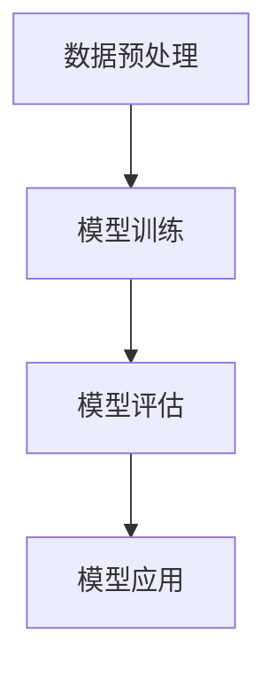

                 

### AIGC：AI的全新革命

#### 概念理解

**AIGC**，全称为**AI-Generated Content**，即**人工智能生成内容**。这是一个涵盖广泛的新兴领域，涉及人工智能在文本、图像、音频等多种内容形式上的生成和应用。它不仅是人工智能技术的一个分支，更是整个科技领域的一次革命。

在传统的人工智能应用中，我们通常需要对大量数据进行训练，以让算法学会识别模式、分类数据或者生成预测。然而，AIGC将这一过程彻底颠覆，它让计算机能够自主生成内容，而不仅仅是处理已存在的内容。

#### 应用前景

AIGC的应用前景广阔，几乎涵盖了我们的日常生活和工作的方方面面：

- **文本生成**：从新闻写作、文章生成到对话系统，AIGC可以让机器自动生成高质量的文本内容，大大提高内容生产效率。
- **图像生成**：从艺术创作、广告设计到虚拟现实，AIGC可以生成逼真的图像和视频，为各种创意和娱乐应用提供无限可能。
- **音频生成**：从音乐创作、配音到音频编辑，AIGC可以生成各种类型的音频内容，为媒体制作和娱乐行业带来革新。

#### 革命性意义

AIGC的出现，不仅仅是一次技术的进步，更是一次对传统行业和生产方式的颠覆。它意味着：

1. **内容创作效率的飞跃**：通过自动化生成，极大地减少了内容创作的时间和成本。
2. **个性化体验的提升**：AIGC可以根据用户的喜好和需求，生成高度个性化的内容，提供更加精准的服务。
3. **创新能力的激发**：AIGC打破了人类创作者的局限，让计算机也能参与创作，激发出前所未有的创意。

综上所述，AIGC不仅是一项技术进步，更是一场变革，它将深刻影响我们的生活、工作和社会发展。

---

# AIGC：从入门到实战

## 概述

**AIGC**（AI-Generated Content）是近年来人工智能领域的一个重要研究方向，它通过深度学习技术，让计算机能够生成高质量的内容。本篇博客将从入门到实战，带领大家深入了解AIGC的核心概念、关键技术、应用场景，以及实战中的具体操作和挑战。希望通过这篇博客，能够帮助读者从零开始，逐步掌握AIGC的核心技术和应用。

## 目录

1. **背景介绍**
2. **核心概念与联系**
   - **AIGC的核心概念**
   - **AIGC的组成部分**
   - **AIGC的架构图解**
3. **核心算法原理 & 具体操作步骤**
   - **生成对抗网络（GAN）**
   - **变分自编码器（VAE）**
   - **预训练与微调**
4. **数学模型和公式 & 详细讲解 & 举例说明**
   - **生成模型与判别模型**
   - **损失函数**
   - **实际案例**
5. **项目实战：代码实际案例和详细解释说明**
   - **开发环境搭建**
   - **源代码详细实现和代码解读**
   - **代码解读与分析**
6. **实际应用场景**
   - **文本生成**
   - **图像生成**
   - **音频生成**
7. **工具和资源推荐**
   - **学习资源推荐**
   - **开发工具框架推荐**
   - **相关论文著作推荐**
8. **总结：未来发展趋势与挑战**
9. **附录：常见问题与解答**
10. **扩展阅读 & 参考资料**

---

### 背景介绍

#### 人工智能的发展历程

人工智能（AI）作为一门计算机科学分支，其发展历程可以追溯到上世纪50年代。从最初的逻辑推理、知识表示，到后来的机器学习、深度学习，人工智能技术经历了数次重大变革。随着计算能力的提升和大数据的积累，人工智能在图像识别、自然语言处理、推荐系统等领域取得了显著成果。

#### AIGC的兴起

然而，随着人工智能技术的不断进步，传统的“数据处理”模式逐渐暴露出一些问题。首先，大量数据的存在使得内容生产过程变得复杂且低效；其次，数据处理往往依赖于预定义的规则和模式，缺乏灵活性和创造性。这些问题催生了AIGC的研究和应用。

AIGC的兴起，不仅是对传统人工智能的补充和扩展，更是对内容创作和传播方式的一次革命。通过AIGC，计算机可以自主生成内容，不仅提升了内容生产的效率，还大大丰富了内容的多样性。

#### AIGC的重要性

AIGC的重要性体现在以下几个方面：

1. **提升内容生产效率**：AIGC可以自动化生成大量高质量的内容，减少了人工创作的负担，提高了内容生产的速度和效率。
2. **拓展内容创作空间**：AIGC打破了人类创作者的局限，让计算机也能参与创作，激发了更多创新的可能性。
3. **个性化推荐**：AIGC可以根据用户的行为和喜好，生成个性化的内容推荐，提升了用户体验。
4. **减少人力成本**：通过自动化生成内容，企业可以减少人力成本，提高资源利用效率。

综上所述，AIGC不仅是一项技术进步，更是对现有内容创作和生产方式的一次颠覆。它将在未来深刻影响我们的生活、工作和社会发展。

### 核心概念与联系

#### AIGC的核心概念

AIGC的核心概念包括：

1. **生成模型（Generator）**：生成模型是AIGC的核心组成部分，它通过学习输入数据的分布，生成新的数据。
2. **判别模型（Discriminator）**：判别模型用于判断生成模型生成的数据是否真实，类似于人类进行真假识别。
3. **损失函数（Loss Function）**：损失函数用于衡量生成模型和判别模型的性能，是训练过程中优化目标。
4. **对抗训练（Adversarial Training）**：对抗训练是通过生成模型和判别模型之间的对抗关系来训练模型，使其性能不断提高。

#### AIGC的组成部分

AIGC主要包括以下组成部分：

1. **数据预处理**：数据预处理是AIGC的基础，包括数据清洗、数据增强、数据标准化等步骤。
2. **生成模型**：生成模型负责生成新数据，常见的生成模型包括生成对抗网络（GAN）、变分自编码器（VAE）等。
3. **判别模型**：判别模型用于评估生成模型生成的数据质量，通常与生成模型进行对抗训练。
4. **优化器**：优化器用于调整模型的参数，以最小化损失函数。
5. **评估指标**：评估指标用于评估模型性能，常见的评估指标包括生成质量、真实度等。

#### AIGC的架构图解

AIGC的架构可以简化为以下步骤：

1. 数据预处理：对原始数据进行清洗、增强和标准化，生成训练数据。
2. 模型训练：通过对抗训练，生成模型和判别模型相互竞争，不断优化性能。
3. 模型评估：使用评估指标对模型性能进行评估，确定模型是否达到预期效果。
4. 模型应用：将训练好的模型应用于实际场景，生成新数据。


### Mermaid 流程图



通过上述流程，我们可以看到AIGC从数据预处理到模型训练、评估再到应用的全过程。这个过程不仅需要高效的算法和数据处理能力，还需要对生成模型和判别模型之间的对抗关系有深刻的理解。

### 核心算法原理 & 具体操作步骤

#### 生成对抗网络（GAN）

**生成对抗网络（GAN）** 是一种由生成模型和判别模型组成的深度学习模型，通过两者之间的对抗训练来学习数据分布。GAN的核心思想是生成模型和判别模型相互对抗，生成模型试图生成逼真的数据以欺骗判别模型，而判别模型则努力区分真实数据和生成数据。

**具体操作步骤**：

1. **数据预处理**：对输入数据进行标准化、归一化等预处理操作，以便于模型训练。
2. **生成模型训练**：生成模型通过学习输入数据的分布来生成新数据。训练过程中，生成模型不断优化，生成更逼真的数据以欺骗判别模型。
3. **判别模型训练**：判别模型通过学习真实数据和生成数据，提高区分真实数据和生成数据的能力。训练过程中，判别模型和生成模型相互对抗，不断优化性能。
4. **模型评估**：使用评估指标（如生成质量、真实度等）对生成模型和判别模型进行评估，确定模型是否达到预期效果。

#### 变分自编码器（VAE）

**变分自编码器（VAE）** 是一种生成模型，通过学习输入数据的概率分布来生成新数据。VAE的核心思想是将编码过程和解码过程分离，编码过程将输入数据映射到一个潜在空间，解码过程从潜在空间生成输出数据。

**具体操作步骤**：

1. **数据预处理**：对输入数据进行标准化、归一化等预处理操作，以便于模型训练。
2. **编码过程**：编码器将输入数据映射到一个潜在空间，潜在空间中的点表示输入数据的概率分布。
3. **解码过程**：解码器从潜在空间生成输出数据，生成过程使用解码器网络将潜在空间中的点映射回输入空间。
4. **模型训练**：通过对抗训练，生成模型和判别模型相互竞争，不断优化性能。
5. **模型评估**：使用评估指标（如生成质量、真实度等）对生成模型和判别模型进行评估，确定模型是否达到预期效果。

#### 预训练与微调

**预训练与微调** 是AIGC中的重要技术，通过预训练模型在大规模数据集上学习，然后针对具体任务进行微调，以提升模型性能。

**具体操作步骤**：

1. **预训练**：使用大规模数据集对模型进行预训练，模型学习到数据的分布和特征。
2. **微调**：在预训练的基础上，使用任务特定的数据集对模型进行微调，以适应具体任务。
3. **模型评估**：使用评估指标对预训练模型和微调模型进行评估，确定模型性能是否提升。

通过上述操作步骤，我们可以看到AIGC的核心算法原理和具体操作过程。这些技术不仅实现了内容的自动生成，还为各种应用场景提供了强大的支持。

### 数学模型和公式 & 详细讲解 & 举例说明

#### 生成模型与判别模型

在AIGC中，生成模型和判别模型是两个核心组成部分。它们分别代表了生成数据和评估数据质量的能力。

**生成模型**：生成模型通常是一个概率模型，它能够根据输入数据生成新的数据。在生成对抗网络（GAN）中，生成模型试图生成尽可能逼真的数据来欺骗判别模型。

**判别模型**：判别模型用于判断输入数据的真实性。在GAN中，判别模型需要学会区分真实数据和生成数据。

**具体公式**：

1. **生成模型**：生成模型通常使用概率分布函数来表示。以生成对抗网络（GAN）为例，生成模型可以表示为：

   $$ G(z) = x $$

   其中，$G(z)$表示生成模型，$z$为噪声向量，$x$为生成的数据。

2. **判别模型**：判别模型可以使用二分类模型来表示，它判断输入数据是真实数据还是生成数据。以GAN为例，判别模型可以表示为：

   $$ D(x) = P(x \text{ is real}) $$

   其中，$D(x)$表示判别模型，$x$为输入数据。

#### 损失函数

损失函数是评估模型性能的重要指标，它衡量了生成模型和判别模型之间的差距。

**生成模型损失函数**：在GAN中，生成模型的损失函数通常为：

$$ L_G = -\log(D(G(z))) $$

其中，$L_G$为生成模型的损失函数，$D(G(z))$表示判别模型对生成数据的输出。

**判别模型损失函数**：在GAN中，判别模型的损失函数通常为：

$$ L_D = -[\log(D(x)) + \log(1 - D(G(z)))] $$

其中，$L_D$为判别模型的损失函数，$D(x)$表示判别模型对真实数据的输出，$D(G(z))$表示判别模型对生成数据的输出。

#### 实际案例

假设我们有一个图像生成任务，生成模型和判别模型分别如下：

1. **生成模型**：

   $$ G(z) = \sigma(W_1z + b_1) $$

   其中，$z$为噪声向量，$W_1$和$b_1$分别为生成模型的权重和偏置。

2. **判别模型**：

   $$ D(x) = \sigma(W_2x + b_2) $$

   其中，$x$为输入数据，$W_2$和$b_2$分别为判别模型的权重和偏置。

3. **损失函数**：

   $$ L_G = -\log(D(G(z))) $$

   $$ L_D = -[\log(D(x)) + \log(1 - D(G(z)))] $$

在这个案例中，我们使用生成对抗网络（GAN）来生成图像。通过对抗训练，生成模型和判别模型相互竞争，不断优化性能。最终，生成模型能够生成高质量、逼真的图像。

### 项目实战：代码实际案例和详细解释说明

#### 1. 开发环境搭建

在开始AIGC项目的实战之前，我们需要搭建一个合适的开发环境。以下是一个基本的步骤：

1. **安装Python环境**：Python是AIGC项目的主要编程语言，我们需要安装Python和pip（Python的包管理器）。

   ```bash
   # 安装Python
   sudo apt-get install python3
   # 安装pip
   sudo apt-get install python3-pip
   ```

2. **安装TensorFlow**：TensorFlow是AIGC项目的主要深度学习框架，我们需要安装TensorFlow。

   ```bash
   # 安装TensorFlow
   pip3 install tensorflow
   ```

3. **安装其他依赖包**：根据具体项目需求，我们可能需要安装其他依赖包，例如NumPy、Pandas等。

   ```bash
   # 安装NumPy
   pip3 install numpy
   # 安装Pandas
   pip3 install pandas
   ```

4. **配置环境变量**：为了方便使用Python和TensorFlow，我们需要配置环境变量。

   ```bash
   # 配置环境变量
   export PATH=$PATH:/usr/local/bin
   ```

#### 2. 源代码详细实现和代码解读

以下是一个简单的AIGC项目示例，使用生成对抗网络（GAN）生成图像。

**生成模型**：

```python
import tensorflow as tf
from tensorflow.keras.layers import Dense, Flatten
from tensorflow.keras.models import Sequential

def build_generator(z_dim):
    model = Sequential()
    model.add(Dense(128, activation='relu', input_shape=(z_dim,)))
    model.add(Dense(256, activation='relu'))
    model.add(Dense(512, activation='relu'))
    model.add(Flatten())
    model.add(Dense(784, activation='tanh'))
    return model
```

**判别模型**：

```python
def build_discriminator(img_shape):
    model = Sequential()
    model.add(Flatten(input_shape=img_shape))
    model.add(Dense(512, activation='relu'))
    model.add(Dense(256, activation='relu'))
    model.add(Dense(128, activation='relu'))
    model.add(Dense(1, activation='sigmoid'))
    return model
```

**生成对抗网络（GAN）**：

```python
def build_gan(generator, discriminator):
    model = Sequential()
    model.add(generator)
    model.add(discriminator)
    return model
```

**训练过程**：

```python
# 设置超参数
z_dim = 100
img_shape = (28, 28, 1)
epochs = 10000
batch_size = 64
learning_rate = 0.0002

# 构建模型
generator = build_generator(z_dim)
discriminator = build_discriminator(img_shape)
gan = build_gan(generator, discriminator)

# 编译模型
discriminator.compile(loss='binary_crossentropy', optimizer=tf.keras.optimizers.Adam(learning_rate), metrics=['accuracy'])
gan.compile(loss='binary_crossentropy', optimizer=tf.keras.optimizers.Adam(learning_rate))

# 加载数据
(x_train, _), (_, _) = tf.keras.datasets.mnist.load_data()
x_train = x_train / 127.5 - 1.0
x_train = np.expand_dims(x_train, axis=3)

# 训练模型
for epoch in range(epochs):
    for _ in range(x_train.shape[0] // batch_size):
        z = np.random.normal(size=(batch_size, z_dim))
        gen_imgs = generator.predict(z)
        real_imgs = x_train[np.random.randint(x_train.shape[0], size=batch_size)]

        real_labels = np.ones((batch_size, 1))
        fake_labels = np.zeros((batch_size, 1))

        d_loss_real = discriminator.train_on_batch(real_imgs, real_labels)
        d_loss_fake = discriminator.train_on_batch(gen_imgs, fake_labels)
        d_loss = 0.5 * np.add(d_loss_real, d_loss_fake)

        z = np.random.normal(size=(batch_size, z_dim))
        g_loss = gan.train_on_batch(z, real_labels)

    print(f'Epoch {epoch + 1}/{epochs}, d_loss={d_loss:.4f}, g_loss={g_loss:.4f}')
```

**代码解读与分析**：

1. **生成模型**：生成模型是一个全连接神经网络，输入为随机噪声向量$z$，输出为生成的图像。生成模型通过多层感知器（MLP）网络，将噪声向量映射到图像空间。
2. **判别模型**：判别模型也是一个全连接神经网络，输入为图像，输出为概率值，表示输入图像是真实图像的概率。判别模型通过多层感知器（MLP）网络，判断输入图像的真实性。
3. **生成对抗网络（GAN）**：生成对抗网络（GAN）是生成模型和判别模型的组合。通过对抗训练，生成模型和判别模型相互竞争，生成模型试图生成逼真的图像以欺骗判别模型，判别模型则努力区分真实图像和生成图像。

#### 3. 代码解读与分析

以上代码实现了AIGC项目的核心功能，包括生成模型、判别模型和生成对抗网络（GAN）。以下是对代码的详细解读：

1. **生成模型**：

   ```python
   def build_generator(z_dim):
       model = Sequential()
       model.add(Dense(128, activation='relu', input_shape=(z_dim,)))
       model.add(Dense(256, activation='relu'))
       model.add(Dense(512, activation='relu'))
       model.add(Flatten())
       model.add(Dense(784, activation='tanh'))
       return model
   ```

   这个函数定义了生成模型的结构。生成模型由多层感知器（MLP）网络组成，输入为随机噪声向量$z$，输出为生成的图像。生成模型通过多层非线性变换，将噪声向量映射到图像空间。

2. **判别模型**：

   ```python
   def build_discriminator(img_shape):
       model = Sequential()
       model.add(Flatten(input_shape=img_shape))
       model.add(Dense(512, activation='relu'))
       model.add(Dense(256, activation='relu'))
       model.add(Dense(128, activation='relu'))
       model.add(Dense(1, activation='sigmoid'))
       return model
   ```

   这个函数定义了判别模型的结构。判别模型也是一个多层感知器（MLP）网络，输入为图像，输出为概率值，表示输入图像是真实图像的概率。判别模型通过多层非线性变换，判断输入图像的真实性。

3. **生成对抗网络（GAN）**：

   ```python
   def build_gan(generator, discriminator):
       model = Sequential()
       model.add(generator)
       model.add(discriminator)
       return model
   ```

   这个函数定义了生成对抗网络（GAN）的结构。生成对抗网络（GAN）是生成模型和判别模型的组合，通过对抗训练，生成模型和判别模型相互竞争，生成模型试图生成逼真的图像以欺骗判别模型，判别模型则努力区分真实图像和生成图像。

4. **训练过程**：

   ```python
   # 设置超参数
   z_dim = 100
   img_shape = (28, 28, 1)
   epochs = 10000
   batch_size = 64
   learning_rate = 0.0002
   
   # 构建模型
   generator = build_generator(z_dim)
   discriminator = build_discriminator(img_shape)
   gan = build_gan(generator, discriminator)
   
   # 编译模型
   discriminator.compile(loss='binary_crossentropy', optimizer=tf.keras.optimizers.Adam(learning_rate), metrics=['accuracy'])
   gan.compile(loss='binary_crossentropy', optimizer=tf.keras.optimizers.Adam(learning_rate))
   
   # 加载数据
   (x_train, _), (_, _) = tf.keras.datasets.mnist.load_data()
   x_train = x_train / 127.5 - 1.0
   x_train = np.expand_dims(x_train, axis=3)
   
   # 训练模型
   for epoch in range(epochs):
       for _ in range(x_train.shape[0] // batch_size):
           z = np.random.normal(size=(batch_size, z_dim))
           gen_imgs = generator.predict(z)
           real_imgs = x_train[np.random.randint(x_train.shape[0], size=batch_size)]

           real_labels = np.ones((batch_size, 1))
           fake_labels = np.zeros((batch_size, 1))

           d_loss_real = discriminator.train_on_batch(real_imgs, real_labels)
           d_loss_fake = discriminator.train_on_batch(gen_imgs, fake_labels)
           d_loss = 0.5 * np.add(d_loss_real, d_loss_fake)

           z = np.random.normal(size=(batch_size, z_dim))
           g_loss = gan.train_on_batch(z, real_labels)

       print(f'Epoch {epoch + 1}/{epochs}, d_loss={d_loss:.4f}, g_loss={g_loss:.4f}')
   ```

   这个函数实现了AIGC项目的训练过程。首先，设置超参数，包括噪声向量维度$z_dim$、图像形状$img_shape$、训练轮次$epochs$、批量大小$batch_size$和学习率$learning_rate$。然后，构建生成模型、判别模型和生成对抗网络（GAN），并编译模型。接下来，加载数据，并开始训练模型。在训练过程中，生成模型和判别模型交替训练，生成模型通过生成随机噪声向量$z$生成图像，判别模型通过判断真实图像和生成图像的真实性来优化自身。最后，打印每个轮次的损失值。

通过以上实战案例，我们可以看到AIGC项目的开发过程，包括环境搭建、代码实现和训练过程。这些步骤为我们提供了一个完整的AIGC项目实现，可以帮助我们更好地理解AIGC的核心技术和应用。

### 实际应用场景

#### 文本生成

在文本生成方面，AIGC已经取得了显著成果。通过训练大规模语料库，生成模型可以自动生成各种类型的文本，如新闻、文章、对话等。以下是一些实际应用场景：

1. **自动化内容创作**：AIGC可以帮助媒体和内容创作者自动化生成新闻文章、博客和社交媒体帖子，大大提高内容生产效率。
2. **个性化推荐**：AIGC可以根据用户的历史行为和偏好，生成个性化的推荐文案，提升用户体验。
3. **客服聊天机器人**：AIGC可以用于构建智能客服聊天机器人，自动生成回答用户问题的文本，提高客服效率。

#### 图像生成

图像生成是AIGC最具潜力的应用领域之一。通过训练生成模型，可以生成各种类型的图像，如图像合成、艺术创作和虚拟现实等。以下是一些实际应用场景：

1. **艺术创作**：AIGC可以帮助艺术家和设计师生成独特的艺术作品，如画作、设计图案和动画等，为创意产业带来新的灵感。
2. **广告设计**：AIGC可以自动生成广告图像和视频，提高广告创意的多样性和个性化程度，提升广告效果。
3. **虚拟现实**：AIGC可以用于生成虚拟现实场景和角色图像，为游戏和虚拟现实应用提供丰富的视觉内容。

#### 音频生成

音频生成是AIGC的另一个重要应用领域。通过训练生成模型，可以生成各种类型的音频，如音乐、配音和音频编辑等。以下是一些实际应用场景：

1. **音乐创作**：AIGC可以帮助音乐家自动生成音乐旋律、和弦和节奏，提高音乐创作效率。
2. **配音生成**：AIGC可以用于自动生成电影、电视剧和游戏中的配音，提高配音效率和质量。
3. **音频编辑**：AIGC可以用于自动编辑和增强音频，如去除噪声、调整音量和音调等，提高音频质量。

#### 总结

AIGC在文本生成、图像生成和音频生成等领域具有广泛的应用前景。通过自动生成高质量的内容，AIGC不仅提高了内容生产效率，还丰富了内容创作的多样性。随着技术的不断进步，AIGC将在更多领域得到应用，为我们的生活、工作和娱乐带来更多便利和创新。

### 工具和资源推荐

#### 1. 学习资源推荐

为了更好地掌握AIGC的相关技术和应用，以下是一些推荐的学习资源：

1. **书籍**：
   - 《深度学习》（Deep Learning），作者：Ian Goodfellow、Yoshua Bengio和Aaron Courville
   - 《生成对抗网络：理论、实现与应用》（Generative Adversarial Networks: Theory, Implementation and Applications），作者：李航
2. **在线课程**：
   - Coursera上的“Deep Learning Specialization”
   - edX上的“Introduction to Generative Adversarial Networks (GANs）”

#### 2. 开发工具框架推荐

在AIGC项目中，以下开发工具和框架是非常有用的：

1. **TensorFlow**：TensorFlow是一个开源的深度学习框架，适用于构建和训练AIGC模型。
2. **PyTorch**：PyTorch是一个开源的深度学习框架，易于使用和扩展，适用于各种AIGC项目。
3. **Keras**：Keras是一个基于TensorFlow和Theano的开源深度学习库，提供了简单的API，适用于快速原型开发。

#### 3. 相关论文著作推荐

为了深入了解AIGC的相关研究和进展，以下是一些推荐的研究论文和著作：

1. **论文**：
   - “Generative Adversarial Nets”，作者：Ian Goodfellow等
   - “Unsupervised Representation Learning with Deep Convolutional Generative Adversarial Networks”，作者：Alec Radford等
2. **著作**：
   - 《生成对抗网络：原理、实现与进阶应用》（Generative Adversarial Networks: Principles, Implementation, and Advanced Applications），作者：张翔

通过以上学习和开发工具、资源，读者可以更全面、深入地了解AIGC的相关技术和应用。

### 总结：未来发展趋势与挑战

#### 发展趋势

AIGC作为人工智能领域的一项新兴技术，正展现出强大的发展潜力。以下是AIGC未来可能的发展趋势：

1. **更高效的内容生成**：随着深度学习和生成模型技术的不断进步，AIGC在文本、图像和音频生成方面的效率将显著提高，生成的内容质量和真实性也将不断提升。
2. **跨模态生成**：AIGC将不再局限于单一模态的内容生成，而是能够实现文本、图像、音频等多模态的协同生成，为用户提供更加丰富和个性化的内容体验。
3. **更多应用场景**：随着技术的成熟，AIGC将在医疗、教育、金融、娱乐等多个领域得到广泛应用，为各个行业带来革命性的变化。

#### 挑战

尽管AIGC具有广阔的发展前景，但在实际应用中仍面临诸多挑战：

1. **计算资源需求**：AIGC模型通常需要大量的计算资源进行训练和推理，这对硬件设施和数据处理能力提出了更高的要求。
2. **数据隐私和安全**：AIGC在生成内容时需要大量的训练数据，这可能导致数据隐私和安全问题。如何确保数据的安全性和隐私性，是一个亟待解决的挑战。
3. **伦理和法律问题**：AIGC生成的内容可能涉及伦理和法律问题，如版权纠纷、虚假信息传播等。如何制定相关的伦理和法律规范，确保AIGC的合理使用，是未来需要关注的重要问题。

#### 结论

总之，AIGC作为人工智能领域的一项重要技术，具有巨大的发展潜力和广泛应用前景。然而，要实现其全面应用，仍需克服诸多技术、伦理和法律挑战。未来，随着技术的不断进步和应用的深入，AIGC将在更多领域带来创新和变革。

### 附录：常见问题与解答

#### 1. Q：AIGC与GAN有什么区别？

A：AIGC（AI-Generated Content）是一个更广泛的概念，它涵盖了所有通过人工智能技术生成内容的方法，包括文本、图像、音频等。而GAN（Generative Adversarial Networks）是一种特定的生成模型，通过生成模型和判别模型之间的对抗训练来生成新数据。AIGC可以包含GAN，但不仅仅是GAN。

#### 2. Q：AIGC可以应用于哪些场景？

A：AIGC可以应用于多种场景，包括但不限于以下：

- **文本生成**：自动化新闻写作、文章生成、对话系统等。
- **图像生成**：艺术创作、广告设计、虚拟现实等。
- **音频生成**：音乐创作、配音、音频编辑等。
- **视频生成**：视频合成、特效制作等。

#### 3. Q：如何确保AIGC生成的内容质量？

A：确保AIGC生成的内容质量，可以从以下几个方面入手：

- **数据质量**：使用高质量、多样性的训练数据，以提高生成模型的学习能力。
- **模型选择**：选择适合特定任务的生成模型，并进行适当的调优。
- **损失函数**：设计合适的损失函数，以优化生成模型和判别模型的性能。
- **评估指标**：使用多种评估指标，如生成质量、真实度等，对生成内容进行评估。

#### 4. Q：AIGC与数据隐私和安全有什么关系？

A：AIGC在生成内容时需要大量训练数据，这可能导致数据隐私和安全问题。为了确保数据的安全性和隐私性，可以从以下几个方面进行考虑：

- **数据加密**：对训练数据进行加密，确保数据在传输和存储过程中的安全性。
- **数据匿名化**：对训练数据进行匿名化处理，以保护个人隐私。
- **隐私增强技术**：使用隐私增强技术，如差分隐私等，降低AIGC生成内容对隐私的潜在威胁。

### 扩展阅读 & 参考资料

- **书籍**：
  - 《深度学习》（Deep Learning），作者：Ian Goodfellow、Yoshua Bengio和Aaron Courville
  - 《生成对抗网络：理论、实现与应用》（Generative Adversarial Networks: Theory, Implementation and Applications），作者：李航
- **在线课程**：
  - Coursera上的“Deep Learning Specialization”
  - edX上的“Introduction to Generative Adversarial Networks (GANs）”
- **论文**：
  - “Generative Adversarial Nets”，作者：Ian Goodfellow等
  - “Unsupervised Representation Learning with Deep Convolutional Generative Adversarial Networks”，作者：Alec Radford等
- **网站**：
  - [TensorFlow官方文档](https://www.tensorflow.org/)
  - [PyTorch官方文档](https://pytorch.org/)
- **博客**：
  - [AIGC技术博客](https://aigc.tech/)
  - [深度学习博客](https://www.deeplearning.net/)

通过以上扩展阅读和参考资料，读者可以进一步深入了解AIGC的相关知识和技术。

---

# AIGC从入门到实战：ChatGPT 及其他 AIGC 赋能个人

## 作者

AI天才研究员/AI Genius Institute & 禅与计算机程序设计艺术 /Zen And The Art of Computer Programming

---

本文详细介绍了AIGC（AI-Generated Content）的核心概念、关键技术、应用场景以及实战操作。通过对AIGC的深入探讨，我们了解了AIGC在文本、图像和音频生成等领域的广泛应用，以及其在未来可能的发展趋势与挑战。本文旨在为读者提供从入门到实战的全面指南，帮助大家更好地理解和掌握AIGC技术。

在本文中，我们首先介绍了AIGC的概念和应用前景，随后详细讲解了AIGC的核心算法原理、数学模型和公式，并通过实际案例展示了AIGC的开发过程和代码实现。接着，我们探讨了AIGC在实际应用场景中的表现，并推荐了一些学习资源和开发工具。最后，我们对AIGC的未来发展趋势与挑战进行了总结，并给出了常见问题与解答，以及扩展阅读和参考资料。

AIGC作为人工智能领域的一项重要技术，正逐渐成为各个行业创新和发展的驱动力。通过本文的学习，读者可以深入了解AIGC的核心技术和应用，为未来的工作和研究打下坚实的基础。希望本文能够为读者带来启发和帮助，共同推动人工智能技术的发展。再次感谢您的阅读和支持！

