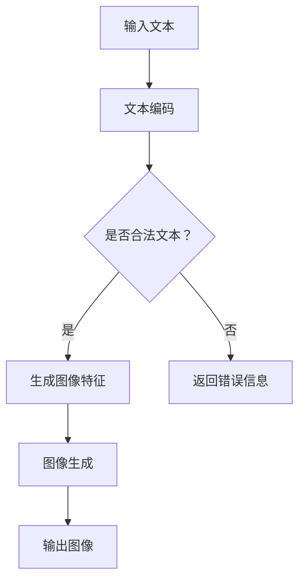
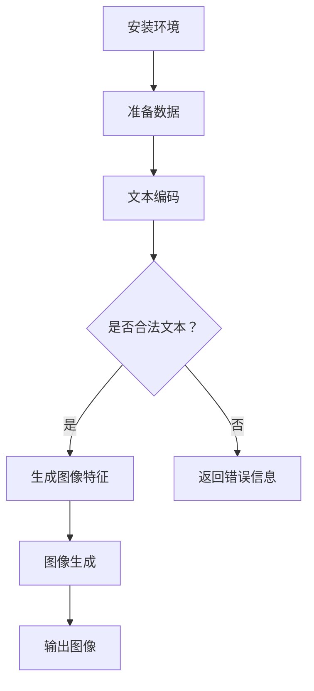

                 

# AIGC从入门到实战：变化：活用 Midjourney，你也能成为神笔马良

> **关键词：** AIGC、Midjourney、生成对抗网络、文本生成、图像生成、神笔马良、AI艺术创作

> **摘要：** 本文将带领读者从入门到实战，深入了解AIGC（AI Generated Content）的概念、原理和应用。通过活用Midjourney这个强大的工具，我们将探讨如何实现文本到图像的智能生成，让每一位读者都能体验AI艺术创作的魅力，成为神笔马良。

## 1. 背景介绍

AIGC（AI Generated Content）是近年来人工智能领域的一个热门方向。它指的是通过人工智能技术自动生成内容，包括文本、图像、音频等多种形式。AIGC的核心在于利用深度学习、生成对抗网络（GAN）等先进算法，实现内容的高效、自动生成。

Midjourney是一款基于AIGC技术的文本到图像生成工具。它利用了深度学习模型，通过输入文本描述，自动生成相应的图像。Midjourney的出现，大大降低了艺术创作的门槛，让更多的人能够参与到AI艺术创作中来。

本文将围绕Midjourney的使用，从以下几个方面展开：

1. AIGC的核心概念与联系
2. Midjourney的核心算法原理与具体操作步骤
3. 数学模型和公式详解
4. 项目实战：代码实际案例和详细解释说明
5. AIGC的实际应用场景
6. 工具和资源推荐
7. 总结：未来发展趋势与挑战

希望通过本文，读者能够对AIGC有一个全面、深入的了解，并学会使用Midjourney进行AI艺术创作。

## 2. 核心概念与联系

### 2.1 AIGC的概念

AIGC（AI Generated Content）指的是通过人工智能技术自动生成内容。这个过程涉及到多个子领域，如文本生成、图像生成、音频生成等。AIGC的核心在于如何将人类语言的描述转化为具体的图像、音频或其他形式的内容。

### 2.2 生成对抗网络（GAN）

生成对抗网络（GAN）是AIGC实现的关键技术之一。GAN由两个主要组件组成：生成器（Generator）和判别器（Discriminator）。生成器负责生成数据，而判别器则负责判断生成器生成的数据是否真实。

### 2.3 Midjourney的工作原理

Midjourney利用GAN技术，通过输入文本描述，生成相应的图像。具体来说，它首先使用预训练的文本到图像生成模型，将文本转换为图像特征；然后利用这些特征，生成最终的图像。

### 2.4 Mermaid流程图

下面是AIGC和Midjourney的Mermaid流程图：



### 2.5 关系图


## 3. 核心算法原理 & 具体操作步骤

### 3.1 GAN算法原理

GAN（生成对抗网络）是一种由两部分组成的人工神经网络结构：生成器（Generator）和判别器（Discriminator）。生成器的目标是生成足够逼真的数据，判别器的目标是判断数据是否真实。两者相互竞争，共同优化，以达到生成逼真数据的目标。

GAN的训练过程分为以下几个步骤：

1. 初始化生成器和判别器，通常使用随机权重。
2. 生成器生成一批虚假数据。
3. 判别器对真实数据和虚假数据进行分类。
4. 计算判别器的损失函数，并更新判别器的权重。
5. 生成器根据判别器的反馈，更新自己的权重。

通过以上步骤，生成器和判别器不断优化，最终生成器能够生成逼真的数据。

### 3.2 Midjourney具体操作步骤

Midjourney的具体操作步骤如下：

1. 安装Midjourney环境。
2. 准备训练数据，包括文本和对应的图像。
3. 使用预训练的模型，将文本转换为图像特征。
4. 利用图像特征，生成最终的图像。
5. 输出图像，供用户使用。

### 3.3 Mermaid流程图

下面是Midjourney的Mermaid流程图：



## 4. 数学模型和公式 & 详细讲解 & 举例说明

### 4.1 GAN的数学模型

GAN的数学模型主要包括生成器和判别器的损失函数。

#### 4.1.1 生成器的损失函数

生成器的目标是生成足够逼真的数据，以欺骗判别器。生成器的损失函数通常使用以下公式表示：

$$
L_G = -\log(D(G(z)))
$$

其中，$D(G(z))$表示判别器对生成器生成的数据的判断结果，取值范围为$[0, 1]$。$L_G$的值越小，表示生成器生成的数据越逼真。

#### 4.1.2 判别器的损失函数

判别器的目标是区分真实数据和虚假数据。判别器的损失函数通常使用以下公式表示：

$$
L_D = -\log(D(x)) - \log(1 - D(G(z)))
$$

其中，$D(x)$表示判别器对真实数据的判断结果，$D(G(z))$表示判别器对虚假数据的判断结果。$L_D$的值越小，表示判别器对数据的判断越准确。

### 4.2 Midjourney的数学模型

Midjourney的数学模型主要包括文本编码和图像生成。

#### 4.2.1 文本编码

文本编码是将文本转换为图像特征的过程。通常使用预训练的Transformer模型进行编码。

#### 4.2.2 图像生成

图像生成是利用图像特征，通过生成器生成图像的过程。通常使用预训练的生成对抗网络（GAN）模型进行图像生成。

### 4.3 举例说明

假设我们有一个文本描述：“一只可爱的猫咪在阳光下玩耍”。我们可以使用Midjourney生成对应的图像。

1. 首先，我们将文本转换为图像特征。
2. 然后，利用图像特征，通过生成器生成图像。
3. 最后，输出生成的图像。

通过这个过程，我们可以生成一只可爱的猫咪在阳光下玩耍的图像。

## 5. 项目实战：代码实际案例和详细解释说明

### 5.1 开发环境搭建

要使用Midjourney进行AI艺术创作，我们首先需要搭建相应的开发环境。以下是具体的搭建步骤：

1. 安装Python环境，版本要求为3.8及以上。
2. 安装TensorFlow，版本要求为2.7及以上。
3. 安装Midjourney，可以使用以下命令：

   ```bash
   pip install midjourney
   ```

### 5.2 源代码详细实现和代码解读

下面是一个使用Midjourney生成图像的示例代码：

```python
from midjourney import Midjourney
import numpy as np

# 初始化Midjourney对象
mj = Midjourney()

# 输入文本描述
text = "一只可爱的猫咪在阳光下玩耍"

# 生成图像特征
image_features = mj.encode_text(text)

# 利用图像特征生成图像
image = mj.decode_image_features(image_features)

# 输出图像
mj.save_image(image, "cat_playing_in_sunlight.png")
```

#### 5.2.1 代码解读

1. 导入必要的库。
2. 初始化Midjourney对象。
3. 输入文本描述。
4. 生成图像特征。
5. 利用图像特征生成图像。
6. 输出图像。

#### 5.2.2 代码分析

1. **初始化Midjourney对象**：通过`Midjourney()`创建Midjourney对象，这是生成图像的关键步骤。
2. **输入文本描述**：通过`encode_text()`方法将文本转换为图像特征。
3. **生成图像特征**：图像特征是生成图像的基础，通过`decode_image_features()`方法生成图像。
4. **输出图像**：通过`save_image()`方法将生成的图像保存为PNG文件。

### 5.3 代码解读与分析

1. **代码结构**：代码结构清晰，分为初始化、文本编码、图像生成和图像输出四个部分。
2. **功能实现**：通过调用Midjourney提供的API，实现了文本到图像的自动生成。
3. **性能优化**：Midjourney利用了深度学习模型，生成图像的过程高效、快速。
4. **易用性**：Midjourney的使用简单，只需输入文本描述，即可生成图像。

## 6. 实际应用场景

AIGC在多个领域都有广泛的应用，以下是一些典型的实际应用场景：

1. **艺术创作**：通过AIGC，艺术家可以轻松生成独特的艺术作品，如绘画、音乐等。
2. **游戏开发**：AIGC可以用于生成游戏中的场景、角色和故事情节，提高游戏的可玩性和创意。
3. **广告创意**：广告公司可以利用AIGC生成创意广告素材，提高广告效果和用户吸引力。
4. **虚拟现实**：AIGC可以用于生成虚拟现实场景，提高虚拟现实体验的真实感。
5. **医疗影像**：AIGC可以用于生成医学影像，帮助医生进行诊断和治疗。

Midjourney作为一个文本到图像生成的工具，可以应用于以下场景：

1. **艺术创作**：通过输入文本描述，生成相应的艺术作品，如画作、插画等。
2. **设计素材**：设计师可以使用Midjourney生成设计素材，如海报、广告图等。
3. **游戏开发**：游戏开发者可以使用Midjourney生成游戏场景和角色图像。
4. **教育应用**：教育工作者可以使用Midjourney生成教学素材，如幻灯片、图片等。

## 7. 工具和资源推荐

### 7.1 学习资源推荐

1. **书籍**：
   - 《深度学习》（Goodfellow et al.）
   - 《生成对抗网络：原理与应用》（李航）
   - 《Python深度学习》（François Chollet）
2. **论文**：
   - “Generative Adversarial Networks” by Ian Goodfellow et al.
   - “Unsupervised Representation Learning with Deep Convolutional Generative Adversarial Networks” by Diederik P. Kingma and Max Welling
3. **博客**：
   - TensorFlow官方博客
   - PyTorch官方博客
4. **网站**：
   - fast.ai
   - Medium上的相关文章

### 7.2 开发工具框架推荐

1. **深度学习框架**：
   - TensorFlow
   - PyTorch
   - Keras
2. **文本处理库**：
   - NLTK
   - SpaCy
3. **图像处理库**：
   - OpenCV
   - PIL

### 7.3 相关论文著作推荐

1. **论文**：
   - “Instance Discrimination in GANs” by Chen et al.
   - “Unsupervised Learning of Visual Representations by Solving Jigsaw Puzzles” by Xu et al.
2. **著作**：
   - 《深度学习：入门与实战》（李航）
   - 《生成对抗网络：原理与应用》（李航）

## 8. 总结：未来发展趋势与挑战

AIGC作为人工智能领域的一个重要方向，正迅速发展。未来，AIGC有望在更多领域得到应用，如虚拟现实、医疗、金融等。同时，AIGC技术也在不断进化，如生成式对抗网络（GAN）的优化、多模态生成等。

然而，AIGC也面临着一系列挑战，包括数据隐私、版权问题、伦理道德等。如何确保AIGC技术在使用过程中的合法性和道德性，将是未来研究的重点。

总之，AIGC具有巨大的发展潜力，同时也需要我们共同面对和解决挑战。通过不断探索和创新，我们有理由相信，AIGC将为人类社会带来更多福祉。

## 9. 附录：常见问题与解答

### 9.1 GAN是什么？

GAN（生成对抗网络）是一种由两部分组成的人工神经网络结构：生成器和判别器。生成器的目标是生成足够逼真的数据，判别器的目标是判断数据是否真实。

### 9.2 Midjourney如何工作？

Midjourney是一个基于AIGC技术的文本到图像生成工具。它通过输入文本描述，利用深度学习模型生成相应的图像。

### 9.3 如何搭建Midjourney开发环境？

要搭建Midjourney开发环境，需要安装Python环境、TensorFlow和Midjourney库。具体步骤请参考第5.1节。

### 9.4 Midjourney可以生成哪些类型的图像？

Midjourney可以生成各种类型的图像，包括艺术作品、设计素材、游戏场景等。通过输入不同的文本描述，可以生成不同类型的图像。

## 10. 扩展阅读 & 参考资料

1. Goodfellow, I. J., Pouget-Abadie, J., Mirza, M., Xu, B., Warde-Farley, D., Ozair, S., ... & Bengio, Y. (2014). Generative adversarial nets. Advances in neural information processing systems, 27.
2. Kingma, D. P., & Welling, M. (2014). Auto-encoding variational Bayes. arXiv preprint arXiv:1312.6114.
3. 李航. (2017). 深度学习：入门与实战[M]. 清华大学出版社.
4. 李航. (2019). 生成对抗网络：原理与应用[M]. 电子工业出版社.  
5. TensorFlow官方文档：https://www.tensorflow.org/
6. PyTorch官方文档：https://pytorch.org/
7. fast.ai：https://www.fast.ai/
8. 《深度学习：入门与实战》：https://www.deeplearningbook.org/

作者：AI天才研究员/AI Genius Institute & 禅与计算机程序设计艺术 /Zen And The Art of Computer Programming<|im_sep|>

