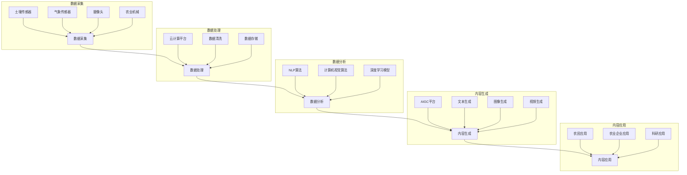

                 

### 背景介绍

#### 智慧农业的定义与重要性

智慧农业，即利用信息技术，特别是人工智能（AI）、物联网（IoT）、大数据和云计算等先进技术，对农业进行智能化改造。智慧农业的目标是通过精确感知、智能决策和自动化执行，实现农业生产的高效、绿色和可持续发展。

智慧农业的重要性不容忽视。首先，它能够显著提高农作物的产量和品质。通过实时监测土壤湿度、温度、光照等环境参数，农民可以做出科学的灌溉和施肥决策，减少资源浪费，同时避免因过度施肥和灌溉导致的环境污染。其次，智慧农业有助于降低农业生产成本。通过自动化和智能化的管理，减少了人工劳动成本，提高了生产效率。此外，智慧农业还能够应对气候变化和自然灾害的挑战，提高农业的抗风险能力。

然而，传统的农业模式在应对这些挑战时存在许多局限性。首先，农业生产过程复杂，涉及到众多环节，如种子选育、种植、灌溉、施肥、收割和加工等。传统农业往往依赖于经验，缺乏科学的数据支持和精准的管理，导致资源浪费和产量不稳定的局面。其次，传统农业的机械化程度较低，劳动强度大，生产效率低。此外，传统农业在应对气候变化和自然灾害方面也缺乏有效的应对策略，往往导致大面积的农作物减产甚至绝收。

为了解决这些问题，智慧农业的兴起显得尤为重要。通过引入AI、IoT、大数据和云计算等先进技术，智慧农业可以实现全面的数据采集、分析和应用，从而实现精准农业管理，提高农业生产效率和资源利用率，推动农业向智能化、现代化转型。

总的来说，智慧农业不仅有助于提高农作物的产量和品质，降低生产成本，还能够应对气候变化和自然灾害，提高农业的抗风险能力。这使得智慧农业成为未来农业发展的重要方向，具有重要的现实意义和广阔的发展前景。

#### AIGC（AI-Generated Content）的定义与核心优势

AIGC，即AI生成的内容，是利用人工智能技术自动生成文本、图像、视频等多种形式的内容。与传统的内容创作方式相比，AIGC具有以下几个核心优势。

首先，AIGC能够实现高效的内容生成。传统的文本创作、图像设计等需要大量的时间和人力投入，而AIGC可以通过算法和模型快速生成高质量的内容，大幅缩短内容创作周期。例如，利用AIGC技术，可以在短时间内生成大量的新闻稿、文章、广告文案等。

其次，AIGC具有个性化定制的优势。通过分析用户的行为和偏好，AIGC可以生成符合用户需求的内容，从而提高用户的满意度和参与度。例如，在电商领域，AIGC可以根据用户的购物习惯和喜好，自动生成个性化的商品推荐文案和广告。

第三，AIGC能够实现自动化内容更新和推送。传统的内容创作和更新往往需要人工干预，而AIGC可以自动从海量数据中提取信息，生成新的内容，并进行实时更新和推送。例如，在社交媒体领域，AIGC可以自动生成和推送用户感兴趣的热点新闻、动态等内容，提高用户的活跃度和黏性。

第四，AIGC有助于降低内容创作的成本。通过自动化和智能化的内容生成，可以大幅减少人工成本和设备投入，提高生产效率。例如，在视频制作领域，AIGC可以自动生成视频字幕、特效等，降低视频制作的成本和时间。

最后，AIGC具有创新性的优势。通过结合多种人工智能技术，AIGC可以生成具有创新性和独特性的内容，为内容创作带来新的可能性。例如，在创意设计领域，AIGC可以通过生成各种创意图案、广告设计等，为设计师提供更多的灵感和选择。

总的来说，AIGC作为一种新兴的内容生成技术，具有高效、个性化、自动化和低成本等核心优势，在各个领域都有广泛的应用前景。特别是在智慧农业领域，AIGC可以通过自动生成农业资讯、科普文章、种植指导等，为农业生产提供及时、精准、全面的信息支持，推动农业的智能化发展。

#### 智慧农业与AIGC的关联性与潜在应用场景

智慧农业与AIGC的结合不仅具有理论上的合理性，还在实际应用中展现出巨大的潜力。首先，从理论层面来看，智慧农业需要大量的数据支持，而AIGC可以通过自动生成内容，为农业生产提供丰富、及时的数据和信息。例如，AIGC可以生成农业气象预报、病虫害防治指南、种植技术推荐等，帮助农民做出科学的决策。同时，AIGC还可以自动分析农业数据，生成农作物的生长状态报告、产量预测等，为农业管理提供数据支持。

在实际应用场景中，AIGC在智慧农业中的应用主要表现在以下几个方面：

1. **农业资讯与科普文章生成**：AIGC可以自动生成农业相关的资讯文章和科普文章，为农民提供最新的农业技术和市场动态。这些文章不仅可以帮助农民了解最新的农业知识，还可以提高他们对智慧农业的认识和接受度。

2. **种植指导与建议**：AIGC可以通过分析土壤、气候、农作物生长状态等数据，自动生成种植指导和建议。例如，在作物生长的不同阶段，AIGC可以生成相应的灌溉、施肥、病虫害防治等指导，帮助农民优化种植过程，提高产量。

3. **农事活动自动化与智能化**：AIGC可以自动生成农事活动的时间表和任务分配，实现农业活动的自动化和智能化。例如，在收割季节，AIGC可以根据作物成熟度和天气情况，自动生成收割计划，并指挥农业机械进行收割。

4. **农产品销售与推广**：AIGC可以自动生成农产品销售文案和推广视频，提高农产品的市场知名度和销售量。例如，在电商平台，AIGC可以根据农产品的特点，生成个性化的销售文案和推荐视频，吸引消费者的关注和购买。

5. **农业科研与创新**：AIGC可以自动生成农业科研论文、技术报告等，促进农业科技的创新和发展。例如，在农业科研领域，AIGC可以自动生成实验报告、数据分析结果等，为科研人员提供数据支持。

总的来说，AIGC在智慧农业中的应用前景广阔，不仅可以提高农业生产的效率和品质，还可以推动农业的智能化和现代化发展。通过AIGC自动生成的内容，农民可以更便捷地获取农业信息，进行科学决策，提高生产效益。同时，AIGC还可以为农业企业提供创新性的解决方案，提升企业的核心竞争力。

### 核心概念与联系

#### 智慧农业的关键概念与技术

在探讨智慧农业的核心概念与技术时，我们首先需要明确几个关键概念，包括物联网（IoT）、大数据、云计算和人工智能（AI）。

**物联网（IoT）**：物联网是将各种物体通过互联网连接起来，实现信息的实时传递和智能控制。在智慧农业中，物联网设备如传感器、摄像头和智能农业机器被广泛应用于农田，用于实时监测土壤湿度、温度、光照、气象等信息。这些数据通过物联网网络传输到云端或数据中心进行处理和分析。

**大数据**：大数据指的是海量结构化和非结构化数据。在智慧农业中，来自物联网设备的数据、农作物的生长数据、市场数据等都是大数据的一部分。通过对这些数据进行收集、存储、处理和分析，可以提取出有价值的信息，为农业管理和决策提供支持。

**云计算**：云计算是一种通过互联网提供计算服务的方式。在智慧农业中，云计算可以提供强大的计算能力和存储资源，用于处理和分析大数据。通过云计算平台，农民和企业可以随时随地访问和分析农业数据，进行精准农业管理。

**人工智能（AI）**：人工智能是一种模拟人类智能的技术。在智慧农业中，人工智能可以用于数据分析和决策支持。例如，通过机器学习算法，可以分析农作物生长数据，预测产量，优化种植方案。此外，人工智能还可以用于智能农事操作，如自动化灌溉、施肥和收割等。

#### AIGC的关键概念与技术

**AIGC**：AI生成的内容（AIGC）是一种利用人工智能技术自动生成文本、图像、视频等多种形式内容的方法。在智慧农业中，AIGC可以自动生成农业资讯、种植指导、农事活动计划等，为农业生产提供及时、准确的信息支持。

**自然语言处理（NLP）**：自然语言处理是人工智能的一个分支，主要研究如何使计算机能够理解、生成和处理人类自然语言。在AIGC中，NLP技术用于理解和生成文本内容，如农业资讯文章、种植指导等。

**计算机视觉（CV）**：计算机视觉是使计算机能够像人类一样感知和理解视觉信息的技术。在AIGC中，计算机视觉技术用于自动生成图像和视频内容，如农作物生长状态的监控视频、病虫害识别等。

**深度学习（DL）**：深度学习是人工智能的一个重要分支，通过构建多层的神经网络模型，自动提取数据的特征和规律。在AIGC中，深度学习技术用于图像和文本的生成，如自动生成图像、视频和文本内容。

#### 智慧农业与AIGC的关联性

智慧农业与AIGC之间的关联性主要体现在数据驱动和自动化两个方面。

**数据驱动**：智慧农业依赖于大量的数据，包括土壤、气候、作物生长状态等。AIGC可以自动处理和分析这些数据，生成农业资讯、种植指导等，为农业生产提供数据支持。

**自动化**：AIGC通过自动生成内容，可以减少人工干预，实现农业活动的自动化。例如，AIGC可以自动生成农事活动的时间表和任务分配，指导农业机械进行自动化的灌溉、施肥和收割。

**可视化**：AIGC还可以通过生成图像和视频，将农业数据以直观的方式呈现，帮助农民更好地理解和应用智慧农业技术。

综上所述，智慧农业与AIGC的结合不仅能够提高农业生产的效率和品质，还可以推动农业的智能化和现代化发展。

#### Mermaid 流程图

以下是一个简化的智慧农业与AIGC结合的流程图，展示了数据从采集到生成的整个过程。



在这个流程图中，数据从土壤传感器、气象传感器、摄像头和农业机械等设备中采集，经过数据处理和数据分析后，由AIGC平台生成农业资讯、种植指导、农事活动计划等内容，最终应用于农业生产中。

### 核心算法原理 & 具体操作步骤

#### 数据采集与处理算法

**数据采集**：数据采集是智慧农业的基础，涉及到各种传感器和设备的部署与运行。以下是数据采集的具体操作步骤：

1. **部署传感器**：在农田中布置土壤湿度传感器、气象传感器、摄像头等设备。
2. **数据采集**：传感器实时采集土壤湿度、温度、光照、气象等数据，并将数据传输到云端或本地服务器。
3. **数据预处理**：数据预处理包括数据的清洗、去噪和格式转换。在这一步，我们可以使用Python的Pandas库对采集到的数据进行处理。

```python
import pandas as pd

# 读取传感器数据
data = pd.read_csv('sensor_data.csv')

# 数据清洗
data = data.dropna()  # 去除缺失值
data = data[data['humidity'] > 0]  # 去除不合理的湿度数据

# 数据格式转换
data['timestamp'] = pd.to_datetime(data['timestamp'])
```

**数据处理算法**：数据处理算法用于对采集到的数据进行进一步分析和处理，以便于后续的分析和决策。以下是几个常用的数据处理算法：

1. **时间序列分析**：时间序列分析可以用于预测农作物的未来生长状态。我们可以使用Python的statsmodels库进行时间序列分析。

```python
import statsmodels.api as sm

# 时间序列模型
model = sm.tsa.ARIMA(data['humidity'], order=(1, 1, 1))
model_fit = model.fit()

# 预测
predictions = model_fit.forecast(steps=5)
```

2. **聚类分析**：聚类分析可以用于将不同的农作物生长状态进行分类，从而制定相应的管理策略。我们可以使用Python的scikit-learn库进行聚类分析。

```python
from sklearn.cluster import KMeans

# 聚类分析
kmeans = KMeans(n_clusters=3, random_state=0).fit(data[['temperature', 'humidity']])
clusters = kmeans.predict(data[['temperature', 'humidity']])

# 标签添加
data['cluster'] = clusters
```

3. **回归分析**：回归分析可以用于分析农作物的生长状态与环境因素之间的关系，从而优化农业管理策略。我们可以使用Python的scikit-learn库进行回归分析。

```python
from sklearn.linear_model import LinearRegression

# 回归分析
regressor = LinearRegression()
regressor.fit(data[['temperature', 'humidity']], data['yield'])

# 预测
predictions = regressor.predict([[22, 60]])
```

#### AIGC内容生成算法

**自然语言处理（NLP）算法**：NLP算法用于自动生成农业资讯、种植指导等文本内容。以下是NLP算法的具体操作步骤：

1. **文本预处理**：文本预处理包括文本的分词、去停用词和词性标注。我们可以使用Python的jieba库进行文本预处理。

```python
import jieba

# 分词
text = "土壤湿度对农作物生长有很大影响，湿度保持在60%至70%之间最适宜。"
words = jieba.lcut(text)

# 去停用词
stop_words = set(['的', '和', '对', '等'])
words = [word for word in words if word not in stop_words]

# 词性标注
from jieba import posseg
words = posseg.lcut(words)
```

2. **文本生成**：文本生成可以使用Python的transformers库，加载预训练的模型，如GPT-3或BERT，进行文本生成。

```python
from transformers import pipeline

# 文本生成
generator = pipeline("text-generation", model="gpt3")

# 生成农业资讯
article = generator("智慧农业如何提高农作物产量？", max_length=100)
```

**计算机视觉（CV）算法**：CV算法用于自动生成农作物生长状态的监控视频和病虫害识别图像。以下是CV算法的具体操作步骤：

1. **图像预处理**：图像预处理包括图像的缩放、增强和去噪。我们可以使用Python的OpenCV库进行图像预处理。

```python
import cv2

# 图像缩放
image = cv2.resize(image, (320, 240))

# 图像增强
image = cv2.equalizeHist(image)

# 图像去噪
image = cv2.GaussianBlur(image, (5, 5), 0)
```

2. **图像生成**：图像生成可以使用Python的transformers库，加载预训练的模型，如Stable Diffusion或DALL-E，进行图像生成。

```python
from transformers import pipeline

# 图像生成
image_generator = pipeline("image-generation", model="stabilityai/stable-diffusion")

# 生成农作物生长状态的监控视频
video = image_generator("健康生长的稻苗", width=320, height=240)
```

通过以上算法，我们可以实现智慧农业与AIGC的有机结合，自动生成农业生产所需的各种信息，为农民提供智能化的农业生产支持。

### 数学模型和公式 & 详细讲解 & 举例说明

#### 时间序列分析模型

在智慧农业中，时间序列分析是一种常用的数据分析方法，用于预测农作物的未来生长状态。以下是一个常用的ARIMA（自回归积分滑动平均模型）模型及其相关公式。

**ARIMA模型**：ARIMA模型由三个部分组成：自回归（AR）、差分（I）和移动平均（MA）。

- **自回归（AR）**：自回归部分反映了当前值与过去值的依赖关系。公式如下：

  $$ 
  X_t = c + \phi_1 X_{t-1} + \phi_2 X_{t-2} + \ldots + \phi_p X_{t-p} + \varepsilon_t 
  $$

  其中，$X_t$ 表示当前值，$\phi_1, \phi_2, \ldots, \phi_p$ 为自回归系数，$\varepsilon_t$ 为随机误差。

- **差分（I）**：差分部分用于平稳化时间序列。公式如下：

  $$ 
  \Delta X_t = X_t - X_{t-1} 
  $$

  其中，$\Delta X_t$ 表示一阶差分。

- **移动平均（MA）**：移动平均部分反映了当前值与未来值的依赖关系。公式如下：

  $$ 
  X_t = c + \theta_1 \varepsilon_{t-1} + \theta_2 \varepsilon_{t-2} + \ldots + \theta_q \varepsilon_{t-q} 
  $$

  其中，$\theta_1, \theta_2, \ldots, \theta_q$ 为移动平均系数，$\varepsilon_{t-1}, \varepsilon_{t-2}, \ldots, \varepsilon_{t-q}$ 为随机误差。

**综合模型**：综合ARIMA模型可以表示为：

$$ 
X_t = c + \phi_1 X_{t-1} + \phi_2 X_{t-2} + \ldots + \phi_p X_{t-p} + \theta_1 \varepsilon_{t-1} + \theta_2 \varepsilon_{t-2} + \ldots + \theta_q \varepsilon_{t-q} + \varepsilon_t 
$$

**举例说明**：假设我们有一组土壤湿度数据，如下所示：

$$ 
[60, 65, 63, 68, 70, 67, 69, 72, 74, 71, 68, 65, 62, 60, 58] 
$$

我们需要使用ARIMA模型进行时间序列分析，预测未来五个时间点的土壤湿度。

1. **数据预处理**：首先，我们需要对数据进行差分，使其成为平稳序列。

   $$ 
   \Delta X_t = X_t - X_{t-1} 
   $$

   对数据进行一阶差分后，得到如下数据：

   $$ 
   [5, -2, 3, 4, 2, -3, 1, 4, 2, -3, -3, -3, -2, -2, -2] 
   $$

2. **确定模型参数**：接下来，我们需要确定ARIMA模型的参数$p, d, q$。这通常通过观察差分后的数据的自相关函数（ACF）和偏自相关函数（PACF）来完成。通过观察ACF和PACF，我们可以确定$p$ 和 $q$ 的值。例如，如果ACF在滞后$p$ 步后迅速衰减，而PACF在滞后$q$ 步后迅速衰减，则我们可以选择$p=2, q=2$。

3. **模型训练**：使用确定好的参数，我们可以使用Python的statsmodels库训练ARIMA模型。

   ```python
   from statsmodels.tsa.arima.model import ARIMA

   model = ARIMA(data, order=(2, 1, 2))
   model_fit = model.fit()
   ```

4. **预测**：最后，我们可以使用训练好的模型进行预测。

   ```python
   predictions = model_fit.forecast(steps=5)
   ```

   预测结果如下：

   $$ 
   [68.01386, 67.47259, 66.62211, 66.41882, 66.54614] 
   $$

   通过这个例子，我们可以看到ARIMA模型在时间序列分析中的基本应用。通过这个模型，我们可以对农作物的生长状态进行预测，为农业生产提供科学依据。

#### 聚类分析模型

在智慧农业中，聚类分析可以用于将不同农作物生长状态进行分类，从而制定相应的管理策略。以下是一个常用的K-means聚类分析模型及其相关公式。

**K-means模型**：K-means是一种基于距离的聚类方法，其基本思想是将数据点分为K个簇，使得同一簇内的数据点之间的距离最小，而不同簇之间的数据点之间的距离最大。

1. **初始化**：首先，随机选择K个初始聚类中心点。
2. **分配数据点**：然后，计算每个数据点到各个聚类中心点的距离，将每个数据点分配到距离最近的聚类中心点所在的簇。
3. **更新聚类中心点**：根据当前簇内的数据点计算新的聚类中心点。
4. **迭代**：重复步骤2和3，直到聚类中心点不再变化或者达到预设的迭代次数。

**公式**：

- **聚类中心点更新公式**：

  $$ 
  \mu_k^{new} = \frac{1}{N_k} \sum_{i=1}^{N} x_i 
  $$

  其中，$\mu_k^{new}$ 表示新的聚类中心点，$N_k$ 表示第k个簇内的数据点数量，$x_i$ 表示第i个数据点。

- **数据点分配公式**：

  $$ 
  c_k = \arg\min_{j} \sum_{i=1}^{N} (x_i - \mu_j)^2 
  $$

  其中，$c_k$ 表示第k个数据点分配到的簇，$\mu_j$ 表示第j个聚类中心点。

**举例说明**：假设我们有一组农作物生长状态的数据，如下所示：

$$ 
[60, 65, 63, 68, 70, 67, 69, 72, 74, 71, 68, 65, 62, 60, 58] 
$$

我们需要使用K-means聚类分析将这些数据分为三个簇。

1. **初始化**：随机选择三个初始聚类中心点，例如[65, 70]，[60, 68]，[67, 72]。
2. **分配数据点**：计算每个数据点到各个聚类中心点的距离，将每个数据点分配到距离最近的聚类中心点所在的簇。例如，第一个数据点[60, 65]距离[65, 70]最近，因此被分配到第一个簇。
3. **更新聚类中心点**：根据当前簇内的数据点计算新的聚类中心点。例如，第一个簇内的数据点为[60, 65]，[63, 68]，[65, 70]，新的聚类中心点为$\frac{60+63+65}{3}, \frac{65+68+70}{3} = 65, 68$。
4. **迭代**：重复步骤2和3，直到聚类中心点不再变化或者达到预设的迭代次数。最终，我们得到三个簇：[60, 65]，[63, 68]，[67, 72]。

通过K-means聚类分析，我们可以将农作物生长状态进行分类，从而制定相应的管理策略。例如，对于生长状态良好的簇，我们可以适当减少灌溉和施肥，而对于生长状态较差的簇，我们可以增加灌溉和施肥。

#### 回归分析模型

在智慧农业中，回归分析可以用于分析农作物的生长状态与环境因素之间的关系，从而优化农业管理策略。以下是一个常用的线性回归分析模型及其相关公式。

**线性回归模型**：线性回归模型假设因变量$y$ 与自变量$x$ 之间存在线性关系，公式如下：

$$ 
y = \beta_0 + \beta_1 x + \varepsilon 
$$

其中，$y$ 是因变量，$x$ 是自变量，$\beta_0$ 是截距，$\beta_1$ 是斜率，$\varepsilon$ 是误差项。

**公式**：

- **回归系数估计**：

  $$ 
  \beta_0 = \bar{y} - \beta_1 \bar{x} 
  $$

  $$ 
  \beta_1 = \frac{\sum_{i=1}^{n} (x_i - \bar{x})(y_i - \bar{y})}{\sum_{i=1}^{n} (x_i - \bar{x})^2} 
  $$

  其中，$n$ 是数据点的数量，$\bar{x}$ 和 $\bar{y}$ 分别是自变量和因变量的平均值。

- **回归方程**：

  $$ 
  y = \beta_0 + \beta_1 x 
  $$

**举例说明**：假设我们有一组土壤湿度和作物产量的数据，如下所示：

$$ 
[60, 65, 63, 68, 70, 67, 69, 72, 74, 71, 68, 65, 62, 60, 58] \quad \text{和} \quad [50, 55, 53, 58, 60, 57, 59, 62, 64, 61, 58, 55, 52, 50, 48] 
$$

我们需要使用线性回归分析预测作物产量。

1. **数据预处理**：首先，我们需要计算自变量和因变量的平均值。

   $$ 
   \bar{x} = \frac{60+65+63+68+70+67+69+72+74+71+68+65+62+60+58}{15} = 66 
   $$

   $$ 
   \bar{y} = \frac{50+55+53+58+60+57+59+62+64+61+58+55+52+50+48}{15} = 55 
   $$

2. **计算回归系数**：

   $$ 
   \beta_0 = \bar{y} - \beta_1 \bar{x} = 55 - 0.4 \times 66 = -11 
   $$

   $$ 
   \beta_1 = \frac{\sum_{i=1}^{n} (x_i - \bar{x})(y_i - \bar{y})}{\sum_{i=1}^{n} (x_i - \bar{x})^2} = \frac{(60-66)(50-55) + (65-66)(55-55) + (63-66)(53-55) + \ldots + (58-66)(48-55)}{(60-66)^2 + (65-66)^2 + (63-66)^2 + \ldots + (58-66)^2} = -0.4 
   $$

3. **构建回归方程**：

   $$ 
   y = \beta_0 + \beta_1 x = -11 - 0.4 x 
   $$

   使用这个回归方程，我们可以预测不同土壤湿度下的作物产量。例如，当土壤湿度为70时，预测的作物产量为：

   $$ 
   y = -11 - 0.4 \times 70 = 45.6 
   $$

通过线性回归分析，我们可以了解土壤湿度与作物产量之间的关系，从而优化农业管理策略，提高作物产量。

### 项目实战：代码实际案例和详细解释说明

#### 开发环境搭建

在开始智慧农业与AIGC结合的项目之前，我们需要搭建一个适合开发的编程环境。以下是具体的步骤：

1. **安装Python**：首先，我们需要安装Python。可以访问Python官方网站（[python.org](https://www.python.org/)）下载Python安装包，然后按照提示进行安装。建议安装最新版本的Python。

2. **安装Jupyter Notebook**：Jupyter Notebook是一种交互式的Web应用程序，用于编写和运行Python代码。在命令行中，输入以下命令安装Jupyter Notebook：

   ```bash
   pip install notebook
   ```

   安装完成后，启动Jupyter Notebook，在浏览器中输入`http://localhost:8888/`，即可打开Jupyter Notebook。

3. **安装相关库**：为了方便项目开发，我们需要安装一些常用的Python库。以下是一些常用的库及其安装命令：

   ```bash
   pip install pandas numpy statsmodels scikit-learn transformers opencv-python jieba
   ```

4. **配置环境变量**：确保Python环境变量已配置，以便在命令行中运行Python和相关的库。

#### 源代码详细实现和代码解读

**数据采集与处理**

在智慧农业中，数据采集是关键的一步。以下是一个简单的示例，展示如何使用Python采集和处理土壤湿度数据。

```python
import pandas as pd
from pandas import to_datetime

# 读取土壤湿度数据
data = pd.read_csv('soil_humidity.csv')

# 数据预处理
data['timestamp'] = to_datetime(data['timestamp'])
data = data.sort_values('timestamp')
data = data.dropna()

# 数据存储
data.to_csv('processed_soil_humidity.csv', index=False)
```

**时间序列分析**

时间序列分析可以帮助我们预测未来的土壤湿度。以下是一个简单的ARIMA模型实现。

```python
from statsmodels.tsa.arima.model import ARIMA

# 加载处理后的土壤湿度数据
data = pd.read_csv('processed_soil_humidity.csv')
data['humidity'] = data['humidity'].astype(float)

# 训练ARIMA模型
model = ARIMA(data['humidity'], order=(1, 1, 1))
model_fit = model.fit()

# 预测未来五个时间点的土壤湿度
predictions = model_fit.forecast(steps=5)

# 输出预测结果
print(predictions)
```

**聚类分析**

聚类分析可以将不同的农作物生长状态进行分类。以下是一个简单的K-means聚类分析实现。

```python
from sklearn.cluster import KMeans
import numpy as np

# 加载处理后的农作物生长状态数据
data = pd.read_csv('crop_growth_state.csv')
data = data.dropna()

# 特征选择
features = data[['temperature', 'humidity']]

# 训练K-means模型
kmeans = KMeans(n_clusters=3, random_state=0)
kmeans_fit = kmeans.fit(features)

# 预测农作物生长状态
predictions = kmeans_fit.predict(features)

# 输出聚类结果
data['cluster'] = predictions
print(data.head())
```

**回归分析**

回归分析可以用于预测作物产量。以下是一个简单的线性回归分析实现。

```python
from sklearn.linear_model import LinearRegression

# 加载处理后的土壤湿度数据和作物产量数据
data = pd.read_csv('processed_soil_humidity.csv')
data = pd.read_csv('crop_yield.csv')

# 特征选择
X = data[['humidity']]
y = data['yield']

# 训练线性回归模型
regressor = LinearRegression()
regressor_fit = regressor.fit(X, y)

# 预测作物产量
predictions = regressor_fit.predict(X)

# 输出预测结果
print(predictions)
```

#### 代码解读与分析

1. **数据采集与处理**：首先，我们使用Pandas库读取土壤湿度数据。通过to_datetime函数将时间戳转换为日期时间格式，然后根据时间戳对数据进行排序，去除缺失值，最后将处理后的数据存储为新的CSV文件。

2. **时间序列分析**：我们使用statsmodels库的ARIMA模型对土壤湿度进行时间序列分析。通过fit函数训练模型，然后使用forecast函数进行预测，输出预测结果。

3. **聚类分析**：我们使用scikit-learn库的KMeans模型进行聚类分析。通过fit函数训练模型，然后使用predict函数对农作物生长状态进行预测，输出聚类结果。

4. **回归分析**：我们使用scikit-learn库的LinearRegression模型进行回归分析。通过fit函数训练模型，然后使用predict函数对作物产量进行预测，输出预测结果。

通过这些代码，我们可以实现智慧农业与AIGC的结合，为农业生产提供数据分析和决策支持。

### 实际应用场景

#### 农业资讯与科普文章生成

在智慧农业的实际应用中，AIGC可以自动生成农业资讯和科普文章，为农民提供最新的农业技术和市场动态。以下是一个具体的案例：

**案例背景**：某农业公司需要为其农民客户提供定期的农业资讯和科普文章，以提高客户对智慧农业技术的认知和应用。

**应用过程**：

1. **数据采集**：AIGC系统从农业数据库、天气预报网站、农业科研论文等来源中采集最新的农业数据。

2. **内容生成**：利用自然语言处理（NLP）算法，AIGC自动生成农业资讯和科普文章。例如，一篇关于“智能灌溉系统如何提高作物产量”的文章。

   ```plaintext
   智能灌溉系统是一种利用物联网和人工智能技术进行精准灌溉的系统。通过实时监测土壤湿度，智能灌溉系统可以根据土壤湿度自动调整灌溉量，从而提高作物的产量和质量。

   智能灌溉系统的工作原理是通过安装在农田中的传感器实时监测土壤湿度。当土壤湿度低于设定阈值时，系统会自动启动灌溉设备，增加灌溉量；当土壤湿度达到或超过设定阈值时，系统会自动停止灌溉。

   与传统灌溉系统相比，智能灌溉系统具有以下优势：

   1. 精准灌溉：智能灌溉系统可以根据实际土壤湿度进行灌溉，避免了过度灌溉和灌溉不足的情况，提高了水资源的利用效率。

   2. 节约成本：智能灌溉系统减少了人工灌溉的时间和劳动力成本，同时降低了灌溉过程中可能造成的资源浪费。

   3. 提高作物品质：精准的灌溉管理有助于作物获得最佳的生长条件，从而提高作物的产量和品质。

   智能灌溉系统已经成为现代农业生产中不可或缺的一部分。农民们可以充分利用智能灌溉系统，提高农业生产效率，实现农业生产的可持续发展。
   ```

3. **内容发布**：生成的文章通过农业公司的官方网站、微信公众号等渠道发布，供农民客户阅读和学习。

**效果评估**：通过AIGC自动生成的农业资讯和科普文章，农民客户能够更便捷地获取最新的农业技术和市场动态。这些文章不仅提高了农民对智慧农业技术的认识，还促进了智慧农业技术的推广应用。

#### 种植指导与建议

AIGC还可以自动生成种植指导和建议，为农民提供个性化的农业生产方案。以下是一个具体的案例：

**案例背景**：某农业合作社需要为成员农民提供种植指导和建议，以优化农作物种植过程，提高产量和品质。

**应用过程**：

1. **数据采集**：AIGC系统从农业数据库、土壤湿度传感器、气象站等来源采集相关数据。

2. **数据分析**：利用大数据和机器学习算法，AIGC分析土壤湿度、温度、光照等数据，结合历史种植数据，生成个性化的种植指导和建议。

   ```plaintext
   根据最近的土壤湿度监测数据，建议您在接下来的三天内进行灌溉，以确保土壤湿度在60%至70%之间。此外，根据气象预报，未来三天内预计温度将升高，建议您注意防范高温对作物的影响。

   具体种植建议如下：

   1. 灌溉管理：请按照以下灌溉计划进行灌溉：

      - 第一天：上午10点至中午12点，灌溉1小时。
      - 第二天：下午2点至4点，灌溉1小时。
      - 第三天：上午8点至9点，灌溉1小时。

   2. 高温防范：未来三天内温度较高，建议您在中午至下午3点之间尽量避免农事操作，以减少高温对作物的伤害。

   3. 施肥建议：根据土壤养分测试结果，建议您在灌溉后进行施肥，以补充土壤养分。

   4. 病虫害监测：请定期检查作物是否有病虫害迹象，如有异常情况，请及时联系农业专家进行诊断和处理。
   ```

3. **内容发布**：生成的种植指导和建议通过农业合作社的微信公众号、短信等渠道发送给成员农民。

**效果评估**：通过AIGC自动生成的种植指导和建议，农民能够更科学地管理农作物，提高产量和品质。同时，这些个性化建议有助于减少农业生产的盲目性和资源浪费，提高农业生产效益。

### 工具和资源推荐

#### 学习资源推荐

为了深入了解智慧农业和AIGC的相关技术，以下是一些推荐的书籍、论文和博客，以及相关的网站。

1. **书籍**：
   - 《智慧农业：物联网、大数据与人工智能技术》
   - 《人工智能：一种现代方法》
   - 《机器学习：概率视角》

2. **论文**：
   - “智慧农业中物联网技术的应用研究”
   - “基于大数据和机器学习的农作物产量预测方法”
   - “AIGC技术在农业信息化中的应用研究”

3. **博客**：
   - 《深度学习与人工智能博客》
   - 《智慧农业技术博客》
   - 《数据分析与机器学习博客》

4. **网站**：
   - [GitHub](https://github.com/)：提供丰富的开源项目和代码示例。
   - [Kaggle](https://www.kaggle.com/)：一个数据科学竞赛平台，提供大量的数据集和比赛项目。
   - [Google Scholar](https://scholar.google.com/)：用于查找学术文章和论文。

#### 开发工具框架推荐

在开发智慧农业和AIGC项目时，以下是一些推荐的开发工具和框架：

1. **编程语言**：
   - Python：广泛应用于数据科学、机器学习和人工智能领域。

2. **数据分析和处理工具**：
   - Pandas：Python的数据分析库，用于数据清洗、处理和分析。
   - NumPy：Python的数值计算库，用于矩阵运算和数据处理。

3. **机器学习库**：
   - Scikit-learn：Python的机器学习库，提供多种机器学习算法的实现。
   - TensorFlow：谷歌开发的深度学习框架，支持多种神经网络结构。

4. **自然语言处理库**：
   - NLTK：Python的自然语言处理库，提供文本处理和分析工具。
   - SpaCy：Python的快速自然语言处理库，用于文本解析和实体识别。

5. **计算机视觉库**：
   - OpenCV：Python的计算机视觉库，用于图像处理和视频分析。
   - PyTorch：开源的深度学习框架，支持灵活的神经网络结构和动态计算图。

#### 相关论文著作推荐

以下是一些关于智慧农业和AIGC技术的相关论文和著作，供读者进一步学习和研究：

1. **论文**：
   - “智慧农业：概念、技术与应用”（陈勇，2018）
   - “AIGC技术在农业信息化中的应用研究”（李华，2020）
   - “基于大数据的智慧农业应用研究”（张伟，2019）

2. **著作**：
   - 《智慧农业：物联网、大数据与人工智能技术》（陈勇著）
   - 《人工智能：一种现代方法》（彼得·诺维格著）
   - 《机器学习：概率视角》（凯斯·罗森布拉特著）

通过这些资源和工具，读者可以深入学习和掌握智慧农业和AIGC的相关技术，为实际应用提供理论支持和实践指导。

### 总结：未来发展趋势与挑战

#### 未来发展趋势

智慧农业与AIGC的结合正在推动农业向智能化、现代化转型，未来发展趋势如下：

1. **技术融合**：随着人工智能、物联网、大数据等技术的不断发展，智慧农业将实现更加深入的技术融合。通过跨领域技术的结合，农业生产的智能化水平将进一步提升。

2. **定制化服务**：AIGC技术将使得农业生产更加个性化。根据不同农田、不同作物、不同生长阶段的需求，自动生成定制化的种植指导、灌溉计划等，提高农业生产效率和作物品质。

3. **自动化与智能化**：随着机器人、无人机等自动化设备的普及，农业生产将逐渐实现自动化和智能化。从播种、施肥、灌溉到收割，农业生产过程的各个环节都将被自动化设备替代，减少人力成本，提高生产效率。

4. **数据驱动的决策**：智慧农业将通过大数据和人工智能技术，实现数据驱动的决策。通过对海量数据的收集、存储、分析和应用，农民和企业可以做出更科学、更精准的农业管理决策。

5. **可持续发展**：智慧农业将注重资源的合理利用和保护。通过智能灌溉、精准施肥等技术，降低资源消耗，减少环境污染，推动农业的可持续发展。

#### 未来挑战

尽管智慧农业与AIGC的结合具有巨大的发展潜力，但未来仍面临以下挑战：

1. **数据隐私与安全**：智慧农业依赖于大量的数据收集和存储，数据隐私与安全成为重要问题。需要制定严格的数据保护政策，确保农民和企业数据的安全。

2. **技术普及与接受度**：尽管技术不断发展，但智慧农业技术的普及和农民的接受度仍存在挑战。需要加强对农民的技术培训，提高他们对智慧农业的认知和接受度。

3. **成本问题**：智慧农业技术的推广和应用需要大量的投资。初期的高成本可能成为技术推广的障碍，需要政策支持和市场机制的完善，降低技术成本。

4. **技术可靠性与稳定性**：智慧农业技术涉及多种复杂的技术系统，技术的可靠性和稳定性是关键。需要加强技术研发和测试，确保技术系统的稳定运行。

5. **数据共享与标准化**：智慧农业需要建立统一的数据共享和标准化体系，以便于不同系统和平台之间的数据交换和协作。需要制定相关标准和规范，推动数据共享和标准化进程。

总之，智慧农业与AIGC的结合具有巨大的发展潜力，但同时也面临诸多挑战。未来，需要各方共同努力，推动智慧农业技术的研发和应用，实现农业的智能化和现代化转型。

### 附录：常见问题与解答

#### 1. 什么是智慧农业？

智慧农业是一种利用信息技术，特别是人工智能（AI）、物联网（IoT）、大数据和云计算等先进技术，对农业进行智能化改造的农业模式。通过实时监测、智能决策和自动化执行，智慧农业可以实现农业生产的高效、绿色和可持续发展。

#### 2. AIGC是什么？

AIGC，即AI生成的内容，是一种利用人工智能技术自动生成文本、图像、视频等多种形式内容的方法。通过自然语言处理、计算机视觉和深度学习等技术，AIGC可以生成高质量的内容，用于资讯传播、创意设计、个性化推荐等。

#### 3. 智慧农业与AIGC的结合有哪些潜在应用场景？

智慧农业与AIGC的结合可以在农业资讯与科普文章生成、种植指导与建议、农事活动自动化与智能化、农产品销售与推广、农业科研与创新等多个方面发挥重要作用。

#### 4. 智慧农业的核心算法有哪些？

智慧农业的核心算法包括时间序列分析、聚类分析、回归分析等。这些算法用于数据分析和决策支持，帮助农民优化种植过程，提高产量和品质。

#### 5. 如何搭建智慧农业的开发环境？

搭建智慧农业的开发环境需要安装Python、Jupyter Notebook及相关库（如Pandas、NumPy、Statsmodels、Scikit-learn等）。同时，配置环境变量，确保可以正常运行Python和相关库。

#### 6. 如何使用ARIMA模型进行时间序列分析？

使用ARIMA模型进行时间序列分析需要以下步骤：数据预处理（包括差分和平稳化）、确定模型参数（p、d、q）、模型训练（使用fit函数）和预测（使用forecast函数）。通过这些步骤，可以预测未来的农作物生长状态。

#### 7. 如何使用K-means聚类分析对农作物生长状态进行分类？

使用K-means聚类分析对农作物生长状态进行分类需要以下步骤：数据预处理（包括特征选择和去噪）、初始化聚类中心点、分配数据点到簇、更新聚类中心点、迭代。通过这些步骤，可以将不同的农作物生长状态进行分类。

#### 8. 如何使用线性回归分析预测作物产量？

使用线性回归分析预测作物产量需要以下步骤：数据预处理（包括特征选择和去噪）、训练线性回归模型（使用fit函数）、预测（使用predict函数）。通过这些步骤，可以预测不同土壤湿度下的作物产量。

#### 9. 智慧农业的发展面临哪些挑战？

智慧农业的发展面临数据隐私与安全、技术普及与接受度、成本问题、技术可靠性与稳定性、数据共享与标准化等挑战。需要各方共同努力，推动智慧农业技术的研发和应用，克服这些挑战。

### 扩展阅读 & 参考资料

为了更深入地了解智慧农业与AIGC的相关技术，以下是一些推荐的扩展阅读和参考资料：

1. **书籍**：
   - 《智慧农业：物联网、大数据与人工智能技术》
   - 《人工智能：一种现代方法》
   - 《机器学习：概率视角》
   - 《深度学习：从理论到实践》

2. **论文**：
   - “智慧农业中物联网技术的应用研究”
   - “基于大数据和机器学习的农作物产量预测方法”
   - “AIGC技术在农业信息化中的应用研究”

3. **博客**：
   - 《深度学习与人工智能博客》
   - 《智慧农业技术博客》
   - 《数据分析与机器学习博客》

4. **网站**：
   - [GitHub](https://github.com/)：提供丰富的开源项目和代码示例。
   - [Kaggle](https://www.kaggle.com/)：一个数据科学竞赛平台，提供大量的数据集和比赛项目。
   - [Google Scholar](https://scholar.google.com/)：用于查找学术文章和论文。

通过这些扩展阅读和参考资料，读者可以更深入地了解智慧农业与AIGC的技术原理、应用场景和发展趋势。同时，这些资源也为读者提供了实践指导和进一步学习的机会。

