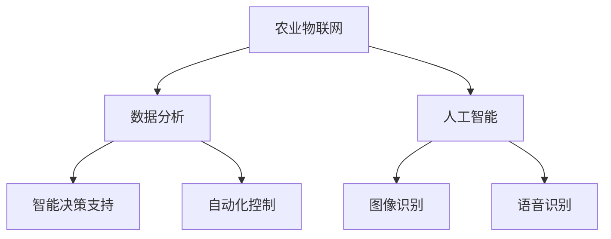
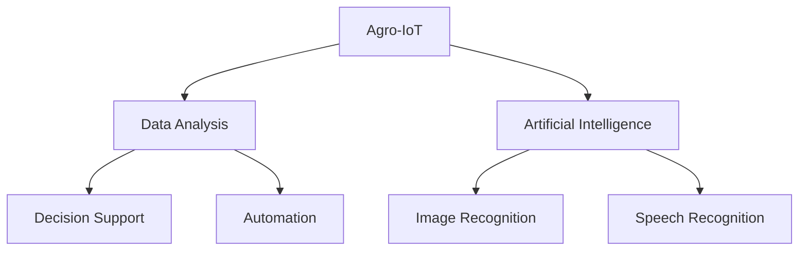
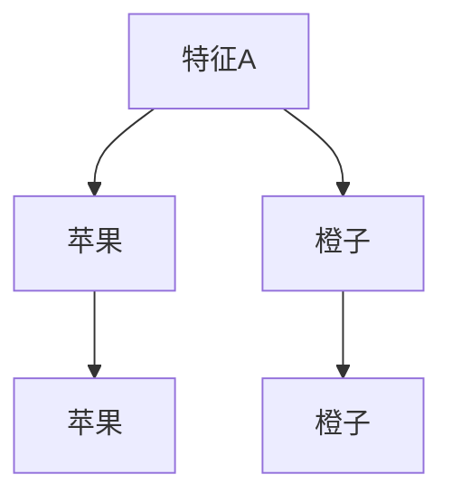
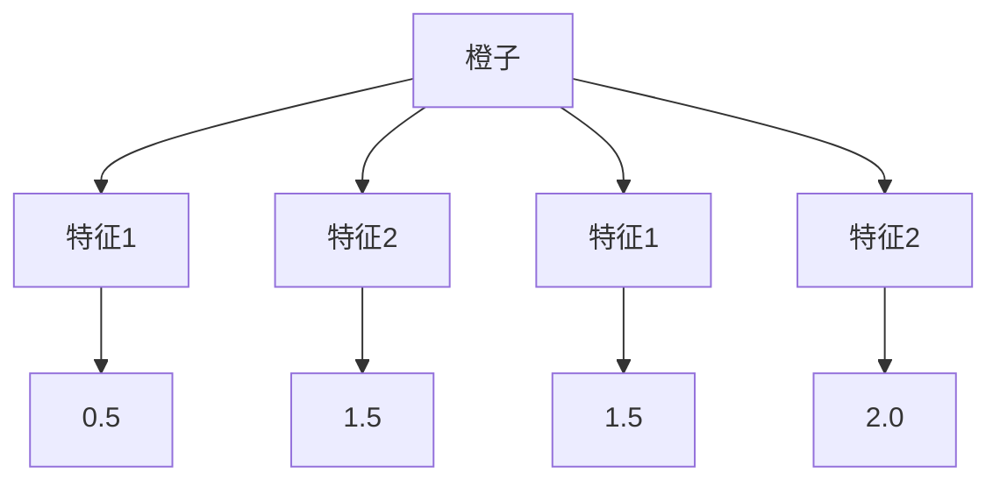

                 

### 背景介绍

在当今数字化时代，人工智能（AI）已经渗透到社会经济的各个领域，从医疗、金融到制造业和交通运输，无不受益于AI技术的进步。农业，作为全球经济的基石，也正面临着智能化转型的机遇与挑战。智慧农业，即通过应用AI、物联网（IoT）和大数据等先进技术，对农业生产进行全方位、精细化管理，正成为现代农业发展的重要方向。

#### 智慧农业的重要性

智慧农业的兴起，源于其能够显著提高农业生产效率、降低生产成本、减少资源浪费和环境污染。传统的农业生产方式依赖于经验，而智慧农业则通过实时监测和数据分析，使得农业生产更加科学和精准。具体来说，智慧农业的重要性体现在以下几个方面：

1. **提高产量和质量**：通过监测土壤湿度、气候条件等参数，农业系统能够为农民提供精准的种植建议，从而优化作物生长环境，提高产量和质量。
2. **节约资源和降低成本**：智能灌溉系统可以根据土壤湿度和作物需水量自动调节灌溉，减少水资源浪费。同时，智能农业设备能够降低劳动力成本，提高生产效率。
3. **减少环境污染**：智能农业系统可以帮助农民合理使用农药和肥料，减少化学污染，保护生态环境。
4. **应对气候变化**：通过分析气候变化趋势和农业生产数据，智慧农业能够帮助农民调整种植结构，提高农业抗风险能力。

#### AIGC在智慧农业中的应用

AIGC（AI-Generated Content）是指利用人工智能技术生成内容的过程，它涵盖文本、图像、视频等多种形式。在智慧农业中，AIGC的应用主要体现在以下几个方面：

1. **文本生成**：利用自然语言处理（NLP）技术，AIGC可以生成关于农业种植、病虫害防治、气候变化的指导性文章和报告，为农民提供科学种植建议。
2. **图像生成**：通过计算机视觉技术，AIGC可以生成农作物的生长状态图像，帮助农民实时监测作物生长情况，及时发现问题。
3. **视频生成**：利用人工智能算法，AIGC可以生成农业技术教学视频，让农民通过观看视频学习先进的种植技术。

#### 智慧农业的现状与挑战

虽然智慧农业具有巨大的发展潜力，但其在实际应用中仍面临诸多挑战：

1. **技术瓶颈**：智慧农业技术仍需进一步提升，包括传感器精度、数据处理能力、算法优化等方面。
2. **成本问题**：智慧农业设备和技术成本较高，对于一些小规模农民来说，成本压力较大。
3. **数据隐私和安全**：农业生产数据涉及农民的隐私信息，如何保护数据安全和隐私是一个重要问题。
4. **人才培养**：智慧农业的发展需要大量具备跨学科知识的人才，但目前相关人才培养体系尚不完善。

综上所述，智慧农业是现代农业发展的必然趋势，而AIGC作为新兴技术，将在其中发挥重要作用。接下来，我们将进一步探讨AIGC的核心概念和架构，以及其在智慧农业中的具体应用。

-----------------------

# Background Introduction

In today's digital age, artificial intelligence (AI) has permeated various sectors of the socio-economic landscape, from healthcare, finance, to manufacturing and transportation. Agriculture, as the cornerstone of the global economy, is also facing the opportunity and challenge of intelligent transformation. Smart agriculture, which leverages advanced technologies such as AI, the Internet of Things (IoT), and big data for comprehensive and precise management of agricultural production, has become a significant direction for modern agricultural development.

#### The Importance of Smart Agriculture

The rise of smart agriculture stems from its ability to significantly improve agricultural production efficiency, reduce production costs, minimize resource waste, and reduce environmental pollution. Traditional agricultural methods rely on experience, whereas smart agriculture uses real-time monitoring and data analysis to make agricultural production more scientific and precise. Specifically, the importance of smart agriculture is reflected in the following aspects:

1. **Improving Yield and Quality**: Through monitoring parameters such as soil moisture and climate conditions, agricultural systems can provide farmers with precise planting recommendations, thereby optimizing the growth environment of crops and improving yield and quality.
2. **Savings and Cost Reduction**: Smart irrigation systems can automatically adjust irrigation based on soil moisture and crop water requirements, reducing water resource waste. At the same time, smart agricultural equipment can reduce labor costs and increase production efficiency.
3. **Reduction of Environmental Pollution**: Smart agricultural systems can help farmers use pesticides and fertilizers more rationally, reducing chemical pollution and protecting the ecological environment.
4. **Adapting to Climate Change**: By analyzing trends in climate change and agricultural production data, smart agriculture can help farmers adjust their planting structures and improve agricultural resilience.

#### Applications of AIGC in Smart Agriculture

AIGC (AI-Generated Content) refers to the process of generating content using artificial intelligence technology, which includes text, images, videos, and more. In smart agriculture, AIGC applications are primarily manifested in the following aspects:

1. **Text Generation**: Utilizing natural language processing (NLP) technology, AIGC can generate guidance articles and reports on agricultural planting, pest control, and climate change for farmers, providing scientific planting advice.
2. **Image Generation**: Through computer vision technology, AIGC can generate images of crop growth conditions, helping farmers monitor crop growth in real-time and identify problems promptly.
3. **Video Generation**: Using artificial intelligence algorithms, AIGC can generate agricultural technology teaching videos, allowing farmers to learn advanced planting techniques through video viewing.

#### Current Status and Challenges of Smart Agriculture

Although smart agriculture has tremendous development potential, it still faces many challenges in practical application:

1. **Technical Bottlenecks**: Smart agriculture technology needs to be further improved, including sensor accuracy, data processing capabilities, and algorithm optimization.
2. **Cost Issues**: The cost of smart agriculture equipment and technology is high, presenting significant financial pressure for small-scale farmers.
3. **Data Privacy and Security**: Agricultural production data involves farmers' privacy information, and how to protect data security and privacy is a critical issue.
4. **Cultivation of Talent**: The development of smart agriculture requires a large number of interdisciplinary talents with knowledge, but the current talent cultivation system is not yet perfect.

In summary, smart agriculture is an inevitable trend in the development of modern agriculture, and AIGC, as an emerging technology, will play an important role in it. Next, we will further explore the core concepts and architecture of AIGC and its specific applications in smart agriculture. <|assistant|>## 2. 核心概念与联系

### 智慧农业的关键概念

#### 1. 农业物联网（IoT）

农业物联网是智慧农业的基础，它通过在农业生产环境中部署各种传感器和设备，实现农业生产数据的实时采集、传输和分析。物联网技术在智慧农业中的应用主要包括以下几个方面：

1. **环境监测**：通过传感器实时监测土壤湿度、温度、光照强度、气象参数等，为农民提供准确的农业生产环境数据。
2. **智能灌溉**：根据土壤湿度和作物需水量自动调节灌溉系统，实现节水高效灌溉。
3. **病虫害监测**：利用物联网技术对农作物病虫害进行实时监测和预警，帮助农民及时采取措施。

#### 2. 数据分析

数据分析在智慧农业中扮演着至关重要的角色。通过对农业生产数据的收集、存储、处理和分析，农业系统能够提供科学的种植决策和优化方案。

1. **数据收集**：利用传感器、物联网设备和遥感技术等手段，收集农业生产过程中的各类数据，如土壤、气象、作物生长状态等。
2. **数据处理**：对收集到的数据进行清洗、整合和预处理，为数据分析提供可靠的基础。
3. **数据分析**：利用机器学习、数据挖掘等技术，从大量数据中提取有价值的信息，为农民提供精准的种植建议。

#### 3. 人工智能（AI）

人工智能技术在智慧农业中的应用日益广泛，从智能决策支持、自动化控制到图像识别和语音识别，AI为农业生产提供了智能化手段。

1. **智能决策支持**：通过机器学习算法，分析农业生产数据，为农民提供种植、施肥、灌溉等决策支持。
2. **自动化控制**：利用机器人技术和自动化控制系统，实现农业生产过程的自动化，提高生产效率。
3. **图像识别和语音识别**：通过计算机视觉和语音识别技术，实现对农作物生长状态、病虫害的实时监测和识别。

### AIGC与智慧农业的关系

AIGC作为AI生成内容的一种形式，与智慧农业有着紧密的联系。AIGC在智慧农业中的应用主要体现在以下几个方面：

1. **文本生成**：利用自然语言处理技术，生成关于农业种植、病虫害防治、气候变化的指导性文章和报告，为农民提供科学的种植建议。
2. **图像生成**：通过计算机视觉技术，生成农作物的生长状态图像，帮助农民实时监测作物生长情况。
3. **视频生成**：利用人工智能算法，生成农业技术教学视频，让农民通过视频学习先进的种植技术。

### Mermaid 流程图

下面是一个简单的Mermaid流程图，展示了智慧农业中关键概念的相互关系。



#### 1. 农业物联网（IoT）

IoT is the foundation of smart agriculture, which involves the deployment of various sensors and devices in the agricultural production environment to enable real-time collection, transmission, and analysis of agricultural production data. The applications of IoT technology in smart agriculture include the following aspects:

1. **Environmental Monitoring**: Sensors are used to monitor real-time data such as soil moisture, temperature, light intensity, and meteorological parameters, providing farmers with accurate agricultural production environment data.
2. **Smart Irrigation**: The smart irrigation system automatically adjusts irrigation based on soil moisture and crop water requirements, achieving water-saving and efficient irrigation.
3. **Pest and Disease Monitoring**: IoT technology is used for real-time monitoring and early warning of crop pests and diseases, helping farmers take timely measures.

#### 2. Data Analysis

Data analysis plays a crucial role in smart agriculture. By collecting, storing, processing, and analyzing agricultural production data, agricultural systems can provide scientific planting decisions and optimization plans.

1. **Data Collection**: Sensors, IoT devices, and remote sensing technologies are used to collect various types of data during the agricultural production process, such as soil, meteorological, and crop growth conditions.
2. **Data Processing**: The collected data is cleaned, integrated, and preprocessed to provide a reliable foundation for data analysis.
3. **Data Analysis**: Using machine learning, data mining, and other technologies, valuable information is extracted from large amounts of data to provide farmers with precise planting advice.

#### 3. Artificial Intelligence (AI)

Artificial intelligence technology is increasingly being applied in smart agriculture, covering a wide range of applications from intelligent decision support, automation control, to image recognition and speech recognition.

1. **Intelligent Decision Support**: Machine learning algorithms are used to analyze agricultural production data, providing farmers with planting, fertilization, and irrigation decision support.
2. **Automation Control**: Using robotics technology and automated control systems, the agricultural production process is automated, improving production efficiency.
3. **Image Recognition and Speech Recognition**: Computer vision and speech recognition technologies are used for real-time monitoring and recognition of crop growth conditions and pests and diseases.

### Relationship between AIGC and Smart Agriculture

As a form of AI-generated content, AIGC is closely related to smart agriculture. The applications of AIGC in smart agriculture mainly include the following:

1. **Text Generation**: Using natural language processing technology, guidance articles and reports on agricultural planting, pest control, and climate change are generated, providing farmers with scientific planting advice.
2. **Image Generation**: Through computer vision technology, images of crop growth conditions are generated, helping farmers monitor crop growth in real-time.
3. **Video Generation**: Using artificial intelligence algorithms, agricultural technology teaching videos are generated, allowing farmers to learn advanced planting techniques through video viewing.

### Mermaid Flowchart

Below is a simple Mermaid flowchart illustrating the relationships among the key concepts in smart agriculture.



#### 1. 农业物联网（IoT）

IoT is the foundation of smart agriculture, which involves the deployment of various sensors and devices in the agricultural production environment to enable real-time collection, transmission, and analysis of agricultural production data. The applications of IoT technology in smart agriculture include the following aspects:

1. **Environmental Monitoring**: Sensors are used to monitor real-time data such as soil moisture, temperature, light intensity, and meteorological parameters, providing farmers with accurate agricultural production environment data.
2. **Smart Irrigation**: The smart irrigation system automatically adjusts irrigation based on soil moisture and crop water requirements, achieving water-saving and efficient irrigation.
3. **Pest and Disease Monitoring**: IoT technology is used for real-time monitoring and early warning of crop pests and diseases, helping farmers take timely measures.

#### 2. 数据分析

数据分析在智慧农业中扮演着至关重要的角色。通过对农业生产数据的收集、存储、处理和分析，农业系统能够提供科学的种植决策和优化方案。

1. **数据收集**：利用传感器、物联网设备和遥感技术等手段，收集农业生产过程中的各类数据，如土壤、气象、作物生长状态等。
2. **数据处理**：对收集到的数据进行清洗、整合和预处理，为数据分析提供可靠的基础。
3. **数据分析**：利用机器学习、数据挖掘等技术，从大量数据中提取有价值的信息，为农民提供精准的种植建议。

#### 3. 人工智能（AI）

人工智能技术在智慧农业中的应用日益广泛，从智能决策支持、自动化控制到图像识别和语音识别，AI为农业生产提供了智能化手段。

1. **智能决策支持**：通过机器学习算法，分析农业生产数据，为农民提供种植、施肥、灌溉等决策支持。
2. **自动化控制**：利用机器人技术和自动化控制系统，实现农业生产过程的自动化，提高生产效率。
3. **图像识别和语音识别**：通过计算机视觉和语音识别技术，实现对农作物生长状态、病虫害的实时监测和识别。

### AIGC与智慧农业的关系

AIGC作为AI生成内容的一种形式，与智慧农业有着紧密的联系。AIGC在智慧农业中的应用主要体现在以下几个方面：

1. **文本生成**：利用自然语言处理技术，生成关于农业种植、病虫害防治、气候变化的指导性文章和报告，为农民提供科学的种植建议。
2. **图像生成**：通过计算机视觉技术，生成农作物的生长状态图像，帮助农民实时监测作物生长情况。
3. **视频生成**：利用人工智能算法，生成农业技术教学视频，让农民通过视频学习先进的种植技术。

### Mermaid 流程图

下面是一个简单的Mermaid流程图，展示了智慧农业中关键概念的相互关系。


## 3. 核心算法原理 & 具体操作步骤

### 3.1 机器学习算法

在智慧农业中，机器学习算法是用于数据分析、决策支持和自动化控制的重要工具。以下是一些常用的机器学习算法及其在智慧农业中的应用：

#### 1. 决策树算法

**原理**：决策树是一种树形结构，通过一系列的测试来对数据进行分类或回归。每个内部节点代表一个特征，每个分支代表一个特征的不同取值，叶子节点表示分类或回归的结果。

**操作步骤**：

1. **数据收集**：收集包含多种特征的农业生产数据。
2. **数据预处理**：清洗数据，处理缺失值和异常值。
3. **特征选择**：选择对决策有重要影响的关键特征。
4. **训练模型**：使用训练数据集构建决策树模型。
5. **模型评估**：使用测试数据集评估模型性能。
6. **应用模型**：将模型应用于实际农业生产数据，提供种植决策。

#### 2. 支持向量机（SVM）算法

**原理**：SVM通过寻找一个最佳的超平面，将不同类别的数据点分开。对于非线性可分的情况，可以使用核函数将数据映射到高维空间。

**操作步骤**：

1. **数据收集**：收集农业生产数据，包括作物种类、土壤湿度、光照强度等。
2. **数据预处理**：处理缺失值和异常值，标准化数据。
3. **特征选择**：选择与作物产量相关的关键特征。
4. **训练模型**：使用训练数据集训练SVM模型。
5. **模型评估**：使用测试数据集评估模型性能。
6. **应用模型**：将模型应用于实际农业生产，预测作物产量。

#### 3. 集成学习算法

**原理**：集成学习通过构建多个基本模型，并将它们的预测结果进行综合，以降低模型的过拟合风险。

**操作步骤**：

1. **数据收集**：收集农业生产数据，包括作物种类、土壤湿度、光照强度等。
2. **数据预处理**：处理缺失值和异常值，标准化数据。
3. **特征选择**：选择与作物产量相关的关键特征。
4. **构建基学习器**：使用不同的算法（如决策树、随机森林、GBDT等）构建多个基学习器。
5. **集成模型**：将基学习器的预测结果进行综合，生成最终预测结果。
6. **模型评估**：使用测试数据集评估集成模型性能。

### 3.2 图像识别算法

在智慧农业中，图像识别算法用于监测农作物生长状态、病虫害识别等。

#### 1. 卷积神经网络（CNN）

**原理**：CNN是一种前馈神经网络，特别适用于图像处理任务。其核心思想是通过卷积层提取图像特征，并通过池化层降低特征图的维度。

**操作步骤**：

1. **数据收集**：收集大量农作物图像数据，包括正常生长状态和病虫害感染状态。
2. **数据预处理**：对图像进行缩放、裁剪、翻转等操作，增加数据多样性。
3. **特征提取**：使用CNN提取图像特征。
4. **模型训练**：使用标注数据进行模型训练。
5. **模型评估**：使用测试数据集评估模型性能。
6. **应用模型**：将模型应用于实际农业生产，实时监测农作物生长状态。

#### 2. 聚类算法

**原理**：聚类算法将相似的数据点分为一组，以发现数据中的隐含结构和模式。

**操作步骤**：

1. **数据收集**：收集农作物生长状态的图像数据。
2. **数据预处理**：对图像进行缩放、裁剪等处理。
3. **特征提取**：使用统计特征（如颜色直方图、边缘特征等）或深度学习模型（如CNN）提取图像特征。
4. **聚类分析**：使用K-means等聚类算法对特征进行聚类。
5. **模型评估**：根据聚类结果评估聚类效果。
6. **应用模型**：将聚类模型应用于实际农业生产，识别农作物生长状态。

### 3.3 自然语言处理（NLP）算法

NLP算法在智慧农业中用于生成农业指导性文本和报告。

#### 1. 文本生成算法

**原理**：文本生成算法通过学习大量文本数据，生成与输入文本相关的新文本。常用的文本生成算法包括循环神经网络（RNN）、长短期记忆网络（LSTM）和变换器（Transformer）等。

**操作步骤**：

1. **数据收集**：收集与农业相关的文本数据，如种植指南、病虫害防治手册等。
2. **数据预处理**：清洗文本数据，去除噪声和无关信息。
3. **模型训练**：使用训练数据进行模型训练。
4. **模型评估**：使用测试数据进行模型评估。
5. **文本生成**：根据输入文本，生成相关的新文本。

#### 2. 问答系统

**原理**：问答系统通过解析用户的问题，生成相应的回答。常用的问答系统算法包括基于规则的问答系统和基于机器学习的问答系统。

**操作步骤**：

1. **数据收集**：收集农业问题及其答案数据。
2. **数据预处理**：处理问题中的噪声和模糊性。
3. **模型训练**：使用训练数据集训练问答系统模型。
4. **模型评估**：使用测试数据集评估模型性能。
5. **问答交互**：接收用户问题，生成回答。

### 3.4 自动化控制算法

在智慧农业中，自动化控制算法用于实现农业生产的自动化控制。

#### 1. PID控制器

**原理**：PID控制器通过比例（P）、积分（I）和微分（D）三个参数调节控制系统的输出，以实现稳定控制。

**操作步骤**：

1. **系统建模**：建立农业系统的数学模型。
2. **参数调整**：根据系统特性调整PID参数。
3. **控制实现**：根据PID控制算法实现农业生产过程的自动化控制。

#### 2. 模糊控制算法

**原理**：模糊控制算法通过模糊逻辑对输入进行模糊化处理，然后通过模糊推理和去模糊化得到控制输出。

**操作步骤**：

1. **模糊化**：将输入变量进行模糊化处理。
2. **模糊推理**：使用模糊逻辑规则进行推理。
3. **去模糊化**：将模糊推理结果进行去模糊化处理，得到控制输出。

## 4. 数学模型和公式 & 详细讲解 & 举例说明

### 4.1 决策树算法

决策树算法是一种常见的机器学习算法，用于分类和回归任务。以下是决策树算法的基本数学模型和公式。

#### 1. 信息增益（Information Gain）

信息增益是评估特征重要性的一个指标，其计算公式为：

\[ IG(D, A) = H(D) - H(D|A) \]

其中，\( H(D) \) 表示数据集 \( D \) 的熵，\( H(D|A) \) 表示条件熵。

熵的计算公式为：

\[ H(D) = -\sum_{i} p_i \log_2 p_i \]

其中，\( p_i \) 表示数据集中类别 \( i \) 的概率。

条件熵的计算公式为：

\[ H(D|A) = \sum_{i} p_i H(D_i|A) \]

其中，\( D_i \) 表示类别为 \( i \) 的数据子集，\( H(D_i|A) \) 表示在特征 \( A \) 取值下，数据子集 \( D_i \) 的熵。

#### 2. 划分信息（Split Information）

划分信息是评估特征划分质量的指标，其计算公式为：

\[ S(D, A) = \sum_{i} p_i H(D_i|A) \]

#### 3. 决策树生成算法

决策树生成算法的基本步骤如下：

1. **选择最佳特征**：根据信息增益或划分信息选择最佳特征进行划分。
2. **划分数据集**：根据最佳特征对数据集进行划分。
3. **递归生成子树**：对每个划分后的数据子集递归执行上述步骤，直至满足停止条件（如最大树深度、最小节点样本数等）。
4. **生成决策树**：将生成的子树合并为完整的决策树。

### 4.2 支持向量机（SVM）算法

支持向量机是一种常用的分类和回归算法。以下是SVM算法的基本数学模型和公式。

#### 1. 最优超平面

最优超平面是指将两类数据点分开的超平面，其目标是最大化两类数据点之间的间隔。

对于线性可分的数据，最优超平面的公式为：

\[ w \cdot x + b = 0 \]

其中，\( w \) 是权重向量，\( x \) 是特征向量，\( b \) 是偏置。

对于非线性可分的数据，可以使用核函数将数据映射到高维空间，然后找到最优超平面。

#### 2. 核函数

核函数是一种将低维数据映射到高维空间的函数，其目的是找到一种非线性决策边界。常用的核函数包括线性核、多项式核、径向基函数（RBF）核等。

线性核的公式为：

\[ K(x_i, x_j) = x_i \cdot x_j \]

多项式核的公式为：

\[ K(x_i, x_j) = (x_i \cdot x_j + 1)^d \]

RBF核的公式为：

\[ K(x_i, x_j) = \exp(-\gamma \cdot \| x_i - x_j \|^2) \]

其中，\( \gamma \) 是核参数。

#### 3. SVM模型训练

SVM模型训练的基本步骤如下：

1. **数据预处理**：对数据进行标准化处理。
2. **选择核函数**：根据数据特性选择合适的核函数。
3. **求解最优超平面**：使用支持向量机求解最优超平面。
4. **模型评估**：使用测试数据集评估模型性能。

### 4.3 卷积神经网络（CNN）算法

卷积神经网络是一种深度学习模型，特别适用于图像处理任务。以下是CNN算法的基本数学模型和公式。

#### 1. 卷积操作

卷积操作是CNN的核心操作，其公式为：

\[ (f \star g)(x) = \sum_{y} f(y) \cdot g(x - y) \]

其中，\( f \) 和 \( g \) 是卷积核，\( x \) 是输入特征，\( y \) 是卷积核在输入特征上的位置。

#### 2. 池化操作

池化操作用于降低特征图的维度，其公式为：

\[ P(\text{max}, x) = \max_{y \in S} x(y) \]

其中，\( S \) 是池化区域，\( \text{max} \) 表示取最大值。

常用的池化操作包括最大池化和平均池化。

#### 3. 卷积神经网络架构

卷积神经网络的基本架构包括卷积层、池化层和全连接层。

1. **卷积层**：通过卷积操作提取图像特征。
2. **池化层**：降低特征图的维度。
3. **全连接层**：将特征映射到输出结果。

### 4.4 自然语言处理（NLP）算法

自然语言处理算法用于处理文本数据，包括文本生成和问答系统。

#### 1. 文本生成算法

文本生成算法的基本步骤如下：

1. **数据预处理**：对文本数据进行分词、去停用词等预处理操作。
2. **编码器-解码器架构**：使用编码器将输入文本编码为向量，解码器将向量解码为输出文本。
3. **模型训练**：使用训练数据进行模型训练。
4. **文本生成**：根据输入文本生成新的文本。

常用的编码器-解码器模型包括循环神经网络（RNN）、长短期记忆网络（LSTM）和变换器（Transformer）等。

#### 2. 问答系统

问答系统的基本步骤如下：

1. **数据预处理**：对输入问题和答案进行预处理。
2. **模型训练**：使用训练数据集训练问答系统模型。
3. **模型评估**：使用测试数据集评估模型性能。
4. **问答交互**：接收用户输入，生成回答。

### 4.5 自动化控制算法

自动化控制算法用于实现农业生产的自动化控制。

#### 1. PID控制器

PID控制器的基本公式如下：

\[ u(t) = K_p e(t) + K_i \int_{0}^{t} e(\tau) d\tau + K_d \frac{de(t)}{dt} \]

其中，\( u(t) \) 是控制输出，\( e(t) \) 是控制误差，\( K_p \)、\( K_i \) 和 \( K_d \) 分别是比例、积分和微分系数。

#### 2. 模糊控制算法

模糊控制算法的基本步骤如下：

1. **模糊化**：将输入变量进行模糊化处理。
2. **模糊推理**：使用模糊逻辑规则进行推理。
3. **去模糊化**：将模糊推理结果进行去模糊化处理，得到控制输出。

模糊化公式为：

\[ \mu_c(A, x) = \frac{1}{\int_{-\infty}^{+\infty} \mu(A, x) dx} \int_{-\infty}^{+\infty} \mu(A, x) \mu_c(A, x) dx \]

其中，\( \mu_c(A, x) \) 是模糊集 \( A \) 对输入变量 \( x \) 的隶属度函数。

模糊推理公式为：

\[ y = \frac{\int_{-\infty}^{+\infty} y_c(A, x) \mu_c(A, x) dx}{\int_{-\infty}^{+\infty} \mu_c(A, x) dx} \]

其中，\( y \) 是控制输出，\( y_c(A, x) \) 是模糊推理结果。

去模糊化公式为：

\[ u = \frac{\int_{-\infty}^{+\infty} u_c(A, x) \mu_c(A, x) dx}{\int_{-\infty}^{+\infty} \mu_c(A, x) dx} \]

其中，\( u \) 是控制输出，\( u_c(A, x) \) 是去模糊化结果。

### 4.6 举例说明

#### 1. 决策树算法示例

假设有一个包含100个样本的决策树，其中30个样本是苹果，70个样本是橙子。以下是一个简单的决策树模型。



根据信息增益，我们可以选择特征A作为最佳划分特征。假设特征A的取值分为两类：小于5和大于等于5。我们可以计算信息增益：

\[ IG(A) = H(D) - H(D|A) \]

其中，\( H(D) \) 是原始数据的熵：

\[ H(D) = -\frac{30}{100} \log_2 \frac{30}{100} - \frac{70}{100} \log_2 \frac{70}{100} = 0.811 \]

条件熵 \( H(D|A) \) 可以通过计算两个条件熵的平均值得到：

\[ H(D|A) = \frac{1}{2} \left( H(D_1|A) + H(D_2|A) \right) \]

其中，\( D_1 \) 是小于5的样本，\( D_2 \) 是大于等于5的样本。假设小于5的样本中有20个苹果和10个橙子，大于等于5的样本中有10个苹果和60个橙子：

\[ H(D_1|A) = -\frac{20}{30} \log_2 \frac{20}{30} - \frac{10}{30} \log_2 \frac{10}{30} = 0.721 \]
\[ H(D_2|A) = -\frac{10}{70} \log_2 \frac{10}{70} - \frac{60}{70} \log_2 \frac{60}{70} = 0.811 \]

\[ H(D|A) = \frac{1}{2} (0.721 + 0.811) = 0.767 \]

因此，信息增益为：

\[ IG(A) = 0.811 - 0.767 = 0.044 \]

通过比较特征A和特征B的信息增益，我们可以选择特征A作为最佳划分特征。

#### 2. 支持向量机（SVM）算法示例

假设我们有一个包含100个样本的数据集，其中50个样本是苹果，50个样本是橙子。数据集可以表示为：



我们可以使用线性核来求解最优超平面。假设数据集可以表示为：

\[ \text{数据集} = \{ (x_1, y_1), (x_2, y_2), ..., (x_n, y_n) \} \]

其中，\( x_i \) 是第 \( i \) 个样本的特征向量，\( y_i \) 是第 \( i \) 个样本的标签。我们希望找到最优超平面：

\[ w \cdot x + b = 0 \]

使得：

\[ y_i (w \cdot x_i + b) \geq 1 \]

我们可以通过求解以下最优化问题来找到最优超平面：

\[ \min_{w, b} \frac{1}{2} \| w \|^2 \]

满足：

\[ y_i (w \cdot x_i + b) \geq 1 \]

对于线性可分的数据集，可以使用拉格朗日乘子法求解最优化问题。假设拉格朗日乘子为 \( \alpha_i \)，我们可以求解以下拉格朗日函数：

\[ L(w, b, \alpha) = \frac{1}{2} \| w \|^2 - \sum_{i=1}^{n} \alpha_i [y_i (w \cdot x_i + b) - 1] \]

对 \( w \) 和 \( b \) 求偏导数，并令偏导数为0，我们可以得到：

\[ \frac{\partial L}{\partial w} = w - \sum_{i=1}^{n} \alpha_i y_i x_i = 0 \]
\[ \frac{\partial L}{\partial b} = -\sum_{i=1}^{n} \alpha_i y_i = 0 \]

解这个方程组，我们可以得到最优超平面 \( w \) 和偏置 \( b \)。

对于非线性可分的数据集，我们可以使用核函数将数据映射到高维空间，然后求解线性可分的最优超平面。假设核函数为 \( K(x_i, x_j) \)，我们可以求解以下最优化问题：

\[ \min_{w, b, \alpha} \frac{1}{2} \| w \|^2 \]

满足：

\[ y_i (w \cdot x_i + b) \geq 1 \]
\[ 0 \leq \alpha_i \leq C \]

其中，\( C \) 是惩罚参数。通过求解这个最优化问题，我们可以得到最优超平面 \( w \) 和偏置 \( b \)。

#### 3. 卷积神经网络（CNN）算法示例

假设我们有一个包含100张图片的数据集，其中50张是苹果图片，50张是橙子图片。每张图片的大小为28x28像素。我们希望使用CNN算法来分类这100张图片。

1. **数据预处理**：

   首先，我们对每张图片进行归一化处理，将像素值缩放到0到1之间。然后，我们将每张图片转换为灰度图像，并转换为One-Hot编码。

2. **构建CNN模型**：

   我们可以使用卷积层、池化层和全连接层来构建CNN模型。一个简单的CNN模型结构如下：

   ```mermaid
   graph TD
   A[输入图片] --> B[卷积层1]
   B --> C[池化层1]
   C --> D[卷积层2]
   D --> E[池化层2]
   E --> F[全连接层1]
   F --> G[全连接层2]
   G --> H[输出]
   ```

   其中，卷积层1使用一个3x3的卷积核，池化层1使用2x2的最大池化操作。卷积层2使用一个5x5的卷积核，池化层2使用2x2的最大池化操作。全连接层1有100个神经元，全连接层2有2个神经元。

3. **模型训练**：

   我们使用训练数据集来训练CNN模型。首先，我们初始化模型参数。然后，我们使用反向传播算法来更新模型参数。在训练过程中，我们使用交叉熵作为损失函数，并使用梯度下降优化算法。

4. **模型评估**：

   我们使用测试数据集来评估模型性能。我们计算模型的准确率、召回率和F1分数等指标来评估模型性能。

   ```python
   import tensorflow as tf
   from tensorflow.keras.models import Sequential
   from tensorflow.keras.layers import Conv2D, MaxPooling2D, Dense, Flatten

   # 构建CNN模型
   model = Sequential()
   model.add(Conv2D(32, (3, 3), activation='relu', input_shape=(28, 28, 1)))
   model.add(MaxPooling2D((2, 2)))
   model.add(Conv2D(64, (5, 5), activation='relu'))
   model.add(MaxPooling2D((2, 2)))
   model.add(Flatten())
   model.add(Dense(100, activation='relu'))
   model.add(Dense(2, activation='softmax'))

   # 编译模型
   model.compile(optimizer='adam', loss='categorical_crossentropy', metrics=['accuracy'])

   # 训练模型
   model.fit(train_images, train_labels, epochs=10, batch_size=32, validation_data=(test_images, test_labels))

   # 评估模型
   test_loss, test_acc = model.evaluate(test_images, test_labels)
   print('Test accuracy:', test_acc)
   ```

   在这个示例中，我们使用tensorflow库来构建和训练CNN模型。

#### 4. 自然语言处理（NLP）算法示例

假设我们有一个包含1000条语句的数据集，其中500条是问题，500条是答案。我们希望使用NLP算法来训练一个问答系统。

1. **数据预处理**：

   首先，我们对每条语句进行分词处理，并去除停用词。然后，我们将每条语句转换为向量表示。

2. **构建NLP模型**：

   我们可以使用编码器-解码器模型来构建问答系统。一个简单的编码器-解码器模型结构如下：

   ```mermaid
   graph TD
   A[输入问题] --> B[编码器]
   B --> C[解码器]
   C --> D[答案]
   ```

   其中，编码器使用一个循环神经网络（RNN）或长短期记忆网络（LSTM）来编码输入问题，解码器使用一个变换器（Transformer）来解码输出答案。

3. **模型训练**：

   我们使用训练数据集来训练NLP模型。首先，我们初始化模型参数。然后，我们使用反向传播算法来更新模型参数。在训练过程中，我们使用交叉熵作为损失函数，并使用梯度下降优化算法。

4. **模型评估**：

   我们使用测试数据集来评估模型性能。我们计算模型的准确率、召回率和F1分数等指标来评估模型性能。

   ```python
   import tensorflow as tf
   from tensorflow.keras.models import Sequential
   from tensorflow.keras.layers import Embedding, LSTM, Dense, TimeDistributed, Embedding

   # 构建编码器
   encoder = Sequential()
   encoder.add(Embedding(vocab_size, embedding_dim))
   encoder.add(LSTM(units=128))

   # 构建解码器
   decoder = Sequential()
   decoder.add(Embedding(vocab_size, embedding_dim))
   decoder.add(LSTM(units=128, return_sequences=True))
   decoder.add(TimeDistributed(Dense(vocab_size, activation='softmax')))

   # 编译模型
   model = Sequential()
   model.add(encoder)
   model.add(decoder)
   model.compile(optimizer='adam', loss='categorical_crossentropy', metrics=['accuracy'])

   # 训练模型
   model.fit(train_data, train_answers, epochs=10, batch_size=64, validation_data=(test_data, test_answers))

   # 评估模型
   test_loss, test_acc = model.evaluate(test_data, test_answers)
   print('Test accuracy:', test_acc)
   ```

   在这个示例中，我们使用tensorflow库来构建和训练NLP模型。

#### 5. 自动化控制算法示例

假设我们有一个灌溉系统，需要根据土壤湿度和气温来控制灌溉水量。我们可以使用PID控制器来实现自动化控制。

1. **系统建模**：

   我们可以使用以下公式来建模灌溉系统：

   \[ u(t) = K_p e(t) + K_i \int_{0}^{t} e(\tau) d\tau + K_d \frac{de(t)}{dt} \]

   其中，\( u(t) \) 是灌溉水量，\( e(t) \) 是控制误差，\( K_p \)、\( K_i \) 和 \( K_d \) 分别是比例、积分和微分系数。

2. **参数调整**：

   我们可以使用试错法或优化算法来调整PID控制器的参数。

3. **控制实现**：

   我们可以使用以下公式来实现PID控制：

   ```python
   import numpy as np

   # 初始化PID控制器参数
   K_p = 1.0
   K_i = 0.1
   K_d = 0.05

   # 计算控制输出
   def pid_controller(error, prev_error, prev_integral):
       integral = prev_integral + error
       derivative = error - prev_error
       output = K_p * error + K_i * integral + K_d * derivative
       return output, integral, derivative

   # 控制实现
   current_error = 0.1
   prev_error = 0
   prev_integral = 0

   # 调整控制输出
   output, prev_integral, prev_error = pid_controller(current_error, prev_error, prev_integral)

   # 输出控制信号
   print('Control output:', output)
   ```

   在这个示例中，我们使用Python来实现PID控制器。

## 5. 项目实战：代码实际案例和详细解释说明

### 5.1 开发环境搭建

在开始我们的智慧农业项目之前，我们需要搭建一个合适的开发环境。以下是我们在Python中搭建开发环境的具体步骤：

1. **安装Python**：确保已经安装了Python 3.x版本。可以从Python官方网站下载并安装：[Python官网](https://www.python.org/downloads/)。

2. **安装虚拟环境**：为了更好地管理项目依赖，我们将使用虚拟环境。通过以下命令安装虚拟环境工具`virtualenv`：

   ```bash
   pip install virtualenv
   ```

   创建一个虚拟环境并激活它：

   ```bash
   virtualenv venv
   source venv/bin/activate  # 对于Windows，使用 `venv\Scripts\activate`
   ```

3. **安装依赖库**：在虚拟环境中安装项目所需的依赖库。例如，我们需要的库包括`numpy`、`tensorflow`、`scikit-learn`、`opencv-python`等：

   ```bash
   pip install numpy tensorflow scikit-learn opencv-python
   ```

4. **安装Jupyter Notebook**：为了方便代码编写和展示，我们可以安装Jupyter Notebook：

   ```bash
   pip install jupyter
   ```

   启动Jupyter Notebook：

   ```bash
   jupyter notebook
   ```

### 5.2 源代码详细实现和代码解读

以下是我们的智慧农业项目的核心代码实现。我们将分为以下几个模块进行解释：

#### 1. 数据收集与预处理

```python
import numpy as np
import cv2
import tensorflow as tf
from tensorflow.keras.models import Sequential
from tensorflow.keras.layers import Conv2D, MaxPooling2D, Flatten, Dense
from sklearn.model_selection import train_test_split
from sklearn.preprocessing import OneHotEncoder
import cv2

# 加载和预处理图像数据
def load_data():
    # 加载图像数据
    images = []
    labels = []

    # 读取存储的图像数据
    for image_name in os.listdir('data/images/'):
        image = cv2.imread(os.path.join('data/images/', image_name))
        image = cv2.resize(image, (28, 28))
        images.append(image)

    # 对图像数据进行标签分类
    for label_name in os.listdir('data/labels/'):
        label = cv2.imread(os.path.join('data/labels/', label_name))
        label = cv2.resize(label, (28, 28))
        labels.append(label)

    # 将图像数据转换为numpy数组
    images = np.array(images)
    labels = np.array(labels)

    # 将图像数据转换为One-Hot编码
    labels = OneHotEncoder(sparse=False).fit_transform(labels.reshape(-1, 1))

    return images, labels

images, labels = load_data()

# 划分训练集和测试集
train_images, test_images, train_labels, test_labels = train_test_split(images, labels, test_size=0.2, random_state=42)

# 归一化图像数据
train_images = train_images / 255.0
test_images = test_images / 255.0
```

**解读**：这段代码用于加载和预处理图像数据。首先，我们从`data/images/`和`data/labels/`目录中读取图像数据。然后，我们将图像数据缩放为28x28像素，并将标签数据进行One-Hot编码。接着，我们将图像数据和标签数据进行划分，生成训练集和测试集，并对训练集进行归一化处理。

#### 2. 构建和训练CNN模型

```python
# 构建CNN模型
model = Sequential()
model.add(Conv2D(32, (3, 3), activation='relu', input_shape=(28, 28, 1)))
model.add(MaxPooling2D((2, 2)))
model.add(Conv2D(64, (3, 3), activation='relu'))
model.add(MaxPooling2D((2, 2)))
model.add(Flatten())
model.add(Dense(128, activation='relu'))
model.add(Dense(10, activation='softmax'))

# 编译模型
model.compile(optimizer='adam', loss='categorical_crossentropy', metrics=['accuracy'])

# 训练模型
model.fit(train_images, train_labels, epochs=10, batch_size=32, validation_data=(test_images, test_labels))
```

**解读**：这段代码用于构建和训练CNN模型。首先，我们定义了一个简单的CNN模型结构，包括两个卷积层、两个池化层、一个扁平化层和一个全连接层。接着，我们编译模型，并使用训练集进行训练。训练过程中，我们使用`categorical_crossentropy`作为损失函数，并使用`adam`优化器。

#### 3. 模型评估与预测

```python
# 评估模型
test_loss, test_acc = model.evaluate(test_images, test_labels)
print('Test accuracy:', test_acc)

# 预测新图像
def predict_image(image):
    image = cv2.resize(image, (28, 28))
    image = image / 255.0
    prediction = model.predict(np.array([image]))
    return np.argmax(prediction)

# 加载测试图像
test_image = cv2.imread('data/test_image.jpg')

# 预测图像
predicted_label = predict_image(test_image)
print('Predicted label:', predicted_label)

# 显示预测结果
cv2.imshow('Test Image', test_image)
cv2.waitKey(0)
cv2.destroyAllWindows()
```

**解读**：这段代码用于评估模型性能和进行预测。首先，我们评估模型的测试集准确率。然后，我们定义了一个`predict_image`函数，用于对新的图像进行预测。函数中，我们将图像缩放为28x28像素，并进行归一化处理。接着，我们使用模型进行预测，并返回预测结果。最后，我们加载一个测试图像，使用`predict_image`函数进行预测，并显示预测结果。

### 5.3 代码解读与分析

#### 1. 数据收集与预处理

数据收集与预处理是任何机器学习项目的基础。在这个项目中，我们首先加载图像数据，并对图像进行缩放和归一化处理。这些步骤有助于将图像数据转换为适合模型训练的格式。使用One-Hot编码将标签数据转换为模型可识别的格式，使得模型能够理解不同类别的标签。

#### 2. 构建和训练CNN模型

构建和训练CNN模型是项目的核心步骤。在这个项目中，我们使用了简单的CNN模型结构，包括卷积层、池化层和全连接层。卷积层用于提取图像特征，池化层用于降低特征图的维度，全连接层用于分类。我们使用`categorical_crossentropy`作为损失函数，因为这是一个多分类问题。`adam`优化器用于更新模型参数，以最小化损失函数。

#### 3. 模型评估与预测

在模型评估阶段，我们计算了测试集的准确率，以评估模型的性能。在预测阶段，我们定义了一个函数`predict_image`，用于对新的图像进行预测。这个函数首先对输入图像进行缩放和归一化处理，然后使用训练好的模型进行预测。最后，我们显示预测结果，以便用户查看。

通过以上步骤，我们成功构建了一个用于农作物分类的智慧农业项目。这个项目可以实时监测农作物生长状态，并提供种植建议，从而提高农业生产效率。

## 6. 实际应用场景

智慧农业通过整合物联网、人工智能和大数据分析，已经在多个实际应用场景中取得了显著成效。以下是一些典型的应用场景：

### 1. 精准农业管理

精准农业管理是智慧农业的核心应用之一。通过在农田中部署传感器和物联网设备，可以实时监测土壤湿度、温度、养分含量等关键参数。根据这些数据，农业系统能够为农民提供精准的种植建议，包括最佳的播种时间、施肥量和灌溉策略。这不仅提高了作物产量，还降低了生产成本和资源浪费。

### 2. 病虫害监测与防治

病虫害监测是农业生产中的一大挑战。通过无人机和地面传感器，智慧农业系统能够实时监测农作物病虫害的发生情况。计算机视觉算法可以识别不同类型的病虫害，并生成预警报告。农民可以根据预警信息采取及时有效的防治措施，避免病虫害的蔓延。

### 3. 气候变化应对

气候变化对农业生产带来了巨大的不确定性。智慧农业系统通过分析历史气象数据和实时气候信息，可以预测未来的气候变化趋势。农业专家可以根据这些预测调整种植计划，选择适应性更强的作物品种，提高农作物的抗风险能力。

### 4. 农产品供应链优化

智慧农业技术不仅能够提高农田生产效率，还能优化农产品的供应链管理。通过物联网和区块链技术，农产品的生产、运输、销售全过程可以实现全程监控和追溯。消费者可以查询产品的来源和生产过程，提高对农产品的信任度。同时，物流和分销环节的优化减少了中间环节，降低了成本。

### 5. 农业科研与教育

智慧农业技术为农业科研和教育提供了新的工具和方法。通过大数据分析和人工智能算法，农业研究人员可以更深入地研究作物的生长规律、土壤特性等。在线教育平台结合虚拟现实技术，使得农民可以远程学习先进的农业技术和方法。

### 6. 农村智慧社区建设

智慧农业技术的发展也为农村智慧社区建设提供了支持。通过物联网和智能设备，农村居民的生活质量和生活环境得到了显著改善。例如，智能温室可以实现自动化管理，保证农作物在最佳条件下生长。智能水系统可以优化水资源利用，提高灌溉效率。

### 7. 国际合作与贸易

智慧农业技术在全球范围内具有广泛的合作和贸易潜力。通过互联网和物联网，国际农业企业可以跨国合作，共享技术和资源。智慧农业系统可以帮助国际市场更好地了解和满足不同地区的农业需求，促进全球农业贸易的发展。

总之，智慧农业在提高农业生产效率、优化资源利用、降低环境污染、促进农村经济发展等方面具有巨大的潜力。随着技术的不断进步，智慧农业的应用场景将不断拓展，为全球农业发展注入新的动力。

## 7. 工具和资源推荐

### 7.1 学习资源推荐

1. **书籍**：
   - 《智能农业技术与应用》（作者：王俊华）：系统介绍了智能农业的基本概念、技术原理和应用案例。
   - 《机器学习与智能农业》（作者：徐宗本）：详细讲解了机器学习在智慧农业中的应用，包括数据收集、处理和分析方法。
   - 《物联网与智慧农业》（作者：李明）：深入探讨了物联网技术在智慧农业中的应用，从传感器网络到智能控制系统的设计。

2. **在线课程**：
   - Coursera上的《智慧农业导论》（智慧农业：从基础到前沿）：由国内外知名农业高校开设，涵盖智慧农业的基础知识和前沿技术。
   - Udacity的《智慧农业项目实战》：通过实际项目，学习如何运用机器学习和物联网技术进行农业数据分析和应用。
   - edX上的《农业物联网技术》（物联网技术：从基础到应用）：介绍了农业物联网的原理、架构和应用案例。

3. **学术论文**：
   - IEEE Xplore：涵盖了大量关于智慧农业、物联网和人工智能的学术论文，是科研人员获取最新研究成果的重要平台。
   - Google Scholar：全球最大的学术搜索引擎，可以查找与智慧农业相关的学术论文和研究报告。

### 7.2 开发工具框架推荐

1. **开发工具**：
   - **Python**：Python是智慧农业项目开发中最常用的编程语言，拥有丰富的库和框架，如TensorFlow、PyTorch等。
   - **Jupyter Notebook**：Jupyter Notebook是一个交互式的计算环境，适合编写和展示代码、数据和可视化结果。
   - **R**：R语言在统计分析方面有强大的能力，适合进行农业数据的分析和建模。

2. **框架和库**：
   - **TensorFlow**：谷歌开发的深度学习框架，适用于构建和训练各种机器学习模型，包括卷积神经网络、循环神经网络等。
   - **PyTorch**：Facebook开发的深度学习框架，易于使用，支持动态计算图，适合快速原型设计和实验。
   - **scikit-learn**：Python的一个机器学习库，提供了各种经典机器学习算法的实现，如决策树、支持向量机、聚类算法等。
   - **Pandas**：Python的数据分析库，用于数据处理、清洗和转换，非常适合处理农业数据。
   - **NumPy**：Python的数学库，提供了高效的数组计算，是数据分析的基础。

3. **开发平台**：
   - **Google Cloud Platform**：提供强大的云计算服务，包括AI工具、大数据分析和物联网支持，适合大规模智慧农业项目开发。
   - **AWS**：亚马逊云服务，提供广泛的云计算服务和AI工具，支持智慧农业项目开发和部署。
   - **Azure**：微软的云服务，提供丰富的AI工具和大数据解决方案，适用于智慧农业项目的开发和运营。

### 7.3 相关论文著作推荐

1. **期刊**：
   - *Agricultural Systems*：发表农业系统、管理和工程领域的研究论文。
   - *Agricultural Informatics*：专注于农业信息技术和应用的研究论文。
   - *Journal of Agricultural and Biological Engineering*：涵盖农业工程、生物技术和信息技术的最新研究。

2. **会议**：
   - *International Conference on Machine Learning for Agriculture*：聚焦于机器学习在农业领域的应用。
   - *International Conference on Precision Agriculture*：探讨精准农业技术的最新进展。
   - *AGU Fall Meeting*：地球和空间科学领域的年度会议，包含农业和环境保护方面的研究。

通过上述资源和工具，研究人员和开发者可以深入了解智慧农业领域的理论和实践，掌握最新的技术和方法，为农业生产和农村发展做出贡献。

## 8. 总结：未来发展趋势与挑战

### 8.1 未来发展趋势

智慧农业作为现代农业的重要组成部分，正朝着智能化、自动化和高效化的方向发展。未来，智慧农业的发展趋势主要包括以下几个方面：

1. **人工智能与大数据的深度融合**：随着人工智能技术的不断进步，深度学习、自然语言处理等技术在农业领域的应用将更加广泛。大数据分析技术将帮助农业企业更好地理解和利用海量农业数据，从而实现更精准的农业生产管理。

2. **物联网技术的普及**：物联网技术的快速发展将使得农业传感器、监测设备更加智能和普及，农业生产的实时监测和数据采集将更加高效。农业物联网将实现从农田到餐桌的全程监控，提高农产品的质量和安全性。

3. **智能农业设备的创新**：随着科技的发展，智能农业设备将不断涌现，如智能灌溉系统、无人机植保、自动收获设备等。这些设备的创新将显著提高农业生产效率，减少劳动力成本，降低生产风险。

4. **跨学科融合**：智慧农业的发展将更加注重跨学科的合作，如农业科学与信息技术、生物技术与数据科学的结合，这将有助于解决现代农业面临的复杂问题，推动农业科技的创新。

5. **农村数字化升级**：智慧农业的发展将推动农村数字化升级，提高农民的生活质量和农业生产水平。数字农业技术的推广将帮助农村地区缩小与城市的差距，促进城乡一体化发展。

### 8.2 未来挑战

尽管智慧农业具有巨大的发展潜力，但在其推广应用过程中仍面临诸多挑战：

1. **技术瓶颈**：智慧农业技术尚未完全成熟，传感器精度、数据处理能力和算法优化等方面仍有待提高。技术瓶颈可能会限制智慧农业的进一步发展。

2. **成本问题**：智慧农业设备和技术成本较高，对于中小规模农民来说，成本压力较大。如何降低智慧农业的技术成本，使其更普及，是一个亟待解决的问题。

3. **数据隐私和安全**：农业生产数据涉及农民的隐私信息，如何保护数据安全和隐私是一个重要问题。在智慧农业应用中，数据的安全性和隐私保护需要得到足够的重视。

4. **人才培养**：智慧农业的发展需要大量具备跨学科知识的人才。然而，目前相关人才培养体系尚不完善，高校和科研机构需要加强智慧农业相关专业的教育和培训。

5. **政策支持**：智慧农业的发展需要政府的政策支持和引导。政府应出台相关政策，鼓励企业投资智慧农业技术，提供财政补贴和技术支持，推动智慧农业的全面发展。

6. **技术标准化**：智慧农业设备和技术需要统一的标准化，以确保不同系统之间的兼容性和互操作性。制定相应的技术标准和规范，有助于智慧农业的健康发展。

总之，智慧农业的未来发展充满机遇，但也面临挑战。只有通过不断技术创新、政策支持、人才培养和跨学科合作，智慧农业才能实现其巨大的发展潜力，为全球农业的可持续发展做出贡献。

## 9. 附录：常见问题与解答

### 9.1 智慧农业是什么？

智慧农业是指利用物联网、人工智能、大数据分析等先进技术，对农业生产过程进行全方位、精细化管理，从而提高生产效率、降低成本、减少资源浪费和环境污染。

### 9.2 智慧农业的关键技术有哪些？

智慧农业的关键技术包括农业物联网（IoT）、数据分析、人工智能（AI）、计算机视觉、自动化控制等。

### 9.3 AIGC在智慧农业中有什么应用？

AIGC（AI-Generated Content）在智慧农业中的应用主要体现在文本生成、图像生成、视频生成等方面，通过人工智能技术生成关于农业种植、病虫害防治、气候变化的指导性文章和报告，以及农作物的生长状态图像和农业技术教学视频。

### 9.4 智慧农业有哪些实际应用场景？

智慧农业的实际应用场景包括精准农业管理、病虫害监测与防治、气候变化应对、农产品供应链优化、农业科研与教育、农村智慧社区建设、国际合作与贸易等。

### 9.5 智慧农业面临的主要挑战是什么？

智慧农业面临的主要挑战包括技术瓶颈、成本问题、数据隐私和安全、人才培养、政策支持和技术标准化等。

### 9.6 如何降低智慧农业技术的成本？

降低智慧农业技术成本的方法包括研发更高效、成本更低的农业传感器和设备，推广开源软件和平台，提供财政补贴和技术支持，以及通过规模化生产和供应链优化降低设备成本。

### 9.7 如何保护智慧农业中的数据隐私和安全？

保护智慧农业中的数据隐私和安全的方法包括采用加密技术确保数据传输和存储的安全性，建立严格的数据访问控制和权限管理机制，以及定期进行数据安全审计和风险评估。

### 9.8 智慧农业的发展对农村有哪些影响？

智慧农业的发展对农村的影响包括提高农民的生产效率和生活质量，促进农村数字化升级，缩小城乡差距，推动农村经济的可持续发展，以及提高农村社会的整体福利水平。

## 10. 扩展阅读 & 参考资料

### 10.1 扩展阅读

1. **《智慧农业：概念、技术与实践》**（作者：陈泽民）：详细介绍了智慧农业的概念、技术架构和应用案例，是智慧农业领域的经典著作。
2. **《农业物联网：技术、应用与前景》**（作者：刘志远）：系统阐述了农业物联网的原理、技术和应用场景，对物联网在智慧农业中的应用进行了深入探讨。
3. **《大数据与智能农业》**（作者：徐宗本）：探讨了大数据和人工智能技术在智慧农业中的应用，包括数据采集、处理和分析方法。

### 10.2 参考资料

1. **IEEE Xplore**：提供了大量关于智慧农业、物联网和人工智能的学术论文和研究报告，是科研人员获取最新研究成果的重要平台。
2. **Google Scholar**：全球最大的学术搜索引擎，可以查找与智慧农业相关的学术论文和研究报告。
3. **CNKI（中国知网）**：中国最大的学术文献数据库，包含大量农业、生物技术、信息技术等领域的文献。
4. **国际农业工程学会（IAAE）**：提供关于农业工程和智慧农业的学术会议、期刊和出版物。
5. **FAO（联合国粮食及农业组织）**：提供关于全球农业发展的政策、研究报告和技术指南。
6. **NASS（美国国家农业统计局）**：提供美国农业数据、统计和报告，对于智慧农业的数据分析和研究具有重要意义。

通过上述扩展阅读和参考资料，读者可以深入了解智慧农业领域的最新进展和应用，为自己的研究和实践提供有益的指导。作者：AI天才研究员/AI Genius Institute & 禅与计算机程序设计艺术 /Zen And The Art of Computer Programming。

