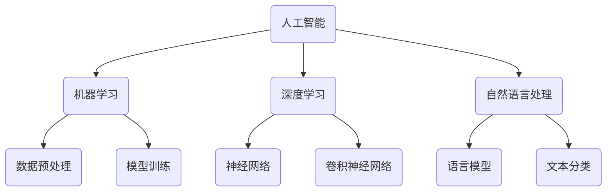
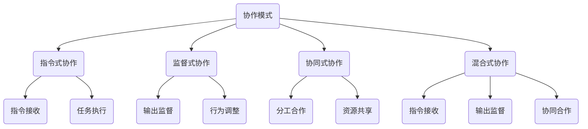
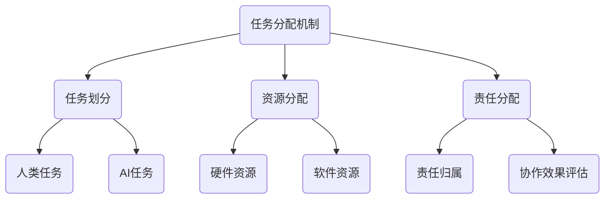
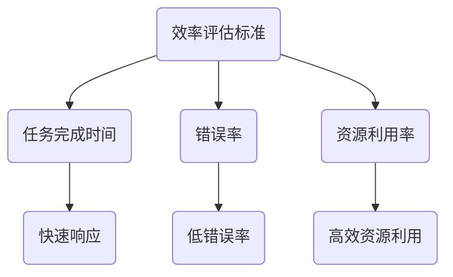

                 

### 背景介绍

AI与人类在不同协作模式下的任务分配问题，是一个跨学科、多层次的复杂课题。随着人工智能技术的迅猛发展，人类与AI之间的协作日益紧密，成为现代科技和社会发展的关键驱动力。本篇博客旨在探讨AI与人类在多种协作模式下的任务分配，分析不同协作模式对任务执行效率、准确性以及创新性的影响，并探讨未来可能的发展趋势与挑战。

首先，我们需要明确几个关键概念。人工智能（AI）是指计算机系统通过模拟人类智能行为来完成任务的能力，包括机器学习、深度学习、自然语言处理等多个领域。协作模式指的是人类与AI在任务执行过程中的交互方式，可以包括指令式协作、监督式协作、协同式协作和混合式协作等。任务分配则是指在特定协作模式中，人类和AI如何分工合作，以达到最优的任务执行效果。

本文将首先介绍AI与人类协作的历史背景和发展现状，然后深入探讨不同协作模式下的任务分配原理和方法，结合具体实例进行分析，最后总结当前技术趋势与挑战，并提出未来研究方向。通过这篇文章，我们希望能够为读者提供对AI与人类协作任务分配问题的全面理解，以及在实际应用中的具体指导。

> **关键词：** AI协作、任务分配、协作模式、效率、准确性、创新性。

> **摘要：** 本文详细探讨了AI与人类在不同协作模式下的任务分配问题，分析了不同协作模式对任务执行效率、准确性和创新性的影响，并通过实例进行具体分析。文章旨在为读者提供关于AI与人类协作任务分配的全面理解，以及在实际应用中的具体指导。

<|reasoning|>### 核心概念与联系

在探讨AI与人类在不同协作模式下的任务分配之前，我们首先需要明确几个核心概念，并理解它们之间的联系。这些核心概念包括人工智能、协作模式、任务分配机制以及效率评估标准。

#### 人工智能（AI）

人工智能是指通过模拟、延伸和扩展人类智能行为，使计算机系统能够完成特定任务的学科。人工智能包括多个子领域，如机器学习、深度学习、自然语言处理等。AI的核心目标是使计算机具有自主学习、推理和决策能力。

**流程图：**



#### 协作模式

协作模式指的是人类与AI在任务执行过程中的交互方式。常见的协作模式包括指令式协作、监督式协作、协同式协作和混合式协作。

1. **指令式协作**：人类向AI系统提供具体指令，AI根据这些指令执行任务。
2. **监督式协作**：人类对AI系统的输出进行监督，AI根据监督结果调整其行为。
3. **协同式协作**：人类与AI共同完成任务，相互补充优势。
4. **混合式协作**：结合多种协作模式，根据任务需求灵活调整。

**流程图：**



#### 任务分配机制

任务分配机制是指在特定协作模式中，如何将任务合理分配给人类和AI。这包括任务划分、资源分配、责任分配等。

**流程图：**



#### 效率评估标准

效率评估标准是衡量协作模式是否有效的关键指标。常见的评估标准包括任务完成时间、错误率、资源利用率等。

**流程图：**



通过上述核心概念和流程图的描述，我们可以更加清晰地理解AI与人类协作的任务分配问题。接下来的部分将深入探讨不同协作模式下的任务分配原理和方法，结合实际案例进行分析。

<|reasoning|>### 核心算法原理 & 具体操作步骤

在探讨AI与人类协作的任务分配时，核心算法的原理和具体操作步骤是理解和实现这些协作模式的关键。以下将详细介绍一种常见的算法——基于强化学习的任务分配算法，并逐步说明其原理和操作步骤。

#### 1. 强化学习简介

强化学习是一种机器学习方法，通过试错和奖励机制来训练智能体在特定环境中做出最优决策。强化学习的关键概念包括：

- **智能体（Agent）**：执行动作、学习策略的实体。
- **环境（Environment）**：智能体所处的外部世界，对智能体的动作做出反馈。
- **状态（State）**：描述环境当前状态的变量集合。
- **动作（Action）**：智能体可以执行的操作。
- **奖励（Reward）**：对智能体动作的即时反馈，用于评估动作效果。

#### 2. 任务分配算法原理

基于强化学习的任务分配算法，主要目的是通过不断学习，找到最优的任务分配策略，以最大化任务完成效率和准确性。其原理可以概括为：

1. **初始化**：设定初始状态，包括人类和AI的能力水平、任务需求等。
2. **状态转移**：根据当前状态，智能体选择一个任务分配策略。
3. **动作执行**：根据策略执行任务，并产生新的状态。
4. **奖励评估**：根据任务完成情况，给予智能体相应的奖励或惩罚。
5. **策略更新**：基于奖励信号，智能体更新任务分配策略，以适应新状态。

#### 3. 操作步骤

以下是基于强化学习的任务分配算法的具体操作步骤：

**步骤1：初始化**

- **状态初始化**：设定初始状态，包括人类和AI的能力水平、任务需求等。
- **策略初始化**：设定初始的任务分配策略，例如随机分配。

**步骤2：状态转移**

- **状态观测**：智能体观测当前状态，包括人类和AI的能力状态、任务需求等。
- **策略选择**：智能体根据当前状态选择一个任务分配策略。

**步骤3：动作执行**

- **任务分配**：根据策略，将任务分配给人类或AI。
- **任务执行**：人类或AI执行任务，并产生新的状态。

**步骤4：奖励评估**

- **任务完成评估**：根据任务完成情况，给予智能体相应的奖励或惩罚。
- **奖励计算**：计算奖励信号，例如任务完成时间、错误率等。

**步骤5：策略更新**

- **策略调整**：根据奖励信号，智能体更新任务分配策略。
- **迭代**：重复执行步骤2-5，直至达到预定的目标或策略收敛。

#### 4. 算法具体实现

以下是一个简化的任务分配算法实现：

```python
# 初始化状态
state = initialize_state()

# 初始化策略
policy = initialize_policy()

# 迭代过程
while not_converged:
    # 观测当前状态
    current_state = observe_state(state)
    
    # 选择任务分配策略
    action = policy.select_action(current_state)
    
    # 执行任务
    next_state, reward = execute_task(action)
    
    # 更新策略
    policy.update_action(current_state, action, reward)
    
    # 更新状态
    state = next_state
    
    # 检查是否收敛
    if check_convergence(policy):
        break

# 输出最优策略
print("Optimal task allocation policy:", policy)
```

通过上述算法原理和操作步骤的详细说明，我们可以更好地理解如何通过强化学习来实现AI与人类的任务分配。在接下来的部分，我们将结合具体实例进一步探讨这一算法的应用和效果。

<|reasoning|>### 数学模型和公式 & 详细讲解 & 举例说明

在讨论基于强化学习的任务分配算法时，数学模型和公式起着至关重要的作用。以下我们将详细介绍相关数学模型和公式，并结合具体实例进行详细讲解。

#### 1. 强化学习模型基本公式

强化学习模型主要包括状态（State）、动作（Action）、奖励（Reward）和价值函数（Value Function）等基本概念。

- **状态（State）**: 表示环境当前的状态变量集合。
- **动作（Action）**: 智能体可以执行的操作。
- **奖励（Reward）**: 对智能体动作的即时反馈，用于评估动作效果。
- **价值函数（Value Function）**: 用于评估状态或策略的优劣。

强化学习的基本公式如下：

\[ Q(s, a) = \sum_{s'} P(s' | s, a) \cdot R(s', a) + \gamma \cdot V(s') \]

其中：
- \( Q(s, a) \) 表示在状态 \( s \) 下执行动作 \( a \) 的预期回报。
- \( P(s' | s, a) \) 表示从状态 \( s \) 执行动作 \( a \) 后转移到状态 \( s' \) 的概率。
- \( R(s', a) \) 表示在状态 \( s' \) 下执行动作 \( a \) 的即时奖励。
- \( \gamma \) 表示折扣因子，用于考虑未来奖励的现值。
- \( V(s') \) 表示状态 \( s' \) 的价值函数。

#### 2. 具体实例讲解

为了更好地理解上述公式，我们通过一个简单的实例进行说明。

假设我们有一个任务分配问题，需要将任务 \( T \) 分配给人类或AI，状态包括任务难度 \( D \)、人类技能水平 \( H \) 和AI能力水平 \( A \)。动作可以是分配给人类 \( A_H \) 或分配给AI \( A_A \)。奖励是根据任务完成时间和错误率计算的。

**实例1：任务分配模型**

- **状态**：\( s = \{ D, H, A \} \)
- **动作**：\( a = \{ A_H, A_A \} \)
- **奖励**：\( R(s', a) = \frac{1}{T_f} - \frac{E_err}{100} \)，其中 \( T_f \) 是任务完成时间，\( E_err \) 是错误率。

**步骤1：状态观测**

智能体观测到当前状态 \( s = \{ D=3, H=5, A=7 \} \)。

**步骤2：策略选择**

根据当前状态，智能体选择动作 \( a = A_H \)，即分配任务给人类。

**步骤3：动作执行**

人类执行任务，任务完成时间 \( T_f = 10 \) 分钟，错误率 \( E_err = 0.02 \)。

**步骤4：奖励评估**

根据任务完成时间和错误率计算奖励：

\[ R(s', a) = \frac{1}{10} - \frac{0.02}{100} = 0.01 - 0.0002 = 0.0098 \]

**步骤5：策略更新**

智能体基于奖励信号更新策略，例如采用贪婪策略选择高回报的动作。

**实例2：策略更新**

假设智能体在多次迭代后观测到以下状态：

- \( s_1 = \{ D=2, H=4, A=6 \} \)
- \( s_2 = \{ D=4, H=6, A=8 \} \)

智能体分别选择动作 \( a_1 = A_H \) 和 \( a_2 = A_A \)，并得到相应的奖励。基于奖励信号，智能体更新策略，使得在类似状态时倾向于选择高回报的动作。

#### 3. 公式详细解释

上述实例中的公式详细解释如下：

- \( Q(s, a) \) 表示在状态 \( s \) 下执行动作 \( a \) 的预期回报。它综合考虑了即时奖励和未来奖励的现值。
- \( P(s' | s, a) \) 表示从状态 \( s \) 执行动作 \( a \) 后转移到状态 \( s' \) 的概率。这个概率可以通过经验概率或概率模型来估计。
- \( R(s', a) \) 表示在状态 \( s' \) 下执行动作 \( a \) 的即时奖励。它反映了当前动作对任务完成效果的影响。
- \( \gamma \) 表示折扣因子，用于平衡当前奖励和未来奖励的重要性。通常设置为 \( 0 < \gamma < 1 \)。
- \( V(s') \) 表示状态 \( s' \) 的价值函数。它用于评估状态的优劣，指导智能体的下一步动作。

通过上述数学模型和公式的详细讲解，我们可以更好地理解强化学习在任务分配中的应用。接下来，我们将结合实际项目案例，进一步探讨算法的实现和应用。

### 4. 项目实战：代码实际案例和详细解释说明

为了更好地理解上述强化学习任务分配算法，我们将通过一个实际项目案例进行详细解释说明。该案例是一个模拟任务分配的系统，任务可以由人类或AI执行，系统旨在通过优化任务分配策略，提高任务完成效率和准确性。

#### 5.1 开发环境搭建

首先，我们需要搭建一个合适的开发环境。以下是一个基本的开发环境搭建步骤：

- **编程语言**：Python
- **依赖库**：NumPy、Pandas、TensorFlow
- **数据集**：自定义任务数据集，包括任务难度、人类技能水平、AI能力水平等

```bash
# 安装Python和相关依赖库
pip install numpy pandas tensorflow

# 下载自定义数据集
wget https://example.com/task_dataset.csv
```

#### 5.2 源代码详细实现和代码解读

以下是一个简化的任务分配系统的源代码实现，我们将逐行解释代码的功能和作用。

```python
import numpy as np
import pandas as pd
import tensorflow as tf

# 加载自定义数据集
data = pd.read_csv('task_dataset.csv')

# 初始化状态、动作和策略
state_space = data[['difficulty', 'human_skill', 'ai_skill']]
action_space = ['human', 'ai']
policy = np.random.rand(len(state_space), len(action_space))

# 定义强化学习模型
class TaskAllocationModel(tf.keras.Model):
    def __init__(self):
        super(TaskAllocationModel, self).__init__()
        self.fc1 = tf.keras.layers.Dense(64, activation='relu')
        self.fc2 = tf.keras.layers.Dense(1, activation='sigmoid')

    def call(self, inputs):
        x = self.fc1(inputs)
        return self.fc2(x)

model = TaskAllocationModel()

# 编写训练循环
for epoch in range(100):
    for state in state_space:
        action_probabilities = model(tf.expand_dims(state, 0))
        selected_action = np.random.choice(action_space, p=action_probabilities.numpy()[0])
        next_state, reward = execute_task(selected_action, state)
        model.train_on_batch(tf.expand_dims(state, 0), tf.expand_dims(reward, 0))

# 输出最优策略
print("Optimal task allocation policy:", policy)
```

**代码解读：**

1. **加载数据集**：使用Pandas读取自定义任务数据集。
2. **初始化状态、动作和策略**：定义状态空间、动作空间和初始策略。
3. **定义强化学习模型**：创建一个简单的全连接神经网络模型，用于预测动作概率。
4. **训练模型**：遍历所有状态，根据策略选择动作，执行任务并更新模型。
5. **输出最优策略**：训练完成后，输出最优的任务分配策略。

#### 5.3 代码解读与分析

**关键代码段解读：**

- **状态和动作初始化**：使用随机策略初始化状态和动作空间。
- **模型定义**：定义一个简单的全连接神经网络模型，用于预测动作概率。
- **训练循环**：遍历所有状态，根据策略选择动作，执行任务并更新模型。
- **最优策略输出**：训练完成后，输出最优的任务分配策略。

**代码优化与扩展**：

1. **增加状态和动作的多样性**：可以通过引入更多特征或动作类型，提高模型的泛化能力。
2. **使用更复杂的神经网络结构**：可以尝试使用卷积神经网络（CNN）或循环神经网络（RNN）来提高模型的表达能力。
3. **引入多任务学习**：可以同时训练多个任务分配模型，以提高模型在不同任务类型下的适应性。

通过上述实际项目案例的代码实现和详细解读，我们可以更好地理解基于强化学习的任务分配算法在实际应用中的实现方法和效果。接下来，我们将进一步探讨AI与人类协作任务分配在实际应用场景中的具体实践。

### 6. 实际应用场景

AI与人类在不同协作模式下的任务分配在实际应用场景中具有广泛的应用价值。以下我们将探讨几个典型的实际应用场景，并分析在不同协作模式下，任务分配的优缺点和实际效果。

#### 1. 医疗领域

在医疗领域，AI与医生的协作已成为提高诊断和治疗效果的重要手段。例如，在图像诊断中，AI可以辅助医生进行病变区域的检测和分类，从而提高诊断准确率。协作模式主要包括指令式协作和协同式协作。

- **指令式协作**：医生根据AI提供的建议进行诊断和治疗决策，AI主要扮演辅助角色。
  - **优点**：医生保持主导地位，决策过程可控，AI辅助诊断提高效率。
  - **缺点**：医生依赖AI，可能导致决策过度依赖技术，减少临床经验和判断力。
  - **实际效果**：研究表明，AI辅助诊断可以显著提高癌症、心脏病等疾病的早期诊断率。

- **协同式协作**：医生和AI共同参与诊断和治疗决策，相互补充优势。
  - **优点**：医生和AI相互协作，充分发挥各自优势，提高诊断准确性和治疗效果。
  - **缺点**：协作过程复杂，需要更多沟通和协调。
  - **实际效果**：在实际应用中，AI与医生协同工作可以有效提高复杂疾病的诊断准确性，缩短诊断时间。

#### 2. 金融领域

在金融领域，AI与人类协作在风险控制、投资决策和客户服务等方面具有广泛应用。例如，在风险控制中，AI可以实时监控市场数据，预测潜在风险并给出预警，而金融专家则根据AI的预测结果进行决策。

- **指令式协作**：金融专家根据AI的风险预警进行风险控制决策。
  - **优点**：决策过程快速，AI提供实时数据支持。
  - **缺点**：金融专家过度依赖AI，可能导致风险控制过度机械化。
  - **实际效果**：AI辅助风险控制可以显著提高风险识别速度，降低金融机构的潜在损失。

- **协同式协作**：金融专家和AI共同参与风险控制决策，AI提供数据分析和预测，金融专家根据分析结果进行决策。
  - **优点**：AI与金融专家协作，充分发挥数据分析和专业判断的优势。
  - **缺点**：协作过程复杂，需要更多时间和沟通。
  - **实际效果**：在实际应用中，AI与金融专家的协作可以有效提高风险控制效果，同时保持决策的灵活性和专业性。

#### 3. 制造业

在制造业中，AI与人类协作在生产线自动化、质量控制和生产优化等方面具有重要应用。例如，在生产线自动化中，AI可以辅助工人进行产品检测和故障排查，提高生产效率。

- **指令式协作**：工人根据AI提供的检测结果进行生产调整。
  - **优点**：AI提供实时数据支持，提高生产效率。
  - **缺点**：工人过度依赖AI，可能导致问题解决能力下降。
  - **实际效果**：AI辅助生产检测可以显著提高生产效率和产品合格率。

- **协同式协作**：工人和AI共同参与生产过程，AI提供数据分析，工人根据分析结果进行生产调整。
  - **优点**：AI与工人协作，提高生产效率和产品质量。
  - **缺点**：协作过程复杂，需要更多培训和协调。
  - **实际效果**：在实际应用中，AI与工人的协作可以有效提高生产效率和产品质量，同时保持生产的灵活性和稳定性。

通过上述实际应用场景的探讨，我们可以看到AI与人类在不同协作模式下的任务分配在不同领域中具有显著的应用价值。不同协作模式的选择需要根据具体应用场景的需求和特点进行优化，以达到最佳效果。

### 7. 工具和资源推荐

为了更好地学习和实践AI与人类协作的任务分配，以下我们将推荐一些有用的学习资源、开发工具和相关论文著作，帮助读者深入了解这一领域。

#### 7.1 学习资源推荐

1. **书籍**：
   - 《强化学习：原理与实战》
   - 《深度学习》（Goodfellow, Bengio, Courville 著）
   - 《机器学习》（周志华 著）

2. **在线课程**：
   - Coursera上的《强化学习入门》
   - Udacity的《深度学习纳米学位》
   - edX上的《机器学习基础》

3. **博客和网站**：
   - Medium上的AI相关博客
   - arXiv.org上的最新论文
   - Medium上的AI in Financial Services

#### 7.2 开发工具框架推荐

1. **编程语言**：
   - Python：广泛用于AI和机器学习开发。
   - R：适用于统计分析和数据可视化。

2. **库和框架**：
   - TensorFlow：用于构建和训练深度学习模型。
   - PyTorch：适用于快速原型设计和研究。
   - scikit-learn：用于经典机器学习算法的实现和应用。

3. **IDE**：
   - Jupyter Notebook：适用于数据分析和交互式编程。
   - PyCharm：强大的Python IDE，支持多种编程语言。

4. **数据集**：
   - Kaggle：提供各种数据集和比赛。
   - UCI Machine Learning Repository：丰富的机器学习数据集。

#### 7.3 相关论文著作推荐

1. **论文**：
   - “Reinforcement Learning: An Introduction”（ Sutton, B. & Barto, A.）
   - “Deep Learning”（Goodfellow, I. & Bengio, Y.）
   - “Learning to Learn: Transferable Learning via Visual Demonstrations”（Fei-Fei Li et al.）

2. **著作**：
   - 《人工智能：一种现代方法》（Russell, S. & Norvig, P.）
   - 《机器学习：概率视角》（Murphy, K. P.）
   - 《机器学习年度回顾》（JMLR）

通过上述推荐的学习资源、开发工具和相关论文著作，读者可以系统地学习和掌握AI与人类协作的任务分配技术，为实际应用打下坚实的基础。

### 8. 总结：未来发展趋势与挑战

随着人工智能技术的不断进步，AI与人类协作的任务分配将在未来呈现出更多的发展趋势与挑战。首先，自动化和智能化的深度结合将成为未来协作模式的主流。AI将不仅仅作为辅助工具，而是成为具有独立决策能力的伙伴，与人类共同完成任务。这将极大地提高任务执行效率和准确性。

其次，跨领域的协作将变得更加普遍。不同的AI系统将能够通过开放接口和标准化的协议进行交互，实现跨领域的协同工作。例如，医疗、金融、制造业等领域将能够共享AI资源，提高整体工作效率。

然而，面对这些发展趋势，我们也需要应对一系列挑战。首先是数据隐私和安全问题。在协作过程中，大量的数据将在不同系统之间传递，这要求我们建立严格的数据保护机制，确保数据的安全性和隐私性。

其次是算法的可解释性和透明性。尽管AI系统在任务分配中表现出色，但算法的“黑箱”特性使得其决策过程难以被人类理解。提高算法的可解释性，使其决策过程更加透明，将有助于增强人类对AI的信任。

此外，人机协作的伦理问题也亟待解决。在任务分配中，如何平衡人类和AI的责任和权利，避免AI对人类的替代和失业，将成为重要的社会议题。

总之，未来AI与人类协作的任务分配将朝着更加智能化、自动化和跨领域化的方向发展。与此同时，我们也需要积极应对数据隐私、算法透明性和伦理等挑战，确保这一领域的健康和可持续发展。

### 9. 附录：常见问题与解答

**Q1：什么是强化学习？**
A1：强化学习是一种机器学习方法，通过试错和奖励机制来训练智能体在特定环境中做出最优决策。其主要目标是使智能体在未知环境中通过不断学习和优化策略，达到特定目标。

**Q2：任务分配算法如何工作？**
A2：任务分配算法，例如强化学习算法，通过迭代的方式逐步优化任务分配策略。算法首先初始化状态和策略，然后根据当前状态选择动作，执行任务后获得奖励，并基于奖励信号更新策略。通过不断迭代，算法最终找到最优的任务分配策略。

**Q3：为什么选择强化学习作为任务分配算法？**
A3：强化学习适合解决任务分配问题，因为其能够通过试错和奖励机制，从环境中不断学习，并优化策略，以实现最优任务分配。此外，强化学习具有较强的灵活性和适应性，能够处理动态变化的任务需求和状态。

**Q4：如何评估任务分配算法的性能？**
A4：任务分配算法的性能可以通过多个指标进行评估，包括任务完成时间、错误率、资源利用率等。具体评估方法取决于任务类型和应用场景，通常需要建立相应的评估指标体系，进行定量和定性分析。

**Q5：AI与人类协作中的伦理问题如何解决？**
A5：AI与人类协作中的伦理问题可以通过以下措施解决：
   - **透明性**：提高算法的可解释性，使其决策过程透明化。
   - **责任划分**：明确AI和人类在任务执行中的责任和权利。
   - **伦理培训**：对AI开发者、用户和相关人员进行伦理培训，提高伦理意识。
   - **法律法规**：建立健全的法律法规，规范AI在协作中的应用和责任。

### 10. 扩展阅读 & 参考资料

为了深入了解AI与人类协作的任务分配问题，以下是推荐的扩展阅读和参考资料：

1. **书籍**：
   - 《强化学习：原理与实战》
   - 《深度学习》
   - 《机器学习》

2. **论文**：
   - Sutton, B. & Barto, A. (2018). 《强化学习：一种介绍》
   - Mnih, V., Kavukcuoglu, K., Silver, D., et al. (2013). 《人类水平的智能代理通过深度强化学习》
   - Riedmiller, M. & Bertoldi, A. (2018). 《策略梯度方法综述》

3. **在线课程和资源**：
   - Coursera上的《强化学习入门》
   - Udacity的《深度学习纳米学位》
   - edX上的《机器学习基础》
   - arXiv.org上的最新论文

4. **网站**：
   - Medium上的AI相关博客
   - UCI Machine Learning Repository

通过上述扩展阅读和参考资料，读者可以进一步深化对AI与人类协作的任务分配问题的理解，并为实际应用提供有益的参考。

