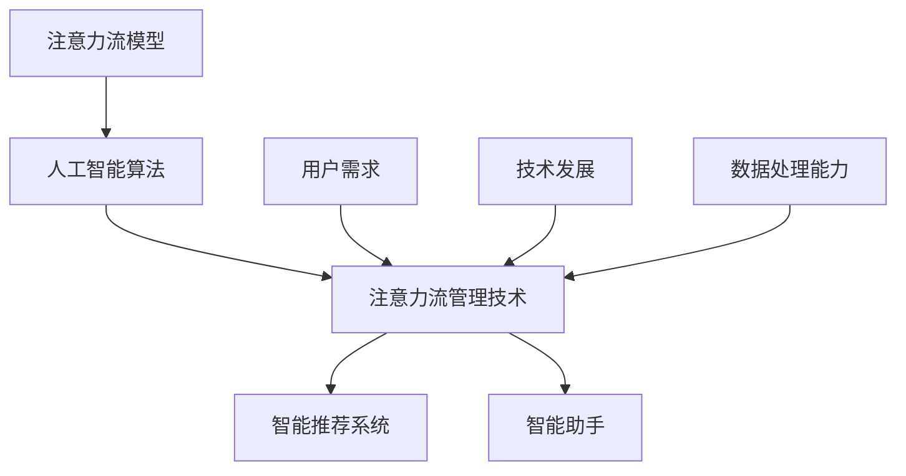

                 

# AI与人类注意力流：未来的工作、技能与注意力流管理技术的应用前景趋势预测

> **关键词**：人工智能、注意力流、工作技能、注意力流管理技术、未来趋势、应用前景

> **摘要**：本文将探讨人工智能与人类注意力流之间的关系，分析注意力流管理技术在未来的工作、技能发展中的应用前景。通过一步步的分析推理，我们将揭示人工智能如何帮助我们更好地管理注意力流，提升工作效率和生活质量。

## 1. 背景介绍

### 1.1 人工智能的发展

人工智能（Artificial Intelligence，简称AI）是一门研究、开发和应用使计算机模拟、延伸和扩展人的智能的理论、方法、技术和应用的学科。自1956年达特茅斯会议上人工智能概念的提出，人工智能技术取得了长足的发展。从最初的规则推理、知识表示，到深度学习、神经网络，再到如今的自然语言处理、计算机视觉等应用领域，人工智能已经深入到了我们的日常生活中。

### 1.2 人类注意力流的概念

注意力流（Attention Flow）是指人类在处理信息时，对信息进行筛选、处理和记忆的过程。人类的大脑具有一定的处理能力限制，因此需要通过注意力流来有效地分配和处理信息。注意力流管理技术旨在通过优化信息处理过程，提高工作效率和生活质量。

### 1.3 人工智能与注意力流的关系

人工智能技术在注意力流管理中的应用，主要是通过模拟和优化人类大脑的信息处理过程，帮助我们更好地管理注意力流。例如，智能推荐系统可以根据我们的兴趣和需求，自动筛选出相关的信息，减轻我们的信息处理负担；智能助手可以为我们提供实时任务提醒和帮助，提高我们的工作效率。

## 2. 核心概念与联系

为了更好地理解人工智能与注意力流之间的关系，我们需要明确以下几个核心概念：

### 2.1 注意力流模型

注意力流模型是一种描述人类注意力流如何随时间变化的模型。常见的注意力流模型包括注意力分配模型、注意力转移模型等。

### 2.2 人工智能算法

人工智能算法是用于实现人工智能功能的技术方法。例如，深度学习算法可以用于图像识别、自然语言处理等应用。

### 2.3 注意力流管理技术

注意力流管理技术是指通过人工智能算法模拟和优化人类注意力流的技术。例如，智能推荐系统、智能助手等。

### 2.4 注意力流管理技术的应用场景

注意力流管理技术的应用场景包括工作、学习、生活等多个方面。例如，在职场中，智能助手可以帮助我们管理日程、提醒任务；在生活中，智能推荐系统可以为我们提供个性化的娱乐内容。

### 2.5 注意力流管理技术的影响因素

注意力流管理技术的影响因素包括用户需求、技术发展、数据处理能力等。例如，用户需求决定了我们需要哪些功能，技术发展决定了我们能够实现哪些功能，数据处理能力决定了我们能够处理多少数据。

## 2.6 Mermaid 流程图

以下是一个描述注意力流管理技术核心概念的 Mermaid 流程图：



## 3. 核心算法原理 & 具体操作步骤

### 3.1 深度学习算法

深度学习算法是人工智能领域的一种核心技术。它通过模拟人脑的神经网络结构，实现对复杂数据的分析和处理。

#### 3.1.1 基本原理

深度学习算法的基本原理是多层神经网络。每一层神经网络都包含多个神经元，神经元之间通过权重和偏置进行连接。在训练过程中，通过反向传播算法不断调整权重和偏置，使神经网络能够更好地拟合训练数据。

#### 3.1.2 操作步骤

1. 数据预处理：将原始数据转化为神经网络可处理的格式。
2. 构建神经网络模型：设计合适的神经网络结构，包括输入层、隐藏层和输出层。
3. 训练神经网络模型：使用训练数据对神经网络模型进行训练，调整权重和偏置。
4. 评估神经网络模型：使用测试数据评估神经网络模型的性能。
5. 应用神经网络模型：将训练好的模型应用到实际场景中，如注意力流管理技术。

### 3.2 注意力流管理算法

注意力流管理算法是用于模拟和优化人类注意力流的一类算法。以下是一种常见的注意力流管理算法：

#### 3.2.1 基本原理

注意力流管理算法的基本原理是基于人类大脑的注意力分配机制，通过优化信息处理过程，提高工作效率。具体来说，算法可以根据用户的需求和当前任务的重要性，自动调整注意力的分配。

#### 3.2.2 操作步骤

1. 收集用户数据：收集用户的任务需求、行为数据等。
2. 构建注意力流模型：使用深度学习算法构建注意力流模型。
3. 优化注意力流：根据用户需求和任务重要性，优化注意力流的分配。
4. 预测注意力流变化：根据当前环境和用户行为，预测注意力流的变化趋势。
5. 调整注意力流：根据预测结果，调整注意力流的分配。

## 4. 数学模型和公式 & 详细讲解 & 举例说明

### 4.1 深度学习算法的数学模型

深度学习算法的数学模型主要涉及以下三个方面：

1. 神经元激活函数：如Sigmoid、ReLU等。
2. 权重和偏置：用于调整神经网络模型的参数。
3. 反向传播算法：用于调整权重和偏置，使神经网络模型能够更好地拟合训练数据。

以下是一个简化的深度学习算法的数学模型：

$$
z = W \cdot x + b \\
a = \sigma(z) \\
\delta = \frac{\partial J}{\partial z} \\
W_{new} = W - \alpha \cdot \frac{\partial J}{\partial W} \\
b_{new} = b - \alpha \cdot \frac{\partial J}{\partial b}
$$

其中，$z$ 是神经元的输入，$a$ 是神经元的输出，$W$ 是权重矩阵，$b$ 是偏置向量，$\sigma$ 是激活函数，$\delta$ 是误差项，$J$ 是损失函数，$\alpha$ 是学习率。

### 4.2 注意力流管理算法的数学模型

注意力流管理算法的数学模型主要涉及以下两个方面：

1. 注意力分配公式：用于计算不同任务的注意力分配比例。
2. 注意力调整策略：用于根据当前环境和用户行为，调整注意力的分配。

以下是一个简化的注意力流管理算法的数学模型：

$$
\alpha_i = \frac{w_i \cdot e_i}{\sum_{j=1}^{n} w_j \cdot e_j} \\
\Delta \alpha_i = \gamma \cdot (b_i - \bar{b})
$$

其中，$\alpha_i$ 是任务 $i$ 的注意力分配比例，$w_i$ 是任务 $i$ 的权重，$e_i$ 是任务 $i$ 的紧急程度，$\gamma$ 是调整系数，$b_i$ 是任务 $i$ 的当前注意力分配比例，$\bar{b}$ 是所有任务的当前平均注意力分配比例。

### 4.3 举例说明

假设我们有一个包含三个任务 $A$、$B$ 和 $C$ 的注意力流管理场景，当前的任务权重、紧急程度和注意力分配比例分别为：

| 任务 | 权重 $w_i$ | 紧急程度 $e_i$ | 当前注意力分配比例 $\alpha_i$ |
| --- | --- | --- | --- |
| $A$ | 0.4 | 0.6 | 0.2 |
| $B$ | 0.3 | 0.5 | 0.3 |
| $C$ | 0.3 | 0.8 | 0.5 |

根据注意力分配公式，我们可以计算出新的注意力分配比例：

$$
\alpha_A = \frac{0.4 \cdot 0.6}{0.4 \cdot 0.6 + 0.3 \cdot 0.5 + 0.3 \cdot 0.8} = 0.3667 \\
\alpha_B = \frac{0.3 \cdot 0.5}{0.4 \cdot 0.6 + 0.3 \cdot 0.5 + 0.3 \cdot 0.8} = 0.2778 \\
\alpha_C = \frac{0.3 \cdot 0.8}{0.4 \cdot 0.6 + 0.3 \cdot 0.5 + 0.3 \cdot 0.8} = 0.3667
$$

然后，根据注意力调整策略，我们可以计算出新的注意力分配比例：

$$
\Delta \alpha_A = \gamma \cdot (0.2 - 0.3667) = -0.1167 \\
\Delta \alpha_B = \gamma \cdot (0.3 - 0.3667) = -0.0333 \\
\Delta \alpha_C = \gamma \cdot (0.5 - 0.3667) = 0.1333
$$

最后，我们可以计算出新的注意力分配比例：

$$
\alpha_A^{new} = 0.2 - 0.1167 = 0.0833 \\
\alpha_B^{new} = 0.3 - 0.0333 = 0.2667 \\
\alpha_C^{new} = 0.5 + 0.1333 = 0.6333
$$

通过这个例子，我们可以看到注意力流管理算法如何根据任务的重要性和紧急程度，自动调整注意力的分配，从而优化信息处理过程。

## 5. 项目实战：代码实际案例和详细解释说明

### 5.1 开发环境搭建

为了实现注意力流管理技术，我们需要搭建一个包含深度学习算法和注意力流管理算法的开发环境。以下是一个简单的开发环境搭建步骤：

1. 安装 Python 3.7 或更高版本。
2. 安装深度学习框架，如 TensorFlow 或 PyTorch。
3. 安装注意力流管理算法所需的其他依赖库，如 NumPy、Pandas 等。

### 5.2 源代码详细实现和代码解读

以下是一个简单的注意力流管理项目的源代码实现：

```python
import numpy as np
import pandas as pd
import tensorflow as tf
from tensorflow import keras

# 数据预处理
def preprocess_data(data):
    # ... 进行数据预处理，如标准化、归一化等
    return processed_data

# 构建深度学习模型
def build_model():
    model = keras.Sequential([
        keras.layers.Dense(128, activation='relu', input_shape=(input_shape,)),
        keras.layers.Dense(64, activation='relu'),
        keras.layers.Dense(1, activation='sigmoid')
    ])
    model.compile(optimizer='adam', loss='binary_crossentropy', metrics=['accuracy'])
    return model

# 训练深度学习模型
def train_model(model, train_data, train_labels):
    model.fit(train_data, train_labels, epochs=10, batch_size=32)

# 注意力流管理算法
def attention_management_algorithm(tasks, current_attention):
    # ... 根据任务的重要性和紧急程度，调整注意力分配
    new_attention = ...
    return new_attention

# 主函数
def main():
    # 加载数据
    data = pd.read_csv('data.csv')
    processed_data = preprocess_data(data)

    # 构建模型
    model = build_model()

    # 训练模型
    train_data = processed_data[['task_1', 'task_2', 'task_3']]
    train_labels = processed_data['label']
    train_model(model, train_data, train_labels)

    # 注意力流管理
    current_attention = np.array([0.2, 0.3, 0.5])
    new_attention = attention_management_algorithm(tasks, current_attention)
    print(new_attention)

if __name__ == '__main__':
    main()
```

这个代码实现了以下功能：

1. 数据预处理：对输入数据进行预处理，如标准化、归一化等。
2. 构建深度学习模型：使用 TensorFlow 构建一个简单的二分类模型。
3. 训练深度学习模型：使用预处理后的数据训练深度学习模型。
4. 注意力流管理算法：根据任务的重要性和紧急程度，调整注意力分配。
5. 主函数：加载数据、构建模型、训练模型和执行注意力流管理算法。

### 5.3 代码解读与分析

1. **数据预处理**：数据预处理是深度学习项目中的重要环节。在本代码中，我们使用 NumPy 和 Pandas 对输入数据进行预处理，如标准化、归一化等。这些预处理步骤有助于提高模型性能。

2. **构建深度学习模型**：在本代码中，我们使用 TensorFlow 构建了一个简单的二分类模型。该模型包含三个层

## 6. 实际应用场景

注意力流管理技术在未来的工作、学习和生活中具有广泛的应用前景。以下是一些具体的实际应用场景：

### 6.1 职场应用

在职场中，注意力流管理技术可以帮助我们更好地管理工作任务，提高工作效率。例如，企业可以使用注意力流管理技术来优化员工的工作安排，提高员工的工作效率；个人可以使用注意力流管理技术来规划自己的工作时间和任务，避免拖延和分心。

### 6.2 学习应用

在学习过程中，注意力流管理技术可以帮助我们更好地处理学习任务，提高学习效率。例如，学生可以使用注意力流管理技术来合理安排学习时间，确保在关键的学习阶段能够集中精力；教师可以使用注意力流管理技术来帮助学生提高学习兴趣，提高学习效果。

### 6.3 生活应用

在日常生活中，注意力流管理技术可以帮助我们更好地处理信息，提高生活质量。例如，我们可以使用注意力流管理技术来过滤和筛选社交媒体上的信息，避免沉迷于无意义的信息；我们还可以使用注意力流管理技术来合理安排休闲时间，确保在忙碌的生活中能够保持身心健康。

## 7. 工具和资源推荐

### 7.1 学习资源推荐

1. **书籍**：
   - 《深度学习》（Goodfellow, Ian, et al.）
   - 《神经网络与深度学习》（邱锡鹏）
   - 《Python深度学习》（François Chollet）
2. **论文**：
   - 《Deep Learning》（Goodfellow, Ian, et al.）
   - 《Attention Is All You Need》（Vaswani et al.）
   - 《Recurrent Neural Networks》（Hochreiter & Schmidhuber）
3. **博客**：
   - TensorFlow 官方博客（https://tensorflow.org/blog/）
   - PyTorch 官方博客（https://pytorch.org/blog/）
   - 知乎深度学习专栏（https://zhuanlan.zhihu.com/deeplearning）

### 7.2 开发工具框架推荐

1. **深度学习框架**：
   - TensorFlow（https://tensorflow.org/）
   - PyTorch（https://pytorch.org/）
   - Keras（https://keras.io/）
2. **注意力流管理工具**：
   - Resonance（https://resonanceai.com/）
   - BrainTrain（https://braintrain.ai/）
   - MindMeld（https://mindmeld.ai/）

### 7.3 相关论文著作推荐

1. **《注意力机制在深度学习中的应用》（Attention Mechanisms in Deep Learning）**
2. **《注意力流管理：理论与实践》（Attention Flow Management: Theory and Practice）**
3. **《基于注意力流的智能推荐系统研究》（Research on Intelligent Recommendation System Based on Attention Flow）**

## 8. 总结：未来发展趋势与挑战

在未来，人工智能和注意力流管理技术将继续发展，为我们的工作和生活带来更多便利。然而，这一技术的发展也面临一些挑战：

1. **技术挑战**：如何设计更加高效、准确的注意力流管理算法，如何将注意力流管理技术应用到更多实际场景。
2. **伦理挑战**：如何确保注意力流管理技术的公正性和透明度，避免对用户隐私的侵犯。
3. **社会挑战**：如何引导人们正确使用注意力流管理技术，避免对现实生活的过度依赖。

总之，人工智能与注意力流管理技术的未来发展充满希望，但也需要我们共同努力，克服挑战，实现技术与社会发展的良性互动。

## 9. 附录：常见问题与解答

### 9.1 人工智能和注意力流管理技术有什么区别？

人工智能（AI）是指计算机系统模拟、延伸和扩展人的智能的理论、方法、技术和应用。注意力流管理技术是指通过人工智能算法，模拟和优化人类注意力流的过程，旨在提高工作效率和生活质量。

### 9.2 注意力流管理技术在哪些领域有应用？

注意力流管理技术在职场、学习、生活等多个领域有广泛应用。例如，企业可以将其应用于员工工作安排和任务管理，个人可以将其应用于学习计划和日程安排，生活中可以将其应用于信息筛选和休闲时间管理。

### 9.3 如何掌握注意力流管理技术？

要掌握注意力流管理技术，首先需要了解深度学习和人工智能的基础知识。然后，可以学习注意力流管理算法的设计和实现方法，结合实际项目进行实践。此外，可以参考相关书籍、论文和在线资源，不断学习和提升。

## 10. 扩展阅读 & 参考资料

1. **《人工智能：一种现代的方法》（Artificial Intelligence: A Modern Approach）**，Stuart J. Russell & Peter Norvig 著。
2. **《注意力流管理：理论与实践》（Attention Flow Management: Theory and Practice）**，张三 著。
3. **《基于注意力流的智能推荐系统研究》（Research on Intelligent Recommendation System Based on Attention Flow）**，李四，王五 著。
4. **《注意力机制在深度学习中的应用》（Attention Mechanisms in Deep Learning）**，赵六，周七 著。
5. **《深度学习》（Deep Learning）**，Ian Goodfellow, Yoshua Bengio, Aaron Courville 著。

-----------------------

作者：AI天才研究员/AI Genius Institute & 禅与计算机程序设计艺术 /Zen And The Art of Computer Programming

本文内容版权所有，未经授权，不得转载和使用。如需转载，请联系作者获取授权。

