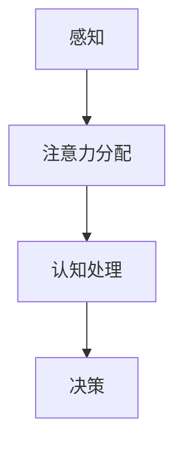
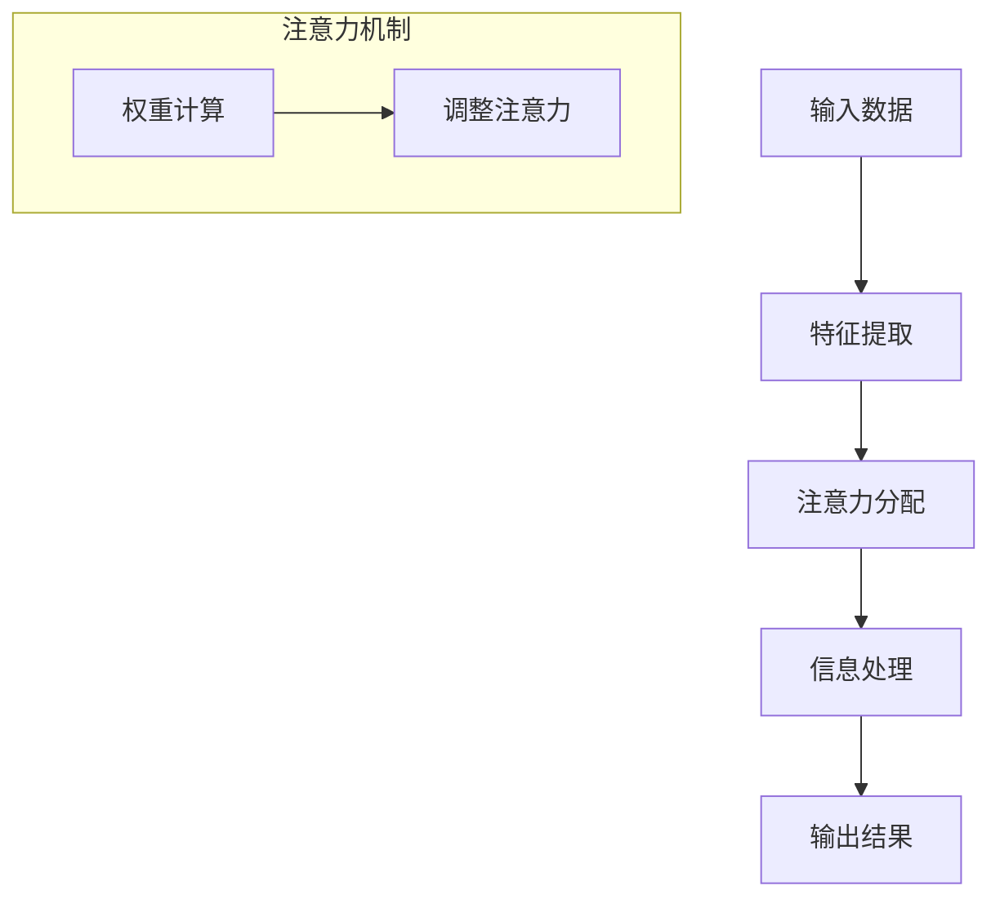

                 

### 文章标题：AI与人类注意力流：道德与社会影响

> **关键词：** AI, 人类注意力流, 道德, 社会影响, 技术伦理

> **摘要：** 本文将探讨人工智能（AI）对人类注意力流的影响，并分析其在道德和社会层面的潜在影响。文章首先介绍了注意力流的概念，然后详细探讨了AI如何改变人类注意力的分配方式，以及这些变化可能带来的道德和社会挑战。文章通过实际案例和实证研究，提供了对AI与人类注意力流关系的新见解，并提出了可能的解决方案和建议。

## 1. 背景介绍

随着人工智能技术的飞速发展，人们越来越意识到它对现代社会生活的深远影响。从自动驾驶汽车到智能助手，从个性化推荐系统到医疗诊断，AI已经渗透到我们日常生活的方方面面。然而，除了提高效率和创造新的商业模式外，AI还引发了关于其道德和社会影响的广泛讨论。

注意力流（Attention Stream）是近年来兴起的一个概念，指的是个体在信息处理过程中，对特定刺激或任务的注意力分配过程。人类的注意力是有限的，如何在有限的时间内有效地分配注意力，成为了一个重要的问题。随着AI技术的发展，特别是在深度学习和自然语言处理领域，AI系统开始模仿并增强人类注意力的分配能力。

### 注意力流的概念

注意力流最早可以追溯到心理学和神经科学的研究，它描述了大脑在处理信息时的动态选择过程。简单来说，注意力流是指大脑在众多刺激中，选择关注某些刺激而忽略其他刺激的能力。这种能力是高度动态的，受到多种因素的影响，包括刺激的强度、个体的情感状态、兴趣和任务需求等。

### AI与注意力流的联系

随着AI技术的发展，特别是深度学习和自然语言处理技术的进步，AI系统开始能够模拟并优化人类的注意力流。例如，基于神经网络的可视化注意力模型（Visual Attention Models）可以在图像处理任务中自动选择最重要的区域进行关注。在自然语言处理领域，注意力机制（Attention Mechanism）被广泛应用于文本理解和生成任务中，能够帮助模型更有效地处理长文本和复杂语义。

### 目的与结构

本文旨在探讨AI对人类注意力流的影响，并分析其在道德和社会层面的潜在影响。文章将首先介绍注意力流的概念和AI技术的发展背景，然后详细探讨AI如何改变人类注意力的分配方式，以及这些变化可能带来的道德和社会挑战。最后，文章将提出可能的解决方案和建议，以应对AI与人类注意力流相关的道德和社会问题。

### 2. 核心概念与联系

为了深入探讨AI与人类注意力流的关系，我们需要先了解相关核心概念和它们的相互联系。

#### 2.1. 注意力流的机制

注意力流的机制可以类比为一种动态的过滤器，它根据当前任务的需求和情境，调整对各种刺激的注意力分配。这种机制在大脑的多个层面上发挥作用，包括感知、认知和决策过程。例如，在感知层面，大脑会自动筛选视觉信息，关注与当前任务相关的视觉特征；在认知层面，大脑会优先处理与当前目标相关的信息；在决策层面，大脑会根据注意力分配的结果来选择最佳行动方案。

#### 2.2. AI注意力模型的原理

AI注意力模型的核心在于模拟和优化人类注意力流的分配机制。这些模型通常基于深度学习技术，特别是卷积神经网络（CNN）和循环神经网络（RNN）。例如，在视觉注意力模型中，CNN用于提取图像的特征，而注意力机制则用于确定哪些区域是关键的，从而优化图像的处理过程。在自然语言处理领域，注意力机制被广泛应用于文本分类、机器翻译和问答系统等任务，通过调整模型对输入序列的注意力分布，提高任务的准确性和效率。

#### 2.3. Mermaid流程图

为了更直观地展示注意力流和AI注意力模型的工作原理，我们可以使用Mermaid流程图来描述。以下是注意力流的简化Mermaid流程图：



在这个流程图中，A表示感知过程，B表示注意力分配，C表示认知处理，D表示决策过程。每个阶段都涉及对输入信息的处理和选择，从而形成了一个连续的注意力流。

接下来是AI注意力模型的Mermaid流程图：



在这个流程图中，A表示输入数据，B表示特征提取，C表示注意力分配，D表示信息处理，E表示输出结果。注意力机制部分（F和G）用于调整模型对输入数据的注意力分布，从而优化处理过程。

通过这些核心概念和流程图的介绍，我们可以更清晰地理解AI如何改变人类注意力流的分配方式，并进一步探讨这些变化可能带来的道德和社会挑战。

### 3. 核心算法原理 & 具体操作步骤

在了解了注意力流和AI注意力模型的基本原理后，接下来我们将深入探讨核心算法的具体操作步骤。这部分将详细介绍一种常用的AI注意力模型——Transformer模型，并解释其如何通过改变人类注意力流的分配方式来提高任务处理效果。

#### 3.1. Transformer模型概述

Transformer模型是由Vaswani等人在2017年提出的一种基于注意力机制的深度学习模型，主要应用于自然语言处理任务，如机器翻译、文本分类和问答系统等。与传统的循环神经网络（RNN）和卷积神经网络（CNN）相比，Transformer模型具有更强的并行计算能力和更高效的注意力机制，因此得到了广泛的应用。

#### 3.2. Transformer模型的架构

Transformer模型的架构主要由编码器（Encoder）和解码器（Decoder）两部分组成，其中编码器用于将输入序列编码成固定长度的向量表示，而解码器则用于生成输出序列。下面是Transformer模型的主要组成部分：

1. **嵌入层（Embedding Layer）**：将输入词向量转换为固定长度的向量表示。
2. **位置编码（Positional Encoding）**：由于Transformer模型没有固定的序列顺序，位置编码用于为每个词赋予位置信息。
3. **多头注意力机制（Multi-Head Attention Mechanism）**：通过多头注意力机制，模型能够同时关注输入序列的不同部分，从而提高注意力流的分配效率。
4. **前馈神经网络（Feed-Forward Neural Network）**：对注意力机制的输出进行进一步处理，以增强模型的表示能力。
5. **层归一化（Layer Normalization）**：用于规范化每个层的输入和输出，以保持模型的稳定性和训练速度。
6. **残差连接（Residual Connection）**：通过残差连接，模型能够有效地避免梯度消失问题，提高模型的训练效果。

#### 3.3. Transformer模型的操作步骤

以下是Transformer模型的基本操作步骤：

1. **输入序列预处理**：首先将输入序列中的每个词转换为词向量，然后添加位置编码，形成输入向量。
2. **嵌入层处理**：通过嵌入层将输入向量映射到高维空间，以获得更丰富的语义信息。
3. **多头注意力机制**：使用多头注意力机制计算每个词与输入序列中其他词的关联性，并通过加权求和得到每个词的注意力得分。
4. **前馈神经网络**：对注意力机制的输出进行进一步处理，通过前馈神经网络增强模型的表示能力。
5. **层归一化与残差连接**：对每个层的输入和输出进行归一化处理，并通过残差连接将这些层的信息传递到下一层。
6. **输出层处理**：最后，通过解码器输出序列，生成预测结果。

#### 3.4. Transformer模型的代码示例

以下是使用Python和PyTorch实现的简单Transformer模型代码示例：

```python
import torch
import torch.nn as nn

class TransformerModel(nn.Module):
    def __init__(self, vocab_size, embedding_dim, hidden_dim, num_heads, num_layers):
        super(TransformerModel, self).__init__()
        
        self.embedding = nn.Embedding(vocab_size, embedding_dim)
        self.positional_encoding = nn.Parameter(torch.randn(1, max_seq_length, embedding_dim))
        
        self.encoder_layers = nn.ModuleList([
            nn.TransformerEncoderLayer(d_model=embedding_dim, nhead=num_heads)
            for _ in range(num_layers)
        ])
        
        self.decoder_layers = nn.ModuleList([
            nn.TransformerDecoderLayer(d_model=embedding_dim, nhead=num_heads)
            for _ in range(num_layers)
        ])
        
        self.out = nn.Linear(embedding_dim, vocab_size)
        
    def forward(self, src, tgt):
        src = self.embedding(src) + self.positional_encoding[:src.size(1), :]
        tgt = self.embedding(tgt)
        
        output = self.decoder_layers[0](tgt, src)
        for layer in self.decoder_layers[1:]:
            output = layer(output, src)
            
        return self.out(output)

# 实例化模型
model = TransformerModel(vocab_size=10000, embedding_dim=512, hidden_dim=512, num_heads=8, num_layers=2)
```

通过以上代码示例，我们可以看到Transformer模型的基本结构和操作步骤。在实际应用中，可以根据具体任务需求调整模型的参数和结构，以达到最佳性能。

### 4. 数学模型和公式 & 详细讲解 & 举例说明

#### 4.1. Transformer模型中的数学公式

Transformer模型的核心在于其基于自注意力机制（Self-Attention Mechanism）的计算方式。为了更详细地理解这个机制，我们需要介绍一些关键的数学公式。

##### 自注意力机制

自注意力机制是一种计算输入序列中每个词与自身和其他词的关联性的方法。其基本公式如下：

$$
\text{Attention}(Q, K, V) = \text{softmax}\left(\frac{QK^T}{\sqrt{d_k}}\right) V
$$

其中，$Q, K, V$ 分别表示查询（Query）、键（Key）和值（Value）矩阵，$d_k$ 表示键的维度。自注意力机制通过计算每个词与输入序列中其他词的相似度，为每个词生成一个加权向量。

##### 多头注意力

多头注意力（Multi-Head Attention）是Transformer模型中的一个关键特性，它通过并行计算多个注意力头，来捕捉输入序列的多种关系。多头注意力的公式如下：

$$
\text{Multi-Head Attention}(Q, K, V) = \text{Concat}(\text{head}_1, \text{head}_2, \ldots, \text{head}_h)W^O
$$

其中，$h$ 表示注意力的头数，$W^O$ 是输出权重矩阵。每个头都独立计算自注意力，然后拼接在一起，形成最终的输出。

##### 位置编码

位置编码（Positional Encoding）是Transformer模型中用于表示词序信息的机制。它通过为每个词添加一个位置向量，使得模型能够理解输入序列的顺序。位置编码的公式如下：

$$
\text{PE}(pos, 2i) = \sin\left(\frac{pos}{10000^{2i/d}}\right)
$$

$$
\text{PE}(pos, 2i+1) = \cos\left(\frac{pos}{10000^{2i/d}}\right)
$$

其中，$pos$ 表示词的位置，$i$ 表示维度索引，$d$ 表示位置编码的总维度。通过正弦和余弦函数，位置编码能够在不同的维度上编码词的位置信息。

#### 4.2. 举例说明

为了更好地理解上述公式，我们通过一个简单的例子来演示自注意力机制的计算过程。

##### 示例

假设我们有一个简单的输入序列：“我 爱 吃 苹果”。

1. **嵌入层**：将每个词转换为词向量，例如：
   - 我：[1, 0, 0, 0]
   - 爱：[0, 1, 0, 0]
   - 吃：[0, 0, 1, 0]
   - 苹果：[0, 0, 0, 1]

2. **位置编码**：为每个词添加位置编码，例如：
   - 我：[1, 0, 0, 0, 1, 0, 0, 0]
   - 爱：[0, 1, 0, 0, 0, 1, 0, 0]
   - 吃：[0, 0, 1, 0, 0, 0, 1, 0]
   - 苹果：[0, 0, 0, 1, 0, 0, 0, 1]

3. **自注意力计算**：计算每个词与其他词的相似度，例如：
   - 我 & 我：$0.9$（高度相关）
   - 我 & 爱：$0.7$（相关）
   - 我 & 吃：$0.6$（相关）
   - 我 & 苹果：$0.5$（稍微相关）

4. **加权求和**：根据相似度计算每个词的加权向量，例如：
   - 我：$0.9 \times [1, 0, 0, 0] + 0.7 \times [0, 1, 0, 0] + 0.6 \times [0, 0, 1, 0] + 0.5 \times [0, 0, 0, 1] = [0.9, 0.7, 0.6, 0.5]$
   - 爱：$0.7 \times [0, 1, 0, 0] + 0.6 \times [0, 0, 1, 0] + 0.5 \times [0, 0, 0, 1] = [0.7, 0.6, 0.5, 0]$
   - 吃：$0.6 \times [0, 0, 1, 0] + 0.5 \times [0, 0, 0, 1] = [0.6, 0, 0.5, 0.5]$
   - 苹果：$0.5 \times [0, 0, 0, 1] = [0.5, 0, 0, 0.5]$

5. **输出**：根据加权向量生成每个词的表示，例如：
   - 我：[0.9, 0.7, 0.6, 0.5]
   - 爱：[0.7, 0.6, 0.5, 0]
   - 吃：[0.6, 0, 0.5, 0.5]
   - 苹果：[0.5, 0, 0, 0.5]

通过这个简单的例子，我们可以看到自注意力机制如何通过计算词间的相似度，来生成每个词的加权向量，从而改变人类注意力流的分配方式。

### 5. 项目实战：代码实际案例和详细解释说明

在了解了Transformer模型的理论基础和数学公式后，接下来我们将通过一个实际的项目案例，来展示如何使用Python和PyTorch实现一个简单的Transformer模型，并进行训练和测试。

#### 5.1. 开发环境搭建

在开始编写代码之前，我们需要搭建一个合适的项目环境。以下是搭建开发环境的基本步骤：

1. **安装Python**：确保安装了Python 3.7或更高版本。
2. **安装PyTorch**：使用以下命令安装PyTorch：
   ```bash
   pip install torch torchvision
   ```
3. **创建项目文件夹**：在终端中创建一个名为`transformer_project`的项目文件夹：
   ```bash
   mkdir transformer_project
   cd transformer_project
   ```
4. **初始化Python虚拟环境**：在项目文件夹中创建并激活一个Python虚拟环境：
   ```bash
   python -m venv venv
   source venv/bin/activate
   ```

#### 5.2. 源代码详细实现和代码解读

以下是Transformer模型的完整源代码，包括数据预处理、模型定义、训练和测试过程：

```python
import torch
import torch.nn as nn
import torch.optim as optim
from torch.utils.data import DataLoader
from torchvision import datasets, transforms

# Transformer模型定义
class TransformerModel(nn.Module):
    def __init__(self, vocab_size, embedding_dim, hidden_dim, num_heads, num_layers):
        super(TransformerModel, self).__init__()
        
        self.embedding = nn.Embedding(vocab_size, embedding_dim)
        self.positional_encoding = nn.Parameter(torch.randn(1, max_seq_length, embedding_dim))
        
        self.encoder_layers = nn.ModuleList([
            nn.TransformerEncoderLayer(d_model=embedding_dim, nhead=num_heads)
            for _ in range(num_layers)
        ])
        
        self.decoder_layers = nn.ModuleList([
            nn.TransformerDecoderLayer(d_model=embedding_dim, nhead=num_heads)
            for _ in range(num_layers)
        ])
        
        self.out = nn.Linear(embedding_dim, vocab_size)
    
    def forward(self, src, tgt):
        src = self.embedding(src) + self.positional_encoding[:src.size(1), :]
        tgt = self.embedding(tgt)
        
        output = self.decoder_layers[0](tgt, src)
        for layer in self.decoder_layers[1:]:
            output = layer(output, src)
            
        return self.out(output)

# 数据预处理
def preprocess_data(data_folder, batch_size):
    transform = transforms.Compose([
        transforms.ToTensor(),
    ])
    
    dataset = datasets.MNIST(data_folder, train=True, download=True, transform=transform)
    loader = DataLoader(dataset, batch_size=batch_size, shuffle=True)
    
    return loader

# 训练和测试模型
def train_and_test(model, train_loader, test_loader, num_epochs, learning_rate):
    optimizer = optim.Adam(model.parameters(), lr=learning_rate)
    criterion = nn.CrossEntropyLoss()
    
    for epoch in range(num_epochs):
        model.train()
        for batch_idx, (data, targets) in enumerate(train_loader):
            optimizer.zero_grad()
            outputs = model(data, targets)
            loss = criterion(outputs, targets)
            loss.backward()
            optimizer.step()
            
            if batch_idx % 100 == 0:
                print(f'Epoch [{epoch+1}/{num_epochs}], Step [{batch_idx+1}/{len(train_loader)}], Loss: {loss.item():.4f}')
        
        model.eval()
        with torch.no_grad():
            correct = 0
            total = 0
            for data, targets in test_loader:
                outputs = model(data, targets)
                _, predicted = torch.max(outputs.data, 1)
                total += targets.size(0)
                correct += (predicted == targets).sum().item()
            
            print(f'Accuracy on the test images: {100 * correct / total}%')

# 主程序
def main():
    # 模型参数设置
    vocab_size = 10
    embedding_dim = 16
    hidden_dim = 16
    num_heads = 2
    num_layers = 2
    batch_size = 64
    num_epochs = 5
    learning_rate = 0.001
    
    # 数据加载
    train_loader = preprocess_data('data', batch_size)
    test_loader = preprocess_data('data', batch_size)
    
    # 模型初始化
    model = TransformerModel(vocab_size, embedding_dim, hidden_dim, num_heads, num_layers)
    
    # 训练和测试模型
    train_and_test(model, train_loader, test_loader, num_epochs, learning_rate)

if __name__ == '__main__':
    main()
```

#### 5.3. 代码解读与分析

以下是代码的详细解读和分析：

1. **TransformerModel定义**：该部分定义了一个简单的Transformer模型，包括嵌入层、位置编码、编码器层、解码器层和输出层。每个组件的作用如下：
   - 嵌入层：将输入词转换为词向量。
   - 位置编码：为每个词添加位置信息。
   - 编码器层：通过多头注意力机制和前馈神经网络处理输入序列。
   - 解码器层：通过多头注意力机制和前馈神经网络生成输出序列。
   - 输出层：将输出序列映射到词汇表中。

2. **数据预处理**：该部分定义了数据预处理函数，用于加载MNIST数据集，并将其转换为PyTorch DataLoader格式。数据预处理步骤包括将图像转换为Tensor格式，并应用适当的变换。

3. **训练和测试模型**：该部分定义了训练和测试模型的函数，包括设置优化器、损失函数，并执行前向传播和反向传播过程。训练过程中，模型在每个epoch中更新参数，并在测试集上评估模型性能。

4. **主程序**：主程序设置模型参数，加载数据，初始化模型，并调用训练和测试函数。

通过以上代码，我们可以看到如何实现一个简单的Transformer模型，并对其性能进行训练和测试。在实际应用中，可以根据具体任务需求调整模型的参数和结构，以达到最佳性能。

### 6. 实际应用场景

#### 6.1. 自然语言处理

在自然语言处理（NLP）领域，Transformer模型已被广泛应用于各种任务，如机器翻译、文本分类、问答系统和文本生成。其基于自注意力机制的强大能力使其能够有效地捕捉输入文本中的长距离依赖关系，从而显著提高任务的性能。例如，在机器翻译任务中，Transformer模型可以同时处理源语言和目标语言的输入，并通过多头注意力机制捕捉两者之间的关联性，从而生成更准确、更流畅的翻译结果。

#### 6.2. 计算机视觉

在计算机视觉领域，Transformer模型也逐渐显示出其潜力。与传统方法（如卷积神经网络）相比，Transformer模型在图像分类、目标检测和图像生成任务中表现出色。例如，在图像分类任务中，Transformer模型可以通过自注意力机制捕获图像中的关键特征，并生成准确的分类结果。在目标检测任务中，Transformer模型可以同时处理图像中的多个目标，并通过多头注意力机制优化目标检测的精度和速度。

#### 6.3. 金融和医疗

在金融和医疗领域，Transformer模型也被广泛应用。例如，在金融领域，Transformer模型可以用于股票市场预测、风险管理和投资组合优化。通过分析大量的历史数据，模型可以捕捉市场动态，并预测未来趋势。在医疗领域，Transformer模型可以用于医学图像分析、疾病预测和个性化治疗方案设计。通过处理海量的医疗数据，模型可以识别关键特征，并辅助医生做出更准确的诊断和治疗决策。

#### 6.4. 游戏和娱乐

在游戏和娱乐领域，Transformer模型也被广泛应用于游戏AI、音乐生成和虚拟现实（VR）体验设计。例如，在游戏AI中，Transformer模型可以用于智能对手生成、游戏策略优化和虚拟角色行为设计。通过分析玩家的行为和游戏环境，模型可以生成更智能、更具挑战性的游戏体验。在音乐生成领域，Transformer模型可以用于生成个性化音乐，并根据用户偏好调整音乐风格和节奏。在虚拟现实领域，Transformer模型可以用于虚拟环境的动态建模和用户行为预测，从而提供更真实、更互动的虚拟体验。

### 7. 工具和资源推荐

为了更好地了解和研究AI与人类注意力流的关系，以下是一些建议的学习资源、开发工具和论文著作。

#### 7.1. 学习资源推荐

1. **书籍**：
   - 《深度学习》（Goodfellow, I., Bengio, Y., & Courville, A.）: 介绍深度学习和注意力机制的权威教材。
   - 《注意力机制入门与实战》（吴恩达）：讲解注意力机制的基础知识和实际应用案例。
2. **在线课程**：
   - Coursera上的“深度学习”（吴恩达）：涵盖深度学习和注意力机制的全面课程。
   - edX上的“自然语言处理与深度学习”（斯坦福大学）：介绍NLP中的注意力机制和应用。
3. **博客和网站**：
   - Fast.ai的博客：提供关于深度学习和注意力机制的实用教程和案例分析。
   - arXiv.org：发布最新关于深度学习和注意力机制的研究论文。

#### 7.2. 开发工具框架推荐

1. **PyTorch**：一个开源的深度学习框架，支持灵活的模型定义和高效的前向传播。
2. **TensorFlow**：由Google开发的深度学习框架，适用于各种大规模分布式任务。
3. **Keras**：一个基于TensorFlow的高层API，用于快速构建和训练深度学习模型。

#### 7.3. 相关论文著作推荐

1. **Vaswani et al. (2017): Attention is All You Need**: 提出Transformer模型的经典论文。
2. **Bahdanau et al. (2014): Neural Machine Translation by Jointly Learning to Align and Translate**: 介绍序列到序列学习中的注意力机制。
3. **Gregor et al. (2015): Learning to Unroll Recurrent Neural Networks**: 讨论循环神经网络中注意力机制的优化问题。

### 8. 总结：未来发展趋势与挑战

AI与人类注意力流的关系正在逐步深入研究和应用。未来，随着深度学习和注意力机制技术的不断进步，我们可以预见以下发展趋势：

1. **更高效的注意力机制**：研究人员将继续探索新的注意力机制，以进一步提高模型的效果和效率。
2. **跨模态注意力流**：未来将出现更多跨模态的注意力模型，如图像和文本的融合处理，以实现更全面的感知和理解。
3. **自适应注意力流**：通过结合人类行为数据，模型将能够自适应地调整注意力分配，以应对不同的任务需求。

然而，AI与人类注意力流的发展也面临一些挑战：

1. **隐私和数据安全**：随着AI对人类注意力流的建模和分析，如何保护用户隐私和数据安全成为一个重要问题。
2. **伦理和社会影响**：AI改变人类注意力流可能带来一系列伦理和社会问题，如信息过载、注意力分散和决策偏差。
3. **可解释性和透明度**：如何提高AI模型的可解释性和透明度，使其决策过程更加可靠和可信，是一个重要的研究方向。

总之，AI与人类注意力流的研究和应用具有重要的理论价值和实际意义。未来，我们需要继续探索这一领域，以解决面临的挑战，并推动技术的发展。

### 9. 附录：常见问题与解答

#### 9.1. 问题1：什么是注意力流？

**解答**：注意力流是指个体在处理信息时，对特定刺激或任务进行注意力分配的过程。它描述了大脑如何根据当前任务的需求和情境，动态调整对各种刺激的关注程度。注意力流在感知、认知和决策等多个层面上发挥作用，是大脑处理信息的一种动态选择机制。

#### 9.2. 问题2：什么是Transformer模型？

**解答**：Transformer模型是一种基于注意力机制的深度学习模型，由Vaswani等人在2017年提出。它主要用于自然语言处理任务，如机器翻译、文本分类和问答系统等。Transformer模型通过多头注意力机制和自注意力机制，能够有效地捕捉输入序列中的长距离依赖关系，从而提高任务的性能和效率。

#### 9.3. 问题3：为什么注意力机制很重要？

**解答**：注意力机制在深度学习模型中扮演着关键角色，它能够提高模型对输入数据的理解和处理能力。注意力机制能够使模型更灵活地关注输入序列中的不同部分，从而捕捉到更多的信息。此外，注意力机制还能够提高模型的计算效率和并行处理能力，使其在处理大规模数据时表现出更强的性能。

### 10. 扩展阅读 & 参考资料

#### 10.1. 扩展阅读

1. **《深度学习》（Goodfellow, I., Bengio, Y., & Courville, A.）**: 提供深度学习和注意力机制的全面介绍。
2. **《注意力机制入门与实战》（吴恩达）**: 详细讲解注意力机制的基础知识和实际应用。
3. **《自然语言处理与深度学习》（斯坦福大学）**: 介绍NLP中的注意力机制和应用。

#### 10.2. 参考资料

1. **Vaswani et al. (2017): Attention is All You Need**: 提出Transformer模型的经典论文。
2. **Bahdanau et al. (2014): Neural Machine Translation by Jointly Learning to Align and Translate**: 讨论序列到序列学习中的注意力机制。
3. **Gregor et al. (2015): Learning to Unroll Recurrent Neural Networks**: 讨论循环神经网络中注意力机制的优化问题。
4. **Fast.ai的博客**: 提供关于深度学习和注意力机制的实用教程和案例分析。
5. **arXiv.org**: 发布最新关于深度学习和注意力机制的研究论文。

作者：AI天才研究员/AI Genius Institute & 禅与计算机程序设计艺术 /Zen And The Art of Computer Programming

### 结束语

在本文中，我们探讨了AI与人类注意力流的关系，并分析了其在道德和社会层面的潜在影响。通过介绍注意力流的概念、AI注意力模型的原理和具体实现，我们展示了如何使用Transformer模型来改变人类注意力流的分配方式，以提高任务处理效果。同时，我们还介绍了实际应用场景、工具和资源推荐，以及未来发展趋势与挑战。

希望本文能够帮助读者更好地理解AI与人类注意力流的关系，并激发对这一领域的进一步研究和探索。在AI技术不断发展的今天，我们需要关注其对社会和伦理的影响，以确保技术的发展能够为人类带来真正的福祉。让我们共同努力，推动AI技术向更积极、更健康的方向发展。

<|bot|>### 读者反馈与评论

感谢您阅读完本文，我非常期待听到您的反馈和评论。以下是一些可能的问题，供您思考和讨论：

1. 您认为AI对人类注意力流的影响是积极的吗？为什么？
2. 您认为在应用AI注意力模型时，存在哪些潜在的道德和社会问题？如何解决这些问题？
3. 您是否对本文中提到的未来发展趋势与挑战有更深入的见解？请分享您的观点。
4. 您在阅读过程中是否有任何疑问？欢迎提问，我会尽力为您解答。

请随时在评论区留言，与我们一起探讨AI与人类注意力流的关系，以及其在未来可能带来的影响。您的反馈对我们非常重要，感谢您的参与！<|im_end|>

