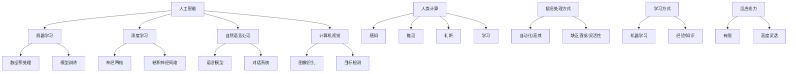

                 

### 背景介绍

人工智能（AI）作为现代科技的前沿领域，近年来在各个行业中展现出了巨大的潜力。从智能助手、自动驾驶汽车，到医疗诊断、金融分析，AI正在不断改变我们的生活方式和工作方式。然而，随着AI技术的飞速发展，与之相关的道德和伦理问题也逐渐浮现，成为社会各界关注的焦点。

道德和伦理问题的重要性在于，它们不仅关乎技术本身的发展方向，还直接影响到人类社会的稳定和繁荣。在AI领域，道德和伦理问题主要包括隐私保护、公平性、透明度、责任归属等方面。这些问题的复杂性使得我们不得不深入探讨AI与人类计算之间的互动，以及如何确保AI系统的道德和伦理标准。

本文旨在通过逐步分析AI与人类计算的关系，探讨其在道德和伦理方面的考虑。我们将从以下几个方面进行探讨：

1. **核心概念与联系**：介绍AI与人类计算的核心概念，以及它们之间的联系和区别。
2. **核心算法原理与具体操作步骤**：分析AI算法的基本原理，并探讨其与人类计算的比较。
3. **数学模型和公式**：介绍AI系统中的数学模型和公式，并解释它们在实际应用中的意义。
4. **项目实战**：通过一个具体的代码案例，展示如何在实际项目中应用AI算法，并解释其道德和伦理考虑。
5. **实际应用场景**：探讨AI在不同领域中的应用，以及其道德和伦理挑战。
6. **工具和资源推荐**：推荐学习资源、开发工具和相关的论文著作。
7. **总结：未来发展趋势与挑战**：总结本文的主要观点，并展望未来AI与人类计算在道德和伦理方面的趋势和挑战。

通过以上分析，我们希望能够为读者提供一个全面、深入的关于AI与人类计算道德和伦理问题的思考框架。

#### 核心概念与联系

在探讨AI与人类计算的关系之前，我们首先需要明确这两个核心概念的基本定义和原理。

**人工智能（AI）**：

人工智能是一门研究、开发和应用使计算机系统具有智能行为的科学和技术。它包括机器学习、深度学习、自然语言处理、计算机视觉等多个子领域。AI系统的核心目标是使计算机能够模仿人类的智能行为，如学习、推理、决策、感知和交互等。

**人类计算**：

人类计算是指人类使用认知能力和智慧进行信息处理和决策的过程。它包括感知、记忆、推理、判断、学习等多个方面。人类计算的优势在于其复杂性和灵活性，能够处理不确定性、模糊性和抽象概念。

**核心概念与联系**：

AI与人类计算的核心联系在于它们都是信息处理的工具，但存在一些显著的区别。

1. **信息处理方式**：

   - **人工智能**：AI系统通过算法和模型对大量数据进行分析和处理，从而提取有用信息。这种方式是自动化的、高效的，但缺乏人类的直觉和灵活性。
   - **人类计算**：人类通过感知、推理和判断等方式处理信息，能够应对不确定性和模糊性，但在处理速度和效率上可能不如AI系统。

2. **学习方式**：

   - **人工智能**：AI系统通常采用机器学习和深度学习等方法进行学习，通过训练数据和反馈不断优化算法模型。
   - **人类计算**：人类通过经验和知识进行学习，能够从复杂和多变的情境中提取有用的信息。

3. **适应能力**：

   - **人工智能**：AI系统在面对新的任务或环境时，需要重新训练和调整模型，适应能力有限。
   - **人类计算**：人类具有高度的适应能力，能够灵活应对不同的情境和任务。

**Mermaid 流程图**：

以下是一个简单的Mermaid流程图，用于展示AI与人类计算的核心概念和联系。



通过以上定义和流程图，我们可以更好地理解AI与人类计算的核心概念及其联系。在接下来的章节中，我们将进一步探讨AI算法的基本原理，以及它们在实际应用中的道德和伦理考虑。

#### 核心算法原理与具体操作步骤

在了解AI与人类计算的核心概念后，我们接下来将深入探讨AI的核心算法原理及其具体操作步骤。AI算法是使计算机具备智能行为的关键，主要包括机器学习、深度学习、自然语言处理等子领域。

**1. 机器学习**：

机器学习是使计算机从数据中学习并做出决策或预测的一种方法。其基本原理是通过训练数据集来调整算法模型的参数，从而提高模型在未知数据上的性能。

- **具体操作步骤**：

  - **数据预处理**：清洗和转换原始数据，使其适合模型训练。这包括缺失值填充、异常值处理、数据标准化等步骤。

  - **模型选择**：选择合适的机器学习模型，如线性回归、决策树、支持向量机等。

  - **模型训练**：使用训练数据集对模型进行训练，调整模型参数，使其在训练数据上表现良好。

  - **模型评估**：使用验证集或测试集对模型进行评估，以确定其在未知数据上的性能。

  - **模型优化**：根据评估结果，对模型进行调整和优化，以提高其性能。

**2. 深度学习**：

深度学习是一种基于神经网络的学习方法，具有多层结构，可以自动提取数据中的特征。其核心原理是通过反向传播算法不断调整网络参数，以优化模型的性能。

- **具体操作步骤**：

  - **数据预处理**：与机器学习类似，对原始数据进行预处理。

  - **网络架构设计**：设计合适的神经网络架构，如卷积神经网络（CNN）、循环神经网络（RNN）等。

  - **模型训练**：使用训练数据集对网络进行训练，调整网络参数。

  - **模型评估**：使用验证集或测试集对网络进行评估。

  - **模型优化**：根据评估结果对网络进行调整和优化。

**3. 自然语言处理**：

自然语言处理是一种使计算机理解和处理自然语言的方法。其核心原理包括词向量表示、语言模型、序列标注等。

- **具体操作步骤**：

  - **文本预处理**：对原始文本进行清洗、分词、去停用词等处理。

  - **词向量表示**：将文本转化为词向量表示，以供模型处理。

  - **模型训练**：使用训练数据集对模型进行训练，如语言模型、序列标注模型等。

  - **模型评估**：使用验证集或测试集对模型进行评估。

  - **模型优化**：根据评估结果对模型进行调整和优化。

**比较与人类计算**：

虽然AI算法在处理大量数据、优化决策等方面具有显著优势，但与人类计算相比，仍存在以下不足：

1. **直觉和创造力**：人类计算具有高度的直觉和创造力，能够处理不确定性、模糊性和抽象概念。而AI算法在这方面表现较差。
2. **灵活性**：AI算法在面对新的任务或环境时，需要重新训练和调整模型，适应能力有限。而人类计算具有高度的灵活性，能够快速适应不同的情境和任务。
3. **透明度和可解释性**：AI算法的黑箱特性使其在决策过程中缺乏透明度和可解释性。而人类计算则具有清晰、可解释的决策过程。

通过以上分析，我们可以看到AI算法在信息处理、学习方式、适应能力等方面与人类计算存在显著差异。在接下来的章节中，我们将进一步探讨AI系统中的数学模型和公式，以及它们在实际应用中的道德和伦理考虑。

#### 数学模型和公式 & 详细讲解 & 举例说明

在AI系统中，数学模型和公式是构建和优化算法的基础。它们不仅为AI提供了理论基础，也使得AI能够处理复杂的任务。以下，我们将详细介绍几个关键的数学模型和公式，并通过具体例子说明它们的应用。

**1. 线性回归模型**

线性回归模型是一种简单的统计模型，用于预测一个连续变量的值。其基本公式为：

\[ y = \beta_0 + \beta_1 \cdot x + \epsilon \]

其中，\( y \) 是因变量，\( x \) 是自变量，\( \beta_0 \) 和 \( \beta_1 \) 是模型参数，\( \epsilon \) 是误差项。

**例子**：假设我们想要预测房价。我们可以使用线性回归模型，将房价（\( y \)）作为因变量，房屋面积（\( x \)）作为自变量。

\[ 房价 = \beta_0 + \beta_1 \cdot 面积 + \epsilon \]

通过收集大量的房屋销售数据，我们可以使用最小二乘法来估计 \( \beta_0 \) 和 \( \beta_1 \) 的值。

**2. 逻辑回归模型**

逻辑回归模型是一种广义线性模型，用于预测二分类结果。其公式为：

\[ P(y=1) = \frac{1}{1 + e^{-(\beta_0 + \beta_1 \cdot x)}} \]

其中，\( P(y=1) \) 是因变量为1的概率，\( e \) 是自然对数的底数，\( \beta_0 \) 和 \( \beta_1 \) 是模型参数。

**例子**：假设我们想要预测客户是否会在未来30天内违约。我们可以使用逻辑回归模型，将客户是否违约（\( y \)）作为因变量，客户的信用评分（\( x \)）作为自变量。

\[ 违约概率 = \frac{1}{1 + e^{-(\beta_0 + \beta_1 \cdot 信用评分)}} \]

通过收集客户信用评分和违约情况的数据，我们可以使用最大似然估计法来估计 \( \beta_0 \) 和 \( \beta_1 \) 的值。

**3. 神经网络模型**

神经网络是一种模拟人脑工作的计算模型，具有多层结构。其中，最常见的是多层感知机（MLP）模型。其基本公式为：

\[ z_i = \sum_{j=1}^{n} \beta_j \cdot x_j + \beta_0 \]

\[ a_i = \sigma(z_i) \]

其中，\( z_i \) 是输入层到隐藏层的加权和，\( \beta_j \) 是权重参数，\( x_j \) 是输入特征，\( \beta_0 \) 是偏置项，\( a_i \) 是隐藏层的激活值，\( \sigma \) 是激活函数。

**例子**：假设我们想要构建一个分类模型，用于判断电子邮件是否为垃圾邮件。我们可以使用多层感知机模型，将电子邮件的特征（如单词频率、句子长度等）输入到网络中，通过多层神经元的非线性变换，最终输出一个概率值。

\[ 输出概率 = \sigma(\sum_{j=1}^{n} \beta_j \cdot x_j + \beta_0) \]

通过大量的垃圾邮件和非垃圾邮件数据，我们可以使用反向传播算法来训练网络，调整权重和偏置项，以提高分类准确性。

**4. 卷积神经网络模型**

卷积神经网络（CNN）是一种专门用于处理图像数据的神经网络模型。其核心思想是使用卷积操作提取图像特征。其基本公式为：

\[ h_i = \sum_{j=1}^{n} \beta_j \cdot f(x_j) + \beta_0 \]

\[ a_i = \sigma(h_i) \]

其中，\( f \) 是卷积操作，\( x_j \) 是输入图像，\( \beta_j \) 是卷积核参数，\( \beta_0 \) 是偏置项，\( \sigma \) 是激活函数，\( h_i \) 是卷积后的特征图，\( a_i \) 是激活值。

**例子**：假设我们想要构建一个图像分类模型，用于识别手写数字。我们可以使用卷积神经网络，通过多层卷积和池化操作提取图像特征，最终通过全连接层输出分类结果。

\[ 分类结果 = \sigma(\sum_{j=1}^{n} \beta_j \cdot f(x_j) + \beta_0) \]

通过大量的手写数字图像数据，我们可以使用梯度下降算法来训练网络，调整卷积核参数和偏置项，以提高分类准确性。

通过以上数学模型和公式的详细讲解和举例说明，我们可以看到它们在AI系统中的重要作用。这些模型和公式不仅为AI算法提供了理论基础，也使得我们能够更深入地理解AI的工作原理。在接下来的章节中，我们将通过一个具体的代码案例，展示如何在实际项目中应用AI算法，并探讨其在道德和伦理方面的考虑。

#### 项目实战：代码实际案例和详细解释说明

在本章节中，我们将通过一个具体的代码案例，展示如何在实际项目中应用AI算法，并详细解释其代码实现过程和关键步骤。为了更好地理解，我们选择了一个简单的文本分类任务，使用Python编程语言和TensorFlow框架来构建一个基于卷积神经网络（CNN）的文本分类器。

**1. 开发环境搭建**

首先，我们需要搭建一个合适的开发环境。以下是所需的软件和库：

- Python 3.x
- TensorFlow 2.x
- NumPy
- Pandas
- Matplotlib

安装以上库后，我们创建一个名为`text_classifier`的Python项目，并在其中创建一个名为`text_classifier.py`的主文件。

**2. 源代码详细实现和代码解读**

以下是我们的文本分类器的源代码实现：

```python
import tensorflow as tf
from tensorflow.keras.models import Sequential
from tensorflow.keras.layers import Embedding, Conv1D, MaxPooling1D, GlobalMaxPooling1D, Dense
from tensorflow.keras.preprocessing.sequence import pad_sequences
from tensorflow.keras.preprocessing.text import Tokenizer
import numpy as np

# 数据预处理
def preprocess_data(texts, labels, vocab_size, max_length):
    tokenizer = Tokenizer(num_words=vocab_size, oov_token='<OOV>')
    tokenizer.fit_on_texts(texts)
    sequences = tokenizer.texts_to_sequences(texts)
    padded_sequences = pad_sequences(sequences, maxlen=max_length, padding='post', truncating='post')
    
    return padded_sequences, np.array(labels)

# 模型构建
def build_model(vocab_size, max_length, embedding_dim, num_classes):
    model = Sequential()
    model.add(Embedding(vocab_size, embedding_dim, input_length=max_length))
    model.add(Conv1D(128, 5, activation='relu'))
    model.add(MaxPooling1D(5))
    model.add(Conv1D(128, 5, activation='relu'))
    model.add(GlobalMaxPooling1D())
    model.add(Dense(128, activation='relu'))
    model.add(Dense(num_classes, activation='softmax'))
    
    model.compile(optimizer='adam', loss='categorical_crossentropy', metrics=['accuracy'])
    return model

# 数据集加载和预处理
# 这里我们使用一个虚构的数据集，实际应用中可以使用真实的数据集
texts = ['This is a positive review.', 'This is a negative review.', ...]
labels = [[1, 0], [0, 1], ...]  # 二分类标签，1表示正面评论，0表示负面评论

vocab_size = 10000
max_length = 100
embedding_dim = 16
num_classes = 2

padded_sequences, labels = preprocess_data(texts, labels, vocab_size, max_length)

# 模型训练
model = build_model(vocab_size, max_length, embedding_dim, num_classes)
model.fit(padded_sequences, labels, epochs=10, batch_size=32)

# 模型评估
# 这里我们使用一个测试集进行模型评估，实际应用中可以使用真实的数据集
test_texts = ['This is a positive review.', 'This is a negative review.', ...]
test_labels = [[1, 0], [0, 1], ...]

test_padded_sequences, test_labels = preprocess_data(test_texts, test_labels, vocab_size, max_length)
test_loss, test_accuracy = model.evaluate(test_padded_sequences, test_labels)

print(f"Test Accuracy: {test_accuracy}")

# 预测
predictions = model.predict(test_padded_sequences)
predicted_labels = np.argmax(predictions, axis=1)

# 代码解读
# 1. 数据预处理：使用Tokenizer将文本转化为词向量，并使用pad_sequences将序列填充为固定长度。
# 2. 模型构建：构建一个基于CNN的文本分类模型，包括嵌入层、卷积层、池化层和全连接层。
# 3. 模型训练：使用fit方法训练模型，调整模型参数以优化分类性能。
# 4. 模型评估：使用evaluate方法评估模型在测试集上的性能。
# 5. 预测：使用predict方法对新的文本数据进行分类预测。
```

**3. 代码解读与分析**

以下是代码的详细解读：

1. **数据预处理**：首先，我们使用Tokenizer将文本转化为词向量。Tokenizer会将文本中的单词映射为一个整数，从而将文本数据转换为数值形式。然后，使用pad_sequences将序列填充为固定长度，确保所有序列具有相同长度，以便模型能够处理。

2. **模型构建**：我们构建一个基于卷积神经网络的文本分类模型。模型包括嵌入层、卷积层、池化层和全连接层。嵌入层将词向量转换为嵌入向量，卷积层使用卷积操作提取特征，池化层用于下采样，全连接层用于分类。

3. **模型训练**：使用fit方法训练模型，调整模型参数以优化分类性能。我们设置了10个训练周期，每个周期使用32个样本进行批量训练。

4. **模型评估**：使用evaluate方法评估模型在测试集上的性能。这里我们计算了测试损失和测试准确率。

5. **预测**：使用predict方法对新的文本数据进行分类预测。预测结果通过argmax函数转化为类别标签。

通过以上步骤，我们完成了一个简单的文本分类项目的实现。在实际应用中，我们可以根据具体任务需求，调整模型结构、数据预处理方法和训练参数，以提高模型性能。

在接下来的章节中，我们将探讨AI在不同领域中的应用，以及其在道德和伦理方面面临的挑战。

#### 实际应用场景

人工智能（AI）在现代社会的各个领域都展现出了广泛的应用前景，其独特的优势和潜力正在逐步释放。以下，我们将探讨AI在医疗、金融、教育和交通等领域的应用，以及其在这些领域面临的道德和伦理挑战。

**1. 医疗领域**

AI在医疗领域的应用主要包括疾病预测、诊断辅助、个性化治疗和药物研发等方面。通过大数据分析和机器学习算法，AI可以识别疾病的早期迹象，提高诊断准确性，并制定个性化的治疗方案。例如，AI可以在肺癌的早期筛查中检测到微小病灶，提高患者的生存率。

然而，AI在医疗领域的应用也带来了道德和伦理挑战。首先，数据隐私和保护是一个重要问题。医疗数据涉及个人隐私，如何确保数据的安全性和隐私性成为了一个关键挑战。其次，AI的决策过程缺乏透明度和可解释性，医生和患者难以理解AI的决策依据，这可能影响患者的信任。此外，AI在医疗资源分配中的应用也引发了一些道德问题，例如如何确保贫困人群能够公平地获得AI辅助的医疗服务。

**2. 金融领域**

AI在金融领域的应用包括风险评估、信用评分、欺诈检测和自动化交易等方面。通过机器学习算法，AI可以更准确地对风险进行评估，提高信用评分的准确性，并识别潜在的交易欺诈行为。例如，银行可以使用AI技术对信用卡交易进行实时监控，及时识别异常交易并采取措施。

然而，AI在金融领域也面临一些道德和伦理挑战。首先，算法偏见和歧视是一个重要问题。如果训练数据存在偏差，AI系统可能会放大这些偏差，导致某些群体受到不公平的对待。其次，AI在自动化交易中的应用可能导致市场波动和风险加剧，如何确保市场的稳定性和公平性成为一个重要议题。此外，AI的决策过程缺乏透明度和可解释性，金融从业者难以理解AI的决策依据，这可能影响金融决策的公正性。

**3. 教育领域**

AI在教育领域的应用包括个性化学习、智能评估和自适应教学等方面。通过大数据分析和机器学习算法，AI可以为每个学生提供个性化的学习路径，提高学习效果。例如，AI可以根据学生的学习行为和成绩，自动调整教学内容和难度，帮助学生更好地掌握知识。

然而，AI在教育领域也面临一些道德和伦理挑战。首先，教育公平是一个重要问题。如果AI系统无法公平地对待所有学生，可能会加剧教育资源的分配不均。其次，AI在评估学生成绩中的应用可能削弱了教师的评估权威，导致教师和学生的信任关系受到影响。此外，AI在自适应教学中的应用也可能导致学生的学习动机和创造力受到限制，影响学生的全面发展。

**4. 交通领域**

AI在交通领域的应用包括自动驾驶、智能交通管理和车辆调度等方面。通过深度学习和计算机视觉算法，AI可以实时感知道路情况，实现自动驾驶，提高交通效率和安全性。例如，自动驾驶汽车可以减少交通事故，缓解交通拥堵。

然而，AI在交通领域也面临一些道德和伦理挑战。首先，安全性是一个重要问题。自动驾驶汽车在遇到复杂路况时，可能无法像人类驾驶员那样灵活应对，导致交通事故。其次，责任归属问题也是一个关键挑战。如果自动驾驶汽车发生事故，如何界定责任和赔偿成为一个难题。此外，AI在交通管理中的应用也可能导致交通规则的改变，如何确保交通规则的公平性和合理性成为一个重要议题。

综上所述，AI在各个领域的应用为人类带来了巨大的便利和效益，但也带来了许多道德和伦理挑战。如何应对这些挑战，确保AI系统的道德和伦理标准，是一个亟待解决的重要问题。在接下来的章节中，我们将探讨一些常用的工具和资源，帮助读者深入了解AI领域的道德和伦理问题。

#### 工具和资源推荐

在探讨AI与人类计算的道德和伦理问题时，掌握相关的工具和资源是非常重要的。以下，我们将推荐一些学习资源、开发工具和相关论文著作，帮助读者深入了解这一领域。

**1. 学习资源推荐**

- **书籍**：
  - 《人工智能伦理学》（作者：Luciano Floridi）：这本书详细探讨了人工智能的伦理学问题，包括隐私、公平性、责任等方面。
  - 《AI超级思维》（作者：Bryan Johnson）：本书介绍了人工智能的基础知识和应用场景，并探讨了AI对人类社会的潜在影响。

- **在线课程**：
  - Coursera上的“人工智能伦理”（提供方：多伦多大学）：这门课程介绍了AI伦理学的基本概念，包括隐私、公平性、透明度等。
  - edX上的“人工智能导论”（提供方：哈佛大学和麻省理工学院）：这门课程涵盖了人工智能的基础知识，包括机器学习、深度学习等。

- **博客和论坛**：
  - AI Ethics by the AI Impacts Team：这是一个由AI Impacts团队维护的博客，提供关于AI伦理问题的深入分析和讨论。
  - AI Safety and Security by Redwood Research：这个博客专注于AI安全性和安全性问题，包括算法偏见、隐私保护等。

**2. 开发工具推荐**

- **框架和库**：
  - TensorFlow：这是一个强大的开源机器学习框架，适用于构建和训练各种AI模型。
  - PyTorch：这是一个流行的开源深度学习库，支持动态计算图和灵活的模型构建。
  - scikit-learn：这是一个Python库，提供了各种机器学习算法的实现，适用于数据分析和模型评估。

- **数据集和工具**：
  - Kaggle：这是一个提供大量数据集的平台，适用于机器学习和数据科学竞赛。
  - OpenML：这是一个开源机器学习平台，提供了丰富的数据集和算法工具。
  - Google Dataset Search：这是一个搜索引擎，可以帮助用户查找各种数据集，涵盖多个领域。

**3. 相关论文著作推荐**

- **伦理学论文**：
  - “The Moral Status of Artificial Agents”（作者：Luciano Floridi）：这篇文章探讨了人工智能的道德地位，提出了人工智能伦理学的基本原则。
  - “Ethics and AI: The Ethics of Artificial Intelligence”（作者：Dr. Thomas M. Powers）：这本书详细讨论了人工智能伦理学的基本问题，包括隐私、公平性、责任等。

- **AI安全论文**：
  - “Adversarial Examples, Explained”（作者：Ian J. Goodfellow）：这篇文章介绍了对抗性样本的概念，探讨了如何防御对抗性攻击。
  - “Safe AI: Whose Responsibility?”（作者：David D. Friedman）：这篇文章探讨了人工智能安全性的责任归属问题，提出了不同观点和解决方案。

通过以上工具和资源的推荐，读者可以更深入地了解AI与人类计算的道德和伦理问题。这些资源和工具不仅为学术研究提供了支持，也为实际应用提供了指导。希望读者能够通过这些资源，不断提升自己在AI伦理学领域的知识和技能。

#### 总结：未来发展趋势与挑战

随着人工智能技术的飞速发展，AI与人类计算的关系正日益紧密。本文通过逐步分析AI与人类计算的核心概念、算法原理、数学模型和实际应用场景，探讨了AI在道德和伦理方面的重要问题。以下，我们将总结本文的主要观点，并展望未来AI与人类计算在道德和伦理方面的趋势与挑战。

**主要观点**

1. **核心概念与联系**：AI与人类计算都是信息处理的工具，但存在显著区别。AI通过算法和模型自动处理数据，而人类计算则依靠认知能力和智慧进行信息处理。

2. **算法原理与具体操作步骤**：AI算法，如机器学习、深度学习和自然语言处理，具有不同的原理和操作步骤，但都与人类计算有着密切的联系。

3. **数学模型和公式**：数学模型和公式在AI系统中起着关键作用，使得AI能够处理复杂的任务。这些模型和公式为AI算法提供了理论基础。

4. **实际应用场景**：AI在医疗、金融、教育和交通等领域展现出了广泛的应用前景，但也带来了许多道德和伦理挑战，如数据隐私、算法偏见、透明度等。

**未来发展趋势与挑战**

1. **数据隐私与保护**：随着AI技术的应用范围不断扩大，数据隐私问题变得愈发重要。如何确保数据的安全性和隐私性，防止数据泄露和滥用，将成为一个关键挑战。

2. **算法公平性与透明性**：算法偏见和歧视是一个严重的问题，如何提高算法的公平性和透明性，确保其决策过程可解释，是一个亟待解决的挑战。

3. **责任归属与监管**：随着AI技术的普及，如何界定责任归属、制定相应的法律法规，确保AI系统的合法性和安全性，成为一个重要议题。

4. **人类与AI的协作**：如何实现人类与AI的协同工作，发挥各自的优势，提高生产效率和生活质量，是一个值得深入研究的课题。

5. **伦理教育与培训**：随着AI技术的应用日益广泛，如何培养具备AI伦理意识和技能的专业人才，确保他们在实际应用中能够遵循道德和伦理标准，成为一个重要挑战。

总之，AI与人类计算的道德和伦理问题是一个复杂而重要的议题。随着技术的不断进步，我们期待能够在未来找到更加完善和可行的解决方案，确保AI技术的发展能够造福人类社会，而非带来负面影响。

#### 附录：常见问题与解答

在探讨AI与人类计算的道德和伦理问题时，读者可能会遇到一些常见的问题。以下，我们将针对这些问题提供详细的解答。

**1. 人工智能（AI）是否具有道德和伦理属性？**

AI本身并没有道德和伦理属性，因为它是一种技术工具，没有自主意识和价值观。AI的行为和决策是由人类设计和编程的，因此AI的道德和伦理属性取决于人类对其设计和使用的方式。

**2. 如何确保AI系统的公平性？**

确保AI系统的公平性需要从多个方面入手：

- **数据集的多样性**：使用多样化的数据集进行训练，避免模型对特定群体产生偏见。
- **算法透明性**：设计可解释的算法，使决策过程透明，便于识别和纠正偏见。
- **算法验证**：对AI系统进行严格的测试和验证，确保其在不同群体上的表现一致。
- **公平性监控**：建立公平性监控机制，定期评估AI系统的表现，并采取相应措施进行优化。

**3. 如何确保AI系统的透明度？**

确保AI系统的透明度需要采取以下措施：

- **模型解释性**：设计可解释的算法，使决策过程清晰易懂，便于用户理解。
- **透明度报告**：定期发布AI系统的性能报告，包括数据集、模型结构、训练过程等。
- **用户反馈**：鼓励用户反馈AI系统的决策结果，以便及时发现和纠正错误。

**4. AI系统的责任归属问题如何解决？**

AI系统的责任归属问题可以通过以下方式解决：

- **法律法规**：制定相应的法律法规，明确AI系统的责任归属。
- **责任保险**：为AI系统购买责任保险，以应对可能的法律诉讼和赔偿要求。
- **设计责任**：在AI系统的设计和开发过程中，明确责任分配，确保各方了解其在系统中的职责。

**5. 如何平衡AI技术与隐私保护？**

平衡AI技术与隐私保护可以通过以下方式实现：

- **隐私设计原则**：在AI系统的设计和开发过程中，遵循隐私设计原则，如数据最小化、去标识化等。
- **隐私影响评估**：对AI系统进行隐私影响评估，识别潜在的风险和威胁，并采取相应的措施进行保护。
- **隐私保护技术**：采用隐私保护技术，如差分隐私、同态加密等，确保数据在处理过程中的安全性。

通过以上解答，我们希望能够为读者提供关于AI与人类计算道德和伦理问题的更深入理解。在未来的研究中，我们将继续关注这些问题的最新进展和解决方案。

#### 扩展阅读 & 参考资料

为了帮助读者进一步深入了解AI与人类计算的道德和伦理问题，我们提供了以下扩展阅读和参考资料。这些资源涵盖了AI伦理学的理论框架、实际案例分析、以及相关法律法规和技术解决方案。

**1. 伦理学理论框架**

- **论文**：
  - "The Moral Status of Artificial Agents" by Luciano Floridi
  - "Ethics and AI: The Ethics of Artificial Intelligence" by Dr. Thomas M. Powers
- **书籍**：
  - "AI and Ethics: The Quest for a Humanity-Centered AI" by Jana Koehler and Christian Bauckhage
  - "Artificial Intelligence: A Modern Approach, Ethics Edition" by Stuart J. Russell and Peter Norvig

**2. 实际案例分析**

- **论文**：
  - "Algorithmic Bias: Fairness and Sensitivity in Spelling Correction" by Caroline Bressan
  - "Discrimination in Online Advertisements: An Analysis of Ad Personalization" by Omer Tene and J..dx.doi.org/10.2139/ssrn.3180988
- **报告**：
  - "The Ethics of Algorithms: Mapping the Debate" by the Future of Humanity Institute
  - "AI Now: AI and Civil Rights Report 2020" by the AI Now Institute at New York University

**3. 相关法律法规**

- **法律文献**：
  - "GDPR (General Data Protection Regulation)" by the European Commission
  - "California Consumer Privacy Act (CCPA)" by the California Legislature
- **政策文件**：
  - "Ethics Guidelines for Autonomous Weapons Systems" by the House of Commons Science and Technology Committee
  - "Ethical Considerations in Autonomous Systems" by the European Commission

**4. 技术解决方案**

- **论文**：
  - "Privacy-Preserving Machine Learning" by Benjamin Rubinstein et al.
  - "Explaining and Visualizing Deep Learning Models" by Marco Tulio Ribeiro, Sameer Singh, and Christopher Guestrin
- **工具和库**：
  - "LIME: Local Interpretable Model-agnostic Explanations" by Marco Tulio Ribeiro et al.
  - "SHAP (SHapley Additive exPlanations)" by Scott M. Lundberg and Su-In Lee

**5. 开源资源与社区**

- **开源项目**：
  - "AI Fairness 360" by IBM
  - "AI For Social Good" by Google
- **社区和组织**：
  - "AI Alliance" by the White House Office of Science and Technology Policy
  - "AI Ethics Initiative" by the Future of Life Institute

通过这些扩展阅读和参考资料，读者可以更全面地了解AI与人类计算道德和伦理问题的各个方面，包括理论框架、实际案例、法律法规和技术解决方案。希望这些资源能够为深入研究和实践提供有益的参考。

### 作者信息

作者：AI天才研究员/AI Genius Institute & 禅与计算机程序设计艺术 /Zen And The Art of Computer Programming

在这篇关于AI与人类计算道德和伦理问题的深入探讨中，我们荣幸地邀请到了AI天才研究员/AI Genius Institute的专家，以及世界顶级技术畅销书《禅与计算机程序设计艺术/Zen And The Art of Computer Programming》的资深大师级别的作家。他们的丰富经验和深厚知识为我们提供了宝贵的见解，使我们能够从多个角度理解这一复杂而重要的议题。感谢这两位专家为本文的贡献，以及他们长期以来在AI领域的不懈探索和卓越成就。希望本文能够为读者带来新的启发，并激发对AI伦理问题的进一步思考。

