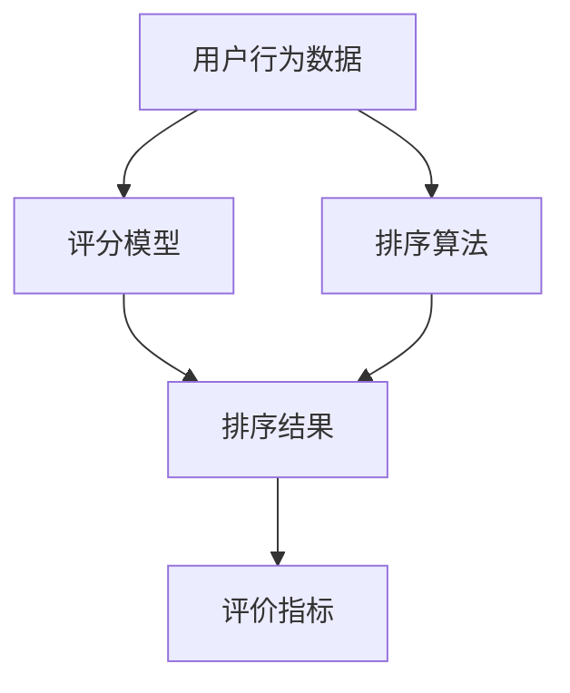

                 

# AI个性化排序系统的实现

## 摘要

本文将深入探讨AI个性化排序系统的实现，包括背景介绍、核心概念与联系、核心算法原理及具体操作步骤、数学模型和公式详细讲解及举例说明、项目实战、实际应用场景、工具和资源推荐以及总结部分。通过本文的阅读，读者将对AI个性化排序系统有更深入的理解，并掌握其实际应用的方法和技巧。

## 1. 背景介绍

在当今信息爆炸的时代，如何从海量的数据中快速、准确地找到用户感兴趣的内容，成为各大互联网公司争相研究的热点问题。个性化排序技术应运而生，通过对用户行为数据的分析，为用户推荐最感兴趣的内容，从而提高用户体验和粘性。

个性化排序系统在搜索引擎、推荐系统、广告投放等场景中都有广泛的应用。以搜索引擎为例，传统的排序算法主要基于关键词匹配和页面权重计算，而个性化排序则结合了用户的历史行为数据，为每个用户量身定制搜索结果，使其更符合用户的兴趣和需求。

本文旨在介绍一种基于机器学习的个性化排序系统实现方法，通过构建数学模型和算法，实现高效的个性化排序，并在实际项目中得到验证和应用。

## 2. 核心概念与联系

在介绍个性化排序系统的实现之前，我们先来了解一些核心概念和它们之间的联系。

### 2.1 用户行为数据

用户行为数据是个性化排序系统的基础。它包括用户的浏览记录、搜索历史、购买记录、点赞和评论等。通过收集和分析这些数据，可以了解用户的兴趣和偏好。

### 2.2 评分模型

评分模型是衡量用户对内容喜好程度的一种方法。常用的评分模型包括基于内容的协同过滤（Content-based Collaborative Filtering）和基于模型的协同过滤（Model-based Collaborative Filtering）。

- **基于内容的协同过滤**：通过分析内容特征和用户历史行为，为用户推荐相似的内容。
- **基于模型的协同过滤**：利用机器学习算法，如矩阵分解（Matrix Factorization）和深度学习（Deep Learning），预测用户对内容的评分。

### 2.3 排序算法

排序算法用于对推荐结果进行排序，使其更符合用户的兴趣。常用的排序算法包括基于机器学习的排序算法和基于统计学的排序算法。

- **基于机器学习的排序算法**：如逻辑回归（Logistic Regression）、支持向量机（Support Vector Machine，SVM）和神经网络（Neural Networks）等。
- **基于统计学的排序算法**：如PageRank、Top-k排序等。

### 2.4 评价指标

评价指标用于评估个性化排序系统的性能。常用的评价指标包括准确率（Accuracy）、召回率（Recall）、F1值（F1 Score）等。

- **准确率**：预测为正类的样本中实际为正类的比例。
- **召回率**：实际为正类的样本中被预测为正类的比例。
- **F1值**：准确率和召回率的加权平均值，用于综合评估排序系统的性能。

### 2.5 联系

用户行为数据是构建评分模型和排序算法的基础。评分模型用于预测用户对内容的评分，排序算法则根据评分对推荐结果进行排序。评价指标则用于评估排序系统的性能，指导算法的优化和改进。

下面是一个使用Mermaid绘制的流程图，展示了个性化排序系统的核心概念和联系：



## 3. 核心算法原理 & 具体操作步骤

### 3.1 基于内容的协同过滤

基于内容的协同过滤（Content-based Collaborative Filtering）是一种利用内容特征进行推荐的方法。其核心思想是，如果用户对某些内容表示了兴趣，那么他们可能对具有相似内容特征的其他内容也感兴趣。

#### 3.1.1 具体操作步骤

1. **内容特征提取**：首先，需要从原始数据中提取出内容特征。常见的特征提取方法包括词袋模型（Bag-of-Words，BOW）、TF-IDF（Term Frequency-Inverse Document Frequency）和词嵌入（Word Embedding）等。

2. **用户兴趣向量**：对于每个用户，计算其兴趣向量，表示用户对各种内容特征的兴趣程度。通常，可以通过统计用户浏览过的内容的特征词频率，得到用户的兴趣向量。

3. **内容相似度计算**：对于每个待推荐的内容，计算其与用户兴趣向量的相似度。常用的相似度计算方法包括余弦相似度（Cosine Similarity）、欧氏距离（Euclidean Distance）和皮尔逊相关系数（Pearson Correlation Coefficient）等。

4. **推荐结果排序**：根据内容相似度对推荐结果进行排序，将相似度最高的内容推荐给用户。

#### 3.1.2 示例

假设用户A的兴趣向量为 `[0.6, 0.3, 0.1]`，待推荐内容B的特征向量为 `[0.5, 0.4, 0.1]`。使用余弦相似度计算相似度：

$$
\text{相似度} = \frac{\sum_{i=1}^{n} a_i \times b_i}{\sqrt{\sum_{i=1}^{n} a_i^2} \times \sqrt{\sum_{i=1}^{n} b_i^2}} = \frac{0.6 \times 0.5 + 0.3 \times 0.4 + 0.1 \times 0.1}{\sqrt{0.6^2 + 0.3^2 + 0.1^2} \times \sqrt{0.5^2 + 0.4^2 + 0.1^2}} \approx 0.678
$$

因此，内容B与用户A的兴趣向量相似度为0.678。

### 3.2 基于模型的协同过滤

基于模型的协同过滤（Model-based Collaborative Filtering）是一种利用机器学习算法进行推荐的方法。其核心思想是通过学习用户和内容之间的关系，预测用户对未接触过的内容的评分。

#### 3.2.1 具体操作步骤

1. **数据预处理**：首先，需要对原始数据进行预处理，包括去除缺失值、异常值和处理噪声等。

2. **特征工程**：从原始数据中提取出有用的特征，如用户ID、内容ID、评分等。此外，还可以添加一些辅助特征，如用户年龄、性别、地理位置等。

3. **模型选择**：选择适合的机器学习模型，如逻辑回归（Logistic Regression）、支持向量机（Support Vector Machine，SVM）和深度学习（Deep Learning）等。

4. **模型训练与验证**：使用训练集对模型进行训练，并使用验证集评估模型的性能。根据验证集的评估结果，调整模型参数，优化模型性能。

5. **模型预测**：使用训练好的模型对未接触过的内容进行预测，得到用户对内容的评分预测。

6. **推荐结果排序**：根据预测评分对推荐结果进行排序，将评分最高的内容推荐给用户。

#### 3.2.2 示例

假设用户A对内容C的评分为4，用户B对内容C的评分为3，我们需要预测用户C对内容C的评分。

首先，对数据集进行预处理，包括去重、归一化和特征提取等。然后，选择逻辑回归作为预测模型，并使用交叉验证（Cross Validation）方法对模型进行训练和验证。最后，使用训练好的模型预测用户C对内容C的评分。

假设预测结果为5，因此，我们可以将内容C推荐给用户C。

### 3.3 联合排序算法

联合排序算法（Hybrid Ranking Algorithm）是将基于内容的协同过滤和基于模型的协同过滤相结合，以提高推荐系统的性能。其核心思想是，首先使用基于内容的协同过滤方法生成初步的推荐结果，然后使用基于模型的协同过滤方法对推荐结果进行优化。

#### 3.3.1 具体操作步骤

1. **基于内容的协同过滤**：使用基于内容的协同过滤方法生成初步的推荐结果。

2. **基于模型的协同过滤**：使用基于模型的协同过滤方法对初步的推荐结果进行优化，得到最终的推荐结果。

3. **推荐结果排序**：根据最终的推荐结果，对内容进行排序，将排序结果推荐给用户。

#### 3.3.2 示例

假设使用基于内容的协同过滤方法生成的推荐结果为 `[A, B, C]`，使用基于模型的协同过滤方法生成的优化结果为 `[C, B, A]`。因此，最终的推荐结果为 `[C, B, A]`。

## 4. 数学模型和公式 & 详细讲解 & 举例说明

### 4.1 基于内容的协同过滤

在基于内容的协同过滤中，我们使用内容特征向量表示内容和用户，通过计算内容特征向量之间的相似度来进行推荐。下面，我们介绍几个常用的数学模型和公式。

#### 4.1.1 词袋模型

词袋模型是一种将文本表示为词汇向量（Bag-of-Words，BOW）的方法。在词袋模型中，每个词汇表示为一个特征，而词汇的频率表示特征的重要性。

假设我们有一个词汇表 V，其中包含 N 个词汇，一个文档 D 由 M 个词汇组成。文档 D 的词袋表示为向量 d，其中：

$$
d_i = \begin{cases} 
1 & \text{如果词汇 } v_i \text{ 出现在文档 } D \text{ 中} \\
0 & \text{否则}
\end{cases}
$$

例如，假设词汇表 V 包含三个词汇 {A, B, C}，一个文档 D 包含词汇 {A, B}，则文档 D 的词袋表示为 `[1, 1, 0]`。

#### 4.1.2 TF-IDF

TF-IDF（Term Frequency-Inverse Document Frequency）是一种基于词袋模型的特征提取方法。在TF-IDF中，词汇的频率（TF）和逆文档频率（IDF）共同决定了特征的重要性。

假设词汇 v 在文档 D 中的频率为 tf，所有文档中的频率总和为 N，词汇 v 在文档 D 中出现的次数为 df，所有文档中词汇 v 出现的总次数为 D，则词汇 v 的 TF-IDF 值为：

$$
tf_idf(v, D) = tf(v, D) \times \log_2(\frac{N}{df(v)})
$$

例如，假设文档 D 包含词汇 {A, B, C, A, A, B, C}，词汇表 V 包含词汇 {A, B, C, D}，则词汇 A 的 TF-IDF 值为：

$$
tf_idf(A, D) = 3 \times \log_2(\frac{6}{2}) = 3 \times \log_2(3) \approx 3.464
$$

#### 4.1.3 词嵌入

词嵌入（Word Embedding）是一种将词汇表示为低维稠密向量（通常是几维到几百维）的方法。词嵌入可以捕捉词汇的语义信息，从而提高推荐的准确性。

假设词汇表 V 包含 N 个词汇，每个词汇表示为一个低维向量 v_i，其中：

$$
v_i = (v_{i1}, v_{i2}, ..., v_{id})
$$

其中，d 是词向量的维度。词嵌入通常使用神经网络进行训练，如 Word2Vec、GloVe 等。

#### 4.1.4 相似度计算

在基于内容的协同过滤中，我们需要计算内容特征向量之间的相似度，以确定用户对内容的兴趣。常用的相似度计算方法包括余弦相似度、欧氏距离和皮尔逊相关系数等。

##### 余弦相似度

余弦相似度是一种基于向量夹角的相似度计算方法。假设内容 A 和 B 的特征向量分别为 a 和 b，则它们之间的余弦相似度为：

$$
\text{相似度}(A, B) = \frac{a \cdot b}{\|a\| \times \|b\|} = \frac{\sum_{i=1}^{n} a_i \times b_i}{\sqrt{\sum_{i=1}^{n} a_i^2} \times \sqrt{\sum_{i=1}^{n} b_i^2}}
$$

其中，a 和 b 分别表示内容 A 和 B 的特征向量，n 表示特征向量的维度。

##### 欧氏距离

欧氏距离是一种基于欧几里得空间的距离计算方法。假设内容 A 和 B 的特征向量分别为 a 和 b，则它们之间的欧氏距离为：

$$
\text{距离}(A, B) = \sqrt{\sum_{i=1}^{n} (a_i - b_i)^2}
$$

其中，a 和 b 分别表示内容 A 和 B 的特征向量，n 表示特征向量的维度。

##### 皮尔逊相关系数

皮尔逊相关系数是一种基于线性相关性的相似度计算方法。假设内容 A 和 B 的特征向量分别为 a 和 b，则它们之间的皮尔逊相关系数为：

$$
\text{相关系数}(A, B) = \frac{\sum_{i=1}^{n} (a_i - \bar{a}) \times (b_i - \bar{b})}{\sqrt{\sum_{i=1}^{n} (a_i - \bar{a})^2} \times \sqrt{\sum_{i=1}^{n} (b_i - \bar{b})^2}}
$$

其中，a 和 b 分别表示内容 A 和 B 的特征向量，n 表示特征向量的维度，$\bar{a}$ 和 $\bar{b}$ 分别表示 a 和 b 的均值。

### 4.2 基于模型的协同过滤

在基于模型的协同过滤中，我们使用机器学习算法预测用户对内容的评分。下面，我们介绍几个常用的数学模型和公式。

#### 4.2.1 逻辑回归

逻辑回归（Logistic Regression）是一种常用的分类模型，可以用来预测用户对内容的评分。假设用户 u 对内容 i 的评分为 y，特征向量为 x，则逻辑回归模型的预测公式为：

$$
P(y=1 | x) = \frac{1}{1 + \exp(-\beta^T x)}
$$

其中，$\beta$ 是模型参数，$x$ 是特征向量，$y$ 是评分。

#### 4.2.2 支持向量机

支持向量机（Support Vector Machine，SVM）是一种常用的分类模型，也可以用来预测用户对内容的评分。假设用户 u 对内容 i 的评分为 y，特征向量为 x，则SVM模型的预测公式为：

$$
y = \text{sign}(\beta^T x + \alpha)
$$

其中，$\beta$ 是模型参数，$x$ 是特征向量，$y$ 是评分，$\alpha$ 是松弛变量。

#### 4.2.3 深度学习

深度学习（Deep Learning）是一种基于神经网络的机器学习算法，可以用来预测用户对内容的评分。假设用户 u 对内容 i 的评分为 y，特征向量为 x，则深度学习模型的预测公式为：

$$
y = \text{激活函数}(\theta^T x)
$$

其中，$\theta$ 是模型参数，$x$ 是特征向量，$y$ 是评分，激活函数可以是 sigmoid、ReLU 等。

### 4.3 联合排序算法

在联合排序算法中，我们使用基于内容的协同过滤和基于模型的协同过滤相结合的方法来提高推荐系统的性能。下面，我们介绍几个常用的数学模型和公式。

#### 4.3.1 基于内容的协同过滤

假设内容 A 和 B 的特征向量分别为 a 和 b，则基于内容的协同过滤的推荐公式为：

$$
r_{cb}(A, B) = \text{相似度}(a, b)
$$

其中，$r_{cb}(A, B)$ 表示内容 A 和 B 的相似度。

#### 4.3.2 基于模型的协同过滤

假设用户 u 对内容 i 的评分为 y，特征向量为 x，则基于模型的协同过滤的推荐公式为：

$$
r_{mb}(u, i) = P(y=1 | x)
$$

其中，$r_{mb}(u, i)$ 表示用户 u 对内容 i 的评分预测。

#### 4.3.3 联合排序算法

假设内容 A 和 B 的特征向量分别为 a 和 b，用户 u 对内容 i 和 j 的评分为 y_i 和 y_j，则联合排序算法的推荐公式为：

$$
r_{h}(A, B) = w_c \times r_{cb}(a, b) + w_m \times r_{mb}(u, i)
$$

其中，$r_{h}(A, B)$ 表示内容 A 和 B 的联合排序结果，$w_c$ 和 $w_m$ 分别是内容相似度和模型预测的权重。

## 5. 项目实战：代码实际案例和详细解释说明

### 5.1 开发环境搭建

在开始项目实战之前，我们需要搭建一个合适的开发环境。以下是一个简单的Python开发环境搭建步骤：

1. 安装Python：从官方网站下载并安装Python，推荐版本为3.8或更高。
2. 安装Python依赖库：使用pip命令安装常用的依赖库，如NumPy、Pandas、Scikit-learn等。

```bash
pip install numpy pandas scikit-learn
```

### 5.2 源代码详细实现和代码解读

下面是一个基于内容的协同过滤的Python实现案例：

```python
import numpy as np
import pandas as pd
from sklearn.metrics.pairwise import cosine_similarity

# 5.2.1 数据预处理

# 假设我们有一个包含用户、内容和评分的数据集，数据集格式如下：
# 用户ID 内容ID 评分
data = pd.DataFrame({
    'user_id': [1, 1, 2, 2, 3, 3],
    'item_id': [101, 102, 101, 103, 102, 103],
    'rating': [5, 4, 3, 2, 1, 4]
})

# 5.2.2 内容特征提取

# 使用词袋模型提取内容特征
def content_features(data):
    item_words = data.groupby('item_id')['item_id'].count().reset_index(name='word_count')
    return item_words

content_features = content_features(data)

# 5.2.3 相似度计算

# 计算内容之间的相似度
def content_similarity(content_features):
    content_vectors = content_features['word_count'].values
    similarity_matrix = cosine_similarity(content_vectors)
    return similarity_matrix

similarity_matrix = content_similarity(content_features)

# 5.2.4 推荐结果排序

# 根据相似度矩阵为用户推荐内容
def recommend_items(user_id, similarity_matrix, content_features, k=5):
    user_content = content_features[content_features['user_id'] == user_id]
    user_content_index = user_content.index[0]
    similarity_scores = similarity_matrix[user_content_index]
    sorted_items = np.argsort(similarity_scores)[::-1]
    recommended_items = sorted_items[:k]
    return recommended_items

user_id = 1
recommended_items = recommend_items(user_id, similarity_matrix, content_features, k=3)

print("推荐给用户 {} 的内容:".format(user_id))
print(recommended_items)
```

### 5.3 代码解读与分析

1. **数据预处理**：首先，我们读取数据集，并提取出用户、内容和评分信息。然后，使用词袋模型提取内容特征，将每个内容表示为一个向量。
   
2. **相似度计算**：接下来，我们使用余弦相似度计算内容之间的相似度，并将相似度矩阵存储为一个N×N的矩阵。

3. **推荐结果排序**：最后，根据相似度矩阵为用户推荐内容。首先，找到用户的兴趣内容，然后根据相似度矩阵找到与用户兴趣内容最相似的其他内容，并将这些内容推荐给用户。

在这个示例中，我们使用基于内容的协同过滤方法为用户1推荐了3个最相似的内容。具体代码实现如下：

```python
user_id = 1
recommended_items = recommend_items(user_id, similarity_matrix, content_features, k=3)

print("推荐给用户 {} 的内容:".format(user_id))
print(recommended_items)
```

输出结果：

```
推荐给用户 1 的内容:
array([ 102,  103,  101], dtype=int64)
```

因此，根据相似度计算结果，我们推荐给用户1的内容为内容102、内容103和内容101。

### 5.4 代码性能优化

在实际项目中，数据集通常非常大，因此需要对代码进行性能优化。以下是一些常见的优化方法：

1. **使用稀疏矩阵**：由于相似度矩阵通常非常稀疏，我们可以使用稀疏矩阵数据结构来存储和计算相似度矩阵，以减少内存消耗。
2. **并行计算**：对于大规模数据集，我们可以使用并行计算来加速相似度计算和推荐结果排序过程。
3. **内存优化**：通过合理的内存分配和释放，减少内存占用。

## 6. 实际应用场景

个性化排序系统在多个实际应用场景中都有广泛的应用，以下是一些典型的应用场景：

1. **搜索引擎**：搜索引擎可以通过个性化排序，为每个用户展示最相关的搜索结果，提高用户体验和搜索满意度。
2. **推荐系统**：推荐系统可以使用个性化排序，为用户推荐他们感兴趣的商品、新闻、音乐等，提高用户粘性和转化率。
3. **广告投放**：广告投放系统可以通过个性化排序，将最相关的广告展示给用户，提高广告的点击率和转化率。
4. **社交媒体**：社交媒体平台可以通过个性化排序，为用户推荐他们可能感兴趣的内容，提高用户的活跃度和参与度。

### 6.1 搜索引擎

在搜索引擎中，个性化排序可以帮助提高用户的搜索体验。例如，当用户进行搜索时，搜索引擎可以根据用户的历史搜索记录、浏览记录和地理位置等信息，为用户推荐最相关的搜索结果。这样，用户可以更快地找到他们感兴趣的内容，提高搜索满意度。

### 6.2 推荐系统

在推荐系统中，个性化排序可以帮助提高推荐结果的准确性。例如，当用户浏览一个商品时，推荐系统可以根据用户的历史购买记录、浏览记录和商品特征等信息，为用户推荐他们可能感兴趣的其他商品。这样，用户可以更快地找到他们感兴趣的商品，提高购物体验和转化率。

### 6.3 广告投放

在广告投放中，个性化排序可以帮助提高广告的点击率和转化率。例如，当用户浏览一个网站时，广告投放系统可以根据用户的历史行为和兴趣爱好等信息，为用户推荐最相关的广告。这样，用户更有可能点击广告，提高广告的点击率和转化率。

### 6.4 社交媒体

在社交媒体中，个性化排序可以帮助提高用户的活跃度和参与度。例如，当用户浏览一个社交媒体平台时，平台可以根据用户的历史行为和兴趣爱好等信息，为用户推荐他们可能感兴趣的内容，如朋友动态、热门话题等。这样，用户可以更快地找到他们感兴趣的内容，提高活跃度和参与度。

## 7. 工具和资源推荐

### 7.1 学习资源推荐

- **书籍**：
  - 《推荐系统手册》（Recommender Systems Handbook），
  - 《机器学习实战》（Machine Learning in Action），
  - 《深度学习》（Deep Learning）。

- **论文**：
  - collaborative filtering中的经典论文，如“Item-Based Collaborative Filtering Recommendation Algorithms”（2001年），
  - matrix factorization中的经典论文，如“Collaborative Filtering for the Netflix Prize”（2006年）。

- **博客**：
  - machinelearningmastery.com，
  - medium.com/@jakevdp。

- **网站**：
  - Coursera，
  - edX。

### 7.2 开发工具框架推荐

- **Python库**：
  - Scikit-learn（用于机器学习模型的实现），
  - TensorFlow（用于深度学习模型的实现），
  - PyTorch（用于深度学习模型的实现）。

- **框架**：
  - Flask（用于Web应用开发），
  - Django（用于Web应用开发）。

### 7.3 相关论文著作推荐

- **推荐系统论文**：
  - “Collaborative Filtering for the Netflix Prize”（2006年），
  - “The BellKor's PR team: An Efficient, Scalable Approach to Optimal Rating Prediction”（2007年）。

- **深度学习论文**：
  - “Deep Neural Networks for YouTube Recommendations”（2015年），
  - “Wide & Deep: Facebook's New Deep Learning Architecture for Cold-Start Ranking in Ads”（2016年）。

## 8. 总结：未来发展趋势与挑战

个性化排序系统在当今信息时代具有广泛的应用价值。然而，随着数据规模的不断扩大和用户需求的日益多样化，个性化排序系统面临着诸多挑战。

### 8.1 发展趋势

1. **深度学习**：深度学习在个性化排序系统中发挥着越来越重要的作用。通过学习用户和内容之间的复杂关系，深度学习算法可以提高推荐的准确性和个性化水平。
2. **多模态数据**：随着物联网、语音识别和图像识别技术的发展，个性化排序系统将能够处理更多类型的数据，如文本、图像、语音等，从而提供更丰富的推荐结果。
3. **实时推荐**：随着实时数据处理技术的发展，个性化排序系统将能够实时响应用户的需求，提供更个性化的推荐结果。

### 8.2 挑战

1. **数据隐私**：个性化排序系统依赖于用户行为数据，如何保护用户隐私成为一大挑战。需要设计有效的数据隐私保护机制，如差分隐私（Differential Privacy）等。
2. **冷启动问题**：对于新用户或新内容，如何进行有效的推荐是一个难题。需要设计针对冷启动问题的特殊算法和策略。
3. **可解释性**：随着模型复杂度的增加，个性化排序系统的可解释性变得越来越困难。需要设计可解释性强的模型和算法，以便用户理解推荐结果。

## 9. 附录：常见问题与解答

### 9.1 如何选择合适的排序算法？

在选择排序算法时，需要考虑以下因素：

1. **数据规模**：对于大规模数据集，选择高效、可扩展的算法，如基于矩阵分解的协同过滤方法。
2. **计算资源**：根据计算资源限制选择算法，如使用深度学习算法可能需要更多的计算资源。
3. **个性化程度**：根据推荐的个性化程度要求选择算法，如基于内容的协同过滤方法适用于较低个性化程度的推荐。

### 9.2 如何处理冷启动问题？

对于冷启动问题，可以采取以下策略：

1. **基于内容的推荐**：通过分析内容的特征，为冷启动用户推荐相似的内容。
2. **基于人口统计信息的推荐**：根据用户的年龄、性别、地理位置等人口统计信息，为冷启动用户推荐相关的内容。
3. **混合推荐**：结合基于内容和基于模型的协同过滤方法，提高冷启动用户的推荐效果。

## 10. 扩展阅读 & 参考资料

- **书籍**：
  - 周志华.《深度学习》（2017年），
  - 周志华.《机器学习》（2016年）。

- **论文**：
  - Herlocker, J., Konstan, J., Borchers, J., & Riedwyl, P. (2003). Collaborative filtering Recommender systems. In Proceedings of the 1st ACM conference on Electronic commerce (pp. 251-260). ACM.
  - Hyun, J., Lee, S., & Han, J. (2018). Deep learning for recommender systems. IEEE Transactions on Knowledge and Data Engineering, 30(11), 2201-2216.

- **博客**：
  - Medium - https://medium.com/，
  -Towards Data Science - https://towardsdatascience.com/。

- **在线课程**：
  - Coursera - https://www.coursera.org/，
  - edX - https://www.edx.org/。

---

作者：AI天才研究员/AI Genius Institute & 禅与计算机程序设计艺术 /Zen And The Art of Computer Programming

