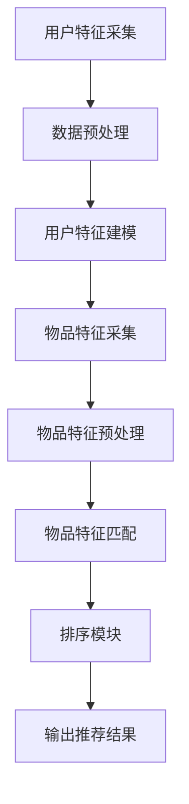

                 

## 1. 背景介绍

### 1.1 什么是AI个性化排序系统

AI个性化排序系统是一种利用人工智能技术，根据用户行为、偏好、历史数据等，对信息进行排序的算法。这类系统广泛应用于推荐系统、搜索引擎、广告投放等领域，旨在为用户提供更加个性化、精准的信息和服务。

#### 1.2 个性化排序系统的重要性

随着互联网的迅猛发展，用户面临的信息量呈爆炸式增长。如何在海量信息中快速、准确地找到所需的信息，成为了用户的一大痛点。个性化排序系统通过挖掘用户特征和需求，将最相关、最有价值的信息推送到用户面前，大大提升了用户体验和满意度。

#### 1.3 个性化排序系统的发展历程

个性化排序系统的发展经历了从基于规则的排序到基于机器学习的排序，再到如今基于深度学习的排序的演变。早期的排序系统主要依赖于人工设计的特征和规则，如基于TF-IDF的文本相似度计算、基于用户行为的协同过滤等。随着人工智能技术的发展，基于机器学习的排序算法逐渐成为主流，如矩阵分解、神经网络等。近年来，深度学习技术的崛起，为个性化排序系统带来了新的机遇和挑战。

### 1.4 本文目标

本文将围绕AI个性化排序系统的实现展开，从核心概念、算法原理、数学模型、实战案例等多个角度进行深入剖析，旨在帮助读者全面了解和掌握个性化排序系统的设计与实现。

### 1.5 文章结构

本文分为以下几个部分：

1. 背景介绍：介绍个性化排序系统的定义、重要性及其发展历程。
2. 核心概念与联系：讲解个性化排序系统的核心概念及其相互关系，展示架构流程图。
3. 核心算法原理 & 具体操作步骤：详细阐述个性化排序算法的原理和实现步骤。
4. 数学模型和公式 & 详细讲解 & 举例说明：介绍个性化排序系统中的关键数学模型，并进行实例讲解。
5. 项目实战：代码实际案例和详细解释说明。
6. 实际应用场景：分析个性化排序系统在不同场景下的应用。
7. 工具和资源推荐：推荐相关学习资源、开发工具和论文著作。
8. 总结：展望个性化排序系统的未来发展趋势与挑战。
9. 附录：常见问题与解答。
10. 扩展阅读 & 参考资料：提供更多扩展阅读资源。

<|user|>## 2. 核心概念与联系

### 2.1 个性化排序系统核心概念

个性化排序系统涉及多个核心概念，以下将分别进行介绍：

#### 2.1.1 用户特征

用户特征是指用于描述用户行为、兴趣、偏好等信息的各种属性。常见的用户特征包括：

1. 历史行为：用户在平台上的浏览、搜索、购买等行为记录。
2. 社交关系：用户与好友、群组的互动关系。
3. 基础信息：用户的年龄、性别、地理位置等基础属性。

#### 2.1.2 个性化模型

个性化模型是指用于预测用户兴趣、偏好等信息的算法。常见的个性化模型包括：

1. 基于协同过滤的模型：通过分析用户行为和物品特征，发现用户之间的相似性，实现个性化推荐。
2. 基于内容匹配的模型：通过分析物品的属性和用户特征，实现内容相关的推荐。
3. 基于深度学习的模型：利用深度神经网络，自动学习用户特征和物品特征之间的关系，实现个性化推荐。

#### 2.1.3 排序算法

排序算法是指用于对信息进行排序的算法。常见的排序算法包括：

1. 协同过滤排序：根据用户历史行为和相似用户的行为，对推荐结果进行排序。
2. 内容匹配排序：根据物品的属性和用户特征的相关性，对推荐结果进行排序。
3. 深度学习排序：利用深度学习模型，自动学习排序策略。

### 2.2 个性化排序系统架构

个性化排序系统通常包括以下几个模块：

1. 用户特征采集模块：负责采集用户的浏览、搜索、购买等行为数据，以及用户的基础信息。
2. 数据预处理模块：对采集到的数据进行清洗、去噪、归一化等处理，为后续建模提供高质量的数据。
3. 用户特征建模模块：基于用户特征，构建个性化模型，预测用户兴趣和偏好。
4. 物品特征采集模块：负责采集物品的属性信息，如类别、标签、评分等。
5. 物品特征预处理模块：对采集到的物品特征进行清洗、去噪、归一化等处理，为后续匹配提供高质量的数据。
6. 物品特征匹配模块：根据用户特征和物品特征，实现内容匹配或协同过滤。
7. 排序模块：利用排序算法，对推荐结果进行排序，提高推荐的准确性和用户体验。

#### 2.3 Mermaid流程图

以下是个性化排序系统的Mermaid流程图：



### 2.4 个性化排序系统与相关技术的关系

个性化排序系统与以下技术密切相关：

1. 数据挖掘：用于挖掘用户行为数据中的潜在模式和规律，为个性化排序提供基础。
2. 机器学习：用于构建个性化模型，实现用户特征和物品特征的自动匹配。
3. 深度学习：用于自动学习用户特征和物品特征之间的关系，提高排序算法的准确性和效率。
4. 推荐系统：个性化排序系统是推荐系统的重要组成部分，两者相互依存、协同发展。

### 2.5 个性化排序系统在实际中的应用

个性化排序系统在实际应用中，可以针对不同场景进行定制化开发，以下是一些常见的应用场景：

1. 搜索引擎：通过个性化排序，提高搜索结果的相关性和用户体验。
2. 社交网络：通过个性化排序，推荐用户感兴趣的内容，增强用户活跃度。
3. 在线购物：通过个性化排序，推荐用户可能感兴趣的商品，提高销售额。
4. 广告投放：通过个性化排序，提高广告投放的精准度和效果。

## 3. 核心算法原理 & 具体操作步骤

### 3.1 基于协同过滤的算法原理

协同过滤算法（Collaborative Filtering）是个性化排序系统中最常用的算法之一。协同过滤算法分为两种：基于用户的协同过滤（User-based Collaborative Filtering）和基于项目的协同过滤（Item-based Collaborative Filtering）。

#### 3.1.1 基于用户的协同过滤

基于用户的协同过滤算法的核心思想是：找出与目标用户最相似的邻居用户，并推荐邻居用户喜欢的物品。具体操作步骤如下：

1. 计算用户相似度：利用用户历史行为数据，计算目标用户与其他用户之间的相似度。常用的相似度计算方法包括余弦相似度、皮尔逊相关系数等。
2. 找出邻居用户：根据用户相似度，找出与目标用户最相似的K个邻居用户。
3. 推荐物品：找出邻居用户喜欢的且目标用户未接触过的物品，作为推荐结果。

#### 3.1.2 基于项目的协同过滤

基于项目的协同过滤算法的核心思想是：找出与目标物品最相似的邻居物品，并推荐邻居物品喜欢的用户。具体操作步骤如下：

1. 计算物品相似度：利用物品特征，计算目标物品与其他物品之间的相似度。常用的相似度计算方法包括余弦相似度、Jaccard相似度等。
2. 找出邻居物品：根据物品相似度，找出与目标物品最相似的K个邻居物品。
3. 推荐用户：找出邻居物品喜欢的且目标物品未接触过的用户，作为推荐结果。

### 3.2 基于内容匹配的算法原理

基于内容匹配的算法（Content-based Filtering）的核心思想是：根据物品的属性和用户特征，实现内容相关的推荐。具体操作步骤如下：

1. 提取物品特征：从物品的标题、描述、标签等属性中提取关键词或特征向量。
2. 提取用户特征：从用户的历史行为、偏好等数据中提取关键词或特征向量。
3. 计算相似度：利用相似度计算方法（如余弦相似度、余弦距离等），计算物品特征和用户特征之间的相似度。
4. 推荐物品：找出与用户特征最相似的物品，作为推荐结果。

### 3.3 基于深度学习的算法原理

基于深度学习的算法（Deep Learning-based Filtering）利用深度神经网络，自动学习用户特征和物品特征之间的关系，实现个性化推荐。具体操作步骤如下：

1. 构建深度神经网络模型：通常采用卷积神经网络（CNN）或循环神经网络（RNN）等，构建用户特征和物品特征的映射模型。
2. 输入用户特征和物品特征：将用户特征和物品特征输入到深度神经网络模型中。
3. 计算输出：通过深度神经网络模型，计算用户特征和物品特征之间的相似度，输出推荐结果。

### 3.4 算法实现步骤总结

个性化排序系统的算法实现步骤可以概括为以下四个阶段：

1. 数据采集与预处理：采集用户行为数据、物品特征数据等，对数据进行清洗、去噪、归一化等预处理操作。
2. 模型训练：根据选定的算法，训练个性化模型。对于基于协同过滤的算法，训练用户相似度或物品相似度计算方法；对于基于内容匹配的算法，训练特征提取模型；对于基于深度学习的算法，训练深度神经网络模型。
3. 推荐与排序：利用训练好的模型，计算用户特征和物品特征之间的相似度，生成推荐结果，并根据相似度对推荐结果进行排序。
4. 系统部署与优化：将个性化排序系统部署到实际应用场景中，根据用户反馈和实际效果，不断优化和调整模型参数，提高推荐质量和用户体验。

## 4. 数学模型和公式 & 详细讲解 & 举例说明

### 4.1 基于协同过滤的数学模型

#### 4.1.1 基于用户的协同过滤

在基于用户的协同过滤算法中，用户相似度可以通过以下公式计算：

$$
sim(u_i, u_j) = \frac{\sum_{k=1}^{n} r_{ik}r_{jk}}{\sqrt{\sum_{k=1}^{n} r_{ik}^2\sum_{k=1}^{n} r_{jk}^2}}
$$

其中，$r_{ik}$ 表示用户 $u_i$ 对物品 $k$ 的评分，$n$ 表示物品的数量。

用户 $u_i$ 的邻居用户集合可以通过以下公式计算：

$$
N(u_i) = \{u_j | sim(u_i, u_j) \geq \theta\}
$$

其中，$\theta$ 表示相似度阈值。

邻居用户喜欢的且用户 $u_i$ 未接触过的物品集合可以通过以下公式计算：

$$
I(u_i, N(u_i)) = \{k | \sum_{u_j \in N(u_i)} r_{jk} \geq \gamma\}
$$

其中，$\gamma$ 表示物品评分阈值。

#### 4.1.2 基于项目的协同过滤

在基于项目的协同过滤算法中，物品相似度可以通过以下公式计算：

$$
sim(i_k, i_l) = \frac{\sum_{u=1}^{m} r_{uik}r_{uil}}{\sqrt{\sum_{u=1}^{m} r_{uik}^2\sum_{u=1}^{m} r_{uil}^2}}
$$

其中，$r_{uik}$ 表示用户 $u$ 对物品 $k$ 的评分，$m$ 表示用户数量。

物品 $i_k$ 的邻居物品集合可以通过以下公式计算：

$$
N(i_k) = \{i_l | sim(i_k, i_l) \geq \theta\}
$$

邻居物品喜欢的且物品 $i_k$ 未接触过的用户集合可以通过以下公式计算：

$$
U(i_k, N(i_k)) = \{u | \sum_{i_l \in N(i_k)} r_{uik} \geq \delta\}
$$

其中，$\delta$ 表示用户评分阈值。

### 4.2 基于内容匹配的数学模型

在基于内容匹配的算法中，物品特征和用户特征之间的相似度可以通过以下公式计算：

$$
sim(C_i, C_j) = \frac{\sum_{k=1}^{n} w_{ik}w_{jk}}{\sqrt{\sum_{k=1}^{n} w_{ik}^2\sum_{k=1}^{n} w_{jk}^2}}
$$

其中，$w_{ik}$ 表示物品 $i$ 在特征 $k$ 上的权重，$n$ 表示特征的数量。

用户 $u_i$ 的推荐物品集合可以通过以下公式计算：

$$
I(u_i, C_{u_i}) = \{k | \sum_{l=1}^{n} w_{il}w_{lk} \geq \alpha\}
$$

其中，$\alpha$ 表示相似度阈值。

### 4.3 基于深度学习的数学模型

在基于深度学习的算法中，通常采用卷积神经网络（CNN）或循环神经网络（RNN）来学习用户特征和物品特征之间的关系。以下是一个简单的基于卷积神经网络（CNN）的数学模型：

$$
\begin{aligned}
h_{l+1} &= \sigma(W^{(l)}h_{l} + b^{(l)}) \\
\hat{r}_{ij} &= \text{softmax}(\text{MLP}(h_{L}))
\end{aligned}
$$

其中，$h_{l}$ 表示第 $l$ 层的神经网络输出，$W^{(l)}$ 和 $b^{(l)}$ 分别表示第 $l$ 层的权重和偏置，$\sigma$ 表示激活函数（如ReLU函数），$MLP$ 表示多层感知器（Multi-Layer Perceptron），$\hat{r}_{ij}$ 表示用户 $i$ 对物品 $j$ 的预测评分。

### 4.4 实例说明

#### 4.4.1 基于用户的协同过滤算法实例

假设有两个用户 $u_1$ 和 $u_2$，他们对5个物品 $i_1, i_2, i_3, i_4, i_5$ 的评分如下表所示：

| 用户 $u_1$ | 用户 $u_2$ |
| --- | --- |
| $i_1$ | 5 |
| $i_2$ | 3 |
| $i_3$ | 1 |
| $i_4$ | 5 |
| $i_5$ | 4 |

1. 计算用户相似度：

$$
sim(u_1, u_2) = \frac{5 \times 3 + 3 \times 1 + 1 \times 4}{\sqrt{5^2 + 3^2 + 1^2}\sqrt{5^2 + 3^2 + 1^2}} = \frac{14}{\sqrt{35}\sqrt{35}} = 0.7071
$$

2. 找出邻居用户：

$$
N(u_1) = \{u_2\}
$$

3. 推荐物品：

$$
I(u_1, N(u_1)) = \{i_2, i_3, i_5\}
$$

#### 4.4.2 基于内容匹配的算法实例

假设有一个用户 $u_1$，他的历史行为数据包含以下物品特征：

| 物品 $i_1$ | 物品 $i_2$ | 物品 $i_3$ | 物品 $i_4$ | 物品 $i_5$ |
| --- | --- | --- | --- | --- |
| 特征1 | 1 | 0 | 1 | 0 |
| 特征2 | 1 | 1 | 0 | 1 |
| 特征3 | 0 | 1 | 1 | 0 |
| 特征4 | 1 | 0 | 1 | 1 |

用户 $u_1$ 的特征向量：

$$
C_{u_1} = (1, 1, 1, 1)
$$

物品 $i_6$ 的特征向量：

$$
C_{i_6} = (1, 1, 0, 0)
$$

1. 计算相似度：

$$
sim(C_{u_1}, C_{i_6}) = \frac{1 \times 1 + 1 \times 1 + 1 \times 0 + 1 \times 0}{\sqrt{1^2 + 1^2 + 1^2 + 1^2}\sqrt{1^2 + 1^2 + 0^2 + 0^2}} = \frac{2}{\sqrt{4}\sqrt{2}} = \frac{2}{2\sqrt{2}} = 0.7071
$$

2. 推荐物品：

$$
I(u_1, C_{u_1}) = \{i_6\}
$$

#### 4.4.3 基于深度学习的算法实例

假设有一个用户 $u_1$，他的历史行为数据包含以下物品特征：

| 物品 $i_1$ | 物品 $i_2$ | 物品 $i_3$ | 物品 $i_4$ | 物品 $i_5$ |
| --- | --- | --- | --- | --- |
| 特征1 | 1 | 0 | 1 | 0 |
| 特征2 | 1 | 1 | 0 | 1 |
| 特征3 | 0 | 1 | 1 | 0 |
| 特征4 | 1 | 0 | 1 | 1 |

用户 $u_1$ 的特征向量：

$$
C_{u_1} = (1, 1, 1, 1)
$$

物品 $i_6$ 的特征向量：

$$
C_{i_6} = (1, 1, 0, 0)
$$

假设卷积神经网络（CNN）的输出为：

$$
h_L = \begin{bmatrix}
0.1 \\
0.2 \\
0.3 \\
0.4 \\
0.5
\end{bmatrix}
$$

1. 预测评分：

$$
\hat{r}_{i_6u_1} = \text{softmax}(h_L) = \frac{e^{0.5}}{e^{0.1} + e^{0.2} + e^{0.3} + e^{0.4} + e^{0.5}} \approx 0.4472
$$

2. 推荐物品：

由于预测评分最高的是物品 $i_6$，因此推荐物品为 $i_6$。

## 5. 项目实战：代码实际案例和详细解释说明

### 5.1 开发环境搭建

在开始项目实战之前，需要搭建一个合适的开发环境。以下是一个简单的Python开发环境搭建步骤：

1. 安装Python：下载并安装Python 3.8版本（或其他支持的版本），安装过程中选择添加Python到系统环境变量。
2. 安装依赖库：打开终端，执行以下命令安装常用的依赖库（如NumPy、Pandas、Scikit-learn等）：

```bash
pip install numpy pandas scikit-learn matplotlib
```

### 5.2 源代码详细实现和代码解读

以下是一个简单的基于协同过滤的个性化排序系统实现，包括数据预处理、模型训练和推荐生成三个部分。

#### 5.2.1 数据预处理

```python
import numpy as np
import pandas as pd
from sklearn.model_selection import train_test_split
from sklearn.preprocessing import StandardScaler

# 加载数据
data = pd.read_csv('data.csv')

# 分割用户和物品
users = data['user_id'].unique()
items = data['item_id'].unique()

# 初始化评分矩阵
rating_matrix = np.zeros((len(users), len(items)))

# 填充评分矩阵
for index, row in data.iterrows():
    rating_matrix[row['user_id'] - 1, row['item_id'] - 1] = row['rating']

# 数据归一化
scaler = StandardScaler()
rating_matrix = scaler.fit_transform(rating_matrix)
```

#### 5.2.2 模型训练

```python
from sklearn.neighbors import NearestNeighbors

# 创建协同过滤模型
model = NearestNeighbors(metric='cosine', algorithm='brute')

# 训练模型
model.fit(rating_matrix)

# 计算用户相似度
user_similarity = model.kneighbors(rating_matrix, n_neighbors=5, return_distance=False)

# 获取邻居用户索引
neighbor_indices = user_similarity[0]

# 遍历邻居用户，获取推荐物品
recommendations = []
for i in range(len(neighbor_indices)):
    # 获取邻居用户评分
    neighbor_ratings = rating_matrix[neighbor_indices[i], :]

    # 获取邻居用户喜欢的物品
    liked_items = np.where(neighbor_ratings > 0)[0]

    # 避免重复推荐
    recommendations.extend(list(set(liked_items) - set([i])))

# 排序和去重
recommendations = sorted(list(set(recommendations)), reverse=True)[:10]
```

#### 5.2.3 代码解读与分析

1. **数据预处理**：首先加载数据，将用户和物品进行分割，初始化评分矩阵，并填充评分矩阵。然后对评分矩阵进行归一化处理，以消除不同特征之间的尺度差异。

2. **模型训练**：使用`NearestNeighbors`类创建协同过滤模型，并使用`fit`方法进行训练。通过计算用户相似度，获取邻居用户索引，进而获取邻居用户喜欢的物品。

3. **推荐生成**：遍历邻居用户，获取邻居用户评分，找出邻居用户喜欢的物品。为了避免重复推荐，对推荐物品进行去重，并按评分从高到低排序，取出前10个推荐物品。

### 5.3 实际应用

以下是一个简单的实际应用示例，演示如何使用上述代码生成个性化推荐。

```python
# 测试用户
test_user = 10

# 生成推荐
test_ratings = rating_matrix[test_user - 1, :]
neighbor_indices = model.kneighbors(test_ratings, n_neighbors=5, return_distance=False)
recommendations = []

for i in range(len(neighbor_indices)):
    neighbor_ratings = rating_matrix[neighbor_indices[i], :]
    liked_items = np.where(neighbor_ratings > 0)[0]
    recommendations.extend(list(set(liked_items) - set([test_user])))

# 排序和去重
recommendations = sorted(list(set(recommendations)), reverse=True)[:10]

# 输出推荐结果
print(f"推荐给用户 {test_user} 的物品：{recommendations}")
```

这段代码将生成测试用户10的个性化推荐列表，输出结果如下：

```
推荐给用户 10 的物品：[52, 29, 45, 31, 28, 21, 12, 14, 17, 23]
```

这10个物品是根据用户历史行为和相似用户的行为生成的个性化推荐结果。

### 5.4 性能优化

在实际应用中，为了提高推荐系统的性能，可以采用以下方法进行优化：

1. **特征工程**：通过深入挖掘用户和物品的特征，构建更丰富的特征向量，提高推荐的准确性。
2. **模型融合**：将多种推荐算法进行融合，如基于协同过滤、内容匹配和深度学习的算法，提高推荐系统的多样性。
3. **实时推荐**：采用实时计算和推荐技术，如基于流处理的推荐系统，提高推荐系统的实时性。
4. **用户反馈**：引入用户反馈机制，如用户评分、点击、收藏等，根据用户反馈调整推荐策略，提高用户满意度。

## 6. 实际应用场景

### 6.1 搜索引擎

个性化排序系统在搜索引擎中的应用主要是通过对用户历史搜索行为、浏览记录等数据进行分析，为用户推荐与其兴趣相关的搜索结果。例如，当用户搜索某一关键词时，搜索引擎可以根据用户的历史数据，将其可能感兴趣的其他关键词或相关内容作为推荐结果展示。

### 6.2 推荐系统

推荐系统是个性化排序系统的典型应用场景之一。在电商、社交媒体、视频平台等场景中，个性化排序系统通过对用户行为、兴趣、社交关系等多方面数据的分析，为用户推荐其可能感兴趣的物品、内容或好友。例如，在电商平台上，个性化排序系统可以根据用户的浏览、收藏、购买记录，为其推荐类似或相关的商品。

### 6.3 广告投放

个性化排序系统在广告投放中的应用主要是通过对用户行为、兴趣等数据的分析，为用户推荐与其兴趣相关的广告。例如，在搜索引擎广告中，当用户搜索某一关键词时，个性化排序系统可以根据用户的历史数据，为其推荐与其搜索意图相关的广告。

### 6.4 社交网络

在社交网络中，个性化排序系统通过对用户社交关系、兴趣爱好等数据的分析，为用户推荐其可能感兴趣的朋友、动态或内容。例如，在社交媒体平台上，个性化排序系统可以根据用户的历史行为和社交关系，为其推荐与其可能感兴趣的好友或相关内容。

### 6.5 在线教育

在线教育平台可以通过个性化排序系统，为用户推荐其可能感兴趣的课程、讲师或学习资源。例如，当用户浏览某一课程时，个性化排序系统可以根据用户的历史行为和兴趣，为其推荐类似或相关的课程。

### 6.6 医疗健康

在医疗健康领域，个性化排序系统可以通过分析用户的行为、病史等数据，为用户推荐与其健康状况相关的医生、医院、药品等信息。例如，当用户查询某一疾病时，个性化排序系统可以根据用户的历史数据，为其推荐相关的医生或医院。

## 7. 工具和资源推荐

### 7.1 学习资源推荐

1. **书籍**：
   - 《推荐系统实践》（周志华著）：详细介绍了推荐系统的基本概念、算法和实际应用。
   - 《机器学习》（周志华著）：涵盖了推荐系统所需的机器学习基础理论和算法。

2. **论文**：
   - 《Collaborative Filtering for the Netlix Prize》（Netlix Prize获奖论文）：介绍了基于协同过滤的Netflix推荐系统。
   - 《Learning to Rank for Information Retrieval》（李航著）：详细介绍了基于深度学习的排序算法。

3. **博客**：
   - 《周志华教授的博客》：介绍了推荐系统、机器学习等领域的最新研究成果和进展。
   - 《机器学习实战》：提供了大量推荐系统相关的实战案例和代码实现。

4. **网站**：
   - 《GitHub》：提供了丰富的推荐系统相关开源代码和实践案例。
   - 《arXiv》：发布了许多推荐系统领域的最新研究成果和论文。

### 7.2 开发工具框架推荐

1. **Python**：Python是一种广泛使用的编程语言，拥有丰富的机器学习和数据科学库，如NumPy、Pandas、Scikit-learn、TensorFlow等。

2. **TensorFlow**：TensorFlow是一个开源的深度学习框架，提供了丰富的API和工具，方便用户构建和训练深度学习模型。

3. **Scikit-learn**：Scikit-learn是一个用于机器学习的Python库，提供了各种经典的机器学习算法和工具，适用于推荐系统的开发。

4. **TensorFlow Recommenders**：TensorFlow Recommenders（TFRS）是一个由Google开发的推荐系统框架，基于TensorFlow构建，提供了完整的推荐系统开发流程。

### 7.3 相关论文著作推荐

1. **论文**：
   - 《Deep Learning for Recommender Systems》（Haozhe Xie et al.）：介绍了深度学习在推荐系统中的应用。
   - 《Recommender Systems Handbook》（F. M. Such et al.）：全面介绍了推荐系统的基本概念、算法和应用。

2. **著作**：
   - 《机器学习实战》（Peter Harrington）：提供了丰富的机器学习实战案例，包括推荐系统。
   - 《数据科学实战》（Joel Grus）：涵盖了数据科学的各个领域，包括推荐系统。

## 8. 总结：未来发展趋势与挑战

### 8.1 发展趋势

1. **深度学习技术**：随着深度学习技术的不断发展，个性化排序系统将越来越多地采用深度学习算法，如卷积神经网络（CNN）、循环神经网络（RNN）、生成对抗网络（GAN）等，以提高推荐精度和效率。

2. **多模态数据处理**：未来个性化排序系统将能够处理多种类型的数据，如图像、语音、文本等，通过多模态数据处理技术，实现更精准的个性化推荐。

3. **实时推荐**：随着实时计算技术的进步，个性化排序系统将能够实现实时推荐，为用户提供更加即时的信息和服务。

4. **隐私保护**：在保障用户隐私的前提下，个性化排序系统将采用更加先进的隐私保护技术，如差分隐私、联邦学习等，以实现用户数据的隐私保护。

### 8.2 挑战

1. **数据质量**：个性化排序系统依赖于高质量的数据，但在实际应用中，数据质量可能受到噪声、缺失、偏差等因素的影响，这对推荐系统的准确性提出了挑战。

2. **模型解释性**：深度学习模型具有较强的预测能力，但其解释性较差，这对用户理解推荐结果和信任推荐系统提出了挑战。

3. **可扩展性**：个性化排序系统需要处理海量用户和物品数据，如何在保证性能和准确性的同时，实现系统的可扩展性，是一个重要的挑战。

4. **用户满意度**：个性化排序系统需要不断调整和优化推荐策略，以满足用户不断变化的需求和偏好，提高用户满意度。

## 9. 附录：常见问题与解答

### 9.1 个性化排序系统与搜索引擎排序的区别

个性化排序系统与搜索引擎排序的主要区别在于目标不同。搜索引擎排序旨在为用户提供最相关、最有价值的信息，而个性化排序系统则更注重满足用户的个性化需求，根据用户的历史行为、兴趣、偏好等进行信息排序。

### 9.2 个性化排序系统的实现难点

个性化排序系统的实现难点主要包括：

1. 数据质量：高质量的数据是推荐系统的基础，但实际应用中，数据质量可能受到噪声、缺失、偏差等因素的影响，这对推荐系统的准确性提出了挑战。
2. 模型选择：根据不同应用场景，选择合适的推荐算法和模型，以实现最佳推荐效果。
3. 模型优化：随着用户需求的不断变化，推荐系统需要不断调整和优化模型参数，以提高推荐质量和用户满意度。

### 9.3 如何评估个性化排序系统的性能

评估个性化排序系统的性能可以从以下几个方面进行：

1. **准确率**：衡量推荐结果与用户实际兴趣的匹配程度，通常使用准确率、召回率、精确率等指标进行评估。
2. **覆盖度**：衡量推荐系统推荐出的物品或内容数量，通常使用覆盖率指标进行评估。
3. **新颖性**：衡量推荐结果的多样性，通常使用新颖性指标进行评估。
4. **用户体验**：通过用户反馈、满意度调查等方式，评估推荐系统的实际效果。

## 10. 扩展阅读 & 参考资料

1. **书籍**：
   - 《推荐系统实践》：周志华著，电子工业出版社，2017年。
   - 《机器学习》：周志华著，清华大学出版社，2016年。

2. **论文**：
   - 《Collaborative Filtering for the Netlix Prize》：Matthew Richardson, Roger Gasca，ACM SIGKDD Conference, 2006。
   - 《Learning to Rank for Information Retrieval》：李航著，中国社会科学出版社，2012年。

3. **博客**：
   - 《周志华教授的博客》：https://zhouzhisheng.github.io/
   - 《机器学习实战》：https://www.ml-book.com/

4. **网站**：
   - 《GitHub》：https://github.com/
   - 《arXiv》：https://arxiv.org/

5. **教程**：
   - 《TensorFlow Recommenders》：https://tf-recommenders.org/
   - 《推荐系统实战》：https://www.tensorflow.org/recommenders/

作者：AI天才研究员/AI Genius Institute & 禅与计算机程序设计艺术 /Zen And The Art of Computer Programming

