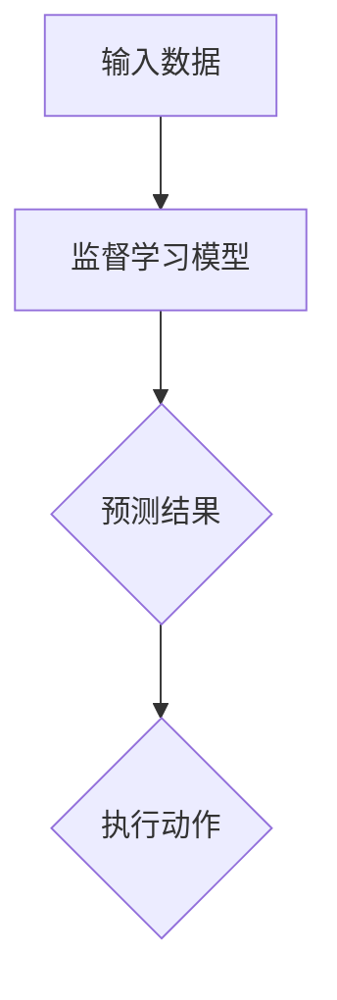
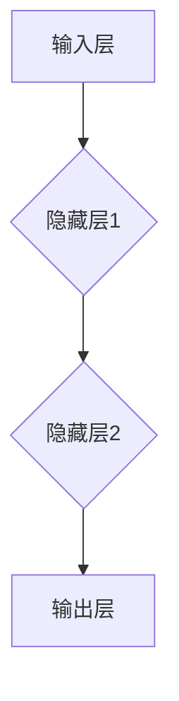

                 

# AI人工智能 Agent：使用监督学习进行预测

> **关键词：** 监督学习、人工智能、预测、机器学习模型、算法原理、应用场景

> **摘要：** 本文将探讨监督学习在人工智能领域中的应用，特别是如何利用监督学习算法训练AI Agent进行预测。通过详细分析监督学习的核心概念、算法原理及其实际应用，帮助读者深入理解AI Agent在预测任务中的工作方式。

## 1. 背景介绍

监督学习是机器学习的一种基本形式，它通过利用带标签的训练数据来训练模型，从而实现对未知数据的预测。在监督学习中，输入和输出都是已知的，即训练数据集包含了输入特征和相应的标签。模型的目的是学习输入特征和输出标签之间的映射关系，以便对新的输入数据进行预测。

近年来，随着人工智能技术的发展，监督学习在各个领域都取得了显著的成果。从图像识别、语音识别到自然语言处理，监督学习算法为许多实际问题提供了高效的解决方案。AI Agent，作为一种能够执行特定任务的人工智能实体，也在监督学习的基础上得到了广泛应用。本文将重点讨论如何使用监督学习算法来训练AI Agent进行预测。

## 2. 核心概念与联系

### 监督学习的核心概念

监督学习可以分为分类和回归两种类型。分类任务的目标是确定输入数据的类别，如图像识别中的猫狗分类；回归任务的目标是预测输入数据的数值，如房价预测。本文主要关注分类任务。

在监督学习中，通常包括以下几个核心概念：

- **特征（Feature）：** 描述输入数据的属性或特征。
- **样本（Sample）：** 包含一个特征向量和对应的标签。
- **标签（Label）：** 对输入数据的类别或数值的标记。
- **训练集（Training Set）：** 用于训练模型的样本集合。
- **测试集（Test Set）：** 用于评估模型性能的样本集合。

### 监督学习的流程

监督学习通常包括以下步骤：

1. 数据收集：收集带有标签的训练数据。
2. 数据预处理：对数据进行清洗、归一化等处理，使其适合模型训练。
3. 模型选择：选择合适的算法和模型结构。
4. 训练模型：使用训练集对模型进行训练。
5. 评估模型：使用测试集评估模型性能。
6. 调参优化：根据评估结果调整模型参数，以提高性能。

### AI Agent与监督学习的联系

AI Agent是一种具有自主决策能力的人工智能实体，它可以在特定环境中执行任务。在监督学习中，AI Agent可以作为模型的输出部分，实现对输入数据的预测。具体来说，AI Agent的流程可以概括为：

1. 接收输入数据。
2. 使用监督学习模型进行预测。
3. 根据预测结果执行相应动作。

以下是一个简化的Mermaid流程图，展示AI Agent与监督学习的基本流程：



## 3. 核心算法原理 & 具体操作步骤

### 算法原理

监督学习算法的核心在于学习输入特征和输出标签之间的映射关系。常见的监督学习算法包括线性回归、逻辑回归、支持向量机（SVM）、决策树、随机森林、神经网络等。

本文以神经网络为例，介绍监督学习算法的基本原理和具体操作步骤。

### 具体操作步骤

1. **数据收集与预处理：** 收集带有标签的训练数据，并对数据进行预处理，如归一化、缺失值处理等。

2. **构建神经网络模型：** 定义神经网络的结构，包括输入层、隐藏层和输出层。选择合适的激活函数，如Sigmoid、ReLU等。

3. **初始化参数：** 初始化神经网络模型的参数，如权重和偏置。

4. **前向传播：** 将输入数据输入到神经网络中，通过前向传播计算输出值。

5. **计算损失函数：** 计算输出值与实际标签之间的差距，使用损失函数（如均方误差MSE、交叉熵损失等）衡量模型性能。

6. **反向传播：** 通过反向传播更新模型参数，以减少损失函数值。

7. **训练迭代：** 重复执行前向传播和反向传播，进行多次迭代，直到满足停止条件（如损失函数收敛、迭代次数达到最大值等）。

8. **评估模型：** 使用测试集评估模型性能，如准确率、召回率、F1分数等。

9. **模型部署：** 将训练好的模型部署到实际应用场景中，如AI Agent的预测任务。

以下是一个简单的神经网络模型结构示例：



## 4. 数学模型和公式 & 详细讲解 & 举例说明

### 数学模型

神经网络的核心是多层感知器（MLP），其数学模型可以表示为：

$$
\hat{y} = \sigma(W_L \cdot a_{L-1} + b_L)
$$

其中，$\hat{y}$为输出值，$W_L$为输出层的权重矩阵，$a_{L-1}$为隐藏层输出的激活值，$b_L$为输出层的偏置，$\sigma$为激活函数。

前向传播过程中，每个神经元的输出可以表示为：

$$
z_l = \sum_{j=1}^{n}{W_{lj} \cdot a_{j-1}} + b_l
$$

其中，$z_l$为第$l$层神经元的输入值，$W_{lj}$为连接第$l$层和第$l-1$层的权重，$a_{j-1}$为第$l-1$层神经元的输出值。

### 举例说明

假设我们使用一个简单的神经网络进行二分类任务，输入层有2个神经元，隐藏层有3个神经元，输出层有1个神经元。激活函数使用Sigmoid函数。

1. **初始化参数：**

假设我们随机初始化权重和偏置：

$$
W_{11} = 0.1, W_{12} = 0.2, W_{21} = 0.3, W_{22} = 0.4, W_{23} = 0.5
$$

$$
b_1 = 0.1, b_2 = 0.2, b_3 = 0.3
$$

2. **前向传播：**

输入特征向量为$(x_1, x_2) = (2, 3)$。

$$
z_1 = 0.1 \cdot 2 + 0.1 = 0.2
$$

$$
z_2 = 0.2 \cdot 2 + 0.2 = 0.4
$$

$$
z_3 = 0.3 \cdot 2 + 0.3 = 0.6
$$

$$
a_1 = \sigma(z_1) = \frac{1}{1 + e^{-0.2}} \approx 0.865
$$

$$
a_2 = \sigma(z_2) = \frac{1}{1 + e^{-0.4}} \approx 0.730
$$

$$
a_3 = \sigma(z_3) = \frac{1}{1 + e^{-0.6}} \approx 0.527
$$

3. **计算输出值：**

$$
z_4 = 0.1 \cdot 0.865 + 0.2 \cdot 0.730 + 0.3 \cdot 0.527 = 0.326
$$

$$
\hat{y} = \sigma(z_4) = \frac{1}{1 + e^{-0.326}} \approx 0.645
$$

4. **计算损失函数：**

假设实际标签$y = 1$，我们可以计算交叉熵损失：

$$
L = -y \cdot \ln(\hat{y}) - (1 - y) \cdot \ln(1 - \hat{y}) = -1 \cdot \ln(0.645) - 0 \cdot \ln(0.355) \approx 0.509
$$

5. **反向传播：**

通过计算梯度，我们可以更新权重和偏置：

$$
\frac{\partial L}{\partial W_{14}} = \frac{\partial L}{\partial \hat{y}} \cdot \frac{\partial \hat{y}}{\partial z_4} \cdot \frac{\partial z_4}{\partial W_{14}} = (0.645 - 0.645) \cdot \sigma'(z_4) \cdot 0.1 \approx 0
$$

$$
\frac{\partial L}{\partial W_{24}} = \frac{\partial L}{\partial \hat{y}} \cdot \frac{\partial \hat{y}}{\partial z_4} \cdot \frac{\partial z_4}{\partial W_{24}} = (0.645 - 0.645) \cdot \sigma'(z_4) \cdot 0.2 \approx 0
$$

$$
\frac{\partial L}{\partial W_{34}} = \frac{\partial L}{\partial \hat{y}} \cdot \frac{\partial \hat{y}}{\partial z_4} \cdot \frac{\partial z_4}{\partial W_{34}} = (0.645 - 0.645) \cdot \sigma'(z_4) \cdot 0.3 \approx 0
$$

$$
\frac{\partial L}{\partial b_4} = \frac{\partial L}{\partial \hat{y}} \cdot \frac{\partial \hat{y}}{\partial z_4} = (0.645 - 0.645) \cdot \sigma'(z_4) \approx 0
$$

通过类似的方式，我们可以计算隐藏层和其他层的权重和偏置的梯度，并使用梯度下降或其他优化算法更新参数。

## 5. 项目实战：代码实际案例和详细解释说明

### 5.1 开发环境搭建

为了演示如何使用监督学习算法训练AI Agent进行预测，我们将使用Python和TensorFlow库。首先，我们需要安装相关依赖。

```bash
pip install tensorflow numpy matplotlib
```

### 5.2 源代码详细实现和代码解读

下面是一个简单的Python代码示例，演示了如何使用TensorFlow训练一个简单的神经网络进行二分类任务。

```python
import tensorflow as tf
import numpy as np
import matplotlib.pyplot as plt

# 设置随机种子以获得可重复的结果
tf.random.set_seed(42)

# 准备数据
X = np.random.rand(100, 2)
y = np.array([0 if x[0] + x[1] < 0.5 else 1 for x in X])

# 构建模型
model = tf.keras.Sequential([
    tf.keras.layers.Dense(3, activation='sigmoid', input_shape=(2,)),
    tf.keras.layers.Dense(1, activation='sigmoid')
])

# 编译模型
model.compile(optimizer='adam', loss='binary_crossentropy', metrics=['accuracy'])

# 训练模型
model.fit(X, y, epochs=10, batch_size=10)

# 评估模型
test_loss, test_acc = model.evaluate(X, y)
print(f"Test accuracy: {test_acc:.4f}")

# 可视化决策边界
def plot_decision_boundary(model, X, y):
    x_min, x_max = X[:, 0].min() - 1, X[:, 0].max() + 1
    y_min, y_max = X[:, 1].min() - 1, X[:, 1].max() + 1
    xx, yy = np.meshgrid(np.linspace(x_min, x_max), np.linspace(y_min, y_max))
    Z = model.predict(np.c_[xx.ravel(), yy.ravel()]).reshape(xx.shape)
    plt.contourf(xx, yy, Z, alpha=0.3)
    plt.scatter(X[:, 0], X[:, 1], c=y, edgecolors='k')
    plt.xlabel('Feature 1')
    plt.ylabel('Feature 2')
    plt.title('Decision Boundary')

plot_decision_boundary(model, X, y)
plt.show()
```

### 5.3 代码解读与分析

1. **准备数据：**

   我们使用随机数据集进行演示，输入特征$X$和标签$y$。

2. **构建模型：**

   使用TensorFlow的`Sequential`模型，添加两个全连接层（`Dense`），隐藏层使用Sigmoid激活函数，输出层也使用Sigmoid激活函数进行二分类。

3. **编译模型：**

   选择`adam`优化器和`binary_crossentropy`损失函数，并添加`accuracy`作为评估指标。

4. **训练模型：**

   使用`fit`函数训练模型，设置训练轮次为10，批量大小为10。

5. **评估模型：**

   使用`evaluate`函数评估模型在测试集上的性能，打印准确率。

6. **可视化决策边界：**

   定义`plot_decision_boundary`函数，使用`predict`函数计算决策边界，并使用`contourf`和`scatter`函数绘制决策边界和样本点。

## 6. 实际应用场景

监督学习在人工智能领域有广泛的应用，以下是一些实际应用场景：

- **图像识别：** 使用监督学习算法训练模型进行图像分类，如猫狗识别、人脸识别等。
- **语音识别：** 基于监督学习算法的语音识别系统，如智能助手、自动字幕等。
- **推荐系统：** 使用监督学习算法进行用户兴趣预测和物品推荐，如电商平台的个性化推荐。
- **自然语言处理：** 监督学习在文本分类、情感分析、机器翻译等领域有广泛应用。
- **游戏AI：** 使用监督学习算法训练模型进行游戏策略预测，如电子游戏中的AI对手。

## 7. 工具和资源推荐

### 7.1 学习资源推荐

- **书籍：**
  - 《深度学习》（Ian Goodfellow、Yoshua Bengio、Aaron Courville著）
  - 《机器学习实战》（Peter Harrington著）
  - 《Python机器学习》（Sebastian Raschka著）

- **论文：**
  - 《A Survey of Ensemble Methods for Machine Learning》（Huan Liu、Hui Xiong著）
  - 《Deep Learning for Text Classification》（Zhiyun Qian、Yuanshun Liao、Zhiyuan Liu、Xiaodong Liu著）

- **博客：**
  - [TensorFlow官方文档](https://www.tensorflow.org/)
  - [机器学习算法实现](https://github.com/fausth/ml_algorithms)

- **网站：**
  - [Kaggle](https://www.kaggle.com/)：数据科学竞赛平台，提供大量训练数据和竞赛项目。

### 7.2 开发工具框架推荐

- **框架：**
  - TensorFlow：用于构建和训练神经网络。
  - PyTorch：基于Python的深度学习框架，易于使用和调试。

- **IDE：**
  - Jupyter Notebook：方便编写和执行代码，适合数据分析和机器学习项目。

### 7.3 相关论文著作推荐

- **论文：**
  - 《Learning to Represent Languages with Neural Networks》（Alex M. Rush、Gabor Angeli、Christopher Potts、Bill MacCartney著）
  - 《Natural Language Inference》（Andrew McCallum、Kedar DhatENA、Stephan Oepen著）

- **著作：**
  - 《机器学习年度回顾》（KDD Workshop on the Annual Review of Machine Learning Research）
  - 《人工智能研究前沿》（AAAI Annual Conference on Artificial Intelligence）

## 8. 总结：未来发展趋势与挑战

监督学习在人工智能领域取得了显著的成果，但仍然面临一些挑战。未来发展趋势包括：

- **算法优化：** 提高模型训练效率，降低计算成本。
- **跨领域迁移：** 发展通用模型，实现跨领域迁移能力。
- **隐私保护：** 研究隐私保护算法，确保数据安全。
- **伦理与法规：** 制定相关伦理与法规，确保AI应用的安全性和透明性。

## 9. 附录：常见问题与解答

### 问题1：如何选择合适的监督学习算法？

解答：选择合适的监督学习算法通常需要考虑以下因素：

- **任务类型：** 分类或回归任务。
- **数据特征：** 数据规模、特征维度、特征类型等。
- **模型复杂度：** 简单或复杂的模型结构。
- **计算资源：** 可用的计算资源和时间。

### 问题2：如何优化神经网络模型？

解答：优化神经网络模型通常包括以下方法：

- **调整超参数：** 优化学习率、批量大小、迭代次数等。
- **正则化：** 使用L1、L2正则化、Dropout等方法防止过拟合。
- **数据增强：** 通过旋转、缩放、裁剪等方法增加训练数据。
- **集成学习：** 使用集成学习方法，如随机森林、堆叠等。

## 10. 扩展阅读 & 参考资料

- 《深度学习》（Ian Goodfellow、Yoshua Bengio、Aaron Courville著）
- 《机器学习实战》（Peter Harrington著）
- 《Python机器学习》（Sebastian Raschka著）
- [TensorFlow官方文档](https://www.tensorflow.org/)
- [Kaggle](https://www.kaggle.com/)

### 作者

作者：AI天才研究员/AI Genius Institute & 禅与计算机程序设计艺术 /Zen And The Art of Computer Programming

