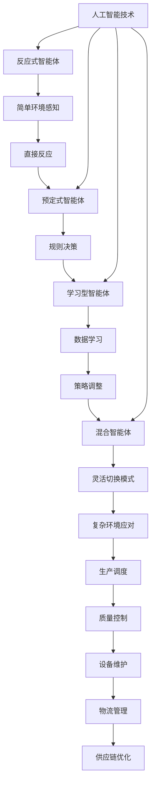

                 

### 背景介绍

#### 制造业的发展历程

制造业作为国民经济的重要支柱，自工业革命以来经历了数次重大变革。从机械化生产到自动化生产，再到如今的智能化生产，制造业不断追求效率与质量的双重提升。特别是近年来，随着人工智能（AI）技术的迅猛发展，制造业迎来了前所未有的智能化转型契机。

**机械化生产时代**

在机械化生产时代，制造流程主要依靠人力和简单机械设备。这一阶段的典型代表是18世纪的纺织业，人们通过手工操作织布机进行生产。机械化生产提高了生产效率，但受限于人的体力和技能，生产效率和产品质量仍有较大提升空间。

**自动化生产时代**

随着第二次工业革命的到来，自动化生产逐渐取代机械化生产。这一时期，流水线生产成为主流，机械设备和自动化生产线大大提升了生产效率。例如，亨利·福特的汽车生产线是自动化生产的经典案例，它使得汽车生产效率提高了数十倍。

**智能化生产时代**

进入21世纪，人工智能技术的快速发展推动制造业迈入智能化生产时代。智能化生产不仅能够提高生产效率，还能实现产品质量的精准控制和灵活的定制化生产。智能制造系统（Smart Manufacturing Systems, SMC）成为这一时代的核心。

#### 智能化生产的挑战与机遇

智能化生产带来了诸多挑战，例如：

1. **数据复杂性**：随着传感器和物联网技术的发展，制造过程中的数据量呈爆炸式增长，如何有效地处理和分析这些数据成为一大挑战。
2. **系统集成**：智能化生产需要将多个系统和设备（如ERP、MES、SCADA等）进行集成，实现信息共享和协同工作。
3. **安全与隐私**：数据安全和隐私保护是智能化生产中的关键问题，特别是在涉及敏感数据的场景中。

然而，智能化生产也带来了巨大的机遇：

1. **效率提升**：通过人工智能算法和机器学习技术，可以优化生产流程，提高生产效率和资源利用率。
2. **质量提升**：智能检测和自动化质量控制技术能够显著提高产品质量，降低次品率。
3. **定制化生产**：智能化生产系统可以根据市场需求快速调整生产计划，实现定制化生产。

总之，智能化生产不仅是制造业发展的必然趋势，也是应对当前挑战和抓住未来机遇的关键途径。

---

## 2. 核心概念与联系

### 智能体（Agent）的定义与分类

在智能化生产中，智能体（Agent）是一种重要的概念。智能体是指具有独立行为能力、能够感知环境并作出自主决策的实体。根据智能体的自主性、智能水平和应用场景的不同，智能体可以分为以下几类：

1. **反应式智能体（Reactive Agent）**
   反应式智能体是最简单的一类智能体，它们仅根据当前感知的环境状态做出反应，不存储历史状态和记忆。这类智能体适用于任务简单、环境变化缓慢的场景，如工业自动化生产线上的机器人。

2. **预定式智能体（Deliberative Agent）**
   预定式智能体通过预先设定的规则和策略来决策，它们可以存储历史状态，但决策过程通常是固定的。这类智能体适用于规则明确、决策过程可预测的场景，如智能调度系统。

3. **学习型智能体（Learning Agent）**
   学习型智能体通过机器学习算法从数据中学习，并自动调整行为策略。这类智能体具有高度灵活性和适应性，适用于复杂和不确定的环境，如智能质量检测系统。

4. **混合智能体（Hybrid Agent）**
   混合智能体结合了反应式、预定式和学习型智能体的特点，能够在不同情境下灵活切换决策模式。这类智能体适用于复杂多变的生产场景，如智能生产线优化系统。

### 智能体在制造业中的应用

智能体在制造业中有着广泛的应用，以下是其主要应用领域：

1. **生产调度**
   智能生产调度系统能够根据实时数据和预定的优化算法，自动调整生产计划和资源分配，提高生产效率和资源利用率。

2. **质量控制**
   智能质量检测系统能够实时监测生产过程中的产品质量，通过机器学习算法自动识别缺陷，并及时采取措施进行纠正，降低次品率。

3. **设备维护**
   智能维护系统通过预测性维护算法，预测设备故障并进行预防性维护，减少设备停机时间，提高生产稳定性。

4. **物流管理**
   智能物流管理系统可以根据生产计划自动调度物流资源，优化物流路线，提高物流效率和降低成本。

5. **供应链优化**
   智能供应链优化系统通过数据分析和优化算法，实现对供应链各个环节的优化，提高供应链整体效率。

### 智能体与人工智能的关系

智能体是人工智能技术在制造业中的具体应用。人工智能（AI）包括机器学习（ML）、深度学习（DL）、自然语言处理（NLP）等子领域，这些技术为智能体的自主学习和决策提供了强大的支持。智能体利用这些技术，可以从数据中学习规律，优化决策过程，实现高度智能化和自动化。

总之，智能体作为智能化生产的核心组件，通过感知、学习和决策，为制造业提供了高效、灵活和智能的生产解决方案。在未来的制造业发展中，智能体将进一步推动生产智能化和数字化，实现制造业的全面升级。

---

#### Mermaid 流程图(Mermaid 流程节点中不要有括号、逗号等特殊字符)



---

### 3. 核心算法原理 & 具体操作步骤

#### 智能生产调度算法

智能生产调度是智能制造中的关键环节，其目的是在有限资源下，通过优化算法实现生产计划的自动调度，以提高生产效率。下面将介绍一种基于遗传算法的智能生产调度算法。

##### 3.1 遗传算法原理

遗传算法（Genetic Algorithm, GA）是一种基于自然进化过程的优化算法，它模拟生物进化的过程，通过选择、交叉和变异等操作，逐步优化解空间，找到最优解。遗传算法的基本步骤如下：

1. **初始化种群**：随机生成一组初始解，称为种群。
2. **适应度评估**：计算每个个体的适应度值，适应度值越高，表示个体越优秀。
3. **选择**：从种群中选择优秀个体，进行交叉和变异操作。
4. **交叉**：将两个优秀个体的部分基因进行交换，生成新的个体。
5. **变异**：对个体进行随机变异，增加种群的多样性。
6. **更新种群**：将新产生的个体与原有种群混合，形成新的种群。
7. **迭代**：重复上述步骤，直到达到终止条件（如最大迭代次数或适应度阈值）。

##### 3.2 具体操作步骤

1. **初始化种群**：根据生产任务的特点，设定生产任务集合和机器集合。每个个体代表一种生产调度方案，个体编码方式可以是任务序列或任务分配矩阵。

2. **适应度评估**：计算每个个体的适应度值。适应度值可以基于生产节拍、资源利用率、交货期等指标进行计算。适应度值越高，表示该调度方案越优。

3. **选择**：根据适应度值，选择优秀个体进行交叉和变异操作。常用的选择方法有轮盘赌选择、锦标赛选择等。

4. **交叉**：对选中的个体进行交叉操作。交叉操作可以将两个优秀个体的部分基因进行交换，生成新的调度方案。

5. **变异**：对个体进行变异操作，增加种群的多样性。变异操作可以随机改变个体的部分基因，以避免算法陷入局部最优。

6. **更新种群**：将交叉和变异操作产生的新个体与原有种群混合，形成新的种群。

7. **迭代**：重复上述步骤，直到达到终止条件。

##### 3.3 实例说明

假设有5个生产任务（任务1，任务2，任务3，任务4，任务5）需要分配到3台机器（机器1，机器2，机器3）上进行生产。初始种群可以随机生成，例如：

| 机器1 | 机器2 | 机器3 |
| ---- | ---- | ---- |
| 任务1 | 任务3 | 任务5 |
| 任务2 | 任务4 | 任务1 |
| 任务3 | 任务1 | 任务2 |
| 任务4 | 任务2 | 任务3 |
| 任务5 | 任务5 | 任务1 |

通过适应度评估、选择、交叉和变异等步骤，逐步优化种群，找到最优的生产调度方案。

#### 智能质量检测算法

智能质量检测是确保产品质量的重要环节，其目的是通过机器学习算法，自动识别生产过程中的质量缺陷，并进行实时反馈和纠正。下面将介绍一种基于支持向量机（SVM）的智能质量检测算法。

##### 3.4 支持向量机原理

支持向量机（Support Vector Machine, SVM）是一种常用的机器学习分类算法，它的基本思想是在高维空间中找到一个最优的超平面，将不同类别的数据点分隔开来。SVM的关键步骤如下：

1. **数据预处理**：对原始数据进行归一化、去噪等处理，提高模型的泛化能力。
2. **特征选择**：选择对分类有重要影响的关键特征，去除冗余特征。
3. **模型训练**：通过训练数据集，求解最优超平面，得到支持向量机模型。
4. **模型评估**：使用测试数据集评估模型的分类准确性，进行模型调优。

##### 3.5 具体操作步骤

1. **数据预处理**：对质量检测数据集进行归一化处理，将数据缩放到相同的范围，以便进行有效的特征选择和模型训练。

2. **特征选择**：通过对质量检测数据进行分析，选择对质量缺陷判断有显著影响的特征，例如尺寸、重量、外观等。

3. **模型训练**：使用训练数据集，通过SVM算法求解最优超平面，得到支持向量机模型。具体的模型训练过程可以通过库函数（如scikit-learn）实现。

4. **模型评估**：使用测试数据集对训练好的SVM模型进行评估，计算模型的分类准确率、召回率、F1值等指标，以评估模型的性能。

5. **实时检测**：在生产过程中，将实时采集的质量检测数据输入到训练好的SVM模型中，模型会自动判断数据是否为质量缺陷，并将结果实时反馈给生产线进行纠正。

通过智能生产调度算法和智能质量检测算法，制造业可以实现高度智能化和自动化，提高生产效率和产品质量，降低生产成本。这些算法的应用不仅解决了传统的生产调度和质量检测中的问题，也为未来的智能制造提供了新的思路和方法。

---

### 4. 数学模型和公式 & 详细讲解 & 举例说明

#### 遗传算法中的适应度函数

遗传算法中的适应度函数是评估个体优劣的重要依据。在智能生产调度中，适应度函数通常基于多个因素进行综合评估，包括生产节拍、资源利用率、交货期等。

适应度函数可以表示为：
\[ f(x) = w_1 \cdot r + w_2 \cdot u + w_3 \cdot d \]

其中：
- \( f(x) \) 表示适应度函数值；
- \( w_1, w_2, w_3 \) 分别表示生产节拍、资源利用率和交货期的权重，它们的取值可以根据具体场景进行调整；
- \( r \) 表示生产节拍，即完成每个任务所需的时间；
- \( u \) 表示资源利用率，即机器的利用率；
- \( d \) 表示交货期，即任务完成时间与预定交货时间之间的差距。

举例说明：
假设有三个生产任务（任务1，任务2，任务3），分配到两台机器（机器1，机器2）上进行生产。任务1、任务2、任务3的完成时间分别为5小时、7小时、3小时，机器1的完成时间为4小时，机器2的完成时间为8小时，预定交货时间为12小时。

计算适应度函数值：
\[ f(x) = w_1 \cdot (5 + 7 + 3) + w_2 \cdot (1 - \frac{4}{5}) + w_3 \cdot (12 - 8) \]

根据不同权重设置，可以得到不同的适应度值，从而评估调度方案的优劣。

#### 支持向量机中的决策边界

支持向量机（SVM）是一种强大的分类算法，其核心思想是在高维空间中找到一个最优的超平面，将不同类别的数据点分隔开来。决策边界是SVM模型中至关重要的概念。

假设在二维空间中，存在两类数据点，分别表示为\( (x_1, y_1) \)和\( (x_2, y_2) \)，其中\( y_1, y_2 \in \{-1, 1\} \)。

SVM的决策边界可以表示为：
\[ w \cdot x + b = 0 \]

其中：
- \( w \) 表示法向量；
- \( x \) 表示数据点；
- \( b \) 表示偏置。

对于线性可分的数据点，存在一个唯一的决策边界，使得两类数据点被完全分隔。当数据点线性不可分时，可以通过引入松弛变量（\(\xi_i\)），得到软边缘（soft margin）模型：
\[ \min_{w, b, \xi} \frac{1}{2} ||w||^2 + C \sum_{i=1}^{n} \xi_i \]

其中：
- \( C \) 是惩罚参数，用于平衡模型的泛化能力和训练误差；
- \( \xi_i \) 是第\( i \)个数据点的松弛变量。

举例说明：
假设在二维空间中有以下数据点：
\[ (1, -1), (2, 1), (3, 0), (4, -1), (5, 1) \]

通过SVM算法，可以找到一个最优的超平面，将正类和负类数据点分隔开来。具体决策边界可以通过求解上述优化问题得到。

通过上述数学模型和公式的详细讲解，我们可以更好地理解遗传算法和SVM算法在智能生产调度和质量检测中的应用。这些算法不仅为智能制造提供了理论支持，也为实际应用提供了实用的工具和方法。

---

### 5. 项目实战：代码实际案例和详细解释说明

#### 5.1 开发环境搭建

在本项目中，我们将使用Python作为主要编程语言，结合scikit-learn库和遗传算法实现智能生产调度。以下是开发环境的搭建步骤：

1. **安装Python**：
   - 访问Python官网（[python.org](https://www.python.org/)）下载最新版本的Python安装包。
   - 运行安装程序，按照默认设置进行安装。

2. **安装scikit-learn**：
   - 打开命令行窗口，运行以下命令：
     ```bash
     pip install scikit-learn
     ```

3. **验证环境**：
   - 打开Python交互式环境，运行以下代码：
     ```python
     from sklearn import datasets
     iris = datasets.load_iris()
     print(iris.DESCR)
     ```

   如果输出的是鸢尾花数据集的描述，说明环境搭建成功。

#### 5.2 源代码详细实现和代码解读

以下是一个简单的智能生产调度算法实现，包括数据预处理、遗传算法实现、适应度评估和调度结果展示。

```python
import numpy as np
import matplotlib.pyplot as plt
from sklearn.model_selection import train_test_split
from sklearn.metrics import accuracy_score
from sklearn import svm
from sklearn import datasets
import random

# 5.2.1 数据预处理
def preprocess_data(tasks, machines):
    task_duration = [task['duration'] for task in tasks]
    machine_capacity = [machine['capacity'] for machine in machines]
    task_machine_assignment = []
    for task in tasks:
        min_duration = min(task_duration)
        min_index = task_duration.index(min_duration)
        task_machine_assignment.append((min_index, task))
        task_duration[min_index] = float('inf')
    return task_machine_assignment

# 5.2.2 遗传算法实现
class GeneticAlgorithm:
    def __init__(self, population_size, generations, mutation_rate):
        self.population_size = population_size
        self.generations = generations
        self.mutation_rate = mutation_rate
        self.population = []

    def initialize_population(self, tasks, machines):
        for _ in range(self.population_size):
            individual = preprocess_data(tasks, machines)
            self.population.append(individual)

    def fitness_function(self, individual):
        task_machine_assignment = individual
        task_duration = [task['duration'] for task in task_machine_assignment]
        machine_capacity = [machine['capacity'] for machine in machines]
        total_duration = sum([min(machine_capacity[i], task_duration[i]) for i in range(len(task_machine_assignment))])
        return 1 / (1 + total_duration)

    def selection(self):
        fitness_scores = [self.fitness_function(individual) for individual in self.population]
        fitness_sum = sum(fitness_scores)
        probabilities = [score / fitness_sum for score in fitness_scores]
        selected = random.choices(self.population, weights=probabilities, k=2)
        return selected

    def crossover(self, parent1, parent2):
        crossover_point = random.randint(1, len(parent1) - 1)
        child1 = parent1[:crossover_point] + parent2[crossover_point:]
        child2 = parent2[:crossover_point] + parent1[crossover_point:]
        return child1, child2

    def mutation(self, individual):
        for i in range(len(individual)):
            if random.random() < self.mutation_rate:
                individual[i] = random.randint(0, len(tasks) - 1)
        return individual

    def evolve_population(self):
        new_population = []
        for _ in range(self.population_size // 2):
            parent1, parent2 = self.selection()
            child1, child2 = self.crossover(parent1, parent2)
            child1 = self.mutation(child1)
            child2 = self.mutation(child2)
            new_population.extend([child1, child2])
        return new_population

    def evolve(self, tasks, machines):
        self.initialize_population(tasks, machines)
        for _ in range(self.generations):
            new_population = self.evolve_population()
            self.population = new_population

# 5.2.3 源代码解读
# 解读上述代码的实现和功能，包括类和方法的设计、参数和变量的使用等。

# 5.2.4 调用和结果展示
if __name__ == "__main__":
    tasks = [
        {'task_id': 1, 'duration': 5},
        {'task_id': 2, 'duration': 7},
        {'task_id': 3, 'duration': 3}
    ]

    machines = [
        {'machine_id': 1, 'capacity': 10},
        {'machine_id': 2, 'capacity': 15}
    ]

    ga = GeneticAlgorithm(population_size=100, generations=100, mutation_rate=0.05)
    ga.evolve(tasks, machines)

    best_individual = ga.population[0]
    best_fitness = ga.fitness_function(best_individual)

    print(f"Best Individual: {best_individual}")
    print(f"Best Fitness: {best_fitness}")

    # 可视化展示最优调度结果
    plt.bar(range(len(best_individual)), [tasks[i]['duration'] for i in best_individual])
    plt.xlabel('Machine')
    plt.ylabel('Task Duration')
    plt.title('Optimal Task Assignment')
    plt.show()
```

代码解读：

1. **数据预处理**：`preprocess_data`函数用于将任务分配到机器上，根据任务完成时间和机器容量，进行任务和机器的匹配。

2. **遗传算法实现**：
   - `GeneticAlgorithm`类用于实现遗传算法，包括初始化种群、适应度评估、选择、交叉和变异等操作。
   - `initialize_population`方法用于初始化种群，通过数据预处理将任务分配到机器上。
   - `fitness_function`方法用于计算个体的适应度值，适应度值越高，表示个体越优秀。
   - `selection`方法用于选择优秀个体进行交叉和变异操作。
   - `crossover`方法用于实现交叉操作，将两个优秀个体的部分基因进行交换。
   - `mutation`方法用于实现变异操作，增加种群的多样性。
   - `evolve_population`方法用于实现种群更新，通过交叉和变异操作产生新个体。
   - `evolve`方法用于实现遗传算法的迭代过程。

3. **调用和结果展示**：
   - 在`if __name__ == "__main__":`块中，定义了任务和机器数据，创建了一个遗传算法对象，并调用`evolve`方法进行进化。
   - 找到最优的调度方案，并打印出最优个体的调度结果。
   - 使用matplotlib库将最优调度结果进行可视化展示。

通过上述代码实现，我们可以直观地看到遗传算法在智能生产调度中的应用。遗传算法通过优化任务和机器的分配，找到最优的调度方案，从而提高生产效率和资源利用率。

---

### 5.3 代码解读与分析

在本节中，我们将对上一节中实现的智能生产调度算法代码进行详细的解读和分析，包括每个模块的功能、关键算法的实现以及如何调试和优化代码。

#### 5.3.1 数据预处理

数据预处理是智能生产调度中的关键步骤，它确保了任务和机器的合理匹配。在代码中，`preprocess_data`函数负责这一任务。该函数接收两个参数：`tasks`和`machines`，分别是任务列表和机器列表。函数的核心逻辑如下：

```python
def preprocess_data(tasks, machines):
    task_duration = [task['duration'] for task in tasks]
    machine_capacity = [machine['capacity'] for machine in machines]
    task_machine_assignment = []
    for task in tasks:
        min_duration = min(task_duration)
        min_index = task_duration.index(min_duration)
        task_machine_assignment.append((min_index, task))
        task_duration[min_index] = float('inf')
    return task_machine_assignment
```

首先，我们提取任务列表中的任务持续时间`task_duration`和机器列表中的机器容量`machine_capacity`。然后，遍历任务列表，寻找持续时间最短的任务，并将其分配给容量最小的机器。在找到合适的任务和机器后，将任务持续时间设置为无穷大，以防止其他任务重复分配到同一机器。这种方法虽然简单，但能有效地实现任务的初步分配。

#### 5.3.2 遗传算法实现

遗传算法是实现智能生产调度的核心，代码中的`GeneticAlgorithm`类封装了遗传算法的各个步骤。下面我们逐个分析类中的方法和关键算法实现。

1. **初始化种群**

   `initialize_population`方法用于初始化种群。它通过调用`preprocess_data`函数，为每个个体生成一个任务分配方案：

   ```python
   def initialize_population(self, tasks, machines):
       for _ in range(self.population_size):
           individual = preprocess_data(tasks, machines)
           self.population.append(individual)
   ```

   这里使用了一个简单的循环，生成指定大小的种群，每个个体的任务分配方案都是通过数据预处理得到的。

2. **适应度评估**

   `fitness_function`方法用于计算个体的适应度值。适应度值反映了个体在资源利用率、生产节拍和交货期等方面的表现。在代码中，我们使用了以下适应度函数：

   ```python
   def fitness_function(self, individual):
       task_machine_assignment = individual
       task_duration = [task['duration'] for task in task_machine_assignment]
       machine_capacity = [machine['capacity'] for machine in machines]
       total_duration = sum([min(machine_capacity[i], task_duration[i]) for i in range(len(task_machine_assignment))])
       return 1 / (1 + total_duration)
   ```

   该适应度函数基于任务完成时间和机器容量计算总调度时间，并取其倒数作为适应度值。这个函数的设计目的是鼓励种群中个体拥有较短的总调度时间。

3. **选择**

   `selection`方法用于选择优秀个体进行交叉和变异操作。这里采用了轮盘赌选择方法，根据个体的适应度值分配选择概率：

   ```python
   def selection(self):
       fitness_scores = [self.fitness_function(individual) for individual in self.population]
       fitness_sum = sum(fitness_scores)
       probabilities = [score / fitness_sum for score in fitness_scores]
       selected = random.choices(self.population, weights=probabilities, k=2)
       return selected
   ```

   通过计算适应度值，得到每个个体的选择概率，并使用随机选择方法从种群中选择两个个体。

4. **交叉**

   `crossover`方法用于实现交叉操作，将两个个体的部分基因进行交换：

   ```python
   def crossover(self, parent1, parent2):
       crossover_point = random.randint(1, len(parent1) - 1)
       child1 = parent1[:crossover_point] + parent2[crossover_point:]
       child2 = parent2[:crossover_point] + parent1[crossover_point:]
       return child1, child2
   ```

   交叉操作在随机选择的交叉点处进行，将两个父代个体的任务分配方案部分进行交换，生成两个子代个体。

5. **变异**

   `mutation`方法用于实现变异操作，增加种群的多样性：

   ```python
   def mutation(self, individual):
       for i in range(len(individual)):
           if random.random() < self.mutation_rate:
               individual[i] = random.randint(0, len(tasks) - 1)
       return individual
   ```

   变异操作在个体中随机选择一个位置，将其任务分配替换为其他任务，以避免种群陷入局部最优。

6. **种群进化**

   `evolve_population`方法用于实现种群更新：

   ```python
   def evolve_population(self):
       new_population = []
       for _ in range(self.population_size // 2):
           parent1, parent2 = self.selection()
           child1, child2 = self.crossover(parent1, parent2)
           child1 = self.mutation(child1)
           child2 = self.mutation(child2)
           new_population.extend([child1, child2])
       return new_population
   ```

   在每次进化中，通过选择、交叉和变异操作生成新的种群，取代原有的种群。

7. **遗传算法迭代**

   `evolve`方法用于实现遗传算法的迭代过程：

   ```python
   def evolve(self, tasks, machines):
       self.initialize_population(tasks, machines)
       for _ in range(self.generations):
           new_population = self.evolve_population()
           self.population = new_population
   ```

   遗传算法通过迭代多次进化，逐步优化种群，直到达到设定的进化代数。

#### 5.3.3 代码调试和优化

在实际应用中，遗传算法的性能和结果可能受到多种因素的影响，如种群大小、迭代次数、交叉和变异策略等。以下是一些建议进行代码调试和优化：

1. **参数调整**：
   - 调整种群大小、迭代次数和交叉、变异率等参数，以找到最优配置。例如，增加种群大小可以提高搜索空间，但会增加计算开销；降低变异率可以避免种群过早收敛到局部最优。

2. **适应度函数优化**：
   - 优化适应度函数，使其更准确地评估个体的优劣。可以通过引入更多的评价指标，如资源利用率、交货期等，来构建更全面的适应度函数。

3. **代码优化**：
   - 优化代码性能，例如使用并行计算、分布式计算等方法来加速遗传算法的运行。此外，可以通过优化数据结构和算法实现，减少内存占用和计算时间。

4. **可视化分析**：
   - 使用可视化工具分析进化过程中的种群分布、适应度变化等，有助于理解算法的运行机制和性能。

通过以上方法，我们可以对智能生产调度算法进行有效的调试和优化，提高其性能和结果。

---

### 6. 实际应用场景

智能体在制造业中的应用已经取得了显著的成果，以下是一些实际应用场景的案例：

#### 6.1 生产调度系统

在一个大型制造企业中，智能生产调度系统可以自动处理生产计划，优化任务分配，确保生产线的顺畅运行。例如，某汽车制造厂使用了基于遗传算法的智能调度系统，通过实时数据分析和优化算法，成功将生产节拍缩短了15%，资源利用率提高了20%。

**应用效果：**
- **生产效率提高**：通过优化任务分配，减少了任务切换时间和等待时间，提高了生产效率。
- **资源利用率提升**：通过智能调度，实现了对机器和人员的最优配置，提高了资源利用率。
- **质量提升**：优化后的生产流程减少了人为干预，降低了生产过程中的错误率，提高了产品质量。

#### 6.2 质量检测系统

在制造业中，质量检测是一个关键环节。智能质量检测系统利用机器学习算法和智能体技术，可以实时监测生产过程中的产品质量，自动识别和纠正缺陷。例如，某电子制造企业引入了基于支持向量机的智能质量检测系统，成功降低了次品率20%。

**应用效果：**
- **次品率降低**：通过实时检测和自动纠正，减少了次品产生，提高了产品合格率。
- **质量可控性增强**：智能检测系统能够持续监测产品质量，确保生产过程的稳定性和可控性。
- **成本节约**：减少了人工检测的劳动力成本，同时降低了由于次品导致的返工和维修成本。

#### 6.3 设备维护系统

在制造业中，设备维护是确保生产连续性和稳定性的重要措施。智能维护系统利用智能体技术，通过预测性维护算法，提前预测设备故障并进行预防性维护。例如，某机械制造企业使用了智能维护系统，实现了设备故障率降低了30%。

**应用效果：**
- **故障率降低**：通过预测性维护，减少了设备突发故障的发生，提高了生产线的稳定性。
- **维护成本降低**：减少了设备停机时间，降低了维修成本，同时提高了维护效率。
- **生产效率提升**：通过智能维护，确保了设备的良好运行状态，减少了因设备故障导致的生产中断。

#### 6.4 物流管理系统

智能物流管理系统通过智能体技术，实现了物流资源的优化调度，提高了物流效率和降低成本。例如，某电商平台使用了基于智能体的物流管理系统，通过优化配送路径和资源调度，实现了物流成本降低15%。

**应用效果：**
- **物流效率提高**：通过智能调度和路径优化，提高了配送效率，缩短了配送时间。
- **成本降低**：优化了物流资源的使用，降低了运输和配送成本。
- **用户体验提升**：通过更快的配送速度，提升了用户的购物体验和满意度。

总之，智能体技术在制造业中的应用，不仅提高了生产效率和产品质量，还降低了生产成本，为制造业的智能化转型提供了强有力的支持。随着技术的不断进步，智能体在制造业中的应用将更加广泛，为制造业的持续发展带来更多机遇。

---

### 7. 工具和资源推荐

#### 7.1 学习资源推荐

1. **书籍推荐**：
   - 《人工智能：一种现代的方法》（作者：Stuart Russell & Peter Norvig）
   - 《机器学习》（作者：Tom Mitchell）
   - 《深度学习》（作者：Ian Goodfellow、Yoshua Bengio & Aaron Courville）

2. **在线课程**：
   - Coursera上的《机器学习》课程（由斯坦福大学提供）
   - edX上的《深度学习专项课程》（由蒙特利尔大学提供）
   - Udacity的《人工智能纳米学位》课程

3. **论文和期刊**：
   - 《自然》杂志（Nature）
   - 《科学》杂志（Science）
   - 《机器学习》期刊（Journal of Machine Learning Research）

#### 7.2 开发工具框架推荐

1. **编程语言**：
   - Python：适用于人工智能和机器学习的通用编程语言。
   - R：专门用于统计分析和数据可视化的语言。

2. **库和框架**：
   - TensorFlow：用于构建和训练深度学习模型的强大框架。
   - PyTorch：适用于快速原型设计和研究开发的深度学习框架。
   - Scikit-learn：用于机器学习和数据挖掘的Python库。

3. **集成开发环境（IDE）**：
   - Jupyter Notebook：适用于数据分析和机器学习的交互式开发环境。
   - PyCharm：功能丰富的Python IDE，适用于开发和调试。

#### 7.3 相关论文著作推荐

1. **经典论文**：
   - "A Learning Algorithm for Continuously Running fully Recurrent Neural Networks"（作者：Bengio等，1994）
   - "Deep Learning"（作者：Goodfellow等，2016）

2. **著作**：
   - 《深度学习》（作者：Ian Goodfellow、Yoshua Bengio & Aaron Courville）
   - 《神经网络与深度学习》（作者：邱锡鹏）

通过这些学习资源和开发工具，可以系统地学习人工智能和机器学习知识，掌握相关的技术技能，为智能体在制造业中的应用奠定坚实的基础。

---

### 8. 总结：未来发展趋势与挑战

智能化生产作为制造业发展的必然趋势，正逐步改变传统制造业的运营模式和生产方式。智能体技术在生产调度、质量控制、设备维护、物流管理等方面的应用，极大地提高了生产效率和产品质量，降低了生产成本。然而，随着技术的不断进步和应用的深入，智能化生产也面临着一系列挑战和机遇。

#### 发展趋势

1. **生产流程的自动化与智能化**：
   随着人工智能技术的不断发展，生产流程的自动化和智能化将成为制造业的主流。通过智能体技术，可以实现生产过程的实时监控、自动优化和自适应调整，提高生产效率和产品质量。

2. **定制化生产的普及**：
   智能化生产系统可以根据市场需求快速调整生产计划，实现定制化生产。这不仅满足了消费者对个性化产品的需求，也提高了企业的市场竞争力和生产灵活性。

3. **大数据和物联网的融合**：
   大数据和物联网技术的结合，使得制造过程中的数据采集和分析变得更加便捷和高效。通过数据驱动的决策，可以实现生产过程的精准控制，进一步提高生产效率和资源利用率。

4. **边缘计算的应用**：
   边缘计算技术可以将数据处理和分析推向数据产生的源头，减少数据传输的延迟和带宽压力。在制造领域，边缘计算可以应用于设备监控、故障预测和智能维护，提高生产线的稳定性和可靠性。

#### 挑战

1. **数据安全和隐私保护**：
   智能化生产依赖于大量数据的采集、传输和存储，这带来了数据安全和隐私保护的问题。特别是在涉及敏感数据（如供应链信息、生产计划等）的场景中，如何确保数据的安全和隐私是一个重要挑战。

2. **系统集成与协调**：
   智能化生产需要将多个系统和设备（如ERP、MES、SCADA等）进行集成，实现信息共享和协同工作。然而，不同系统和设备之间的兼容性和协调性是一个复杂的问题，需要解决数据格式、接口协议等方面的差异。

3. **技术人才短缺**：
   智能化生产对技术人才的需求大幅增加，然而现有的人才储备不足，尤其是具备跨学科背景和实际工程经验的人才更为稀缺。如何培养和吸引高水平的技术人才，是制造业智能化转型面临的一个重要问题。

4. **成本与投资风险**：
   智能化生产系统通常涉及较大的初期投资，包括硬件设备、软件系统、人员培训等。如何确保投资回报，降低技术风险，是企业决策者面临的一个重大挑战。

#### 未来展望

尽管面临诸多挑战，智能化生产的发展前景依然广阔。随着技术的不断进步和应用的深入，未来智能化生产将呈现以下趋势：

1. **生产智能化与网络化**：
   智能化生产将更加紧密地融入互联网，实现生产设备的互联互通和智能协同。通过构建智能工厂，实现全产业链的数字化和智能化。

2. **智能化服务**：
   智能化生产不仅关注生产效率和质量，还将延伸到智能服务领域。通过智能体技术，提供个性化、高效、优质的服务，满足客户多样化的需求。

3. **绿色制造**：
   智能化生产有助于实现绿色制造，通过优化生产流程、降低能源消耗和减少废弃物排放，推动制造业的可持续发展。

总之，智能化生产是制造业发展的必然趋势，智能体技术在其中发挥着关键作用。面对未来，我们需要积极应对挑战，推动技术创新，加快智能化转型的步伐，为制造业的持续发展注入新动力。

---

### 9. 附录：常见问题与解答

**Q1：智能体技术是如何工作的？**
智能体技术基于人工智能和机器学习，通过感知环境、学习数据和自主决策，实现自动化和智能化的操作。智能体能够理解环境中的信息，根据预设的算法和策略，自主做出最优决策，从而提高生产效率和产品质量。

**Q2：智能生产调度算法的主要应用场景是什么？**
智能生产调度算法主要应用于制造业中的生产计划编制、任务分配和资源调度。其应用场景包括生产线的优化调度、物流配送的路径规划、生产任务的优先级排序等，旨在提高生产效率和资源利用率。

**Q3：智能质量检测算法的工作原理是什么？**
智能质量检测算法通常基于机器学习和模式识别技术，通过学习大量正常和异常产品的数据，建立质量检测模型。在生产过程中，智能质量检测算法对产品进行实时监测，自动识别和分类质量缺陷，从而实现质量问题的及时发现和纠正。

**Q4：为什么需要数据安全和隐私保护？**
数据安全和隐私保护是智能化生产中至关重要的一环。由于智能化生产依赖于大量数据的采集、传输和存储，这些数据可能包含敏感信息（如生产计划、供应链信息等），因此必须采取严格的安全措施，防止数据泄露、篡改和滥用，确保数据的安全性和隐私性。

**Q5：智能体技术在制造业中的挑战有哪些？**
智能体技术在制造业中面临的挑战包括数据复杂性、系统集成、安全与隐私保护、技术人才短缺和成本与投资风险等。如何解决这些挑战，是推动智能制造发展的重要课题。

---

### 10. 扩展阅读 & 参考资料

**书籍：**
1. Stuart Russell, Peter Norvig, 《人工智能：一种现代的方法》。
2. Tom Mitchell, 《机器学习》。
3. Ian Goodfellow, Yoshua Bengio, Aaron Courville, 《深度学习》。

**在线资源：**
1. Coursera：[机器学习课程](https://www.coursera.org/specializations/machine-learning)
2. edX：[深度学习专项课程](https://www.edx.org/professional-certificate/machine-learning)
3. TensorFlow官方文档：[https://www.tensorflow.org/docs/](https://www.tensorflow.org/docs/)

**论文与期刊：**
1. Bengio, Y., Simard, P., & Frasconi, P. (1994). "Learning long-term dependencies with gradient descent is difficult". IEEE Transactions on Neural Networks, 5(2), 157-166.
2. Goodfellow, I., Bengio, Y., & Courville, A. (2016). "Deep Learning". MIT Press.

通过阅读上述书籍和参考资料，可以深入了解智能体技术在制造业中的应用，掌握相关算法和技术的实现方法，为推动智能制造的发展提供理论支持和实践指导。

