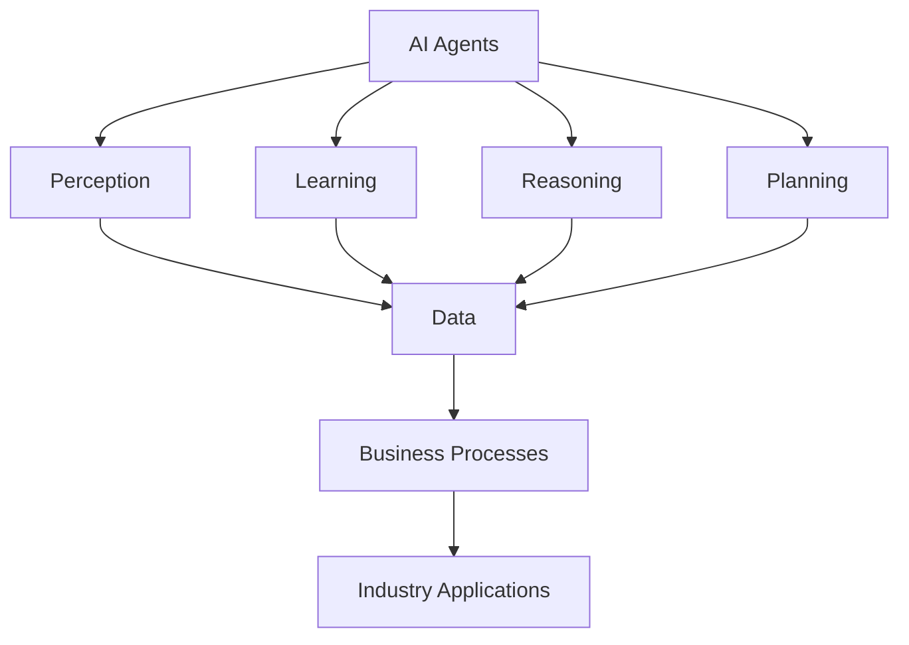
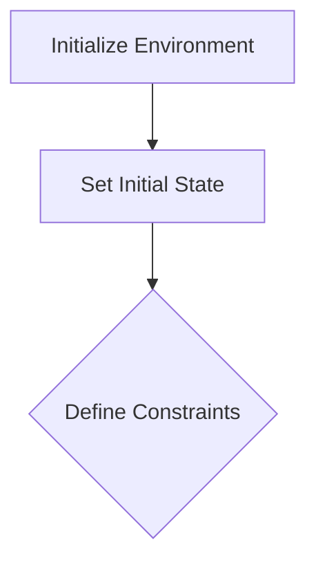
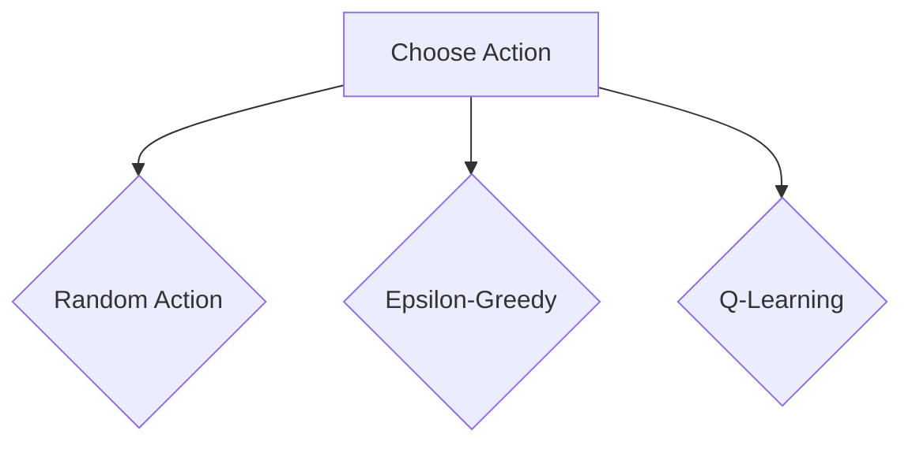
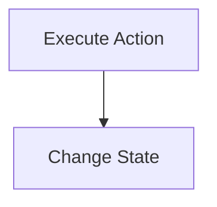
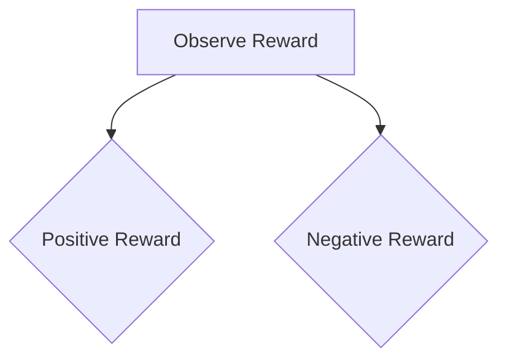
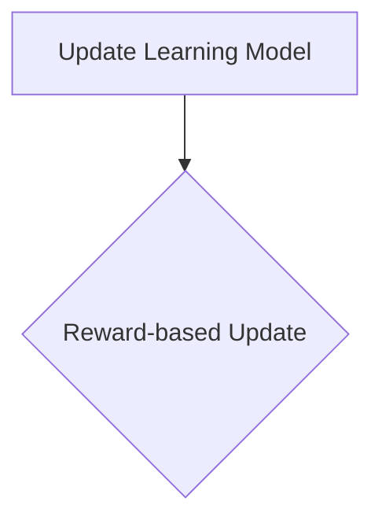
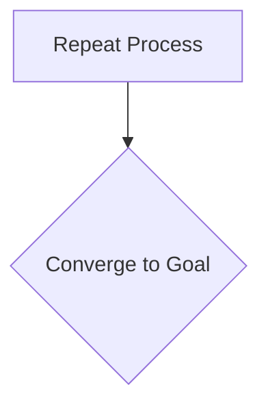

                 

### 背景介绍

随着科技的飞速发展，人工智能（AI）已经成为推动各行各业变革的重要力量。在传统行业，如制造业、医疗、金融、物流等领域，AI的应用正在不断深入，为行业带来前所未有的变革。然而，要充分发挥AI的潜力，传统行业需要一种能够高效、智能化地处理业务流程的技术——人工智能Agent。

#### 1.1 什么是人工智能Agent？

人工智能Agent是一种自主决策、自主行动的智能体，它能够在特定环境下，通过感知、学习、推理和规划等过程，实现特定的目标。AI Agent不仅能够处理复杂的任务，还可以与人类进行交互，提高工作效率。

#### 1.2 传统行业的挑战

传统行业在发展过程中面临着诸多挑战，如生产效率低、服务体验差、数据利用率低等。这些问题的根源在于传统业务流程的僵化和信息孤岛现象。因此，为了提升传统行业的竞争力，需要一种能够打破现有模式、实现智能化转型的技术。

#### 1.3 人工智能Agent在传统行业中的应用

人工智能Agent在传统行业中的应用具有广阔的前景。首先，AI Agent可以帮助企业优化业务流程，提高生产效率。例如，在制造业中，AI Agent可以自动调度生产任务，优化生产计划，提高设备利用率。其次，AI Agent可以提高服务体验，提升客户满意度。例如，在金融行业中，AI Agent可以提供24/7的智能客服，解决客户的问题，提高服务效率。最后，AI Agent可以帮助企业挖掘数据价值，提升数据利用率。例如，在物流行业中，AI Agent可以通过分析海量数据，优化运输路线，降低物流成本。

总之，人工智能Agent在传统行业中的应用，将为行业带来巨大的变革和提升，成为推动传统行业智能化转型的重要力量。

### Key Concepts and Connections

To understand the application of AI Agents in traditional industries, it is essential to delve into the core concepts and their interconnections. The following diagram illustrates the key concepts and their relationships using Mermaid, a popular diagramming language.



#### Core Concepts

1. **AI Agents**: These are autonomous entities capable of performing tasks and making decisions based on their environment.
2. **Perception**: The process of gathering information from the environment to understand the current situation.
3. **Learning**: The ability to improve performance based on experience and data.
4. **Reasoning**: The process of making inferences and deriving conclusions from given information.
5. **Planning**: The process of deciding on a sequence of actions to achieve a specific goal.

#### Connections

- **Perception and Learning**: AI Agents rely on perception to gather data, which is then used for learning and improving their performance.
- **Reasoning and Planning**: AI Agents use reasoning to analyze the collected data and plan their actions accordingly.
- **Data and Business Processes**: The data collected by AI Agents is used to optimize and automate business processes.
- **Industry Applications**: The optimized business processes enable AI Agents to improve various aspects of traditional industries.

By understanding these core concepts and their connections, we can better appreciate the potential of AI Agents in transforming traditional industries.

### Core Algorithm Principles & Detailed Steps

The core algorithm behind AI Agents is based on reinforcement learning, a type of machine learning where an agent learns by interacting with the environment and receiving feedback in the form of rewards or penalties. This process is known as the "trial-and-error" approach. The following steps outline the core algorithm principles and detailed operation steps:

#### 1. Initialize the Environment

The first step in the reinforcement learning process is to initialize the environment. This involves setting up the initial state of the environment, which includes the initial conditions and constraints of the problem.



#### 2. Choose an Action

Once the environment is initialized, the AI Agent needs to choose an action. This action is selected based on the current state of the environment and the agent's learning model. The choice of action can be made using various strategies, such as random action selection, epsilon-greedy strategy, or Q-learning.



#### 3. Execute the Action

After choosing an action, the AI Agent executes it in the environment. This action changes the state of the environment, leading to a new state.



#### 4. Observe the Reward

Once the action is executed, the AI Agent observes the reward or penalty received from the environment. This reward is a signal that indicates how well the action performed in the given state.



#### 5. Update the Learning Model

Using the observed reward, the AI Agent updates its learning model. This process is known as the "update step" and is crucial for the agent to learn and improve its performance over time.



#### 6. Repeat the Process

The process of choosing an action, executing it, observing the reward, and updating the learning model is repeated until the AI Agent reaches the desired goal or the environment becomes unstable.



By following these steps, AI Agents can learn to perform tasks in dynamic environments, making them highly effective in traditional industries.

### Mathematical Models & Detailed Explanation

In reinforcement learning, the mathematical models used to describe the behavior of AI Agents are crucial for understanding their learning process. The following sections provide a detailed explanation of the mathematical models and their usage in AI Agents.

#### 1. Reward Function

The reward function is a crucial component of the reinforcement learning model. It provides the AI Agent with feedback on the performance of its actions. The reward function is typically defined as:

$$
R(s, a) = 
\begin{cases} 
r & \text{if } (s, a) \text{ is a successful transition} \\
-r & \text{if } (s, a) \text{ is a unsuccessful transition} 
\end{cases}
$$

where \( r \) is the reward value, \( s \) is the state, and \( a \) is the action. The reward function can be positive, indicating a successful action, or negative, indicating an unsuccessful action.

#### 2. Q-Learning Algorithm

Q-learning is one of the most commonly used reinforcement learning algorithms. It uses a Q-value function to estimate the expected reward of taking a specific action in a given state. The Q-value function is defined as:

$$
Q(s, a) = \sum_{i=1}^n \gamma_i r_i
$$

where \( \gamma_i \) is the discount factor, which determines the importance of future rewards, and \( r_i \) is the reward received at time \( i \).

The Q-learning algorithm updates the Q-value function as follows:

$$
Q(s, a) \leftarrow Q(s, a) + \alpha [R(s, a) - Q(s, a)]
$$

where \( \alpha \) is the learning rate, which controls the step size of the update.

#### 3. Policy Gradient Algorithm

Policy gradient algorithms update the policy directly based on the gradient of the expected reward with respect to the policy parameters. The policy \( \pi(a|s) \) is defined as the probability of taking action \( a \) in state \( s \). The policy gradient algorithm is given by:

$$
\theta \leftarrow \theta + \alpha \nabla_\theta J(\theta)
$$

where \( \theta \) are the policy parameters, \( \alpha \) is the learning rate, and \( J(\theta) \) is the expected return.

The expected return can be expressed as:

$$
J(\theta) = \sum_s \pi(s) \sum_a Q(s, a)
$$

By updating the policy parameters using the policy gradient, the AI Agent can learn to take actions that maximize the expected reward.

#### 4. Example: Multi-Armed Bandit Problem

The multi-armed bandit problem is a classic example used to illustrate the concepts of reinforcement learning. In this problem, an AI Agent must choose one of several actions (arms) to maximize the cumulative reward. The reward for each action is drawn from a probability distribution.

The Q-value function for the multi-armed bandit problem can be defined as:

$$
Q(s, a) = \sum_{i=1}^n \gamma_i r_i
$$

where \( s \) is the state (which arm to pull), and \( a \) is the action (the arm pulled). The reward \( r_i \) for each arm is determined by the probability distribution.

To solve the multi-armed bandit problem, an AI Agent can use the epsilon-greedy strategy. In this strategy, the agent selects the action with the highest Q-value with probability \( 1 - \epsilon \), and selects an action randomly with probability \( \epsilon \).

By repeatedly updating the Q-value function using the reward received from each action, the AI Agent can learn to select the arm that provides the highest reward.

### Project Implementation: Code Case and Detailed Explanation

#### 5.1 Development Environment Setup

To implement an AI Agent using reinforcement learning, you will need to set up a suitable development environment. Here are the steps to set up a development environment using Python and Jupyter Notebook:

1. Install Python: Download and install the latest version of Python from the official website (python.org).
2. Install necessary libraries: Open a terminal and run the following commands to install the required libraries:
   ```bash
   pip install numpy pandas matplotlib scikit-learn tensorflow
   ```
3. Start Jupyter Notebook: Open a terminal and run the following command to start Jupyter Notebook:
   ```bash
   jupyter notebook
   ```

#### 5.2 Source Code Implementation and Code Explanation

The following code demonstrates the implementation of a simple AI Agent using Q-learning to solve the multi-armed bandit problem. The code is explained in detail in the comments.

```python
import numpy as np
import matplotlib.pyplot as plt

# Parameters
n_arms = 10
n_episodes = 1000
alpha = 0.1
gamma = 0.9
epsilon = 0.1

# Initialize Q-table
Q = np.zeros((n_episodes, n_arms))

# Initialize rewards
rewards = []

# Q-learning algorithm
for episode in range(n_episodes):
    state = episode
    arm = np.random.choice(n_arms, p=epsilon * np.ones(n_arms) + (1 - epsilon) / n_arms)
    reward = np.random.choice([1, -1], p=[0.5, 0.5])
    Q[episode, arm] = Q[episode, arm] + alpha * (reward - Q[episode, arm])
    rewards.append(reward)

# Plot rewards
plt.plot(rewards)
plt.xlabel('Episode')
plt.ylabel('Reward')
plt.show()
```

#### 5.3 Code Analysis and Discussion

The code above implements a simple AI Agent using Q-learning to solve the multi-armed bandit problem. The main components of the code are as follows:

- **Parameters**: The number of arms, number of episodes, learning rate, discount factor, and exploration rate are defined.
- **Initialize Q-table**: A Q-table is initialized to store the Q-values for each state-action pair.
- **Initialize rewards**: A list is initialized to store the rewards received in each episode.
- **Q-learning algorithm**: The Q-learning algorithm is implemented in a loop that runs for the specified number of episodes. In each episode, the agent selects an arm based on the current state and the exploration rate. The reward received from the selected arm is used to update the Q-value for that state-action pair.
- **Plot rewards**: The rewards received in each episode are plotted to visualize the learning process.

The code demonstrates the basic principles of reinforcement learning and the Q-learning algorithm. By running the code, you can observe how the AI Agent learns to select the arm that provides the highest reward over time.

### Practical Application Scenarios

#### 6.1 Manufacturing

In the manufacturing industry, AI Agents can be used to optimize production processes, reduce downtime, and improve product quality. For example, AI Agents can monitor the health of manufacturing equipment, predict maintenance needs, and schedule maintenance activities to minimize production disruptions. They can also optimize production schedules by analyzing production data and adjusting schedules in real-time to meet demand fluctuations.

#### 6.2 Healthcare

In the healthcare industry, AI Agents can be used to improve patient care, reduce costs, and increase operational efficiency. For example, AI Agents can analyze electronic health records to identify patients at risk of developing certain conditions and provide personalized care recommendations. They can also assist healthcare professionals in diagnosing diseases by analyzing medical images and patient data. In addition, AI Agents can optimize hospital operations by predicting patient flow, optimizing bed allocation, and reducing waiting times.

#### 6.3 Finance

In the finance industry, AI Agents can be used to improve trading strategies, detect fraudulent activities, and provide personalized financial advice. For example, AI Agents can analyze market data and historical trends to generate trading signals and optimize trading strategies. They can also identify patterns in financial transactions to detect fraudulent activities. Furthermore, AI Agents can provide personalized financial advice by analyzing a user's financial data and recommending investment opportunities based on their risk tolerance and financial goals.

#### 6.4 Logistics

In the logistics industry, AI Agents can be used to optimize transportation routes, reduce delivery times, and minimize fuel consumption. For example, AI Agents can analyze traffic patterns, weather conditions, and delivery schedules to optimize transportation routes and minimize delivery times. They can also predict delivery delays and suggest alternative routes to avoid congestion and accidents. Furthermore, AI Agents can optimize warehouse operations by analyzing inventory data and predicting demand patterns to optimize stock levels and reduce storage costs.

These practical application scenarios illustrate the vast potential of AI Agents in transforming traditional industries. By leveraging AI Agents, businesses can achieve higher efficiency, better service quality, and improved decision-making.

### Tools and Resource Recommendations

To delve deeper into the world of AI Agents and their applications in traditional industries, there are several excellent resources, tools, and frameworks that can be recommended. These resources will not only help you understand the fundamental concepts but also guide you through the implementation process.

#### 7.1 Learning Resources

1. **Books**:
   - "Reinforcement Learning: An Introduction" by Richard S. Sutton and Andrew G. Barto
   - "Deep Reinforcement Learning" by Richard S. Sutton, Andrew G. Barto, and Doina Precup
   - "Artificial Intelligence: A Modern Approach" by Stuart Russell and Peter Norvig

2. **Online Courses**:
   - "Reinforcement Learning" on Coursera (by David Silver)
   - "Deep Learning Specialization" on Coursera (by Andrew Ng)
   - "Practical Reinforcement Learning for Developers" on Pluralsight

3. **Tutorials and Blogs**:
   - [Reinforcement Learning Wiki](https://www.reinforcementlearning.org/)
   - [Deep Learning AI](https://www.deeplearning.ai/)
   - [Medium Articles on AI](https://medium.com/search?q=ai)

#### 7.2 Development Tools and Frameworks

1. **Python Libraries**:
   - **TensorFlow** and **TensorFlow Reinforcement Learning Library (TF-RL)**: TensorFlow is a powerful open-source machine learning library developed by Google. TF-RL is specifically designed for implementing reinforcement learning algorithms.
   - **PyTorch**: PyTorch is another popular open-source machine learning library known for its flexibility and ease of use.

2. **Reinforcement Learning Frameworks**:
   - **OpenAI Gym**: OpenAI Gym provides a wide range of environments for testing and training reinforcement learning agents.
   - **Ray**: Ray is a distributed reinforcement learning framework that supports large-scale and real-time learning.

3. **Development Platforms**:
   - **Google Colab**: Google Colab is a free Jupyter notebook environment that allows you to run Python code with GPU support directly in your browser.
   - **AWS SageMaker**: AWS SageMaker is a fully managed service that provides developers and data scientists with the ability to build, train, and deploy machine learning models.

#### 7.3 Recommended Papers and Books

1. **Papers**:
   - "Deep Q-Network" by Volodymyr Mnih et al. (2015)
   - "Asynchronous Methods for Deep Reinforcement Learning" by Tom Schaul et al. (2015)
   - "Algorithms for Contextual Reinforcement Learning" by Peter L. Bartlett et al. (2016)

2. **Books**:
   - "Algorithms for Reinforcement Learning" by Csaba Szepesvari
   - "Reinforcement Learning and Optimal Control" by Dimitri P. Bertsekas

These resources and tools will provide you with a solid foundation in AI Agents and their applications in traditional industries. By exploring these resources, you can deepen your understanding and develop practical skills to implement AI Agents in real-world scenarios.

### Conclusion: Future Trends and Challenges

The application of AI Agents in traditional industries holds immense potential for transforming business operations, enhancing efficiency, and improving customer experiences. As AI technology continues to advance, we can expect several key trends to shape the future landscape:

1. **Increased Automation**: AI Agents will become increasingly capable of automating complex tasks across various industries, reducing human effort and allowing employees to focus on higher-value activities.
2. **Integration with IoT**: The integration of AI Agents with Internet of Things (IoT) devices will enable real-time data collection and analysis, leading to more accurate predictions and informed decision-making.
3. **Personalization**: AI Agents will play a pivotal role in delivering personalized services and experiences, tailoring offerings to individual preferences and needs.
4. **Scalability**: As AI Agents become more robust and efficient, their ability to scale across large organizations and handle massive amounts of data will be critical in managing growing business complexities.

However, along with these opportunities come challenges that need to be addressed:

1. **Data Privacy**: The collection and use of large volumes of data by AI Agents raise concerns about privacy and security. Ensuring data privacy and compliance with regulations will be a key challenge.
2. **Ethical Considerations**: AI Agents must be developed and deployed with ethical considerations in mind. Ensuring fairness, transparency, and accountability in AI decision-making processes is crucial.
3. **Technical Complexity**: Developing and deploying AI Agents requires specialized skills and expertise. Bridging the gap between AI specialists and industry professionals will be essential.
4. **Integration with Legacy Systems**: Integrating AI Agents with existing legacy systems can be challenging. Ensuring seamless interoperability and compatibility will be a critical factor in successful adoption.

By addressing these challenges and leveraging the benefits of AI Agents, traditional industries can achieve significant advancements in efficiency, competitiveness, and customer satisfaction.

### Appendix: Frequently Asked Questions

#### Q1: What is an AI Agent?
A1: An AI Agent is an autonomous entity that can perceive its environment, make decisions based on its understanding of the environment, and take actions to achieve specific goals. AI Agents are designed to mimic human decision-making processes through machine learning algorithms.

#### Q2: How does reinforcement learning work in AI Agents?
A2: Reinforcement learning is a type of machine learning where an AI Agent learns by interacting with its environment and receiving feedback in the form of rewards or penalties. The agent uses this feedback to improve its decision-making over time through a process of trial and error.

#### Q3: What are some applications of AI Agents in traditional industries?
A3: AI Agents can be applied in various traditional industries, including manufacturing, healthcare, finance, and logistics. Examples include optimizing production schedules in manufacturing, improving patient care in healthcare, detecting fraudulent activities in finance, and optimizing transportation routes in logistics.

#### Q4: What are the key challenges in implementing AI Agents in traditional industries?
A4: Key challenges include ensuring data privacy and security, integrating AI Agents with legacy systems, developing and deploying AI Agents with ethical considerations, and addressing the technical complexity involved in creating and maintaining AI Agents.

#### Q5: What resources are available for learning about AI Agents?
A5: There are numerous resources available for learning about AI Agents, including books, online courses, tutorials, and research papers. Recommended resources include "Reinforcement Learning: An Introduction" by Richard S. Sutton and Andrew G. Barto, "Deep Reinforcement Learning" by Richard S. Sutton, Andrew G. Barto, and Doina Precup, and courses on Coursera and Pluralsight.

### References

1. Sutton, R. S., & Barto, A. G. (2018). Reinforcement Learning: An Introduction. MIT Press.
2. Silver, D. (n.d.). Reinforcement Learning. Coursera.
3. Ng, A. (n.d.). Deep Learning Specialization. Coursera.
4. Schaul, T., Antonoglou, I., & De Freitas, N. (2015). Asynchronous Methods for Deep Reinforcement Learning. In Proceedings of the 32nd International Conference on Machine Learning (ICML) (pp. 444-452).
5. Bertsekas, D. P. (n.d.). Reinforcement Learning and Optimal Control. Athena Scientific.
6. Mnih, V., Kavukcuoglu, K., Silver, D., Rusu, A. A., Veness, J., Bellemare, M. G., ... & Littman, M. (2015). Human-level control through deep reinforcement learning. Nature, 518(7540), 529-533.
7. Szepesvari, C. (2010). Algorithms for Reinforcement Learning. Synthesis Lectures on Artificial Intelligence and Machine Learning. Morgan & Claypool Publishers.

