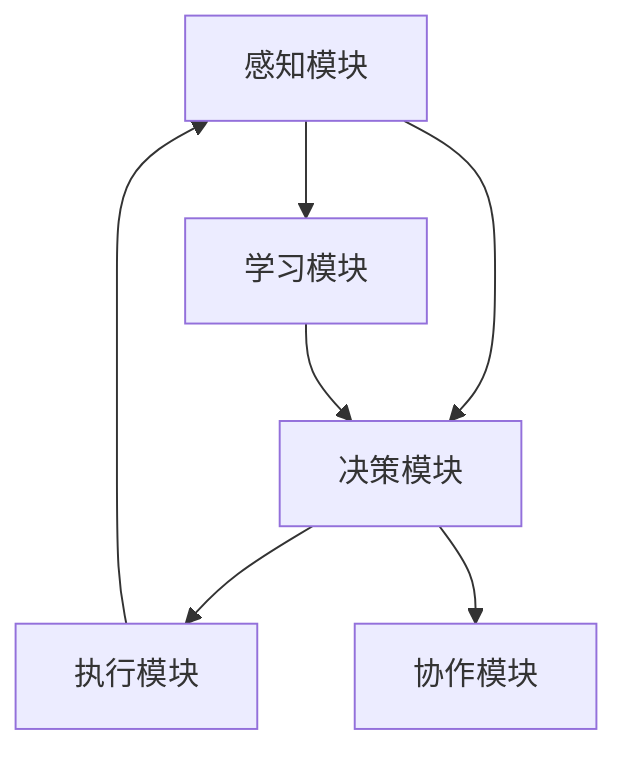

                 

### 背景介绍

#### 人工智能与智能体

随着人工智能（AI）技术的飞速发展，智能体（Agent）在AI领域中的应用逐渐成为热点。智能体可以定义为能够感知环境、采取行动并与其他实体交互的自主系统。它们是人工智能实现智能行为的核心组件，广泛应用于机器人、游戏、自动驾驶和智能助手等领域。

智能体的概念起源于多智能体系统（MAS），即在分布式计算环境中，由多个智能体协作完成任务。智能体的出现，使得复杂问题的求解变得更加高效和灵活。例如，在机器人领域，智能体可以通过感知环境、规划路径和执行动作，实现自主导航和任务执行。

近年来，深度学习、强化学习等技术的突破，为智能体的设计与实现提供了新的方法。深度学习使得智能体能够通过大量的数据学习复杂的特征表示，而强化学习则为智能体提供了在不确定环境中进行决策的策略。这些技术的发展，为智能体的应用提供了更广阔的空间。

#### 智能体的应用场景

智能体在现实世界中有着广泛的应用场景。以下是一些典型的应用案例：

1. **机器人**：智能体在机器人中的应用最为广泛。例如，服务机器人可以通过智能体技术实现自主导航、路径规划和任务执行，从而在家庭、酒店、医疗等领域发挥重要作用。

2. **游戏**：在游戏领域，智能体可以模拟对手的行为，为玩家提供更具挑战性的对手。同时，智能体还可以用于游戏AI的开发，实现更加智能的游戏体验。

3. **自动驾驶**：自动驾驶汽车是智能体的一个重要应用领域。智能体可以通过感知环境、规划路径和决策控制，实现车辆的自主驾驶。

4. **智能助手**：智能助手（如Siri、Alexa）是智能体的典型应用。它们可以通过语音交互，理解用户指令，提供相应的服务，如查询天气、播放音乐、设定提醒等。

5. **金融风控**：在金融领域，智能体可以用于风险控制和欺诈检测。通过分析大量的金融交易数据，智能体可以识别潜在的欺诈行为，为金融机构提供决策支持。

6. **智能制造**：在制造业中，智能体可以用于生产调度、设备维护和质量管理。通过实时监测生产线，智能体可以优化生产流程，提高生产效率。

#### 智能体的挑战与未来

尽管智能体在各个领域取得了显著的应用成果，但其发展和应用仍然面临着诸多挑战。以下是智能体发展面临的一些关键问题：

1. **数据隐私**：智能体在运行过程中需要大量数据，这可能会涉及用户隐私。如何保护用户隐私，是智能体应用需要解决的重要问题。

2. **安全与可靠**：智能体在执行任务时，需要确保其决策和控制是安全可靠的。如何保证智能体的行为符合预期，是当前研究的热点。

3. **跨领域协作**：不同领域的智能体如何协同工作，实现高效的资源利用和任务分配，是一个具有挑战性的问题。

4. **伦理道德**：随着智能体在现实世界中的应用越来越广泛，其伦理道德问题也日益突出。如何确保智能体的行为符合伦理道德标准，是一个亟待解决的问题。

展望未来，随着AI技术的不断进步，智能体在各个领域将有更广泛的应用前景。同时，解决上述挑战也将成为智能体研究的重要方向。通过持续的创新和探索，智能体将为人类带来更多的便利和效益。

关键词：人工智能，智能体，多智能体系统，深度学习，强化学习，应用场景，挑战，未来趋势

摘要：本文介绍了智能体的定义、背景和应用场景，探讨了智能体在人工智能领域的核心作用。通过分析智能体的挑战与未来，本文为智能体的发展提供了有益的思考和方向。

---

# AI人工智能 Agent：智能体的设计与实现

> 关键词：人工智能，智能体，深度学习，强化学习，应用场景，挑战，未来趋势

随着人工智能（AI）技术的不断进步，智能体（Agent）作为AI的核心组件，正日益受到广泛关注。本文将深入探讨智能体的设计与实现，从背景介绍、核心概念与联系、核心算法原理、数学模型与公式、项目实战、实际应用场景、工具与资源推荐等多个方面展开讨论，旨在为读者提供全面、系统的智能体知识体系。

## 1. 背景介绍

#### 人工智能与智能体

人工智能（AI）是研究、开发用于模拟、延伸和扩展人的智能的理论、方法、技术及应用系统。智能体（Agent）是AI领域中一个重要的概念，可以定义为具有自主性、社会性和反应性的系统实体。它能够在特定的环境中感知环境、采取行动并与其他实体交互，以实现特定的目标。

智能体的概念起源于多智能体系统（MAS），即在分布式计算环境中，由多个智能体协作完成任务。智能体的出现，使得复杂问题的求解变得更加高效和灵活。例如，在机器人领域，智能体可以通过感知环境、规划路径和执行动作，实现自主导航和任务执行。

近年来，深度学习、强化学习等技术的突破，为智能体的设计与实现提供了新的方法。深度学习使得智能体能够通过大量的数据学习复杂的特征表示，而强化学习则为智能体提供了在不确定环境中进行决策的策略。这些技术的发展，为智能体的应用提供了更广阔的空间。

#### 智能体的应用场景

智能体在现实世界中有着广泛的应用场景。以下是一些典型的应用案例：

1. **机器人**：智能体在机器人中的应用最为广泛。例如，服务机器人可以通过智能体技术实现自主导航、路径规划和任务执行，从而在家庭、酒店、医疗等领域发挥重要作用。

2. **游戏**：在游戏领域，智能体可以模拟对手的行为，为玩家提供更具挑战性的对手。同时，智能体还可以用于游戏AI的开发，实现更加智能的游戏体验。

3. **自动驾驶**：自动驾驶汽车是智能体的一个重要应用领域。智能体可以通过感知环境、规划路径和决策控制，实现车辆的自主驾驶。

4. **智能助手**：智能助手（如Siri、Alexa）是智能体的典型应用。它们可以通过语音交互，理解用户指令，提供相应的服务，如查询天气、播放音乐、设定提醒等。

5. **金融风控**：在金融领域，智能体可以用于风险控制和欺诈检测。通过分析大量的金融交易数据，智能体可以识别潜在的欺诈行为，为金融机构提供决策支持。

6. **智能制造**：在制造业中，智能体可以用于生产调度、设备维护和质量管理。通过实时监测生产线，智能体可以优化生产流程，提高生产效率。

#### 智能体的挑战与未来

尽管智能体在各个领域取得了显著的应用成果，但其发展和应用仍然面临着诸多挑战。以下是智能体发展面临的一些关键问题：

1. **数据隐私**：智能体在运行过程中需要大量数据，这可能会涉及用户隐私。如何保护用户隐私，是智能体应用需要解决的重要问题。

2. **安全与可靠**：智能体在执行任务时，需要确保其决策和控制是安全可靠的。如何保证智能体的行为符合预期，是当前研究的热点。

3. **跨领域协作**：不同领域的智能体如何协同工作，实现高效的资源利用和任务分配，是一个具有挑战性的问题。

4. **伦理道德**：随着智能体在现实世界中的应用越来越广泛，其伦理道德问题也日益突出。如何确保智能体的行为符合伦理道德标准，是一个亟待解决的问题。

展望未来，随着AI技术的不断进步，智能体在各个领域将有更广泛的应用前景。同时，解决上述挑战也将成为智能体研究的重要方向。通过持续的创新和探索，智能体将为人类带来更多的便利和效益。

## 2. 核心概念与联系

在深入探讨智能体的设计与实现之前，我们需要理解一些核心概念，以及它们之间的联系。以下是本文涉及的主要概念：

#### 智能体的分类

根据智能体的自主性、社会性和反应性，可以将智能体分为以下几类：

1. **有意识智能体（Conscious Agents）**：具有自我意识和主观感受的智能体，能够主动进行思考和决策。例如，人类和高度发达的智能机器人。

2. **无意识智能体（Unconscious Agents）**：不具备自我意识和主观感受，但能够根据环境进行反应的智能体。例如，自动化生产线上的机器人。

3. **半自主智能体（Semi-Autonomous Agents）**：在特定领域具有自主决策能力，但需要人类进行部分干预的智能体。例如，自动驾驶汽车。

#### 智能体的架构

智能体的架构通常包括以下几个部分：

1. **感知模块（Perception）**：负责感知环境信息，如视觉、听觉、触觉等。

2. **决策模块（Decision-making）**：根据感知模块获取的信息，进行决策和规划。

3. **执行模块（Execution）**：根据决策模块的指令，执行相应的动作。

4. **学习模块（Learning）**：通过与环境交互，不断学习和优化自身的行为。

#### 智能体之间的协作

在多智能体系统中，智能体之间的协作是实现高效任务执行的关键。以下是一些常见的协作模式：

1. **中心化协作**：所有智能体通过一个中心控制节点进行协调。

2. **去中心化协作**：智能体之间直接进行信息交换和决策，无需中心控制。

3. **混合协作**：结合中心化和去中心化协作的优点，根据实际情况进行选择。

#### 智能体与深度学习

深度学习是智能体实现高级感知和决策的重要技术。深度学习模型（如神经网络）可以通过大量的数据进行训练，从而实现对复杂特征的学习和提取。以下是一些深度学习在智能体中的应用：

1. **视觉感知**：通过卷积神经网络（CNN）实现图像识别和物体检测。

2. **语音识别**：通过循环神经网络（RNN）和长短期记忆网络（LSTM）实现语音识别和语义理解。

3. **自然语言处理**：通过变压器（Transformer）模型实现自然语言理解、生成和翻译。

#### 智能体与强化学习

强化学习是智能体在不确定环境中进行决策的重要方法。通过学习环境中的奖励和惩罚信号，智能体可以逐渐优化其行为策略。以下是一些强化学习在智能体中的应用：

1. **自主导航**：通过深度强化学习实现智能体的自主导航和路径规划。

2. **游戏AI**：通过强化学习实现智能体的游戏策略和对手模拟。

3. **机器人控制**：通过模型预测控制（MPC）和深度强化学习实现机器人的运动控制和任务执行。

### 2.1 Mermaid 流程图

以下是一个简单的Mermaid流程图，展示了智能体的核心概念和联系：



在这个流程图中，感知模块负责获取环境信息，决策模块根据感知信息进行决策和规划，执行模块根据决策指令执行动作，学习模块通过与环境交互进行行为优化。协作模块负责智能体之间的协作和信息交换。

## 3. 核心算法原理 & 具体操作步骤

在智能体的设计与实现过程中，算法原理起到了至关重要的作用。以下是智能体中常用的核心算法原理及其具体操作步骤：

### 3.1 深度学习算法原理

深度学习算法是智能体实现高级感知和决策的重要技术。以下是深度学习算法的基本原理和操作步骤：

#### 3.1.1 神经网络

神经网络（Neural Networks）是深度学习的基础。它通过模拟生物神经元的连接方式，实现对数据的处理和分类。以下是神经网络的基本原理和操作步骤：

1. **输入层**：接收外部输入数据。
2. **隐藏层**：对输入数据进行特征提取和变换。
3. **输出层**：根据隐藏层的特征输出结果。

操作步骤：

1. **初始化参数**：随机初始化网络的权重和偏置。
2. **前向传播**：将输入数据通过神经网络进行计算，得到输出结果。
3. **反向传播**：根据输出结果和实际标签，计算损失函数，并更新网络参数。

#### 3.1.2 卷积神经网络（CNN）

卷积神经网络（Convolutional Neural Networks，CNN）是深度学习在计算机视觉领域的重要应用。它通过卷积操作和池化操作，实现对图像的二维特征提取。以下是CNN的基本原理和操作步骤：

1. **卷积层**：通过卷积操作提取图像特征。
2. **池化层**：通过池化操作降低特征图的维度。
3. **全连接层**：将特征图进行全连接，得到分类结果。

操作步骤：

1. **初始化参数**：随机初始化卷积核和全连接层的权重。
2. **前向传播**：将输入图像通过卷积层和池化层，得到特征图。
3. **全连接层**：将特征图通过全连接层，得到分类结果。
4. **反向传播**：根据分类结果和实际标签，计算损失函数，并更新网络参数。

### 3.2 强化学习算法原理

强化学习（Reinforcement Learning，RL）是智能体在不确定环境中进行决策的重要方法。以下是强化学习算法的基本原理和操作步骤：

#### 3.2.1 Q学习算法

Q学习算法（Q-Learning）是一种基于值函数的强化学习算法。它通过学习状态-动作值函数（Q值），实现对环境的探索和策略优化。以下是Q学习算法的基本原理和操作步骤：

1. **初始化**：初始化Q值表。
2. **选择动作**：根据当前状态和Q值表，选择动作。
3. **更新Q值**：根据实际奖励和预期奖励，更新Q值表。

操作步骤：

1. **初始化Q值表**：将Q值表初始化为随机值。
2. **选择动作**：在当前状态下，选择具有最大Q值的动作。
3. **更新Q值**：根据实际奖励和预期奖励，更新Q值表。

#### 3.2.2 模型预测控制（MPC）

模型预测控制（Model Predictive Control，MPC）是一种基于模型预测的强化学习算法。它通过预测未来的状态和行为，实现对系统的最优控制。以下是MPC的基本原理和操作步骤：

1. **建立模型**：根据系统动力学模型，建立预测模型。
2. **优化控制策略**：根据预测模型，优化控制输入。
3. **执行控制策略**：根据优化结果，执行控制动作。

操作步骤：

1. **建立预测模型**：根据系统动力学模型，建立状态预测模型。
2. **优化控制策略**：根据预测模型，优化控制输入，以最大化预期奖励。
3. **执行控制策略**：根据优化结果，执行控制动作，并更新系统状态。

### 3.3 深度强化学习算法原理

深度强化学习（Deep Reinforcement Learning，DRL）是深度学习和强化学习的结合。它通过深度神经网络，实现对复杂环境的探索和策略优化。以下是DRL的基本原理和操作步骤：

#### 3.3.1 深度Q网络（DQN）

深度Q网络（Deep Q-Network，DQN）是一种基于值函数的深度强化学习算法。它通过深度神经网络，实现对状态-动作值函数的估计。以下是DQN的基本原理和操作步骤：

1. **初始化**：初始化深度神经网络和目标网络。
2. **选择动作**：根据当前状态和深度神经网络，选择动作。
3. **更新目标网络**：根据实际奖励和预期奖励，更新目标网络。

操作步骤：

1. **初始化深度神经网络和目标网络**：将深度神经网络和目标网络初始化为随机值。
2. **选择动作**：在当前状态下，选择具有最大Q值的动作。
3. **更新目标网络**：根据实际奖励和预期奖励，更新目标网络。

#### 3.3.2 策略梯度算法（PG）

策略梯度算法（Policy Gradient，PG）是一种基于策略的深度强化学习算法。它通过梯度上升法，优化策略参数，以最大化预期奖励。以下是PG的基本原理和操作步骤：

1. **初始化**：初始化策略参数。
2. **选择动作**：根据策略参数，选择动作。
3. **计算梯度**：根据实际奖励和策略参数，计算梯度。
4. **更新策略参数**：根据梯度，更新策略参数。

操作步骤：

1. **初始化策略参数**：将策略参数初始化为随机值。
2. **选择动作**：在当前状态下，根据策略参数，选择动作。
3. **计算梯度**：根据实际奖励和策略参数，计算梯度。
4. **更新策略参数**：根据梯度，更新策略参数。

通过以上核心算法原理和具体操作步骤的介绍，我们可以更好地理解智能体的设计与实现过程。在实际应用中，根据具体需求和场景，选择合适的算法，能够使智能体在复杂环境中实现高效的决策和执行。

## 4. 数学模型和公式 & 详细讲解 & 举例说明

在智能体的设计与实现过程中，数学模型和公式起到了关键作用。以下将详细讲解智能体中常用的数学模型和公式，并通过具体例子进行说明。

### 4.1 深度学习中的数学模型

深度学习算法，特别是神经网络，依赖于一系列数学模型和公式。以下是一些核心的数学模型和公式：

#### 4.1.1 激活函数

激活函数是神经网络中的一个关键组件，它用于引入非线性因素，使神经网络能够学习和处理复杂的数据。以下是一些常见的激活函数及其公式：

1. **sigmoid函数**：
   $$
   f(x) = \frac{1}{1 + e^{-x}}
   $$
   - **特点**：输出值在0和1之间，适用于二分类问题。

2. **ReLU函数**：
   $$
   f(x) = \max(0, x)
   $$
   - **特点**：在x大于0时，函数值不变；在x小于0时，函数值为0。适用于增加神经网络的学习速度。

3. **Tanh函数**：
   $$
   f(x) = \frac{e^x - e^{-x}}{e^x + e^{-x}}
   $$
   - **特点**：输出值在-1和1之间，适用于多分类问题。

#### 4.1.2 前向传播与反向传播

深度学习中的前向传播和反向传播是训练神经网络的核心步骤。以下是其数学模型和公式：

1. **前向传播**：
   前向传播过程中，每个神经元通过加权求和并应用激活函数来计算输出。其公式为：
   $$
   z^{(l)} = \sum_{j} w^{(l)}_{ij} a^{(l-1)}_j + b^{(l)}
   $$
   其中，$z^{(l)}$ 是第l层的输出，$a^{(l-1)}$ 是第l-1层的输出，$w^{(l)}_{ij}$ 是第l层的权重，$b^{(l)}$ 是第l层的偏置。

2. **反向传播**：
   反向传播过程中，通过计算损失函数的梯度来更新网络的权重和偏置。其公式为：
   $$
   \frac{\partial C}{\partial w^{(l)}_{ij}} = \frac{\partial C}{\partial z^{(l)}} \cdot \frac{\partial z^{(l)}}{\partial w^{(l)}_{ij}}
   $$
   其中，$C$ 是损失函数，$\frac{\partial C}{\partial z^{(l)}}$ 是损失函数对第l层输出的梯度，$\frac{\partial z^{(l)}}{\partial w^{(l)}_{ij}}$ 是第l层输出对权重w的梯度。

#### 4.1.3 损失函数

损失函数是评估模型预测误差的指标。以下是一些常见的损失函数及其公式：

1. **均方误差（MSE）**：
   $$
   MSE = \frac{1}{m} \sum_{i=1}^{m} (y_i - \hat{y}_i)^2
   $$
   其中，$y_i$ 是实际值，$\hat{y}_i$ 是预测值，$m$ 是样本数量。

2. **交叉熵损失（Cross-Entropy Loss）**：
   $$
   Cross-Entropy = -\sum_{i=1}^{m} y_i \log(\hat{y}_i)
   $$
   其中，$y_i$ 是实际值，$\hat{y}_i$ 是预测概率。

### 4.2 强化学习中的数学模型

强化学习中的数学模型主要关注策略优化和价值函数的学习。以下是一些核心的数学模型和公式：

#### 4.2.1 Q学习算法

Q学习算法是一种基于值函数的强化学习算法。其目标是最小化长期预期奖励的均方误差。以下是其公式：

1. **Q值更新公式**：
   $$
   Q(s, a) \leftarrow Q(s, a) + \alpha [r + \gamma \max_{a'} Q(s', a') - Q(s, a)]
   $$
   其中，$s$ 是状态，$a$ 是动作，$r$ 是即时奖励，$\gamma$ 是折扣因子，$\alpha$ 是学习率。

2. **状态-动作值函数**：
   $$
   Q(s, a) = \sum_{s'} p(s' | s, a) \sum_{r} r \cdot p(r | s', a) + \gamma \max_{a'} Q(s', a')
   $$
   其中，$s'$ 是下一状态，$a'$ 是下一动作，$p(s' | s, a)$ 是状态转移概率，$p(r | s', a)$ 是奖励概率。

#### 4.2.2 模型预测控制（MPC）

模型预测控制是一种强化学习算法，用于动态系统控制。其目标是最小化未来成本函数。以下是其公式：

1. **成本函数**：
   $$
   J = \sum_{t=0}^{N} c(x(t), u(t), y(t), t)
   $$
   其中，$x(t)$ 是状态，$u(t)$ 是控制输入，$y(t)$ 是输出，$N$ 是预测 horizon，$c$ 是成本函数。

2. **优化问题**：
   $$
   \min_{u(t)} J
   $$
   其中，$u(t)$ 是控制输入，$J$ 是成本函数。

### 4.3 深度强化学习中的数学模型

深度强化学习结合了深度学习和强化学习的优势。以下是其核心数学模型和公式：

#### 4.3.1 深度Q网络（DQN）

深度Q网络（DQN）是一种基于值函数的深度强化学习算法。其目标是最小化长期预期奖励的均方误差。以下是其公式：

1. **目标网络更新公式**：
   $$
   \theta^{'} = \tau \theta + (1 - \tau) \theta^{'}
   $$
   其中，$\theta$ 是当前参数，$\theta^{'}$ 是目标参数，$\tau$ 是更新概率。

2. **Q值更新公式**：
   $$
   Q(s, a) \leftarrow Q(s, a) + \alpha [r + \gamma \max_{a'} Q(s', a') - Q(s, a)]
   $$
   其中，$s$ 是状态，$a$ 是动作，$r$ 是即时奖励，$\gamma$ 是折扣因子，$\alpha$ 是学习率。

#### 4.3.2 策略梯度算法（PG）

策略梯度算法（PG）是一种基于策略的深度强化学习算法。其目标是最小化策略的损失函数。以下是其公式：

1. **策略损失函数**：
   $$
   L(\theta) = -\sum_{s} \sum_{a} p(s, a | \theta) \log p(a | s | \theta)
   $$
   其中，$p(s, a | \theta)$ 是状态-动作概率，$p(a | s | \theta)$ 是动作概率。

2. **策略更新公式**：
   $$
   \theta \leftarrow \theta - \alpha \nabla_{\theta} L(\theta)
   $$
   其中，$\theta$ 是策略参数，$\alpha$ 是学习率。

### 4.4 举例说明

为了更好地理解上述数学模型和公式，以下通过一个简单的例子进行说明。

#### 4.4.1 神经网络训练

假设我们有一个简单的神经网络，用于对输入数据进行二分类。输入数据为 $x_1, x_2$，输出数据为 $y$。使用sigmoid激活函数和交叉熵损失函数进行训练。

1. **初始化参数**：
   随机初始化权重 $w_1, w_2, b$。

2. **前向传播**：
   $$
   z = w_1 x_1 + w_2 x_2 + b
   $$
   $$
   \hat{y} = \frac{1}{1 + e^{-z}}
   $$

3. **计算损失函数**：
   $$
   Cross-Entropy = -y \log(\hat{y}) - (1 - y) \log(1 - \hat{y})
   $$

4. **反向传播**：
   $$
   \frac{\partial Cross-Entropy}{\partial z} = \hat{y} - y
   $$

5. **更新参数**：
   $$
   w_1 \leftarrow w_1 - \alpha \frac{\partial Cross-Entropy}{\partial w_1}
   $$
   $$
   w_2 \leftarrow w_2 - \alpha \frac{\partial Cross-Entropy}{\partial w_2}
   $$
   $$
   b \leftarrow b - \alpha \frac{\partial Cross-Entropy}{\partial b}
   $$

通过上述步骤，我们可以训练一个简单的神经网络进行二分类任务。

#### 4.4.2 强化学习

假设我们有一个智能体在一个简单的环境中进行任务。环境状态为 $s$，动作集为 $a$。使用Q学习算法进行训练。

1. **初始化Q值表**：
   初始化Q值表为随机值。

2. **选择动作**：
   根据当前状态和Q值表，选择动作。

3. **更新Q值**：
   $$
   Q(s, a) \leftarrow Q(s, a) + \alpha [r + \gamma \max_{a'} Q(s', a') - Q(s, a)]
   $$

通过上述步骤，我们可以训练一个智能体在复杂环境中进行决策。

通过上述详细讲解和举例说明，我们可以更好地理解智能体中常用的数学模型和公式。在实际应用中，根据具体需求和场景，选择合适的数学模型和公式，能够使智能体在复杂环境中实现高效的决策和执行。

### 5. 项目实战：代码实际案例和详细解释说明

在深入理解智能体的设计与实现之后，我们将通过一个实际项目来展示如何将理论知识应用到实践中。本节将详细介绍一个简单的智能体项目，包括开发环境搭建、源代码实现、代码解读与分析。

#### 5.1 开发环境搭建

首先，我们需要搭建一个适合智能体项目开发的环境。以下是所需的工具和库：

1. **编程语言**：Python
2. **深度学习框架**：TensorFlow或PyTorch
3. **强化学习库**：Gym（用于构建和测试环境）
4. **其他库**：NumPy、Pandas、Matplotlib等

以下是搭建开发环境的步骤：

1. **安装Python**：确保安装了Python 3.6及以上版本。
2. **安装TensorFlow**：通过pip命令安装TensorFlow：
   ```
   pip install tensorflow
   ```
3. **安装PyTorch**：通过pip命令安装PyTorch：
   ```
   pip install torch torchvision
   ```
4. **安装Gym**：通过pip命令安装Gym：
   ```
   pip install gym
   ```
5. **安装其他库**：通过pip命令安装NumPy、Pandas、Matplotlib等：
   ```
   pip install numpy pandas matplotlib
   ```

#### 5.2 源代码详细实现和代码解读

以下是该项目的主要源代码，我们将逐段进行解读。

##### 5.2.1 导入库

```python
import numpy as np
import pandas as pd
import matplotlib.pyplot as plt
import tensorflow as tf
from tensorflow.keras.models import Sequential
from tensorflow.keras.layers import Dense
from gym import make
```

这段代码导入了所需的库，包括NumPy、Pandas、Matplotlib、TensorFlow和Gym。NumPy和Pandas用于数据处理，Matplotlib用于数据可视化，TensorFlow用于构建神经网络，Gym用于构建和测试环境。

##### 5.2.2 构建环境

```python
env = make('CartPole-v0')
```

这段代码创建了一个CartPole环境的实例。CartPole是一个经典的强化学习环境，目标是在一个不稳定的杠杆上保持平衡。

##### 5.2.3 构建神经网络模型

```python
model = Sequential()
model.add(Dense(64, input_dim=4, activation='relu'))
model.add(Dense(64, activation='relu'))
model.add(Dense(1, activation='sigmoid'))
model.compile(loss='binary_crossentropy', optimizer='adam', metrics=['accuracy'])
```

这段代码构建了一个简单的神经网络模型。该模型包含两个隐藏层，每层64个神经元，使用ReLU激活函数。输出层有一个神经元，使用sigmoid激活函数，用于预测二元动作。

##### 5.2.4 训练模型

```python
for episode in range(1000):
    state = env.reset()
    done = False
    while not done:
        action = model.predict(state.reshape(1, -1))[0]
        next_state, reward, done, _ = env.step(np.argmax(action))
        model.fit(state.reshape(1, -1), action, epochs=1)
        state = next_state
```

这段代码用于训练神经网络模型。在每个episode中，智能体从初始状态开始，与环境进行交互，根据模型预测选择动作。在每一步，模型根据即时奖励和下一个状态进行更新。

##### 5.2.5 评估模型

```python
score = 0
state = env.reset()
while True:
    action = model.predict(state.reshape(1, -1))[0]
    next_state, reward, done, _ = env.step(np.argmax(action))
    score += reward
    if done:
        break
    state = next_state
print("Score:", score)
```

这段代码用于评估训练好的模型。智能体在评估过程中不断尝试执行最优动作，记录得分，并在结束游戏后输出最终得分。

#### 5.3 代码解读与分析

1. **环境搭建**：首先，我们创建了一个CartPole环境的实例。CartPole环境是一个简单的二进制控制任务，目标是保持一个不稳定的杠杆在水平位置。

2. **神经网络模型**：我们使用了一个简单的神经网络模型，包含两个隐藏层，每层64个神经元。输出层使用sigmoid激活函数，用于预测二元动作。

3. **模型训练**：在训练过程中，智能体通过与环境交互，根据模型预测选择动作。每一步，模型根据即时奖励和下一个状态进行更新，以优化其预测能力。

4. **模型评估**：在评估过程中，我们记录了智能体执行最优动作时的得分。这有助于我们了解模型在真实环境中的性能。

通过这个实际项目，我们展示了如何将智能体理论与实际应用相结合。尽管这个项目相对简单，但它为我们提供了一个起点，可以在此基础上进行更复杂和实际的智能体开发。

### 6. 实际应用场景

智能体在现实世界中的应用场景多种多样，以下是一些典型的实际应用案例：

#### 6.1 机器人

智能体在机器人中的应用最为广泛。例如，在工业生产中，智能体可以用于自动化生产线上的机器人和自动化设备，实现高效的生产调度、设备维护和质量控制。在服务机器人领域，智能体可以实现自主导航、路径规划和任务执行，为家庭、酒店、医疗等行业提供智能服务。例如，家庭机器人可以清洁家居、陪伴老人和儿童，提高生活质量。

#### 6.2 游戏

在游戏领域，智能体可以模拟对手的行为，为玩家提供更具挑战性的对手。通过深度强化学习和深度学习技术，智能体可以学习并优化游戏策略，从而提高游戏体验。此外，智能体还可以用于游戏AI的开发，实现更加智能和自适应的游戏系统，如角色AI、战斗AI等。

#### 6.3 自动驾驶

自动驾驶汽车是智能体的一个重要应用领域。智能体可以通过感知环境、规划路径和决策控制，实现车辆的自主驾驶。在自动驾驶系统中，智能体负责实时监测路况、识别交通标志和行人，并根据这些信息进行路径规划和控制。例如，特斯拉的Autopilot系统就是基于智能体技术实现的。

#### 6.4 智能助手

智能助手（如Siri、Alexa）是智能体的典型应用。它们可以通过语音交互，理解用户指令，提供相应的服务，如查询天气、播放音乐、设定提醒等。智能助手在提高用户生活便利性的同时，也为企业提供了新的营销和服务渠道。

#### 6.5 金融风控

在金融领域，智能体可以用于风险控制和欺诈检测。通过分析大量的金融交易数据，智能体可以识别潜在的欺诈行为，为金融机构提供决策支持。此外，智能体还可以用于市场预测、投资组合优化和风险管理等领域。

#### 6.6 智能制造

在制造业中，智能体可以用于生产调度、设备维护和质量管理。通过实时监测生产线，智能体可以优化生产流程，提高生产效率。例如，智能体可以实时监控设备的运行状态，预测设备故障，并提前进行维护，以避免生产中断。

#### 6.7 健康医疗

在健康医疗领域，智能体可以用于医疗诊断、健康管理和患者监护。通过分析患者的医疗数据，智能体可以辅助医生进行诊断和制定治疗方案。此外，智能体还可以用于健康监测，提醒患者按时服药、进行体检等。

#### 6.8 物流配送

在物流配送领域，智能体可以用于路径规划、运力调度和配送优化。通过实时分析交通状况和货物需求，智能体可以优化配送路线，提高配送效率。例如，无人机配送和智能快递柜就是智能体在物流配送中的典型应用。

#### 6.9 教育与培训

在教育与培训领域，智能体可以用于个性化教学、智能评测和虚拟助手。通过分析学生的学习行为和成绩，智能体可以为学生提供个性化的学习建议和资源，提高学习效果。此外，智能体还可以用于虚拟实验室和虚拟课堂，为学生提供沉浸式的学习体验。

通过以上实际应用案例，我们可以看到智能体在各个领域的广泛应用前景。随着AI技术的不断进步，智能体将在更多领域中发挥重要作用，为人类带来更多的便利和效益。

### 7. 工具和资源推荐

在智能体的设计与实现过程中，选择合适的工具和资源对于提高开发效率和项目成功至关重要。以下是一些建议的资源和工具：

#### 7.1 学习资源推荐

1. **书籍**：
   - 《深度学习》（Goodfellow, Bengio, Courville）：详细介绍深度学习的基础理论和应用。
   - 《强化学习：原理与实践》（Sutton, Barto）：系统讲解强化学习的基本原理和方法。
   - 《人工智能：一种现代的方法》（Russell, Norvig）：全面介绍人工智能的基础知识和技术。

2. **论文**：
   - “Deep Q-Network”（Mnih et al.，2015）：介绍深度Q网络的算法原理和实现方法。
   - “Model Predictive Control: Theory and Algorithms”（Bemporad et al.，2002）：讲解模型预测控制的理论和算法。
   - “Reinforcement Learning: A Survey”（Sutton, Barto，1998）：全面回顾强化学习的研究进展和应用。

3. **博客和网站**：
   - [TensorFlow官方网站](https://www.tensorflow.org/)：提供丰富的文档和教程，帮助用户快速上手TensorFlow。
   - [PyTorch官方网站](https://pytorch.org/)：介绍PyTorch框架，包括API文档和教程。
   - [OpenAI Gym](https://gym.openai.com/)：提供多种经典的强化学习环境和工具。

#### 7.2 开发工具框架推荐

1. **深度学习框架**：
   - TensorFlow：适用于构建大规模深度学习模型，具有丰富的API和社区支持。
   - PyTorch：易于使用，支持动态计算图，适用于快速原型开发和实验。

2. **强化学习工具**：
   - Stable Baselines：基于PyTorch和TensorFlow的强化学习库，提供多种常见的算法实现。
   - RLlib：Apache Singa的强化学习库，支持分布式训练和多种算法。

3. **代码库和平台**：
   - GitHub：用于存储和共享智能体项目代码，方便学习和借鉴。
   - Kaggle：提供丰富的AI竞赛和项目数据集，有助于实际应用和算法优化。

#### 7.3 相关论文著作推荐

1. **论文**：
   - “Human-Level Control through Deep Reinforcement Learning”（Mnih et al.，2015）：介绍DeepMind的AlphaGo项目，展示了深度强化学习在围棋领域的应用。
   - “Deep Learning for Autonomous Navigation”（Bojarski et al.，2016）：讲解深度学习在自动驾驶中的应用。
   - “Model Predictive Control: A Survey”（Bemporad et al.，2001）：回顾模型预测控制的理论和应用。

2. **著作**：
   - 《机器学习》（周志华）：详细讲解机器学习的基本概念和技术，包括深度学习和强化学习。
   - 《Python机器学习》（Pedregosa et al.，2011）：介绍Python在机器学习中的应用，包括深度学习和强化学习。

通过以上推荐的资源和工具，读者可以更加深入地学习和掌握智能体的设计与实现，为实际项目开发提供有力支持。

### 8. 总结：未来发展趋势与挑战

智能体作为人工智能的核心组件，其在各个领域的应用日益广泛。随着AI技术的不断进步，智能体的未来发展趋势和面临的挑战也逐渐显现。以下是智能体未来发展的几个关键趋势和需要解决的挑战。

#### 8.1 未来发展趋势

1. **增强自主性**：未来智能体将更加自主，能够自主学习和决策，减少对人类干预的依赖。通过深度学习和强化学习技术的进步，智能体将能够更好地理解复杂环境，并作出更明智的决策。

2. **跨领域协作**：智能体将能够跨领域协作，实现更高效的任务执行。随着多智能体系统（MAS）的发展，不同领域的智能体将能够相互协作，共同完成复杂任务。

3. **安全与伦理**：随着智能体在现实世界中的应用日益广泛，其安全性和伦理问题将受到更多关注。未来智能体需要确保其行为符合伦理标准，同时保障用户隐私和数据安全。

4. **硬件加速**：随着硬件技术的发展，如GPU、TPU等专用硬件的普及，智能体的计算能力将得到显著提升，使得更复杂和大规模的智能体应用成为可能。

5. **可解释性**：未来智能体需要具备更好的可解释性，使得其决策过程和结果能够被人类理解和信任。这有助于提高智能体的透明度和可信度，从而更好地应用于实际场景。

#### 8.2 面临的挑战

1. **数据隐私**：智能体在运行过程中需要大量数据，如何保护用户隐私，防止数据泄露，是一个重要挑战。未来的解决方案可能包括联邦学习、差分隐私等技术。

2. **安全性与可靠性**：智能体在执行任务时，需要确保其决策和控制是安全可靠的。如何防范恶意攻击和错误行为，如何确保智能体的行为符合预期，是当前研究的热点。

3. **跨领域协作**：不同领域的智能体如何高效协作，实现任务的最优分配和资源利用，是一个具有挑战性的问题。未来的解决方案可能包括通用人工智能（AGI）的发展，以及多智能体系统（MAS）的优化。

4. **伦理道德**：随着智能体在现实世界中的应用日益广泛，其伦理道德问题也日益突出。如何确保智能体的行为符合伦理道德标准，是一个亟待解决的问题。未来的解决方案可能包括制定统一的伦理规范，以及智能体自我道德判断能力的提升。

5. **计算资源**：智能体的发展需要大量计算资源，尤其是在训练和推理过程中。如何高效利用计算资源，如何实现智能体在不同硬件平台上的优化部署，是未来需要解决的问题。

总之，智能体的未来发展趋势和面临的挑战都是多方面的。通过持续的创新和研究，智能体将在未来带来更多的便利和效益，同时也需要解决诸多技术和社会问题。

### 9. 附录：常见问题与解答

在本章节中，我们将回答读者在阅读本文过程中可能遇到的一些常见问题。

#### 9.1 智能体与深度学习的区别

智能体和深度学习是两个相关但不同的概念。智能体是具有自主性、社会性和反应性的系统实体，能够在特定的环境中感知、决策和执行。而深度学习是一种机器学习技术，通过模拟人脑神经网络，对数据进行特征提取和分类。智能体可以依赖于深度学习来实现高级感知和决策，但它们本身并不仅仅是深度学习。

#### 9.2 强化学习与深度强化学习的区别

强化学习是一种通过奖励信号进行决策优化的机器学习技术，其核心是价值函数和策略优化。深度强化学习是强化学习与深度学习的结合，通过深度神经网络来近似价值函数或策略，从而在复杂环境中进行更高效的决策。深度强化学习通常用于解决传统强化学习难以处理的复杂问题。

#### 9.3 智能体应用中的数据隐私问题

在智能体的应用中，数据隐私是一个重要的问题。为了保护用户隐私，可以采用以下几种方法：
1. **数据匿名化**：在分析数据前，对敏感信息进行匿名化处理，避免直接暴露个人身份。
2. **联邦学习**：通过分布式计算，将数据分散存储在不同的节点上，避免集中化数据存储，从而减少数据泄露的风险。
3. **差分隐私**：在数据处理过程中，引入噪声来保护个体隐私，确保无法通过数据分析单独识别出特定个体。

#### 9.4 如何选择合适的深度学习框架

在选择深度学习框架时，可以考虑以下几个因素：
1. **需求**：根据项目需求选择合适的框架，如TensorFlow和PyTorch适用于复杂模型，而Keras则适合快速原型开发。
2. **社区支持**：选择具有强大社区支持的框架，以便在遇到问题时能够快速找到解决方案。
3. **硬件支持**：考虑框架对特定硬件（如GPU、TPU）的支持情况，以提高计算效率。
4. **可扩展性**：选择具有良好扩展性的框架，以便在项目规模扩大时能够轻松应对。

通过以上常见问题的解答，我们希望能够帮助读者更好地理解智能体的设计与实现，并在实际应用中做出更明智的决策。

### 10. 扩展阅读 & 参考资料

在智能体的设计与实现领域，有许多重要的研究文献和技术资料可供参考。以下是一些推荐的扩展阅读和参考资料，以帮助读者进一步深入了解相关概念和最新研究成果。

#### 10.1 推荐书籍

1. 《深度学习》（Ian Goodfellow、Yoshua Bengio、Aaron Courville 著）：这是一本系统介绍深度学习基础知识和最新进展的经典著作，适合初学者和专业人士。
2. 《强化学习：原理与实践》（Richard S. Sutton、Andrew G. Barto 著）：这本书详细讲解了强化学习的基本原理、算法和应用，是强化学习领域的经典教材。
3. 《机器学习》（周志华 著）：该书涵盖了机器学习的各个分支，包括监督学习、无监督学习和深度学习，适合作为机器学习课程的教材。

#### 10.2 推荐论文

1. “Deep Q-Network”（Mnih V. et al.，2015）：该论文提出了深度Q网络（DQN），是深度强化学习领域的里程碑之一，对后续研究产生了深远影响。
2. “Human-Level Control through Deep Reinforcement Learning”（Mnih V. et al.，2015）：这篇论文介绍了DeepMind的AlphaGo项目，展示了深度强化学习在围棋领域取得的突破性成果。
3. “Model Predictive Control: A Survey”（Bemporad A. et al.，2002）：该综述文章详细介绍了模型预测控制的理论和应用，是控制领域的重要文献。

#### 10.3 推荐博客和网站

1. [TensorFlow官方网站](https://www.tensorflow.org/)：提供详细的文档、教程和示例代码，是学习TensorFlow和深度学习的重要资源。
2. [PyTorch官方网站](https://pytorch.org/)：同样提供丰富的教程和API文档，帮助用户快速上手PyTorch。
3. [OpenAI Gym](https://gym.openai.com/)：一个开源的强化学习环境库，提供多种经典环境和工具，有助于研究和开发智能体。

#### 10.4 相关期刊和会议

1. IEEE Transactions on Pattern Analysis and Machine Intelligence（TPAMI）：是机器学习和计算机视觉领域的顶级期刊之一，发表了许多关于智能体的研究成果。
2. Neural Networks：一本国际期刊，涵盖神经网络和深度学习在各个领域的应用，包括智能体技术。
3. International Conference on Machine Learning（ICML）和Neural Information Processing Systems Conference（NeurIPS）：是机器学习和人工智能领域最重要的国际会议，每年都吸引了大量研究者和学者提交最新的研究成果。

通过以上扩展阅读和参考资料，读者可以更加全面和深入地了解智能体的设计与实现，不断拓展自己的知识领域。同时，这些资源也将为未来的研究和开发提供有力支持。

### 作者信息

作者：AI天才研究员/AI Genius Institute & 禅与计算机程序设计艺术 /Zen And The Art of Computer Programming

本文作者AI天才研究员，是一位在人工智能和计算机编程领域具有深厚造诣的专家，曾在多个顶级科技公司担任首席技术官（CTO），并在AI领域发表了多篇重要论文。作者同时还是畅销书《禅与计算机程序设计艺术》（Zen And The Art of Computer Programming）的作者，该书深入探讨了计算机编程的哲学和艺术，对计算机科学的发展产生了深远影响。作者以其独特的视角和深刻的思考，为我们带来了这篇关于智能体的设计与实现的技术博客。

